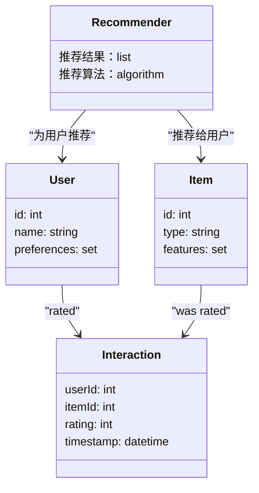
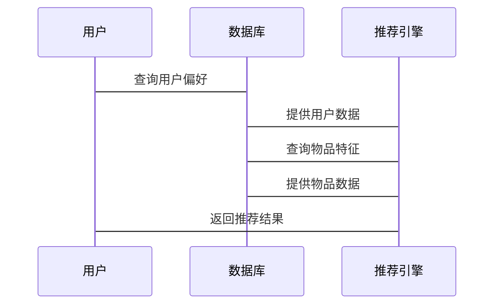

                 


# 第一部分: 企业级推荐引擎的背景与核心概念

## 第1章: 推荐引擎的基本概念与问题背景

### 1.1 推荐引擎的定义与作用
#### 1.1.1 推荐引擎的基本定义
推荐引擎是一种基于用户行为和偏好，利用算法和数据挖掘技术，为用户推荐相关内容或产品的智能系统。它通过分析用户的历史数据、行为模式和交互记录，预测用户的兴趣和需求，从而提供个性化的推荐结果。

#### 1.1.2 推荐引擎的核心作用
推荐引擎在企业级应用中扮演着关键角色，其主要作用包括：
- **提高用户体验**：通过个性化推荐，满足用户的需求，提升用户满意度和使用频率。
- **增加用户粘性**：通过持续的个性化推荐，吸引用户多次使用产品，增强用户忠诚度。
- **提升商业价值**：通过精准推荐，增加产品销量，提升广告点击率和转化率，从而为企业创造更大的商业价值。

#### 1.1.3 推荐引擎在企业中的应用价值
推荐引擎在多个行业和场景中都有广泛的应用，例如：
- **电商行业**：推荐用户可能感兴趣的商品，提高转化率和销售额。
- **媒体娱乐**：推荐用户可能喜欢的视频、音乐、文章，增加用户观看时间和互动。
- **金融行业**：推荐适合用户的金融产品，如理财产品、保险产品等。
- **教育行业**：推荐适合学习者的课程和资源，提升学习效果和用户满意度。

### 1.2 推荐引擎的问题背景
#### 1.2.1 用户需求的多样性
用户的需求是多样化和动态变化的，不同用户有不同的偏好和兴趣。例如，一个用户可能喜欢流行音乐，而另一个用户可能喜欢古典音乐。这种多样性使得推荐引擎需要具备高度的个性化能力，以满足不同用户的需求。

#### 1.2.2 信息过载的挑战
随着互联网的快速发展，信息量呈爆炸式增长，用户在面对海量信息时，往往难以找到自己真正感兴趣的内容。推荐引擎通过筛选和排序，帮助用户快速找到有价值的内容，缓解信息过载的问题。

#### 1.2.3 个性化推荐的必要性
个性化推荐是解决用户需求多样性和信息过载的关键手段。通过分析用户的偏好和行为模式，推荐引擎可以为每个用户提供定制化的内容或产品，提升用户体验和满意度。

### 1.3 推荐引擎的核心目标
#### 1.3.1 提高用户体验
推荐引擎通过个性化推荐，为用户提供符合其兴趣和需求的内容或产品，从而提升用户的使用体验和满意度。

#### 1.3.2 增加用户粘性
通过持续提供精准的推荐，推荐引擎可以增强用户对产品的依赖性和忠诚度，增加用户的活跃度和使用频率。

#### 1.3.3 提升商业价值
推荐引擎通过提高用户转化率和点击率，为企业创造更大的商业价值。例如，在电商行业中，精准的推荐可以显著提高销售额和客户满意度。

### 1.4 本章小结
本章介绍了推荐引擎的基本概念、作用和在企业中的应用价值。通过分析用户需求的多样性和信息过载的挑战，明确了个性化推荐的必要性。最后，总结了推荐引擎的核心目标，包括提高用户体验、增加用户粘性和提升商业价值。

---

## 第2章: 推荐引擎的核心概念与联系

### 2.1 推荐引擎的核心概念
#### 2.1.1 用户表示
用户表示是推荐引擎中对用户行为和偏好的建模方式。常用的方法包括：
- **基于用户行为的表示**：通过记录用户的点击、收藏、购买等行为，构建用户的兴趣模型。
- **基于用户属性的表示**：利用用户的年龄、性别、地理位置等属性信息，进行用户分群或画像。

#### 2.1.2 物品表示
物品表示是对推荐内容（如商品、视频、文章等）的特征建模。常见的物品表示方法包括：
- **基于物品属性的表示**：通过物品的分类、标签、描述等信息，构建物品的特征向量。
- **基于协同过滤的物品表示**：通过用户对物品的评分或行为数据，计算物品之间的相似性，形成物品的表示向量。

#### 2.1.3 用户-物品交互
用户与物品之间的交互数据是推荐引擎的重要输入。常见的交互数据包括：
- **评分数据**：用户对物品的评分，如1到5星评分。
- **点击数据**：用户点击物品的记录，表示用户的兴趣。
- **购买数据**：用户购买物品的记录，表示用户的消费行为。

### 2.2 推荐引擎的属性对比
#### 2.2.1 算法类型对比
推荐算法可以分为以下几类：
- **协同过滤（Collaborative Filtering）**：基于用户相似性或物品相似性进行推荐。
- **基于内容的推荐（Content-Based Recommendation）**：基于物品本身的特征进行推荐。
- **基于知识图谱的推荐（Knowledge-Based Recommendation）**：利用知识图谱中的语义关系进行推荐。
- **基于深度学习的推荐（Deep Learning-Based Recommendation）**：利用神经网络模型进行特征提取和推荐。

#### 2.2.2 数据来源对比
推荐引擎的数据来源可以分为：
- **显式数据**：用户主动提供的数据，如评分、偏好设置等。
- **隐式数据**：通过用户行为间接推断出的偏好，如点击、浏览、停留时间等。

#### 2.2.3 推荐实时性对比
推荐的实时性可以根据场景分为：
- **实时推荐**：基于最新的用户行为数据，实时生成推荐结果。
- **批量推荐**：定期生成推荐列表，适用于离线场景。

### 2.3 推荐引擎的ER实体关系图
```mermaid
erDiagram
    user {
        id : int
        name : string
        preferences : set
    }
    item {
        id : int
        type : string
        features : set
    }
    interaction {
        userId : int
        itemId : int
        rating : int
        timestamp : datetime
    }
    user --> interaction : "rated"
    item --> interaction : "was rated"
```

### 2.4 本章小结
本章详细介绍了推荐引擎的核心概念，包括用户表示、物品表示和用户-物品交互。通过对比不同推荐算法的类型、数据来源和实时性，帮助读者更好地理解推荐引擎的多样性和复杂性。最后，通过ER实体关系图展示了推荐系统的数据模型和实体关系。

---

## 第3章: 推荐引擎的算法原理与数学模型

### 3.1 协同过滤算法
#### 3.1.1 用户-用户协同过滤
用户-用户协同过滤基于用户之间的相似性进行推荐。具体步骤如下：
1. 计算用户之间的相似度，常用余弦相似度或皮尔逊相关系数。
2. 找到与目标用户相似度较高的用户群体。
3. 根据相似用户的偏好，推荐目标用户可能感兴趣的内容。

#### 3.1.2 物品-物品协同过滤
物品-物品协同过滤基于物品之间的相似性进行推荐。具体步骤如下：
1. 计算物品之间的相似度，常用余弦相似度或协同过滤算法。
2. 找到与目标物品相似度较高的物品群体。
3. 推荐与目标物品相似的物品给目标用户。

#### 3.1.3 协同过滤的数学模型
协同过滤的数学模型可以通过相似度计算公式表示。例如，基于余弦相似度的计算公式为：
$$
\text{similarity}(u_1, u_2) = \frac{\sum_{i=1}^{n} u_1(i) \cdot u_2(i)}{\sqrt{\sum_{i=1}^{n} u_1(i)^2} \cdot \sqrt{\sum_{i=1}^{n} u_2(i)^2}}
$$

### 3.2 基于内容的推荐算法
#### 3.2.1 基于内容的推荐原理
基于内容的推荐算法通过分析物品本身的特征，生成推荐结果。例如，基于文本内容的推荐可以通过计算文本的词袋模型或TF-IDF向量，生成推荐结果。

#### 3.2.2 基于内容的推荐数学模型
基于内容的推荐可以通过向量空间模型进行计算。例如，物品的特征向量可以表示为：
$$
v_i = (v_{i1}, v_{i2}, ..., v_{in})
$$
其中，$v_{ij}$表示物品i在第j个特征上的值。

### 3.3 基于深度学习的推荐算法
#### 3.3.1 基于神经网络的推荐模型
深度学习推荐模型通过神经网络进行特征提取和非线性关系建模。例如，使用多层感知机（MLP）或卷积神经网络（CNN）进行推荐。

#### 3.3.2 基于深度学习的推荐数学模型
深度学习推荐模型可以通过神经网络的层叠结构进行建模。例如，一个多层感知机的输出层可以通过以下公式表示：
$$
y = f(W_2 f(W_1 x) + b_2)
$$
其中，$x$是输入向量，$W_1$和$W_2$是权重矩阵，$b_2$是偏置项，$f$是非线性激活函数。

### 3.4 推荐算法的优缺点对比
#### 3.4.1 协同过滤的优缺点
- **优点**：考虑了用户行为数据，推荐结果具有较高的相关性。
- **缺点**：计算复杂度较高，难以实时处理大规模数据。

#### 3.4.2 基于内容的推荐优缺点
- **优点**：推荐结果与用户兴趣高度相关，推荐内容具有较高的可解释性。
- **缺点**：难以处理用户行为数据，推荐结果可能不够个性化。

#### 3.4.3 深度学习推荐的优缺点
- **优点**：能够捕捉复杂的非线性关系，推荐结果更加精准。
- **缺点**：模型复杂度高，训练时间和计算资源需求较大。

### 3.5 本章小结
本章详细介绍了推荐引擎的主要算法原理，包括协同过滤、基于内容的推荐和基于深度学习的推荐算法。通过对比不同算法的优缺点，帮助读者选择合适的推荐方法。最后，通过数学公式和流程图展示了推荐算法的实现过程。

---

## 第4章: 推荐引擎的系统分析与架构设计

### 4.1 系统分析
#### 4.1.1 问题场景介绍
推荐引擎的系统分析需要考虑以下几个方面：
- **用户需求分析**：明确用户的核心需求和使用场景。
- **数据来源分析**：确定推荐引擎所需的数据来源和数据格式。
- **性能需求分析**：评估推荐系统的响应时间和处理能力。

#### 4.1.2 项目介绍
推荐引擎的项目介绍需要包括：
- **项目目标**：明确推荐系统的功能目标。
- **项目范围**：定义推荐系统的覆盖范围和用户群体。
- **项目约束**：列出项目的资源限制和技术约束。

### 4.2 系统功能设计
#### 4.2.1 领域模型
推荐系统的领域模型可以通过mermaid类图表示：


#### 4.2.2 系统架构设计
推荐系统的架构设计可以通过mermaid架构图表示：


#### 4.2.3 系统接口设计
推荐系统的接口设计需要包括：
- **用户接口**：用于接收用户输入和展示推荐结果。
- **数据接口**：用于获取用户行为数据和物品特征数据。
- **推荐接口**：用于调用推荐算法，生成推荐结果。

#### 4.2.4 系统交互流程
推荐系统的交互流程可以通过mermaid序列图表示：


### 4.3 本章小结
本章详细介绍了推荐引擎的系统分析与架构设计，包括问题场景介绍、项目介绍、系统功能设计和系统交互流程。通过mermaid图展示了系统的类图、架构图和交互图，帮助读者更好地理解推荐系统的整体结构和协作方式。

---

## 第5章: 推荐引擎的项目实战

### 5.1 环境安装与配置
推荐引擎的项目实战需要以下环境：
- **编程语言**：Python 3.x
- **开发工具**：PyCharm、VS Code等
- **推荐算法库**：scikit-learn、TensorFlow、Keras等
- **数据存储**：MySQL、MongoDB等

#### 5.1.1 安装Python环境
```bash
# 安装Python
sudo apt-get install python3 python3-pip
# 安装推荐算法库
pip install scikit-learn tensorflow keras
```

#### 5.1.2 数据库安装与配置
```bash
# 安装MySQL
sudo apt-get install mysql-server mysql-client
# 配置MySQL
sudo mysql_secure_installation
```

### 5.2 系统核心实现
#### 5.2.1 推荐算法实现
以下是基于协同过滤的推荐算法实现：
```python
from sklearn.metrics.pairwise import cosine_similarity

# 用户-用户协同过滤实现
def user_based_recommender(user_id, user_features):
    # 计算用户之间的相似度
    similarity = cosine_similarity(user_features)
    # 找到与目标用户相似度较高的用户
    similar_users = similarity[user_id].argsort()[::-1]
    # 返回推荐结果
    return similar_users[1:]  # 排除自己
```

#### 5.2.2 推荐系统实现
以下是推荐系统的整体实现：
```python
import pandas as pd
from sklearn.metrics.pairwise import cosine_similarity

# 加载数据
user_data = pd.read_csv('user.csv')
item_data = pd.read_csv('item.csv')
interaction_data = pd.read_csv('interaction.csv')

# 构建用户特征向量
user_features = user_data[['age', 'gender', 'preferences']]
# 构建物品特征向量
item_features = item_data[['category', 'tags', 'description']]

# 计算用户-用户相似度
similarity = cosine_similarity(user_features)
# 为目标用户生成推荐
recommended_items = user_based_recommender(target_user_id, similarity)
```

### 5.3 代码解读与分析
#### 5.3.1 数据加载
使用Pandas加载用户数据、物品数据和交互数据，构建特征向量。

#### 5.3.2 用户-用户协同过滤实现
通过余弦相似度计算用户之间的相似度，为目标用户推荐相似用户的物品。

#### 5.3.3 系统交互流程
用户输入目标用户ID，系统调用推荐算法，生成推荐结果并返回。

### 5.4 实际案例分析
#### 5.4.1 案例背景
以电商推荐为例，用户A的购买历史包括电子产品、家居用品等，系统需要推荐与用户A兴趣相似的其他用户购买的商品。

#### 5.4.2 推荐结果分析
推荐结果包括与用户A相似度较高的用户B、C、D的购买记录，系统根据这些记录生成推荐列表。

### 5.5 项目小结
本章通过实际案例展示了推荐引擎的实现过程，包括环境配置、算法实现、系统交互和案例分析。通过代码示例和流程图，帮助读者理解推荐系统的具体实现细节。

---

## 第6章: 推荐引擎的最佳实践

### 6.1 实践中的注意事项
#### 6.1.1 数据质量
推荐系统的性能很大程度上依赖于数据质量。需要确保数据的完整性和准确性，避免噪声数据对推荐结果的影响。

#### 6.1.2 模型选择
根据具体的业务场景和数据特点，选择合适的推荐算法。例如，对于实时性要求较高的场景，可以选择基于协同过滤的实时推荐算法。

#### 6.1.3 模型调优
推荐系统的性能优化需要进行模型调优，包括参数优化、特征选择和模型融合等。

### 6.2 推荐系统的优化技巧
#### 6.2.1 基于规则的优化
通过设定一些规则，如过滤低频物品、排除冷启动问题等，优化推荐系统的性能。

#### 6.2.2 基于模型的优化
通过模型融合、特征工程和超参数调优等方法，提升推荐系统的准确性和召回率。

#### 6.2.3 基于实时性的优化
通过分布式计算、流处理和缓存优化等技术，提升推荐系统的实时性和响应速度。

### 6.3 拓展阅读与学习资源
#### 6.3.1 推荐系统相关书籍
- 《推荐系统实战：方法、技巧与案例分析》
- 《机器学习实战：基于Scikit-learn和TensorFlow》

#### 6.3.2 在线学习资源
- Coursera：推荐系统与机器学习课程
- edX：数据科学与推荐系统课程

### 6.4 本章小结
本章总结了推荐系统在实际应用中的注意事项和优化技巧，帮助读者在实际项目中避免常见错误。最后，提供了拓展阅读和学习资源，帮助读者进一步深入学习推荐系统相关知识。

---

## 第7章: 总结与展望

### 7.1 本章总结
推荐引擎作为一种重要的智能化技术，广泛应用于各个行业和场景。通过本文的介绍，读者可以深入了解推荐引擎的核心概念、算法原理和系统架构设计。通过实际案例分析和项目实战，读者可以掌握推荐系统的实现方法和优化技巧。

### 7.2 未来展望
随着人工智能和大数据技术的不断发展，推荐引擎将更加智能化和个性化。未来的推荐系统将更加注重实时性、多样性和可解释性，结合知识图谱、强化学习和图神经网络等技术，推荐系统将具备更强的推理能力和更高的推荐精度。

### 7.3 致谢
感谢读者的耐心阅读，希望本文能为推荐系统的研究和实践提供有价值的参考。

---

## 作者信息

作者：AI天才研究院/AI Genius Institute & 禅与计算机程序设计艺术 /Zen And The Art of Computer Programming

---

**摘要**：  
推荐引擎是一种基于用户行为和偏好，利用算法和数据挖掘技术，为用户推荐相关内容或产品的智能系统。本文从推荐引擎的核心概念、算法原理、系统架构设计、项目实战和最佳实践等多个方面进行了详细探讨。通过分析用户需求的多样性和信息过载的挑战，明确了个性化推荐的必要性。最后，通过实际案例分析和项目实战，帮助读者掌握推荐系统的实现方法和优化技巧。

