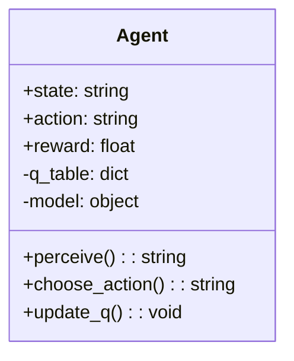
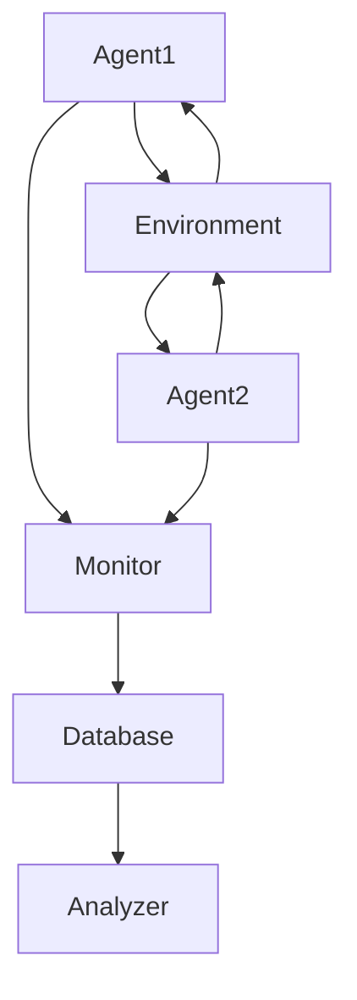

                 


# 构建可持续发展的AI Agent生态系统

---

## 关键词  
AI Agent, 可持续发展, 人工智能, 系统架构, 生态设计, 多 Agent 系统, 系统集成

---

## 摘要  
AI Agent（人工智能代理）作为一种能够感知环境、自主决策、执行任务的智能体，正在成为推动智能化系统发展的核心力量。构建一个可持续发展的AI Agent生态系统，不仅需要考虑技术的先进性，还需要关注系统的可扩展性、可维护性和生态友好性。本文将从AI Agent的基本概念出发，深入分析其核心算法原理，探讨系统的架构设计，并结合实际案例，详细阐述如何构建一个高效、稳定且可持续发展的AI Agent生态系统。

---

# 第一部分: AI Agent生态系统背景与概念

## 第1章: AI Agent生态系统概述

### 1.1 AI Agent的基本概念  
AI Agent是指能够感知环境、自主决策、执行任务的智能体。它可以是一个软件程序，也可以是一个物理设备，通过传感器和执行器与环境交互。AI Agent的核心特征包括自主性、反应性、目标导向性和学习能力。

#### 1.1.1 什么是AI Agent  
AI Agent是一种能够感知环境、理解需求、自主决策并执行任务的智能实体。它可以独立工作，也可以与其他Agent或人类协同完成复杂任务。  

例如，智能家居中的语音助手（如Alexa）就是一个典型的AI Agent，它能够理解用户的指令、执行操作并反馈结果。

#### 1.1.2 AI Agent的核心特征  
1. **自主性**：AI Agent能够自主决策，无需外部干预。  
2. **反应性**：能够实时感知环境变化并做出反应。  
3. **目标导向性**：具有明确的目标，能够为实现目标优化行为。  
4. **学习能力**：通过数据和经验不断优化自身性能。  

#### 1.1.3 AI Agent与传统AI的区别  
传统AI主要关注任务的解决，而AI Agent更注重与环境的动态交互。例如，传统AI可能只是识别图像，而AI Agent则需要根据识别结果采取行动。

### 1.2 AI Agent生态系统的重要性  
AI Agent生态系统是一个由多个AI Agent及其交互环境组成的复杂系统。构建一个高效的生态系统需要考虑以下几个方面：

#### 1.2.1 生态系统的定义与特点  
AI Agent生态系统是一个由多个AI Agent、环境、用户和交互机制组成的系统。其特点包括：  
1. **分布式性**：多个Agent协同工作，而非集中控制。  
2. **动态性**：环境和任务需求不断变化。  
3. **协作性**：Agent之间需要高效协作以完成复杂任务。  

#### 1.2.2 AI Agent生态系统的核心要素  
1. **Agent**：系统的主体，负责感知和执行任务。  
2. **环境**：Agent所处的物理或数字环境。  
3. **交互机制**：Agent之间的通信和协作方式。  
4. **用户**：系统的最终使用者，提供输入和反馈。  

#### 1.2.3 可持续发展的必要性  
AI Agent生态系统需要具备可持续性，以应对长期运行中的挑战：  
1. **资源消耗**：减少能源消耗，提高效率。  
2. **系统稳定性**：确保系统在复杂环境中的稳定运行。  
3. **可扩展性**：支持Agent数量和复杂度的增加。  

### 1.3 可持续发展的必要性  
可持续发展是构建AI Agent生态系统的核心目标。只有具备可持续性，系统才能在长期运行中保持高效和稳定。

#### 1.3.1 可持续发展的定义  
可持续发展是指在满足当前需求的同时，不损害后代满足其需求的能力。在AI Agent生态系统中，可持续性意味着系统能够长期高效运行，同时减少资源消耗和环境影响。

#### 1.3.2 AI Agent生态系统面临的挑战  
1. **资源限制**：计算资源和能源的有限性。  
2. **动态环境**：环境的不确定性和变化性。  
3. **协作复杂性**：多个Agent之间的协调与协作。  

#### 1.3.3 可持续发展的关键因素  
1. **高效算法**：优化算法以减少资源消耗。  
2. **分布式架构**：避免单点依赖，提高系统的容错性和扩展性。  
3. **自适应能力**：系统能够根据环境变化自动调整。  

## 第2章: AI Agent生态系统的核心概念  

### 2.1 AI Agent的类型与特点  

#### 2.1.1 单一AI Agent  
单一AI Agent是一个独立运行的智能体，通常用于简单的任务。例如，一个自动贩卖机的控制系统就是一个单一AI Agent。

#### 2.1.2 多Agent系统  
多Agent系统由多个Agent组成，能够协同完成复杂任务。例如，交通管理系统中的多个交通信号控制Agent协同工作以优化交通流量。

#### 2.1.3 基于模型的Agent  
基于模型的Agent通过构建环境模型来做出决策。例如，机器人通过内部模型预测物体的运动轨迹。

### 2.2 AI Agent的能力与属性  

#### 2.2.1 感知能力  
AI Agent需要通过传感器或数据源感知环境。例如，自动驾驶汽车通过摄像头、雷达等传感器感知周围环境。

#### 2.2.2 决策能力  
AI Agent需要根据感知信息做出决策。例如，智能助手根据用户的查询内容决定如何响应。

#### 2.2.3 学习能力  
AI Agent能够通过经验优化自身性能。例如，推荐系统通过用户行为数据不断优化推荐算法。

### 2.3 AI Agent生态系统中的角色  

#### 2.3.1 用户角色  
用户是AI Agent系统的最终使用者，负责提供输入和反馈。例如，智能家居用户通过语音指令与AI Agent交互。

#### 2.3.2 管理角色  
管理者负责系统的配置、监控和维护。例如，企业IT部门负责管理内部AI Agent系统的运行状态。

#### 2.3.3 开发者角色  
开发者负责设计和实现AI Agent的核心功能。例如，软件工程师编写AI Agent的算法和代码。

---

## 第二部分: AI Agent生态系统的算法原理  

## 第3章: AI Agent的核心算法  

### 3.1 强化学习算法  

#### 3.1.1 强化学习的基本原理  
强化学习是一种通过试错机制优化决策的算法。Agent通过与环境交互，获得奖励或惩罚，从而优化自身的决策策略。

#### 3.1.2 算法流程  
1. 状态感知：Agent感知当前环境状态。  
2. 动作选择：基于当前状态选择一个动作。  
3. 状态转移：执行动作，环境状态发生变化。  
4. 奖励计算：根据新状态计算奖励。  
5. 策略更新：根据奖励更新决策策略。  

#### 3.1.3 实现代码  
```python
class Agent:
    def __init__(self, state_space, action_space):
        self.state_space = state_space
        self.action_space = action_space
        self.q_table = {}  # Q-learning 表

    def perceive(self, state):
        return state  # 实际实现中，应根据传感器获取状态

    def choose_action(self, state):
        if state not in self.q_table:
            self.q_table[state] = 0  # 初始化Q值
        max_action = max(self.q_table.keys(), key=lambda x: self.q_table[x])
        return max_action

    def update_q(self, state, action, reward, next_state):
        self.q_table[state] = self.q_table[state] + 0.1 * (reward + max(self.q_table.get(next_state, 0) - self.q_table[state]))
```

### 3.2 监督学习算法  

#### 3.2.1 监督学习的基本原理  
监督学习是一种通过标注数据训练模型的算法。Agent通过学习标注数据，预测新的输入的输出。

#### 3.2.2 算法流程  
1. 数据准备：收集标注数据。  
2. 模型训练：使用训练数据训练模型。  
3. 模型预测：对新输入进行预测。  
4. 模型优化：根据预测结果优化模型。  

#### 3.2.3 实现代码  
```python
from sklearn.linear_model import LinearRegression

class SupervisedAgent:
    def __init__(self):
        self.model = LinearRegression()

    def train(self, X, y):
        self.model.fit(X, y)

    def predict(self, X):
        return self.model.predict(X)
```

### 3.3 组合算法  

#### 3.3.1 组合算法的基本原理  
组合算法是将多种算法结合起来，以提高系统的整体性能。例如，结合强化学习和监督学习，以优化Agent的决策能力。

#### 3.3.2 实现代码  
```python
class HybridAgent:
    def __init__(self):
        self.rl_agent = Agent()  # 强化学习Agent
        self.sl_agent = SupervisedAgent()  # 监督学习Agent

    def decide(self, state):
        # 使用强化学习Agent选择动作
        action_rl = self.rl_agent.choose_action(state)
        # 使用监督学习Agent预测结果
        prediction_sl = self.sl_agent.predict(state)
        # 综合决策
        if prediction_sl > 0.5:
            return action_rl
        else:
            return None  # 默认动作
```

---

## 第三部分: AI Agent生态系统的系统分析与架构设计  

## 第4章: AI Agent系统的系统分析  

### 4.1 问题场景介绍  

#### 4.1.1 问题背景  
假设我们正在开发一个智能家居系统，需要多个AI Agent协同工作，例如温度控制、灯光控制和安全监控等。

#### 4.1.2 系统需求  
1. 实现多个AI Agent的协同工作。  
2. 确保系统的高效性和稳定性。  
3. 支持系统的可扩展性。  

### 4.2 系统功能设计  

#### 4.2.1 领域模型设计  


#### 4.2.2 系统架构设计  


#### 4.2.3 系统接口设计  
1. Agent与环境的接口：传感器和执行器。  
2. Agent之间的接口：通信协议和数据交换格式。  
3. 管理接口：监控和维护系统的接口。  

### 4.3 系统架构设计  

#### 4.3.1 分布式架构  
采用分布式架构，避免单点故障。例如，使用微服务架构设计多个Agent模块。

#### 4.3.2 容错机制  
设计容错机制，确保系统在部分节点故障时仍能正常运行。例如，使用负载均衡和故障转移技术。

#### 4.3.3 可扩展性设计  
设计模块化的架构，支持新Agent的动态加入和退出。例如，使用插件式架构。

---

## 第五部分: AI Agent生态系统的项目实战  

## 第5章: 项目实战  

### 5.1 环境安装  

#### 5.1.1 安装Python  
确保系统中安装了Python 3.8及以上版本。

#### 5.1.2 安装依赖库  
安装必要的Python库，例如：
```bash
pip install numpy scikit-learn matplotlib
```

### 5.2 系统核心实现  

#### 5.2.1 实现AI Agent  
实现一个简单的强化学习Agent：
```python
import numpy as np

class SimpleAgent:
    def __init__(self, state_space, action_space):
        self.state_space = state_space
        self.action_space = action_space
        self.q_table = {}  # Q-learning 表

    def perceive(self, state):
        return state

    def choose_action(self, state):
        if state not in self.q_table:
            self.q_table[state] = np.random.random()  # 初始化Q值
        max_action = max(self.q_table.keys(), key=lambda x: self.q_table[x])
        return max_action

    def update_q(self, state, action, reward, next_state):
        self.q_table[state] = self.q_table[state] + 0.1 * (reward + max(self.q_table.get(next_state, 0) - self.q_table[state]))
```

#### 5.2.2 实现多Agent系统  
实现一个多Agent系统：
```python
class MultiAgentSystem:
    def __init__(self, num_agents):
        self.agents = [SimpleAgent() for _ in range(num_agents)]

    def run(self):
        for agent in self.agents:
            state = agent.perceive("environment_state")
            action = agent.choose_action(state)
            reward = agent.update_q(state, action, "reward", "next_state")
```

### 5.3 实际案例分析  

#### 5.3.1 案例介绍  
以智能家居系统为例，实现多个AI Agent的协同工作。

#### 5.3.2 代码实现  
```python
class SmartHomeAgent(MultiAgentSystem):
    def __init__(self):
        super().__init__(3)
        self.environment = "smart_home"

    def perceive(self):
        # 获取环境信息
        return "temperature=25, humidity=50"

    def execute_action(self, action):
        # 执行动作
        print(f"执行动作：{action}")

agent = SmartHomeAgent()
agent.run()
```

---

## 第六部分: AI Agent生态系统的最佳实践  

## 第6章: 最佳实践  

### 6.1 核心Tips  
1. **模块化设计**：确保系统的模块化和可扩展性。  
2. **容错机制**：设计容错机制以提高系统的稳定性。  
3. **资源优化**：优化算法和架构以减少资源消耗。  

### 6.2 小结  
构建一个可持续发展的AI Agent生态系统需要从算法设计、系统架构和实际应用等多个方面综合考虑。只有确保系统的高效性、稳定性和可扩展性，才能真正实现可持续发展。

### 6.3 注意事项  
1. **数据隐私**：确保系统中数据的隐私性和安全性。  
2. **用户反馈**：及时收集和处理用户的反馈，优化系统性能。  
3. **持续优化**：定期监控和优化系统，确保其长期稳定运行。  

### 6.4 拓展阅读  
1. **强化学习经典论文**：阅读DeepMind的《Deep Q-Networks》论文。  
2. **分布式系统设计**：学习分布式系统设计的经典书籍，例如《分布式系统：概念与设计》。  

---

## 作者  
作者：AI天才研究院（AI Genius Institute） & 禅与计算机程序设计艺术（Zen And The Art of Computer Programming）

---

这篇文章从AI Agent的基本概念出发，详细讲解了构建可持续发展的AI Agent生态系统的各个方面，包括算法原理、系统架构设计和实际项目实现。通过理论与实践相结合的方式，帮助读者全面理解和掌握AI Agent生态系统的核心内容。

