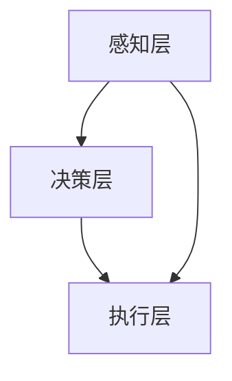
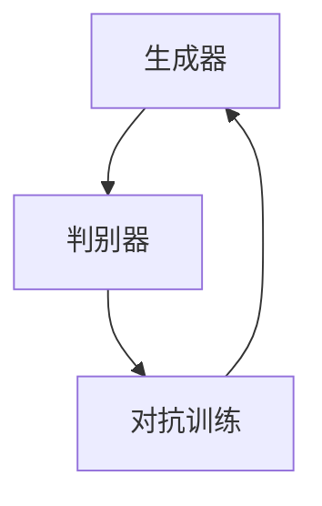
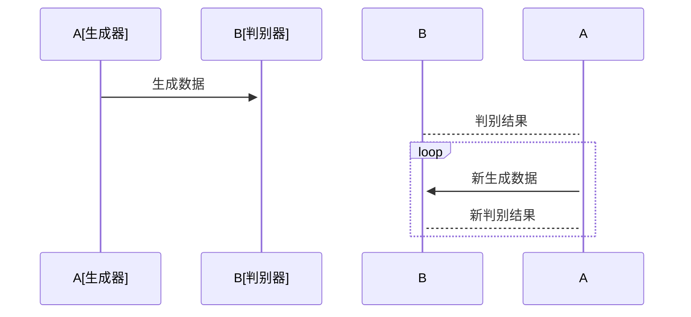

                 


# AI Agent中的对抗学习与鲁棒性增强

## 关键词：
- AI Agent
- 对抗学习
- 鲁棒性增强
- 深度学习
- 对抗训练

## 摘要：
本文深入探讨了AI Agent在对抗环境中的学习机制与鲁棒性增强方法。首先，我们介绍了对抗学习的基本概念及其在AI Agent中的应用场景。接着，通过数学模型和算法流程图，详细分析了对抗学习的原理及其对AI Agent鲁棒性提升的贡献。随后，我们从系统架构的角度，探讨了AI Agent在对抗环境中的设计与实现，并通过实际案例展示了对抗学习与鲁棒性增强技术在AI Agent中的具体应用。最后，本文总结了对抗学习与鲁棒性增强的重要性，并展望了未来的研究方向。

---

## 第一部分：AI Agent中的对抗学习与鲁棒性增强基础

### 第1章：对抗学习的起源与背景

#### 1.1 对抗学习的基本概念
##### 1.1.1 对抗训练的起源与发展
对抗学习（Adversarial Learning）是一种基于博弈论的机器学习方法，其核心思想是通过两个或多个模型之间的对抗训练来提升模型的性能。对抗学习的概念最早可以追溯到20世纪80年代，但真正的发展得益于生成对抗网络（GANs）的提出。近年来，对抗学习在计算机视觉、自然语言处理等领域取得了显著成果。

##### 1.1.2 对抗学习的核心思想
对抗学习的核心思想是通过两个模型（生成器和判别器）之间的博弈过程，使得生成器生成的数据能够欺骗判别器，而判别器则试图区分真实数据和生成数据。这种对抗过程使得生成器和判别器不断优化，最终达到纳什均衡。

##### 1.1.3 对抗学习与传统机器学习的对比
与传统机器学习方法相比，对抗学习的独特之处在于其通过引入对抗机制，使得模型能够更好地适应复杂环境。传统机器学习通常依赖于大量标注数据和固定的损失函数，而对抗学习则通过动态的对抗过程，提高了模型的泛化能力和鲁棒性。

#### 1.2 AI Agent中的对抗场景
##### 1.2.1 AI Agent的基本概念
AI Agent是一种能够感知环境、自主决策并执行任务的智能体。它通常由感知层、决策层和执行层组成，能够根据环境反馈调整自身行为。

##### 1.2.2 对抗环境中的AI Agent
在对抗环境中，AI Agent需要面对具有敌意的对手。例如，在游戏AI中，对手会试图阻止AI Agent达成目标；在网络安全中，攻击者会试图破坏AI Agent的正常运行。

##### 1.2.3 对抗学习在AI Agent中的应用领域
对抗学习在AI Agent中的应用非常广泛，包括游戏AI、自动驾驶、网络安全、机器人控制等领域。通过对抗训练，AI Agent能够更好地应对动态变化的对抗环境。

#### 1.3 鲁棒性增强的重要性
##### 1.3.1 鲁棒性在AI系统中的意义
鲁棒性是指AI系统在面对干扰、噪声和对抗攻击时，仍然能够保持正常功能的能力。在对抗环境中，鲁棒性尤为重要，因为对手会试图通过攻击来破坏AI Agent的性能。

##### 1.3.2 对抗攻击对AI Agent的影响
对抗攻击是指通过人为构造的输入数据，使得AI Agent产生错误行为。例如，在图像识别任务中，攻击者可以通过添加噪声或修改图像内容，使得模型识别错误。

##### 1.3.3 鲁棒性增强的目标与方法
鲁棒性增强的目标是提高AI Agent在对抗环境中的抗干扰能力。常见的鲁棒性增强方法包括对抗训练、模型正则化、鲁棒优化等。

---

### 第2章：对抗学习的核心概念与原理

#### 2.1 对抗学习的数学模型
##### 2.1.1 最小化最大化问题
对抗学习的核心数学模型是基于最小化最大化问题。生成器的目标是最小化判别器的损失，而判别器的目标是最大化区分真实数据和生成数据的损失。

##### 2.1.2 对抗损失函数
对抗损失函数通常由生成器的损失和判别器的损失组成。通过交替优化这两个损失，生成器和判别器的参数不断更新，最终达到对抗平衡。

##### 2.1.3 对抗训练的优化过程
对抗训练的优化过程通常包括以下几个步骤：
1. 固定生成器，优化判别器的参数。
2. 固定判别器，优化生成器的参数。
3. 重复上述步骤，直到模型收敛。

#### 2.2 对抗学习的算法流程
##### 2.2.1 对抗训练的基本流程
1. 初始化生成器和判别器的参数。
2. 训练判别器，使其能够区分真实数据和生成数据。
3. 训练生成器，使其生成的数据能够欺骗判别器。
4. 重复训练过程，逐步优化模型性能。

##### 2.2.2 对抗网络的结构设计
对抗网络通常由生成器和判别器两部分组成。生成器负责生成数据，判别器负责区分真实数据和生成数据。两者的结构设计需要相互匹配，以确保对抗训练的有效性。

##### 2.2.3 对抗训练的收敛性分析
对抗训练的收敛性分析是一个复杂的问题。通常情况下，生成器和判别器的损失函数需要同时优化，以确保模型能够收敛到纳什均衡点。

#### 2.3 对抗学习与鲁棒性增强的关系
##### 2.3.1 对抗学习如何提升鲁棒性
对抗学习通过引入对抗机制，使得模型在面对对抗攻击时具有更强的鲁棒性。生成器的训练过程使得模型能够抵抗对手的干扰。

##### 2.3.2 鲁棒性增强对对抗学习的反哺作用
鲁棒性增强技术能够提高对抗学习的效果。通过增强模型的鲁棒性，对抗学习的训练过程更加稳定，模型性能更加优异。

##### 2.3.3 对抗学习与鲁棒性增强的协同优化
通过协同优化对抗学习和鲁棒性增强技术，可以进一步提升AI Agent的性能。这种协同优化在游戏AI、自动驾驶等领域具有重要应用。

---

### 第3章：对抗学习的数学模型与公式

#### 3.1 对抗训练的数学表达
##### 3.1.1 最小化最大化问题的数学形式
对抗训练的目标是最小化生成器的损失，同时最大化判别器的损失。数学表达如下：
$$ \min_{G} \max_{D} \mathbb{E}_{x \sim P_{\text{data}}}[f(x)] - \mathbb{E}_{z \sim P_{z}}[f(G(z))] $$

##### 3.1.2 对抗损失函数的公式推导
对抗损失函数通常由两部分组成：判别器的损失和生成器的损失。数学表达如下：
$$ L_{\text{D}} = -\mathbb{E}_{x \sim P_{\text{data}}}[\log D(x)] - \mathbb{E}_{z \sim P_{z}}[\log(1 - D(G(z)))] $$
$$ L_{\text{G}} = -\mathbb{E}_{z \sim P_{z}}[\log D(G(z))] $$

##### 3.1.3 对抗训练的优化目标
对抗训练的优化目标是同时优化生成器和判别器的参数，使得两者的损失函数达到平衡。数学表达如下：
$$ \min_{G} \max_{D} L_{\text{D}} + L_{\text{G}} $$

#### 3.2 对抗网络的结构与参数
##### 3.2.1 生成器与判别器的参数空间
生成器和判别器的参数空间需要相互匹配，以确保对抗训练的有效性。通常情况下，生成器和判别器的结构需要相互协调，以达到对抗平衡。

##### 3.2.2 对抗训练中的权重
在对抗训练中，生成器和判别器的权重需要合理分配。通常情况下，生成器和判别器的损失函数需要同时优化，以确保模型能够收敛到纳什均衡点。

##### 3.2.3 对抗训练中的梯度计算
对抗训练中的梯度计算需要考虑生成器和判别器的参数更新。通常情况下，生成器和判别器的梯度需要分别计算，并交替优化。

---

## 第二部分：AI Agent中的对抗学习与鲁棒性增强实践

### 第4章：对抗学习在AI Agent中的系统分析与架构设计

#### 4.1 问题场景介绍
在对抗环境中，AI Agent需要面对来自对手的干扰和攻击。例如，在游戏AI中，对手会试图阻止AI Agent达成目标；在网络安全中，攻击者会试图破坏AI Agent的正常运行。

#### 4.2 系统功能设计
##### 4.2.1 领域模型（ER实体关系图）
通过ER模型，我们可以清晰地看到AI Agent在对抗环境中的角色和功能。生成器和判别器分别对应不同的实体，它们之间的关系通过对抗训练建立。

```mermaid
erd Diagram
actor 对抗环境 {
  对抗环境是一个包含生成器和判别器的系统。
}
actor 生成器 {
  生成器负责生成数据。
}
actor 判别器 {
  判别器负责区分真实数据和生成数据。
}
```

##### 4.2.2 系统架构设计
AI Agent的系统架构通常包括感知层、决策层和执行层。通过Mermaid图，我们可以清晰地看到各层之间的关系和交互。



##### 4.2.3 系统接口设计
系统接口设计需要考虑生成器和判别器之间的交互。通过Mermaid图，我们可以清晰地看到系统接口的交互流程。



##### 4.2.4 系统交互设计
系统交互设计需要考虑生成器和判别器之间的交互过程。通过Mermaid图，我们可以清晰地看到系统交互的流程。



#### 4.3 项目实战
##### 4.3.1 环境安装
在开始对抗学习的实战之前，需要确保安装好所需的开发环境。通常情况下，我们需要安装Python、TensorFlow或PyTorch等深度学习框架。

##### 4.3.2 系统核心实现源代码
以下是一个简单的生成器和判别器的实现代码：

```python
import tensorflow as tf
from tensorflow.keras.layers import Dense, Input
from tensorflow.keras.models import Model

# 生成器
def build_generator():
    input = Input(shape=(100,))
    x = Dense(256, activation='relu')(input)
    x = Dense(784, activation='sigmoid')(x)
    model = Model(inputs=input, outputs=x)
    return model

# 判别器
def build_discriminator():
    input = Input(shape=(784,))
    x = Dense(256, activation='relu')(input)
    x = Dense(1, activation='sigmoid')(x)
    model = Model(inputs=input, outputs=x)
    return model
```

##### 4.3.3 代码应用解读与分析
上述代码定义了一个简单的生成器和判别器。生成器负责生成数据，判别器负责区分真实数据和生成数据。通过交替训练生成器和判别器，我们可以实现对抗训练。

##### 4.3.4 实际案例分析和详细讲解剖析
以下是一个简单的对抗训练案例：

```python
generator = build_generator()
discriminator = build_discriminator()

# 对抗训练过程
for epoch in range(100):
    # 固定生成器，优化判别器
    for _ in range(2):
        noise = tf.random.normal([batch_size, 100])
        generated = generator(noise)
        real_labels = tf.ones([batch_size, 1])
        fake_labels = tf.zeros([batch_size, 1])
        # 判别器的损失
        loss_d = tf.keras.losses.binary_crossentropy(real_labels, discriminator(real_labels)) + \
                 tf.keras.losses.binary_crossentropy(fake_labels, discriminator(fake_labels))
        discriminator.trainable = True
        generator.trainable = False
        discriminator.optimizer.minimize(loss_d, variables=discriminator.trainable_weights)
    
    # 固定判别器，优化生成器
    noise = tf.random.normal([batch_size, 100])
    generated = generator(noise)
    real_labels = tf.ones([batch_size, 1])
    fake_labels = tf.zeros([batch_size, 1])
    loss_g = tf.keras.losses.binary_crossentropy(real_labels, discriminator(generated))
    generator.trainable = True
    discriminator.trainable = False
    generator.optimizer.minimize(loss_g, variables=generator.trainable_weights)
```

##### 4.3.5 项目小结
通过上述案例，我们可以看到对抗训练的基本流程。生成器和判别器的交替训练使得模型能够不断优化，最终达到对抗平衡。

---

### 第5章：鲁棒性增强的实现与应用

#### 5.1 鲁棒性增强的核心技术
##### 5.1.1 模型正则化
模型正则化是一种常用的鲁棒性增强技术，通过在损失函数中添加正则化项，使得模型能够更好地适应对抗环境。

##### 5.1.2 鲁棒优化
鲁棒优化是一种基于最优化理论的鲁棒性增强方法，通过优化模型的损失函数，使得模型在面对对抗攻击时具有更强的鲁棒性。

##### 5.1.3 对抗训练
对抗训练是一种通过引入对抗机制来增强模型鲁棒性的技术。通过生成器和判别器的交替训练，模型能够更好地应对对抗环境。

#### 5.2 鲁棒性增强的具体实现
##### 5.2.1 对抗训练的实现
通过生成器和判别器的交替训练，我们可以实现对抗训练。生成器负责生成数据，判别器负责区分真实数据和生成数据。

##### 5.2.2 模型正则化
模型正则化可以通过在损失函数中添加正则化项来实现。例如，我们可以添加L2正则化项，以防止模型过拟合。

##### 5.2.3 鲁棒优化
鲁棒优化可以通过优化模型的损失函数，使得模型在面对对抗攻击时具有更强的鲁棒性。通常情况下，我们可以通过引入对抗样本的损失函数来实现鲁棒优化。

#### 5.3 鲁棒性增强的实际应用
##### 5.3.1 游戏AI
在游戏AI中，对抗训练可以帮助AI Agent更好地应对对手的攻击。

##### 5.3.2 自动驾驶
在自动驾驶中，鲁棒性增强技术可以帮助车辆更好地应对道路中的各种干扰和对抗攻击。

##### 5.3.3 网络安全
在网络安全中，鲁棒性增强技术可以帮助系统更好地应对网络攻击。

---

### 第6章：总结与展望

#### 6.1 总结
通过对抗学习与鲁棒性增强技术，我们可以显著提升AI Agent在对抗环境中的性能。对抗学习通过引入对抗机制，使得模型能够更好地适应复杂环境；鲁棒性增强技术通过优化模型的损失函数，使得模型在面对对抗攻击时具有更强的鲁棒性。

#### 6.2 展望
未来的研究方向包括：
1. 更高效的对抗训练算法。
2. 更强的鲁棒性增强技术。
3. 对抗学习与深度学习的结合。

#### 6.3 最佳实践Tips
1. 在实际应用中，建议优先选择对抗训练与鲁棒性增强的结合方案。
2. 对抗训练需要大量计算资源，建议使用分布式训练。
3. 鲁棒性增强技术可以显著提升模型的抗干扰能力。

---

## 作者：AI天才研究院/AI Genius Institute & 禅与计算机程序设计艺术 /Zen And The Art of Computer Programming

---

本文通过详细分析对抗学习与鲁棒性增强技术，深入探讨了AI Agent在对抗环境中的学习机制与鲁棒性提升方法。希望本文能够为相关领域的研究者和实践者提供有价值的参考。

