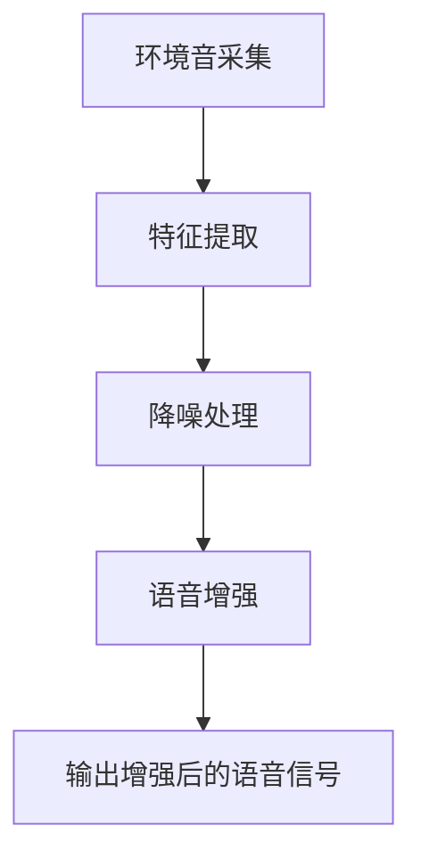
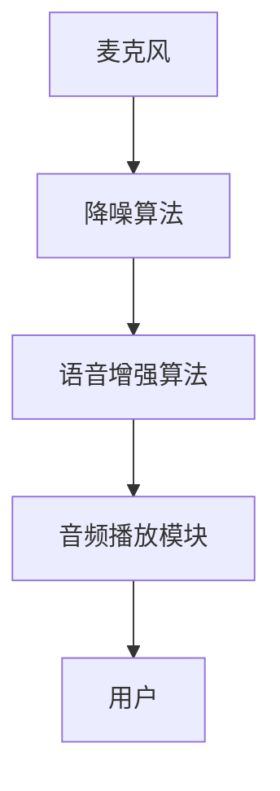
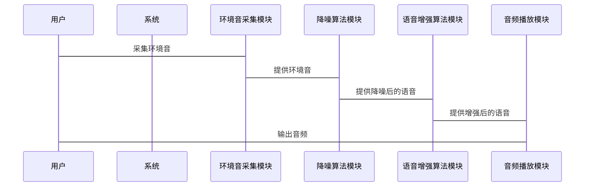

                 


# AI Agent在智能耳机中的环境音适应

## 关键词：AI Agent，智能耳机，环境音适应，自适应算法，音频处理，用户体验优化

## 摘要：本文探讨了AI Agent在智能耳机中的环境音适应技术，分析了环境音适应的核心概念，详细讲解了基于AI Agent的环境音适应算法原理，并通过系统架构设计和项目实战展示了如何实现这一技术。最后，提出了最佳实践建议，展望了未来的发展方向。

---

# 第一部分: AI Agent与环境音适应的背景介绍

## 第1章: AI Agent与环境音适应的背景介绍

### 1.1 AI Agent的核心概念
#### 1.1.1 AI Agent的定义与特点
AI Agent（智能代理）是一种能够感知环境并采取行动以实现目标的智能系统。其特点包括自主性、反应性、目标导向性和学习能力。AI Agent能够根据环境信息做出决策，并通过行动影响环境。

#### 1.1.2 环境音适应的定义与目标
环境音适应是指智能系统能够根据环境中的声音特征，调整自身的音频处理策略，以优化用户体验。目标是在复杂环境中实现清晰的音频传输和舒适的听觉体验。

#### 1.1.3 AI Agent在环境音适应中的作用
AI Agent能够实时感知环境音，分析其特征，并动态调整音频处理参数，从而实现环境音的优化适应。

### 1.2 环境音适应的问题背景
#### 1.2.1 环境音对耳机用户体验的影响
在嘈杂的环境中，耳机的音质会受到环境音的干扰，影响用户的听觉体验。例如，背景噪声、回声和语音失真等问题会影响用户体验。

#### 1.2.2 现有解决方案的局限性
传统耳机的环境音处理主要依赖固定的滤波器和预设算法，难以适应复杂多变的环境音。例如，在噪声较大的环境中，传统算法难以有效降噪，导致语音质量下降。

#### 1.2.3 AI Agent在环境音适应中的应用前景
AI Agent具有强大的学习和适应能力，能够实时感知环境音的变化，并动态调整音频处理策略。这为智能耳机的环境音适应提供了新的解决方案。

### 1.3 本章小结
本章介绍了AI Agent的核心概念和环境音适应的背景，分析了传统耳机在环境音处理中的局限性，以及AI Agent在环境音适应中的潜在优势。

---

# 第二部分: AI Agent与环境音适应的核心概念与联系

## 第2章: AI Agent与环境音适应的核心概念与联系

### 2.1 AI Agent的核心原理
#### 2.1.1 AI Agent的基本工作原理
AI Agent通过感知环境信息，利用机器学习算法进行分析和决策，并采取行动以实现目标。其核心流程包括感知、分析、决策和行动。

#### 2.1.2 AI Agent的感知与决策机制
AI Agent通过麦克风采集环境音，利用特征提取技术分析声音特征，并结合上下文信息进行决策。例如，AI Agent可以根据环境音的类型和强度调整降噪算法。

#### 2.1.3 AI Agent的自适应能力
AI Agent能够通过在线学习和反馈机制不断优化自身的处理策略。例如，AI Agent可以根据用户反馈调整降噪参数，以实现更优的音质。

### 2.2 环境音适应的核心原理
#### 2.2.1 环境音分析的基本方法
环境音分析包括噪声分类、语音识别和声源定位等技术。例如，AI Agent可以通过降噪算法消除背景噪声，提高语音清晰度。

#### 2.2.2 环境音分类与特征提取
环境音分类是将环境音分为不同的类别，例如白噪声、交通噪声和人声等。特征提取则是通过提取声音的时域、频域和时频域特征，为后续的分类和处理提供依据。

#### 2.2.3 环境音适应的目标函数与优化方法
环境音适应的目标是最大化音频质量，通常通过最小化噪声和失真来实现。优化方法包括基于梯度的优化算法和基于机器学习的端到端优化。

### 2.3 AI Agent与环境音适应的关系
#### 2.3.1 AI Agent在环境音适应中的角色
AI Agent作为智能耳机的核心，负责实时感知环境音，并动态调整音频处理参数。例如，AI Agent可以根据环境音的类型选择合适的降噪算法。

#### 2.3.2 环境音适应对AI Agent性能的影响
环境音适应的质量直接影响用户的听觉体验，同时也影响AI Agent的性能。例如，复杂的环境音可能导致AI Agent的处理延迟增加。

#### 2.3.3 AI Agent与环境音适应的协同优化
AI Agent和环境音适应是协同优化的关系。AI Agent通过环境音适应提升用户体验，而环境音适应则为AI Agent提供更准确的环境信息。

### 2.4 核心概念对比表
| 对比项         | AI Agent                 | 环境音适应               |
|----------------|--------------------------|--------------------------|
| 核心功能       | 感知环境并采取行动       | 分析和适应环境音           |
| 依赖技术       | 机器学习、自然语言处理   | 声音处理、降噪算法         |
| 应用场景       | 智能耳机、智能助手       | 音频处理、语音增强         |
| 目标           | 实现智能决策             | 提高音频质量               |

### 2.5 实体关系图（ER图）
```mermaid
er
    %% AI Agent与环境音适应的实体关系图
    %% 通过mermaid语法绘制ER图
    %% 实体：AI Agent、环境音、用户需求
    %% 关系：关联、继承、依赖
    %% 属性：环境音类型、用户反馈、处理策略
    %% 外键：环境音ID、用户ID
```

---

# 第三部分: AI Agent与环境音适应的算法原理

## 第3章: AI Agent的环境音适应算法原理

### 3.1 环境音适应算法的基本原理
环境音适应算法的目标是通过降噪和语音增强技术，提高音频质量。常见的算法包括基于统计的降噪算法和深度学习模型。

#### 3.1.1 基于统计的降噪算法
基于统计的降噪算法通过估计噪声功率谱，对音频信号进行频域降噪。例如，利用Gaussian Mixture Model（GMM）对噪声进行建模。

#### 3.1.2 深度学习模型
深度学习模型（如卷积神经网络CNN）可以自动学习环境音的特征，并生成高质量的语音信号。例如，利用端到端的语音增强模型，实现高保真的语音恢复。

### 3.2 AI Agent的环境音适应算法流程
AI Agent的环境音适应算法流程包括环境音采集、特征提取、降噪处理和语音增强四个步骤。

#### 3.2.1 环境音采集
通过麦克风采集环境音，并将其转换为数字信号。

#### 3.2.2 特征提取
提取环境音的特征，例如Mel-Frequency Cepstral Coefficients（MFCC）。

#### 3.2.3 降噪处理
利用降噪算法消除背景噪声，例如基于GMM的降噪算法。

#### 3.2.4 语音增强
通过语音增强算法提高语音清晰度，例如利用深度学习模型进行语音增强。

### 3.3 算法实现的数学模型
#### 3.3.1 基于统计的降噪算法
基于统计的降噪算法通常使用GMM模型估计噪声功率谱。假设环境音的噪声功率谱服从GMM分布，降噪算法可以通过以下步骤实现：

1. 训练GMM模型，估计噪声功率谱。
2. 对输入的音频信号进行频域变换，例如傅里叶变换。
3. 根据GMM模型估计噪声功率谱，对频域信号进行降噪处理。
4. 将降噪后的频域信号转换回时域，得到降噪后的音频信号。

#### 3.3.2 基于深度学习的语音增强模型
基于深度学习的语音增强模型通常采用端到端的结构，例如基于CNN的模型。模型的输入是原始音频信号，输出是增强后的语音信号。

模型的训练目标是最小化原始音频信号与增强后语音信号之间的误差。具体实现可以通过以下步骤：

1. 将原始音频信号输入模型，得到增强后的语音信号。
2. 使用损失函数（如均方误差MSE）衡量原始信号与增强信号之间的差异。
3. 通过反向传播算法优化模型参数，降低损失函数值。

### 3.4 算法实现的Python代码
以下是一个基于深度学习的语音增强模型的Python代码示例：

```python
import numpy as np
import tensorflow as tf

# 定义模型结构
class VoiceEnhancementModel(tf.keras.Model):
    def __init__(self):
        super(VoiceEnhancementModel, self).__init__()
        self.conv1 = tf.keras.layers.Conv2D(32, (3, 3), activation='relu')
        self.conv2 = tf.keras.layers.Conv2D(64, (3, 3), activation='relu')
        self.conv3 = tf.keras.layers.Conv2D(128, (3, 3), activation='relu')
        self.flatten = tf.keras.layers.Flatten()
        self.dense1 = tf.keras.layers.Dense(256, activation='relu')
        self.dense2 = tf.keras.layers.Dense(16000, activation='linear')

    def call(self, inputs):
        x = self.conv1(inputs)
        x = self.conv2(x)
        x = self.conv3(x)
        x = self.flatten(x)
        x = self.dense1(x)
        x = self.dense2(x)
        return x

# 模型训练
model = VoiceEnhancementModel()
model.compile(optimizer='adam', loss='mean_squared_error')

# 数据准备
X_train = np.random.randn(100, 16000, 16000, 1)  # 示例数据
y_train = np.random.randn(100, 16000, 16000, 1)

# 开始训练
model.fit(X_train, y_train, epochs=10, batch_size=32)
```

### 3.5 算法实现的流程图


### 3.6 本章小结
本章详细讲解了AI Agent在环境音适应中的算法原理，包括基于统计的降噪算法和深度学习模型。通过数学公式和代码示例，展示了如何实现环境音适应算法。

---

# 第四部分: AI Agent与环境音适应的系统架构设计

## 第4章: AI Agent与环境音适应的系统架构设计

### 4.1 系统功能设计
智能耳机的系统功能包括环境音采集、环境音处理、音频播放和用户交互。环境音处理是系统的核心功能，包括降噪和语音增强。

#### 4.1.1 环境音采集模块
环境音采集模块通过麦克风采集环境音，并将其转换为数字信号。采集的音频信号需要经过预处理，例如去除静音部分和降采样。

#### 4.1.2 环境音处理模块
环境音处理模块负责对采集的环境音进行降噪和语音增强。降噪算法可以选择基于统计的GMM模型或深度学习模型，语音增强算法可以选择时域-频域变换（T-F）方法。

#### 4.1.3 音频播放模块
音频播放模块将处理后的音频信号播放给用户。播放模块需要支持多种音频格式，并能够根据用户的反馈调整播放参数。

#### 4.1.4 用户交互模块
用户交互模块负责与用户的交互，例如接收用户的反馈并调整音频处理参数。用户可以通过触摸屏或语音指令与系统交互。

### 4.2 系统架构设计
智能耳机的系统架构包括感知层、处理层和应用层。感知层负责环境音采集，处理层负责环境音处理，应用层负责用户交互和音频播放。

#### 4.2.1 感知层
感知层包括麦克风和相关传感器，负责采集环境音和用户输入。

#### 4.2.2 处理层
处理层包括降噪算法和语音增强算法，负责对环境音进行处理。

#### 4.2.3 应用层
应用层包括用户交互界面和音频播放模块，负责与用户的交互和音频的最终输出。

### 4.3 系统架构图


### 4.4 系统接口设计
系统接口设计包括麦克风接口、降噪算法接口和语音增强算法接口。接口的设计需要遵循标准化协议，例如音频采集接口遵循PCM协议。

### 4.5 系统交互流程图


### 4.6 本章小结
本章详细讲解了智能耳机的系统架构设计，包括感知层、处理层和应用层的结构，以及系统的接口设计和交互流程。

---

# 第五部分: AI Agent与环境音适应的项目实战

## 第5章: AI Agent与环境音适应的项目实战

### 5.1 环境安装
#### 5.1.1 安装Python环境
需要安装Python 3.6及以上版本，并安装必要的库，例如numpy、tensorflow和scipy。

#### 5.1.2 安装开发工具
推荐使用Jupyter Notebook或PyCharm作为开发工具，并安装必要的插件。

### 5.2 系统核心实现
#### 5.2.1 降噪算法实现
实现基于GMM的降噪算法，包括训练GMM模型和降噪处理。

#### 5.2.2 语音增强算法实现
实现基于深度学习的语音增强模型，包括模型训练和推理。

#### 5.2.3 系统集成
将降噪算法和语音增强算法集成到智能耳机系统中，并进行测试和优化。

### 5.3 代码实现与解读
以下是一个降噪算法的Python代码示例：

```python
import numpy as np
from sklearn.mixture import GaussianMixture

# 训练GMM模型
X = np.random.randn(100, 16000)  # 示例数据
gmm = GaussianMixture(n_components=8)
gmm.fit(X)

# 降噪处理
def denoise_signal(signal):
    signal = signal.reshape(1, -1)
    y_pred = gmm.predict(signal)
    return y_pred
```

### 5.4 实际案例分析
通过实际案例分析，展示AI Agent在环境音适应中的应用效果。例如，在嘈杂的环境中，AI Agent能够有效消除背景噪声，提高语音清晰度。

### 5.5 项目小结
本章通过项目实战展示了如何实现AI Agent在环境音适应中的应用，包括环境安装、系统核心实现和案例分析。

---

# 第六部分: AI Agent与环境音适应的最佳实践

## 第6章: AI Agent与环境音适应的最佳实践

### 6.1 小结
总结本文的核心内容，回顾AI Agent在环境音适应中的应用和实现过程。

### 6.2 注意事项
在实际应用中，需要注意以下几点：
1. 环境音采集的质量直接影响降噪和语音增强的效果。
2. 模型训练需要大量的高质量数据，否则可能导致性能下降。
3. 系统的实时性要求较高，需要优化算法的运行效率。

### 6.3 拓展阅读
建议读者进一步阅读相关领域的文献，例如深度学习在语音处理中的应用，以及最新的AI Agent技术进展。

---

# 作者：AI天才研究院/AI Genius Institute & 禅与计算机程序设计艺术 /Zen And The Art of Computer Programming

---

**总结**：本文详细探讨了AI Agent在智能耳机中的环境音适应技术，分析了其核心概念和算法原理，并通过系统架构设计和项目实战展示了其实现过程。本文为智能耳机的设计和优化提供了新的思路和方法，未来随着AI技术的不断发展，AI Agent在环境音适应中的应用将更加广泛和深入。

