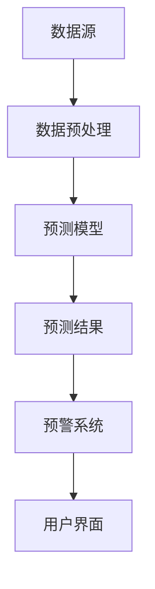
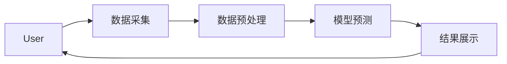
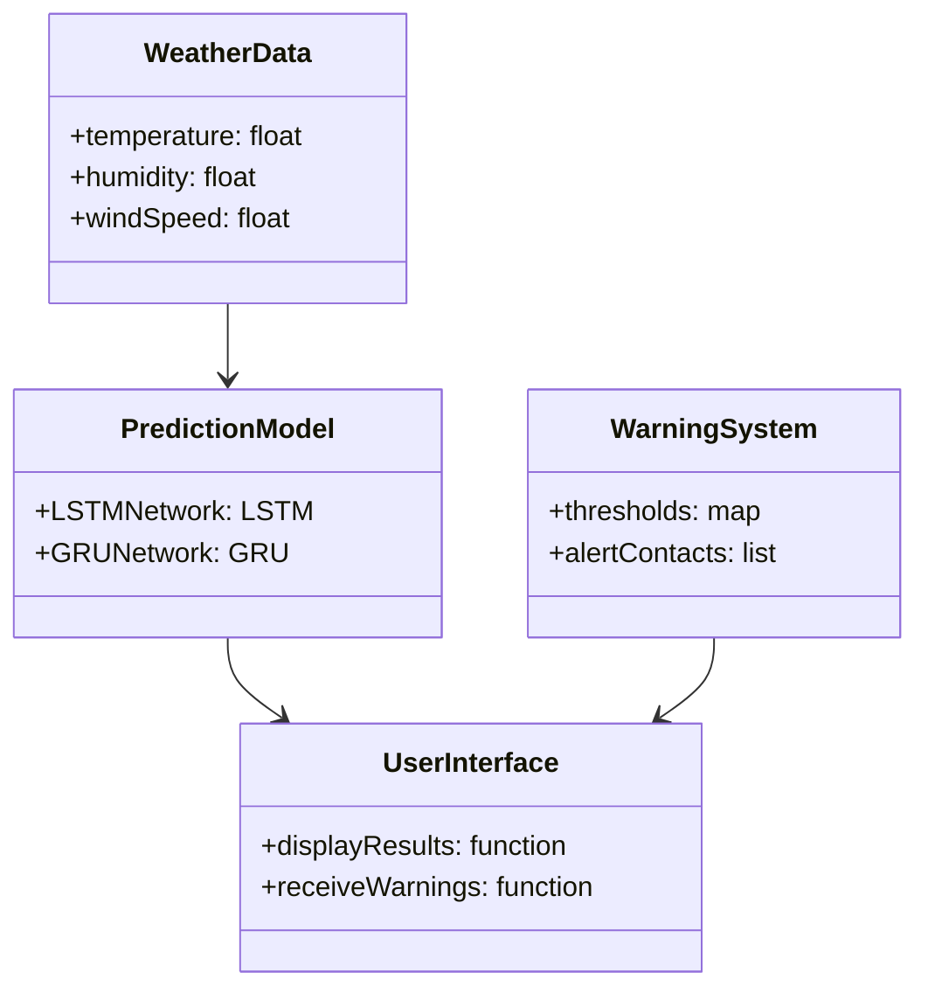
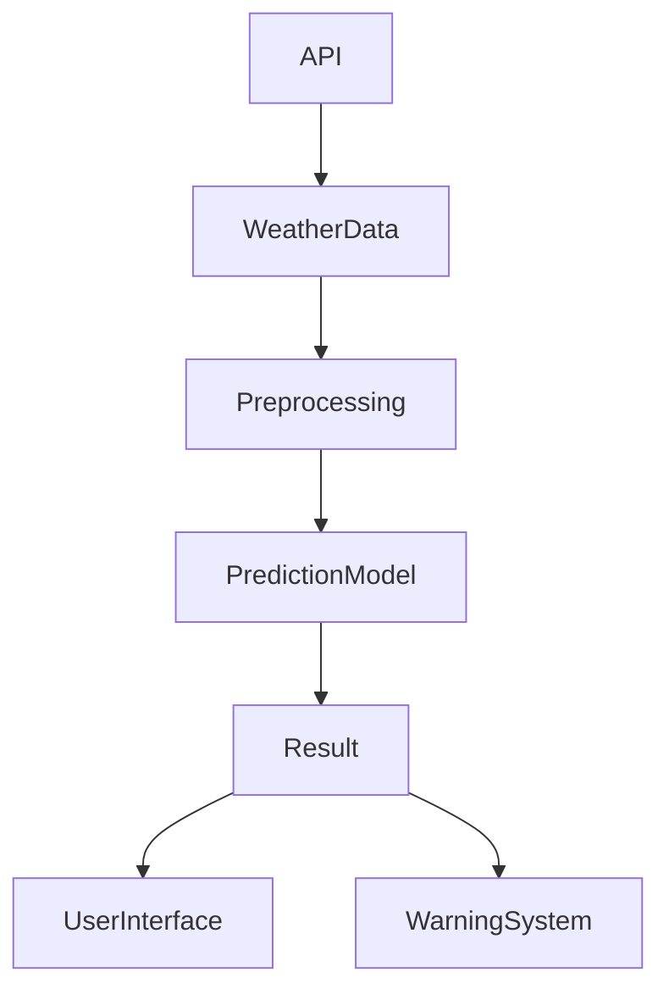
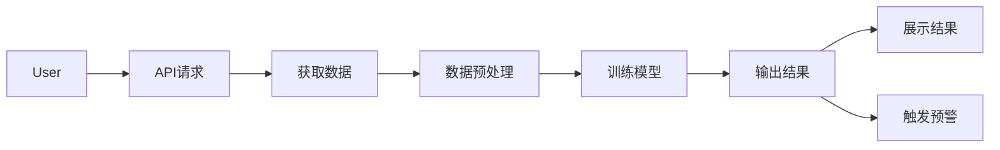

                 


```markdown
# AI Agent在气象预报中的应用前景

> 关键词：AI Agent, 气象预报, 人工智能, 机器学习, 大数据分析, 天气预测

> 摘要：随着人工智能技术的快速发展，AI Agent在气象预报中的应用前景越来越广阔。本文将从AI Agent的基本概念出发，分析其在气象预报中的核心任务和应用场景，并探讨其在气象数据处理、预测模型优化以及实时预警系统中的潜力。通过结合具体案例和系统架构设计，本文深入剖析了AI Agent在气象预报中的实际应用价值，并展望了其未来的发展方向。

---

# 第一部分: AI Agent与气象预报的背景与概念

## 第1章: AI Agent与气象预报的背景介绍

### 1.1 AI Agent的基本概念

#### 1.1.1 AI Agent的定义与特征
AI Agent（人工智能代理）是一种智能实体，能够感知环境、自主决策并执行任务。它具有以下特征：
- **自主性**：能够独立运作，无需外部干预。
- **反应性**：能够实时感知环境变化并做出反应。
- **目标导向**：基于预设目标或学习目标进行决策。
- **学习能力**：能够通过数据学习和优化性能。

#### 1.1.2 AI Agent的核心要素与功能
AI Agent的核心要素包括感知模块、决策模块和执行模块。其主要功能包括：
- 数据采集与处理
- 模型训练与预测
- 实时监控与反馈
- 自适应优化

#### 1.1.3 AI Agent与传统气象预报的区别
传统气象预报依赖于数值模型和统计方法，而AI Agent能够通过大数据学习，实现更精准的预测和实时调整。

### 1.2 气象预报的现状与挑战

#### 1.2.1 气象预报的基本原理与流程
气象预报依赖于大气模型和观测数据，通常包括数据收集、模式初始化、数值模拟和结果分析等步骤。

#### 1.2.2 传统气象预报的局限性
- 数据依赖性高
- 计算资源消耗大
- 预测精度受模型限制
- 实时调整能力有限

#### 1.2.3 气象数据的复杂性与多样性
气象数据包括卫星数据、地面观测数据、雷达数据等，具有时空分布复杂、数据量大、异构性高等特点。

### 1.3 AI Agent在气象预报中的应用背景

#### 1.3.1 AI技术在气象领域的应用现状
AI技术已经在气象数据分析、短期预测和灾害预警等领域得到广泛应用。

#### 1.3.2 AI Agent在气象预报中的独特优势
- 高效的数据处理能力
- 实时的预测与调整
- 自适应的学习能力

#### 1.3.3 气象预报智能化的必要性与可行性
随着气候变化加剧，气象预报的精准性和实时性需求日益增长，AI Agent为其提供了新的解决方案。

---

## 第2章: AI Agent与气象预报的核心概念

### 2.1 AI Agent的基本原理

#### 2.1.1 AI Agent的感知与决策机制
AI Agent通过传感器或数据接口获取气象数据，并基于这些数据进行预测和决策。

#### 2.1.2 AI Agent的学习与推理能力
AI Agent能够通过机器学习算法（如神经网络、强化学习）不断优化预测模型。

#### 2.1.3 AI Agent的自适应与优化能力
AI Agent可以根据反馈调整预测策略，实现自适应优化。

### 2.2 气象数据的特征与处理

#### 2.2.1 气象数据的类型与来源
气象数据包括：
- **卫星数据**：如云层高度、温度、湿度等。
- **地面观测数据**：如气温、降水、风速等。
- **雷达数据**：如降水分布、风场等。

#### 2.2.2 数据预处理与特征提取
- 数据清洗：去除噪声和异常值。
- 数据标准化：统一数据格式和单位。
- 特征提取：如降维、主成分分析等。

#### 2.2.3 数据的时空分布特性
气象数据具有明显的时空相关性，AI Agent需要考虑数据的空间分布和时间序列特性。

### 2.3 AI Agent在气象预报中的核心任务

#### 2.3.1 天气预测与模式识别
AI Agent可以通过深度学习模型（如LSTM）预测未来天气变化。

#### 2.3.2 数据融合与实时更新
AI Agent能够将多种数据源进行融合，实现更精准的预测。

#### 2.3.3 预警系统与决策支持
AI Agent可以构建实时预警系统，帮助相关部门快速响应气象灾害。

---

## 第3章: AI Agent与气象预报的核心概念联系

### 3.1 AI Agent与气象数据的关系

#### 3.1.1 数据驱动的AI Agent
AI Agent通过大量气象数据训练，实现对天气变化的模式识别。

#### 3.1.2 知识驱动的AI Agent
基于气象学知识构建规则库，辅助AI Agent进行预测。

#### 3.1.3 数据与知识的融合
通过结合数据驱动和知识驱动的方法，提升AI Agent的预测精度。

### 3.2 AI Agent与气象预报模型的结合

#### 3.2.1 基于AI Agent的气象预测模型
AI Agent可以作为预测模型的核心，实时调整预测参数。

#### 3.2.2 AI Agent与传统数值预报模型的对比
AI Agent在实时性和灵活性方面具有优势，而传统模型在稳定性方面表现更好。

#### 3.2.3 AI Agent在气象预报中的创新应用
- 实时天气预测
- 个性化气象服务
- 灾害预警与应急响应

### 3.3 AI Agent与气象预报系统的架构

#### 3.3.1 系统功能设计
- 数据采集与处理
- 预测模型训练
- 实时预测与预警
- 结果展示与反馈

#### 3.3.2 系统架构设计



#### 3.3.3 系统接口设计
- 数据接口：与气象传感器、数据库对接。
- 预测接口：提供实时天气预测服务。
- 预警接口：触发灾害预警通知。

#### 3.3.4 系统交互流程



---

# 第二部分: AI Agent在气象预报中的技术实现

## 第4章: AI Agent与气象预报的核心算法

### 4.1 时间序列预测算法

#### 4.1.1 LSTM网络
LSTM（长短期记忆网络）适用于处理时间序列数据，能够捕捉长期依赖关系。

#### 4.1.2 GRU网络
GRU（门控循环单元）是LSTM的简化版本，计算效率更高。

#### 4.1.3 算法实现
```python
import numpy as np
from tensorflow.keras.models import Sequential
from tensorflow.keras.layers import LSTM, Dense

model = Sequential()
model.add(LSTM(64, input_shape=(timesteps, features)))
model.add(Dense(1))
model.compile(optimizer='adam', loss='mean_squared_error')
```

### 4.2 强化学习算法

#### 4.2.1 Q-Learning
Q-Learning是一种基于值函数的强化学习算法，适用于离散动作空间。

#### 4.2.2 DQN算法
DQN（深度强化学习）结合了神经网络和Q-Learning，适用于连续动作空间。

#### 4.2.3 算法实现
```python
import gym
from tensorflow.keras import layers

env = gym.make('Pendulum-v0')
state_shape = env.observation_space.shape
action_shape = env.action_space.shape

model = keras.Sequential([
    layers.Dense(32, activation='relu', input_shape=state_shape),
    layers.Dense(action_shape[0], activation='linear')
])
```

### 4.3 算法优化与调优

#### 4.3.1 超参数优化
- 学习率
- 隐藏层大小
- 正则化参数

#### 4.3.2 模型评估与验证
- 均方误差（MSE）
- 比较预测值与真实值的偏差

#### 4.3.3 算法优化策略
- 早停（Early Stopping）
- 批归一化（Batch Normalization）
- 学习率衰减

---

## 第5章: AI Agent与气象预报的系统架构设计

### 5.1 系统功能设计

#### 5.1.1 数据采集模块
负责收集气象数据，包括卫星数据、地面观测数据等。

#### 5.1.2 数据预处理模块
对采集的数据进行清洗、标准化和特征提取。

#### 5.1.3 预测模型模块
基于AI Agent算法进行天气预测，输出预测结果。

#### 5.1.4 预警系统模块
根据预测结果触发灾害预警，通知相关部门和用户。

### 5.2 系统架构设计

#### 5.2.1 领域模型设计



#### 5.2.2 系统架构设计



#### 5.2.3 系统接口设计
- 数据接口：用于接收和发送气象数据。
- 预测接口：提供天气预测服务。
- 预警接口：触发灾害预警通知。

#### 5.2.4 系统交互流程



---

## 第6章: AI Agent与气象预报的项目实战

### 6.1 项目环境安装

#### 6.1.1 安装Python环境
```bash
python --version
pip install numpy
pip install tensorflow
pip install gym
```

#### 6.1.2 安装气象数据接口
```bash
pip install pywapi
pip install requests
```

### 6.2 系统核心实现

#### 6.2.1 数据采集模块实现
```python
import requests

def get_weather_data():
    response = requests.get('http://api.openweathermap.org/data/2.5/weather?q=London&units=metric&appid=your_api_key')
    return response.json()
```

#### 6.2.2 数据预处理模块实现
```python
import numpy as np

def preprocess_data(data):
    # 提取温度、湿度、风速等特征
    features = np.array([data['main']['temp'], data['main']['humidity'], data['wind']['speed']]).reshape(1, -1)
    return features
```

#### 6.2.3 预测模型实现
```python
from tensorflow.keras.models import Sequential
from tensorflow.keras.layers import LSTM, Dense

def build_model(input_shape):
    model = Sequential()
    model.add(LSTM(64, input_shape=input_shape))
    model.add(Dense(1))
    model.compile(optimizer='adam', loss='mean_squared_error')
    return model
```

#### 6.2.4 预警系统实现
```python
def trigger_warning(predicted_value, threshold):
    if predicted_value > threshold:
        print("Warning: Exceed threshold")
    else:
        print("No warning")
```

### 6.3 项目总结

#### 6.3.1 项目实现的关键点
- 数据采集与预处理
- 模型训练与优化
- 实时预测与预警

#### 6.3.2 项目实现的难点
- 数据质量控制
- 模型泛化能力
- 系统实时性优化

#### 6.3.3 项目实现的价值
- 提高气象预报的准确性
- 实现实时预警，减少灾害损失
- 为气象研究提供新的工具和方法

---

## 第7章: AI Agent与气象预报的应用前景

### 7.1 最佳实践与小结

#### 7.1.1 小结
AI Agent在气象预报中的应用前景广阔，能够显著提升预测精度和实时性。

#### 7.1.2 注意事项
- 数据质量控制
- 模型优化与调优
- 系统安全与稳定性

#### 7.1.3 拓展阅读
- 《Deep Learning for Weather Forecasting》
- 《Reinforcement Learning in Meteorology》
- 《AI in Environmental Sciences》

### 7.2 未来发展方向

#### 7.2.1 高精度预测模型
开发更复杂的深度学习模型，如Transformer架构，提升预测精度。

#### 7.2.2 实时预测与优化
优化系统架构，提升实时预测能力，降低计算成本。

#### 7.2.3 多源数据融合
结合卫星数据、地面观测数据和数值模型，构建更全面的预测系统。

#### 7.2.4 个性化气象服务
根据用户需求，提供定制化的气象预报服务。

---

## 作者信息

作者：AI天才研究院/AI Genius Institute & 禅与计算机程序设计艺术 /Zen And The Art of Computer Programming

---

以上是《AI Agent在气象预报中的应用前景》的技术博客文章的完整大纲，具体内容将按照上述结构详细展开。
```

