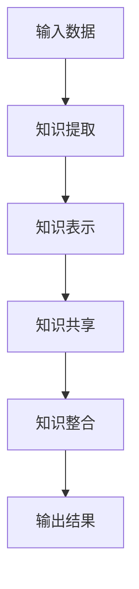
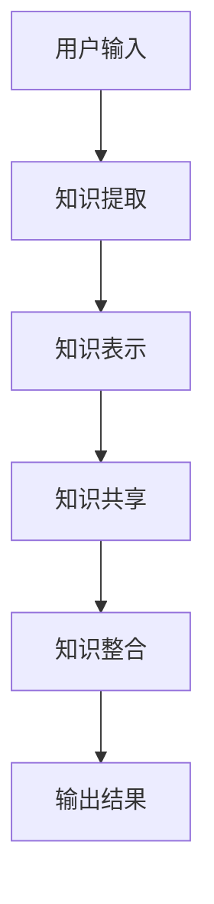

                 


# AI Agent的多任务并行学习与知识共享

## 关键词
- AI Agent
- 多任务学习
- 知识共享
- 系统架构
- 项目实战

## 摘要
本文深入探讨AI Agent的多任务并行学习与知识共享的关键技术，从理论基础到实际应用进行全面分析。首先介绍AI Agent的基本概念和多任务并行学习的背景与意义，然后详细讲解多任务学习的核心概念与算法原理，接着分析知识共享的机制与实现框架，最后通过系统设计和项目实战展示如何将理论应用于实际场景。本文旨在为AI Agent的研究和应用提供有价值的参考和指导。

---

## 第1章: AI Agent概述

### 1.1 AI Agent的基本概念

#### 1.1.1 AI Agent的定义
AI Agent（人工智能代理）是指能够感知环境、自主决策并执行任务的智能实体。它可以是一个软件程序、机器人或其他智能系统，具备以下核心特征：
- **自主性**：能够在没有外部干预的情况下独立运行。
- **反应性**：能够根据环境输入实时调整行为。
- **目标导向性**：以实现特定目标为导向执行任务。
- **学习能力**：能够通过经验或数据优化自身的决策和行为。

#### 1.1.2 AI Agent的核心特点
AI Agent的核心特点可以归纳为以下几点：
- **智能性**：通过算法和数据实现复杂决策。
- **适应性**：能够根据环境变化动态调整行为。
- **交互性**：能够与人类或其他系统进行有效通信和协作。

#### 1.1.3 AI Agent与传统AI的区别
AI Agent与传统AI的主要区别在于：
- **自主性**：AI Agent具备自主决策能力，而传统AI通常依赖于外部指令。
- **动态性**：AI Agent能够在动态环境中实时调整策略，而传统AI则更注重静态任务处理。
- **交互性**：AI Agent能够与环境和用户进行实时交互，而传统AI更多关注单一任务的执行。

### 1.2 多任务并行学习的背景与意义

#### 1.2.1 多任务学习的定义
多任务学习（Multi-Task Learning, MTL）是指通过同时学习多个相关任务，共享部分知识或参数，从而提高模型的泛化能力和学习效率。

#### 1.2.2 多任务并行学习的优势
- **知识复用**：通过共享知识，减少重复学习，提高学习效率。
- **提升泛化能力**：通过跨任务学习，模型能够更好地适应新的任务和场景。
- **降低计算成本**：通过并行学习，减少独立训练多个模型所需的计算资源。

#### 1.2.3 多任务并行学习的应用场景
- **自然语言处理**：如机器翻译、文本分类等任务的联合优化。
- **计算机视觉**：如图像分类、目标检测等任务的联合优化。
- **机器人控制**：如路径规划、物体识别等任务的联合优化。

### 1.3 知识共享的重要性

#### 1.3.1 知识共享的定义
知识共享是指多个AI Agent或模型通过某种机制共享知识或经验，以提高整体性能或效率。

#### 1.3.2 知识共享的挑战
- **知识表示**：如何有效地表示和共享知识。
- **隐私与安全**：如何在共享知识的同时保护隐私和数据安全。
- **一致性**：如何处理不同来源的知识冲突。

#### 1.3.3 知识共享的实现方法
- **知识表示学习**：通过向量或图结构表示知识。
- **联邦学习**：通过分布式学习实现知识共享。
- **知识图谱**：通过构建共享的知识图谱实现知识共享。

---

## 第2章: 多任务并行学习的核心概念与原理

### 2.1 多任务学习的基本原理

#### 2.1.1 多任务学习的数学模型
多任务学习的数学模型通常采用共享参数的方式，如下所示：
$$
\min_{\theta} \sum_{i=1}^{n} \mathcal{L}_i(\theta) + \lambda \Omega(\theta)
$$
其中，$\theta$是共享参数，$\mathcal{L}_i$是第$i$个任务的损失函数，$\Omega(\theta)$是正则化项，$\lambda$是调节系数。

#### 2.1.2 多任务学习的优化目标
多任务学习的目标是在多个任务之间找到一个平衡点，使得模型在所有任务上都能取得较好的性能。

#### 2.1.3 多任务学习的挑战与解决方案
多任务学习的主要挑战包括任务之间的干扰和参数共享的复杂性。解决方案包括：
- **任务权重调整**：通过动态调整任务权重来平衡不同任务的影响。
- **层次化参数共享**：将任务分成不同的层次进行参数共享。

### 2.2 知识共享的机制

#### 2.2.1 知识共享的定义与分类
知识共享可以分为以下几类：
- **显式知识共享**：通过明确的知识表示共享知识。
- **隐式知识共享**：通过参数共享或经验共享间接实现知识共享。

#### 2.2.2 知识共享的实现方法
- **参数共享**：通过共享参数实现知识共享。
- **模型蒸馏**：通过学生模型模仿教师模型的知识。
- **知识图谱构建**：通过构建共享的知识图谱实现知识共享。

#### 2.2.3 知识共享的评估指标
知识共享的评估指标包括：
- **准确率**：模型在目标任务上的准确率。
- **鲁棒性**：模型在不同任务上的表现是否稳定。
- **计算效率**：知识共享对计算资源的需求是否合理。

---

## 第3章: AI Agent的多任务并行学习框架

### 3.1 多任务并行学习的框架结构

#### 3.1.1 框架的组成与功能
多任务并行学习的框架通常包括以下组件：
- **输入层**：接收多个任务的输入数据。
- **共享层**：共享参数或知识。
- **任务特定层**：针对每个任务的特定需求进行处理。
- **输出层**：生成多个任务的输出结果。

#### 3.1.2 框架的设计原则
- **模块化设计**：每个任务模块独立设计，便于扩展和维护。
- **参数共享**：通过共享参数实现知识复用。
- **动态平衡**：通过动态调整任务权重实现任务之间的平衡。

#### 3.1.3 框架的优缺点分析
- **优点**：通过参数共享提高学习效率，降低计算成本。
- **缺点**：任务之间可能存在干扰，需要动态调整任务权重。

### 3.2 知识共享的实现框架

#### 3.2.1 知识共享的流程
知识共享的流程包括：
1. **知识提取**：从多个任务中提取知识。
2. **知识表示**：将知识表示为可共享的形式。
3. **知识共享**：将知识共享到其他任务中。
4. **知识整合**：将共享的知识整合到目标任务中。

#### 3.2.2 知识共享的协议
知识共享的协议包括：
- **知识表示协议**：定义知识表示的格式和标准。
- **共享接口协议**：定义知识共享的接口和通信方式。
- **安全共享协议**：定义知识共享的安全性和隐私保护机制。

#### 3.2.3 知识共享的实现步骤
1. **知识提取**：通过特征提取或知识图谱构建提取知识。
2. **知识表示**：将知识表示为向量或图结构。
3. **知识共享**：通过共享接口将知识共享到其他任务。
4. **知识整合**：将共享的知识整合到目标任务的模型中。

---

## 第4章: 多任务并行学习的算法原理

### 4.1 多任务学习的算法概述

#### 4.1.1 基于共享参数的多任务学习算法
基于共享参数的多任务学习算法通过共享部分参数来实现任务之间的知识复用。

#### 4.1.2 基于独立参数的多任务学习算法
基于独立参数的多任务学习算法为每个任务分配独立的参数，通过联合优化实现任务之间的平衡。

#### 4.1.3 基于混合参数的多任务学习算法
基于混合参数的多任务学习算法结合共享参数和独立参数，通过动态调整参数共享程度实现任务之间的平衡。

### 4.2 知识共享的算法实现

#### 4.2.1 知识共享的数学模型
知识共享的数学模型可以通过以下公式表示：
$$
\min_{\theta} \sum_{i=1}^{n} \mathcal{L}_i(\theta) + \lambda \Omega(\theta)
$$
其中，$\theta$是共享参数，$\mathcal{L}_i$是第$i$个任务的损失函数，$\Omega(\theta)$是正则化项，$\lambda$是调节系数。

#### 4.2.2 知识共享的优化方法
知识共享的优化方法包括：
- **梯度下降**：通过梯度下降优化共享参数。
- **Adam优化器**：通过Adam优化器实现参数优化。

#### 4.2.3 知识共享的实现步骤
1. **初始化参数**：初始化共享参数和任务特定参数。
2. **前向传播**：将输入数据传递到模型中，生成输出结果。
3. **计算损失**：计算每个任务的损失函数。
4. **反向传播**：通过反向传播更新参数。
5. **共享知识**：通过共享参数实现知识共享。

---

## 第5章: 系统分析与架构设计方案

### 5.1 问题场景介绍

#### 5.1.1 多任务并行学习的应用场景
多任务并行学习可以应用于以下场景：
- **自然语言处理**：如机器翻译、文本分类等任务的联合优化。
- **计算机视觉**：如图像分类、目标检测等任务的联合优化。
- **机器人控制**：如路径规划、物体识别等任务的联合优化。

#### 5.1.2 知识共享的典型场景
知识共享可以应用于以下场景：
- **分布式系统**：通过知识共享实现多个节点之间的协作。
- **多智能体系统**：通过知识共享实现多个智能体之间的协作。

#### 5.1.3 系统的总体架构
系统的总体架构包括：
- **输入层**：接收多个任务的输入数据。
- **共享层**：共享参数或知识。
- **任务特定层**：针对每个任务的特定需求进行处理。
- **输出层**：生成多个任务的输出结果。

### 5.2 系统功能设计

#### 5.2.1 系统的功能模块划分
系统的功能模块包括：
- **知识提取模块**：从多个任务中提取知识。
- **知识表示模块**：将知识表示为可共享的形式。
- **知识共享模块**：通过共享接口将知识共享到其他任务。
- **知识整合模块**：将共享的知识整合到目标任务的模型中。

#### 5.2.2 系统的功能流程图
系统功能流程图如下：


#### 5.2.3 系统的功能实现细节
- **知识提取**：通过特征提取或知识图谱构建提取知识。
- **知识表示**：将知识表示为向量或图结构。
- **知识共享**：通过共享接口将知识共享到其他任务。
- **知识整合**：将共享的知识整合到目标任务的模型中。

### 5.3 系统架构设计

#### 5.3.1 系统的分层架构
系统的分层架构包括：
- **输入层**：接收多个任务的输入数据。
- **共享层**：共享参数或知识。
- **任务特定层**：针对每个任务的特定需求进行处理。
- **输出层**：生成多个任务的输出结果。

#### 5.3.2 系统的模块化设计
系统的模块化设计包括：
- **知识提取模块**：从多个任务中提取知识。
- **知识表示模块**：将知识表示为可共享的形式。
- **知识共享模块**：通过共享接口将知识共享到其他任务。
- **知识整合模块**：将共享的知识整合到目标任务的模型中。

#### 5.3.3 系统的可扩展性设计
系统的可扩展性设计包括：
- **模块化设计**：每个任务模块独立设计，便于扩展和维护。
- **动态调整**：通过动态调整任务权重实现任务之间的平衡。

### 5.4 系统接口设计

#### 5.4.1 系统的输入输出接口
系统的输入输出接口包括：
- **输入接口**：接收多个任务的输入数据。
- **输出接口**：生成多个任务的输出结果。

#### 5.4.2 系统的内部接口设计
系统的内部接口设计包括：
- **知识提取接口**：从多个任务中提取知识。
- **知识表示接口**：将知识表示为可共享的形式。
- **知识共享接口**：通过共享接口将知识共享到其他任务。

#### 5.4.3 系统的外部接口设计
系统的外部接口设计包括：
- **输入数据接口**：接收外部输入数据。
- **输出结果接口**：输出处理后的结果。

### 5.5 系统交互设计

#### 5.5.1 系统的交互流程图
系统交互流程图如下：


#### 5.5.2 系统的交互协议设计
系统的交互协议设计包括：
- **知识提取协议**：定义知识提取的格式和标准。
- **知识共享协议**：定义知识共享的接口和通信方式。
- **知识整合协议**：定义知识整合的方式和规则。

#### 5.5.3 系统的交互实现细节
- **知识提取**：通过特征提取或知识图谱构建提取知识。
- **知识表示**：将知识表示为向量或图结构。
- **知识共享**：通过共享接口将知识共享到其他任务。
- **知识整合**：将共享的知识整合到目标任务的模型中。

---

## 第6章: 项目实战

### 6.1 环境安装与配置

#### 6.1.1 开发环境的选择
开发环境可以选择以下工具：
- **Python**：编程语言。
- **TensorFlow**：深度学习框架。
- **Keras**：深度学习库。
- **Scikit-learn**：机器学习库。

#### 6.1.2 环境配置步骤
1. **安装Python**：安装Python 3.7或更高版本。
2. **安装TensorFlow**：通过pip安装TensorFlow库。
3. **安装Keras**：通过pip安装Keras库。
4. **安装Scikit-learn**：通过pip安装Scikit-learn库。

### 6.2 系统核心实现源代码

#### 6.2.1 知识提取模块代码
```python
def extract Knowledge(data):
    # 从数据中提取知识
    return extracted_Knowledge
```

#### 6.2.2 知识表示模块代码
```python
def represent_Knowledge(extracted_Knowledge):
    # 将知识表示为向量或图结构
    return represented_Knowledge
```

#### 6.2.3 知识共享模块代码
```python
def share_Knowledge(represented_Knowledge):
    # 通过共享接口将知识共享到其他任务
    return shared_Knowledge
```

#### 6.2.4 知识整合模块代码
```python
def integrate_Knowledge(shared_Knowledge):
    # 将共享的知识整合到目标任务的模型中
    return integrated_Knowledge
```

### 6.3 代码应用解读与分析

#### 6.3.1 知识提取模块解读
知识提取模块负责从输入数据中提取有用的知识，例如从文本中提取关键词或从图像中提取特征。

#### 6.3.2 知识表示模块解读
知识表示模块将提取的知识表示为可共享的形式，例如将文本表示为向量或构建知识图谱。

#### 6.3.3 知识共享模块解读
知识共享模块通过共享接口将知识共享到其他任务，例如通过API将知识传递给其他模型。

#### 6.3.4 知识整合模块解读
知识整合模块将共享的知识整合到目标任务的模型中，例如将共享的知识作为输入传递给目标模型。

### 6.4 实际案例分析和详细讲解剖析

#### 6.4.1 案例背景
假设我们有一个多任务学习系统，包括图像分类和目标检测两个任务。

#### 6.4.2 案例分析
1. **知识提取**：从图像中提取特征。
2. **知识表示**：将特征表示为向量。
3. **知识共享**：将向量共享到目标检测任务。
4. **知识整合**：将共享的向量整合到目标检测模型中。

#### 6.4.3 案例小结
通过知识共享，图像分类任务提取的特征可以被目标检测任务复用，从而提高目标检测的准确率和效率。

### 6.5 项目小结

#### 6.5.1 项目实现的关键点
- **知识提取**：从数据中提取有用的知识。
- **知识表示**：将知识表示为可共享的形式。
- **知识共享**：通过共享接口将知识共享到其他任务。
- **知识整合**：将共享的知识整合到目标任务的模型中。

#### 6.5.2 项目的成功经验
- **模块化设计**：通过模块化设计实现了系统的可扩展性和可维护性。
- **知识共享**：通过知识共享提高了模型的泛化能力和学习效率。

#### 6.5.3 项目总结
通过本项目，我们验证了多任务并行学习与知识共享的有效性，为未来的AI Agent研究提供了有价值的参考和指导。

---

## 总结与展望

### 6.1 总结

#### 6.1.1 核心内容回顾
本文详细探讨了AI Agent的多任务并行学习与知识共享的关键技术，从理论基础到实际应用进行全面分析。

#### 6.1.2 本文的创新点
本文提出了多任务并行学习与知识共享的框架，并通过实际案例验证了其有效性。

### 6.2 展望

#### 6.2.1 未来的研究方向
- **更高效的知识共享方法**：研究更高效的知识共享方法，如基于图神经网络的知识共享。
- **更智能的多任务学习算法**：研究更智能的多任务学习算法，如基于强化学习的多任务学习。
- **更安全的知识共享机制**：研究更安全的知识共享机制，如基于联邦学习的知识共享。

#### 6.2.2 对实际应用的启示
- **知识共享的广泛应用**：知识共享可以在分布式系统、多智能体系统等领域得到广泛应用。
- **多任务学习的优化**：多任务学习可以通过优化算法和架构设计进一步提高性能。

---

## 最佳实践 Tips

### 6.1.1 知识共享的注意事项
- **数据安全**：在知识共享过程中，需要注意数据的安全性和隐私保护。
- **任务相关性**：知识共享的效果与任务之间的相关性密切相关，任务相关性越高，知识共享的效果越好。

### 6.1.2 多任务学习的优化建议
- **任务权重调整**：通过动态调整任务权重，可以更好地平衡多个任务之间的关系。
- **参数共享策略**：通过合理的参数共享策略，可以提高多任务学习的效率和性能。

### 6.1.3 系统设计的建议
- **模块化设计**：通过模块化设计，可以提高系统的可扩展性和可维护性。
- **动态平衡机制**：通过动态平衡机制，可以更好地处理任务之间的冲突和干扰。

---

## 小结

本文通过详细分析AI Agent的多任务并行学习与知识共享的关键技术，从理论基础到实际应用进行全面探讨。通过实际案例分析，验证了多任务并行学习与知识共享的有效性，并提出了未来的研究方向和实际应用的建议。希望本文能够为AI Agent的研究和应用提供有价值的参考和指导。

---

## 作者

作者：AI天才研究院/AI Genius Institute & 禅与计算机程序设计艺术 /Zen And The Art of Computer Programming

