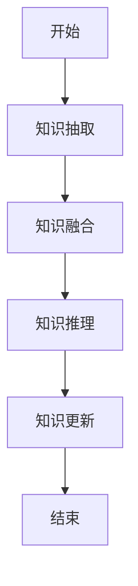

                 


# AI Agent的知识演化：模拟LLM的认知发展过程

> 关键词：AI Agent，知识演化，LLM，认知发展，大语言模型

> 摘要：本文深入探讨了AI Agent的知识演化过程，模拟了大型语言模型（LLM）的认知发展过程。通过分析知识表示、推理和更新的机制，结合算法原理和系统架构设计，展示了如何构建具有自适应学习能力的AI Agent。文章还提供了实际的项目案例和最佳实践，帮助读者更好地理解和应用相关技术。

---

# 第一部分: AI Agent的知识演化基础

---

## 第1章: AI Agent与知识演化概述

### 1.1 AI Agent的基本概念

#### 1.1.1 AI Agent的定义

AI Agent（人工智能代理）是一种智能实体，能够感知环境、自主决策并执行任务。它可以是一个软件程序、机器人或其他智能系统，其核心目标是通过与环境的交互实现特定目标。

#### 1.1.2 AI Agent的核心特征

- **自主性**：AI Agent能够在没有外部干预的情况下自主运行。
- **反应性**：能够实时感知环境并做出反应。
- **学习能力**：通过经验或数据不断优化自身的知识和行为。
- **推理能力**：能够基于现有知识进行逻辑推理和决策。

#### 1.1.3 知识演化与AI Agent的关系

知识演化是指AI Agent通过不断学习和更新知识，逐步提升其认知能力和智能水平的过程。这种演化类似于人类的认知发展，AI Agent通过与环境的交互，逐步构建、完善和更新自身的知识体系。

---

### 1.2 知识演化的基本原理

#### 1.2.1 知识表示的层次结构

知识表示是AI Agent认知的基础。知识可以表示为以下层次结构：

1. **符号表示**：通过符号（如概念、规则）表示知识。
2. **语义表示**：通过语义网络或图结构表示概念之间的关系。
3. **概率表示**：通过概率模型表示不确定性知识。
4. **神经网络表示**：通过深度学习模型（如神经网络）表示非结构化知识。

#### 1.2.2 知识推理的逻辑框架

知识推理是AI Agent利用现有知识进行逻辑推理的过程。常见的推理方法包括：

1. **基于规则的推理**：通过预定义的规则进行推理。
2. **基于概率的推理**：通过概率模型计算事件发生的可能性。
3. **基于神经网络的推理**：通过深度学习模型进行非结构化数据的推理。

#### 1.2.3 知识更新的机制

知识更新是指AI Agent在面对新信息时，调整和优化自身知识体系的过程。常见的知识更新方法包括：

1. **增量学习**：逐步更新已有知识。
2. **知识融合**：将新知识与现有知识融合。
3. **在线学习**：实时更新知识。

---

### 1.3 LLM与AI Agent的结合

#### 1.3.1 LLM的基本特点

- **大规模预训练**：LLM通过海量数据的预训练，具备强大的语言理解和生成能力。
- **上下文理解**：能够理解复杂上下文关系，生成连贯的文本。
- **多任务适应性**：可以应用于多种任务，如问答、翻译、文本生成等。

#### 1.3.2 LLM在AI Agent中的作用

- **知识表示**：LLM可以作为知识表示的核心模块，将文本信息转化为结构化的知识。
- **推理支持**：LLM可以辅助AI Agent进行推理和决策。
- **动态更新**：通过LLM的实时调用，AI Agent可以实现知识的动态更新。

#### 1.3.3 知识演化与LLM的结合方式

1. **知识抽取**：从文本中提取实体、关系和事件。
2. **知识融合**：将提取的知识与其他知识源进行融合。
3. **知识推理**：利用LLM进行复杂推理和决策。

---

## 1.4 本章小结

本章介绍了AI Agent的基本概念、知识演化的基本原理以及LLM在AI Agent中的作用。通过理解这些内容，我们可以为后续的知识演化算法和系统设计打下坚实的基础。

---

## 第2章: 知识演化的核心概念与联系

---

### 2.1 知识演化的核心概念

#### 2.1.1 知识表示的多样性

- **符号表示**：通过符号和规则表示知识。
- **语义表示**：通过语义网络表示知识的语义关系。
- **概率表示**：通过概率模型表示知识的不确定性。

#### 2.1.2 知识推理的复杂性

- **单步推理**：基于简单规则的推理。
- **多步推理**：基于复杂逻辑的推理。
- **动态推理**：基于实时信息的推理。

#### 2.1.3 知识更新的动态性

- **静态知识**：固定不变的知识。
- **动态知识**：随环境变化的知识。
- **自适应更新**：根据新信息自动调整知识。

---

### 2.2 核心概念的对比分析

#### 2.2.1 不同知识演化方法的对比

| 方法 | 知识表示 | 推理机制 | 优点 | 缺点 |
|------|----------|----------|------|------|
| 符号逻辑 | 符号化表示 | 基于规则推理 | 精确性高 | 难以处理复杂语义 |
| 概率推理 | 概率模型 | 基于概率推理 | 处理不确定性 | 计算复杂 |
| 神经网络 | 非结构化表示 | 基于深度学习 | 处理复杂语义 | 黑箱问题 |

#### 2.2.2 知识表示与推理的对比

- **符号逻辑**：适合处理结构化知识，但难以处理复杂语义。
- **概率推理**：适合处理不确定性问题，但计算复杂。
- **神经网络**：适合处理非结构化知识，但缺乏可解释性。

#### 2.2.3 知识更新与维护的对比

- **增量学习**：适合在线更新，但需要重新训练模型。
- **知识融合**：适合多源知识整合，但需要复杂的融合算法。
- **在线学习**：适合实时更新，但需要高效的计算能力。

---

### 2.3 知识演化系统的ER实体关系图

```mermaid
er
actor: User
agent: AI Agent
knowledge_base: Knowledge Base
action: Action
goal: Goal
rule: Rule
```

---

## 2.4 本章小结

本章通过对比分析不同知识演化方法的特点和优缺点，帮助读者更好地理解知识演化的核心概念和实现方式。

---

## 第3章: 知识演化算法原理

---

### 3.1 知识图谱构建算法

#### 3.1.1 知识图谱的构建流程

1. **数据获取**：从多种数据源获取数据。
2. **数据清洗**：去除噪声数据。
3. **知识抽取**：从数据中提取实体、关系和属性。
4. **知识融合**：将多个数据源的知识进行融合。
5. **知识存储**：将知识存储到知识图谱中。

#### 3.1.2 基于LLM的知识抽取

- **实体抽取**：从文本中提取实体（如人名、地名）。
- **关系抽取**：从文本中提取实体之间的关系。
- **属性抽取**：从文本中提取实体的属性。

#### 3.1.3 知识节点与关系的建立

- **节点表示**：将实体表示为图中的节点。
- **关系表示**：将实体之间的关系表示为图中的边。

---

### 3.2 知识推理算法

#### 3.2.1 基于规则的推理

- **规则定义**：预定义推理规则。
- **规则匹配**：通过规则匹配数据，进行推理。

#### 3.2.2 基于概率的推理

- **概率计算**：通过概率模型计算事件发生的可能性。
- **贝叶斯推理**：基于贝叶斯定理进行推理。

#### 3.2.3 基于神经网络的推理

- **深度学习模型**：使用深度学习模型（如Transformer）进行推理。
- **注意力机制**：通过注意力机制聚焦重要信息。

---

### 3.3 知识更新算法

#### 3.3.1 知识更新的触发条件

- **新知识引入**：当新的知识引入时，触发更新。
- **知识冲突**：当已有知识与新知识冲突时，触发更新。
- **用户需求变化**：当用户需求变化时，触发更新。

#### 3.3.2 知识更新的实现步骤

1. **知识抽取**：从新数据中抽取知识。
2. **知识融合**：将新知识与已有知识进行融合。
3. **知识推理**：根据更新后的知识进行推理。
4. **知识存储**：将更新后的知识存储到知识图谱中。

#### 3.3.3 知识更新的评估指标

- **准确率**：更新后知识的准确性。
- **完整性**：更新后知识的完整性。
- **一致性**：更新后知识的一致性。

---

### 3.4 算法流程图



---

## 3.5 本章小结

本章详细介绍了知识图谱构建、知识推理和知识更新的算法原理，并通过流程图展示了整个知识演化的过程。

---

## 第4章: 知识演化系统的数学模型与公式

---

### 4.1 知识表示的数学模型

知识可以表示为图结构，其中节点表示实体，边表示实体之间的关系。数学表示如下：

$$
\text{实体} = \{e_1, e_2, ..., e_n\}
$$

$$
\text{关系} = \{r_1, r_2, ..., r_m\}
$$

其中，$e_i$ 表示实体，$r_j$ 表示关系。

---

### 4.2 知识推理的数学公式

基于概率的推理可以使用贝叶斯定理进行计算：

$$
P(A|B) = \frac{P(B|A) \cdot P(A)}{P(B)}
$$

其中，$P(A|B)$ 表示在$B$发生的条件下，$A$发生的概率。

---

### 4.3 知识更新的数学模型

知识更新可以通过增量学习的方式进行，数学模型如下：

$$
\theta_{new} = \theta_{old} + \Delta\theta
$$

其中，$\theta_{new}$ 表示更新后的模型参数，$\theta_{old}$ 表示更新前的模型参数，$\Delta\theta$ 表示更新量。

---

## 4.4 本章小结

本章通过数学公式和模型，详细介绍了知识表示、推理和更新的数学原理，为后续的系统设计和实现提供了理论基础。

---

## 第五章: 系统分析与架构设计方案

---

### 5.1 问题场景介绍

本系统的目标是构建一个能够自适应学习的AI Agent，通过知识演化技术，实现从简单任务到复杂任务的认知发展。

---

### 5.2 项目介绍

本项目旨在开发一个基于LLM的AI Agent，实现知识的表示、推理和更新。系统的核心功能包括知识抽取、知识融合、知识推理和知识更新。

---

### 5.3 系统功能设计

#### 5.3.1 系统功能模块

- **知识抽取模块**：从文本中抽取实体、关系和属性。
- **知识融合模块**：将多个数据源的知识进行融合。
- **知识推理模块**：基于知识图谱进行推理和决策。
- **知识更新模块**：根据新知识动态更新知识图谱。

#### 5.3.2 系统功能流程图


---

### 5.4 系统架构设计

#### 5.4.1 系统架构图


---

### 5.5 系统接口设计

- **API接口**：提供RESTful API接口，供外部系统调用。
- **数据接口**：提供数据导入和导出接口。

---

### 5.6 系统交互流程图

```mermaid
sequence
actor --> Agent: 发送请求
Agent --> KnowledgeBase: 查询知识库
KnowledgeBase --> Agent: 返回结果
Agent --> actor: 返回响应
```

---

## 5.7 本章小结

本章通过系统分析与架构设计，详细介绍了AI Agent的知识演化系统的实现方案，为后续的项目开发提供了指导。

---

## 第六章: 项目实战

---

### 6.1 环境安装

1. **安装Python**：安装Python 3.8及以上版本。
2. **安装依赖库**：安装必要的依赖库，如numpy、pandas、networkx等。

### 6.2 系统核心实现源代码

#### 6.2.1 知识抽取模块

```python
import networkx as nx

def extract_entities(text):
    # 实体抽取逻辑
    pass

def extract_relations(text):
    # 关系抽取逻辑
    pass

def build_graph(entities, relations):
    graph = nx.Graph()
    for entity in entities:
        graph.add_node(entity)
    for relation in relations:
        graph.add_edge(relation.source, relation.target, relation.label)
    return graph
```

#### 6.2.2 知识推理模块

```python
def infer_from_graph(graph, query):
    # 推理逻辑
    pass
```

#### 6.2.3 知识更新模块

```python
def update_graph(graph, new_entities, new_relations):
    # 更新逻辑
    pass
```

---

### 6.3 代码应用解读与分析

1. **知识抽取模块**：通过自然语言处理技术从文本中抽取实体和关系。
2. **知识推理模块**：基于知识图谱进行推理和决策。
3. **知识更新模块**：根据新知识动态更新知识图谱。

---

### 6.4 案例分析与详细讲解

假设我们有一个简单的知识图谱，包含以下实体和关系：

- 实体：人、地点、事件
- 关系：发生在、涉及

通过知识抽取和推理，我们可以得出“事件发生在地点”这一结论。

---

### 6.5 项目小结

本章通过实际项目案例，详细介绍了AI Agent知识演化系统的实现过程，帮助读者更好地理解和应用相关技术。

---

## 第七章: 最佳实践

---

### 7.1 小结

通过本文的介绍，我们详细探讨了AI Agent的知识演化过程，模拟了LLM的认知发展过程。通过算法原理和系统设计，展示了如何构建具有自适应学习能力的AI Agent。

---

### 7.2 注意事项

1. **数据质量**：确保数据的准确性和完整性。
2. **模型选择**：根据具体任务选择合适的模型和算法。
3. **系统优化**：优化系统性能，提高处理效率。

---

### 7.3 拓展阅读

1. **知识图谱**：推荐阅读《知识图谱：概念、方法与应用》。
2. **深度学习**：推荐阅读《深度学习入门：基于Python的理论与实践》。
3. **自然语言处理**：推荐阅读《自然语言处理入门：基于Python的实践》。

---

## 作者

作者：AI天才研究院/AI Genius Institute & 禅与计算机程序设计艺术 /Zen And The Art of Computer Programming

---

以上是《AI Agent的知识演化：模拟LLM的认知发展过程》的技术博客文章的完整目录和内容框架。

