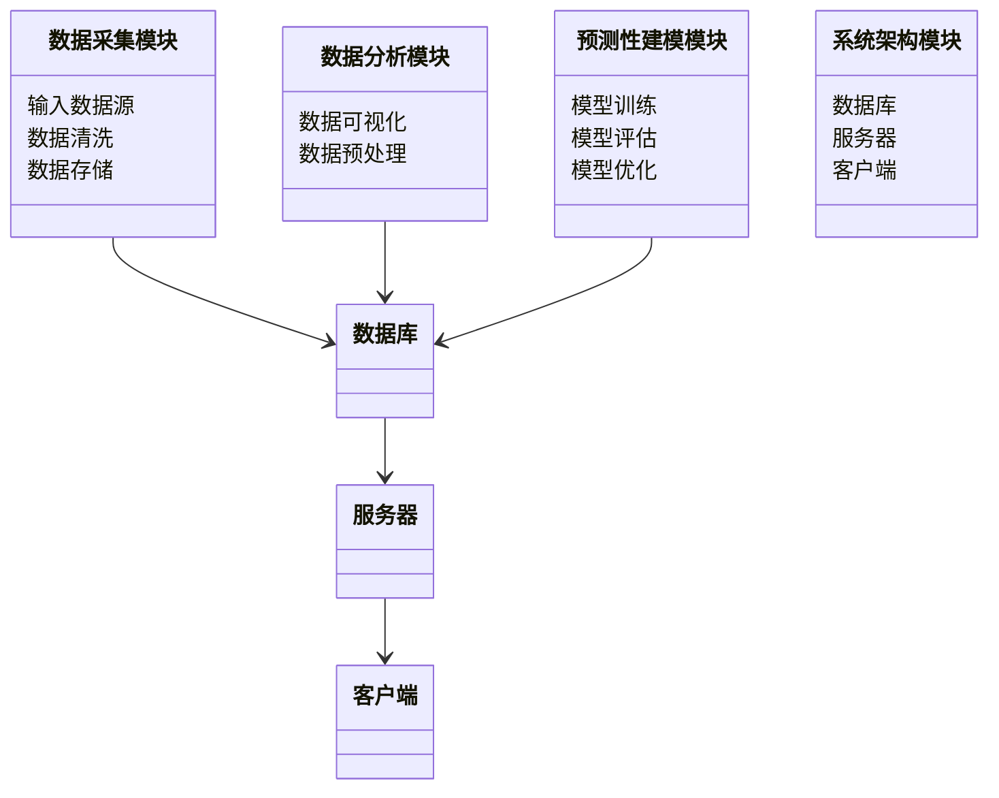
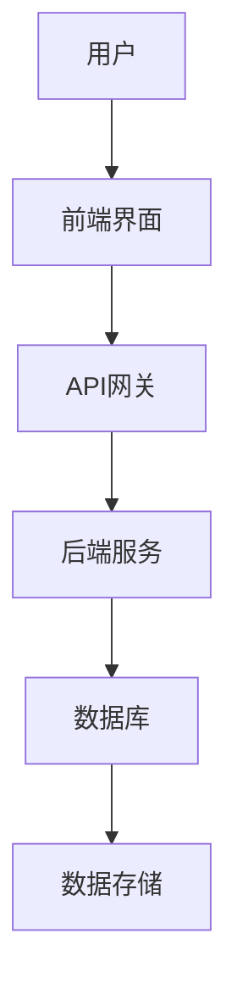
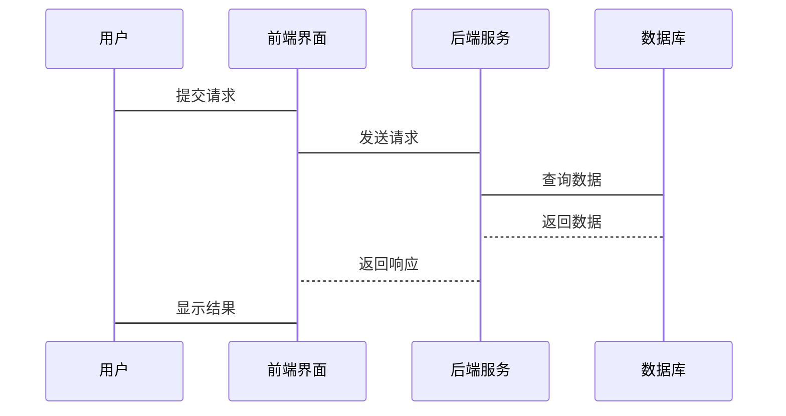

                 


# AI驱动的企业战略规划：大数据分析与预测性建模的融合

> 关键词：AI驱动，企业战略规划，大数据分析，预测性建模，企业数字化转型

> 摘要：随着企业环境的日益复杂化和竞争的加剧，企业战略规划需要更加数据驱动和智能化。通过结合大数据分析和预测性建模，企业能够更精准地识别趋势、优化决策并制定前瞻性的战略。本文将详细探讨AI如何驱动企业战略规划的变革，以及如何通过大数据分析与预测性建模的融合，为企业提供更高效、更智能的战略规划解决方案。

---

## 第一部分：AI驱动的企业战略规划概述

### 第1章：企业战略规划的数字化转型

#### 1.1 企业战略规划的传统模式
##### 1.1.1 传统企业战略规划的特点
- 依赖经验判断和主观决策
- 数据支持有限，缺乏实时性和动态性
- 预测准确性不足，难以应对快速变化的市场环境

##### 1.1.2 传统模式的局限性
- 数据孤岛问题：各部门数据分散，难以整合
- 数据分析能力不足：缺乏专业的数据分析团队和技术
- 预测模型简单：依赖线性回归等简单模型，难以捕捉复杂市场趋势

##### 1.1.3 数字化转型的必要性
- 市场环境变化快：企业需要更快的决策响应
- 数据量激增：企业需要更高效的数据处理能力
- 竞争加剧：企业需要更精准的预测和决策能力

#### 1.2 AI驱动的战略规划优势
##### 1.2.1 数据驱动的决策优势
- 结合历史数据和实时数据，提供更全面的决策依据
- 通过大数据分析，识别潜在市场机会和风险

##### 1.2.2 预测性建模的精准性
- 利用机器学习算法，构建复杂的预测模型
- 通过模型优化和调参，提高预测准确性

##### 1.2.3 提高企业竞争力的核心作用
- 提高决策效率和准确性
- 优化资源配置，降低运营成本
- 提前预判市场趋势，制定更具前瞻性的战略

---

### 第2章：大数据分析与预测性建模的融合

#### 2.1 大数据分析的核心技术
##### 2.1.1 数据采集与处理
- 数据来源：企业内部数据、外部市场数据、社交媒体数据等
- 数据清洗：处理缺失值、异常值和重复数据
- 数据预处理：数据标准化、归一化和特征提取

##### 2.1.2 数据分析方法
- 描述性分析：总结数据的基本特征
- 预测性分析：利用历史数据预测未来趋势
- 对比分析：分析不同场景下的数据差异

##### 2.1.3 数据建模与分析
- 数据建模：构建统计模型或机器学习模型
- 模型评估：通过交叉验证、准确率、召回率等指标评估模型性能
- 模型优化：通过参数调优和特征选择提高模型性能

#### 2.2 预测性建模的基本原理
##### 2.2.1 预测模型的分类
- 回归模型：预测连续型变量（如销售额预测）
- 分类模型：预测离散型变量（如客户 churn 预测）
- 时间序列模型：预测随时间变化的变量（如股票价格预测）

##### 2.2.2 模型训练与评估
- 训练数据：用于模型训练
- 测试数据：用于模型评估
- 评估指标：准确率、精确率、召回率、F1值等

##### 2.2.3 模型优化与调参
- 参数调优：通过网格搜索或随机搜索找到最优参数
- 特征选择：通过特征重要性分析选择关键特征
- 模型集成：通过投票法或加权法集成多个模型的结果

#### 2.3 数据分析与预测性建模的融合应用
##### 2.3.1 数据分析在战略规划中的作用
- 通过数据分析识别市场趋势和客户行为
- 通过数据可视化工具（如 Tableau、Power BI）展示数据洞察
- 通过数据驱动的决策优化企业资源配置

##### 2.3.2 预测性建模在战略规划中的应用
- 预测销售额：基于历史销售数据和市场数据
- 预测客户流失：基于客户行为数据和历史流失数据
- 预测市场趋势：基于宏观经济数据和行业数据

##### 2.3.3 融合应用的案例分析
- 某零售企业通过大数据分析和预测性建模优化库存管理
- 某金融企业通过预测性建模识别欺诈交易
- 某制造企业通过数据分析和预测性建模优化生产计划

---

## 第二部分：核心概念与联系

### 第3章：大数据分析与预测性建模的核心原理

#### 3.1 大数据分析的原理
##### 3.1.1 数据的特征提取
- 特征选择：通过统计方法或机器学习方法选择关键特征
- 特征工程：通过数据变换、特征组合等方法提高特征质量

##### 3.1.2 数据的模式识别
- 聚类分析：识别数据中的自然分组（如客户分群）
- 分类分析：根据特征将数据分为不同类别（如信用评分）

##### 3.1.3 数据的关联分析
- 关联规则挖掘：发现数据中的关联规则（如购物篮分析）
- 时间序列分析：识别数据中的趋势、周期性和异常

#### 3.2 预测性建模的原理
##### 3.2.1 数据的特征工程
- 特征选择：选择对目标变量影响较大的特征
- 特征变换：对特征进行标准化、归一化等处理
- 特征组合：通过组合多个特征生成新的特征

##### 3.2.2 模型的选择与训练
- 模型选择：根据数据特点选择合适的模型（如线性回归、决策树、随机森林）
- 模型训练：通过梯度下降、随机梯度下降等优化算法训练模型
- 模型评估：通过交叉验证评估模型的泛化能力

##### 3.2.3 模型的优化与调参
- 超参数调优：通过网格搜索或随机搜索找到最优超参数
- 正则化方法：通过 L1 正则化或 L2 正则化防止模型过拟合
- 模型集成：通过投票法或加权法集成多个模型的结果

#### 3.3 核心概念对比表格
##### 3.3.1 数据分析与预测性建模的对比
| 对比维度       | 数据分析          | 预测性建模         |
|----------------|-------------------|-------------------|
| 目标           | 描述数据特征      | 预测未来趋势       |
| 方法           | 描述性统计、数据可视化 | 回归、分类、时间序列模型 |
| 应用场景       | 市场分析、客户分群 | 销售预测、客户流失预测 |

##### 3.3.2 不同模型的性能对比
| 模型类型       | 线性回归         | 决策树           | 随机森林       |
|----------------|-----------------|-----------------|----------------|
| 优势           | 简单易解释       | 高准确性         | 高准确性和鲁棒性 |
| 缺点           | 易受维度灾难影响 | 易过拟合         | 计算复杂度高     |

#### 3.4 ER实体关系图
##### 3.4.1 实体关系图的构建
```mermaid
er
  Customer: id, name, email, phone
  Product: id, name, price, category
  Sales: id, customer_id, product_id, sales_date, quantity
  ```

##### 3.4.2 实体关系图的分析
- Customer 表：存储客户信息，包括 id、姓名、邮箱和电话
- Product 表：存储产品信息，包括 id、名称、价格和类别
- Sales 表：记录销售记录，包括客户 ID、产品 ID、销售日期和数量

---

## 第三部分：算法原理讲解

### 第4章：预测性建模

#### 4.1 线性回归
##### 4.1.1 线性回归的基本原理
- 线性回归是一种统计学方法，用于建立自变量和因变量之间的线性关系
- 模型公式：$$y = \beta_0 + \beta_1 x + \epsilon$$
- 其中，$$y$$ 是因变量，$$x$$ 是自变量，$$\beta_0$$ 是截距，$$\beta_1$$ 是回归系数，$$\epsilon$$ 是误差项

##### 4.1.2 线性回归的实现步骤
1. 数据准备：收集和整理数据，确保数据的完整性和准确性
2. 特征选择：选择对目标变量影响较大的特征
3. 模型训练：使用最小二乘法或梯度下降算法训练模型
4. 模型评估：通过 R² 值、均方误差（MSE）等指标评估模型性能
5. 模型优化：通过调整模型参数或添加多项式特征优化模型性能

##### 4.1.3 线性回归的代码实现
```python
import numpy as np
from sklearn.linear_model import LinearRegression
from sklearn.metrics import mean_squared_error

# 数据准备
X = np.array([[1], [2], [3], [4], [5]])
y = np.array([2, 4, 5, 4, 6])

# 模型训练
model = LinearRegression()
model.fit(X, y)

# 模型预测
y_pred = model.predict(X)

# 模型评估
mse = mean_squared_error(y, y_pred)
print("均方误差：", mse)
```

##### 4.1.4 线性回归的实际案例
- 案例背景：某零售企业希望预测不同地区的销售额
- 数据准备：收集各地区的销售数据和相关特征（如人口密度、平均收入、市场竞争）
- 模型训练：使用线性回归模型预测销售额
- 模型评估：通过 R² 值评估模型的拟合优度
- 模型优化：通过添加多项式特征或岭回归（Ridge Regression）防止过拟合

---

#### 4.2 决策树
##### 4.2.1 决策树的基本原理
- 决策树是一种基于树结构的分类模型，通过特征分裂将数据分成不同的子集
- 模型优势：易于解释，适合处理非线性关系
- 常用算法：ID3、C4.5、CART

##### 4.2.2 决策树的实现步骤
1. 数据准备：收集和整理数据，确保数据的完整性和准确性
2. 特征选择：选择对目标变量影响较大的特征
3. 模型训练：使用 CART 算法构建决策树
4. 模型剪枝：通过预剪枝或后剪枝防止过拟合
5. 模型评估：通过准确率、精确率、召回率等指标评估模型性能

##### 4.2.3 决策树的代码实现
```python
from sklearn.tree import DecisionTreeClassifier
from sklearn.metrics import accuracy_score

# 数据准备
X = [[1, 1], [1, 0], [0, 1], [0, 0]]
y = [0, 1, 1, 0]

# 模型训练
model = DecisionTreeClassifier()
model.fit(X, y)

# 模型预测
y_pred = model.predict(X)

# 模型评估
accuracy = accuracy_score(y, y_pred)
print("准确率：", accuracy)
```

##### 4.2.4 决策树的实际案例
- 案例背景：某金融企业希望预测客户是否会发生违约
- 数据准备：收集客户特征数据（如信用评分、收入、负债等）
- 模型训练：使用决策树模型进行分类
- 模型评估：通过准确率、精确率、召回率等指标评估模型性能
- 模型优化：通过调整树的深度或使用随机森林防止过拟合

---

#### 4.3 随机森林
##### 4.3.1 随机森林的基本原理
- 随机森林是一种基于袋装法（Bagging）和特征随机选择的集成学习方法
- 模型优势：高准确性和鲁棒性，适合处理高维数据
- 常用算法：随机森林、梯度提升树（GBDT）、XGBoost

##### 4.3.2 随机森林的实现步骤
1. 数据准备：收集和整理数据，确保数据的完整性和准确性
2. 特征选择：选择对目标变量影响较大的特征
3. 模型训练：使用随机森林算法构建集成模型
4. 模型调参：通过网格搜索或随机搜索找到最优参数
5. 模型评估：通过准确率、精确率、召回率等指标评估模型性能

##### 4.3.3 随机森林的代码实现
```python
from sklearn.ensemble import RandomForestClassifier
from sklearn.metrics import accuracy_score

# 数据准备
X = [[1, 1], [1, 0], [0, 1], [0, 0]]
y = [0, 1, 1, 0]

# 模型训练
model = RandomForestClassifier(n_estimators=10, max_depth=2, random_state=0)
model.fit(X, y)

# 模型预测
y_pred = model.predict(X)

# 模型评估
accuracy = accuracy_score(y, y_pred)
print("准确率：", accuracy)
```

##### 4.3.4 随机森林的实际案例
- 案例背景：某制造企业希望预测生产线的故障率
- 数据准备：收集生产线的运行数据和相关特征（如温度、压力、振动等）
- 模型训练：使用随机森林模型进行分类
- 模型评估：通过准确率、精确率、召回率等指标评估模型性能
- 模型优化：通过调整树的数量或深度优化模型性能

---

## 第四部分：系统分析与架构设计方案

### 第5章：系统分析与架构设计

#### 5.1 问题场景介绍
- 企业战略规划的复杂性
- 数据分散、分析能力不足
- 预测模型简单，难以应对复杂市场环境

#### 5.2 项目介绍
- 项目目标：构建一个基于大数据分析和预测性建模的企业战略规划系统
- 项目范围：涵盖数据采集、分析、建模、预测和可视化
- 项目团队：数据工程师、数据科学家、软件开发人员

#### 5.3 系统功能设计
##### 5.3.1 领域模型


##### 5.3.2 系统架构设计


##### 5.3.3 系统接口设计
- 前端接口：用户通过前端界面提交请求
- 后端接口：后端服务接收请求并返回结果
- 数据接口：数据采集模块与数据存储模块之间的接口

##### 5.3.4 系统交互设计


---

## 第五部分：项目实战

### 第6章：项目实战

#### 6.1 环境安装
- 安装 Python 和相关库（如 NumPy、Pandas、Scikit-learn、XGBoost）
- 安装数据可视化工具（如 Matplotlib、Seaborn、Tableau）
- 安装机器学习框架（如 TensorFlow、Keras）

#### 6.2 系统核心实现源代码
##### 6.2.1 数据采集与预处理
```python
import pandas as pd
import numpy as np

# 数据采集
data = pd.read_csv('data.csv')

# 数据清洗
data.dropna(inplace=True)
data = data[~data.duplicated()]
```

##### 6.2.2 数据分析与建模
```python
from sklearn.model_selection import train_test_split
from sklearn.ensemble import RandomForestRegressor
from sklearn.metrics import mean_squared_error

# 数据分割
X = data.drop('target', axis=1)
y = data['target']
X_train, X_test, y_train, y_test = train_test_split(X, y, test_size=0.2, random_state=42)

# 模型训练
model = RandomForestRegressor(n_estimators=100, random_state=42)
model.fit(X_train, y_train)

# 模型预测
y_pred = model.predict(X_test)

# 模型评估
mse = mean_squared_error(y_test, y_pred)
print("均方误差：", mse)
```

##### 6.2.3 模型优化与部署
```python
from sklearn.model_selection import GridSearchCV

# 参数调优
param_grid = {
    'n_estimators': [100, 200],
    'max_depth': [None, 10, 20],
    'min_samples_split': [2, 5]
}

grid_search = GridSearchCV(RandomForestRegressor(), param_grid, cv=5)
grid_search.fit(X_train, y_train)

best_model = grid_search.best_estimator_
print("最优参数：", grid_search.best_params_)
```

#### 6.3 案例分析与结果解读
- 案例背景：某零售企业希望预测不同地区的销售额
- 数据准备：收集各地区的销售数据和相关特征（如人口密度、平均收入、市场竞争）
- 模型训练：使用随机森林模型进行预测
- 模型评估：通过均方误差评估模型性能
- 结果解读：根据模型预测结果优化库存管理和销售策略

#### 6.4 项目总结
- 项目目标实现情况：是否达到了预期的预测准确率
- 项目遇到的问题及解决方案：数据质量问题、模型过拟合问题等
- 项目经验总结：数据预处理的重要性、模型调优的技巧等

---

## 第六部分：最佳实践与小结

### 第7章：最佳实践与小结

#### 7.1 最佳实践
##### 7.1.1 数据准备阶段
- 确保数据的完整性和准确性
- 进行数据清洗和特征工程
- 处理数据孤岛问题

##### 7.1.2 模型选择阶段
- 根据数据特点选择合适的模型
- 进行模型调优和集成
- 避免模型过拟合

##### 7.1.3 模型部署阶段
- 进行模型封装和部署
- 定期模型更新和优化
- 监控模型性能

#### 7.2 小结
- AI驱动的企业战略规划的核心是大数据分析和预测性建模的融合
- 通过数据驱动的决策和预测性建模，企业能够更精准地识别趋势、优化决策并制定前瞻性的战略
- 未来，随着AI技术的不断发展，企业战略规划将更加智能化和数据化

#### 7.3 注意事项
- 数据隐私和安全问题
- 模型的可解释性问题
- 模型的实时性和动态更新问题

#### 7.4 拓展阅读
- 《机器学习实战》
- 《大数据分析与应用》
- 《企业战略管理》

---

## 作者

**作者：AI天才研究院/AI Genius Institute & 禅与计算机程序设计艺术 /Zen And The Art of Computer Programming**

