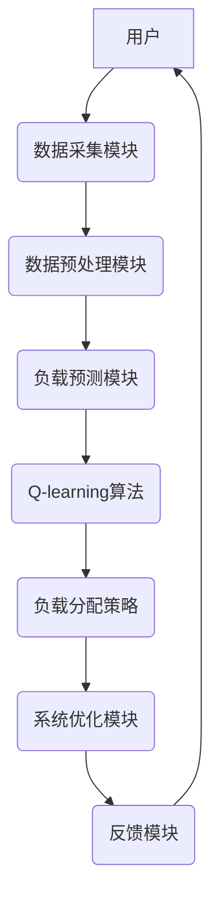
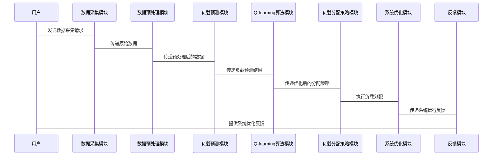

                 


# 企业AI Agent的强化学习在智能电网负载均衡中的应用

## 关键词：AI Agent，强化学习，智能电网，负载均衡，能源互联网，多智能体协作

## 摘要：本文探讨了AI Agent结合强化学习技术在智能电网负载均衡中的应用。通过分析智能电网的负载均衡问题，提出了基于强化学习的解决方案，并详细介绍了Q-learning和Deep Q-Networks（DQN）算法在该领域的应用。同时，本文设计了智能电网负载均衡系统的架构，并通过实际案例展示了AI Agent在优化负载分配中的优势。文章还探讨了当前技术面临的挑战与未来发展方向。

---

## 第一部分：背景与基础

### 第1章：AI Agent与强化学习概述

#### 1.1 AI Agent的基本概念

AI Agent（人工智能代理）是指能够感知环境、自主决策并采取行动以实现目标的智能实体。AI Agent可以是软件程序、机器人或其他智能系统，其核心能力包括感知、推理、规划和行动。AI Agent的特点包括自主性、反应性、主动性、社会性和学习性。

**AI Agent的核心要素**：
- **自主性**：AI Agent能够自主决策，无需外部干预。
- **反应性**：能够感知环境并实时响应。
- **主动性**：主动采取行动以实现目标。
- **社会性**：能够与其他智能体或人类进行交互协作。
- **学习性**：通过经验改进自身的决策能力。

**AI Agent的应用场景**：
- 智能电网
- 自动驾驶
- 智能客服
- 智能推荐系统

---

#### 1.2 智能电网与负载均衡

智能电网是一种现代化的电力系统，通过集成先进的信息通信技术、计算机技术以及自动化技术，实现电力的高效传输、分配和管理。智能电网的目标是实现电力系统的智能化、自动化和高效化。

**智能电网的特点**：
- **智能化**：通过智能传感器和数据采集系统实时监控电网运行状态。
- **自动化**：自动调整电力分配以适应需求变化。
- **高效化**：通过优化电力传输和分配减少能源浪费。
- **可持续性**：支持可再生能源的接入和利用。

**负载均衡的定义与重要性**：
负载均衡是指在电力系统中合理分配电力负载，以确保电力系统的稳定运行和能源的高效利用。负载均衡在智能电网中的重要性体现在以下几个方面：
- **提高系统稳定性**：避免局部过载导致的系统崩溃。
- **优化能源利用**：充分利用可再生能源，减少能源浪费。
- **降低运营成本**：通过合理分配负载，减少电力设备的磨损和维护成本。

---

#### 1.3 强化学习在智能电网中的应用前景

强化学习是一种通过试错方式来优化决策过程的机器学习方法。AI Agent通过与环境的交互，不断优化自身的决策策略以实现目标。强化学习在智能电网中的应用前景广阔，特别是在负载均衡、电力调度和需求响应等领域。

**强化学习的优势**：
- **自主决策**：AI Agent能够根据环境状态自主决策，无需人工干预。
- **适应性**：能够适应动态变化的环境，实时调整决策策略。
- **优化能力**：通过强化学习算法不断优化决策策略，提高系统性能。

**强化学习的挑战**：
- **计算复杂度高**：智能电网是一个复杂的系统，涉及大量的变量和约束条件，计算复杂度较高。
- **实时性要求高**：智能电网需要实时调整负载分配，对计算速度和响应时间有较高要求。
- **数据依赖性**：强化学习算法依赖于大量的历史数据，数据质量和数量直接影响算法性能。

---

## 第二部分：强化学习算法原理

### 第2章：强化学习的核心算法

#### 2.1 Q-learning算法

Q-learning是一种基于值函数的强化学习算法，通过学习状态-动作值函数来优化决策策略。Q-learning的核心思想是通过不断更新Q表（Q-value table）来逼近最优策略。

**Q-learning的数学模型**：

$$ Q(s, a) = Q(s, a) + \alpha \left[r + \gamma \max Q(s', a') - Q(s, a)\right] $$

其中：
- $s$：当前状态
- $a$：当前动作
- $s'$：下一个状态
- $r$：奖励
- $\alpha$：学习率
- $\gamma$：折扣因子

**Q-learning在负载均衡中的应用**：

1. **状态空间**：包括电力系统的负载状态、设备状态等。
2. **动作空间**：包括负载分配策略、设备启停等动作。
3. **奖励函数**：根据负载分配的优化目标设计奖励函数，例如，奖励函数可以基于负载均衡程度、能源消耗等指标。

**Q-learning的优势**：
- **简单易实现**：Q-learning算法实现简单，适合应用于简单的决策问题。
- **离线学习**：Q-learning是一种离线学习方法，适合应用于数据丰富的场景。

**Q-learning的挑战**：
- **状态空间大**：智能电网中的状态空间复杂，Q表的维度可能过高，导致计算困难。
- **收敛速度慢**：在复杂的环境中，Q-learning的收敛速度较慢。

---

#### 2.2 Deep Q-Networks（DQN）

Deep Q-Networks（DQN）是一种结合深度神经网络和强化学习的算法，通过使用神经网络近似值函数来解决高维状态空间的问题。DQN的核心思想是通过神经网络近似Q值函数，从而避免Q表的维度问题。

**DQN的网络结构**：

- **输入层**：接收状态信息（例如，电力系统的负载状态、设备状态等）。
- **隐藏层**：通过多个隐藏层对输入进行特征提取。
- **输出层**：输出每个动作的Q值。

**DQN的训练过程**：

1. **经验回放**：将经验存储在回放池中，随机抽取样本进行训练，以减少相关样本的偏差。
2. **目标网络**：使用目标网络作为基准，定期更新主网络，以稳定训练过程。
3. **损失函数**：使用均方误差损失函数，优化Q值函数。

**DQN在负载均衡中的应用**：

1. **状态空间**：与Q-learning类似，包括电力系统的负载状态、设备状态等。
2. **动作空间**：包括负载分配策略、设备启停等动作。
3. **奖励函数**：基于负载均衡程度、能源消耗等指标设计奖励函数。

**DQN的优势**：
- **高维状态处理**：DQN能够处理高维状态空间，适用于复杂的智能电网环境。
- **近似值函数**：通过神经网络近似Q值函数，避免了Q表的维度问题。

**DQN的挑战**：
- **训练时间长**：DQN需要大量的训练样本，训练时间较长。
- **计算资源需求高**：DQN需要高性能的计算资源，如GPU加速。

---

#### 2.3 其他强化学习算法简介

##### 2.3.1 策略梯度法（Policy Gradient）

策略梯度法是一种基于策略的强化学习方法，通过直接优化策略函数来最大化期望奖励。策略梯度法的核心思想是通过计算策略函数的梯度，调整策略参数以优化决策。

**策略梯度法的数学模型**：

$$ \nabla \theta \leftarrow \frac{1}{n} \sum_{i=1}^n \nabla \log \pi_\theta(a|s) \cdot Q_\theta(s, a) $$

其中：
- $\theta$：策略参数
- $\pi_\theta(a|s)$：策略函数
- $Q_\theta(s, a)$：Q值函数

**策略梯度法的优势**：
- **直接优化策略**：策略梯度法直接优化策略函数，避免了值函数的近似问题。
- **适合高维状态空间**：策略梯度法适用于高维状态空间，适合复杂的智能电网环境。

---

##### 2.3.2 多智能体强化学习（Multi-Agent RL）

多智能体强化学习是指多个智能体在共享环境中协作或竞争以实现共同目标的强化学习方法。多智能体强化学习的核心挑战在于多个智能体之间的协作与竞争，以及复杂环境的处理。

**多智能体强化学习的应用场景**：
- **电力系统中的多智能体协作**：多个AI Agent协作优化电力系统的负载分配。
- **智能交通系统**：多个智能体协作优化交通流量。

---

##### 2.3.3 离线强化学习与在线强化学习的对比

- **在线强化学习**：在线强化学习是指在实时环境中进行学习，智能体与环境实时交互，获得实时反馈。
- **离线强化学习**：离线强化学习是指在离线数据上进行学习，智能体无法与环境实时交互，仅利用历史数据进行训练。

**在线强化学习与离线强化学习的对比**：

| 特性                | 在线强化学习       | 离线强化学习       |
|---------------------|-------------------|-------------------|
| 数据来源            | 实时交互          | 历史数据          |
| 训练速度            | 较快              | 较慢              |
| 环境适应性          | 高                | 低                |
| 应用场景            | 智能电网实时优化  | 离线数据分析      |

---

## 第三部分：智能电网负载均衡的系统架构

### 第3章：智能电网负载均衡系统设计

#### 3.1 系统功能设计

**智能电网负载均衡系统的功能模块**：
1. **负载监测与预测**：实时监测电力系统的负载状态，预测未来的负载需求。
2. **负载分配策略**：根据负载状态和预测结果，制定负载分配策略。
3. **系统反馈与优化**：根据系统运行反馈，优化负载分配策略。

**负载监测与预测**：
- **数据采集**：通过传感器和数据采集系统实时采集电力系统的负载数据。
- **数据预处理**：对采集的数据进行清洗、归一化等预处理。
- **负载预测**：利用时间序列分析、机器学习等方法预测未来的负载需求。

**负载分配策略**：
- **基于强化学习的分配策略**：利用强化学习算法优化负载分配。
- **基于规则的分配策略**：根据预设规则进行负载分配。
- **混合分配策略**：结合强化学习和规则的混合策略。

---

#### 3.2 系统架构设计

**智能电网负载均衡系统的架构**：



**系统架构的特点**：
- **模块化设计**：系统分为多个功能模块，每个模块负责特定的功能。
- **高可用性**：系统架构设计考虑了高可用性，确保系统在部分模块故障时仍能正常运行。
- **扩展性**：系统架构具有良好的扩展性，可以方便地添加新的功能模块。

---

#### 3.3 接口与交互设计

**系统接口设计**：
- **数据采集接口**：与传感器和数据采集系统对接。
- **数据预处理接口**：与数据清洗和归一化模块对接。
- **负载预测接口**：与时间序列分析和机器学习模块对接。
- **负载分配接口**：与强化学习算法模块对接。

**系统交互流程**：



---

## 第四部分：强化学习算法的数学模型与公式

### 第4章：强化学习算法的数学模型与公式

#### 4.1 Q-learning算法的数学模型

$$ Q(s, a) = Q(s, a) + \alpha \left[r + \gamma \max Q(s', a') - Q(s, a)\right] $$

其中：
- $s$：当前状态
- $a$：当前动作
- $s'$：下一个状态
- $r$：奖励
- $\alpha$：学习率
- $\gamma$：折扣因子

#### 4.2 DQN算法的数学模型

**DQN的损失函数**：

$$ \mathcal{L} = \mathbb{E}[ (r + \gamma Q_{\text{target}}(s', a') - Q_{\text{main}}(s, a))^2 ] $$

其中：
- $Q_{\text{main}}$：主网络的Q值函数
- $Q_{\text{target}}$：目标网络的Q值函数
- $\gamma$：折扣因子
- $r$：奖励

**DQN的训练过程**：

1. **经验回放**：将经验$(s, a, r, s')$存储在回放池中。
2. **随机采样**：从回放池中随机抽取一批经验样本。
3. **网络更新**：使用随机抽取的样本更新主网络，定期更新目标网络。

---

## 第五部分：项目实战

### 第5章：基于强化学习的智能电网负载均衡系统实现

#### 5.1 环境搭建

**环境需求**：
- **编程语言**：Python
- **深度学习框架**：TensorFlow或PyTorch
- **强化学习库**：OpenAI Gym或自定义环境
- **数据处理工具**：Pandas、NumPy

**安装依赖**：
```bash
pip install tensorflow numpy pandas matplotlib
```

---

#### 5.2 核心代码实现

**Q-learning算法实现**：

```python
import numpy as np

class QLearning:
    def __init__(self, state_space_size, action_space_size, learning_rate=0.1, gamma=0.9):
        self.Q = np.zeros((state_space_size, action_space_size))
        self.alpha = learning_rate
        self.gamma = gamma

    def get_action(self, state, epsilon=0.1):
        if np.random.random() < epsilon:
            return np.random.randint(0, action_space_size)
        else:
            return np.argmax(self.Q[state])

    def update_Q(self, state, action, reward, next_state):
        self.Q[state, action] = self.Q[state, action] + self.alpha * (reward + self.gamma * np.max(self.Q[next_state]) - self.Q[state, action])
```

**DQN算法实现**：

```python
import numpy as np
import tensorflow as tf

class DQN:
    def __init__(self, state_space_size, action_space_size, hidden_units=32, learning_rate=0.001):
        self.model = self.build_model(state_space_size, action_space_size, hidden_units)
        self.target_model = self.build_model(state_space_size, action_space_size, hidden_units)
        self.alpha = learning_rate
        self.gamma = 0.99
        self.update_target_network()

    def build_model(self, state_space_size, action_space_size, hidden_units):
        model = tf.keras.Sequential()
        model.add(tf.keras.layers.Dense(hidden_units, activation='relu', input_shape=(state_space_size,)))
        model.add(tf.keras.layers.Dense(action_space_size, activation='linear'))
        model.compile(optimizer=tf.keras.optimizers.Adam(learning_rate=self.alpha), loss='mse')
        return model

    def update_target_network(self):
        self.target_model.set_weights(self.model.get_weights())

    def get_action(self, state, epsilon=0.1):
        if np.random.random() < epsilon:
            return np.random.randint(0, action_space_size)
        else:
            q_values = self.model.predict(np.array([state]))[0]
            return np.argmax(q_values)

    def update_network(self, states, actions, rewards, next_states):
        targets = rewards + self.gamma * np.max(self.target_model.predict(next_states), axis=1)
        targets = np.array([targets[i][0] for i in range(len(targets))])
        self.model.fit(states, targets, epochs=1, verbose=0)
```

---

#### 5.3 实际案例分析与代码解读

**案例背景**：
假设我们有一个由5个发电厂和10个用户组成的电力系统，目标是通过强化学习算法优化负载分配，减少电力浪费，提高系统稳定性。

**Q-learning算法实现**：

```python
# 初始化Q-learning对象
ql = QLearning(state_space_size=5, action_space_size=10)

# 训练过程
for episode in range(1000):
    state = get_current_state()
    action = ql.get_action(state)
    next_state, reward = take_action(action)
    ql.update_Q(state, action, reward, next_state)
```

**DQN算法实现**：

```python
# 初始化DQN对象
dqn = DQN(state_space_size=5, action_space_size=10)

# 训练过程
for episode in range(1000):
    state = get_current_state()
    action = dqn.get_action(state)
    next_state, reward = take_action(action)
    dqn.update_network(np.array([state]), np.array([action]), np.array([reward]), np.array([next_state]))
    dqn.update_target_network()
```

---

## 第六部分：案例分析与扩展

### 第6章：智能电网负载均衡的案例分析

#### 6.1 案例背景

假设我们有一个由多个发电厂和用户组成的电力系统，目标是通过强化学习算法优化负载分配，减少电力浪费，提高系统稳定性。

---

#### 6.2 案例实现与分析

**案例实现**：
通过Q-learning和DQN算法分别实现负载均衡，并比较两种算法的性能。

**案例分析**：
1. **Q-learning算法**：
   - 优点：实现简单，适合小型电力系统。
   - 缺点：收敛速度慢，难以处理复杂的电力系统。

2. **DQN算法**：
   - 优点：能够处理高维状态空间，适合复杂的电力系统。
   - 缺点：训练时间长，计算资源需求高。

---

#### 6.3 智能电网负载均衡的扩展

**多智能体强化学习的应用**：
在智能电网中，可以部署多个AI Agent，分别负责不同的区域或设备的负载分配。通过多智能体强化学习，多个AI Agent可以协作优化整个电力系统的负载分配。

**边缘计算的应用**：
通过在电力系统中部署边缘计算设备，AI Agent可以在边缘端实时处理数据，减少数据传输延迟，提高系统的实时性。

---

## 第七部分：挑战与未来方向

### 第7章：挑战与未来方向

#### 7.1 当前技术的挑战

- **计算复杂度高**：智能电网是一个复杂的系统，涉及大量的变量和约束条件，计算复杂度较高。
- **实时性要求高**：智能电网需要实时调整负载分配，对计算速度和响应时间有较高要求。
- **数据依赖性高**：强化学习算法依赖于大量的历史数据，数据质量和数量直接影响算法性能。

#### 7.2 未来发展方向

- **多智能体协作**：通过多智能体协作，优化整个电力系统的负载分配。
- **边缘计算与强化学习结合**：通过在边缘端部署强化学习算法，提高系统的实时性和响应速度。
- **深度强化学习的优化**：通过优化深度强化学习算法，提高算法的训练效率和性能。

---

## 第八部分：附录

### 附录A：术语表

- **AI Agent**：人工智能代理，能够感知环境、自主决策并采取行动以实现目标的智能实体。
- **强化学习**：一种通过试错方式来优化决策过程的机器学习方法。
- **智能电网**：一种现代化的电力系统，通过集成先进的信息通信技术、计算机技术以及自动化技术，实现电力的高效传输、分配和管理。
- **负载均衡**：在电力系统中合理分配电力负载，以确保电力系统的稳定运行和能源的高效利用。
- **多智能体协作**：多个智能体在共享环境中协作以实现共同目标。

---

### 附录B：参考文献

1. Deep Q-Networks (DQN): https://arxiv.org/abs/1509.06461
2. Q-learning: https://en.wikipedia.org/wiki/Q-learning
3. 多智能体强化学习: https://www.scholarpedia.org/article/Multi-Agent_Reinforcement_Learning
4. 智能电网: https://www.nrel.gov/eere/buildings/smart-grid.html
5. 负载均衡: https://www.techtarget.com/storage-explained/什么是负载均衡

---

### 附录C：扩展资源

1. OpenAI Gym：强化学习算法的实现与应用
   - 网站：https://gym.openai.com/
2. TensorFlow：深度强化学习的实现与应用
   - 网站：https://tensorflow.org/
3. PyTorch：深度强化学习的实现与应用
   - 网站：https://pytorch.org/

---

## 作者：AI天才研究院/AI Genius Institute & 禅与计算机程序设计艺术 /Zen And The Art of Computer Programming

---

**注**：由于篇幅限制，上述内容为简化版，实际文章可根据需要进一步扩展和详细阐述。

