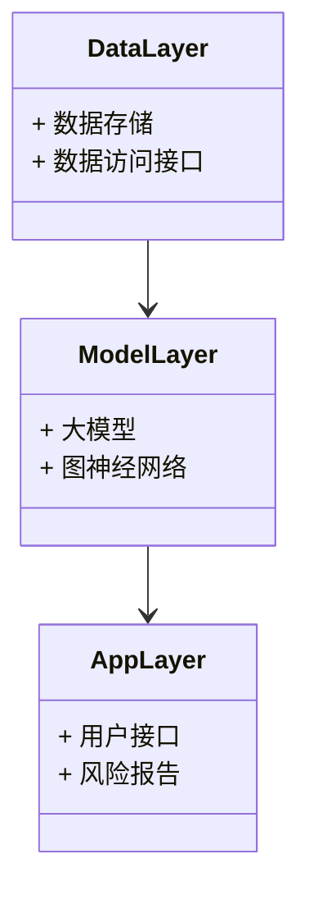
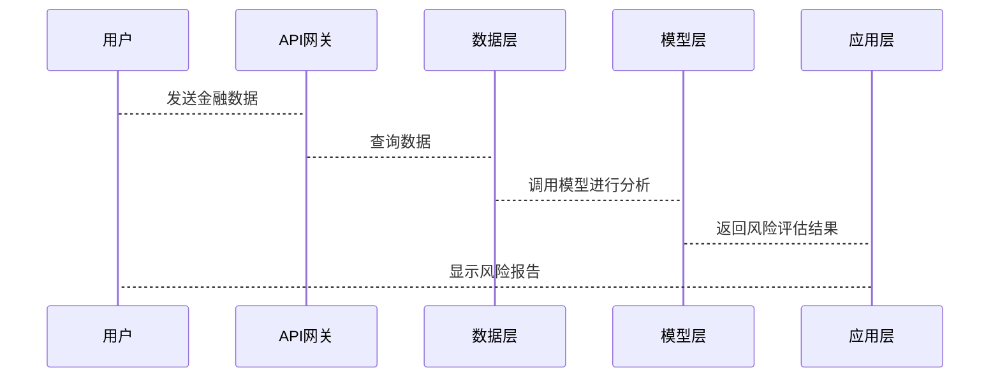

                 


# 大模型在金融风险控制中的创新应用案例

## 关键词：大模型，金融风险控制，自然语言处理，图神经网络，Transformer，风险评估

## 摘要：本文系统阐述了大模型在金融风险控制中的创新应用，深入分析了大模型的核心算法与技术原理，并通过实际案例展示了其在信用评估、市场预测和风险预警等领域的应用。同时，本文探讨了大模型在金融文本分析和图神经网络中的具体实现，并提出了构建基于大模型的金融风险控制系统的架构设计方案。文章内容涵盖从理论到实践的各个方面，为读者提供了全面而深入的指导。

---

# 第1章: 大模型与金融风险控制的背景

## 1.1 大模型的定义与技术特点

### 1.1.1 大模型的基本概念
大模型（Large Language Model，LLM）是一种基于深度学习的自然语言处理模型，通常基于Transformer架构，具有大量参数和强大的上下文理解能力。大模型的核心特点包括：
- **参数规模大**：通常包含 billions级别的参数。
- **预训练机制**：通过在大规模文本数据上进行无监督预训练，模型能够学习到语言的规律和语义信息。
- **通用性**：能够处理多种任务，如文本生成、问答、翻译等。

### 1.1.2 大模型的核心技术特点
大模型的关键技术包括：
- **Transformer架构**：由注意力机制和前馈网络组成，能够捕捉长距离依赖关系。
- **自监督学习**：通过预测下一个词或填补缺失词等方式，模型在大规模数据上进行预训练。
- **并行计算优化**：使用GPU和TPU等硬件加速模型训练和推理。

### 1.1.3 大模型与传统金融模型的对比
传统金融模型（如线性回归、随机森林等）通常依赖于手工设计的特征和规则，而大模型能够自动学习特征并捕捉复杂模式。大模型的优势在于其泛化能力和对非结构化数据（如文本、图像）的处理能力。

---

## 1.2 金融风险控制的定义与挑战

### 1.2.1 金融风险的定义
金融风险是指由于市场波动、信用违约、操作失误等原因，可能导致金融机构或投资者蒙受损失的可能性。常见的金融风险类型包括：
- **信用风险**：债务人或交易对手违约的风险。
- **市场风险**：资产价格波动带来的损失风险。
- **操作风险**：由于内部操作失误或外部事件导致的损失风险。

### 1.2.2 传统金融风险控制的挑战
传统金融风险控制方法面临以下挑战：
- **数据不足**：传统方法依赖于结构化数据，但金融市场中存在大量非结构化数据（如新闻、财报）未被利用。
- **模型复杂性**：复杂金融系统的建模需要处理高维、非线性关系。
- **实时性要求**：金融市场变化快，传统模型难以实时捕捉动态风险。

### 1.2.3 大模型在金融风险控制中的潜在优势
大模型能够处理非结构化数据，具有强大的模式识别能力和实时性，可以显著提升金融风险控制的效率和准确性。

---

# 第2章: 大模型在金融领域的应用现状

## 2.1 大模型在金融领域的应用领域

### 2.1.1 股票预测
大模型可以通过分析新闻、社交媒体和历史数据，预测股票价格走势。例如，使用GPT模型生成市场情绪分析，辅助投资决策。

### 2.1.2 信用评估
大模型可以分析企业的财务报表和信用历史，评估客户的信用风险。例如，使用BERT模型对财报文本进行语义分析，生成信用评分。

### 2.1.3 市场风险控制
大模型可以实时监控市场波动，识别潜在的市场风险。例如，使用Transformer模型分析高频交易数据，预测市场崩盘风险。

### 2.1.4 智能投顾
大模型可以为投资者提供个性化的投资建议。例如，使用GPT模型生成投资报告，推荐适合投资者的资产配置策略。

---

## 2.2 大模型在金融领域的成功案例

### 2.2.1 国内外典型案例分析
- **案例1**：某国际银行使用大模型分析新闻和社交媒体数据，预测外汇汇率走势，显著提高了交易效率。
- **案例2**：国内某金融科技公司利用大模型评估小微企业信用风险，降低贷款违约率。

### 2.2.2 案例对比与经验总结
通过对比不同案例，可以发现大模型在金融领域的成功关键在于：
- 数据质量：需要高质量的训练数据。
- 模型调优：需要针对具体任务进行模型优化。
- 可解释性：需要提高模型的可解释性，以便金融从业者理解和信任。

---

# 第3章: 大模型在金融风险控制中的创新应用

## 3.1 金融风险控制的核心问题

### 3.1.1 信用风险
信用风险是金融风险控制的核心问题之一。传统方法依赖于信用评分模型，而大模型可以通过分析企业财报、新闻等非结构化数据，提供更全面的信用评估。

### 3.1.2 市场风险
市场风险是指由于资产价格波动导致的损失。大模型可以通过分析市场新闻、交易数据等，实时预测市场波动。

### 3.1.3 操作风险
操作风险源于内部操作失误或外部事件。大模型可以通过分析日志数据、员工行为数据等，识别潜在的操作风险。

---

## 3.2 大模型在金融风险控制中的创新应用

### 3.2.1 大模型在信用评估中的应用
- **文本分析**：使用BERT模型分析企业财报、新闻等文本数据，提取关键风险指标。
- **风险评分**：基于文本分析结果，生成信用评分，辅助贷款决策。

### 3.2.2 大模型在市场预测中的应用
- **市场情绪分析**：使用GPT模型分析社交媒体和新闻数据，预测市场情绪。
- **价格预测**：基于市场情绪和历史数据，预测股票、外汇等资产价格。

### 3.2.3 大模型在风险预警中的应用
- **异常检测**：使用图神经网络分析交易数据，识别异常交易行为。
- **实时监控**：建立实时监控系统，基于大模型预测潜在风险。

---

# 第4章: 大模型的核心算法与原理

## 4.1 大模型的主要算法

### 4.1.1 Transformer模型
Transformer由注意力机制和前馈网络组成，具有以下特点：
- **全局注意力**：能够捕捉序列中的全局关系。
- **并行计算**：适合大规模数据的并行处理。

### 4.1.2 BERT模型
BERT是一种基于Transformer的预训练模型，通过掩码自监督任务（MLM）进行训练。BERT在金融领域的应用包括文本分类、问答系统等。

### 4.1.3 GPT系列模型
GPT是一种生成式模型，通过预测下一个词的方式进行训练。GPT在金融领域的应用包括文本生成、市场预测等。

---

## 4.2 大模型的训练与优化

### 4.2.1 预训练目标
- **掩码语言模型**：随机遮蔽部分词，预测被遮蔽的词。
- **下文语境模型**：根据上下文预测当前词。

### 4.2.2 优化策略
- **学习率调度**：使用余弦学习率衰减。
- **批量处理**：通过批量处理提高训练效率。

### 4.2.3 模型压缩与部署
- **剪枝**：去除冗余参数，减少模型大小。
- **量化**：将模型参数从浮点数转换为低精度整数，降低内存占用。

---

# 第5章: 金融风险控制中的自然语言处理

## 5.1 自然语言处理在金融领域的应用

### 5.1.1 财报分析
- **关键词提取**：从企业财报中提取关键财务指标。
- **情感分析**：分析财报文本的情感倾向，评估企业业绩。

### 5.1.2 新闻情感分析
- **情感分类**：分析新闻文本的情感倾向，预测市场情绪。
- **主题抽取**：提取新闻主题，识别市场趋势。

### 5.1.3 风险报告生成
- **文本摘要**：从大量风险报告中生成摘要，快速了解风险情况。
- **自动报告生成**：基于结构化数据，自动生成风险报告。

---

## 5.2 基于大模型的金融文本分析

### 5.2.1 文本特征提取
- **实体识别**：识别文本中的公司名称、日期等实体。
- **关系抽取**：识别文本中的实体间关系。

### 5.2.2 文本分类与聚类
- **分类**：将文本分为不同类别，如正面、负面、中性新闻。
- **聚类**：将相似的文本聚类，识别市场主题。

### 5.2.3 文本生成与摘要
- **生成**：生成新的文本，如市场预测报告。
- **摘要**：从长文本中提取关键信息。

---

# 第6章: 图神经网络在金融风险控制中的应用

## 6.1 图神经网络的基本原理

### 6.1.1 图的表示
- **节点表示**：将每个节点表示为向量。
- **边表示**：通过边权重表示节点之间的关系。

### 6.1.2 图卷积网络
- **局部卷积**：仅考虑节点的局部邻居。
- **全局卷积**：考虑整个图的结构。

### 6.1.3 图注意力机制
- **注意力权重**：根据节点的重要性分配注意力权重。
- **注意力聚合**：根据注意力权重聚合节点特征。

---

## 6.2 基于图神经网络的金融风险评估

### 6.2.1 信用网络构建
- **构建信用图**：将企业与其供应商、客户等关系表示为图结构。
- **信用传播**：通过图传播模型预测企业的信用风险。

### 6.2.2 风险传播模型
- **风险传播**：通过图神经网络传播风险，识别系统性风险。
- **风险聚合**：将多个风险源聚合，评估整体风险。

### 6.2.3 实际案例分析
- **案例分析**：分析某金融系统的信用风险，展示图神经网络的应用效果。

---

# 第7章: 金融风险控制系统的架构与实现

## 7.1 系统架构设计

### 7.1.1 分层架构
- **数据层**：存储金融数据，如股票价格、新闻等。
- **模型层**：部署大模型和图神经网络模型。
- **应用层**：提供用户接口，展示风险评估结果。

### 7.1.2 模块划分
- **数据预处理**：清洗和标注数据。
- **模型训练**：训练大模型和图神经网络模型。
- **实时监控**：实时分析数据，预测风险。

### 7.1.3 数据流设计
- **数据输入**：从数据库或API获取数据。
- **数据处理**：对数据进行清洗和转换。
- **模型推理**：使用模型对数据进行分析和预测。
- **结果输出**：将结果返回给用户或下游系统。

---

## 7.2 系统实现案例

### 7.2.1 环境安装
- **安装Python**：安装Python 3.8或更高版本。
- **安装依赖**：安装PyTorch、Hugging Face Transformers等库。

### 7.2.2 系统核心实现

#### 7.2.2.1 数据预处理
```python
import pandas as pd
import torch

def preprocess_data(data):
    # 数据清洗
    data = data.dropna()
    # 数据转换
    data = data['text'].tolist()
    return data
```

#### 7.2.2.2 模型训练
```python
from transformers import BertForSequenceClassification, BertTokenizer

model = BertForSequenceClassification.from_pretrained('bert-base-uncased')
tokenizer = BertTokenizer.from_pretrained('bert-base-uncased')

optimizer = torch.optim.AdamW(model.parameters(), lr=1e-5)
criterion = torch.nn.CrossEntropyLoss()
```

#### 7.2.2.3 模型推理
```python
def predict(text):
    inputs = tokenizer.encode_plus(text, add_special_tokens=True, return_tensors='pt')
    with torch.no_grad():
        outputs = model(**inputs)
    prediction = torch.argmax(outputs.logits).item()
    return prediction
```

---

## 7.3 系统架构设计方案

### 7.3.1 系统功能设计

#### 7.3.1.1 领域模型


### 7.3.2 系统架构设计


---

## 7.4 系统接口设计

### 7.4.1 API接口
- **输入**：金融数据，如股票价格、新闻文本。
- **输出**：风险评估结果，如信用评分、市场预测。

### 7.4.2 接口设计
```http
POST /api/risk/assessment
Content-Type: application/json

{
    "data": {
        "text": "公司财报内容..."
    }
}
```

---

## 7.5 系统交互设计

### 7.5.1 交互流程



---

# 第8章: 项目实战

## 8.1 环境安装

### 8.1.1 安装Python
- **Python版本**：Python 3.8或更高。

### 8.1.2 安装依赖
```bash
pip install torch transformers pandas numpy
```

---

## 8.2 核心代码实现

### 8.2.1 数据预处理
```python
import pandas as pd
import torch

def preprocess_data(data_path):
    df = pd.read_csv(data_path)
    df.dropna(inplace=True)
    return df
```

### 8.2.2 模型训练
```python
from transformers import BertForSequenceClassification, BertTokenizer
import torch

def train_model(train_loader, model, criterion, optimizer, device):
    model.train()
    for batch in train_loader:
        inputs, labels = batch
        inputs = inputs.to(device)
        labels = labels.to(device)
        outputs = model(inputs)
        loss = criterion(outputs, labels)
        loss.backward()
        optimizer.step()
    return model
```

### 8.2.3 模型推理
```python
def predict_model(model, tokenizer, text):
    inputs = tokenizer.encode_plus(text, add_special_tokens=True, return_tensors='pt')
    with torch.no_grad():
        outputs = model(**inputs)
    prediction = torch.argmax(outputs.logits).item()
    return prediction
```

---

## 8.3 实际案例分析

### 8.3.1 案例背景
某银行希望通过大模型分析客户的信用风险，优化贷款审批流程。

### 8.3.2 数据准备
- **数据来源**：银行客户的历史贷款数据、企业财报、新闻等。

### 8.3.3 模型训练
- **训练数据**：包含客户的基本信息、财务数据、新闻文本。
- **训练目标**：预测客户违约风险。

### 8.3.4 模型部署
- **部署平台**：使用云平台部署模型，提供API接口。
- **实时监控**：实时更新模型，确保预测准确性。

---

## 8.4 项目小结

### 8.4.1 项目总结
通过本项目，我们展示了如何利用大模型和图神经网络进行金融风险控制，显著提高了风险评估的效率和准确性。

### 8.4.2 项目意义
- **技术创新**：将大模型技术引入金融领域，推动金融智能化。
- **业务价值**：降低金融风险，提升金融机构的竞争力。

---

# 第9章: 总结与展望

## 9.1 本文总结
本文系统介绍了大模型在金融风险控制中的创新应用，详细分析了大模型的核心算法和系统架构设计，并通过实际案例展示了其应用效果。

## 9.2 未来展望
未来，大模型在金融风险控制中的应用将更加广泛和深入，可能的发展方向包括：
- **多模态模型**：结合文本、图像等多种数据源进行风险评估。
- **实时推理**：优化模型推理速度，提升实时性。
- **可解释性增强**：提高模型的可解释性，满足金融监管要求。

---

# 附录

## 附录A: 推荐的论文与技术资源

### 1. 推荐论文
- "Attention Is All You Need"（Transformer论文）
- "BERT: Pre-training of Deep Bidirectional Transformers for NLP"（BERT论文）

### 2. 工具包
- **Hugging Face Transformers**：大模型训练和部署工具包。
- **PyTorch**：深度学习框架。

### 3. 数据集
- **Financial Phrase Bank**：金融领域的情感分析数据集。
- **Stock Market Data**：股票价格数据集。

---

# 作者：AI天才研究院/AI Genius Institute & 禅与计算机程序设计艺术 /Zen And The Art of Computer Programming

