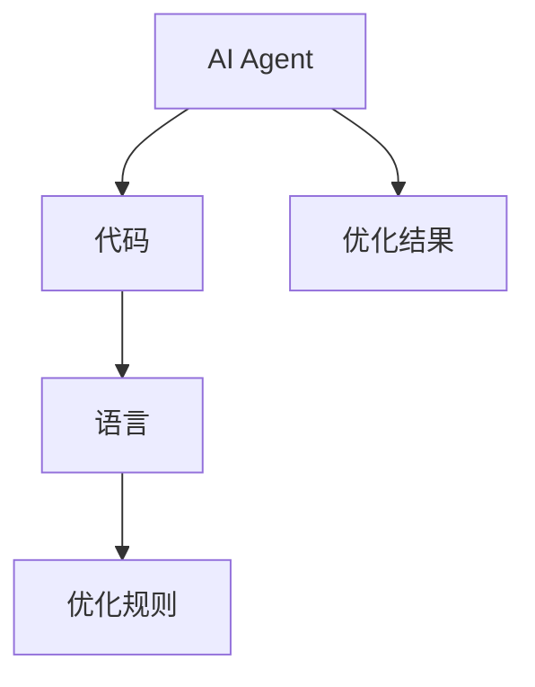
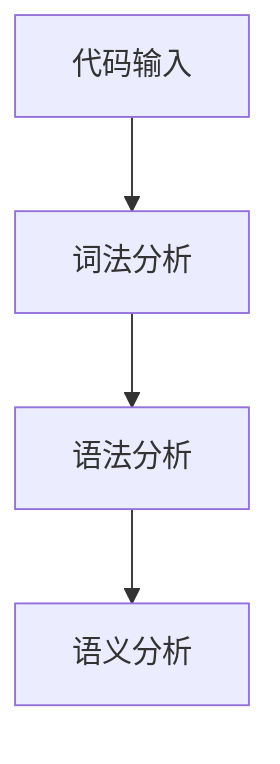
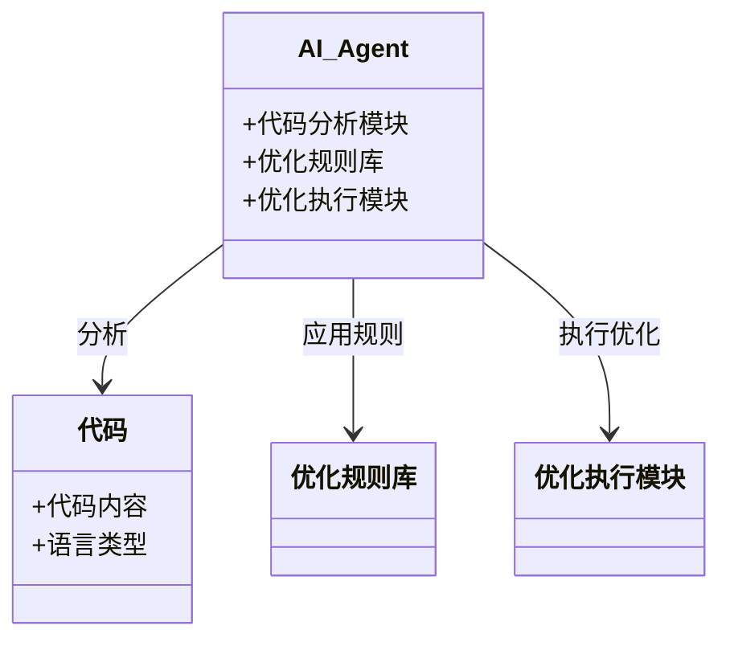
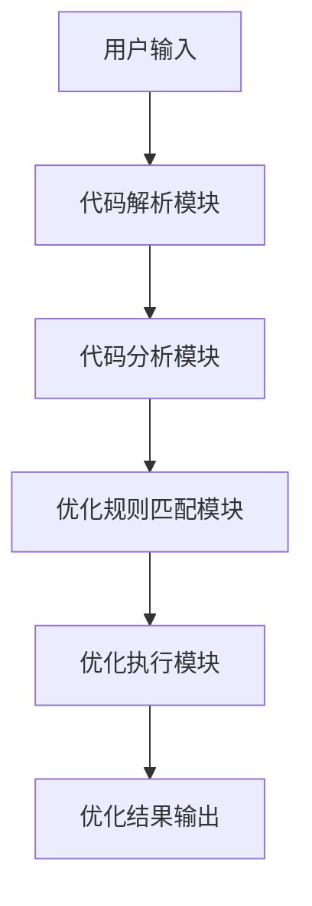
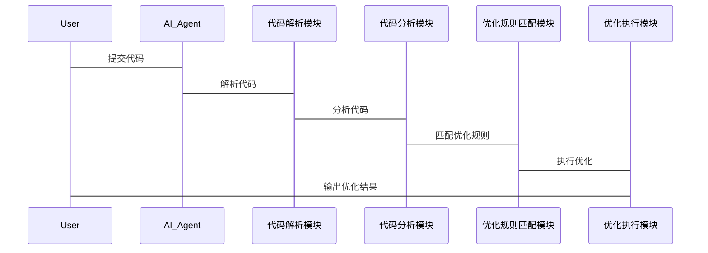

                 


# 开发具有多语言代码优化能力的AI Agent

> 关键词：AI Agent，多语言代码优化，自然语言处理，代码分析，跨语言迁移学习

> 摘要：本文详细探讨了开发具有多语言代码优化能力的AI Agent的核心概念、算法原理、系统架构及其实现。通过理论与实践的结合，展示了AI Agent在代码优化中的潜力与应用。

---

# 第一部分: AI Agent与多语言代码优化的背景介绍

# 第1章: AI Agent与多语言代码优化概述

## 1.1 AI Agent的基本概念

### 1.1.1 AI Agent的定义
AI Agent（人工智能代理）是指能够感知环境、执行任务并做出决策的智能实体。在代码优化领域，AI Agent通过分析代码结构、理解编程意图，提供高效的优化建议或自动执行优化操作。

### 1.1.2 多语言代码优化的必要性
现代软件开发涉及多种编程语言，开发人员需要在不同语言间切换，优化代码时面临语法差异、库函数差异等问题，导致效率低下。AI Agent能够统一处理多种语言，简化优化流程。

### 1.1.3 AI Agent在代码优化中的优势
- **自动化**：AI Agent可以自动分析代码，识别优化点。
- **跨语言支持**：支持多种编程语言，如Python、Java、C++等。
- **高效性**：通过机器学习模型快速识别优化机会。

## 1.2 多语言代码优化的背景与问题背景

### 1.2.1 当前软件开发中的代码优化挑战
- **复杂性**：代码结构复杂，优化点多样。
- **多样性**：不同语言有不同的优化规则和最佳实践。
- **效率**：手动优化耗时且容易出错。

### 1.2.2 多语言代码优化的需求分析
- **统一优化工具**：减少开发人员的负担。
- **提高代码质量**：优化代码性能和可读性。
- **跨平台支持**：适用于不同开发环境。

### 1.2.3 AI技术在代码优化中的应用前景
AI技术能够处理非结构化数据，通过自然语言处理和模式识别，为代码优化提供新思路。AI Agent可以辅助开发人员，提高代码质量和开发效率。

## 1.3 多语言代码优化的核心问题

### 1.3.1 代码分析与理解的难点
- **语法多样性**：不同语言语法差异大。
- **语义理解**：代码上下文关系复杂。
- **动态性**：代码执行时的行为难以预测。

### 1.3.2 跨语言代码优化的复杂性
- **跨语言规则**：不同语言的优化规则不同。
- **数据转换**：代码结构转换复杂。
- **性能问题**：优化后的代码需要在多种语言环境中高效运行。

### 1.3.3 AI Agent在代码优化中的角色
AI Agent作为代码优化的辅助工具，负责分析代码、识别优化点、生成优化建议，并执行优化操作。

## 1.4 本章小结
本章介绍了AI Agent的基本概念，分析了多语言代码优化的必要性和挑战，明确了AI Agent在代码优化中的角色和优势。

---

# 第二部分: AI Agent的核心概念与工作原理

# 第2章: AI Agent的核心概念与原理

## 2.1 AI Agent的核心概念

### 2.1.1 AI Agent的定义与属性
AI Agent具有感知、决策和执行能力，能够与开发人员交互，理解代码需求并提供优化方案。

### 2.1.2 多语言代码优化的核心要素
- **代码分析**：解析代码结构，理解语义。
- **优化策略**：基于分析结果，制定优化方案。
- **跨语言支持**：统一处理多种语言的优化规则。

### 2.1.3 AI Agent与传统代码优化工具的对比
| 特性             | AI Agent                     | 传统工具                 |
|------------------|------------------------------|--------------------------|
| 功能             | 自动分析、优化、执行          | 提供优化建议或部分优化    |
| 语言支持         | 支持多种语言                 | 通常支持单一语言         |
| 智能性           | 具备学习和适应能力           | 预定义规则，缺乏灵活性   |

## 2.2 AI Agent的工作原理

### 2.2.1 代码分析与理解的流程
1. **代码解析**：解析代码语法，生成抽象语法树（AST）。
2. **语义分析**：理解代码语义，识别潜在优化点。
3. **优化建议生成**：基于分析结果，生成优化建议。
4. **优化执行**：自动执行优化操作，生成优化后的代码。

### 2.2.2 AI Agent的优化策略
- **基于规则的优化**：利用预定义规则进行优化。
- **基于学习的优化**：通过机器学习模型预测优化点。
- **混合优化策略**：结合规则和学习模型，提高优化效果。

### 2.2.3 跨语言代码优化的实现机制
- **统一代码模型**：将多种语言代码转换为统一的表示形式，便于分析和优化。
- **跨语言规则映射**：建立不同语言之间的优化规则映射，实现跨语言优化。

## 2.3 核心概念的ER实体关系图


## 2.4 本章小结
本章详细阐述了AI Agent的核心概念和工作原理，分析了其与传统优化工具的区别，并通过ER图展示了核心实体之间的关系。

---

# 第三部分: AI Agent的算法原理与数学模型

# 第3章: AI Agent的算法原理

## 3.1 自然语言处理模型在代码优化中的应用

### 3.1.1 基于Transformer的代码理解
- **Transformer结构**：由编码器和解码器组成，用于处理序列数据。
- **代码表示**：将代码转换为序列，通过Transformer进行理解。

### 3.1.2 代码优化的自然语言处理流程
1. **代码预处理**：将代码转换为统一格式，去除注释和变量名。
2. **编码器输入**：将代码输入编码器，生成上下文表示。
3. **解码器输出**：解码器生成优化后的代码序列。

### 3.1.3 示例：代码优化的Transformer模型
$$
\text{编码器输入} = \{x_1, x_2, ..., x_n\}
$$
$$
\text{解码器输出} = \{y_1, y_2, ..., y_m\}
$$

## 3.2 代码分析与优化的算法流程

### 3.2.1 代码分析算法


### 3.2.2 优化规则匹配
- **规则库**：预定义的优化规则，如减少重复计算、优化数据结构等。
- **规则匹配**：通过模式匹配，识别代码中的优化机会。

### 3.2.3 优化执行算法
1. **优化点识别**：基于分析结果，识别优化点。
2. **优化规则应用**：应用匹配的优化规则，生成优化代码。
3. **代码生成**：将优化后的代码输出。

## 3.3 基于机器学习的代码优化算法

### 3.3.1 基于监督学习的优化
- **训练数据**：优化前后的代码对。
- **模型训练**：通过监督学习，训练模型识别优化点。

### 3.3.2 基于强化学习的优化
- **状态空间**：代码状态表示。
- **动作空间**：可能的优化操作。
- **奖励机制**：优化效果决定奖励。

### 3.3.3 示例：强化学习优化流程
$$
\text{状态} = s_t \\
\text{动作} = a_t \\
\text{奖励} = r_{t+1}
$$

## 3.4 跨语言优化的迁移学习

### 3.4.1 迁移学习的基本概念
- **领域迁移**：将一种语言的优化经验迁移到另一种语言。
- **特征提取**：提取代码中的通用优化特征。

### 3.4.2 跨语言迁移的实现
- **多语言模型**：训练一个多语言模型，统一处理多种语言的代码。
- **语言适配层**：针对每种语言，添加适配层，处理语法差异。

## 3.5 本章小结
本章详细探讨了AI Agent的算法原理，包括自然语言处理模型、代码分析算法、机器学习优化算法以及跨语言优化的迁移学习方法。

---

# 第四部分: 系统分析与架构设计方案

# 第4章: 系统分析与架构设计

## 4.1 问题场景介绍

### 4.1.1 开发环境
- **编程语言**：支持Python、Java、C++等。
- **开发工具**：集成开发环境（IDE）或命令行工具。

### 4.1.2 使用场景
- **代码审查**：识别潜在问题。
- **性能优化**：提升代码运行效率。
- **代码重构**：改善代码结构和可读性。

## 4.2 项目介绍

### 4.2.1 项目目标
开发一个多语言代码优化AI Agent，能够自动分析代码，识别优化点，并生成优化后的代码。

### 4.2.2 项目范围
- **支持语言**：Python、Java、C++。
- **优化规则**：性能优化、代码简洁性优化等。

## 4.3 系统功能设计

### 4.3.1 领域模型类图


### 4.3.2 系统架构设计


### 4.3.3 系统接口设计
- **输入接口**：接收代码文件路径。
- **输出接口**：输出优化后的代码和优化报告。

### 4.3.4 系统交互流程


## 4.4 本章小结
本章通过系统分析和架构设计，明确了AI Agent的系统结构和功能模块，为后续开发奠定了基础。

---

# 第五部分: 项目实战与应用

# 第5章: 项目实战

## 5.1 环境安装与配置

### 5.1.1 开发环境
- **编程语言**：Python 3.8+
- **框架**：TensorFlow 2.0+，Keras 2.4+
- **工具**：Jupyter Notebook，VS Code

### 5.1.2 安装依赖
```bash
pip install tensorflow keras
pip install transformers
```

## 5.2 系统核心实现

### 5.2.1 代码解析模块
```python
def parse_code(code, language):
    # 根据语言选择解析器
    if language == 'python':
        return ast.parse(code)
    elif language == 'java':
        # Java解析逻辑
        pass
    # 其他语言解析逻辑
```

### 5.2.2 代码分析模块
```python
def analyze_code(parsed_code):
    # 生成抽象语法树表示
    return ast.unparse(parsed_code)
```

### 5.2.3 优化规则匹配模块
```python
def match_rules(code_rep):
    # 基于规则库匹配优化规则
    return matched_rules
```

### 5.2.4 优化执行模块
```python
def apply_rules(code_rep, rules):
    # 执行优化规则，生成优化代码
    return optimized_code
```

## 5.3 代码实现与解读

### 5.3.1 核心代码实现
```python
class AIAgent:
    def __init__(self, language='python'):
        self.language = language
        self.rules = self.load_rules(language)

    def parse_code(self, code):
        # 根据语言解析代码
        pass

    def analyze(self, parsed_code):
        # 分析代码，生成优化建议
        pass

    def optimize(self, code):
        # 执行优化，返回优化后的代码
        pass
```

### 5.3.2 代码应用解读
- **初始化**：选择目标语言，加载相应的优化规则。
- **解析代码**：将代码转换为统一的表示形式。
- **分析代码**：识别优化点。
- **优化执行**：应用优化规则，生成优化代码。

## 5.4 实际案例分析

### 5.4.1 案例背景
- **代码语言**：Python
- **代码内容**：
  ```python
  def func():
      a = 1
      b = a
      return b
  ```

### 5.4.2 优化过程
1. **解析代码**：生成AST。
2. **分析代码**：识别无用变量。
3. **优化规则匹配**：匹配“去除无用变量”规则。
4. **优化执行**：生成优化后的代码。

### 5.4.3 优化结果
```python
def func():
    return 1
```

## 5.5 本章小结
本章通过实际案例，展示了AI Agent在代码优化中的应用，详细解读了代码实现过程和优化效果。

---

# 第六部分: 最佳实践与总结

# 第6章: 最佳实践与总结

## 6.1 最佳实践

### 6.1.1 开发注意事项
- **代码多样性**：确保模型支持多种语言。
- **性能优化**：优化模型推理速度。
- **规则库维护**：定期更新和维护优化规则。

### 6.1.2 模型训练技巧
- **数据多样性**：使用多样化的代码数据进行训练。
- **模型调优**：通过超参数调优提高模型性能。
- **持续学习**：采用迁移学习，提升模型的泛化能力。

## 6.2 总结与展望

### 6.2.1 本项目总结
本文详细探讨了开发具有多语言代码优化能力的AI Agent，从背景介绍、核心概念、算法原理到系统设计和项目实现，全面阐述了AI Agent在代码优化中的应用。

### 6.2.2 未来展望
- **多模态优化**：结合代码和文档信息，提供更全面的优化建议。
- **实时优化**：在开发过程中实时提供优化建议。
- **自适应优化**：根据运行环境动态调整优化策略。

## 6.3 本章小结
本章总结了开发AI Agent的经验，并展望了未来的研究方向，为后续工作提供了参考。

---

# 作者信息

作者：AI天才研究院/AI Genius Institute & 禅与计算机程序设计艺术 /Zen And The Art of Computer Programming

---

通过以上思考和逐步分析，本文详细介绍了开发具有多语言代码优化能力的AI Agent的各个方面，从理论到实践，为读者提供了全面的知识和指导。

