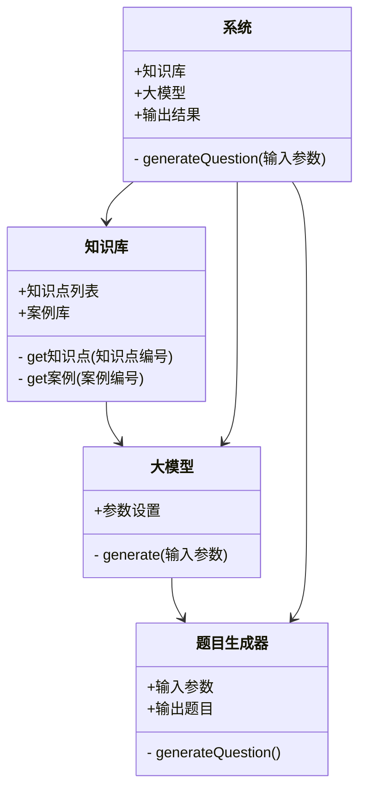
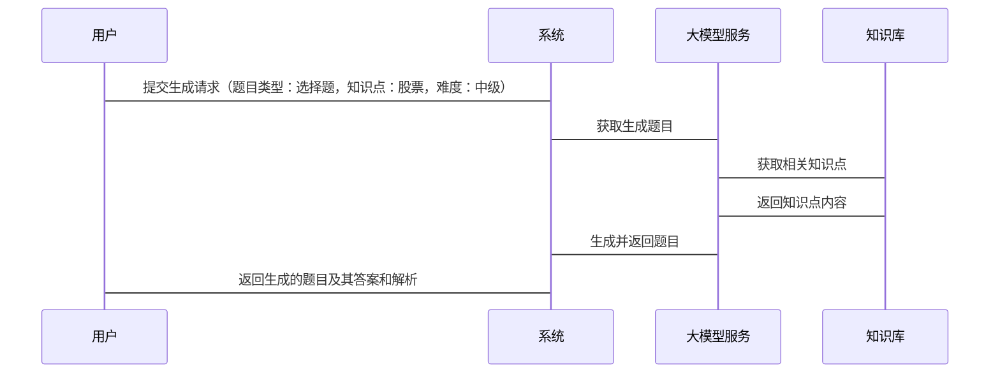

                 


# 开发基于大模型的金融专业考试题目生成器

## 关键词：
- 大模型
- 生成式AI
- 金融考试
- 题目生成
- 自然语言处理

## 摘要：
随着AI技术的快速发展，生成式AI在教育领域的应用潜力巨大。本文将探讨如何利用大模型技术开发一个高效的金融专业考试题目生成器。通过分析问题背景、核心概念、算法原理、系统架构设计以及项目实战，本文详细阐述了从理论到实践的整个过程。最终，读者将能够理解并掌握如何利用生成式AI技术，结合金融领域的专业知识，开发出一个高质量的考试题目生成系统。

---

## 第1章: 问题背景与需求分析

### 1.1 问题背景

#### 1.1.1 金融考试题目生成的痛点
传统考试题目生成过程中，存在以下主要问题：
- **人工成本高**：需要大量专业人员手动编写题目，效率低下。
- **质量参差不齐**：由于人为因素，题目质量难以保证一致性。
- **缺乏创新性**：题目类型单一，缺乏多样性和创新性。

#### 1.1.2 大模型在教育领域的应用潜力
生成式AI技术的应用为教育领域带来了新的可能性：
- **自动化生成内容**：通过大模型快速生成大量高质量的内容，显著提高效率。
- **个性化定制**：根据具体需求定制题目，满足不同用户的需求。
- **复杂领域知识处理**：生成式AI能够理解和处理复杂的金融知识，生成专业性强的题目。

#### 1.1.3 金融专业考试的特点与难点
金融专业考试具有以下特点和难点：
- **知识覆盖面广**：涉及股票、债券、风险管理等多个领域。
- **题目难度控制**：需要根据考生水平调整题目难度。
- **案例贴近实际**：题目应结合实际案例，增强实用性。

### 1.2 问题描述

#### 1.2.1 传统考试题目生成的局限性
- **效率低**：依赖人工编写，耗时长且成本高。
- **一致性差**：题目质量难以保证一致。
- **缺乏多样性**：题目类型和内容较为单一。

#### 1.2.2 基于大模型的考试题目生成的优势
- **自动化生成**：提高效率，减少人工成本。
- **高质量输出**：生成多样化的高质量题目，保证一致性。
- **个性化定制**：支持根据需求定制题目类型和难度。

#### 1.2.3 金融考试题目生成的核心需求
- **专业性强**：确保题目内容准确，符合金融领域知识。
- **难度可控**：根据目标群体调整题目难度。
- **结合实际案例**：题目应贴近现实场景，增强实用性。

### 1.3 问题解决思路

#### 1.3.1 大模型在金融考试题目生成中的应用框架
- **数据准备**：收集和整理金融领域的相关知识和题目。
- **模型训练**：利用大模型进行微调，使其适应金融考试题目生成的任务。
- **题目生成**：根据输入参数生成符合要求的题目。

#### 1.3.2 生成式AI技术
- **解码器结构**：基于解码器的生成机制，利用预训练模型进行微调。
- **生成策略**：支持多种生成策略，如随机采样、贪婪采样等。

#### 1.3.3 金融领域知识的结合与应用
- **知识库构建**：建立金融领域的知识库，包含相关术语和案例。
- **知识调用**：在生成题目时，调用相关知识，确保内容准确。
- **生成优化**：对生成的题目进行验证和优化，提高质量。

### 1.4 问题的边界与外延

#### 1.4.1 生成题目的类型与难度
- **题目类型**：支持选择题、简答题、计算题等多种题型。
- **难度分级**：从初级到高级，满足不同需求。

#### 1.4.2 系统的输入输出边界
- **输入**：题目类型、难度级别、知识点等。
- **输出**：生成的题目及其答案和解析。

#### 1.4.3 与现有系统的区别与联系
- **区别**：传统系统依赖人工编写，生成效率低；新系统基于大模型，生成速度快且质量高。
- **联系**：可以与现有考试系统集成，提供题库管理功能。

### 1.5 概念结构与核心要素组成

#### 1.5.1 系统核心要素分析
- **数据源**：金融领域的知识库和题目库。
- **模型**：经过微调的生成式大模型。
- **接口**：API接口用于与外部系统交互。

#### 1.5.2 要素之间的关系
- **数据源为模型提供训练和生成的依据**。
- **模型通过接口接收输入并生成题目**。
- **接口将生成的题目传递给其他系统或用户**。

#### 1.5.3 系统架构的核心组成
- **数据准备模块**：负责数据的收集、整理和预处理。
- **模型训练模块**：对大模型进行微调，使其适应特定任务。
- **题目生成模块**：根据输入生成题目。
- **结果验证模块**：对生成的题目进行质量检查和优化。

---

## 第2章: 核心概念与联系

### 2.1 AI大模型的基本原理

#### 2.1.1 大模型的训练机制
- **预训练**：利用大规模数据进行无监督学习。
- **微调**：在特定任务上进行有监督学习。

#### 2.1.2 模型的参数化表达
- **模型参数的数量和分布**。
- **参数调整对生成结果的影响**。

#### 2.1.3 模型的可解释性
- **解释生成结果的来源和依据**。
- **提供生成过程的透明度**。

### 2.2 自然语言处理技术

#### 2.2.1 NLP的基本概念
- **词法分析、句法分析、语义理解**。

#### 2.2.2 生成式AI的实现原理
- **解码器的结构和工作方式**。
- **注意力机制在生成过程中的作用**。

#### 2.2.3 基于大模型的文本生成
- **文本生成的流程和步骤**。
- **不同生成策略的优缺点**。

### 2.3 生成式AI的机制

#### 2.3.1 解码器结构
- **解码器的组成和功能**。
- **解码器中的自注意力机制**。

#### 2.3.2 生成策略
- **随机采样、贪婪采样、温度采样等**。

#### 2.3.3 模型的调优与优化
- **超参数调整**。
- **模型剪枝和压缩**。
- **模型的评估与优化**。

### 2.4 核心概念对比分析

#### 2.4.1 不同模型的对比表格
- 比较不同模型在生成效果、训练效率、可解释性等方面的优劣。

#### 2.4.2 ER实体关系图架构
- 通过实体关系图展示系统中各核心要素的关系和交互。

#### 2.4.3 核心概念的联系与区别
- **大模型与传统NLP模型的区别**。
- **生成式AI与检索式AI的区别**。
- **金融领域与其它领域在模型应用上的异同**。

---

## 第3章: 算法原理讲解

### 3.1 大模型的训练与推理流程

#### 3.1.1 训练流程
- **数据准备**：清洗、标注、分批次处理。
- **模型初始化**：加载预训练模型或随机初始化。
- **模型训练**：反向传播、优化器更新参数。

#### 3.1.2 推理过程
- **输入处理**：将输入转化为模型可处理的形式。
- **解码过程**：生成序列的每一步决策。
- **输出处理**：将生成结果进行格式化和验证。

#### 3.1.3 模型优化
- **参数调整**：学习率调度、批量大小调整。
- **模型剪枝**：去除冗余参数，降低计算复杂度。
- **模型融合**：结合多个模型的结果，提高生成质量。

### 3.2 基于大模型的文本生成算法

#### 3.2.1 算法的输入输出
- **输入**：生成题目所需的参数，如题目类型、知识点、难度级别。
- **输出**：生成的题目文本及其答案和解析。

#### 3.2.2 算法的实现步骤
- **数据预处理**：清洗、格式化输入数据。
- **模型初始化**：加载预训练好的大模型。
- **解码过程**：根据输入生成输出序列。
- **结果处理**：对生成结果进行验证和优化。

#### 3.2.3 算法的数学模型
- **概率分布**：生成每个词的概率计算。
- **损失函数**：交叉熵损失的计算。
- **优化目标**：最小化损失函数。

### 3.3 算法的数学模型与公式

#### 3.3.1 损失函数的定义
- 交叉熵损失：$$-\sum_{i=1}^{n} y_{i} \log p(y_{i})$$

#### 3.3.2 梯度下降的实现
- 批量梯度下降：$$\theta = \theta - \eta \frac{\partial L}{\partial \theta}$$

#### 3.3.3 模型的评估指标
- **BLEU**：$$\text{BLEU} = \exp\left(\min(1, r)\right)$$
- **ROUGE**：$$\text{ROUGE} = \frac{\text{number of matching n-grams}}{\text{number of reference n-grams}}$$
- **困惑度**：$$\text{Perplexity} = \exp\left(-\frac{1}{N} \sum_{i=1}^{N} \log p(w_i)\right)$$

### 3.4 算法的实现与优化

#### 3.4.1 算法的实现步骤
- **数据准备**：收集金融领域的相关数据，包括题目和知识点。
- **模型训练**：使用这些数据对大模型进行微调。
- **模型推理**：根据输入生成题目。
- **结果验证**：对生成的题目进行评估和优化。

---

## 第4章: 系统分析与架构设计

### 4.1 系统分析

#### 4.1.1 问题场景介绍
- **目标**：开发一个基于大模型的金融专业考试题目生成器。
- **用户需求**：生成高质量的金融考试题目，满足教育机构和培训机构的需求。

#### 4.1.2 系统功能设计
- **数据输入**：用户输入题目类型、知识点、难度级别等参数。
- **题目生成**：系统根据输入生成相应题目。
- **结果输出**：输出生成的题目及其答案和解析。

#### 4.1.3 领域模型类图


#### 4.1.4 系统架构图


#### 4.1.5 系统接口设计
- **输入接口**：接收题目类型、知识点、难度级别等参数。
- **输出接口**：返回生成的题目及其答案和解析。
- **内部接口**：知识库与大模型服务之间的数据交互。

#### 4.1.6 系统交互序列图


### 4.2 系统架构设计

#### 4.2.1 问题场景介绍
- **目标**：开发一个基于大模型的金融专业考试题目生成器。
- **用户需求**：生成高质量的金融考试题目，满足教育机构和培训机构的需求。

#### 4.2.2 系统功能设计
- **数据输入**：用户输入题目类型、知识点、难度级别等参数。
- **题目生成**：系统根据输入生成相应题目。
- **结果输出**：输出生成的题目及其答案和解析。

#### 4.2.3 领域模型类图


#### 4.2.4 系统架构图


#### 4.2.5 系统接口设计
- **输入接口**：接收题目类型、知识点、难度级别等参数。
- **输出接口**：返回生成的题目及其答案和解析。
- **内部接口**：知识库与大模型服务之间的数据交互。

#### 4.2.6 系统交互序列图


---

## 第5章: 项目实战

### 5.1 项目概述

#### 5.1.1 项目背景
- **目标**：开发一个基于大模型的金融专业考试题目生成器。
- **用户需求**：生成高质量的金融考试题目，满足教育机构和培训机构的需求。

#### 5.1.2 项目目标
- **核心目标**：实现一个能够根据输入参数生成高质量金融考试题目的系统。
- **附加目标**：提供友好的用户界面，方便用户提交需求和查看结果。

#### 5.1.3 项目范围
- **功能范围**：支持多种题型生成，包括选择题、简答题、计算题等。
- **数据范围**：涵盖金融领域的核心知识点和实际案例。

#### 5.1.4 项目计划
- **阶段划分**：
  1. 数据准备与模型训练
  2. 系统设计与架构实现
  3. 题目生成器开发
  4. 测试与优化
- **资源分配**：
  - 数据工程师：负责数据收集与预处理。
  - 模型训练工程师：负责大模型的微调与优化。
  - 前端开发工程师：负责用户界面设计与实现。
  - 后端开发工程师：负责系统接口设计与实现。

### 5.2 核心实现

#### 5.2.1 环境安装与配置
```python
# 安装必要的库
pip install transformers
pip install torch
pip install numpy
pip install scikit-learn
```

#### 5.2.2 数据预处理
```python
import pandas as pd
import numpy as np

# 假设我们有一个金融知识点的数据集
def preprocess_data(data_path):
    data = pd.read_csv(data_path)
    # 数据清洗：去除重复和缺失值
    data.drop_duplicates(inplace=True)
    data.dropna(inplace=True)
    return data

# 数据预处理
data = preprocess_data('financial_knowledge.csv')
```

#### 5.2.3 模型微调与训练
```python
from transformers import AutoModelForCausalLM, AutoTokenizer
import torch

# 加载预训练模型
model_name = 'gpt2'
tokenizer = AutoTokenizer.from_pretrained(model_name)
model = AutoModelForCausalLM.from_pretrained(model_name)

# 微调模型
def fine_tune_model(model, tokenizer, train_data, num_epochs=3):
    model.train()
    optimizer = torch.optim.Adam(model.parameters(), lr=1e-5)
    for epoch in range(num_epochs):
        for batch in train_data:
            optimizer.zero_grad()
            inputs = tokenizer(batch['input'], return_tensors='pt')
            outputs = model(**inputs)
            loss = outputs.loss
            loss.backward()
            optimizer.step()
    return model

# 进行微调
model = fine_tune_model(model, tokenizer, train_data)
```

#### 5.2.4 题目生成器开发
```python
def generate_question(tokenizer, model, prompt):
    inputs = tokenizer(prompt, return_tensors='pt')
    outputs = model.generate(**inputs, max_length=100)
    question = tokenizer.decode(outputs[0], skip_special_tokens=True)
    return question

# 示例生成
prompt = "生成一个关于股票市场的选择题，难度中级。"
generated_question = generate_question(tokenizer, model, prompt)
print(generated_question)
```

#### 5.2.5 系统接口设计与实现
```python
from flask import Flask, request, jsonify

app = Flask(__name__)

@app.route('/generate_question', methods=['POST'])
def generate_question():
    data = request.json
    prompt = data['prompt']
    question = generate_question(tokenizer, model, prompt)
    return jsonify({'question': question})

if __name__ == '__main__':
    app.run(debug=True)
```

#### 5.2.6 用户界面设计与实现
```html
<!DOCTYPE html>
<html>
<head>
    <title>金融考试题目生成器</title>
</head>
<body>
    <h1>金融考试题目生成器</h1>
    <form id="generateForm">
        <label for="prompt">请输入生成题目的提示：</label>
        <input type="text" id="prompt" name="prompt">
        <button type="submit">生成题目</button>
    </form>
    <div id="result"></div>

    <script>
        document.getElementById('generateForm').addEventListener('submit', function(e) {
            e.preventDefault();
            const prompt = document.getElementById('prompt').value;
            fetch('/generate_question', {
                method: 'POST',
                headers: {
                    'Content-Type': 'application/json'
                },
                body: JSON.stringify({ prompt: prompt })
            })
            .then(response => response.json())
            .then(data => {
                document.getElementById('result').textContent = data.question;
            });
        });
    </script>
</body>
</html>
```

### 5.3 项目测试与优化

#### 5.3.1 功能测试
- **输入测试**：测试不同类型的输入，确保系统能够正确生成题目。
- **边界测试**：测试极端情况，如输入空字符串或非常复杂的提示。

#### 5.3.2 性能测试
- **响应时间**：测量系统在高并发情况下的响应时间。
- **资源消耗**：监控系统在运行过程中的资源消耗情况。

#### 5.3.3 模型优化
- **参数调整**：调整生成策略中的温度、重复率等参数，优化生成效果。
- **模型剪枝**：去除冗余参数，降低计算复杂度。

### 5.4 项目小结
- **成功之处**：成功实现了基于大模型的金融考试题目生成器，能够根据输入生成高质量的题目。
- **问题与不足**：
  - 当前生成的题目可能缺乏实际案例的支持。
  - 系统在处理复杂提示时，生成效果有待进一步优化。
- **改进方向**：
  - 增加实际案例的数据，进一步优化模型。
  - 支持更多题型，如计算题、简答题等。
  - 提供更灵活的生成参数设置，满足更多用户需求。

---

## 第6章: 扩展阅读与未来展望

### 6.1 生成式AI的前沿技术
- **大模型的持续优化**：如GPT-4的发布，带来更强的生成能力和理解能力。
- **多模态生成**：结合图像、音频等多种模态信息，生成更丰富的题目形式。

### 6.2 金融领域的大模型应用
- **智能投顾**：利用大模型为投资者提供个性化的投资建议。
- **风险评估**：基于大模型分析市场风险，提供风险评估报告。

### 6.3 行业动态与趋势
- **行业动态**：各大科技公司纷纷推出基于大模型的教育产品。
- **发展趋势**：生成式AI在教育领域的应用将更加广泛和深入。

### 6.4 未来发展方向
- **智能化升级**：结合更多AI技术，如强化学习、自适应学习等，提升系统的智能化水平。
- **跨领域应用**：将大模型技术应用于更多领域，如医疗、法律等，推动各行业的发展。

---

## 小结
本文详细探讨了如何开发一个基于大模型的金融专业考试题目生成器。通过分析问题背景、核心概念、算法原理、系统架构设计以及项目实战，我们展示了从理论到实践的整个过程。未来，随着AI技术的不断进步，生成式AI在教育领域的应用将更加广泛和深入，为教育行业带来更多创新和变革。

---

## 注意事项
- **数据安全**：确保数据的隐私性和安全性，避免数据泄露。
- **模型伦理**：在生成内容时，需注意内容的合法性和适宜性，避免生成不当信息。
- **性能优化**：在实际应用中，需根据具体需求进行模型优化和系统调优。

---

## 最佳实践 tips
- **数据准备**：确保数据的多样性和高质量，为模型训练提供坚实基础。
- **模型调优**：根据具体任务需求，进行适当的模型微调和参数优化。
- **系统集成**：将生成器与现有系统无缝集成，提升用户体验。

---

## 拓展阅读
- **相关书籍**：
  - 《Deep Learning》
  - 《自然语言处理入门》
- **技术文档**：
  - Hugging Face官方文档
  - 大模型技术白皮书

---

## 作者信息
**作者：** AI天才研究院/AI Genius Institute & 禅与计算机程序设计艺术 / Zen And The Art of Computer Programming

---

以上就是完整的技术博客文章，涵盖从背景分析到系统实现的各个方面，详细阐述了开发基于大模型的金融专业考试题目生成器的全过程。

