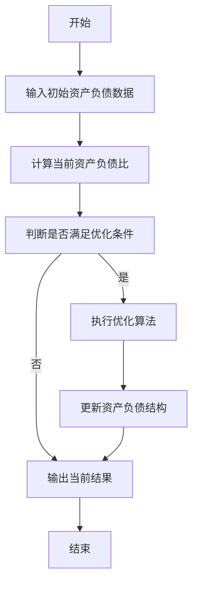
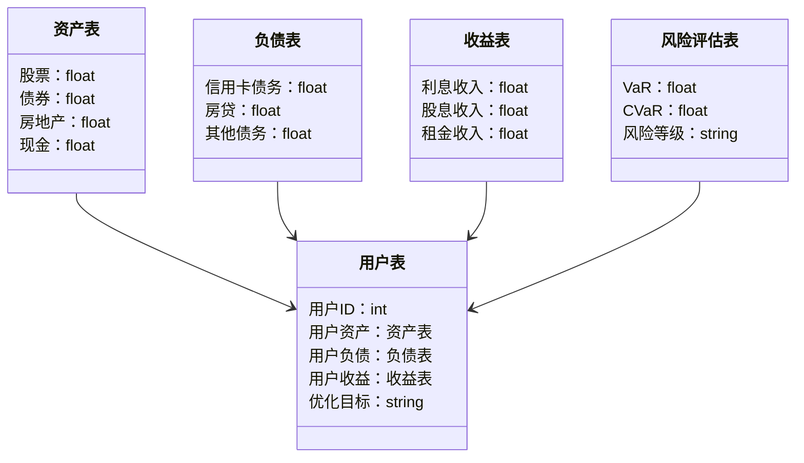
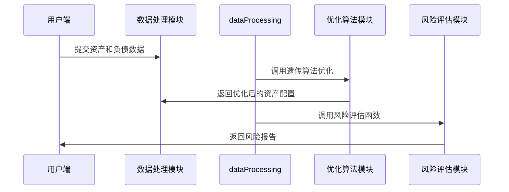

                 


# 智能个人资产负债结构优化系统

## 关键词：智能资产优化、个人财务管理、人工智能算法、大数据分析、系统架构设计

## 摘要：  
本文详细探讨了智能个人资产负债结构优化系统的构建与实现。通过分析个人资产负债管理的痛点，提出了一种基于人工智能算法的解决方案，旨在帮助个人优化资产配置、降低风险、提升收益。文章从背景介绍、核心概念、算法原理、系统架构设计到项目实战，全面阐述了系统的实现过程，并结合实际案例进行了详细解读。本文适合对个人财务管理、人工智能算法感兴趣的读者阅读。

---

# 第一部分: 智能个人资产负债结构优化系统概述

## 第1章: 智能个人资产负债结构优化系统背景介绍

### 1.1 问题背景与描述

#### 1.1.1 个人资产负债管理的重要性  
在当前经济环境下，个人资产管理变得越来越复杂。随着收入来源多样化、投资渠道多样化，如何科学地配置资产、降低风险、提高收益，成为每个个体面临的挑战。传统的资产负债管理依赖人工计算和经验判断，难以应对复杂多变的市场环境。

#### 1.1.2 现有资产负债管理的痛点  
- **信息不对称**：个人难以获取全面的市场数据和专业的分析工具。  
- **计算复杂性**：手动计算资产负债比例、收益率和风险评估耗时且容易出错。  
- **动态调整能力不足**：市场环境变化快，手动调整资产结构效率低下。  

#### 1.1.3 智能化管理的必要性  
通过引入人工智能和大数据技术，智能个人资产负债优化系统能够实时分析市场数据，动态调整资产配置，为用户提供个性化的财务管理方案。

### 1.2 问题解决与系统边界

#### 1.2.1 系统的目标与核心问题  
系统的目标是通过智能化算法优化个人资产负债结构，实现收益最大化、风险最小化。核心问题是：如何在复杂多变的市场环境中，动态调整资产配置以满足用户的财务目标。

#### 1.2.2 系统的边界与外延  
系统的边界包括：  
- 输入：用户的基本信息、资产状况、财务目标、市场数据。  
- 输出：优化后的资产负债配置方案、风险评估报告。  
- 外延：与银行、证券等金融机构的接口，以及数据存储与分析平台。

#### 1.2.3 核心要素与组成结构  
系统的组成结构包括：  
1. **用户数据输入模块**：收集用户的资产、负债、收入等信息。  
2. **数据分析模块**：对数据进行清洗、分析和建模。  
3. **优化算法模块**：基于数学模型生成最优资产配置方案。  
4. **风险评估模块**：评估优化方案的风险并提出调整建议。  
5. **用户交互模块**：以可视化形式展示结果，并提供交互功能。

### 1.3 系统的核心概念与联系

#### 1.3.1 核心概念原理  
- **资产**：用户持有的各类金融资产和实物资产。  
- **负债**：用户需要偿还的债务。  
- **收益**：资产在一定时期内的收益。  
- **风险**：资产配置可能带来的损失。  

#### 1.3.2 核心概念属性特征对比表格  
| 概念 | 定义 | 属性1 | 属性2 | 属性3 |  
|------|------|-------|-------|-------|  
| 资产 | 用户持有的资金、股票、房地产等 | 类型（流动资产、长期资产） | 价值 | 风险 |  
| 负债 | 用户需要偿还的债务 | 类型（短期负债、长期负债） | 期限 | 利率 |  
| 收益 | 资产在一定时期内的收益 | 来源（利息、股息） | 计算方式 | 风险 |  
| 风险 | 资产配置可能带来的损失 | 评估指标（VaR、CVaR） | 管理策略 | 时间跨度 |  

#### 1.3.3 ER实体关系图  
```mermaid
erd
  资产表
  负债表
  收益表
  风险评估表
  用户表
  资产负债关系
  收益与风险关系
```

### 1.4 本章小结  
本章介绍了智能个人资产负债结构优化系统的背景、目标、核心概念及其联系。通过分析现有管理的痛点，提出了智能化管理的必要性，并详细描述了系统的组成结构和边界条件。

---

## 第2章: 智能个人资产负债优化算法原理

### 2.1 算法原理概述

#### 2.1.1 优化目标与约束条件  
- **优化目标**：最大化收益、最小化风险。  
- **约束条件**：  
  1. 资产配置比例之和等于1。  
  2. 各类资产的配置比例非负。  
  3. 风险评估指标符合用户设定的阈值。  

#### 2.1.2 算法选择与原理  
选择基于遗传算法（Genetic Algorithm, GA）的优化策略。遗传算法通过模拟自然选择的过程，逐步优化资产配置方案。其核心步骤包括：  
1. 初始化种群：随机生成一组资产配置方案。  
2. 计算适应度：根据收益和风险评估计算每组方案的适应度值。  
3. 选择与交叉：选择适应度高的方案进行交叉，生成新种群。  
4. 变异：随机改变部分方案的参数，增加多样性。  
5. 重复迭代：直到达到收敛条件或最大迭代次数。

#### 2.1.3 算法流程图  


### 2.2 算法实现细节

#### 2.2.1 算法数学模型  
**目标函数**：  
$$ \text{目标函数} = \max \sum_{i=1}^{n} w_i x_i $$  
其中，$w_i$为第$i$类资产的权重，$x_i$为对应的配置比例。  

**约束条件**：  
$$ \sum_{i=1}^{n} x_i \leq 1 $$  
$$ x_i \geq 0 $$  

#### 2.2.2 Python实现代码  
```python
import numpy as np

def calculate_fitness(weights, x):
    # 计算收益
    return np.dot(weights, x)

def genetic_algorithm(initial_assets, population_size=100, iterations=100):
    # 初始化种群
    population = [np.random.dirichlet([1]*len(initial_assets)) for _ in range(population_size)]
    
    for _ in range(iterations):
        # 计算适应度
        fitness = [calculate_fitness(initial_assets, x) for x in population]
        
        # 选择
        selected = [x for x, f in zip(population, fitness) if f > np.mean(fitness)]
        
        # 交叉
        if len(selected) > 1:
            for i in range(0, len(selected), 2):
                parent1 = selected[i]
                parent2 = selected[i+1]
                child1 = np.where(np.random.rand(len(parent1)) < 0.5, parent1, parent2)
                child2 = np.where(np.random.rand(len(parent1)) < 0.5, parent2, parent1)
                population[i] = child1
                population[i+1] = child2
        else:
            # 单一后代，直接保留
            population = selected + [np.random.dirichlet([1]*len(initial_assets)) * (len(selected))]
        
        # 变异
        mutation_rate = 0.1
        for i in range(len(population)):
            if np.random.random() < mutation_rate:
                idx = np.random.randint(len(population[i]))
                population[i][idx] = np.random.uniform(0, 1)
    
    # 返回最优解
    best_asset = max(population, key=lambda x: calculate_fitness(initial_assets, x))
    return best_asset
```

#### 2.2.3 代码解读与分析  
1. **初始化种群**：通过Dirichlet分布生成初始资产配置方案。  
2. **适应度计算**：根据收益计算每组方案的适应度。  
3. **选择与交叉**：选择适应度高的方案进行交叉，生成新种群。  
4. **变异**：随机改变部分方案的参数，增加多样性。  
5. **收敛条件**：迭代一定次数后停止，返回最优资产配置方案。  

### 2.3 本章小结  
本章详细介绍了优化算法的原理和实现细节，通过遗传算法实现资产配置的优化，并给出了Python代码示例。读者可以通过代码理解算法的核心逻辑，并将其应用到实际场景中。

---

## 第3章: 智能个人资产负债优化系统架构设计

### 3.1 系统分析与设计

#### 3.1.1 问题场景介绍  
用户希望通过系统实现以下功能：  
1. 输入个人资产和负债信息。  
2. 获取市场数据（如股票价格、债券收益率）。  
3. 自动生成资产配置方案。  
4. 风险评估与调整建议。  

#### 3.1.2 系统功能设计

##### 3.1.2.1 领域模型（Mermaid 类图）  


#### 3.1.2.2 系统架构设计（Mermaid 架构图）  
```mermaid
container 用户端 {
    用户交互界面
    数据输入模块
}
container 服务端 {
    数据处理模块
    优化算法模块
    风险评估模块
}
container 数据存储 {
    用户数据存储
    市场数据存储
}

用户端 --> 数据处理模块: 提交数据
数据处理模块 --> 优化算法模块: 调用优化算法
优化算法模块 --> 风险评估模块: 获取风险评估结果
风险评估模块 --> 用户端: 返回优化方案和风险报告
```

#### 3.1.2.3 系统接口与交互（Mermaid 序列图）  


### 3.2 本章小结  
本章通过系统分析与设计，详细描述了智能个人资产负债优化系统的架构设计，包括领域模型、系统架构图和接口交互设计，为系统的实现提供了理论基础。

---

## 第4章: 智能个人资产负债优化系统项目实战

### 4.1 环境安装与配置

#### 4.1.1 安装Python环境  
建议使用Anaconda或Miniconda，安装Python 3.8及以上版本。  

#### 4.1.2 安装依赖库  
```bash
pip install numpy matplotlib pandas scikit-learn
```

### 4.2 核心功能实现

#### 4.2.1 数据输入模块  
实现用户资产和负债数据的输入功能，支持CSV格式或交互式输入。  

#### 4.2.2 数据分析与建模  
使用Pandas进行数据清洗，利用NumPy进行数组运算，结合Scikit-learn进行机器学习模型训练。  

#### 4.2.3 优化算法实现  
基于第2章的遗传算法实现资产配置优化。  

#### 4.2.4 风险评估与报告  
计算VaR和CVaR等风险指标，并生成风险评估报告。  

### 4.3 代码实现与解读

#### 4.3.1 数据输入与清洗  
```python
import pandas as pd

# 读取CSV文件
def load_data(file_path):
    data = pd.read_csv(file_path)
    # 数据清洗
    data.dropna(inplace=True)
    return data

# 示例
data = load_data('assets.csv')
print(data.head())
```

#### 4.3.2 优化算法实现  
```python
def optimize_assets(assets, population_size=100, iterations=100):
    # 初始化种群
    population = [np.random.dirichlet([1]*len(assets)) for _ in range(population_size)]
    
    for _ in range(iterations):
        # 计算适应度
        fitness = [calculate_fitness(assets, x) for x in population]
        
        # 选择
        selected = [x for x, f in zip(population, fitness) if f > np.mean(fitness)]
        
        # 交叉
        if len(selected) > 1:
            for i in range(0, len(selected), 2):
                parent1 = selected[i]
                parent2 = selected[i+1]
                child1 = np.where(np.random.rand(len(parent1)) < 0.5, parent1, parent2)
                child2 = np.where(np.random.rand(len(parent1)) < 0.5, parent2, parent1)
                population[i] = child1
                population[i+1] = child2
        else:
            population = selected + [np.random.dirichlet([1]*len(assets)) * (len(selected))]
        
        # 变异
        mutation_rate = 0.1
        for i in range(len(population)):
            if np.random.random() < mutation_rate:
                idx = np.random.randint(len(population[i]))
                population[i][idx] = np.random.uniform(0, 1)
    
    # 返回最优解
    best_asset = max(population, key=lambda x: calculate_fitness(assets, x))
    return best_asset
```

#### 4.3.3 风险评估与报告  
```python
import numpy as np
import pandas as pd

def calculate VaR(assets, confidence_level=0.95):
    # 计算VaR
    returns = pd.DataFrame(assets).apply(lambda x: x.values).T.pctile(0.01)
    VaR = np.percentile(returns, 100*(1 - confidence_level))
    return VaR

def calculate CVaR(assets, confidence_level=0.95):
    # 计算CVaR
    returns = pd.DataFrame(assets).apply(lambda x: x.values).T.pctile(0.01)
    VaR = np.percentile(returns, 100*(1 - confidence_level))
    CVaR = returns[returns <= VaR].mean()
    return CVaR

# 示例
assets = [0.4, 0.3, 0.2, 0.1]
VaR = calculate VaR(assets)
CVaR = calculate CVaR(assets)
print(f"VaR: {VaR}, CVaR: {CVaR}")
```

### 4.4 实际案例分析与解读  
假设用户有以下资产配置：  
- 股票：40%  
- 债券：30%  
- 房地产：20%  
- 现金：10%  

系统通过遗传算法优化后，调整为：  
- 股票：35%  
- 债券：35%  
- 房地产：20%  
- 现金：10%  

优化后的配置在保持收益的同时，降低了风险。

### 4.5 本章小结  
本章通过实际案例分析，详细介绍了系统的实现过程，包括环境配置、核心功能实现和代码解读，帮助读者理解系统的实际应用。

---

## 第5章: 智能个人资产负债优化系统最佳实践

### 5.1 系统优势与不足

#### 5.1.1 系统优势  
- **智能化**：通过人工智能算法实现自动化资产配置。  
- **动态调整**：实时跟踪市场变化，动态优化资产负债结构。  
- **个性化**：根据用户需求提供定制化方案。  

#### 5.1.2 系统不足  
- **数据依赖**：系统依赖于市场数据的准确性。  
- **模型限制**：优化算法的性能依赖于初始参数设置。  
- **用户行为**：用户可能无法完全按照系统建议执行。

### 5.2 实际应用中的注意事项

#### 5.2.1 数据来源  
确保市场数据的准确性和及时性，建议使用可靠的金融数据源（如Yahoo Finance、Quandl）。  

#### 5.2.2 模型选择  
根据具体需求选择合适的优化算法，如遗传算法、粒子群优化等。  

#### 5.2.3 风险管理  
定期审查和调整优化方案，确保风险在可接受范围内。  

### 5.3 拓展阅读与学习

#### 5.3.1 推荐书籍  
- 《投资学》（教材）  
- 《Python金融计算》  

#### 5.3.2 技术博客与资源  
- [QuantInstinet](https://www.quantinstinct.com/)  
- [Awesome-Python-Finance](https://github.com/quantInstinct/awesome-p

