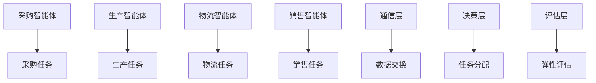
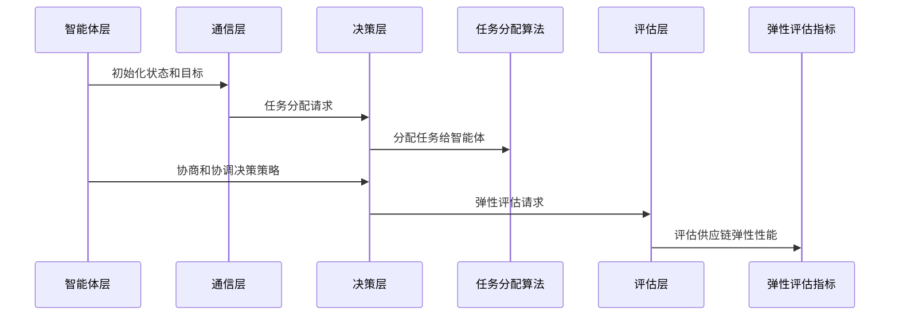

                 


# 《智能体协作提升价值投资的供应链弹性评估》

---

## 关键词：智能体协作、供应链弹性、价值投资、分布式系统、多智能体算法、供应链优化、系统架构

---

## 摘要：  
随着全球化和市场竞争的加剧，供应链的弹性和效率成为企业价值创造的关键因素。本文探讨了智能体协作在供应链弹性评估中的应用，通过分析智能体协作的核心机制、算法原理和系统架构，提出了一种基于智能体协作的供应链弹性评估方法。本文首先介绍了智能体协作和供应链弹性的基本概念，然后从理论模型、算法实现、系统架构等多个维度详细阐述了智能体协作在供应链弹性评估中的具体应用，最后通过实际案例展示了如何利用智能体协作技术提升供应链的弹性和价值投资的效率。

---

# 第1章: 智能体协作与供应链弹性的基础

## 1.1 智能体协作的概念与特点

### 1.1.1 智能体的定义与分类  
智能体（Agent）是指能够感知环境、做出决策并采取行动以实现目标的实体。智能体可以是软件程序、机器人或其他具有自主决策能力的系统。根据智能体的智能水平，可以分为简单反应型智能体、基于模型的反应型智能体、目标驱动型智能体和效用驱动型智能体。

#### 表1-1：智能体的分类与特点

| 分类标准   | 分类类型             | 特点                                                                 |
|------------|----------------------|----------------------------------------------------------------------|
| 智能水平   | 简单反应型           | 基于当前感知做出反应，不依赖内部状态或模型。                                       |
|            | 基于模型的反应型     | 使用内部模型预测环境变化，并基于模型做出决策。                                   |
|            | 目标驱动型           | 通过优化目标函数来驱动行为，通常涉及规划和决策。                                   |
|            | 效用驱动型           | 通过最大化效用函数来优化决策，适用于复杂多智能体环境。                             |

### 1.1.2 智能体协作的基本概念  
智能体协作是指多个智能体通过通信和协作共同完成任务的过程。智能体协作的核心在于通过信息共享、任务分配和决策协调，实现整体目标的最优或次优实现。智能体协作的关键特点包括：  
1. **自主性**：每个智能体都具有自主决策能力。  
2. **协作性**：智能体之间通过通信和协作共同完成任务。  
3. **分布式性**：协作过程通常分布在多个智能体之间，没有中央控制节点。  

### 1.1.3 供应链弹性评估的定义与重要性  
供应链弹性是指供应链在面对外部干扰或内部变化时，能够快速调整并恢复正常的运作能力。供应链弹性评估是通过对供应链的结构、流程和性能进行分析，评估其在面对不确定性时的适应能力和恢复能力。供应链弹性评估的重要性体现在：  
1. 提高供应链的抗风险能力。  
2. 优化供应链的成本和效率。  
3. 支持企业制定更稳健的价值投资策略。  

---

## 1.2 价值投资与供应链的关系

### 1.2.1 价值投资的核心理念  
价值投资是一种投资策略，强调选择那些具有长期稳定增长潜力的公司进行投资。价值投资的核心理念是通过分析公司的基本面，如财务状况、市场地位、管理能力等，寻找被市场低估的投资标的。

### 1.2.2 供应链在价值投资中的作用  
供应链是企业运营的核心环节，其效率和弹性直接影响企业的成本、交付能力和市场响应速度。一个高效的供应链能够快速满足市场需求，降低库存成本，提高客户满意度，从而为企业创造更大的价值。

### 1.2.3 智能体协作如何提升供应链价值  
智能体协作通过优化供应链的各环节协作，提高供应链的整体效率和弹性。智能体协作可以实现供应链各环节的实时协调，快速响应市场需求变化，优化资源分配，降低运营成本，从而为企业创造更大的价值，支持价值投资。

---

## 1.3 智能体协作的核心机制

### 1.3.1 智能体协作的基本机制  
智能体协作的核心机制包括：  
1. **通信机制**：智能体之间通过通信协议共享信息。  
2. **任务分配机制**：智能体根据自身能力和当前状态，主动承担任务。  
3. **决策协调机制**：智能体通过协商和协调，制定共同的决策策略。  

### 1.3.2 供应链中的智能体协作场景  
在供应链中，智能体可以扮演不同的角色，例如采购智能体、生产智能体、物流智能体、销售智能体等。这些智能体通过协作，共同优化供应链的运作。例如：  
1. **需求预测**：销售智能体和采购智能体协作，预测市场需求并调整采购计划。  
2. **库存管理**：生产智能体和物流智能体协作，优化库存水平和物流配送。  
3. **风险应对**：供应链中的多个智能体协作，应对供应商延迟、物流中断等风险。  

### 1.3.3 智能体协作的优势  
智能体协作的优势包括：  
1. **提高效率**：通过智能体的自主决策和协作，减少人工干预，提高供应链的运作效率。  
2. **增强弹性**：智能体协作能够快速响应变化，提高供应链的抗风险能力。  
3. **降低成本**：通过优化资源分配和流程协作，降低供应链的运营成本。  

---

## 1.4 本章小结  
本章介绍了智能体协作的基本概念、特点以及在供应链中的应用。通过分析智能体协作的核心机制，展示了智能体协作如何提升供应链的效率和弹性，从而支持价值投资。下一章将从理论模型的角度，进一步探讨智能体协作在供应链弹性评估中的具体应用。

---

# 第2章: 智能体协作的理论模型

## 2.1 智能体协作的理论基础

### 2.1.1 博弈论与智能体协作  
博弈论是研究理性决策者在竞争与合作环境下的行为理论。博弈论中的纳什均衡概念对于智能体协作具有重要意义。纳什均衡是指在其他智能体策略不变的情况下，一个智能体无法通过单方面改变策略而获得更好收益的状态。博弈论为智能体协作提供了理论基础，特别是在多智能体系统中，如何通过博弈论模型优化智能体的决策策略。

#### 例2-1：纳什均衡的应用  
假设供应链中有两个智能体，A和B。A和B可以通过协作或竞争来实现收益。如果A选择协作，B也选择协作，双方的收益分别为3和3；如果A选择协作，B选择竞争，A的收益为0，B的收益为5；如果A选择竞争，B选择协作，A的收益为5，B的收益为0；如果A和B都选择竞争，双方的收益分别为1和1。在这种情况下，纳什均衡是（竞争，竞争），因为双方都无法通过单方面改变策略而获得更高收益。

### 2.1.2 分布式系统理论与智能体协作  
分布式系统理论研究多个独立节点通过通信和协作共同完成任务的过程。智能体协作可以看作是一种特殊的分布式系统，其中每个智能体都是一个独立的节点。分布式系统理论为智能体协作提供了系统设计和通信协议的基础。

### 2.1.3 多智能体协作模型  
多智能体协作模型是智能体协作的核心理论模型。多智能体协作模型包括以下几部分：  
1. **智能体角色分配**：根据任务需求，分配智能体的角色和职责。  
2. **智能体通信协议**：定义智能体之间的通信方式和数据交换格式。  
3. **智能体协作算法**：通过算法实现智能体之间的任务分配和决策协调。  

---

## 2.2 供应链弹性评估的理论模型

### 2.2.1 供应链弹性评估的核心指标  
供应链弹性评估的核心指标包括：  
1. **响应时间**：供应链对需求变化的响应速度。  
2. **成本变化**：供应链在应对变化时的成本增加或减少。  
3. **服务可用性**：供应链在面对中断时的服务可用性。  
4. **资源利用率**：供应链资源的使用效率。  

### 2.2.2 基于智能体协作的供应链弹性模型  
基于智能体协作的供应链弹性模型是一个多智能体系统，其中每个智能体代表供应链中的一个环节。通过智能体协作，可以实现供应链各环节的实时协调，提高供应链的弹性。模型包括以下部分：  
1. **智能体角色分配**：根据供应链的任务需求，分配智能体的角色和职责。  
2. **智能体协作算法**：通过算法实现智能体之间的任务分配和决策协调。  
3. **供应链弹性评估指标**：通过指标评估供应链的弹性性能。  

---

## 2.3 智能体协作与供应链弹性的关系

### 2.3.1 智能体协作对供应链弹性的影响  
智能体协作通过优化供应链各环节的协作，提高供应链的弹性。智能体协作能够快速响应需求变化，优化资源分配，降低供应链的中断风险。智能体协作还能够通过共享信息和经验，提高供应链的整体抗风险能力。

### 2.3.2 供应链弹性对智能体协作的反馈  
供应链弹性评估的结果可以为智能体协作提供反馈，帮助优化智能体的决策策略和协作机制。例如，通过分析供应链弹性评估结果，可以发现某些环节的协作不足，从而优化任务分配和通信协议。

---

## 2.4 本章小结  
本章从理论模型的角度，探讨了智能体协作与供应链弹性的关系。通过分析博弈论、分布式系统理论和多智能体协作模型，提出了基于智能体协作的供应链弹性评估模型。下一章将从算法实现的角度，进一步探讨智能体协作在供应链弹性评估中的具体应用。

---

# 第3章: 智能体协作的算法实现

## 3.1 智能体协作算法的基本原理

### 3.1.1 分布式优化算法  
分布式优化算法是一种基于智能体协作的优化算法，适用于多智能体系统中的任务分配和资源优化。分布式优化算法通过智能体之间的通信和协作，实现全局优化目标。常见的分布式优化算法包括分布式梯度下降算法和分布式拉格朗日乘数法。

### 3.1.2 基于智能体的模拟算法  
基于智能体的模拟算法是一种通过模拟智能体行为来优化系统性能的算法。基于智能体的模拟算法广泛应用于供应链模拟和优化中。例如，基于智能体的库存模拟算法可以通过模拟库存变化，优化库存水平和订单策略。

### 3.1.3 强化学习算法  
强化学习是一种通过智能体与环境交互来优化决策策略的算法。强化学习算法适用于复杂的多智能体协作场景，例如供应链中的需求预测和库存管理。强化学习算法通过智能体与环境的交互，学习最优决策策略。

---

## 3.2 供应链弹性评估的算法实现

### 3.2.1 基于智能体的供应链弹性评估算法  
基于智能体的供应链弹性评估算法是一种通过智能体协作实现供应链弹性评估的算法。算法包括以下步骤：  
1. **智能体初始化**：为每个智能体分配初始状态和目标。  
2. **智能体通信**：智能体之间通过通信协议共享信息。  
3. **任务分配**：根据智能体的能力和当前状态，分配任务。  
4. **决策协调**：通过协商和协调，制定共同的决策策略。  
5. **评估与优化**：根据评估结果，优化智能体的决策策略。  

### 3.2.2 基于强化学习的供应链弹性优化算法  
基于强化学习的供应链弹性优化算法是一种通过强化学习实现供应链弹性优化的算法。算法包括以下步骤：  
1. **环境建模**：建立供应链环境的模型，包括市场需求、库存水平、供应商响应等。  
2. **智能体初始化**：为每个智能体分配初始状态和动作空间。  
3. **智能体与环境交互**：智能体通过与环境交互，学习最优决策策略。  
4. **策略优化**：通过强化学习算法优化智能体的决策策略。  
5. **评估与反馈**：根据评估结果，调整智能体的决策策略和环境参数。  

---

## 3.3 算法实现的Python代码示例

### 3.3.1 分布式优化算法的Python实现

```python
import numpy as np
from distributed_optimization import DistributedOptimizer

# 初始化智能体
agents = [Agent(i) for i in range(4)]

# 初始化分布式优化器
optimizer = DistributedOptimizer(agents)

# 分布式优化算法实现
def distributed_optimization():
    for agent in agents:
        agent.share_state()
    optimizer.gradient_descent()
    for agent in agents:
        agent.update_parameters()

# 执行优化算法
distributed_optimization()
```

### 3.3.2 基于强化学习的供应链弹性优化算法的Python实现

```python
import gym
from stable_baselines3 import PPO

# 初始化环境
env = gym.make('SupplyChainEnv-v0')

# 初始化强化学习算法
model = PPO('MlpPolicy', env, learning_rate=0.0001, n_steps=2048)

# 训练模型
model.learn(total_timesteps=100000)

# 使用训练好的模型进行决策
obs = env.reset()
while True:
    action, _states = model.predict(obs)
    obs, rewards, done, info = env.step(action)
    if done:
        break
```

---

## 3.4 本章小结  
本章从算法实现的角度，探讨了智能体协作在供应链弹性评估中的具体应用。通过分析分布式优化算法、基于智能体的模拟算法和强化学习算法，提出了基于智能体协作的供应链弹性评估算法。下一章将从系统架构的角度，进一步探讨智能体协作在供应链弹性评估中的具体实现。

---

# 第4章: 智能体协作的系统架构

## 4.1 供应链弹性评估系统的架构设计

### 4.1.1 系统需求分析  
供应链弹性评估系统的系统需求包括：  
1. **实时性**：系统需要实时监控供应链的运行状态。  
2. **可扩展性**：系统需要支持多个智能体的协作。  
3. **可配置性**：系统需要支持不同的供应链场景。  
4. **安全性**：系统需要保证数据的安全性和隐私性。  

### 4.1.2 系统功能设计  
供应链弹性评估系统的功能设计包括：  
1. **智能体管理**：管理智能体的角色、权限和状态。  
2. **任务分配**：根据智能体的能力和当前状态，分配任务。  
3. **决策协调**：通过协商和协调，制定共同的决策策略。  
4. **弹性评估**：根据评估结果，优化智能体的决策策略。  

### 4.1.3 系统架构设计  
供应链弹性评估系统的系统架构包括：  
1. **智能体层**：包括采购智能体、生产智能体、物流智能体和销售智能体。  
2. **通信层**：包括智能体之间的通信协议和数据交换格式。  
3. **决策层**：包括任务分配算法和决策协调算法。  
4. **评估层**：包括弹性评估指标和优化算法。  

#### 图4-1：供应链弹性评估系统的系统架构图



### 4.1.4 系统接口设计  
供应链弹性评估系统的系统接口设计包括：  
1. **智能体接口**：定义智能体之间的通信接口和数据交换格式。  
2. **任务分配接口**：定义任务分配算法的接口和参数。  
3. **决策协调接口**：定义决策协调算法的接口和参数。  
4. **弹性评估接口**：定义弹性评估指标的接口和参数。  

### 4.1.5 系统交互设计  
供应链弹性评估系统的系统交互设计包括：  
1. **智能体初始化**：智能体通过通信接口初始化状态和目标。  
2. **任务分配**：决策层通过任务分配接口分配任务给智能体。  
3. **决策协调**：智能体通过通信接口协商和协调决策策略。  
4. **弹性评估**：评估层通过弹性评估接口评估供应链的弹性性能。  

#### 图4-2：供应链弹性评估系统的系统交互图



---

## 4.2 供应链弹性评估系统的实现细节

### 4.2.1 智能体管理模块  
智能体管理模块负责管理智能体的角色、权限和状态。智能体管理模块需要支持智能体的注册、登录、状态更新和权限管理。

### 4.2.2 任务分配模块  
任务分配模块根据智能体的能力和当前状态，分配任务给智能体。任务分配模块需要支持多种任务分配算法，例如基于智能体能力的贪心算法和基于智能体状态的动态分配算法。

### 4.2.3 决策协调模块  
决策协调模块通过协商和协调，制定共同的决策策略。决策协调模块需要支持多种决策协调算法，例如基于博弈论的纳什均衡算法和基于强化学习的多智能体决策算法。

### 4.2.4 弹性评估模块  
弹性评估模块根据评估结果，优化智能体的决策策略。弹性评估模块需要支持多种弹性评估指标，例如响应时间、成本变化、服务可用性和资源利用率。

---

## 4.3 本章小结  
本章从系统架构的角度，探讨了智能体协作在供应链弹性评估中的具体实现。通过分析系统需求、功能设计、架构设计、接口设计和系统交互，提出了基于智能体协作的供应链弹性评估系统。下一章将从项目实战的角度，进一步探讨智能体协作在供应链弹性评估中的具体应用。

---

# 第5章: 智能体协作的项目实战

## 5.1 项目背景与目标

### 5.1.1 项目背景  
本项目旨在通过智能体协作技术，提升供应链的弹性评估能力，从而支持价值投资决策。项目背景包括：  
1. **市场需求**：企业对供应链弹性的需求日益增加。  
2. **技术进步**：人工智能和分布式系统技术的快速发展。  
3. **竞争压力**：供应链弹性成为企业竞争力的重要因素。  

### 5.1.2 项目目标  
本项目的目标包括：  
1. **实现智能体协作的供应链弹性评估系统。  
2. **验证智能体协作在供应链弹性评估中的有效性。  
3. **支持价值投资的决策优化。  

---

## 5.2 项目环境搭建

### 5.2.1 系统环境  
项目环境搭建需要以下系统环境：  
1. **操作系统**：Linux/Windows/macOS  
2. **编程语言**：Python 3.8+  
3. **开发工具**：PyCharm/VS Code  
4. **依赖库**：numpy, gym, stable_baselines3, matplotlib  

### 5.2.2 安装依赖  
安装依赖库：  
```bash
pip install numpy gym stable_baselines3 matplotlib
```

---

## 5.3 项目核心实现

### 5.3.1 智能体协作实现

#### 5.3.1.1 智能体类实现
```python
class Agent:
    def __init__(self, id):
        self.id = id
        self.state = {}
        self目标任务分配算法
    def share_state(self):
        # 分享状态给其他智能体
        pass
    def update_state(self, state):
        # 更新自身状态
        self.state = state
```

#### 5.3.1.2 分布式优化算法实现
```python
class DistributedOptimizer:
    def __init__(self, agents):
        self.agents = agents
    def gradient_descent(self):
        # 分布式梯度下降算法实现
        pass
```

### 5.3.2 供应链弹性评估实现

#### 5.3.2.1 弹性评估指标实现
```python
class ElasticityMetrics:
    def __init__(self):
        self.response_time = []
        self.cost_change = []
        self.service_unavailability = []
        self.resource_utilization = []
    def compute_elasticity(self):
        # 计算弹性指标
        pass
```

#### 5.3.2.2 基于强化学习的优化算法实现
```python
class SupplyChainEnv(gym.Env):
    def __init__(self):
        super().__init__()
        # 环境初始化
        pass
    def reset(self):
        # 初始化环境状态
        pass
    def step(self, action):
        # 环境状态更新
        pass
```

---

## 5.4 项目实战案例分析

### 5.4.1 案例背景  
假设我们有一个包含采购智能体、生产智能体、物流智能体和销售智能体的供应链系统。我们需要通过智能体协作，实现供应链弹性评估和优化。

### 5.4.2 案例分析  
1. **智能体初始化**：初始化采购智能体、生产智能体、物流智能体和销售智能体。  
2. **任务分配**：根据智能体的能力和当前状态，分配采购任务、生产任务、物流任务和销售任务。  
3. **决策协调**：通过协商和协调，制定共同的决策策略。  
4. **弹性评估**：根据评估结果，优化智能体的决策策略和供应链的弹性性能。  

### 5.4.3 案例总结  
通过本案例，我们可以看到智能体协作在供应链弹性评估中的具体应用。智能体协作能够快速响应需求变化，优化资源分配，降低供应链的中断风险，从而支持价值投资的决策优化。

---

## 5.5 本章小结  
本章通过项目实战，探讨了智能体协作在供应链弹性评估中的具体应用。通过环境搭建、核心实现和案例分析，展示了如何利用智能体协作技术提升供应链的弹性评估能力。下一章将从总结与展望的角度，进一步探讨智能体协作在供应链弹性评估中的应用和发展。

---

# 第6章: 总结与展望

## 6.1 全文总结

### 6.1.1 智能体协作的核心价值  
智能体协作通过优化供应链各环节的协作，提高供应链的弹性，从而支持价值投资的决策优化。智能体协作的核心价值在于其自主性、协作性和分布式性，使其能够适应复杂的供应链环境。

### 6.1.2 本文的主要贡献  
本文的主要贡献包括：  
1. 提出了基于智能体协作的供应链弹性评估方法。  
2. 分析了智能体协作在供应链弹性评估中的理论模型和算法实现。  
3. 通过项目实战，展示了智能体协作在供应链弹性评估中的具体应用。  

---

## 6.2 未来展望

### 6.2.1 智能体协作的未来发展方向  
智能体协作的未来发展方向包括：  
1. **强化学习算法的优化**：通过强化学习算法，优化智能体的决策策略。  
2. **多智能体协作的复杂性研究**：研究多智能体协作中的复杂性问题，例如智能体之间的博弈和协调。  
3. **分布式系统的安全性研究**：研究分布式系统中的安全性问题，例如智能体之间的通信安全和数据隐私。  

### 6.2.2 供应链弹性评估的未来研究方向  
供应链弹性评估的未来研究方向包括：  
1. **弹性评估指标的优化**：优化弹性评估指标，使其更准确地反映供应链的弹性性能。  
2. **弹性评估模型的优化**：优化弹性评估模型，使其更适用于复杂的供应链环境。  
3. **弹性评估系统的智能化**：通过智能化技术，进一步提高弹性评估系统的效率和准确性。  

---

## 6.3 本章小结  
本章总结了全文的主要内容和贡献，展望了智能体协作和供应链弹性评估的未来发展方向。通过本文的研究，我们可以看到智能体协作在供应链弹性评估中的巨大潜力，以及其在价值投资中的重要应用。未来的研究将进一步优化智能体协作算法和弹性评估模型，推动供应链弹性评估技术的发展。

---

# 结语  
智能体协作是提升供应链弹性评估能力的关键技术。通过智能体协作，企业可以优化供应链的运作效率，提高供应链的抗风险能力，从而支持价值投资的决策优化。本文通过理论分析、算法实现和项目实战，全面探讨了智能体协作在供应链弹性评估中的应用。未来的研究将进一步优化智能体协作算法和弹性评估模型，推动供应链弹性评估技术的发展。

---

# 作者：AI天才研究院/AI Genius Institute & 禅与计算机程序设计艺术 /Zen And The Art of Computer Programming

