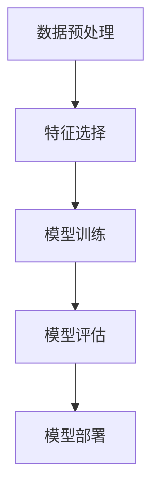
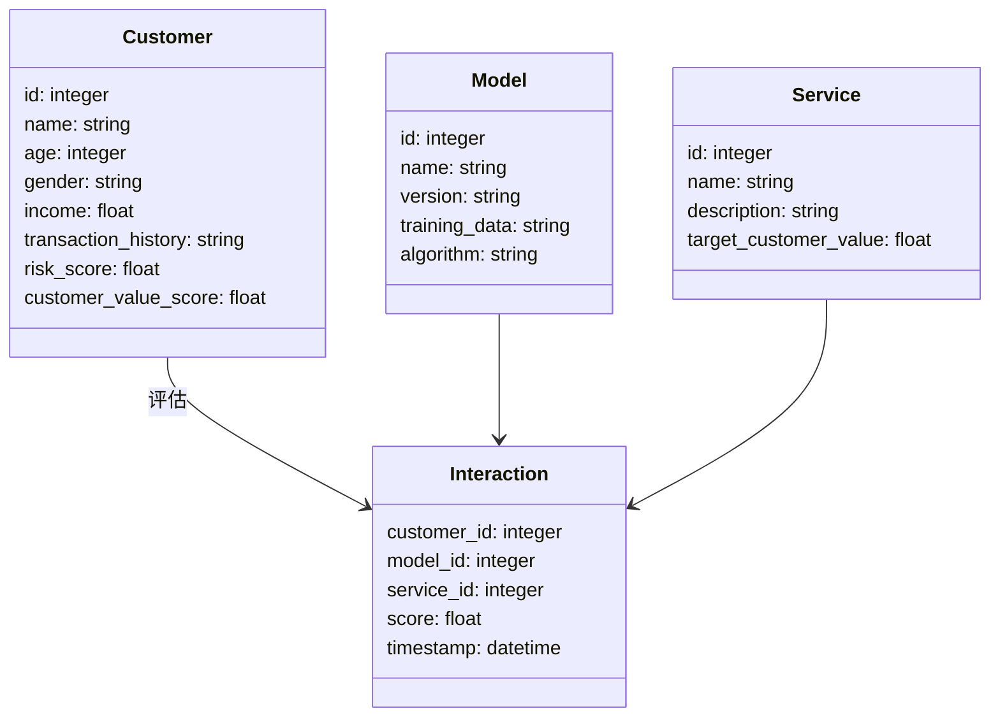
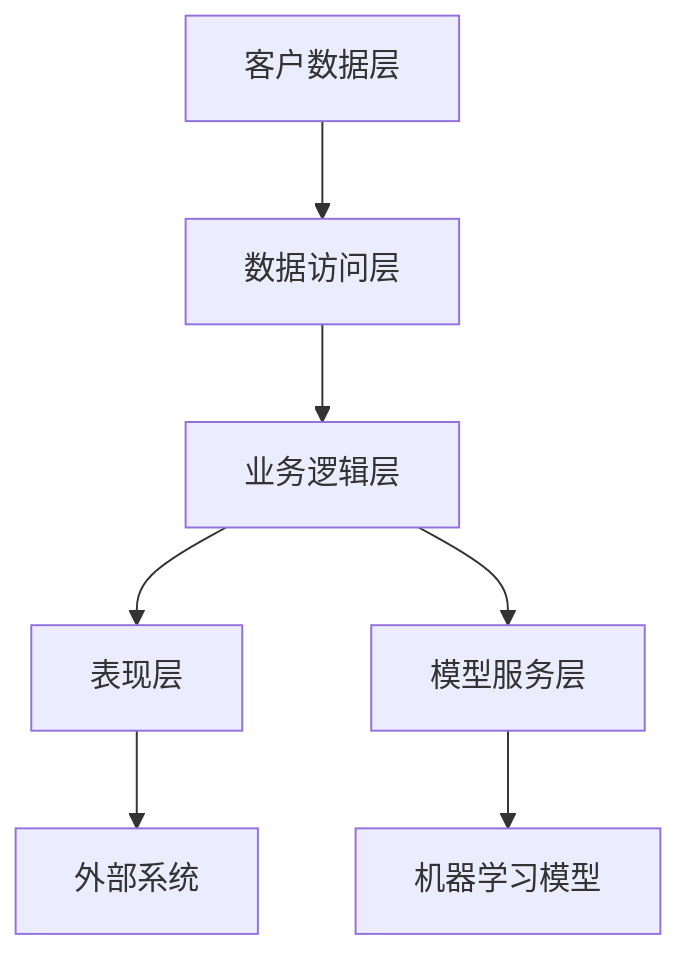
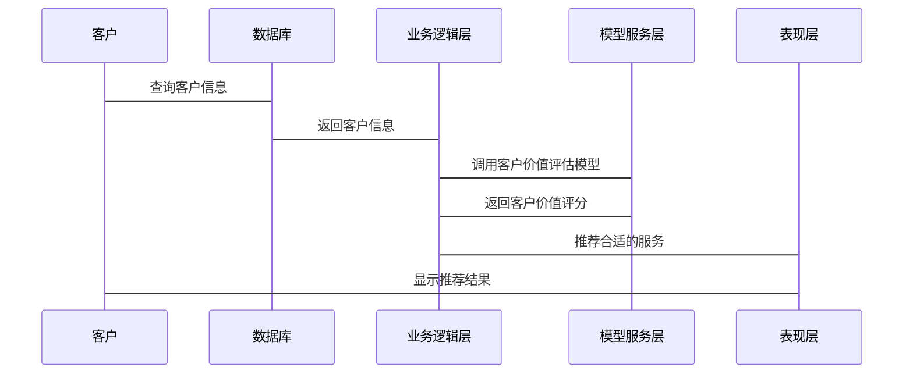

                 


# 第3章: 算法原理

## 3.1 算法核心模型与数学基础

### 3.1.1 客户价值评分公式

客户价值评分公式是模型的核心，通过多维度特征的加权计算客户价值。数学模型如下：

$$
CV = \sum_{i=1}^{n} w_i \cdot x_i
$$

其中：
- \( CV \) 表示客户价值评分
- \( w_i \) 表示第 \( i \) 个特征的权重
- \( x_i \) 表示第 \( i \) 个特征的取值

权重 \( w_i \) 是通过机器学习模型训练得到的，特征 \( x_i \) 包括客户的收入、交易频率、信用评分等。

### 3.1.2 特征选择与权重计算

特征选择是模型的关键步骤，我们需要通过数据分析选择对客户价值影响最大的特征。通常，我们采用信息增益、卡方检验等方法进行特征选择。

权重计算采用随机森林、梯度提升树等模型，通过训练数据计算各特征对客户价值的影响程度。

### 3.1.3 客户分群模型

客户分群是基于聚类算法实现的，常用的聚类算法包括K-means、DBSCAN等。模型将客户分为高价值、中价值、低价值三个群组。

### 3.1.4 客户风险评估模型

客户风险评估采用逻辑回归或XGBoost等模型，通过客户的历史行为数据预测其违约风险。

## 3.2 算法实现步骤

### 3.2.1 数据预处理

- 数据清洗：处理缺失值、异常值
- 特征提取：从数据库中提取客户信息、交易记录等
- 数据标准化：对数值型特征进行标准化或归一化处理

### 3.2.2 模型训练

- 特征选择：使用信息增益、卡方检验等方法选择重要特征
- 模型训练：使用随机森林、XGBoost等模型训练客户价值评分模型
- 超参数调优：通过网格搜索、随机搜索等方法优化模型参数

### 3.2.3 模型评估

- 评估指标：准确率、召回率、F1分数、AUC值等
- 模型验证：使用交叉验证评估模型性能
- 模型部署：将模型部署到生产环境，提供API接口供其他系统调用

## 3.3 算法流程图



## 3.4 算法代码实现

```python
import pandas as pd
from sklearn.ensemble import RandomForestRegressor
from sklearn.model_selection import train_test_split
from sklearn.metrics import mean_squared_error

# 数据加载
data = pd.read_csv('customer_data.csv')

# 特征选择
features = ['age', 'income', 'transaction_frequency', 'credit_score']
target = 'customer_value'

X = data[features]
y = data[target]

# 数据分割
X_train, X_test, y_train, y_test = train_test_split(X, y, test_size=0.2, random_state=42)

# 模型训练
model = RandomForestRegressor(n_estimators=100, max_depth=10, random_state=42)
model.fit(X_train, y_train)

# 模型评估
y_pred = model.predict(X_test)
mse = mean_squared_error(y_test, y_pred)
print(f'Mean Squared Error: {mse}')
print(f'Coefficient of determination (R²): {model.score(X_test, y_test)}')
```

# 第4章: 系统分析与架构设计

## 4.1 问题场景介绍

商业银行客户价值评估系统需要处理海量的客户数据，包括客户的个人信息、交易记录、信用评分等。系统需要通过机器学习模型对客户进行价值评估，并提供个性化的服务推荐。

## 4.2 系统功能设计

### 4.2.1 领域模型



### 4.2.2 系统架构设计



### 4.2.3 系统接口设计

- 数据接口：与客户数据库、交易系统对接，获取客户数据
- 模型接口：提供客户价值评估API，供其他系统调用
- 服务接口：根据客户价值评分推荐合适的服务

### 4.2.4 系统交互流程



# 第5章: 项目实战

## 5.1 环境安装

安装所需的Python库：

```bash
pip install pandas scikit-learn matplotlib seaborn mermaid4jupyter jupyterlab
```

## 5.2 系统核心实现

### 5.2.1 数据预处理代码

```python
import pandas as pd
import numpy as np

# 加载数据
data = pd.read_csv('customer_data.csv')

# 处理缺失值
data = data.dropna()

# 标准化处理
from sklearn.preprocessing import StandardScaler
scaler = StandardScaler()
scaled_features = scaler.fit_transform(data[['age', 'income', 'transaction_frequency', 'credit_score']])
```

### 5.2.2 模型训练代码

```python
from sklearn.ensemble import RandomForestRegressor
from sklearn.model_selection import train_test_split
from sklearn.metrics import mean_squared_error, r2_score

# 数据分割
X_train, X_test, y_train, y_test = train_test_split(scaled_features, data['customer_value'], test_size=0.2, random_state=42)

# 模型训练
model = RandomForestRegressor(n_estimators=100, max_depth=10, random_state=42)
model.fit(X_train, y_train)

# 模型评估
y_pred = model.predict(X_test)
print(f'Mean Squared Error: {mean_squared_error(y_test, y_pred)}')
print(f'R²: {r2_score(y_test, y_pred)}')
```

### 5.2.3 系统架构实现

使用Django框架搭建API接口：

```python
from django.urls import path
from rest_framework import serializers
from rest_framework.decorators import api_view
from rest_framework.response import Response

class CustomerSerializer(serializers.Serializer):
    age = serializers.IntegerField()
    income = serializers.FloatField()
    transaction_frequency = serializers.IntegerField()
    credit_score = serializers.FloatField()

@api_view(['POST'])
def customer_value(request):
    serializer = CustomerSerializer(data=request.data)
    if serializer.is_valid():
        data = serializer.validated_data
        # 调用机器学习模型进行预测
        prediction = model.predict([[data['age'], data['income'], data['transaction_frequency'], data['credit_score']]])
        return Response({'customer_value': prediction[0].tolist()})
    return Response(serializer.errors, status=400)

urlpatterns = [
    path('api/customer-value/', customer_value),
]
```

## 5.3 实际案例分析

### 5.3.1 数据准备

假设我们有以下客户数据：

| 客户ID | 年龄 | 收入 | 交易频率 | 信用评分 | 客户价值评分 |
|--------|------|------|----------|----------|-------------|
| 1      | 30   | 50000| 10       | 750       | 0.8          |
| 2      | 45   | 80000| 15       | 850       | 0.9          |
| 3      | 25   | 30000| 5        | 600       | 0.7          |

### 5.3.2 模型训练与预测

使用上述数据训练模型后，预测新的客户价值评分：

```python
new_customer = [[40, 60000, 12, 700]]
prediction = model.predict(new_customer)
print(f'预测客户价值评分: {prediction[0]}')
```

### 5.3.3 服务推荐

根据预测的客户价值评分推荐合适的服务：

```python
def recommend_service(customer_value):
    if customer_value >= 0.9:
        return '高端理财服务'
    elif 0.7 <= customer_value < 0.9:
        return '贵宾理财服务'
    else:
        return '基础理财服务'

recommended_service = recommend_service(prediction[0])
print(f'推荐服务: {recommended_service}')
```

## 5.4 项目小结

通过本项目，我们实现了基于机器学习的商业银行客户价值评估系统。系统能够自动处理客户数据，训练客户价值评分模型，并根据评分结果推荐合适的服务。该系统在提高客户满意度和银行收益方面具有重要的应用价值。

---

# 总结与展望

## 6.1 最佳实践 tips

- 数据质量是模型性能的关键，确保数据的完整性和准确性
- 选择合适的特征和模型，避免过拟合和欠拟合
- 定期更新模型，适应市场和客户行为的变化

## 6.2 小结

本文详细介绍了智能商业银行客户价值评估模型的设计与实现。通过机器学习算法，我们能够更准确地评估客户的潜在价值，并为银行制定个性化服务策略提供支持。

## 6.3 注意事项

- 数据隐私和安全问题需要特别注意
- 模型的可解释性对于业务决策非常重要
- 系统的实时性和响应速度需要优化

## 6.4 拓展阅读

- 《Python机器学习》
- 《深入理解机器学习》
- 《数据挖掘导论》

---

作者：AI天才研究院/AI Genius Institute & 禅与计算机程序设计艺术 /Zen And The Art of Computer Programming

