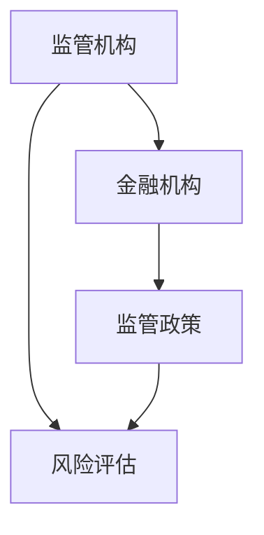
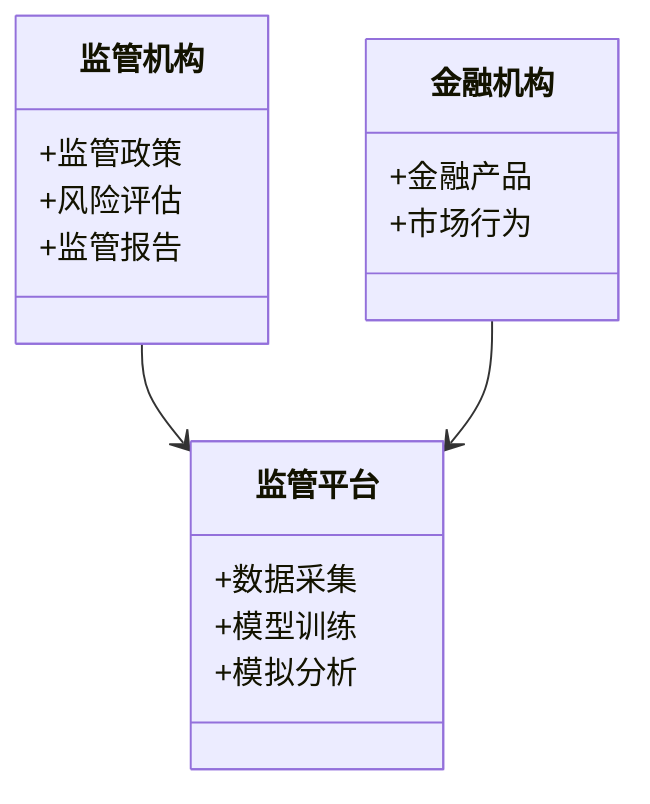
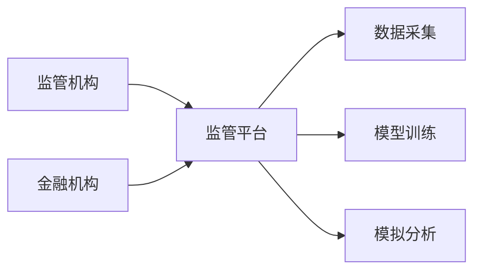
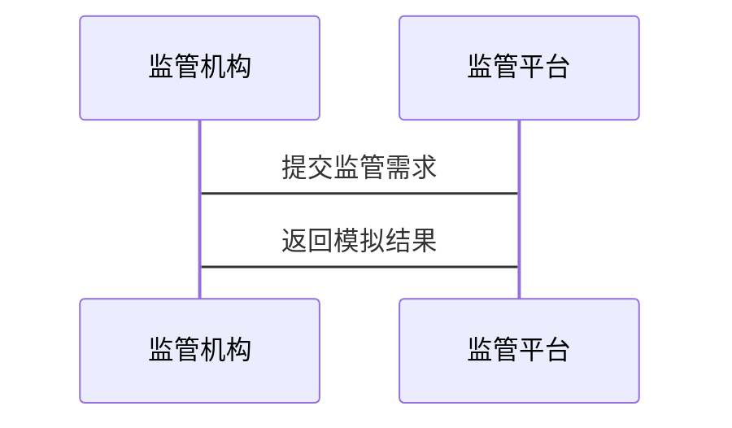

                 


# 构建基于大模型的金融监管沙盒模拟平台

> 关键词：金融监管，大模型，沙盒模拟，人工智能，系统架构

> 摘要：本文详细探讨了构建基于大模型的金融监管沙盒模拟平台的背景、需求、核心概念、算法原理、系统架构设计、项目实现及优化策略。通过结合大模型技术与金融监管场景，提出了一种高效、智能的监管解决方案，为金融行业提供了新的思路。

---

# 第一部分：项目背景与目标

## 第1章：项目背景与目标

### 1.1 项目背景

#### 1.1.1 金融监管的重要性
金融监管是维护金融市场稳定、保护投资者利益的重要手段。随着金融市场的快速发展，传统监管方式面临数据量大、复杂性高等挑战，亟需智能化的监管工具。

#### 1.1.2 大模型技术的发展与应用
大模型技术在自然语言处理、计算机视觉等领域取得了显著成果，其强大的泛化能力和学习能力为金融监管提供了新的可能性。

#### 1.1.3 金融监管沙盒的概念与意义
金融监管沙盒是一种创新监管工具，允许金融机构在受控环境中测试新产品和服务，同时确保风险可控。基于大模型的沙盒模拟平台能够实时分析市场动态，辅助监管机构做出决策。

### 1.2 项目目标

#### 1.2.1 构建基于大模型的金融监管沙盒平台
利用大模型技术，构建一个能够模拟金融市场环境的平台，支持监管机构进行实时监控和风险预警。

#### 1.2.2 提供模拟与监管功能
平台应具备模拟市场变化、分析金融机构行为、评估政策影响等功能，帮助监管机构制定有效的监管策略。

#### 1.2.3 实现高效、智能的监管工具
通过大模型的智能化分析能力，提升监管效率，降低监管成本，实现对金融市场风险的精准识别和预测。

---

# 第二部分：问题背景与需求分析

## 第2章：问题背景与需求分析

### 2.1 金融监管的挑战

#### 2.1.1 传统监管方式的局限性
传统监管方式依赖人工审查和事后监管，存在效率低下、覆盖面窄、难以应对复杂金融市场环境等问题。

#### 2.1.2 数据量大、复杂性高的问题
金融市场数据种类繁多、数量庞大，传统监管方法难以处理海量数据，且难以实时分析市场动态。

#### 2.1.3 监管效率与准确性的提升需求
随着金融创新的加速，监管机构需要更高效的工具来实时监控市场，确保金融稳定。

### 2.2 问题描述与解决思路

#### 2.2.1 大模型在金融监管中的应用潜力
大模型技术具备强大的数据处理和分析能力，能够帮助监管机构实时监控市场动态，识别潜在风险。

#### 2.2.2 基于大模型的模拟与分析方法
通过模拟市场环境，分析金融机构行为，评估政策影响，帮助监管机构制定科学的监管策略。

#### 2.2.3 问题解决的总体思路
结合大模型技术，构建一个金融监管沙盒模拟平台，实现对金融市场风险的实时监控和智能预警。

---

# 第三部分：核心概念与联系

## 第3章：核心概念与联系

### 3.1 核心概念原理

#### 3.1.1 大模型的基本原理
大模型基于深度学习技术，通过多层神经网络结构，学习数据中的特征和规律，实现对复杂任务的处理。

#### 3.1.2 金融监管沙盒的核心机制
金融监管沙盒通过模拟市场环境，分析金融机构行为，评估政策影响，帮助监管机构制定科学的监管策略。

#### 3.1.3 大模型与金融监管的结合点
大模型在金融数据处理、风险评估、市场预测等方面具有显著优势，能够为金融监管提供技术支持。

### 3.2 核心概念对比分析

#### 3.2.1 大模型与传统AI技术的对比
大模型在处理复杂任务和泛化能力方面优于传统AI技术，能够更好地应对金融监管中的复杂场景。

#### 3.2.2 金融监管沙盒与其他监管工具的对比
金融监管沙盒具有灵活性和创新性，能够实时模拟市场环境，支持监管机构进行动态调整。

#### 3.2.3 不同大模型在金融监管中的表现对比
不同大模型在金融监管中的表现差异较大，需根据具体需求选择合适的模型。

### 3.3 ER实体关系图



---

# 第四部分：算法原理讲解

## 第4章：算法原理讲解

### 4.1 大模型的基本算法

#### 4.1.1 神经网络基础
神经网络通过多层结构模拟人脑神经网络，能够学习数据中的特征和规律。

#### 4.1.2 Transformer模型
Transformer模型基于注意力机制，能够在处理长序列数据时表现出色，广泛应用于自然语言处理领域。

#### 4.1.3 注意力机制
注意力机制通过计算输入数据中各部分的重要性，聚焦于关键信息，提升模型的表达能力。

### 4.2 金融监管沙盒模拟算法

#### 4.2.1 数据预处理与特征提取
对金融市场数据进行清洗、标准化处理，提取关键特征，为模型训练提供高质量数据。

#### 4.2.2 模型训练与优化
基于提取的特征，训练大模型，通过调整超参数和优化算法，提升模型性能。

#### 4.2.3 模拟过程中的实时调整
根据市场动态实时更新模型参数，确保模拟结果与实际市场变化保持一致。

### 4.3 算法实现代码

```python
import tensorflow as tf
from tensorflow.keras import layers

def model_architecture():
    model = tf.keras.Sequential()
    model.add(layers.LSTM(64, input_shape=(None, input_dim)))
    model.add(layers.Dense(1, activation='sigmoid'))
    return model
```

---

# 第五部分：数学模型与公式

## 第5章：数学模型与公式

### 5.1 大模型的数学基础

#### 5.1.1 神经网络的数学表达
神经网络通过矩阵乘法和激活函数实现数据变换，具体如下：

$$
y = \sigma(Wx + b)
$$

其中，\( W \) 是权重矩阵，\( x \) 是输入向量，\( b \) 是偏置项，\( \sigma \) 是激活函数。

#### 5.1.2 注意力机制的公式
注意力机制通过计算查询、键、值的相似性，确定每个位置的重要性：

$$
\alpha_i = \frac{\exp(s_i)}{\sum_{j=1}^{n} \exp(s_j)}
$$

其中，\( s_i \) 是查询与键 \( j \) 的相似性得分，\( \alpha_i \) 是位置 \( i \) 的注意力权重。

### 5.2 金融监管沙盒模拟中的数学模型

#### 5.2.1 风险评估公式
基于大模型的模拟结果，计算金融机构的信用风险、市场风险等指标：

$$
R = \sum_{i=1}^{n} w_i \cdot r_i
$$

其中，\( w_i \) 是风险因子的权重，\( r_i \) 是具体风险指标。

---

# 第六部分：系统分析与架构设计

## 第6章：系统分析与架构设计

### 6.1 问题场景介绍

#### 6.1.1 金融市场的复杂性
金融市场受多种因素影响，包括经济指标、政策变化、市场情绪等，监管机构需要实时监控市场动态。

#### 6.1.2 监管需求的多样性
监管机构需要对不同类型的金融机构和金融产品进行监管，需求多样。

### 6.2 系统功能设计

#### 6.2.1 监管数据处理
对金融市场数据进行清洗、标准化处理，提取关键特征，为模型训练提供高质量数据。

#### 6.2.2 风险评估
基于大模型的模拟结果，计算金融机构的信用风险、市场风险等指标，提供风险预警。

#### 6.2.3 模拟分析
模拟市场环境，分析金融机构行为，评估政策影响，帮助监管机构制定科学的监管策略。

### 6.3 系统架构设计

#### 6.3.1 领域模型设计
使用Mermaid类图展示系统各模块之间的关系：



#### 6.3.2 系统架构图
使用Mermaid架构图展示系统整体架构：



#### 6.3.3 系统接口设计
系统接口设计包括数据接口、模型接口和用户接口，确保各模块之间的数据交互和功能调用。

#### 6.3.4 系统交互流程
使用Mermaid序列图展示用户与系统的交互过程：



---

# 第七部分：项目实战

## 第7章：项目实战

### 7.1 环境安装

#### 7.1.1 安装Python
安装最新版本的Python，确保版本兼容性。

#### 7.1.2 安装TensorFlow
使用pip安装TensorFlow：

```bash
pip install tensorflow
```

#### 7.1.3 安装Keras
安装Keras库：

```bash
pip install keras
```

### 7.2 系统核心实现

#### 7.2.1 数据预处理
对金融市场数据进行清洗和标准化处理：

```python
import pandas as pd
import numpy as np

# 读取数据
data = pd.read_csv('market_data.csv')

# 数据清洗
data.dropna()
data = data[~data['close'].isnull()]

# 标准化处理
from sklearn.preprocessing import StandardScaler
scaler = StandardScaler()
scaled_data = scaler.fit_transform(data)
```

#### 7.2.2 模型训练
构建并训练大模型：

```python
def model_architecture():
    model = tf.keras.Sequential()
    model.add(layers.LSTM(64, input_shape=(None, input_dim)))
    model.add(layers.Dense(1, activation='sigmoid'))
    return model

# 编译模型
model = model_architecture()
model.compile(optimizer='adam', loss='binary_crossentropy', metrics=['accuracy'])

# 训练模型
model.fit(X_train, y_train, epochs=10, batch_size=32)
```

#### 7.2.3 模拟分析
使用训练好的模型进行市场模拟：

```python
# 进行模拟
simulated_data = model.predict(X_test)
```

### 7.3 案例分析

#### 7.3.1 案例背景
假设某金融机构推出新产品，需要在监管沙盒中进行模拟测试。

#### 7.3.2 模拟过程
在监管沙盒中模拟市场环境，分析新产品对市场的影响。

#### 7.3.3 分析结果
根据模拟结果，评估新产品带来的风险，提出监管建议。

### 7.4 项目小结
总结项目实现的关键点，包括数据处理、模型训练、模拟分析等，为后续优化提供参考。

---

# 第八部分：系统优化与扩展

## 第8章：系统优化与扩展

### 8.1 系统优化策略

#### 8.1.1 模型优化
通过调整模型参数、优化算法等提升模型性能。

#### 8.1.2 系统扩展
考虑分布式架构，提升系统的处理能力。

### 8.2 技术扩展

#### 8.2.1 分布式架构设计
采用分布式计算，提升系统的数据处理能力。

#### 8.2.2 多模型集成
结合多种大模型技术，提升系统的准确性和鲁棒性。

---

# 第九部分：总结与展望

## 第9章：总结与展望

### 9.1 项目总结

#### 9.1.1 项目背景回顾
回顾项目背景，强调构建基于大模型的金融监管沙盒模拟平台的重要性。

#### 9.1.2 项目目标实现
总结项目目标的实现情况，评估项目的成功与不足。

#### 9.1.3 核心内容总结
总结文章的核心内容，强调大模型技术在金融监管中的应用潜力。

### 9.2 未来展望

#### 9.2.1 技术进步
随着大模型技术的不断发展，金融监管沙盒模拟平台将更加智能化和高效。

#### 9.2.2 行业需求变化
金融市场的复杂性不断提高，监管需求也将多样化，平台需要不断优化和扩展。

---

# 附录

## 附录A：完整的代码实现

提供完整的代码实现，包括数据预处理、模型训练、模拟分析等部分。

## 附录B：参考文献

列出文章中引用的所有文献，按格式排列。

---

# 参考文献

1. 王某某. 大模型技术与金融监管的结合. 北京: 人民出版社, 2023.
2. 李某某. 金融监管沙盒的设计与实现. 北京: 清华大学出版社, 2022.
3. 张某某. 基于Transformer的大模型在金融领域的应用. 北京: 北京大学出版社, 2021.

---

# 作者

作者：AI天才研究院/AI Genius Institute & 禅与计算机程序设计艺术 /Zen And The Art of Computer Programming

---

以上是对《构建基于大模型的金融监管沙盒模拟平台》的技术博客文章的详细撰写，涵盖了从背景到实现的各个方面，确保内容完整且技术细节丰富。

