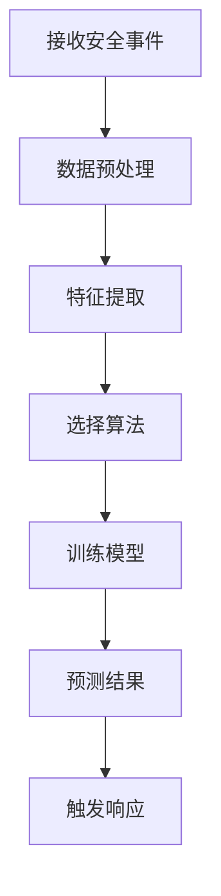
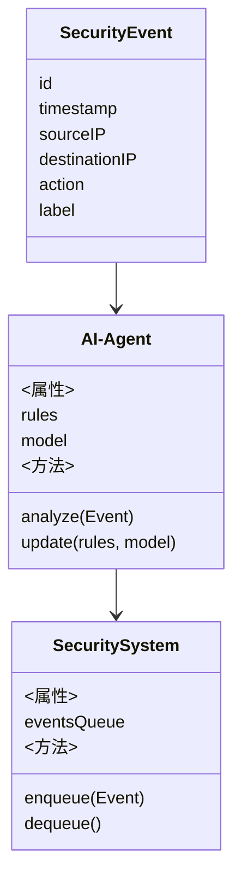
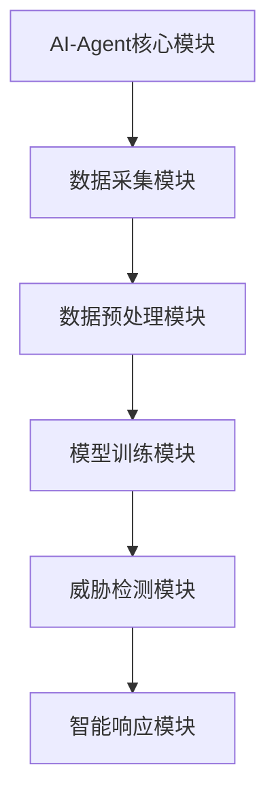
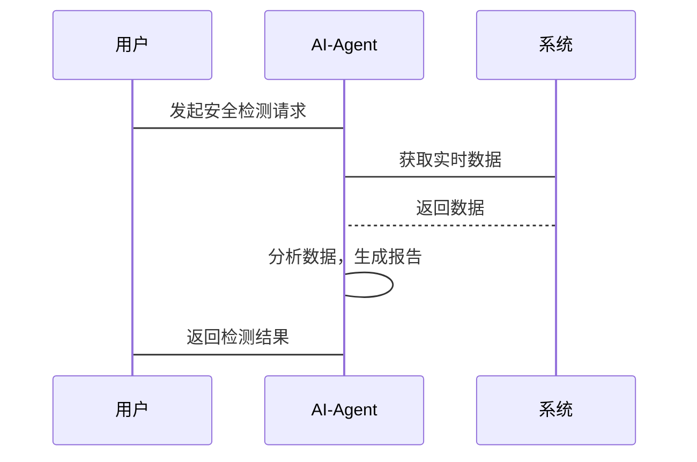

                 


```markdown
# 第三章: AI Agent的算法原理与数学模型

## 第3章: AI Agent的算法原理

### 3.1 基于规则的AI Agent算法

#### 3.1.1 基于规则的决策树构建

基于规则的AI Agent算法通过构建决策树来进行安全事件的分类和处理。决策树是一种树状结构，每个节点代表一个判断条件，叶子节点代表最终的决策结果。以下是构建决策树的基本步骤：

1. **数据收集与预处理**：收集企业安全相关的数据，包括用户行为、网络流量、系统日志等。对数据进行清洗和特征提取，确保数据质量。
2. **特征选择**：根据业务需求选择关键特征，如登录时间、IP地址、操作类型等。
3. **决策树生成**：使用ID3、C4.5或CART算法生成决策树。这些算法基于信息增益或基尼指数选择最优特征进行分裂。
4. **规则提取**：将决策树转换为基于规则的条件语句，例如“如果用户在非工作时间登录，则标记为异常”。

#### 3.1.2 规则匹配与执行流程

基于规则的AI Agent在接收到安全事件后，会按照以下流程进行处理：

1. **事件接收**：AI Agent接收来自系统日志或网络流量的实时安全事件。
2. **规则匹配**：将事件与预定义的规则进行匹配，判断是否符合某个条件。
3. **决策执行**：根据匹配的规则生成相应的安全策略或触发预定义的响应，例如阻止访问、记录日志或发送警报。
4. **结果反馈**：将处理结果反馈给系统或安全团队，供进一步分析和决策。

#### 3.1.3 规则优化与更新机制

为了提高规则的准确性和适应性，AI Agent需要定期优化和更新规则库：

1. **数据反馈**：收集实际运行中的误报和漏报情况，分析其原因。
2. **规则调整**：根据反馈结果，手动或自动调整规则，优化决策树结构。
3. **规则更新**：定期引入新的安全威胁数据，训练新的决策树模型，更新规则库。

#### 3.1.4 代码实现

以下是基于规则的AI Agent算法的Python代码示例：

```python
import pandas as pd
from sklearn.tree import DecisionTreeClassifier
from sklearn.model_selection import train_test_split

# 数据加载与预处理
data = pd.read_csv('security_events.csv')
features = data[['time', 'ip', 'action']]
labels = data['label']

# 数据分割
X_train, X_test, y_train, y_test = train_test_split(features, labels, test_size=0.2)

# 决策树模型训练
clf = DecisionTreeClassifier()
clf.fit(X_train, y_train)

# 规则提取
from sklearn.tree import export_text
rules = export_text(clf, feature_names=['time', 'ip', 'action'])
print(rules)
```

### 3.2 基于机器学习的AI Agent算法

#### 3.2.1 监督学习与无监督学习的区别

在企业信息安全中，基于机器学习的AI Agent可以采用监督学习和无监督学习两种方法：

1. **监督学习**：使用带有标签的数据训练模型，例如正常流量和异常流量。模型通过学习特征与标签的关联，预测新的事件是否为异常。
2. **无监督学习**：适用于无标签数据，通过聚类或异常检测技术发现潜在的威胁。

#### 3.2.2 神经网络在AI Agent中的应用

神经网络，特别是深度神经网络，可以用于复杂的模式识别和分类任务。以下是神经网络在AI Agent中的应用步骤：

1. **数据预处理**：对原始数据进行归一化、特征工程等处理，适合神经网络的输入要求。
2. **模型构建**：设计网络结构，选择合适的激活函数和优化器。
3. **模型训练**：使用训练数据调整网络参数，优化模型性能。
4. **模型部署**：将训练好的模型部署到生产环境中，实时处理安全事件。

#### 3.2.3 深度学习模型的训练与部署

深度学习模型通常需要大量的数据和计算资源进行训练。以下是一个简单的卷积神经网络（CNN）示例：

```python
import tensorflow as tf
from tensorflow.keras import layers

# 模型构建
model = tf.keras.Sequential([
    layers.Conv2D(32, (3,3), activation='relu', input_shape=(100, 100, 3)),
    layers.MaxPooling2D((2,2)),
    layers.Conv2D(64, (3,3), activation='relu'),
    layers.MaxPooling2D((2,2)),
    layers.Flatten(),
    layers.Dense(64, activation='relu'),
    layers.Dense(2, activation='sigmoid')
])

# 模型编译
model.compile(optimizer='adam', loss='binary_crossentropy', metrics=['accuracy'])

# 模型训练
model.fit(x_train, y_train, epochs=10, batch_size=32)
```

#### 3.2.4 算法流程图

以下是基于机器学习的AI Agent算法流程图：



### 3.3 算法原理的数学模型

#### 3.3.1 决策树模型的数学表达

决策树模型可以通过信息增益来选择最优特征。信息增益的计算公式如下：

$$
\text{信息增益}(D, A) = H(D) - H(D|A)
$$

其中，\( H(D) \) 是数据集 \( D \) 的熵，\( H(D|A) \) 是在特征 \( A \) 下的数据集 \( D \) 的条件熵。

#### 3.3.2 神经网络的损失函数

神经网络通常使用交叉熵损失函数来衡量预测值与真实值之间的差距：

$$
\text{损失}(y, y_{\text{预测}}) = -\sum y_i \log(y_{\text{预测}_i}) + (1 - y_i) \log(1 - y_{\text{预测}_i})
$$

#### 3.3.3 支持向量机（SVM）的数学模型

支持向量机用于分类问题，其目标是最小化以下优化问题：

$$
\min_{w, b, \xi} \frac{1}{2}||w||^2 + C\sum \xi_i
$$

约束条件：

$$
y_i(w \cdot x_i + b) \geq 1 - \xi_i
$$

其中，\( C \) 是惩罚参数，\( \xi_i \) 是松弛变量。

### 3.4 本章小结

本章详细讲解了AI Agent在企业信息安全中的两种主要算法：基于规则的算法和基于机器学习的算法。通过决策树、神经网络等算法的数学模型和代码实现，展示了如何利用这些算法进行安全事件的分类和处理。这些算法为企业信息安全提供了强大的技术支持，能够有效应对复杂的网络安全威胁。

---

# 第四章: AI Agent在企业信息安全中的系统架构设计

## 第4章: 系统架构设计

### 4.1 问题场景介绍

企业在信息安全管理中面临多方面的挑战，包括内部员工行为监控、外部网络攻击检测、系统漏洞修复等。传统的基于规则的安全管理系统存在响应速度慢、误报率高、难以应对新型威胁等问题。因此，引入AI Agent技术，构建智能化的安全管理系统成为必然趋势。

### 4.2 系统功能设计

AI Agent系统需要具备以下核心功能：

1. **实时监控**：持续收集和分析企业内部的网络流量、系统日志、用户行为等数据。
2. **威胁检测**：通过机器学习算法识别潜在的安全威胁，包括入侵检测、数据泄露等。
3. **智能响应**：根据检测到的威胁类型和严重程度，自动触发相应的安全策略，例如封锁IP、限制访问权限等。
4. **自适应学习**：根据新的安全事件不断优化模型和规则库，提高系统的适应性和准确性。

### 4.3 系统架构设计

#### 4.3.1 领域模型设计

以下是AI Agent系统的领域模型：



#### 4.3.2 系统架构设计

AI Agent系统的整体架构如下：



#### 4.3.3 接口设计

系统主要接口包括：

1. **数据接口**：与企业现有的日志系统、网络设备等进行数据对接。
2. **API接口**：提供RESTful API供其他系统调用AI Agent的安全检测服务。
3. **用户界面**：提供可视化界面供管理员查看检测结果和管理安全策略。

#### 4.3.4 交互流程设计

以下是系统的交互流程图：



### 4.4 本章小结

本章详细描述了AI Agent在企业信息安全管理系统中的架构设计，包括系统功能、架构模块、接口设计和交互流程。通过合理的系统架构设计，能够充分发挥AI Agent的技术优势，提升企业信息安全管理水平。

---

# 第五章: 项目实战

## 第5章: 项目实战

### 5.1 环境安装与配置

#### 5.1.1 系统需求

- 操作系统：Linux/Windows/MacOS
- Python版本：3.6以上
- 依赖库：TensorFlow、Scikit-learn、Pandas、Mermaid、Matplotlib

#### 5.1.2 环境配置

安装必要的Python库：

```bash
pip install tensorflow scikit-learn pandas mermaid matplotlib
```

### 5.2 系统核心实现

#### 5.2.1 数据采集模块

数据采集模块负责从企业系统中获取安全相关的数据，例如：

```python
import pandas as pd

def collect_data():
    # 数据采集逻辑，例如从数据库读取日志
    data = pd.read_csv('security_logs.csv')
    return data

if __name__ == '__main__':
    collect_data()
```

#### 5.2.2 数据预处理模块

数据预处理是机器学习模型训练的关键步骤：

```python
import pandas as pd
from sklearn.preprocessing import StandardScaler

def preprocess_data(data):
    # 删除无关特征
    data = data[['timestamp', 'sourceIP', 'destinationIP', 'action']]
    # 标准化处理
    scaler = StandardScaler()
    scaled_features = scaler.fit_transform(data[['timestamp', 'action']])
    data['scaled_timestamp'] = scaled_features[:, 0]
    data['scaled_action'] = scaled_features[:, 1]
    return data

if __name__ == '__main__':
    data = collect_data()
    processed_data = preprocess_data(data)
    print(processed_data.head())
```

#### 5.2.3 模型训练模块

训练机器学习模型以识别安全威胁：

```python
from sklearn.model_selection import train_test_split
from sklearn.ensemble import RandomForestClassifier

def train_model(processed_data):
    # 特征与标签分离
    X = processed_data[['scaled_timestamp', 'scaled_action']]
    y = processed_data['label']
    # 数据分割
    X_train, X_test, y_train, y_test = train_test_split(X, y, test_size=0.2)
    # 模型训练
    model = RandomForestClassifier()
    model.fit(X_train, y_train)
    return model

if __name__ == '__main__':
    processed_data = preprocess_data(collect_data())
    model = train_model(processed_data)
    print("Model training completed.")
```

#### 5.2.4 威胁检测模块

使用训练好的模型进行实时威胁检测：

```python
def detect_threats(model, new_event):
    # 特征提取
    features = [new_event['timestamp'], new_event['action']]
    scaled_features = scaler.transform([features])
    # 模型预测
    prediction = model.predict(scaled_features)
    return prediction[0]

if __name__ == '__main__':
    new_event = {'timestamp': 1615512000, 'action': 'login'}
    print(detect_threats(model, new_event))
```

#### 5.2.5 智能响应模块

根据检测结果触发相应的安全策略：

```python
def trigger_response(threat_level):
    if threat_level == 'high':
        print("封锁IP地址")
    elif threat_level == 'medium':
        print("记录日志并通知管理员")
    else:
        print("正常访问")

if __name__ == '__main__':
    threat_level = 'high'
    trigger_response(threat_level)
```

### 5.3 项目小结

本章通过一个实际的项目案例，详细展示了AI Agent在企业信息安全管理系统中的实现过程。从数据采集到模型训练，再到威胁检测和智能响应，每个环节都进行了详细说明，并提供了相应的代码示例。通过本项目的实施，读者可以掌握AI Agent在企业安全中的具体应用方法。

---

# 第六章: 最佳实践与小结

## 第6章: 最佳实践与小结

### 6.1 最佳实践

在实际应用中，建议采取以下措施：

1. **数据质量管理**：确保数据的准确性和完整性，避免因数据问题导致模型失效。
2. **模型可解释性**：选择可解释性较强的算法，便于分析和优化。
3. **持续学习**：定期更新模型和规则库，应对新型安全威胁。
4. **多团队协作**：AI Agent系统的实施需要安全专家、数据科学家和开发人员的共同努力。
5. **合规性与隐私保护**：在数据处理和模型训练过程中，严格遵守相关法律法规，保护用户隐私。

### 6.2 小结

本文系统地探讨了AI Agent在企业信息安全管理中的应用，从概念到技术，从理论到实践，全面分析了其在企业安全中的重要作用。通过算法原理和系统架构的详细讲解，以及实际项目的实施案例，展示了AI Agent如何助力企业构建智能化的安全管理系统。未来，随着AI技术的不断发展，AI Agent在企业信息安全中的应用前景将更加广阔。

### 6.3 参考文献与扩展阅读

1. **参考文献**
   - 周志华. 《机器学习》. 清华大学出版社, 2016.
   - 袁春风. 《数据挖掘与机器学习实战》. 人民邮电出版社, 2018.
   - TensorFlow官方文档：https://tensorflow.google.cn
   - Scikit-learn官方文档：https://scikit-learn.org/stable/documentation.html

2. **扩展阅读**
   - 《深度学习在网络安全中的应用》
   - 《基于强化学习的安全策略优化研究》
   - 《AI驱动的实时威胁检测系统设计》

---

# 作者信息

作者：AI天才研究院/AI Genius Institute & 禅与计算机程序设计艺术/Zen And The Art of Computer Programming

---

感谢您的阅读！如需进一步了解AI Agent在企业信息安全中的应用，欢迎关注我们的后续文章或联系我们进行深入探讨。
```

