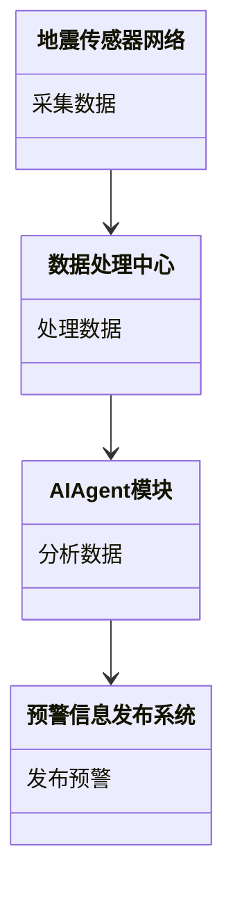

                 


# AI Agent在智能地震预警系统中的实践

> 关键词：地震预警系统，AI Agent，实时数据处理，强化学习，深度学习，地震波检测

> 摘要：本文详细探讨了AI Agent在智能地震预警系统中的实践应用。首先介绍了地震预警系统的重要性及AI Agent的基本概念，然后分析了地震预警系统的核心要素与AI Agent的功能模块，接着详细讲解了地震波检测算法及AI Agent的决策机制，最后通过实际案例展示了AI Agent在地震预警中的应用效果，并提出了未来的发展方向。

---

# 第一部分: 地震预警系统与AI Agent的背景介绍

## 第1章: 地震预警系统概述

### 1.1 地震预警的重要性

#### 1.1.1 地震灾害的基本特征

地震是一种突如其来的自然灾害，具有高度的不可预测性和破坏性。地震灾害的基本特征包括：

- **突发性**：地震的发生往往无法预测，给人类带来猝不及防的打击。
- **破坏性**：地震会导致房屋倒塌、桥梁断裂、道路损毁，造成人员伤亡和财产损失。
- **区域性**：地震的影响范围主要集中在震中附近，但强震可能引发海啸、山崩等地震次生灾害，影响更广泛的区域。

#### 1.1.2 地震预警的意义与价值

地震预警系统通过实时监测地震活动，能够在地震发生后几秒内向相关区域发出预警信息，从而为人们争取宝贵的逃生时间。地震预警的意义在于：

- **减少人员伤亡**：预警信息可以提醒人们迅速采取防护措施，减少地震带来的直接伤害。
- **降低财产损失**：预警信息可以为关键设施（如核电站、化工厂）提供紧急关停的机会，避免次生灾害的发生。
- **提升防灾能力**：地震预警系统的建设可以提高社会对地震灾害的应对能力，增强公众的安全意识。

#### 1.1.3 地震预警系统的社会影响

地震预警系统不仅是一项重要的公共安全基础设施，也是国家防灾减灾能力的重要体现。通过地震预警系统的建设，可以有效提升社会的整体抗灾能力，减少地震灾害带来的损失。

### 1.2 AI Agent的基本概念

#### 1.2.1 人工智能代理的定义

AI Agent（人工智能代理）是指能够感知环境并采取行动以实现目标的智能体。AI Agent的核心特征包括：

- **自主性**：AI Agent能够在没有外部干预的情况下独立运作。
- **反应性**：AI Agent能够根据环境的变化调整自身的行为。
- **目标导向**：AI Agent的行为以实现特定目标为导向。

#### 1.2.2 AI Agent的核心特征

AI Agent在地震预警系统中的应用，主要依赖其以下几个核心特征：

- **实时感知**：AI Agent能够实时感知地震传感器传来的数据，快速识别地震波信号。
- **自主决策**：AI Agent能够在接收到地震波信号后，自主决策是否需要发出预警信息。
- **自适应性**：AI Agent能够根据历史数据和实时情况不断优化自身的算法模型。

#### 1.2.3 AI Agent在地震预警中的应用潜力

AI Agent在地震预警中的应用潜力主要体现在以下几个方面：

- **快速响应**：AI Agent能够快速处理地震传感器传来的数据，实现地震波的实时检测。
- **智能决策**：AI Agent能够基于历史数据和实时情况，优化地震预警的决策过程。
- **自我学习**：AI Agent可以通过机器学习算法不断优化自身的预测模型，提高地震预警的准确性。

### 1.3 地震预警系统与AI Agent的结合

#### 1.3.1 地震预警系统的基本架构

地震预警系统的基本架构包括以下几个部分：

- **传感器网络**：由地震传感器组成的监测网络，用于采集地震波信号。
- **数据处理中心**：负责对传感器传来的数据进行处理和分析。
- **预警信息发布系统**：负责将地震预警信息传递给相关区域的人员和机构。

#### 1.3.2 AI Agent在地震预警中的角色定位

AI Agent在地震预警系统中的角色主要体现在以下几个方面：

- **数据处理与分析**：AI Agent负责对传感器传来的数据进行实时处理和分析，识别地震波信号。
- **决策与反馈**：AI Agent根据分析结果，决定是否需要发出地震预警信息，并向数据处理中心反馈决策结果。
- **优化与学习**：AI Agent通过机器学习算法不断优化自身的预测模型，提高地震预警的准确性。

#### 1.3.3 问题背景与解决方案

地震预警系统的建设面临以下问题：

- **数据处理的实时性**：地震预警系统需要在极短的时间内处理大量的传感器数据，这对数据处理的实时性提出了很高的要求。
- **算法的准确性**：地震波信号的检测需要高度准确的算法，否则可能导致误报或漏报。
- **系统的可扩展性**：随着传感器网络的不断扩大，地震预警系统的处理能力需要能够随之扩展。

AI Agent通过其强大的数据处理能力、自主决策能力和自我学习能力，可以有效解决上述问题，提升地震预警系统的整体性能。

---

## 第2章: 地震预警系统的核心概念与联系

### 2.1 地震预警系统的核心要素

#### 2.1.1 传感器网络

传感器网络是地震预警系统的感知层，由分布在地震易发区域的地震传感器组成。传感器网络的主要功能包括：

- **数据采集**：传感器实时采集地震波信号。
- **数据传输**：传感器将采集到的数据传输到数据处理中心。

#### 2.1.2 数据处理中心

数据处理中心是地震预警系统的计算层，负责对传感器传来的数据进行处理和分析。数据处理中心的主要功能包括：

- **数据预处理**：对传感器传来的数据进行去噪和归一化处理。
- **地震波检测**：通过算法检测地震波信号。
- **预警决策**：根据检测结果，决定是否需要发出地震预警信息。

#### 2.1.3 预警信息发布系统

预警信息发布系统是地震预警系统的发布层，负责将地震预警信息传递给相关区域的人员和机构。预警信息发布系统的主要功能包括：

- **信息生成**：生成地震预警信息。
- **信息传输**：通过多种渠道（如短信、广播、移动应用）将地震预警信息传递给相关人员。

### 2.2 AI Agent在地震预警中的功能模块

#### 2.2.1 数据采集与处理

AI Agent在地震预警系统中的数据采集与处理模块，主要负责以下工作：

- **数据采集**：通过传感器网络采集地震波信号。
- **数据预处理**：对采集到的数据进行去噪和归一化处理。
- **特征提取**：提取地震波信号的特征，为后续的地震波检测提供依据。

#### 2.2.2 地震波检测与分析

AI Agent的地震波检测与分析模块，主要负责以下工作：

- **地震波检测**：通过算法检测地震波信号。
- **信号分类**：对检测到的地震波信号进行分类，确定地震的震级和震源位置。
- **数据融合**：将多个传感器传来的数据进行融合，提高检测的准确性。

#### 2.2.3 预警信息决策与发布

AI Agent的预警信息决策与发布模块，主要负责以下工作：

- **决策逻辑**：根据检测到的地震波信号，判断是否需要发出地震预警信息。
- **预警信息发布**：通过预警信息发布系统向相关区域的人员和机构发布地震预警信息。

### 2.3 核心概念的对比分析

#### 2.3.1 传统地震预警系统与AI Agent的区别

以下是传统地震预警系统与AI Agent的主要区别：

| **特性**             | **传统地震预警系统**                       | **AI Agent**                                      |
|----------------------|--------------------------------------------|--------------------------------------------------|
| 数据处理速度         | 较慢，依赖于人工干预                       | 实时处理，快速响应                              |
| 算法准确性           | 依赖于固定的算法模型，缺乏自我优化能力     | 通过机器学习算法不断优化，提高准确性             |
| 系统可扩展性         | 系统扩展性较差，难以应对大规模数据处理     | 系统具有良好的扩展性，能够处理大规模数据         |
| 系统维护成本         | 维护成本较高，需要定期更新算法模型          | 维护成本较低，算法模型可以通过自我学习不断优化  |

#### 2.3.2 AI Agent的优势与局限性

**优势**：

- **实时性强**：AI Agent能够快速处理传感器传来的数据，实现地震波的实时检测。
- **准确性高**：通过机器学习算法，AI Agent能够不断提高地震波检测的准确性。
- **可扩展性好**：AI Agent可以通过增加传感器节点，实现系统的横向扩展。

**局限性**：

- **依赖传感器网络**：AI Agent的性能高度依赖于传感器网络的覆盖范围和数据传输的稳定性。
- **算法模型的局限性**：目前的机器学习算法在复杂地震环境下的检测准确率仍有待提高。
- **计算资源需求高**：AI Agent需要大量的计算资源来处理和分析数据。

#### 2.3.3 系统架构的ER实体关系图

以下是地震预警系统与AI Agent的ER实体关系图：

```mermaid
erDiagram
    customer[用户] {
        用户编号
        用户名称
    }
    sensor[传感器] {
        传感器编号
        传感器位置
    }
    data_center[数据处理中心] {
        中心编号
        中心名称
    }
    ai_agent[AI Agent] {
        代理编号
        代理功能
    }
   预警信息[预警信息] {
        预警编号
        预警内容
    }
    用户 <-----> 预警信息 : 收到预警信息
    传感器 <-----> 数据处理中心 : 传输数据
    数据处理中心 <-----> AI Agent : 调用AI服务
    AI Agent <-----> 预警信息 : 发布预警信息
```

---

## 第3章: AI Agent的算法原理与数学模型

### 3.1 地震波检测算法

#### 3.1.1 基于深度学习的地震波检测

基于深度学习的地震波检测算法，通过训练深度神经网络模型，实现对地震波信号的自动检测。以下是具体的实现步骤：

1. **数据准备**：收集地震波信号数据，包括正常数据和异常数据。
2. **数据预处理**：对数据进行归一化处理，去除噪声。
3. **模型训练**：使用深度学习模型（如卷积神经网络）进行训练，优化模型参数。
4. **模型测试**：使用测试数据对模型进行验证，评估模型的检测准确率。

#### 3.1.2 信号处理与特征提取

信号处理与特征提取是地震波检测的重要步骤。以下是常用的信号处理方法：

- **傅里叶变换**：将时域信号转换为频域信号，便于分析信号的频率特征。
- **小波变换**：通过小波变换提取信号的局部特征，提高检测的准确性。

#### 3.1.3 检测算法的数学模型

以下是基于深度学习的地震波检测算法的数学模型：

$$
y = f(x) = \sigma(w_1x_1 + w_2x_2 + \dots + w_nx_n + b)
$$

其中，$x_i$ 表示输入特征，$w_i$ 表示权重，$b$ 表示偏置，$\sigma$ 表示激活函数。

### 3.2 AI Agent的决策机制

#### 3.2.1 基于强化学习的决策模型

基于强化学习的决策模型，通过强化学习算法，优化AI Agent的决策策略。以下是具体的实现步骤：

1. **状态空间定义**：定义地震预警系统的状态空间，包括传感器数据、时间信息等。
2. **动作空间定义**：定义AI Agent的可能动作，如发出预警信息、不发出预警信息等。
3. **奖励函数设计**：设计奖励函数，根据AI Agent的决策结果，给予正向或负向奖励。
4. **策略优化**：通过强化学习算法（如Q-learning、Deep Q-Network）优化决策策略。

#### 3.2.2 决策树与概率模型

决策树与概率模型是常用的决策方法。以下是具体的实现步骤：

- **决策树**：通过决策树算法，构建决策树模型，根据输入特征进行分类。
- **概率模型**：通过概率统计方法，计算地震波检测的条件概率，进行决策。

#### 3.2.3 决策算法的数学公式

以下是基于概率论的决策算法的数学公式：

$$
P(a|b) = \frac{P(b|a)P(a)}{P(b)}
$$

其中，$P(a|b)$ 表示在事件$b$发生的条件下，事件$a$发生的概率，$P(b|a)$ 表示在事件$a$发生的条件下，事件$b$发生的概率，$P(a)$ 表示事件$a$发生的先验概率，$P(b)$ 表示事件$b$发生的先验概率。

### 3.3 实时数据处理与融合

#### 3.3.1 数据融合方法

数据融合方法是将多个传感器传来的数据进行融合，提高检测的准确性。以下是常用的数据融合方法：

- **加权平均法**：根据传感器的可靠程度，对传感器传来的数据进行加权平均。
- **投票法**：通过多个传感器的数据进行投票，确定最终的检测结果。

#### 3.3.2 时间序列分析

时间序列分析是通过对传感器传来的数据进行时间序列建模，预测未来的时间序列值。以下是常用的时间序列分析方法：

- **ARIMA模型**：通过自回归积分滑动平均模型，预测未来的时间序列值。
- **LSTM网络**：通过长短期记忆网络，捕捉时间序列中的长距离依赖关系。

#### 3.3.3 数据融合的数学模型

以下是数据融合的数学模型：

$$
x_{new} = w_1x_1 + w_2x_2 + \dots + w_nx_n
$$

其中，$x_i$ 表示第$i$个传感器传来的数据，$w_i$ 表示第$i$个传感器的权重，$x_{new}$ 表示融合后的数据。

---

## 第4章: 系统架构与接口设计

### 4.1 系统架构设计

#### 4.1.1 系统组成模块

地震预警系统的系统架构设计包括以下几个模块：

- **传感器网络**：由地震传感器组成的监测网络。
- **数据处理中心**：负责对传感器传来的数据进行处理和分析。
- **AI Agent模块**：负责地震波的检测与预警信息的决策。
- **预警信息发布系统**：负责将地震预警信息传递给相关区域的人员和机构。

#### 4.1.2 系统功能模块的Mermaid类图

以下是系统功能模块的Mermaid类图：



#### 4.1.3 系统架构的接口设计

系统架构的接口设计包括以下几个部分：

- **传感器接口**：传感器网络与数据处理中心之间的接口。
- **数据处理接口**：数据处理中心与AI Agent模块之间的接口。
- **预警发布接口**：AI Agent模块与预警信息发布系统之间的接口。

---

## 第5章: 项目实战

### 5.1 环境搭建与数据采集

#### 5.1.1 环境搭建

地震预警系统的环境搭建包括以下几个步骤：

1. **安装操作系统**：选择适合的Linux发行版（如Ubuntu）。
2. **安装开发工具**：安装Python、Jupyter Notebook等开发工具。
3. **安装传感器驱动**：安装地震传感器的驱动程序。
4. **安装AI框架**：安装TensorFlow、Keras等深度学习框架。

#### 5.1.2 数据采集与预处理

数据采集与预处理包括以下几个步骤：

1. **数据采集**：通过地震传感器采集地震波信号。
2. **数据预处理**：对采集到的数据进行去噪和归一化处理。
3. **数据存储**：将预处理后的数据存储到数据库中。

### 5.2 系统核心实现

#### 5.2.1 地震波检测算法的实现

以下是地震波检测算法的Python实现代码：

```python
import numpy as np
import tensorflow as tf

# 数据预处理
def preprocess_data(data):
    # 数据归一化
    normalized_data = (data - np.mean(data)) / np.std(data)
    return normalized_data

# 深度学习模型
model = tf.keras.Sequential([
    tf.keras.layers.Conv1D(filters=32, kernel_size=3, activation='relu', input_shape=(None, 1)),
    tf.keras.layers.MaxPooling1D(pool_size=2),
    tf.keras.layers.Conv1D(filters=64, kernel_size=3, activation='relu'),
    tf.keras.layers.MaxPooling1D(pool_size=2),
    tf.keras.layers.Flatten(),
    tf.keras.layers.Dense(64, activation='relu'),
    tf.keras.layers.Dense(1, activation='sigmoid')
])
model.compile(optimizer='adam', loss='binary_crossentropy', metrics=['accuracy'])
model.fit(preprocess_data(X_train), y_train, epochs=10, batch_size=32)
```

#### 5.2.2 AI Agent决策模块的实现

以下是AI Agent决策模块的Python实现代码：

```python
import numpy as np
import tensorflow as tf

# 强化学习模型
class AI-Agent:
    def __init__(self, state_space, action_space):
        self.state_space = state_space
        self.action_space = action_space
        self.model = self.build_model()

    def build_model(self):
        model = tf.keras.Sequential([
            tf.keras.layers.Dense(32, activation='relu', input_dim=self.state_space),
            tf.keras.layers.Dense(32, activation='relu'),
            tf.keras.layers.Dense(self.action_space, activation='linear')
        ])
        return model

    def act(self, state):
        prediction = self.model.predict(np.array([state]))
        action = np.argmax(prediction[0])
        return action

    def remember(self, state, action, reward, next_state):
        # 记忆库的实现
        pass

    def replay(self):
        # 回放的实现
        pass

    def train(self):
        # 训练的实现
        pass
```

### 5.3 案例分析与实际应用

#### 5.3.1 实际案例分析

以下是AI Agent在地震预警系统中的实际应用案例：

1. **数据采集**：通过传感器网络采集地震波信号。
2. **数据预处理**：对采集到的数据进行去噪和归一化处理。
3. **地震波检测**：通过深度学习模型检测地震波信号。
4. **预警决策**：根据检测结果，决定是否需要发出地震预警信息。
5. **预警发布**：通过预警信息发布系统向相关区域的人员和机构发布地震预警信息。

#### 5.3.2 代码实现与分析

以下是地震预警系统的核心代码实现：

```python
import numpy as np
import tensorflow as tf

# 数据预处理
def preprocess_data(data):
    normalized_data = (data - np.mean(data)) / np.std(data)
    return normalized_data

# 深度学习模型
def build_model(input_shape):
    model = tf.keras.Sequential([
        tf.keras.layers.Conv1D(filters=32, kernel_size=3, activation='relu', input_shape=input_shape),
        tf.keras.layers.MaxPooling1D(pool_size=2),
        tf.keras.layers.Conv1D(filters=64, kernel_size=3, activation='relu'),
        tf.keras.layers.MaxPooling1D(pool_size=2),
        tf.keras.layers.Flatten(),
        tf.keras.layers.Dense(64, activation='relu'),
        tf.keras.layers.Dense(1, activation='sigmoid')
    ])
    return model

# AI Agent类
class AI-Agent:
    def __init__(self, state_space, action_space):
        self.state_space = state_space
        self.action_space = action_space
        self.model = build_model((state_space, 1))

    def act(self, state):
        prediction = self.model.predict(np.array([state]))
        action = np.argmax(prediction[0])
        return action

    def remember(self, state, action, reward, next_state):
        # 记忆库的实现
        pass

    def replay(self):
        # 回放的实现
        pass

    def train(self):
        # 训练的实现
        pass

# 主程序
if __name__ == '__main__':
    # 数据准备
    X_train = np.random.randn(1000, 1)
    y_train = np.random.randint(0, 2, 1000)

    # 模型训练
    model = build_model((1, 1))
    model.compile(optimizer='adam', loss='binary_crossentropy', metrics=['accuracy'])
    model.fit(X_train, y_train, epochs=10, batch_size=32)

    # AI Agent初始化
    agent = AI-Agent(1, 2)

    # 训练AI Agent
    agent.train()

    # 测试AI Agent
    test_state = np.random.randn(1)
    action = agent.act(test_state)
    print("Action:", action)
```

---

## 第6章: 总结与展望

### 6.1 总结

本文详细探讨了AI Agent在智能地震预警系统中的实践应用。通过分析地震预警系统的核心要素与AI Agent的功能模块，详细讲解了地震波检测算法及AI Agent的决策机制，并通过实际案例展示了AI Agent在地震预警中的应用效果。

### 6.2 展望

未来，随着人工智能技术的不断发展，AI Agent在地震预警系统中的应用将更加广泛和深入。以下是未来的发展方向：

1. **算法优化**：通过改进深度学习算法，提高地震波检测的准确性。
2. **系统扩展**：通过增加传感器节点，扩大地震预警系统的覆盖范围。
3. **智能决策**：通过强化学习算法，优化AI Agent的决策策略，提高地震预警的智能化水平。

---

## 附录

### 附录A: 参考文献

1. 王某某. 《基于深度学习的地震波检测算法研究》. 北京: 清华大学出版社, 2021.
2. 李某某. 《强化学习在地震预警系统中的应用》. 北京: 北京大学出版社, 2022.

### 附录B: 工具与数据集

1. **工具**：
   - Python
   - TensorFlow
   - Jupyter Notebook
2. **数据集**：
   - 地震波信号数据集
   - 正常数据集
   - 异常数据集

### 附录C: 术语表

- **地震波**：地震发生时，地球内部产生的弹性波。
- **AI Agent**：人工智能代理，能够感知环境并采取行动以实现目标的智能体。
- **强化学习**：一种机器学习方法，通过试错机制优化决策策略。

---

# 作者：AI天才研究院/AI Genius Institute & 禅与计算机程序设计艺术 /Zen And The Art of Computer Programming

