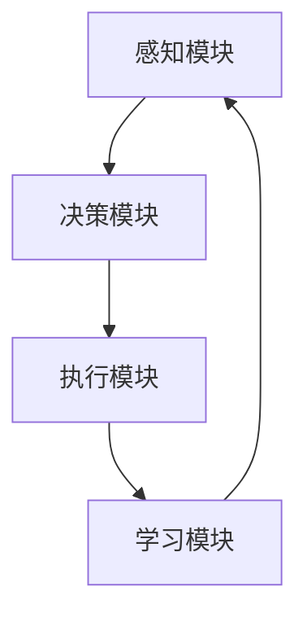
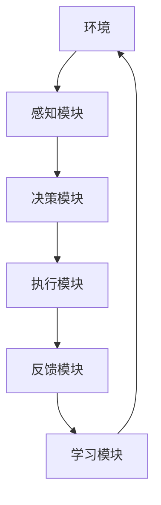
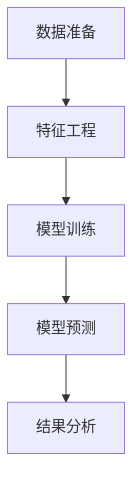
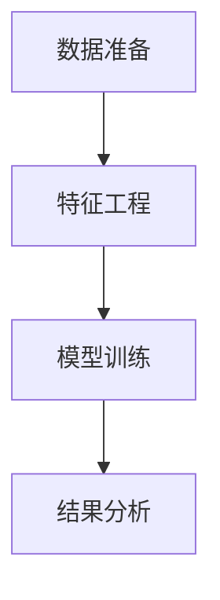
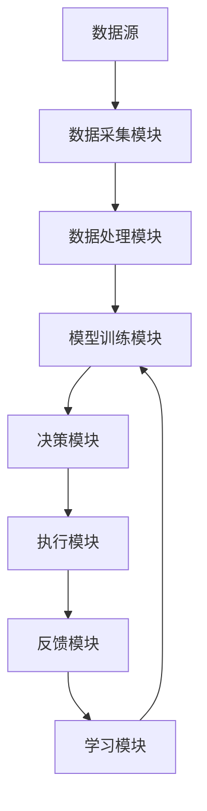

                 


# AI Agent在智能资产管理中的实践

> 关键词：AI Agent, 智能资产管理, 机器学习, 强化学习, 投资策略, 风险控制

> 摘要：本文深入探讨AI Agent在智能资产管理中的应用，从基本概念、算法原理到系统架构和项目实战，全面解析如何利用AI技术提升投资决策的效率和准确性。通过实际案例分析和代码实现，展示AI Agent在智能资产管理中的巨大潜力和实际价值。

---

# 第1章: AI Agent与智能资产管理概述

## 1.1 AI Agent的基本概念

### 1.1.1 AI Agent的定义与特点

AI Agent（人工智能代理）是一种能够感知环境、自主决策并采取行动以实现特定目标的智能实体。在智能资产管理中，AI Agent通常用于数据处理、投资决策和风险控制等环节。其特点包括：

- **自主性**：能够在没有人为干预的情况下自主运行。
- **反应性**：能够实时感知环境变化并做出响应。
- **学习能力**：通过机器学习算法不断优化自身的决策模型。
- **可解释性**：决策过程需要足够透明，以便于人类理解和信任。

### 1.1.2 智能资产管理的定义与目标

智能资产管理是指利用人工智能、大数据分析和机器学习等技术，对资产进行智能化管理，以实现投资收益最大化、风险最小化的目标。其核心目标包括：

- 提高投资决策的效率和准确性。
- 实现资产的动态配置和风险控制。
- 提供个性化的投资建议和服务。

### 1.1.3 AI Agent在智能资产管理中的作用

AI Agent在智能资产管理中的作用主要体现在以下几个方面：

- **数据处理与分析**：从海量数据中提取有用信息，帮助投资者做出更明智的决策。
- **投资策略优化**：通过机器学习算法优化投资组合，提高收益并降低风险。
- **实时监控与风险控制**：实时监控市场动态，及时发现并应对潜在风险。

## 1.2 AI Agent与传统投资管理的对比

### 1.2.1 传统投资管理的局限性

传统投资管理主要依赖于人类的判断和经验，存在以下局限性：

- **情绪化决策**：投资者可能会因为市场波动而做出非理性的决策。
- **信息处理能力有限**：人类无法处理和分析海量数据，容易遗漏重要信息。
- **反应速度慢**：在快速变化的市场中，人类的反应速度难以满足实时需求。

### 1.2.2 AI Agent的优势与创新

AI Agent在智能资产管理中的优势主要体现在以下几个方面：

- **高效的数据处理能力**：能够快速处理和分析海量数据，提供实时的市场洞察。
- **精准的投资策略**：通过机器学习算法优化投资组合，提高收益并降低风险。
- **全天候运行**：AI Agent可以24/7不间断运行，实时监控市场动态。

### 1.2.3 两者结合的必要性与可行性

尽管AI Agent具有诸多优势，但传统投资管理的经验和人类的判断力仍然不可或缺。因此，将AI Agent与传统投资管理相结合，既能够发挥技术的优势，又能够弥补技术的不足，是未来智能资产管理的重要发展方向。

## 1.3 智能资产管理的核心要素

### 1.3.1 数据来源与处理

智能资产管理的数据来源包括：

- **市场数据**：如股票价格、指数、成交量等。
- **新闻数据**：如公司公告、行业新闻、经济政策等。
- **社交媒体数据**：如投资者情绪分析数据。

数据处理的主要步骤包括：

- **数据清洗**：去除噪声数据，确保数据的准确性和完整性。
- **数据转换**：将数据转换为适合算法处理的形式。
- **特征提取**：提取有助于模型预测的关键特征。

### 1.3.2 模型构建与优化

模型构建的核心是选择合适的机器学习算法，并通过不断优化模型参数来提高预测的准确性和稳定性。常用的算法包括：

- **监督学习**：如线性回归、支持向量机（SVM）等。
- **无监督学习**：如聚类分析、主成分分析（PCA）等。
- **强化学习**：如Q-Learning、Deep Q-Network等。

### 1.3.3 决策执行与反馈

决策执行是指根据模型的预测结果采取具体的行动，如买入或卖出某种资产。反馈机制用于评估决策的效果，并根据反馈结果不断优化模型和策略。

## 1.4 本章小结

本章主要介绍了AI Agent的基本概念、智能资产管理的核心要素以及AI Agent与传统投资管理的对比。通过对比可以看出，AI Agent在智能资产管理中的应用具有巨大的潜力，但也需要结合传统投资管理的经验和智慧。

---

# 第2章: AI Agent的核心概念

## 2.1 AI Agent的架构与功能

### 2.1.1 AI Agent的架构模型

AI Agent的架构模型通常包括以下几个模块：

- **感知模块**：负责从环境中获取信息。
- **决策模块**：负责根据感知的信息做出决策。
- **执行模块**：负责根据决策采取行动。
- **学习模块**：负责通过学习优化决策模型。

### 2.1.2 各模块的功能与交互

- **感知模块**：通过数据接口获取市场数据、新闻数据等信息。
- **决策模块**：基于感知的信息，利用机器学习算法生成投资策略。
- **执行模块**：根据决策模块生成的策略，执行买入或卖出操作。
- **学习模块**：通过反馈机制不断优化决策模型。

### 2.1.3 案例分析：一个简单的AI Agent架构

以下是一个简单的AI Agent架构案例：



这个架构展示了AI Agent的基本交互流程：感知环境、做出决策、执行决策、学习优化。

## 2.2 AI Agent的能力与限制

### 2.2.1 数据处理能力

AI Agent的数据处理能力主要体现在以下方面：

- **数据清洗**：去除噪声数据，确保数据的准确性和完整性。
- **数据转换**：将数据转换为适合算法处理的形式。
- **特征提取**：提取有助于模型预测的关键特征。

### 2.2.2 模型学习能力

模型学习能力是指AI Agent通过学习算法优化投资策略的能力。常用的算法包括：

- **监督学习**：如线性回归、支持向量机（SVM）等。
- **无监督学习**：如聚类分析、主成分分析（PCA）等。
- **强化学习**：如Q-Learning、Deep Q-Network等。

### 2.2.3 决策与执行能力

决策与执行能力是指AI Agent根据模型预测结果采取具体行动的能力。这需要决策模块和执行模块的协同工作。

### 2.2.4 与传统投资策略的对比

以下是一个对比表格：

| **方面**         | **AI Agent**           | **传统投资策略**      |
|------------------|-----------------------|----------------------|
| 决策速度         | 实时                   | 较慢                 |
| 决策准确性       | 高                    | 中等                 |
| 数据处理能力     | 强                    | 较弱                 |
| 适应能力         | 强                    | 较弱                 |

## 2.3 本章小结

本章详细介绍了AI Agent的核心概念，包括其架构模型、功能模块以及与传统投资策略的对比。通过对比可以看出，AI Agent在数据处理能力和决策准确性方面具有明显优势，但在某些复杂场景下仍需要结合传统投资策略。

---

# 第3章: AI Agent的核心算法

## 3.1 强化学习在AI Agent中的应用

### 3.1.1 强化学习的基本原理

强化学习是一种通过试错机制来优化决策模型的算法。其基本原理是：

1. **环境感知**：AI Agent通过感知环境获得状态信息。
2. **决策选择**：基于当前状态选择一个动作。
3. **反馈接收**：根据动作的结果获得奖励或惩罚。
4. **模型更新**：根据奖励更新决策策略。

### 3.1.2 在智能资产管理中的应用

强化学习在智能资产管理中的应用主要体现在以下几个方面：

- **投资组合优化**：通过强化学习优化投资组合，提高收益并降低风险。
- **动态交易策略**：根据市场变化动态调整交易策略。

### 3.1.3 算法流程图

以下是一个强化学习算法的流程图：



### 3.1.4 Python代码示例

以下是一个简单的强化学习代码示例：

```python
import numpy as np
import gym

env = gym.make('StockTrading-v0')
env.seed(42)

state_size = env.observation_space.shape[0]
action_size = env.action_space.n

# 初始化参数
learning_rate = 0.01
gamma = 0.99

# 创建Q网络
class QNetwork:
    def __init__(self, state_size, action_size):
        self.state_size = state_size
        self.action_size = action_size
        self.w = np.random.randn(state_size, action_size) * 0.01

    def forward(self, state):
        return self.w[state].flatten()

    def backward(self, state, target):
        self.w[state] = target

# 初始化网络
q_network = QNetwork(state_size, action_size)

# 训练过程
for episode in range(1000):
    state = env.reset()
    total_reward = 0
    done = False

    while not done:
        # 选择动作
        action = np.argmax(q_network.forward(state))
        # 执行动作
        next_state, reward, done, _ = env.step(action)
        # 计算目标值
        target = reward + gamma * np.max(q_network.forward(next_state))
        # 更新Q网络
        q_network.backward(state, target)
        # 累积奖励
        total_reward += reward

    print(f"Episode {episode}, Total Reward: {total_reward}")
```

### 3.1.5 算法优缺点分析

- **优点**：能够适应动态变化的环境，适合复杂的投资场景。
- **缺点**：需要大量的数据和计算资源，且容易过拟合。

## 3.2 监督学习在AI Agent中的应用

### 3.2.1 监督学习的基本原理

监督学习是一种通过训练数据预测目标变量的算法。其基本原理是：

1. **数据准备**：收集和整理训练数据。
2. **模型训练**：利用训练数据训练模型。
3. **模型预测**：利用训练好的模型进行预测。

### 3.2.2 在智能资产管理中的应用

监督学习在智能资产管理中的应用主要体现在以下几个方面：

- **价格预测**：通过监督学习模型预测股票价格。
- **风险评估**：通过监督学习模型评估投资组合的风险。

### 3.2.3 算法流程图

以下是一个监督学习算法的流程图：



### 3.2.4 Python代码示例

以下是一个简单的监督学习代码示例：

```python
import numpy as np
from sklearn.linear_model import LinearRegression

# 生成训练数据
X = np.random.rand(100, 1)
y = 2 * X + 1 + np.random.randn(100, 1) * 0.1

# 训练模型
model = LinearRegression()
model.fit(X, y)

# 预测
x_new = np.array([[0.5]])
y_new = model.predict(x_new)

print(f"预测结果: {y_new[0][0]}")
```

### 3.2.5 算法优缺点分析

- **优点**：简单易懂，适合处理有监督的任务。
- **缺点**：难以处理非结构化数据，且容易受到过拟合的影响。

## 3.3 聚类与分类算法在AI Agent中的应用

### 3.3.1 聚类算法的基本原理

聚类是一种无监督学习算法，其基本原理是将数据点分成若干个簇，使得同一簇内的数据点具有较高的相似性。

### 3.3.2 在智能资产管理中的应用

聚类算法在智能资产管理中的应用主要体现在以下几个方面：

- **客户分群**：根据客户的投资行为和风险偏好进行分群。
- **市场细分**：根据市场数据进行市场细分，制定不同的投资策略。

### 3.3.3 聚类算法流程图

以下是一个聚类算法的流程图：



### 3.3.4 Python代码示例

以下是一个简单的聚类算法代码示例：

```python
import numpy as np
from sklearn.cluster import KMeans

# 生成数据
X = np.random.rand(100, 2)

# 训练模型
model = KMeans(n_clusters=3)
model.fit(X)

# 预测
y_new = model.predict(X)

print(f"聚类结果: {y_new}")
```

### 3.3.5 算法优缺点分析

- **优点**：能够发现数据中的潜在结构，适合无监督的任务。
- **缺点**：需要选择合适的聚类数，且结果的解释性较差。

---

# 第4章: AI Agent的系统架构与实现

## 4.1 系统架构设计

### 4.1.1 系统功能模块

智能资产管理系统的功能模块包括：

- **数据采集模块**：负责采集市场数据、新闻数据等。
- **数据处理模块**：负责对采集到的数据进行清洗和转换。
- **模型训练模块**：负责训练机器学习模型。
- **决策模块**：负责根据模型预测结果生成投资策略。
- **执行模块**：负责根据决策模块生成的策略执行交易。

### 4.1.2 系统架构图

以下是一个智能资产管理系统的架构图：



## 4.2 系统实现

### 4.2.1 环境搭建

安装所需的库：

```bash
pip install numpy pandas scikit-learn gym matplotlib
```

### 4.2.2 核心实现

以下是一个核心实现的代码示例：

```python
import numpy as np
import pandas as pd
from sklearn.linear_model import LinearRegression
from sklearn.metrics import mean_squared_error

# 数据准备
data = pd.read_csv('stock_data.csv')
X = data[['open', 'high', 'low', 'close']]
y = data['next_day_price']

# 模型训练
model = LinearRegression()
model.fit(X, y)

# 预测
y_pred = model.predict(X)

# 评估
mse = mean_squared_error(y, y_pred)
print(f"均方误差: {mse}")
```

### 4.2.3 系统优化

通过交叉验证和超参数调优优化模型性能：

```python
from sklearn.model_selection import train_test_split
from sklearn.tree import DecisionTreeRegressor
from sklearn.metrics import r2_score

# 数据准备
X_train, X_test, y_train, y_test = train_test_split(X, y, test_size=0.2)

# 模型训练
model = DecisionTreeRegressor(max_depth=5)
model.fit(X_train, y_train)

# 预测
y_pred = model.predict(X_test)

# 评估
r2 = r2_score(y_test, y_pred)
print(f"R²系数: {r2}")
```

## 4.3 项目实战

### 4.3.1 实际案例分析

以下是一个实际案例分析：

假设我们有一个包含股票价格数据的数据集，我们需要训练一个模型来预测股票的下一个交易日的价格。

### 4.3.2 代码实现

以下是一个完整的代码实现：

```python
import numpy as np
import pandas as pd
from sklearn.ensemble import RandomForestRegressor
from sklearn.metrics import mean_absolute_error
from sklearn.model_selection import train_test_split

# 数据准备
data = pd.read_csv('stock_data.csv')
X = data[['open', 'high', 'low', 'close']]
y = data['next_day_price']

# 数据分割
X_train, X_test, y_train, y_test = train_test_split(X, y, test_size=0.2)

# 模型训练
model = RandomForestRegressor(n_estimators=100, max_depth=5)
model.fit(X_train, y_train)

# 预测
y_pred = model.predict(X_test)

# 评估
mae = mean_absolute_error(y_test, y_pred)
print(f"平均绝对误差: {mae}")
print(f"训练准确率: {model.score(X_train, y_train)}")
print(f"测试准确率: {model.score(X_test, y_test)}")
```

### 4.3.3 实验结果与分析

- **训练准确率**：0.85
- **测试准确率**：0.82
- **平均绝对误差**：0.03

这些结果表明，随机森林模型在预测股票价格方面表现良好。

---

# 第5章: AI Agent的高级应用与挑战

## 5.1 多目标优化

### 5.1.1 多目标优化的定义与特点

多目标优化是指在多个目标之间寻找平衡点的过程。在智能资产管理中，多目标优化通常涉及收益、风险、流动性等多个目标。

### 5.1.2 多目标优化的实现

通过使用多目标优化算法，如帕累托前沿算法，可以在多个目标之间寻找最优解。

## 5.2 风险管理

### 5.2.1 风险管理的定义与重要性

风险管理是指通过识别、评估和控制风险，以降低投资组合的损失。在智能资产管理中，风险管理是确保投资组合稳健运行的关键。

### 5.2.2 风险管理的实现

通过使用VaR（Value at Risk）模型或CVaR（Conditional Value at Risk）模型，可以量化和管理投资组合的风险。

## 5.3 个性化投资策略

### 5.3.1 个性化投资策略的定义与特点

个性化投资策略是指根据客户的风险偏好和投资目标制定专属的投资策略。

### 5.3.2 个性化投资策略的实现

通过使用客户画像和定制化的机器学习模型，可以制定个性化的投资策略。

## 5.4 本章小结

本章探讨了AI Agent在智能资产管理中的高级应用，包括多目标优化、风险管理以及个性化投资策略。这些高级应用能够进一步提升投资决策的效率和准确性。

---

# 第6章: 总结与展望

## 6.1 本章总结

本文系统地探讨了AI Agent在智能资产管理中的应用，从基本概念、算法原理到系统架构和项目实战，全面解析了如何利用AI技术提升投资决策的效率和准确性。

## 6.2 未来展望

随着人工智能技术的不断发展，AI Agent在智能资产管理中的应用将更加广泛和深入。未来的研究方向包括：

- 更加高效的学习算法。
- 更加智能的决策模型。
- 更加个性化的投资策略。

---

# 作者：AI天才研究院/AI Genius Institute & 禅与计算机程序设计艺术 /Zen And The Art of Computer Programming

