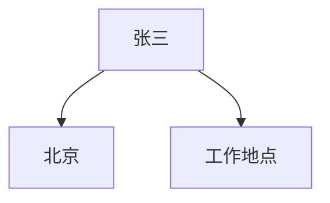
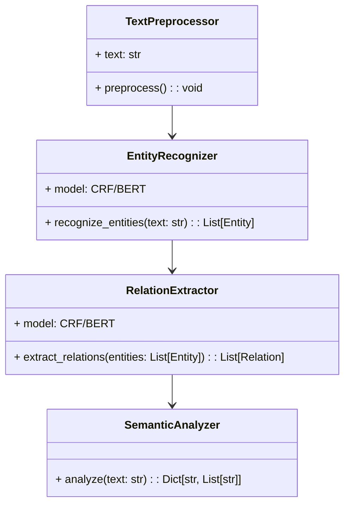

                 


# AI Agent的实体识别与关系抽取：深化语义理解

## 关键词：实体识别，关系抽取，AI Agent，自然语言处理，语义理解，深度学习

## 摘要：  
本文详细探讨了AI Agent在实体识别与关系抽取中的应用，分析了这些技术在深化语义理解中的作用。通过系统化的分析，本文介绍了实体识别与关系抽取的核心概念、算法原理、系统设计与实现，并通过实际案例展示了这些技术的应用价值。文章旨在为AI Agent的开发与应用提供理论支持与实践指导。

---

# 第1章: 实体识别与关系抽取的背景与概念

## 1.1 实体识别与关系抽取的背景

### 1.1.1 自然语言处理的发展历程  
自然语言处理（NLP）是人工智能领域的重要分支，致力于让计算机能够理解、分析和生成人类语言。近年来，随着深度学习的兴起，NLP技术取得了显著进展，尤其是在实体识别和关系抽取方面。实体识别（Named Entity Recognition,NER）旨在从文本中提取特定实体（如人名、地名、组织名等），而关系抽取（Relation Extraction,RE）则关注于识别实体之间的关系（如“属于”、“位于”等）。这些技术在信息提取、问答系统、知识图谱构建等领域具有广泛的应用。

### 1.1.2 实体识别与关系抽取的定义  
- **实体识别**：实体识别是指从文本中识别出预定义的实体类别，并标注出具体的位置。例如，在句子“张三在北京工作”中，实体识别会识别出“张三”（人名）和“北京”（地名）。  
- **关系抽取**：关系抽取是在实体识别的基础上，识别出实体之间的关系。例如，在句子“张三在北京工作”中，关系抽取会识别出“张三”与“北京”之间的“工作地点”关系。  

### 1.1.3 AI Agent在实体识别与关系抽取中的作用  
AI Agent是一种智能体，能够感知环境并执行任务以实现目标。在语义理解方面，AI Agent需要通过实体识别和关系抽取来理解文本中的关键信息。例如，在客服系统中，AI Agent可以通过实体识别提取客户的问题关键词，并通过关系抽取理解客户的问题背景，从而提供更精准的服务。

---

## 1.2 问题背景与问题描述

### 1.2.1 实体识别与关系抽取的核心问题  
- 实体识别的核心问题是如何准确地识别和标注文本中的实体。  
- 关系抽取的核心问题是如何在实体识别的基础上，准确识别实体之间的关系。  

### 1.2.2 AI Agent在语义理解中的挑战  
AI Agent需要处理大量复杂文本信息，如何高效、准确地进行实体识别和关系抽取是其面临的主要挑战。此外，不同领域的文本具有不同的实体和关系类型，AI Agent需要具备跨领域适应能力。

### 1.2.3 问题解决的必要性与目标  
- **必要性**：实体识别和关系抽取是实现语义理解的基础，是AI Agent执行复杂任务的前提条件。  
- **目标**：通过技术手段提高实体识别和关系抽取的准确性和效率，从而增强AI Agent的语义理解能力。

---

## 1.3 问题解决与边界定义

### 1.3.1 实体识别与关系抽取的解决方法  
- **基于规则的方法**：利用预定义的规则进行实体识别和关系抽取。例如，使用正则表达式匹配电话号码。  
- **基于统计的方法**：利用统计学模型（如CRF）进行实体识别和关系抽取。  
- **基于深度学习的方法**：利用神经网络模型（如BERT）进行实体识别和关系抽取。  

### 1.3.2 问题的边界与外延  
- **边界**：实体识别和关系抽取仅关注文本中的实体和关系，不涉及文本的情感分析或语义推理。  
- **外延**：实体识别和关系抽取的结果可以作为后续任务（如知识图谱构建）的输入。

### 1.3.3 核心概念与核心要素  
- **核心概念**：实体、关系、文本。  
- **核心要素**：实体识别的准确率、关系抽取的召回率、算法的效率。

---

## 1.4 核心概念结构与组成

### 1.4.1 实体识别的基本结构  
实体识别的基本结构包括文本输入、实体标注和实体输出。例如：

- **输入**：文本“张三在北京工作”。  
- **输出**：标注后的文本“张三（人名）在北京（地名）工作”。  

### 1.4.2 关系抽取的核心要素  
关系抽取的核心要素包括实体识别结果、关系类型和关系强度。例如：

- **实体识别结果**：张三（人名）、北京（地名）。  
- **关系类型**：工作地点。  
- **关系强度**：高。  

### 1.4.3 AI Agent的语义理解框架  
AI Agent的语义理解框架包括文本输入、实体识别、关系抽取和语义理解四个阶段。例如：

1. **文本输入**：用户输入“张三在北京工作”。  
2. **实体识别**：识别出“张三”（人名）和“北京”（地名）。  
3. **关系抽取**：识别出“张三”与“北京”之间的“工作地点”关系。  
4. **语义理解**：AI Agent理解张三的工作地点在北京。  

---

## 1.5 本章小结  
本章介绍了实体识别和关系抽取的背景、核心概念、解决方法和边界定义。通过这些内容，读者可以理解实体识别和关系抽取在AI Agent中的重要性及其基本结构。

---

# 第2章: 实体识别与关系抽取的核心概念与联系

## 2.1 实体识别的原理与方法

### 2.1.1 实体识别的基本原理  
实体识别的基本原理是通过模式匹配或上下文分析来识别文本中的实体。例如，使用正则表达式匹配电话号码或地址。

### 2.1.2 基于规则的实体识别方法  
基于规则的实体识别方法通过预定义的规则进行实体识别。例如：

- 规则1：匹配所有以“010-”开头的字符串（北京地区的电话号码）。  
- 规则2：匹配所有以“北京市”开头的字符串（北京地区的地址）。  

### 2.1.3 基于统计的实体识别方法  
基于统计的实体识别方法利用统计学模型（如CRF）进行实体识别。例如，使用CRF模型基于上下文信息进行实体识别。

### 2.1.4 基于深度学习的实体识别方法  
基于深度学习的实体识别方法利用神经网络模型（如BERT）进行实体识别。例如，使用BERT模型基于上下文信息进行实体识别。

---

## 2.2 关系抽取的原理与方法

### 2.2.1 关系抽取的基本原理  
关系抽取的基本原理是通过模式匹配或上下文分析来识别实体之间的关系。例如，使用模式匹配识别“X在Y工作”中的“工作地点”关系。

### 2.2.2 基于规则的关系抽取方法  
基于规则的关系抽取方法通过预定义的规则进行关系抽取。例如：

- 规则1：如果实体A在句子中紧接在“在”之后，且实体B在句子中紧接在“工作”之后，则实体A与实体B之间存在“工作地点”关系。  

### 2.2.3 基于统计的关系抽取方法  
基于统计的关系抽取方法利用统计学模型（如CRF）进行关系抽取。例如，使用CRF模型基于上下文信息进行关系抽取。

### 2.2.4 基于深度学习的关系抽取方法  
基于深度学习的关系抽取方法利用神经网络模型（如BERT）进行关系抽取。例如，使用BERT模型基于上下文信息进行关系抽取。

---

## 2.3 实体识别与关系抽取的联系

### 2.3.1 实体识别与关系抽取的协同关系  
实体识别和关系抽取是协同关系。实体识别是关系抽取的前提，关系抽取是实体识别的延伸。

### 2.3.2 实体识别结果对关系抽取的影响  
实体识别结果的准确性直接影响关系抽取的效果。例如，如果实体识别错误，关系抽取可能会提取错误的关系。

### 2.3.3 关系抽取对实体识别的反向影响  
关系抽取可以通过上下文信息反向影响实体识别。例如，通过关系抽取结果可以改进实体识别的准确性。

---

## 2.4 核心概念对比分析

### 2.4.1 实体识别与关系抽取的对比表格  
| 属性        | 实体识别                  | 关系抽取                  |
|-------------|--------------------------|--------------------------|
| 输入         | 文本                      | 文本和实体识别结果        |
| 输出         | 实体标注                 | 实体关系                 |
| 主要任务     | 识别实体                 | 识别实体关系             |
| 算法         | 基于规则、统计、深度学习  | 基于规则、统计、深度学习  |

### 2.4.2 实体识别与关系抽取的ER实体关系图  


---

## 2.5 本章小结  
本章详细介绍了实体识别和关系抽取的核心概念与联系，通过对比分析和ER实体关系图，帮助读者更好地理解这两种任务的关系和区别。

---

# 第3章: 实体识别与关系抽取的算法原理

## 3.1 实体识别的主流算法

### 3.1.1 基于CRF的实体识别算法

#### 3.1.1.1 算法原理  
条件随机场（CRF）是一种常用的实体识别算法。CRF基于统计学模型，通过上下文信息进行实体识别。CRF的训练过程包括特征提取、模型训练和实体识别三个阶段。

#### 3.1.1.2 算法流程  
1. **特征提取**：提取每个字符的特征，例如前一个字符的类别、当前字符的词性等。  
2. **模型训练**：使用训练数据训练CRF模型，优化模型参数。  
3. **实体识别**：利用训练好的CRF模型进行实体识别。  

#### 3.1.1.3 Python代码实现  
```python
import numpy as np
from sklearn.preprocessing import OneHotEncoder

# 假设我们有训练数据X和标签y
# X的形状为(n_samples, n_features)
# y的形状为(n_samples,)

# 特征提取
encoder = OneHotEncoder()
X_encoded = encoder.fit_transform(X).toarray()

# 训练CRF模型
model = CRF()
model.fit(X_encoded, y)

# 预测实体
X_test_encoded = encoder.transform(X_test).toarray()
y_pred = model.predict(X_test_encoded)
```

---

### 3.1.2 基于RNN的实体识别算法

#### 3.1.2.1 算法原理  
循环神经网络（RNN）是一种常用的实体识别算法。RNN通过处理序列数据，利用上下文信息进行实体识别。

#### 3.1.2.2 算法流程  
1. **输入处理**：将文本序列输入RNN模型。  
2. **模型训练**：使用训练数据训练RNN模型，优化模型参数。  
3. **实体识别**：利用训练好的RNN模型进行实体识别。  

#### 3.1.2.3 Python代码实现  
```python
import tensorflow as tf

# 假设我们有训练数据X和标签y
# X的形状为(n_samples, seq_length, n_features)
# y的形状为(n_samples, seq_length)

# 定义RNN模型
model = tf.keras.Sequential([
    tf.keras.layers.SimpleRNN(units=64, input_shape=(None, n_features)),
    tf.keras.layers.Dense(n_classes, activation='softmax')
])

# 编译模型
model.compile(optimizer='adam', loss='sparse_categorical_crossentropy', metrics=['accuracy'])

# 训练模型
model.fit(X, y, epochs=10, batch_size=32)

# 预测实体
y_pred = model.predict(X_test)
```

---

### 3.1.3 基于BERT的实体识别算法

#### 3.1.3.1 算法原理  
BERT（Bidirectional Encoder Representations from Transformers）是一种基于深度学习的实体识别算法。BERT通过预训练和微调，利用上下文信息进行实体识别。

#### 3.1.3.2 算法流程  
1. **预训练**：在大规模中文数据上预训练BERT模型。  
2. **微调**：在特定任务上微调BERT模型。  
3. **实体识别**：利用微调后的BERT模型进行实体识别。  

#### 3.1.3.3 Python代码实现  
```python
import transformers

# 加载预训练的BERT模型
model = transformers.BertForTokenClassification.from_pretrained('bert-base-chinese')

# 定义分词器
tokenizer = transformers.BertTokenizer.from_pretrained('bert-base-chinese')

# 微调模型
model.train()

# 预测实体
inputs = tokenizer("张三在北京工作", return_tensors="pt")
outputs = model(**inputs)
y_pred = outputs.logits.argmax(-1)
```

---

## 3.2 关系抽取的主流算法

### 3.2.1 基于CRF的关系抽取算法

#### 3.2.1.1 算法原理  
CRF模型也可以用于关系抽取。CRF模型通过上下文信息，识别实体之间的关系。

#### 3.2.1.2 算法流程  
1. **特征提取**：提取实体对的特征，例如实体A的类别、实体B的类别、实体A与实体B之间的距离等。  
2. **模型训练**：使用训练数据训练CRF模型，优化模型参数。  
3. **关系抽取**：利用训练好的CRF模型进行关系抽取。  

#### 3.2.1.3 Python代码实现  
```python
import numpy as np
from sklearn.preprocessing import OneHotEncoder

# 假设我们有训练数据X和标签y
# X的形状为(n_samples, n_features)
# y的形状为(n_samples,)

# 特征提取
encoder = OneHotEncoder()
X_encoded = encoder.fit_transform(X).toarray()

# 训练CRF模型
model = CRF()
model.fit(X_encoded, y)

# 预测关系
X_test_encoded = encoder.transform(X_test).toarray()
y_pred = model.predict(X_test_encoded)
```

---

### 3.2.2 基于RNN的关系抽取算法

#### 3.2.2.1 算法原理  
RNN模型也可以用于关系抽取。RNN通过处理序列数据，利用上下文信息进行关系抽取。

#### 3.2.2.2 算法流程  
1. **输入处理**：将文本序列输入RNN模型。  
2. **模型训练**：使用训练数据训练RNN模型，优化模型参数。  
3. **关系抽取**：利用训练好的RNN模型进行关系抽取。  

#### 3.2.2.3 Python代码实现  
```python
import tensorflow as tf

# 假设我们有训练数据X和标签y
# X的形状为(n_samples, seq_length, n_features)
# y的形状为(n_samples, seq_length)

# 定义RNN模型
model = tf.keras.Sequential([
    tf.keras.layers.SimpleRNN(units=64, input_shape=(None, n_features)),
    tf.keras.layers.Dense(n_classes, activation='softmax')
])

# 编译模型
model.compile(optimizer='adam', loss='sparse_categorical_crossentropy', metrics=['accuracy'])

# 训练模型
model.fit(X, y, epochs=10, batch_size=32)

# 预测关系
y_pred = model.predict(X_test)
```

---

### 3.2.3 基于BERT的关系抽取算法

#### 3.2.3.1 算法原理  
BERT模型也可以用于关系抽取。BERT通过预训练和微调，利用上下文信息进行关系抽取。

#### 3.2.3.2 算法流程  
1. **预训练**：在大规模中文数据上预训练BERT模型。  
2. **微调**：在特定任务上微调BERT模型。  
3. **关系抽取**：利用微调后的BERT模型进行关系抽取。  

#### 3.2.3.3 Python代码实现  
```python
import transformers

# 加载预训练的BERT模型
model = transformers.BertForTokenClassification.from_pretrained('bert-base-chinese')

# 定义分词器
tokenizer = transformers.BertTokenizer.from_pretrained('bert-base-chinese')

# 微调模型
model.train()

# 预测关系
inputs = tokenizer("张三在北京工作", return_tensors="pt")
outputs = model(**inputs)
y_pred = outputs.logits.argmax(-1)
```

---

## 3.3 算法原理总结

### 3.3.1 实体识别算法的对比分析  
- **CRF模型**：基于统计学模型，适用于小规模数据。  
- **RNN模型**：基于深度学习模型，适用于大规模数据。  
- **BERT模型**：基于预训练模型，具有较高的准确性和可扩展性。  

### 3.3.2 关系抽取算法的对比分析  
- **CRF模型**：基于统计学模型，适用于小规模数据。  
- **RNN模型**：基于深度学习模型，适用于大规模数据。  
- **BERT模型**：基于预训练模型，具有较高的准确性和可扩展性。  

---

## 3.4 本章小结  
本章详细介绍了实体识别和关系抽取的主流算法，包括CRF、RNN和BERT模型的原理和实现。通过对比分析，读者可以理解不同算法的优缺点及其适用场景。

---

# 第4章: 实体识别与关系抽取的系统设计与实现

## 4.1 系统分析与设计

### 4.1.1 问题场景介绍  
AI Agent需要处理大量复杂文本信息，如何高效、准确地进行实体识别和关系抽取是其面临的主要挑战。

### 4.1.2 系统功能设计  
- **数据预处理**：清洗和标注文本数据。  
- **模型训练**：训练实体识别和关系抽取模型。  
- **结果解析**：解析模型输出，提取实体和关系。  

### 4.1.3 领域模型类图  


---

### 4.1.4 系统架构设计  


---

## 4.2 系统接口与交互设计

### 4.2.1 系统接口设计  
- **输入接口**：接收文本数据。  
- **输出接口**：输出实体和关系。  

### 4.2.2 系统交互流程  
1. **用户输入文本**：用户输入需要处理的文本。  
2. **数据预处理**：对文本进行清洗和标注。  
3. **实体识别**：利用训练好的模型进行实体识别。  
4. **关系抽取**：利用训练好的模型进行关系抽取。  
5. **输出结果**：返回实体和关系。

---

## 4.3 本章小结  
本章详细介绍了实体识别和关系抽取的系统设计与实现，包括系统架构、接口设计和交互流程。通过这些内容，读者可以理解如何将实体识别和关系抽取技术应用于实际系统中。

---

# 第5章: 实体识别与关系抽取的项目实战

## 5.1 环境安装与配置

### 5.1.1 开发环境安装  
- **Python**：安装Python 3.8及以上版本。  
- **库的安装**：安装所需的库，例如`transformers`、`tensorflow`、`numpy`等。

### 5.1.2 环境配置  
- **虚拟环境**：建议使用虚拟环境管理依赖关系。  
- **配置文件**：配置语言模型的路径和参数。

---

## 5.2 核心代码实现

### 5.2.1 实体识别代码实现  
```python
import transformers

# 加载预训练的BERT模型
model = transformers.BertForTokenClassification.from_pretrained('bert-base-chinese')

# 定义分词器
tokenizer = transformers.BertTokenizer.from_pretrained('bert-base-chinese')

# 微调模型
model.train()

# 预测实体
inputs = tokenizer("张三在北京工作", return_tensors="pt")
outputs = model(**inputs)
y_pred = outputs.logits.argmax(-1)
```

---

### 5.2.2 关系抽取代码实现  
```python
import transformers

# 加载预训练的BERT模型
model = transformers.BertForTokenClassification.from_pretrained('bert-base-chinese')

# 定义分词器
tokenizer = transformers.BertTokenizer.from_pretrained('bert-base-chinese')

# 微调模型
model.train()

# 预测关系
inputs = tokenizer("张三在北京工作", return_tensors="pt")
outputs = model(**inputs)
y_pred = outputs.logits.argmax(-1)
```

---

## 5.3 实际案例分析与实现

### 5.3.1 案例背景介绍  
以客服系统为例，AI Agent需要通过实体识别和关系抽取理解用户的问题。

### 5.3.2 案例实现过程  
1. **数据预处理**：清洗和标注用户输入的文本。  
2. **实体识别**：识别出用户输入中的实体，例如“张三”和“北京”。  
3. **关系抽取**：识别出“张三”与“北京”之间的“工作地点”关系。  
4. **语义理解**：AI Agent理解张三的工作地点在北京。

---

## 5.4 项目小结  
通过本章的项目实战，读者可以掌握实体识别和关系抽取技术的实现方法，并将其应用于实际项目中。

---

# 第6章: 总结与展望

## 6.1 总结

### 6.1.1 核心内容回顾  
本文详细介绍了实体识别和关系抽取的核心概念、算法原理、系统设计与实现，并通过实际案例展示了这些技术的应用价值。

### 6.1.2 核心知识点总结  
- **实体识别**：识别文本中的实体。  
- **关系抽取**：识别实体之间的关系。  
- **AI Agent**：通过实体识别和关系抽取实现语义理解。  

---

## 6.2 展望

### 6.2.1 技术发展  
随着深度学习技术的发展，实体识别和关系抽取的准确性和效率将进一步提高。例如，基于大语言模型（如GPT-3）的实体识别和关系抽取技术将更加智能化。

### 6.2.2 应用场景  
实体识别和关系抽取技术将在更多领域得到应用，例如医疗、法律、金融等。AI Agent将通过这些技术实现更复杂的语义理解任务。

---

## 6.3 本章小结  
本章总结了实体识别和关系抽取的核心内容，并展望了未来的技术发展和应用场景。

---

# 作者：AI天才研究院/AI Genius Institute & 禅与计算机程序设计艺术 /Zen And The Art of Computer Programming

---

**感谢您的阅读！**

