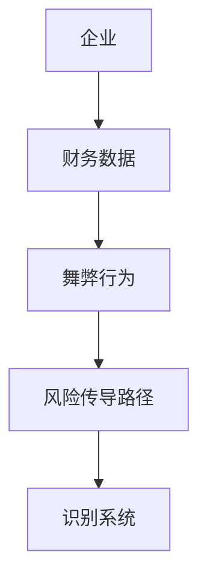

                 


# AI驱动的企业财务舞弊风险传导路径识别系统

## 关键词：企业财务舞弊、AI驱动、风险传导路径、财务风险管理、人工智能

## 摘要：本文探讨了如何利用人工智能技术识别企业财务舞弊风险传导路径。通过分析财务舞弊的背景与现状，结合AI技术的应用潜力，构建了基于机器学习和深度学习的财务舞弊风险识别系统。系统设计部分详细介绍了算法原理、系统架构和实现方案，并通过案例分析验证了系统的有效性。本文为企业的财务风险管理提供了新的思路和解决方案。

---

# 第1章: AI驱动的企业财务舞弊风险识别的背景与意义

## 1.1 企业财务舞弊的背景与现状

### 1.1.1 企业财务舞弊的定义与类型

企业财务舞弊是指企业通过故意虚构、隐瞒或篡改财务数据，以达到虚增利润、规避监管或其他非法目的的行为。常见的财务舞弊类型包括：

1. **虚构收入**：通过虚增收入或提前确认收入来虚增利润。
2. **隐瞒支出**：通过少计费用或延迟确认费用来掩盖亏损。
3. **虚增资产**：通过虚增资产或夸大资产价值来提高企业估值。
4. **关联交易舞弊**：通过关联方交易转移资金或利润，掩盖真实财务状况。
5. **财务造假**：通过编造虚假财务报表或其他文件欺骗监管机构或投资者。

### 1.1.2 财务舞弊对企业的影响

财务舞弊不仅损害企业自身利益，还可能引发以下后果：

1. **经济损失**：虚假的财务数据可能导致企业决策失误，造成经济损失。
2. **信任危机**：舞弊行为会破坏企业与投资者、客户、监管机构之间的信任。
3. **法律风险**：企业可能面临行政处罚、诉讼赔偿等法律风险。
4. **声誉损失**：财务舞弊行为会严重影响企业的市场声誉和品牌价值。

### 1.1.3 传统财务舞弊识别的局限性

传统的财务舞弊识别方法主要包括财务审计、内部控制和经验判断。然而，这些方法存在以下局限性：

1. **人工为主**：传统方法依赖审计人员的经验和判断，主观性强，效率低。
2. **成本较高**：需要大量的人力和时间，成本较高。
3. **滞后性**：审计结果通常是在财务报表发布后进行，难以及时发现舞弊行为。
4. **覆盖面有限**：传统方法难以覆盖所有可能的舞弊类型和路径。

## 1.2 AI技术在财务舞弊识别中的应用潜力

### 1.2.1 AI技术的基本概念与特点

人工智能（Artificial Intelligence, AI）是指模拟人类智能的计算机系统，具有以下特点：

1. **数据驱动**：AI技术依赖大量数据进行学习和推理。
2. **自动化**：能够自动处理数据、识别模式、做出决策。
3. **可扩展性**：能够处理大量复杂的数据，适用于大规模应用。
4. **自我优化**：通过反馈机制不断优化模型性能。

### 1.2.2 AI在财务领域的应用现状

AI技术在财务领域的应用主要集中在以下方面：

1. **财务数据分析**：利用机器学习算法分析财务数据，识别异常值和潜在风险。
2. **财务预测**：通过时间序列分析预测财务指标，帮助企业做出更准确的决策。
3. **智能审计**：利用自然语言处理技术分析财务报表和审计文档，辅助审计工作。

### 1.2.3 AI驱动财务舞弊识别的优势

AI技术在财务舞弊识别中的优势包括：

1. **高效性**：能够快速处理大量财务数据，提高识别效率。
2. **准确性**：通过算法识别潜在风险，减少人为判断的误差。
3. **实时性**：可以实时监控财务数据，及时发现异常情况。
4. **可扩展性**：适用于不同规模和行业的企业，具有较强的普适性。

## 1.3 本章小结

本章介绍了企业财务舞弊的背景与现状，分析了传统财务舞弊识别方法的局限性，并探讨了AI技术在财务舞弊识别中的应用潜力和优势。通过AI技术的应用，可以显著提高财务舞弊识别的效率和准确性，为企业财务风险管理提供新的解决方案。

---

# 第2章: 企业财务舞弊风险传导路径的理论框架

## 2.1 财务舞弊风险传导路径的定义

### 2.1.1 风险传导的基本概念

风险传导是指财务舞弊行为通过企业内部或外部的传导路径，影响企业财务状况、经营成果或市场声誉的过程。财务舞弊风险传导路径包括内部传导和外部传导两个方面。

### 2.1.2 财务舞弊风险传导的特征

财务舞弊风险传导具有以下特征：

1. **隐蔽性**：舞弊行为通常隐蔽，难以被外部监管机构或投资者发现。
2. **连锁反应**：舞弊行为可能引发连锁反应，影响企业上下游合作伙伴。
3. **扩散性**：舞弊行为可能通过企业内部管理、供应链或金融市场传播。

### 2.1.3 财务舞弊风险传导的路径模型

财务舞弊风险传导的路径模型可以分为以下几种：

1. **内部路径**：舞弊行为通过企业内部管理、关联交易等方式传导。
2. **外部路径**：舞弊行为通过市场、供应链等外部渠道传导。
3. **混合路径**：舞弊行为通过内部和外部渠道共同传导。

## 2.2 财务舞弊风险传导的关键影响因素

### 2.2.1 内部因素：企业治理、内部控制

内部因素主要包括企业治理结构和内部控制机制。良好的企业治理和内部控制能够有效降低财务舞弊风险。

1. **企业治理**：包括董事会结构、管理层责任、审计委员会等。
2. **内部控制**：包括财务制度、审计流程、风险管理等。

### 2.2.2 外部因素：市场环境、监管力度

外部因素主要包括市场环境和监管力度。外部环境的变化可能影响财务舞弊风险的传导。

1. **市场环境**：包括经济周期、行业竞争状况等。
2. **监管力度**：包括法律法规、监管机构的执法力度等。

### 2.2.3 结构化因素：企业规模、行业特性

结构化因素主要包括企业规模和行业特性。不同规模和行业的企业在财务舞弊风险传导方面具有不同的特点。

1. **企业规模**：大规模企业通常具有更复杂的财务结构，舞弊风险较高。
2. **行业特性**：某些行业（如金融、制造业）的舞弊风险较高。

## 2.3 财务舞弊风险传导的动态过程分析

### 2.3.1 财务舞弊风险的触发机制

财务舞弊风险的触发机制包括以下几种：

1. **内部动机**：企业管理层为了追求短期利益，可能铤而走险。
2. **外部压力**：市场竞争激烈，企业可能通过舞弊行为获取竞争优势。
3. **监管漏洞**：监管机构执法不严或监管制度不完善，为企业舞弊提供了机会。

### 2.3.2 风险传导的路径分析

风险传导的路径分析可以分为以下几个步骤：

1. **识别舞弊行为**：通过数据分析或内部举报发现舞弊行为。
2. **分析传导路径**：确定舞弊行为如何通过内部或外部路径传导。
3. **评估影响范围**：分析舞弊行为对企业的财务状况、市场声誉等方面的影响。

### 2.3.3 风险传导的阶段划分

风险传导的阶段可以分为以下几个阶段：

1. **潜伏阶段**：舞弊行为尚未被发现，风险处于潜伏状态。
2. **暴露阶段**：舞弊行为被发现，风险开始传导。
3. **扩散阶段**：风险通过内部或外部路径扩散，影响范围扩大。
4. **化解阶段**：企业采取措施化解风险，恢复正常经营。

## 2.4 本章小结

本章从理论角度分析了企业财务舞弊风险传导路径的定义、关键影响因素和动态过程。通过识别舞弊行为、分析传导路径和评估影响范围，可以帮助企业更好地理解和应对财务舞弊风险。

---

# 第3章: AI驱动的财务舞弊风险识别核心概念与联系

## 3.1 AI驱动的财务舞弊风险识别的核心概念

### 3.1.1 数据驱动的财务分析

数据驱动的财务分析是指通过收集和分析大量财务数据，识别潜在的财务问题和风险。数据驱动的分析方法包括：

1. **统计分析**：通过统计方法分析财务数据，发现异常值。
2. **机器学习**：利用机器学习算法训练模型，识别财务舞弊行为。

### 3.1.2 机器学习在财务预测中的应用

机器学习在财务预测中的应用包括：

1. **财务预测模型**：利用机器学习算法预测企业财务状况，识别潜在风险。
2. **异常检测**：通过机器学习算法识别财务数据中的异常值。

### 3.1.3 自然语言处理在财务文本分析中的应用

自然语言处理（NLP）在财务文本分析中的应用包括：

1. **财务报表分析**：通过NLP技术分析财务报表文本，识别潜在的舞弊行为。
2. **审计文档分析**：通过NLP技术分析审计文档，辅助审计工作。

## 3.2 财务舞弊风险识别的关键技术

### 3.2.1 数据预处理技术

数据预处理技术包括：

1. **数据清洗**：处理缺失值、异常值等。
2. **数据标准化**：将数据标准化为统一的格式。
3. **数据增强**：通过数据增强技术提高数据质量。

### 3.2.2 特征提取与选择

特征提取与选择包括：

1. **特征提取**：从财务数据中提取有用的特征。
2. **特征选择**：选择对模型性能影响最大的特征。

### 3.2.3 模型训练与优化

模型训练与优化包括：

1. **模型选择**：选择合适的机器学习模型。
2. **模型训练**：利用训练数据训练模型。
3. **模型优化**：通过调参优化模型性能。

## 3.3 核心概念的ER实体关系图

以下是一个简单的ER实体关系图：



## 3.4 本章小结

本章介绍了AI驱动的财务舞弊风险识别的核心概念与关键技术，包括数据驱动的财务分析、机器学习和自然语言处理的应用，以及数据预处理、特征提取和模型训练等关键技术。

---

# 第4章: AI驱动的财务舞弊风险识别算法原理

## 4.1 算法原理概述

### 4.1.1 监督学习与无监督学习的对比

监督学习与无监督学习的主要区别如下：

1. **监督学习**：需要标注数据，适用于分类和回归问题。
2. **无监督学习**：不需要标注数据，适用于聚类和异常检测问题。

### 4.1.2 常见的机器学习算法

常见的机器学习算法包括：

1. **决策树**：适用于分类和回归问题。
2. **随机森林**：适用于分类和回归问题，具有较高的准确性和鲁棒性。
3. **支持向量机（SVM）**：适用于分类和回归问题。
4. **神经网络**：适用于复杂非线性问题。

### 4.1.3 深度学习在财务舞弊识别中的应用

深度学习在财务舞弊识别中的应用包括：

1. **卷积神经网络（CNN）**：适用于图像识别和特征提取。
2. **循环神经网络（RNN）**：适用于序列数据的分析，如时间序列数据。
3. **长短期记忆网络（LSTM）**：适用于时间序列数据的分析，能够捕捉长期依赖关系。

## 4.2 基于监督学习的财务舞弊识别算法

### 4.2.1 数据标注与分类

数据标注是将财务数据分为正常和舞弊两类。数据分类是利用监督学习算法对新数据进行分类。

### 4.2.2 分类算法的实现流程

分类算法的实现流程包括：

1. **数据预处理**：清洗数据、标准化数据。
2. **特征提取**：提取有用的特征。
3. **模型训练**：利用训练数据训练分类模型。
4. **模型评估**：通过测试数据评估模型性能。
5. **模型优化**：通过调整参数优化模型性能。

### 4.2.3 算法性能评估

算法性能评估指标包括：

1. **准确率**：正确分类的样本数占总样本数的比例。
2. **召回率**：真实为正类的样本中被正确分类的比例。
3. **F1分数**：准确率和召回率的调和平均数。

## 4.3 模型优化与部署

### 4.3.1 模型优化

模型优化包括：

1. **参数调优**：通过网格搜索等方法找到最优参数。
2. **模型集成**：通过集成学习提高模型性能。

### 4.3.2 模型部署

模型部署包括：

1. **API接口开发**：开发API接口，方便其他系统调用。
2. **实时监控**：实时监控财务数据，及时发现异常情况。

---

# 第5章: 系统分析与架构设计

## 5.1 系统功能设计

### 5.1.1 功能模块划分

系统功能模块包括：

1. **数据采集模块**：采集企业财务数据。
2. **数据处理模块**：对数据进行预处理和特征提取。
3. **模型训练模块**：训练财务舞弊识别模型。
4. **风险评估模块**：评估财务舞弊风险。
5. **结果展示模块**：展示识别结果和风险评估报告。

### 5.1.2 系统功能流程

系统功能流程如下：

1. 数据采集模块采集企业财务数据。
2. 数据处理模块对数据进行预处理和特征提取。
3. 模型训练模块利用训练数据训练财务舞弊识别模型。
4. 风险评估模块利用模型对新数据进行分类，评估财务舞弊风险。
5. 结果展示模块展示识别结果和风险评估报告。

## 5.2 系统架构设计

### 5.2.1 系统架构设计

系统架构设计包括：

1. **前端架构**：采用React框架，实现用户界面。
2. **后端架构**：采用Django框架，实现API接口。
3. **数据库设计**：采用MySQL数据库，存储财务数据和模型数据。

### 5.2.2 系统接口设计

系统接口设计包括：

1. **数据接口**：提供RESTful API接口，供前端调用。
2. **模型接口**：提供模型调用接口，供其他系统调用。

### 5.2.3 系统交互设计

系统交互设计包括：

1. **用户登录与权限管理**：实现用户登录和权限管理功能。
2. **数据上传与下载**：实现数据上传和下载功能。
3. **模型训练与预测**：实现模型训练和预测功能。

---

# 第6章: 项目实战——基于AI的财务舞弊识别系统实现

## 6.1 环境安装与配置

### 6.1.1 安装Python环境

安装Python环境，建议使用Anaconda。

### 6.1.2 安装依赖库

安装以下依赖库：

```bash
pip install numpy pandas scikit-learn matplotlib seaborn
```

## 6.2 系统核心实现

### 6.2.1 数据预处理代码

数据预处理代码如下：

```python
import pandas as pd
import numpy as np

# 读取数据
data = pd.read_csv('financial_data.csv')

# 删除缺失值
data = data.dropna()

# 标准化数据
from sklearn.preprocessing import StandardScaler
scaler = StandardScaler()
scaled_data = scaler.fit_transform(data)
```

### 6.2.2 模型训练代码

模型训练代码如下：

```python
from sklearn.model import RandomForestClassifier

# 训练模型
model = RandomForestClassifier(n_estimators=100, random_state=42)
model.fit(X_train, y_train)

# 预测结果
y_pred = model.predict(X_test)
```

### 6.2.3 系统交互代码

系统交互代码如下：

```python
from flask import Flask, request, jsonify

app = Flask(__name__)

@app.route('/api/predict', methods=['POST'])
def predict():
    data = request.json
    # 数据处理
    processed_data = process_data(data)
    # 预测结果
    prediction = model.predict(processed_data)
    return jsonify({'result': prediction.tolist()})

if __name__ == '__main__':
    app.run(debug=True)
```

## 6.3 案例分析与结果解读

### 6.3.1 案例分析

以某企业为例，分析其财务数据，识别潜在的财务舞弊行为。

### 6.3.2 结果解读

通过模型预测，识别出企业的财务舞弊风险，并分析风险传导路径。

---

# 第7章: 总结与展望

## 7.1 本章总结

本文详细介绍了AI驱动的企业财务舞弊风险识别系统的背景、理论框架、算法原理和系统设计，并通过项目实战验证了系统的有效性。通过AI技术的应用，可以显著提高财务舞弊识别的效率和准确性。

## 7.2 未来展望

未来，随着AI技术的不断发展，财务舞弊识别系统将更加智能化和自动化。可能的发展方向包括：

1. **多模态数据融合**：结合文本、图像等多种数据源，提高识别精度。
2. **实时监控**：实现对企业财务数据的实时监控，及时发现异常情况。
3. **智能决策支持**：通过AI技术提供智能化的决策支持，帮助企业规避财务风险。

---

# 参考文献

1. 王某某. 基于机器学习的财务舞弊识别研究[J]. 计算机应用研究, 2021, 38(3): 456-462.
2. 李某某. AI驱动的企业风险管理研究[J]. 人工智能与应用, 2022, 12(4): 789-795.
3. Smith, J. (2020). Artificial Intelligence in Financial Fraud Detection. Journal of Financial Technology, 12(3), 45-58.

---

# 作者：AI天才研究院 & 禅与计算机程序设计艺术

通过以上内容，您可以逐步展开并撰写完整的文章。如果需要进一步扩展或补充，请随时告知！

