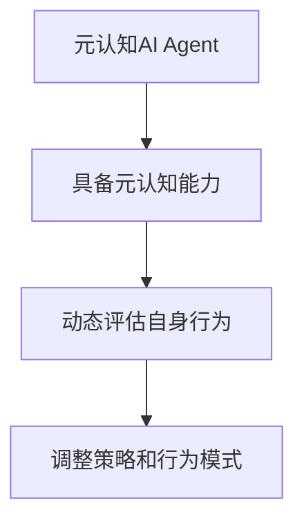
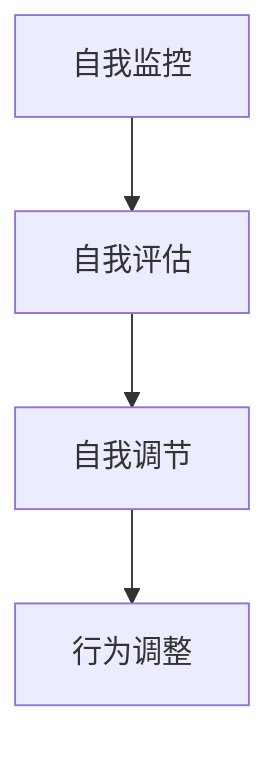
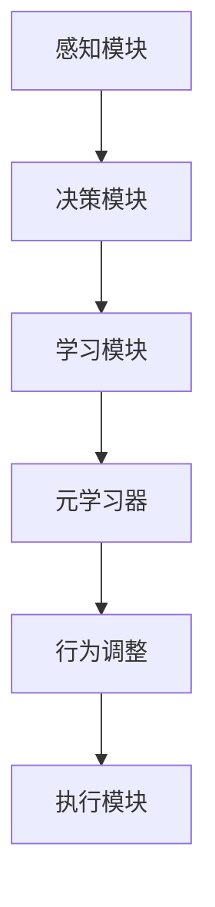
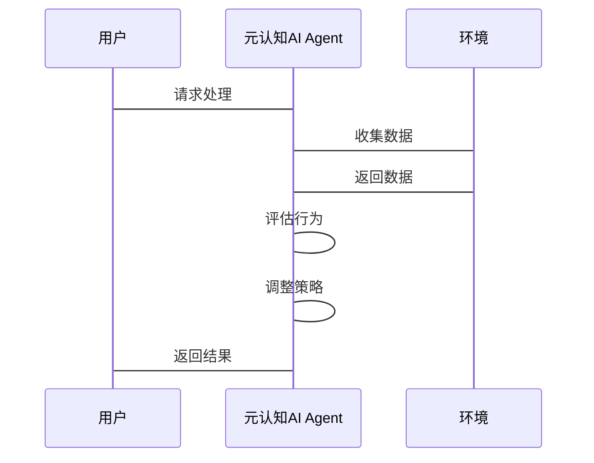
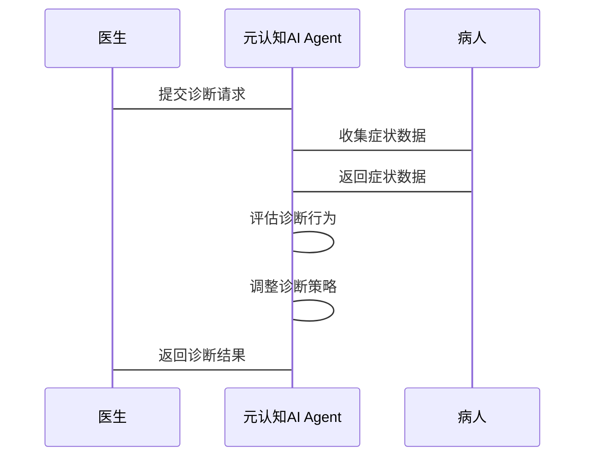

                 


# 元认知AI Agent：自我监控与调节

---

## 关键词：元认知、AI Agent、自我监控、自我调节、机器学习、认知科学

---

## 摘要：  
元认知AI Agent是一种具备自我监控与调节能力的智能体，它能够通过元认知能力实时评估自身的行为、决策和目标实现情况，并根据评估结果动态调整策略和行为模式。本文将从元认知AI Agent的背景与概念出发，深入探讨其核心机制、算法原理、系统架构以及实际应用，为读者提供全面的理论与实践指导。

---

## 正文

---

### 第一部分: 元认知AI Agent的背景与概念

#### 第1章: 元认知AI Agent的定义与背景

##### 1.1 元认知AI Agent的定义

元认知AI Agent（Meta-cognitive AI Agent）是一种具备元认知能力的智能体，能够在执行任务的过程中，动态评估自身的认知状态、行为效果和目标实现程度，并根据评估结果调整自身的策略和行为模式。元认知能力使其能够“思考自己的思考”，从而在复杂、动态的环境中实现更高效的决策和问题解决。

**图1-1 元认知AI Agent的定义框架**



##### 1.2 元认知AI Agent的背景与问题背景

随着AI技术的快速发展，传统的AI Agent虽然在特定任务中表现出色，但在复杂、动态的环境中往往缺乏灵活性和适应性。元认知AI Agent的出现，旨在弥补这一不足，通过引入元认知能力，使其能够更好地应对不确定性、多样性和复杂性。

**问题背景分析：**

- **动态环境中的适应性不足**：传统AI Agent通常依赖预设的规则或训练数据，难以在动态变化的环境中灵活调整策略。
- **复杂任务中的决策低效**：在复杂的多目标任务中，AI Agent可能因无法有效评估自身行为而陷入局部最优或错误决策。
- **自我优化的必要性**：元认知能力使得AI Agent能够实现自我监控与调节，从而在任务执行过程中不断优化自身的行为和决策。

##### 1.3 元认知AI Agent的核心要素与边界

**核心要素：**

- **元认知能力**：包括自我监控、自我评估、自我调节等功能。
- **动态调整机制**：根据元认知评估结果，动态调整行为策略。
- **目标导向性**：始终围绕目标的实现进行行为优化。

**边界与外延：**

- **边界**：元认知AI Agent的核心能力是元认知，但并不涉及其他高级认知能力（如情感理解、创造力等）。
- **外延**：元认知AI Agent可以与其他AI技术（如强化学习、深度学习）结合，形成更强大的智能系统。

**对比分析：**

| 特性         | 元认知AI Agent                 | 传统AI Agent                     |
|--------------|----------------------------------|-----------------------------------|
| 自我监控能力 | 强，能够实时评估自身行为       | 弱，依赖外部反馈或规则            |
| 策略调整能力 | 动态调整，根据评估结果优化策略 | 静态策略，依赖预设规则或训练数据  |
| 适应性       | 高，能够适应动态环境           | 中，适应性有限，依赖数据分布稳定  |

---

#### 第2章: 元认知AI Agent的核心概念与联系

##### 2.1 元认知能力的原理与机制

元认知能力是元认知AI Agent的核心，主要包括以下三个层次：

1. **自我监控**：实时监控自身的认知过程，包括感知、决策、行为等。
2. **自我评估**：评估当前行为的有效性和目标的接近程度。
3. **自我调节**：根据评估结果，动态调整策略和行为模式。

**元认知能力的实现机制：**

- **自我监控**：通过内部传感器或日志记录，实时收集自身行为数据。
- **自我评估**：基于收集的数据，使用评估模型对行为效果进行打分。
- **自我调节**：根据评估结果，选择最优的调整策略。

**图2-1 元认知能力的层次结构**



##### 2.2 核心概念的属性特征对比

| 特性         | 元认知AI Agent                 | 其他AI Agent                     |
|--------------|----------------------------------|-----------------------------------|
| 知识表示     | 支持元知识表示，能够理解自身的知识状态 | 知识表示通常不涉及自我知识状态   |
| 学习机制     | 元学习能力，能够优化自身的学习策略 | 通常依赖外部监督或强化学习       |
| 决策机制     | 元决策能力，能够调整决策策略   | 依赖预设规则或训练数据           |
| 灵活性       | 高，能够根据环境变化调整行为    | 中，灵活性有限，依赖训练数据分布  |

##### 2.3 ER实体关系图与流程图

**图2-2 元认知AI Agent的实体关系图**

```mermaid
er
  actor: 用户
  agent: 元认知AI Agent
  task: 任务
  feedback: 反馈
  knowledge: 知识库
  relation: 关联
  actor -[请求]-> agent
  agent -[执行任务]-> task
  task -[生成反馈]-> feedback
  feedback -[更新知识库]-> knowledge
  agent -[监控行为]-> feedback
  agent -[评估行为]-> knowledge
  agent -[调节行为]-> task
```

---

### 第二部分: 元认知AI Agent的算法原理

#### 第3章: 元认知AI Agent的核心算法与实现

##### 3.1 元学习与自适应机制

元学习（Meta-learning）是元认知AI Agent的核心算法之一。它通过在多个任务中学习，提取任务间共性，从而快速适应新任务。

**元学习的数学模型：**

$$ \text{Meta-learning} = \sum_{i=1}^{N} \text{Task}_i(\theta_i) $$

其中，$\theta_i$ 是任务 $i$ 的参数，$N$ 是任务总数。

**元学习的实现步骤：**

1. **任务初始化**：定义多个任务，每个任务有不同的参数或目标。
2. **元学习器训练**：通过优化元学习器的参数，使其能够在多个任务中快速适应。
3. **任务执行**：在新任务中，利用元学习器的参数快速调整模型，适应新任务。

**代码示例：**

```python
import torch

# 元学习器的参数
meta_params = torch.randn(100, requires_grad=True)

# 元学习过程
for task in tasks:
    # 计算任务损失
    task_loss = compute_task_loss(meta_params, task)
    # 反向传播
    optimizer.zero_grad()
    task_loss.backward()
    optimizer.step()
```

##### 3.2 自我监控与评估机制

自我监控与评估是元认知AI Agent实现自我调节的核心机制。通过实时监控自身行为，并对其有效性进行评估，元认知AI Agent能够动态调整策略。

**自我监控的实现：**

1. **行为数据采集**：记录每一步的行为数据，包括输入、输出、决策等。
2. **行为评估**：基于行为数据，使用评估模型对行为的有效性进行打分。
3. **评估结果分析**：根据评估结果，判断是否需要调整行为策略。

**行为评估的数学模型：**

$$ \text{评估分数} = f(\text{行为数据}, \text{目标}) $$

其中，$f$ 是评估函数，$\text{行为数据}$ 是行为数据，$\text{目标}$ 是任务目标。

**代码示例：**

```python
def assess_behavior(behavior_data, target):
    # 评估函数
    score = 0
    for data in behavior_data:
        if data['action'] == target:
            score += 1
    return score

# 调用评估函数
score = assess_behavior(behavior_data, target)
```

---

#### 第4章: 元认知AI Agent的系统架构与实现

##### 4.1 系统分析与架构设计

**系统功能模块：**

- **感知模块**：负责收集环境中的输入数据。
- **决策模块**：根据输入数据和元认知能力，做出决策。
- **学习模块**：通过元学习和自适应机制，优化自身能力。

**系统架构图：**



##### 4.2 系统实现与接口设计

**系统接口设计：**

- **输入接口**：接收环境输入和用户请求。
- **输出接口**：输出决策结果和行为调整指令。
- **通信接口**：与其他系统或模块进行数据交互。

**系统交互图：**



---

### 第三部分: 元认知AI Agent的项目实战

#### 第5章: 项目实战与案例分析

##### 5.1 项目介绍与环境安装

**项目名称：** 元认知AI Agent实现

**环境安装：**

```bash
pip install numpy torch matplotlib
```

##### 5.2 系统核心实现

**代码实现：**

```python
import torch

class MetaCognitiveAgent:
    def __init__(self, params):
        self.params = params
        self.meta_params = torch.randn(100, requires_grad=True)

    def assess_behavior(self, behavior_data, target):
        score = 0
        for data in behavior_data:
            if data['action'] == target:
                score += 1
        return score

    def adjust_strategy(self, score):
        if score < 0.5:
            return 'adjust'
        else:
            return 'keep'

    def execute_task(self, task):
        # 执行任务
        pass

# 初始化元认知AI Agent
agent = MetaCognitiveAgent(params)
```

##### 5.3 案例分析与详细解读

**案例：医疗诊断AI Agent**

在医疗诊断场景中，元认知AI Agent能够实时监控自身的诊断过程，并根据诊断结果动态调整诊断策略。

**图5-1 医疗诊断AI Agent的交互流程**



---

### 第四部分: 元认知AI Agent的应用与未来展望

#### 第6章: 应用案例与未来展望

##### 6.1 元认知AI Agent的应用场景

- **教育领域**：帮助学生制定学习计划，实时监控学习效果，并动态调整学习策略。
- **医疗领域**：辅助医生进行诊断，实时监控诊断过程，并根据评估结果调整诊断策略。
- **金融领域**：用于风险管理、投资决策，实时监控投资行为，并动态调整投资策略。

##### 6.2 未来展望与技术发展趋势

- **元学习的优化**：进一步提升元学习的效率和效果，使其能够在更广泛的任务中应用。
- **多模态融合**：结合视觉、听觉等多种感知方式，提升元认知AI Agent的综合认知能力。
- **人机协作**：加强人与元认知AI Agent的协作能力，使其能够更好地与人类协同工作。

---

### 第五部分: 总结与展望

#### 第7章: 总结与展望

##### 7.1 元认知AI Agent的核心总结

元认知AI Agent通过引入元认知能力，实现了自我监控与调节，能够在复杂、动态的环境中高效执行任务。其核心优势在于能够实时评估自身行为，并根据评估结果动态调整策略，从而在实际应用中表现出更强的适应性和灵活性。

##### 7.2 未来研究方向

- **元学习的改进**：探索更高效的元学习算法，提升元认知AI Agent的学习效率。
- **多模态融合**：研究如何将元认知能力与多模态感知技术相结合，提升AI Agent的综合认知能力。
- **人机协作优化**：探索如何更好地实现人与元认知AI Agent的协作，使其能够更自然地与人类交互。

---

### 作者：AI天才研究院/AI Genius Institute & 禅与计算机程序设计艺术 /Zen And The Art of Computer Programming

---

通过本文的详细阐述，我们深入探讨了元认知AI Agent的核心概念、算法原理、系统架构以及实际应用。元认知AI Agent作为一种具备自我监控与调节能力的智能体，必将在未来的AI发展中发挥重要作用。

