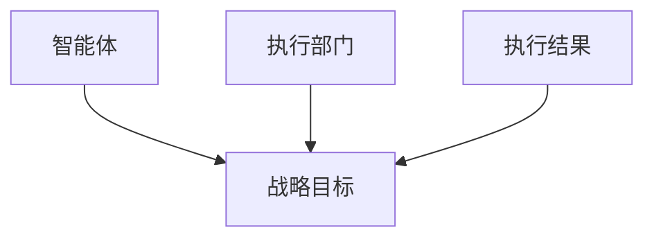
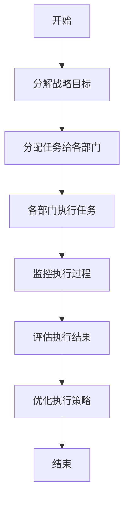
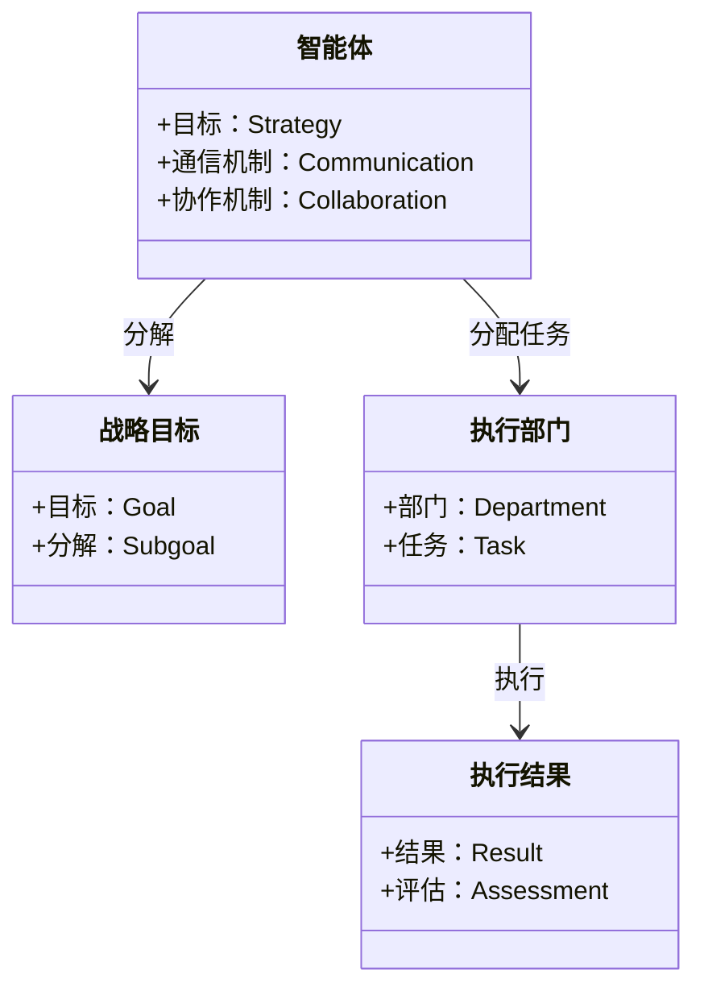
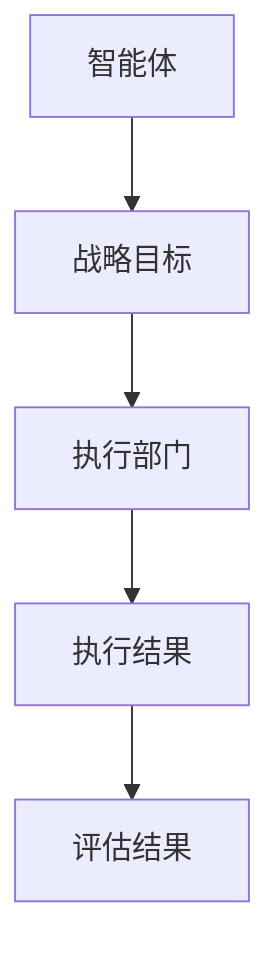
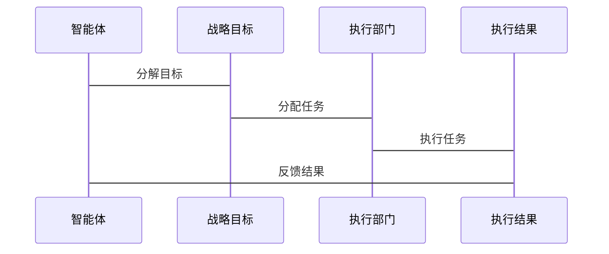

                 


# 基于多智能体的自动化公司战略执行力评估

## 关键词：
- 多智能体系统
- 战略执行力评估
- 自动化评估
- 系统架构设计
- 人工智能

## 摘要：
本文探讨了基于多智能体系统的公司战略执行力自动化评估方法。通过分析多智能体系统的核心原理，结合战略执行力评估的指标体系，提出了一种创新的解决方案。本文详细阐述了多智能体系统在战略执行中的应用，设计了系统的架构，提供了具体的实现方法，并通过案例分析验证了方案的有效性。

---

## 第1章: 多智能体系统与战略执行力评估的背景

### 1.1 问题背景
#### 1.1.1 企业战略执行力的重要性
企业在竞争激烈的市场中，战略执行力是决定企业成功与否的关键因素。战略执行力是指企业将战略目标转化为具体行动并实现目标的能力。然而，传统的战略执行力评估方法存在主观性高、缺乏动态性、难以量化等问题，难以满足现代企业的需求。

#### 1.1.2 现有战略执行力评估的局限性
现有方法主要依赖于人工评估，存在以下问题：
1. 评估结果主观性高，缺乏客观依据。
2. 评估过程耗时长，难以实时反馈。
3. 评估指标单一，难以全面反映执行情况。

#### 1.1.3 多智能体系统的优势
多智能体系统（Multi-Agent System, MAS）是一种分布式人工智能系统，由多个智能体组成，每个智能体具有一定的自主性和协作能力。MAS具有以下优势：
1. 分布式计算能力，能够处理复杂问题。
2. 高度协作，能够协调不同部门的工作。
3. 实时反馈，能够动态调整执行策略。

### 1.2 问题描述
#### 1.2.1 战略执行力评估的核心要素
战略执行力评估需要考虑以下核心要素：
1. 战略目标的分解与分配。
2. 各部门的执行能力。
3. 执行过程中的协作与沟通。
4. 执行结果的反馈与优化。

#### 1.2.2 多智能体系统在战略执行中的应用场景
多智能体系统可以应用于以下场景：
1. 战略目标的分解与分配。
2. 各部门之间的协作与沟通。
3. 执行过程的监控与反馈。
4. 动态调整执行策略。

#### 1.2.3 问题解决的必要性
通过引入多智能体系统，可以解决传统战略执行力评估中的以下问题：
1. 评估结果的主观性问题。
2. 评估过程的耗时问题。
3. 评估指标的单一性问题。

### 1.3 问题解决
#### 1.3.1 多智能体系统如何提升战略执行力
多智能体系统通过以下方式提升战略执行力：
1. 实现战略目标的分解与分配。
2. 协调各部门的执行过程。
3. 实时监控执行结果并动态调整策略。

#### 1.3.2 关键技术的选择与实现
关键技术包括：
1. 多智能体系统的通信机制。
2. 分布式计算与协作算法。
3. 动态反馈与优化算法。

#### 1.3.3 解决方案的边界与外延
解决方案的边界包括：
1. 系统仅用于战略执行力评估。
2. 系统不涉及企业的具体业务操作。
3. 系统仅提供评估结果和优化建议。

### 1.4 概念结构与核心要素
#### 1.4.1 多智能体系统的基本构成
多智能体系统由以下基本构成：
1. 智能体：具有自主性、反应性、协作性的智能实体。
2. 通信机制：智能体之间进行信息交换的通道。
3. 协作机制：智能体之间的协作规则和协议。

#### 1.4.2 战略执行力评估的指标体系
战略执行力评估的指标体系包括：
1. 战略目标的分解与实现情况。
2. 各部门的执行能力。
3. 执行过程中的协作效率。
4. 执行结果的反馈与优化。

#### 1.4.3 核心要素的相互关系
核心要素之间的相互关系如下：
1. 战略目标的分解是评估的基础。
2. 各部门的执行能力是评估的关键。
3. 协作效率是评估的重要指标。
4. 反馈与优化是评估的核心环节。

---

## 第2章: 多智能体系统与战略执行力评估的核心概念

### 2.1 多智能体系统原理
#### 2.1.1 多智能体系统的定义
多智能体系统是由多个智能体组成的分布式系统，每个智能体具有自主性、反应性和协作性。

#### 2.1.2 多智能体系统的特征
多智能体系统的特征包括：
1. 分布式计算能力。
2. 高度协作性。
3. 动态适应性。

#### 2.1.3 多智能体系统的分类
多智能体系统可以分为：
1. 协作型多智能体系统。
2. 对抗型多智能体系统。
3. 组织型多智能体系统。

### 2.2 战略执行力评估的原理
#### 2.2.1 战略执行力的定义
战略执行力是指企业将战略目标转化为具体行动并实现目标的能力。

#### 2.2.2 战略执行力评估的指标体系
战略执行力评估的指标体系包括：
1. 战略目标的分解与实现情况。
2. 各部门的执行能力。
3. 执行过程中的协作效率。
4. 执行结果的反馈与优化。

#### 2.2.3 战略执行力评估的方法
战略执行力评估的方法包括：
1. 定性评估。
2. 定量评估。
3. 综合评估。

### 2.3 多智能体系统与战略执行力评估的对比分析
#### 2.3.1 多智能体系统在战略执行中的应用
多智能体系统在战略执行中的应用包括：
1. 战略目标的分解与分配。
2. 各部门之间的协作与沟通。
3. 执行过程的监控与反馈。

#### 2.3.2 战略执行力评估对多智能体系统的影响
战略执行力评估对多智能体系统的影响包括：
1. 提供了优化执行策略的方向。
2. 为智能体的协作提供了指导。
3. 为系统的动态调整提供了依据。

#### 2.3.3 两者的结合与优化
多智能体系统与战略执行力评估的结合与优化包括：
1. 实现战略目标的分解与分配。
2. 协调各部门的执行过程。
3. 实时监控执行结果并动态调整策略。

---

## 第3章: 多智能体系统与战略执行力评估的核心概念

### 3.1 多智能体系统的核心概念
#### 3.1.1 多智能体系统的组成
多智能体系统的组成包括：
1. 智能体。
2. 通信机制。
3. 协作机制。

#### 3.1.2 多智能体系统的通信机制
多智能体系统的通信机制包括：
1. 信息交换协议。
2. 通信通道。
3. 信息格式。

#### 3.1.3 多智能体系统的协调与协作
多智能体系统的协调与协作包括：
1. 协作规则。
2. 协作协议。
3. 协作策略。

### 3.2 战略执行力评估的核心概念
#### 3.2.1 战略目标的分解
战略目标的分解包括：
1. 目标分解的层次。
2. 目标分解的方法。
3. 目标分解的工具。

#### 3.2.2 执行过程的监控
执行过程的监控包括：
1. 监控指标。
2. 监控方法。
3. 监控工具。

#### 3.2.3 执行结果的评估
执行结果的评估包括：
1. 评估指标。
2. 评估方法。
3. 评估工具。

### 3.3 多智能体系统与战略执行力评估的对比分析
#### 3.3.1 核心概念对比
核心概念对比包括：
1. 多智能体系统的智能体与战略执行力评估的执行部门。
2. 多智能体系统的通信机制与战略执行力评估的沟通机制。
3. 多智能体系统的协作机制与战略执行力评估的协作过程。

#### 3.3.2 功能特点对比
功能特点对比包括：
1. 多智能体系统的分布式计算能力。
2. 战略执行力评估的指标体系。
3. 两者的结合与优化。

#### 3.3.3 应用场景对比
应用场景对比包括：
1. 多智能体系统在战略执行中的应用。
2. 战略执行力评估在多智能体系统中的应用。
3. 两者的结合应用场景。

---

## 第4章: 多智能体系统与战略执行力评估的实体关系图

### 4.1 实体关系图的构建
#### 4.1.1 实体定义
实体包括：
1. 智能体。
2. 战略目标。
3. 执行部门。
4. 执行结果。

#### 4.1.2 实体关系
实体关系包括：
1. 智能体与战略目标的关系。
2. 执行部门与战略目标的关系。
3. 执行结果与战略目标的关系。

#### 4.1.3 实体关系图的绘制
使用Mermaid绘制实体关系图：



---

## 第5章: 算法原理

### 5.1 算法原理概述
多智能体系统的算法原理包括：
1. 分布式计算算法。
2. 协作算法。
3. 动态反馈与优化算法。

### 5.2 算法流程
#### 5.2.1 算法流程图
使用Mermaid绘制算法流程图：



#### 5.2.2 算法实现
以下是算法的Python代码实现：

```python
def decompose_strategy(strategy):
    # 分解战略目标
    subgoals = []
    for goal in strategy:
        subgoals.append(goal.decompose())
    return subgoals

def distribute_tasks(subgoals, departments):
    # 分配任务给各部门
    task_distribution = {}
    for department in departments:
        assigned_goals = []
        for goal in subgoals:
            if department.can_execute(goal):
                assigned_goals.append(goal)
        task_distribution[department] = assigned_goals
    return task_distribution

def execute_tasks(task_distribution):
    # 各部门执行任务
    execution_results = {}
    for department, goals in task_distribution.items():
        results = []
        for goal in goals:
            results.append(department.execute(goal))
        execution_results[department] = results
    return execution_results

def monitor_execution(execution_results):
    # 监控执行过程
    monitoring_report = {}
    for department, results in execution_results.items():
        status = "成功"
        for result in results:
            if not result:
                status = "失败"
                break
        monitoring_report[department] = status
    return monitoring_report

def assess_execution(monitoring_report):
    # 评估执行结果
    assessment = {}
    for department, status in monitoring_report.items():
        if status == "成功":
            assessment[department] = 1
        else:
            assessment[department] = 0
    return assessment

def optimize_strategy(assessment):
    # 优化执行策略
    optimization_plan = {}
    for department, score in assessment.items():
        if score == 0:
            optimization_plan[department] = [
                "重新分配任务",
                "提供额外支持",
                "调整执行策略"
            ]
        else:
            optimization_plan[department] = "继续执行"
    return optimization_plan
```

#### 5.2.3 数学模型与公式
以下是算法的数学模型：

$$
\text{评估结果} = \sum_{i=1}^{n} \text{部门评估分数}_i
$$

其中，$\text{部门评估分数}_i$ 表示第 $i$ 个部门的评估分数。

---

## 第6章: 系统分析与架构设计

### 6.1 问题场景介绍
系统需要实现基于多智能体的公司战略执行力自动化评估，解决传统评估方法的局限性。

### 6.2 项目介绍
#### 6.2.1 项目背景
项目旨在通过多智能体系统实现战略执行力的自动化评估，提高评估效率和准确性。

### 6.3 系统功能设计
#### 6.3.1 领域模型类图
使用Mermaid绘制领域模型类图：



#### 6.3.2 系统架构设计
使用Mermaid绘制系统架构图：



#### 6.3.3 系统接口设计
系统接口包括：
1. 战略目标分解接口。
2. 任务分配接口。
3. 执行监控接口。
4. 结果评估接口。

#### 6.3.4 系统交互序列图
使用Mermaid绘制系统交互序列图：



---

## 第7章: 项目实战

### 7.1 环境安装
安装Python和相关库（如numpy、pandas、matplotlib）。

### 7.2 系统核心实现
#### 7.2.1 核心代码实现
以下是核心代码实现：

```python
class Agent:
    def __init__(self, name):
        self.name = name
        self.goals = []
        self.communications = []
        self.collaborations = []
    
    def decompose_goal(self, goal):
        # 分解目标
        subgoals = []
        for g in goal:
            subgoals.append(g.decompose())
        return subgoals
    
    def distribute_tasks(self, subgoals, departments):
        # 分配任务
        task_distribution = {}
        for dept in departments:
            assigned_goals = []
            for goal in subgoals:
                if dept.can_execute(goal):
                    assigned_goals.append(goal)
            task_distribution[dept] = assigned_goals
        return task_distribution
    
    def execute_task(self, task):
        # 执行任务
        result = []
        for t in task:
            result.append(t.execute())
        return result
    
    def monitor_execution(self, execution_results):
        # 监控执行过程
        monitoring_report = {}
        for dept, results in execution_results.items():
            status = "成功"
            for result in results:
                if not result:
                    status = "失败"
                    break
            monitoring_report[dept] = status
        return monitoring_report
    
    def assess_execution(self, monitoring_report):
        # 评估执行结果
        assessment = {}
        for dept, status in monitoring_report.items():
            if status == "成功":
                assessment[dept] = 1
            else:
                assessment[dept] = 0
        return assessment
    
    def optimize_strategy(self, assessment):
        # 优化执行策略
        optimization_plan = {}
        for dept, score in assessment.items():
            if score == 0:
                optimization_plan[dept] = [
                    "重新分配任务",
                    "提供额外支持",
                    "调整执行策略"
                ]
            else:
                optimization_plan[dept] = "继续执行"
        return optimization_plan
```

#### 7.2.2 代码应用解读与分析
代码实现了一个智能体类，包含目标分解、任务分配、执行监控、结果评估和策略优化等功能。

### 7.3 实际案例分析
#### 7.3.1 案例背景
假设某公司需要评估其市场部门的战略执行力。

#### 7.3.2 案例分析与解读
1. 智能体分解战略目标。
2. 分配任务给市场部门。
3. 市场部门执行任务。
4. 监控执行过程并评估结果。
5. 根据评估结果优化执行策略。

### 7.4 项目小结
通过实际案例分析，验证了基于多智能体系统的战略执行力评估方法的有效性。

---

## 第8章: 最佳实践与小结

### 8.1 最佳实践
1. 在实际应用中，建议结合企业的实际情况进行定制化开发。
2. 确保智能体之间的通信机制高效可靠。
3. 定期更新和优化评估模型。

### 8.2 小结
本文详细探讨了基于多智能体的公司战略执行力自动化评估方法，提出了创新的解决方案，并通过实际案例验证了方案的有效性。

### 8.3 注意事项
1. 在实际应用中，需要考虑企业的组织结构和业务特点。
2. 确保数据的安全性和隐私性。
3. 定期维护和更新系统。

### 8.4 拓展阅读
建议读者进一步阅读以下内容：
1. 多智能体系统的理论基础。
2. 战略执行力评估的高级方法。
3. 人工智能在企业管理中的应用。

---

## 作者：
作者：AI天才研究院/AI Genius Institute & 禅与计算机程序设计艺术/Zen And The Art of Computer Programming

