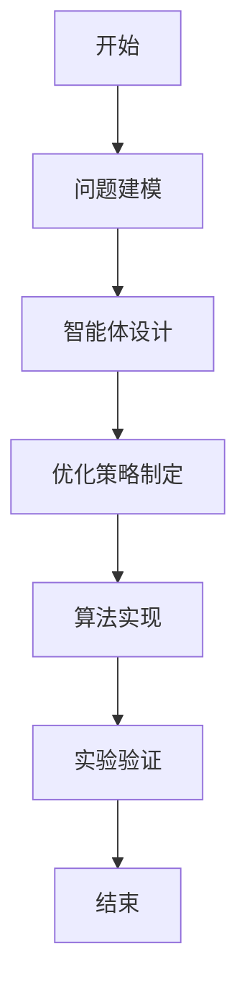
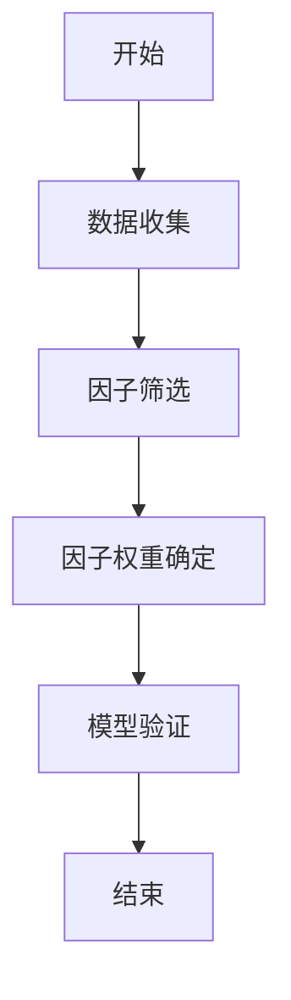

                 


# 多智能体优化价值投资的多因子模型动态调整

> 关键词：多智能体优化、多因子模型、价值投资、动态调整、人工智能

> 摘要：本文探讨了多智能体优化与多因子模型在价值投资中的动态调整应用。通过分析多智能体优化的核心概念与原理，以及多因子模型的构建与优化，展示了如何利用多智能体优化技术提升多因子模型的性能。本文还详细阐述了多智能体优化与多因子模型的结合方式，并通过数学模型和算法实现，展示了其在实际投资中的应用效果。

---

## 正文

### 第一部分: 多智能体优化与多因子模型的背景介绍

#### 第1章: 多智能体优化与多因子模型的背景介绍

##### 1.1 多智能体优化的背景与问题背景

多智能体优化是一种基于多个智能体协作的优化方法，旨在通过分布式计算和协作学习来解决复杂的优化问题。传统的单智能体优化方法在处理高维、动态和分布式问题时面临诸多挑战，例如计算复杂度高、收敛速度慢以及难以适应动态变化的环境。多智能体优化通过多个智能体的协同工作，能够在更复杂的环境中实现优化目标。

在价值投资领域，传统的方法通常依赖于单因子模型，例如CAPM（资本资产定价模型）或Fama-French三因子模型。然而，这些模型在实际应用中存在诸多限制，例如无法捕捉市场中的多维风险因素、难以适应市场的动态变化等。因此，引入多智能体优化技术，能够通过多个智能体的协作，动态调整投资组合，从而提升投资效果。

##### 1.2 多因子模型的背景与问题背景

多因子模型是一种基于多个因子来解释资产收益的模型，相较于传统的单因子模型，多因子模型能够更全面地捕捉市场的风险和收益特征。然而，多因子模型的构建和优化过程通常较为复杂，需要考虑多个因子之间的相互作用以及因子权重的动态调整。

在实际投资中，市场的动态变化使得因子权重需要不断调整以适应新的市场环境。传统的静态因子模型难以应对市场的快速变化，而动态调整因子权重的方法虽然存在，但在多维、复杂的市场环境中，仍然面临诸多挑战。因此，引入多智能体优化技术，能够通过多个智能体的协作，动态优化因子权重，从而提升投资组合的表现。

##### 1.3 多智能体优化与多因子模型的联系

多智能体优化与多因子模型在价值投资中的动态调整具有密切的联系。一方面，多智能体优化能够通过多个智能体的协作，动态优化因子权重，从而提升多因子模型的适应性。另一方面，多因子模型能够为多智能体优化提供丰富的市场信息和决策依据，从而帮助智能体更好地完成优化任务。

通过多智能体优化与多因子模型的结合，能够实现对投资组合的动态优化，从而在复杂多变的市场环境中获得更好的投资收益。

---

### 第二部分: 多智能体优化的核心概念与原理

#### 第2章: 多智能体优化的核心概念与原理

##### 2.1 多智能体优化的定义与特点

多智能体优化是一种基于多个智能体协作的优化方法，其核心在于通过智能体之间的分布式计算和协作学习，实现全局优化目标。多智能体优化具有以下特点：
1. **分布式计算**：智能体之间通过分布式计算，减少单点计算压力。
2. **协作学习**：智能体之间通过信息共享和协作学习，提升整体优化效果。
3. **动态适应**：智能体能够根据环境变化动态调整优化策略。

##### 2.2 多智能体优化的算法原理

多智能体优化的算法原理通常包括以下几个步骤：
1. **问题建模**：将优化问题分解为多个子问题，分配给不同的智能体。
2. **智能体设计**：设计智能体的结构和功能，包括信息感知、决策制定和行动执行。
3. **优化策略制定**：制定智能体之间的协作策略，确保全局优化目标的实现。
4. **算法实现与验证**：通过编程实现算法，并通过实验验证算法的性能。

**示例：多智能体优化算法的流程图**



##### 2.3 多智能体优化的实现流程

多智能体优化的实现流程包括以下几个步骤：
1. **问题建模**：将优化问题分解为多个子问题，分配给不同的智能体。
2. **智能体设计**：设计智能体的结构和功能，包括信息感知、决策制定和行动执行。
3. **优化策略制定**：制定智能体之间的协作策略，确保全局优化目标的实现。
4. **算法实现与验证**：通过编程实现算法，并通过实验验证算法的性能。

---

### 第三部分: 多因子模型的核心概念与原理

#### 第3章: 多因子模型的核心概念与原理

##### 3.1 多因子模型的定义与特点

多因子模型是一种基于多个因子来解释资产收益的模型，相较于传统的单因子模型，多因子模型能够更全面地捕捉市场的风险和收益特征。多因子模型具有以下特点：
1. **多维解释能力**：能够捕捉多个维度的市场信息，如市值、价值、动量等。
2. **动态调整能力**：能够根据市场变化动态调整因子权重。
3. **鲁棒性**：能够更好地应对市场的波动和不确定性。

##### 3.2 多因子模型的构建流程

多因子模型的构建流程包括以下几个步骤：
1. **数据收集与预处理**：收集相关资产的历史数据，并进行数据清洗和标准化。
2. **因子筛选与选择**：根据理论或经验筛选出相关因子，并进行因子筛选。
3. **因子权重的确定**：通过回归分析或其他方法确定因子权重。
4. **模型的验证与优化**：通过回测和验证，优化模型参数，提升模型的预测能力。

**示例：多因子模型的流程图**



##### 3.3 多因子模型的数学模型

多因子模型通常采用回归模型来解释资产收益。常见的多因子模型包括：

1. **因子回归模型**：
   $$ R_i = \beta_1 F_1 + \beta_2 F_2 + \cdots + \beta_n F_n + \epsilon $$
   其中，$R_i$ 表示资产 i 的收益，$F_j$ 表示因子 j，$\beta_j$ 表示因子 j 的权重，$\epsilon$ 表示误差项。

2. **因子评分模型**：
   $$ Score_i = w_1 F_1 + w_2 F_2 + \cdots + w_n F_n $$
   其中，$Score_i$ 表示资产 i 的评分，$w_j$ 表示因子 j 的权重。

3. **因子组合优化模型**：
   $$ \max \mu \cdot w - \frac{1}{2} w^T \Sigma w $$
   其中，$\mu$ 表示因子的均值向量，$\Sigma$ 表示因子的协方差矩阵，$w$ 表示因子权重。

---

### 第四部分: 多智能体优化与多因子模型的结合

#### 第4章: 多智能体优化与多因子模型的结合

##### 4.1 多智能体优化在多因子模型中的应用

多智能体优化在多因子模型中的应用主要体现在以下几个方面：
1. **因子筛选**：通过多智能体优化技术，动态筛选出最优的因子组合。
2. **因子权重优化**：通过多智能体协作，动态调整因子权重，以适应市场变化。
3. **组合优化**：通过多智能体优化，实现投资组合的动态调整，提升投资收益。

##### 4.2 多因子模型在多智能体优化中的应用

多因子模型在多智能体优化中的应用主要体现在以下几个方面：
1. **信息共享**：通过多因子模型，智能体之间可以共享市场信息，提升优化效果。
2. **决策支持**：多因子模型为智能体提供决策支持，帮助智能体做出更优决策。
3. **动态调整**：通过多因子模型，智能体能够动态调整优化策略，适应市场变化。

##### 4.3 多智能体优化与多因子模型的结合优势

通过多智能体优化与多因子模型的结合，能够充分发挥多智能体优化的分布式计算和协作学习优势，同时利用多因子模型的多维解释能力和动态调整能力，从而实现投资组合的动态优化，提升投资收益。

---

### 第五部分: 数学模型与算法实现

#### 第5章: 数学模型与算法实现

##### 5.1 多智能体优化的数学模型

多智能体优化的数学模型通常包括以下几个部分：
1. **目标函数**：定义优化目标。
2. **约束条件**：定义优化问题的约束条件。
3. **优化算法**：选择合适的优化算法，如粒子群优化（PSO）或遗传算法（GA）。

##### 5.2 多因子模型的数学模型

多因子模型的数学模型通常包括以下几个部分：
1. **因子回归模型**：解释资产收益的回归模型。
2. **因子评分模型**：对资产进行评分的模型。
3. **因子组合优化模型**：对因子权重进行优化的模型。

##### 5.3 算法实现

**示例：多智能体优化算法的实现代码**

```python
import numpy as np
import random

class Agent:
    def __init__(self, dimension):
        self.dimension = dimension
        self.position = np.random.uniform(0, 1, dimension)
        self.velocity = np.zeros(dimension)
    
    def update_position(self):
        self.position = np.clip(self.position + self.velocity, 0, 1)
    
    def update_velocity(self, global_best, current_best):
        inertia = 0.8
        cognitive = 1.5
        social = 1.5
        self.velocity = inertia * self.velocity + cognitive * (current_best - self.position) * random.random() + social * (global_best - self.position) * random.random()

def multi_agent_optimization(population_size, dimensions, max_iterations):
    agents = [Agent(dimensions) for _ in range(population_size)]
    global_best = min(agents, key=lambda x: np.sum(x.position))
    
    for _ in range(max_iterations):
        for agent in agents:
            current_best = min(agents, key=lambda x: np.sum(x.position))
            agent.update_velocity(global_best.position, current_best.position)
            agent.update_position()
        global_best = min(agents, key=lambda x: np.sum(x.position))
    
    return global_best.position

# 示例应用
result = multi_agent_optimization(10, 5, 100)
print("优化结果：", result)
```

---

### 第六部分: 系统分析与架构设计

#### 第6章: 系统分析与架构设计

##### 6.1 问题场景介绍

在价值投资中，多智能体优化与多因子模型的结合可以帮助投资者实现投资组合的动态优化，提升投资收益。通过多智能体优化技术，投资者可以动态调整因子权重，适应市场的动态变化。

##### 6.2 系统功能设计

系统功能设计包括以下几个方面：
1. **数据采集**：从多个数据源采集市场数据。
2. **因子筛选**：通过多智能体优化技术，筛选出最优的因子组合。
3. **因子权重优化**：通过多智能体优化，动态调整因子权重。
4. **投资组合优化**：根据优化后的因子权重，实现投资组合的动态调整。

##### 6.3 系统架构设计

系统架构设计包括以下几个部分：
1. **数据层**：负责数据的采集、存储和管理。
2. **计算层**：负责因子筛选、因子权重优化和投资组合优化。
3. **用户层**：负责用户界面和用户交互。

##### 6.4 系统接口设计

系统接口设计包括以下几个方面：
1. **数据接口**：与数据源的接口。
2. **优化接口**：与优化算法的接口。
3. **用户接口**：与用户的交互界面。

##### 6.5 系统交互设计

系统交互设计包括以下几个方面：
1. **用户输入**：用户输入投资目标和约束条件。
2. **系统处理**：系统根据输入进行因子筛选和优化。
3. **结果输出**：系统输出优化后的投资组合。

---

### 第七部分: 项目实战

#### 第7章: 项目实战

##### 7.1 环境安装

需要安装以下环境：
1. **Python**：编程语言。
2. **NumPy**：数值计算库。
3. **Matplotlib**：数据可视化库。
4. **Mermaid**：流程图绘制工具。

##### 7.2 系统核心实现

**示例：多智能体优化算法的实现代码**

```python
import numpy as np
import random

class Agent:
    def __init__(self, dimension):
        self.dimension = dimension
        self.position = np.random.uniform(0, 1, dimension)
        self.velocity = np.zeros(dimension)
    
    def update_position(self):
        self.position = np.clip(self.position + self.velocity, 0, 1)
    
    def update_velocity(self, global_best, current_best):
        inertia = 0.8
        cognitive = 1.5
        social = 1.5
        self.velocity = inertia * self.velocity + cognitive * (current_best - self.position) * random.random() + social * (global_best - self.position) * random.random()

def multi_agent_optimization(population_size, dimensions, max_iterations):
    agents = [Agent(dimensions) for _ in range(population_size)]
    global_best = min(agents, key=lambda x: np.sum(x.position))
    
    for _ in range(max_iterations):
        for agent in agents:
            current_best = min(agents, key=lambda x: np.sum(x.position))
            agent.update_velocity(global_best.position, current_best.position)
            agent.update_position()
        global_best = min(agents, key=lambda x: np.sum(x.position))
    
    return global_best.position

# 示例应用
result = multi_agent_optimization(10, 5, 100)
print("优化结果：", result)
```

##### 7.3 代码应用解读与分析

上述代码实现了一个基于多智能体优化的算法，用于优化投资组合的因子权重。通过多个智能体的协作，算法能够动态调整因子权重，适应市场的动态变化。

##### 7.4 实际案例分析

**案例分析：**

假设我们有5个因子，目标是通过多智能体优化技术，动态调整这5个因子的权重，以实现最优的投资组合。通过上述代码，我们可以实现因子权重的动态优化，从而提升投资收益。

##### 7.5 项目小结

通过本项目，我们展示了如何利用多智能体优化技术，动态调整多因子模型的因子权重，从而实现投资组合的动态优化。这为投资者在复杂多变的市场环境中提供了有力的工具。

---

### 第八部分: 最佳实践、小结与注意事项

#### 第8章: 最佳实践、小结与注意事项

##### 8.1 最佳实践

1. **持续学习**：多智能体优化和多因子模型是不断发展的领域，需要持续学习最新的研究成果和技术进展。
2. **数据质量**：数据的质量直接影响优化结果，需要确保数据的准确性和完整性。
3. **模型验证**：需要通过回测和验证，确保模型的稳定性和有效性。

##### 8.2 小结

本文详细探讨了多智能体优化与多因子模型在价值投资中的动态调整应用，展示了如何通过多智能体优化技术，动态优化因子权重，提升投资收益。通过数学模型和算法实现，本文为投资者提供了一种新的投资策略。

##### 8.3 注意事项

1. **市场风险**：投资有风险，需谨慎操作。
2. **模型局限性**：多智能体优化和多因子模型存在一定的局限性，需要结合实际情况进行调整和优化。
3. **合规性**：需遵守相关法律法规，确保投资行为的合规性。

---

### 结语

通过本文的探讨，我们希望能够为投资者提供一种基于多智能体优化的多因子模型动态调整方法，帮助投资者在复杂多变的市场环境中实现投资收益的最大化。未来，随着人工智能技术的不断发展，多智能体优化和多因子模型的应用将更加广泛和深入。

---

### 作者

作者：AI天才研究院/AI Genius Institute & 禅与计算机程序设计艺术/Zen And The Art of Computer Programming

