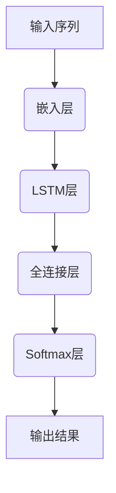
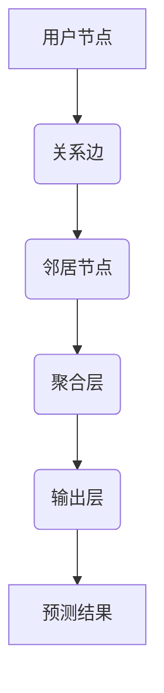
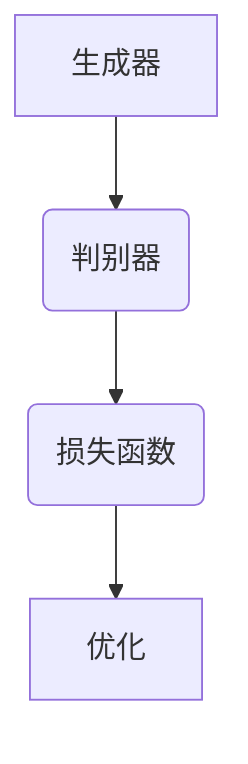
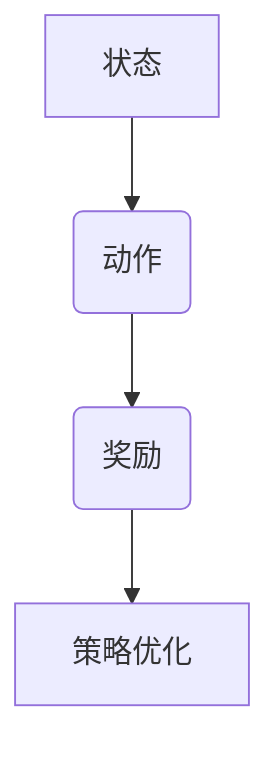
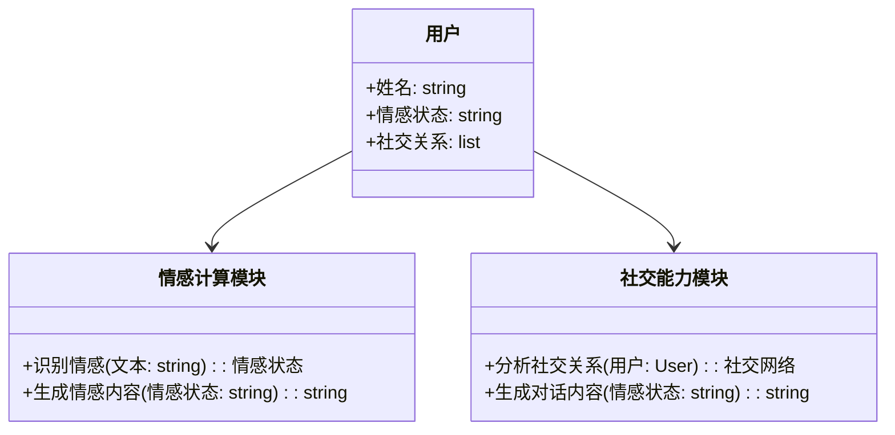
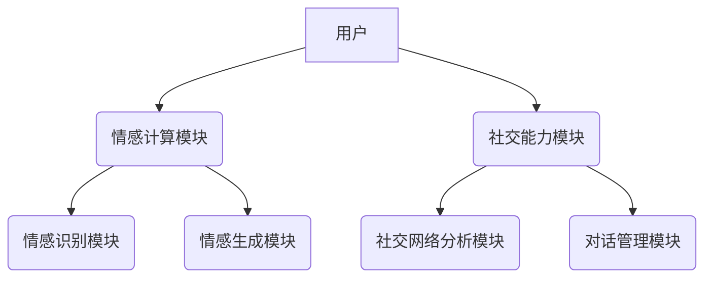
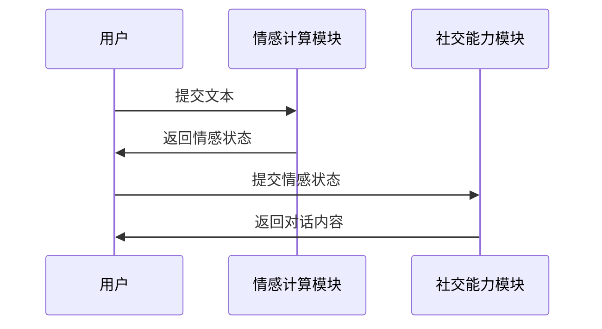

                 


# 开发具有情感计算与社交能力的AI Agent

> 关键词：情感计算，社交能力，AI Agent，人机交互，深度学习，自然语言处理，人工智能

> 摘要：本文详细探讨了开发具有情感计算与社交能力的AI Agent的核心理论、算法实现、系统架构以及项目实战。文章首先介绍了情感计算与社交能力的基本概念和核心原理，然后从算法和数学模型的角度分析了情感计算与社交能力的实现方法，接着详细讲解了系统的架构设计和项目实战，最后总结了开发情感计算与社交能力的AI Agent的关键点和未来发展方向。

---

# 第1章: 情感计算与社交能力的核心概念

## 1.1 情感计算的定义与背景

### 1.1.1 情感计算的起源与发展
情感计算（Affective Computing）是人工智能领域的一个重要分支，旨在赋予计算机理解和处理人类情感的能力。从20世纪90年代开始，研究者们开始尝试将情感计算应用于人机交互、心理健康辅助等领域。

### 1.1.2 情感计算的核心概念
情感计算的核心概念包括：
1. **情感识别**：通过语音、表情、语调等多模态数据，识别用户的情感状态。
2. **情感生成**：基于输入的情感信息，生成符合情感表达的文本或行为。
3. **情感记忆**：记录和学习用户的情感变化，以便更好地理解和预测用户的情感需求。

### 1.1.3 情感计算的应用场景
情感计算的应用场景包括：
1. **智能助手**：如Siri、Alexa等，通过情感计算提高人机交互的自然性。
2. **心理健康辅助**：通过分析用户的语言和情感状态，提供心理支持。
3. **教育技术**：根据学生的情感状态，调整教学策略。

## 1.2 社交能力在AI Agent中的作用

### 1.2.1 社交能力的定义与特征
社交能力是指个体在社交互动中有效沟通和协调的能力。对于AI Agent而言，社交能力意味着能够理解和回应用户的情感需求，同时在社交场景中表现出合理的社交行为。

### 1.2.2 社交能力在人机交互中的重要性
社交能力的AI Agent能够：
1. **提高用户体验**：通过理解用户情感，提供更个性化的服务。
2. **增强信任感**：通过自然的社交互动，让用户感到被理解和尊重。
3. **扩展应用场景**：在教育、医疗、娱乐等领域，社交能力使AI Agent能够更好地融入人类社会。

### 1.2.3 AI Agent社交能力的实现方式
AI Agent的社交能力可以通过以下方式实现：
1. **对话管理**：通过自然语言处理技术，生成符合社交规范的对话内容。
2. **情感反馈**：根据用户的情感状态，调整回应的方式和语气。
3. **社交网络分析**：基于用户的社交关系，提供针对性的服务。

## 1.3 情感计算与社交能力的联系

### 1.3.1 情感计算与社交能力的关系
情感计算是实现社交能力的基础。通过情感计算，AI Agent能够理解用户的情感需求，并在此基础上实现更高级的社交能力。

### 1.3.2 情感计算在社交能力中的应用
情感计算在社交能力中的应用包括：
1. **情感识别**：识别用户的情感状态，为社交互动提供依据。
2. **情感生成**：生成符合用户情感需求的回应内容。
3. **情感记忆**：记录用户的长期情感变化，优化未来的社交互动。

### 1.3.3 社交能力对情感计算的反馈作用
社交能力的实现可以为情感计算提供更多的数据和反馈，从而优化情感计算模型。

## 1.4 本章小结
本章从情感计算和社交能力的核心概念出发，分析了情感计算与社交能力的关系及其在AI Agent中的应用。接下来，我们将深入探讨情感计算的理论基础和实现方法。

---

# 第2章: 情感计算的理论基础

## 2.1 情感计算的基本原理

### 2.1.1 情感识别的流程
情感识别的流程包括：
1. **数据采集**：通过传感器或API获取用户的情感数据，如语音、表情、语调等。
2. **特征提取**：从原始数据中提取有用的特征，如语音的音调、表情的关键词等。
3. **情感分类**：基于特征数据，使用机器学习或深度学习模型进行情感分类。

### 2.1.2 情感分类的算法
常用的情感分类算法包括：
1. **基于规则的方法**：通过预定义的规则，对文本中的情感关键词进行匹配。
2. **机器学习方法**：如支持向量机（SVM）和随机森林（Random Forest）。
3. **深度学习方法**：如卷积神经网络（CNN）和循环神经网络（RNN）。

### 2.1.3 情感计算的评价指标
常用的情感计算评价指标包括准确率（Accuracy）、精确率（Precision）、召回率（Recall）和F1值。

## 2.2 情感计算的核心算法

### 2.2.1 基于深度学习的情感分析模型
深度学习模型如BERT和GPT-3在情感分析中表现出色。例如，使用BERT模型进行情感分类的流程如下：

1. **输入文本**：将待分类的文本输入模型。
2. **编码**：模型对文本进行编码，生成词向量。
3. **分类**：通过全连接层和Softmax函数，输出情感类别概率。

### 2.2.2 情感计算的训练流程
情感计算的训练流程包括：
1. **数据预处理**：清洗和标注数据。
2. **模型训练**：使用标注数据训练情感计算模型。
3. **模型优化**：通过调整超参数和优化算法，提高模型性能。

## 2.3 情感计算的数学模型

### 2.3.1 情感分类的线性模型
线性情感分类模型可以表示为：
$$ y = \text{sign}(w \cdot x + b) $$
其中，$w$是权重向量，$x$是输入特征向量，$b$是偏置项，$y$是输出类别。

### 2.3.2 情感分类的深度学习模型
深度学习模型如LSTM的结构可以用以下图表示：



## 2.4 本章小结
本章详细介绍了情感计算的基本原理和核心算法，并通过数学模型和流程图的形式，展示了情感计算的实现过程。接下来，我们将探讨社交能力的实现方法。

---

# 第3章: 社交能力的实现方法

## 3.1 社交能力的基本实现

### 3.1.1 社交网络的构建
社交网络的构建包括：
1. **数据采集**：获取用户在社交平台上的行为数据。
2. **网络表示**：将社交网络表示为图结构，节点表示用户，边表示用户之间的关系。
3. **网络分析**：通过图论算法分析社交网络的结构特征。

### 3.1.2 社交关系的分析
社交关系的分析包括：
1. **中心性分析**：识别社交网络中的关键用户。
2. **社群检测**：发现社交网络中的社群结构。
3. **影响力分析**：评估用户在社交网络中的影响力。

### 3.1.3 社交行为的预测
社交行为的预测可以通过机器学习模型实现，例如：
$$ y = \text{预测行为} $$
其中，$y$是基于用户历史行为和网络特征预测的结果。

## 3.2 对话管理的核心算法

### 3.2.1 对话生成的策略
对话生成的策略包括：
1. **基于规则的策略**：通过预定义的规则生成对话内容。
2. **基于模型的策略**：使用生成对抗网络（GAN）生成对话内容。

### 3.2.2 对话理解的模型
对话理解的模型包括：
1. **序列到序列模型**：如Transformer架构。
2. **注意力机制模型**：通过注意力机制聚焦于重要的对话内容。

### 3.2.3 对话优化的方法
对话优化的方法包括：
1. **基于奖励的强化学习**：通过定义奖励函数优化对话策略。
2. **基于反馈的优化**：根据用户反馈调整对话策略。

## 3.3 社交能力的数学模型

### 3.3.1 对话生成的马尔可夫链模型
马尔可夫链模型可以表示为：
$$ P(s_{t+1}|s_t) $$
其中，$s_t$表示当前状态，$s_{t+1}$表示下一个状态。

### 3.3.2 对话理解的注意力机制模型
注意力机制模型的结构可以用以下公式表示：
$$ \text{Attention}(q, k, v) = \text{softmax}\left(\frac{q \cdot k}{\sqrt{d}}\right) \cdot v $$
其中，$q$是查询向量，$k$是键向量，$v$是值向量，$d$是向量的维度。

### 3.3.3 社交行为预测的图神经网络模型
图神经网络模型的结构可以用以下图表示：



## 3.4 本章小结
本章详细探讨了社交能力的实现方法，包括社交网络的构建、社交关系的分析以及对话管理的核心算法。接下来，我们将探讨情感计算与社交能力的算法实现。

---

# 第4章: 情感计算与社交能力的算法实现

## 4.1 情感计算的算法实现

### 4.1.1 基于深度学习的情感分析模型
基于深度学习的情感分析模型可以通过以下流程实现：

1. **数据预处理**：清洗和标注情感数据。
2. **模型训练**：使用深度学习模型（如BERT）进行训练。
3. **模型优化**：通过调整超参数和优化算法提高模型性能。

### 4.1.2 情感计算的训练流程
情感计算的训练流程包括：
1. **数据采集**：获取情感数据。
2. **特征提取**：从数据中提取特征。
3. **模型训练**：使用特征数据训练情感计算模型。
4. **模型评估**：通过测试数据评估模型性能。

### 4.1.3 情感计算的优化方法
情感计算的优化方法包括：
1. **迁移学习**：利用预训练模型优化情感计算任务。
2. **数据增强**：通过生成多样化的数据提高模型泛化能力。

## 4.2 社交能力的算法实现

### 4.2.1 对话生成的生成对抗网络模型
生成对抗网络模型的结构可以用以下图表示：



### 4.2.2 对话理解的序列到序列模型
序列到序列模型的结构可以用以下公式表示：
$$ P(y|x) = \text{softmax}(f(x)) $$
其中，$x$是输入序列，$y$是输出序列，$f(x)$是模型的编码函数。

### 4.2.3 社交行为预测的强化学习模型
强化学习模型的结构可以用以下图表示：



## 4.3 算法实现的数学模型

### 4.3.1 情感分析的损失函数
情感分析的损失函数可以表示为：
$$ \mathcal{L} = -\sum_{i=1}^{n} y_i \log(p_i) + (1-y_i)\log(1-p_i) $$
其中，$y_i$是真实标签，$p_i$是预测概率。

### 4.3.2 对话生成的生成器与判别器
生成器和判别器的损失函数可以表示为：
$$ \mathcal{L}_G = \mathbb{E}_{z}[\text{log}D(G(z))] $$
$$ \mathcal{L}_D = -\mathbb{E}_{x}[\text{log}D(x)] - \mathbb{E}_{z}[\text{log}(1-D(G(z)))] $$

### 4.3.3 社交行为预测的损失函数
社交行为预测的损失函数可以表示为：
$$ \mathcal{L} = -\sum_{i=1}^{n} y_i \log(p_i) + (1-y_i)\log(1-p_i) $$

## 4.4 本章小结
本章详细介绍了情感计算与社交能力的算法实现，包括情感分析模型和对话生成模型的实现方法。接下来，我们将探讨系统的架构设计。

---

# 第5章: 情感计算与社交能力的系统架构设计

## 5.1 系统架构的核心模块

### 5.1.1 情感计算模块
情感计算模块包括：
1. **情感识别模块**：识别用户的情感状态。
2. **情感生成模块**：生成符合情感需求的回应内容。
3. **情感记忆模块**：记录用户的长期情感变化。

### 5.1.2 社交能力模块
社交能力模块包括：
1. **社交网络分析模块**：分析用户的社交关系。
2. **对话管理模块**：生成和理解对话内容。
3. **社交行为预测模块**：预测用户的社交行为。

## 5.2 系统功能设计

### 5.2.1 领域模型的Mermaid类图
领域模型的Mermaid类图如下：



### 5.2.2 系统架构的Mermaid架构图
系统架构的Mermaid架构图如下：



## 5.3 系统接口设计

### 5.3.1 情感计算模块的接口
情感计算模块的接口包括：
1. `识别情感(文本: string): 情感状态`
2. `生成情感内容(情感状态: string): string`

### 5.3.2 社交能力模块的接口
社交能力模块的接口包括：
1. `分析社交关系(用户: User): 社交网络`
2. `生成对话内容(情感状态: string): string`

## 5.4 系统交互的Mermaid序列图



## 5.5 本章小结
本章详细设计了情感计算与社交能力的系统架构，包括核心模块、系统功能和接口设计。接下来，我们将通过项目实战，进一步探讨系统的实现细节。

---

# 第6章: 项目实战——情感计算与社交能力的AI Agent开发

## 6.1 项目介绍

### 6.1.1 项目背景
本项目旨在开发一个具有情感计算与社交能力的AI Agent，能够通过自然语言处理技术与用户进行情感化的对话互动。

### 6.1.2 项目目标
项目目标包括：
1. 实现情感计算功能，能够识别和生成情感内容。
2. 实现社交能力功能，能够进行自然的对话互动。
3. 实现系统架构设计，确保系统的可扩展性和可维护性。

## 6.2 环境安装

### 6.2.1 安装Python
安装Python 3.8或更高版本。

### 6.2.2 安装依赖库
安装以下依赖库：
- `numpy`
- `pandas`
- `scikit-learn`
- `tensorflow`
- `transformers`

## 6.3 系统核心实现

### 6.3.1 情感计算模块的实现

#### 情感识别模块
```python
from transformers import pipeline

sentiment_analyzer = pipeline("sentiment-analysis")
def identify_emotion(text):
    return sentiment_analyzer(text)[0]['label']
```

#### 情感生成模块
```python
from transformers import AutoTokenizer, AutoModelForCausalLM

tokenizer = AutoTokenizer.from_pretrained("gpt2")
model = AutoModelForCausalLM.from_pretrained("gpt2")

def generate_emotional_content(emotion):
    input_text = f"生成一段表达{emotion}的文字："
    inputs = tokenizer(input_text, return_tensors="pt")
    outputs = model.generate(**inputs, max_length=50)
    return tokenizer.decode(outputs[0], skip_special_tokens=True)
```

### 6.3.2 社交能力模块的实现

#### 社交网络分析模块
```python
import networkx as nx

def analyze_social_network(users):
    graph = nx.Graph()
    graph.add_nodes_from(users)
    for i in range(len(users)):
        for j in range(i+1, len(users)):
            graph.add_edge(users[i], users[j])
    return graph
```

#### 对话管理模块
```python
from transformers import AutoTokenizer, AutoModelForCausalLM

tokenizer = AutoTokenizer.from_pretrained("facebook/bart-large")
model = AutoModelForCausalLM.from_pretrained("facebook/bart-large")

def generate_dialogue(context, emotion):
    input_text = f"根据上下文'{context}'，生成一段表达{emotion}的对话："
    inputs = tokenizer(input_text, return_tensors="pt")
    outputs = model.generate(**inputs, max_length=50)
    return tokenizer.decode(outputs[0], skip_special_tokens=True)
```

## 6.4 项目小结
本章通过项目实战，详细介绍了情感计算与社交能力的AI Agent的开发过程，包括环境安装、系统核心实现和项目总结。通过本章的学习，读者可以掌握情感计算与社交能力的实现方法，并能够开发出具有情感计算与社交能力的AI Agent。

---

# 第7章: 总结与展望

## 7.1 本章总结
本文详细探讨了情感计算与社交能力的AI Agent的开发过程，包括情感计算与社交能力的核心概念、算法实现、系统架构设计以及项目实战。通过本文的学习，读者可以掌握情感计算与社交能力的实现方法，并能够开发出具有情感计算与社交能力的AI Agent。

## 7.2 未来展望
未来，随着人工智能技术的不断发展，情感计算与社交能力的AI Agent将更加智能化和个性化。研究者们将致力于以下方向：
1. **多模态情感计算**：结合语音、表情等多种模态数据，提高情感计算的准确性。
2. **增强社交能力**：通过更复杂的对话管理和社交网络分析，实现更自然的社交互动。
3. **个性化服务**：根据用户的个性化需求，提供定制化的情感计算与社交能力服务。

## 7.3 最佳实践Tips
1. **数据质量**：确保情感计算和社交能力的数据质量，避免噪声数据的干扰。
2. **模型优化**：通过迁移学习和数据增强，优化情感计算和对话生成模型的性能。
3. **用户体验**：注重用户体验设计，确保情感计算与社交能力的AI Agent能够提供自然流畅的交互体验。

## 7.4 本章小结
本文总结了情感计算与社交能力的AI Agent的核心内容，并展望了未来的发展方向。通过本文的学习，读者可以更好地理解和开发情感计算与社交能力的AI Agent。

---

# 作者：AI天才研究院/AI Genius Institute & 禅与计算机程序设计艺术 /Zen And The Art of Computer Programming

