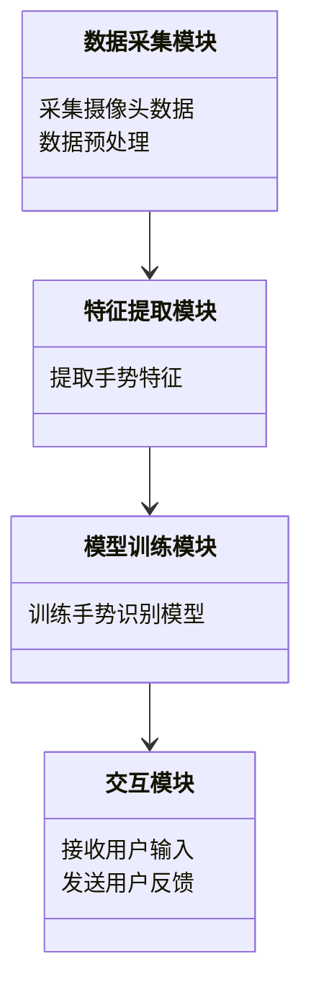
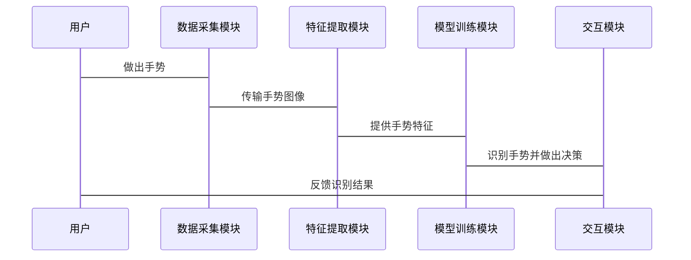

                 


# 开发具有手势识别能力的AI Agent

> 关键词：手势识别，AI Agent，卷积神经网络，人机交互，深度学习

> 摘要：  
本文将详细探讨如何开发具有手势识别能力的AI Agent。首先，我们将从背景介绍入手，分析手势识别与AI Agent的核心概念及其应用领域。接着，我们将深入讲解手势识别的算法原理，包括基于卷积神经网络（CNN）的实现方法，并结合数学模型进行详细分析。随后，我们将设计一个完整的系统架构，涵盖数据采集、特征提取、模型训练及交互实现等模块。最后，我们将通过项目实战，展示如何从环境配置到代码实现，一步步构建一个具有手势识别能力的AI Agent，并总结开发过程中的最佳实践与注意事项。

---

# 第一部分: 手势识别与AI Agent的背景与核心概念

# 第1章: 手势识别与AI Agent的背景介绍

## 1.1 问题背景与问题描述

### 1.1.1 手势识别的定义与应用领域

手势识别是一种通过计算机视觉技术识别和理解人类手势的技术，广泛应用于人机交互、虚拟现实、智能机器人、医疗康复等领域。例如，在虚拟现实（VR）和增强现实（AR）中，手势识别可以实现更自然的用户交互；在医疗康复领域，可以通过手势识别帮助患者进行康复训练。

### 1.1.2 AI Agent的定义与核心功能

AI Agent（人工智能代理）是一种能够感知环境、执行任务并做出决策的智能体。AI Agent的核心功能包括感知、推理、规划和执行。通过手势识别，AI Agent可以更自然地与人类交互，理解用户的意图并执行相应的操作。

### 1.1.3 手势识别与AI Agent的结合场景

手势识别与AI Agent的结合场景包括但不限于：  
1. 智能家居控制：通过手势识别，用户可以通过手势控制智能家居设备。  
2. 智能助手交互：AI Agent可以通过手势识别理解用户的意图，并执行相应的操作。  
3. 医疗康复：通过手势识别，AI Agent可以帮助医生或治疗师进行康复训练。  

---

## 1.2 手势识别的实现流程

### 1.2.1 数据采集与预处理

手势识别的第一步是数据采集，通常使用摄像头或传感器获取手势图像或信号。数据采集后需要进行预处理，包括图像增强、噪声消除和数据标准化等。

### 1.2.2 特征提取与模型训练

通过预处理后的数据，需要提取特征并训练模型。特征提取可以采用传统的图像处理方法或深度学习方法，模型训练通常使用分类算法（如支持向量机、随机森林或深度神经网络）。

### 1.2.3 模型部署与交互实现

训练好的模型需要部署到实际应用中，并通过API或用户界面实现与用户的交互。交互实现包括手势识别的实时响应和反馈。

---

## 1.3 手势识别的边界与外延

### 1.3.1 手势识别的局限性

手势识别的局限性包括：  
1. 环境依赖性：光照、背景干扰等因素会影响手势识别的准确性。  
2. 通用性：目前的手势识别主要针对特定的手势或场景，难以实现跨场景的通用性。  
3. 识别速度：在实时应用中，手势识别的速度和延迟可能成为瓶颈。  

### 1.3.2 AI Agent的边界条件

AI Agent的边界条件包括：  
1. 知识库：AI Agent的知识库决定了其理解能力和决策范围。  
2. 交互方式：AI Agent的交互方式影响其与用户或环境的协同工作能力。  
3. 响应时间：AI Agent的响应时间影响用户体验和应用效果。  

### 1.3.3 手势识别与AI Agent的协同工作范围

手势识别与AI Agent的协同工作范围包括：  
1. 数据输入：手势识别为AI Agent提供输入数据。  
2. 任务执行：AI Agent根据手势识别的结果执行相应任务。  
3. 反馈输出：AI Agent通过手势或其他方式向用户反馈结果。  

---

## 1.4 手势识别与AI Agent的概念结构

### 1.4.1 手势识别的核心要素

手势识别的核心要素包括：  
1. 数据采集：获取手势图像或信号。  
2. 特征提取：提取手势的关键特征。  
3. 模型训练：训练分类器或深度学习模型。  

### 1.4.2 AI Agent的核心要素

AI Agent的核心要素包括：  
1. 感知模块：感知环境信息。  
2. 决策模块：根据感知信息做出决策。  
3. 执行模块：执行决策任务。  

### 1.4.3 两者结合的概念模型

手势识别与AI Agent结合的概念模型是一个闭环系统：  
1. AI Agent通过手势识别感知用户意图。  
2. 根据用户意图做出决策。  
3. 执行决策并通过手势或其他方式反馈结果。  

---

## 1.5 本章小结

本章介绍了手势识别与AI Agent的背景、实现流程、边界条件及概念结构。通过这些内容，我们明确了手势识别与AI Agent的核心概念及其协同工作方式，为后续章节的深入分析奠定了基础。

---

# 第二部分: 手势识别与AI Agent的核心概念与联系

# 第2章: 手势识别的核心原理

## 2.1 手势识别的原理与方法

### 2.1.1 基于图像的手势识别原理

基于图像的手势识别主要通过分析图像中的手势特征进行识别。常见的方法包括：  
1. 基于边缘检测：通过提取手势的边缘特征进行识别。  
2. 基于区域检测：通过分割图像中的手势区域进行识别。  

### 2.1.2 基于深度学习的手势识别方法

基于深度学习的手势识别方法包括：  
1. 卷积神经网络（CNN）：通过多层卷积和池化操作提取图像特征。  
2. 图像分割网络：通过分割网络实现手势区域的精确定位。  

### 2.1.3 基于模型的手势识别流程

基于模型的手势识别流程包括：  
1. 数据采集与预处理。  
2. 特征提取与模型训练。  
3. 模型部署与实时识别。  

---

## 2.2 AI Agent的核心原理

### 2.2.1 AI Agent的基本工作原理

AI Agent的基本工作原理包括：  
1. 感知环境：通过传感器或接口获取环境信息。  
2. 推理与决策：基于感知信息进行推理和决策。  
3. 执行任务：根据决策结果执行任务并反馈结果。  

### 2.2.2 AI Agent的感知与决策机制

AI Agent的感知与决策机制包括：  
1. 多模态感知：通过多种传感器（如视觉、听觉、触觉）获取信息。  
2. 综合推理：基于知识库和推理算法做出决策。  

### 2.2.3 AI Agent的交互与反馈机制

AI Agent的交互与反馈机制包括：  
1. 用户输入：通过手势、语音等方式接收用户指令。  
2. 系统反馈：通过手势、语音或屏幕显示等方式向用户反馈结果。  

---

## 2.3 手势识别与AI Agent的联系

### 2.3.1 手势识别作为AI Agent的输入接口

手势识别可以作为AI Agent的输入接口，帮助AI Agent理解用户的意图。例如，用户可以通过手势控制智能家居设备。

### 2.3.2 AI Agent通过手势识别实现人机交互

AI Agent通过手势识别实现更自然的人机交互方式，提升用户体验。

### 2.3.3 手势识别与AI Agent的协同优化

手势识别与AI Agent的协同优化包括：  
1. 优化手势识别的准确率和响应速度。  
2. 提升AI Agent的决策能力和反馈能力。  

---

## 2.4 本章小结

本章深入探讨了手势识别与AI Agent的核心原理及其联系。通过分析手势识别的原理和方法，以及AI Agent的感知与决策机制，我们明确了两者协同工作的核心要素和优化方向。

---

# 第三部分: 手势识别AI Agent的算法原理与数学模型

# 第3章: 手势识别的算法原理

## 3.1 基于CNN的手势识别算法

### 3.1.1 卷积神经网络（CNN）的基本结构

卷积神经网络（CNN）的基本结构包括：  
1. 卷积层：通过卷积操作提取图像特征。  
2. 池化层：通过池化操作降低特征维度。  
3. 全连接层：通过全连接操作进行分类。  

### 3.1.2 手势识别中的CNN模型设计

在手势识别中，常用的手势识别模型包括LeNet、AlexNet和VGG等。其中，VGG模型因其深层结构在图像分类任务中表现优异，常用于手势识别任务。

### 3.1.3 CNN在手势识别中的优势

CNN在手势识别中的优势包括：  
1. 自动特征提取：CNN可以自动提取图像的高层次特征。  
2. 鲁棒性：CNN对图像的平移、旋转和缩放具有一定的鲁棒性。  

---

## 3.2 手势识别算法的实现流程

### 3.2.1 数据预处理与增强

数据预处理与增强包括：  
1. 图像 resize：将图像缩放到统一大小。  
2. 数据增强：通过旋转、翻转、噪声添加等方式增加数据多样性。  

### 3.2.2 模型训练与优化

模型训练与优化包括：  
1. 模型训练：使用训练数据训练CNN模型。  
2. 模型优化：通过调整学习率、优化算法（如Adam）和正则化方法优化模型性能。  

### 3.2.3 模型评估与调优

模型评估与调优包括：  
1. 交叉验证：通过交叉验证评估模型的泛化能力。  
2. 调参：通过网格搜索等方法调优模型参数。  

---

## 3.3 手势识别的数学模型与公式

### 3.3.1 卷积操作的数学表达

卷积操作的数学表达如下：  
$$ (f * g)(i,j) = \sum_{m=-k}^{k} \sum_{n=-l}^{l} f(i+m,j+n) \cdot g(m,n) $$  

其中，$f$是输入图像，$g$是卷积核，$(i,j)$是输出图像的位置。

### 3.3.2 池化操作的数学表达

池化操作的数学表达如下：  
$$ f_{pool}(i,j) = \max_{(i',j') \in \text{neighborhood}} f(i',j') $$  

其中，$\text{neighborhood}$是池化窗口内的像素集合。

### 3.3.3 深度学习模型的损失函数

深度学习模型的常用损失函数包括交叉熵损失：  
$$ \mathcal{L} = -\sum_{i=1}^{N} y_i \log p_i + (1-y_i) \log (1-p_i) $$  

其中，$y_i$是真实标签，$p_i$是预测概率。

---

## 3.4 本章小结

本章详细讲解了基于CNN的手势识别算法的原理和实现流程，并通过数学公式分析了卷积操作、池化操作和损失函数的核心思想。这些内容为后续的系统架构设计和项目实战奠定了理论基础。

---

# 第四部分: 手势识别AI Agent的系统架构与实现

# 第4章: 手势识别AI Agent的系统架构设计

## 4.1 系统功能设计

### 4.1.1 领域模型设计

领域模型设计包括：  
1. 数据采集模块：负责采集手势图像。  
2. 特征提取模块：负责提取手势特征。  
3. 模型训练模块：负责训练手势识别模型。  
4. 交互模块：负责与用户进行交互。  

### 4.1.2 领域模型的Mermaid类图



### 4.1.3 系统架构设计


---

## 4.2 系统接口设计

### 4.2.1 数据接口

数据接口包括：  
1. 摄像头数据接口：用于采集手势图像。  
2. 数据存储接口：用于存储预处理后的数据。  

### 4.2.2 模型接口

模型接口包括：  
1. 模型训练接口：用于训练手势识别模型。  
2. 模型推理接口：用于实时识别用户手势。  

### 4.2.3 交互接口

交互接口包括：  
1. 用户输入接口：用于接收用户手势输入。  
2. 系统反馈接口：用于向用户反馈识别结果。  

---

## 4.3 系统交互设计

### 4.3.1 交互流程设计

交互流程设计包括：  
1. 用户做出手势。  
2. 数据采集模块采集手势图像。  
3. 特征提取模块提取手势特征。  
4. 模型训练模块识别手势并做出决策。  
5. 交互模块向用户反馈结果。  

### 4.3.2 交互流程的Mermaid序列图



---

## 4.4 本章小结

本章设计了一个具有手势识别能力的AI Agent系统架构，涵盖了数据采集、特征提取、模型训练和交互实现等模块。通过类图和序列图的分析，我们明确了各模块之间的交互关系和功能流程。

---

# 第五部分: 手势识别AI Agent的项目实战

# 第5章: 项目实战

## 5.1 环境配置

### 5.1.1 安装开发环境

安装Python和必要的开发工具：  
1. 安装Python：`python --version`  
2. 安装虚拟环境：`pip install virtualenv`  
3. 安装TensorFlow：`pip install tensorflow`  
4. 安装OpenCV：`pip install opencv-python`  

### 5.1.2 安装必要的库

安装必要的库：  
1. `pip install numpy`  
2. `pip install matplotlib`  
3. `pip install scikit-learn`  

---

## 5.2 系统核心实现

### 5.2.1 数据采集与预处理

```python
import cv2

def capture_gesture():
    cap = cv2.VideoCapture(0)
    while True:
        ret, frame = cap.read()
        cv2.imshow('Gesture Capture', frame)
        if cv2.waitKey(1) & 0xFF == ord('q'):
            break
    cap.release()
    cv2.destroyAllWindows()
```

### 5.2.2 特征提取与模型训练

```python
import tensorflow as tf
from tensorflow.keras import layers

model = tf.keras.Sequential([
    layers.Conv2D(32, (3,3), activation='relu', input_shape=(224, 224, 3)),
    layers.MaxPooling2D((2,2)),
    layers.Conv2D(64, (3,3), activation='relu'),
    layers.MaxPooling2D((2,2)),
    layers.Flatten(),
    layers.Dense(128, activation='relu'),
    layers.Dense(10, activation='softmax')
])

model.compile(optimizer='adam', loss='sparse_categorical_crossentropy', metrics=['accuracy'])
model.fit(x_train, y_train, epochs=10, batch_size=32)
```

### 5.2.3 交互实现与反馈

```python
def recognize_gesture():
    # 加载预训练模型
    model.load_weights('gesture_model.h5')
    cap = cv2.VideoCapture(0)
    while True:
        ret, frame = cap.read()
        frame = cv2.resize(frame, (224, 224))
        frame = frame / 255.0
        prediction = model.predict(tf.expand_dims(frame, axis=0))
        predicted_class = tf.argmax(prediction, axis=1).numpy()[0]
        print(f'识别到的手势类别为：{predicted_class}')
        if cv2.waitKey(1) & 0xFF == ord('q'):
            break
    cap.release()
    cv2.destroyAllWindows()
```

---

## 5.3 项目小结

本章通过项目实战展示了如何开发具有手势识别能力的AI Agent。从环境配置到代码实现，我们详细讲解了数据采集、特征提取、模型训练和交互实现的过程，帮助读者掌握手势识别AI Agent的核心技术。

---

# 第六部分: 最佳实践与注意事项

# 第6章: 最佳实践

## 6.1 开发过程中的注意事项

### 6.1.1 数据质量

数据质量是手势识别的关键，建议采集多样化的数据并进行数据增强。

### 6.1.2 模型优化

模型优化包括调整网络结构、优化算法和正则化方法，以提升模型性能。

### 6.1.3 系统稳定性

系统稳定性包括优化代码性能、减少延迟和提升用户体验。

---

## 6.2 最佳实践中的小结

通过本文的分析，我们总结了开发具有手势识别能力的AI Agent的最佳实践，包括数据采集、模型优化和系统设计等方面。这些内容将帮助读者更高效地开发出高性能的手势识别AI Agent。

---

# 作者：AI天才研究院/AI Genius Institute & 禅与计算机程序设计艺术 /Zen And The Art of Computer Programming

---

**本文版权归作者所有，转载请注明出处。**

