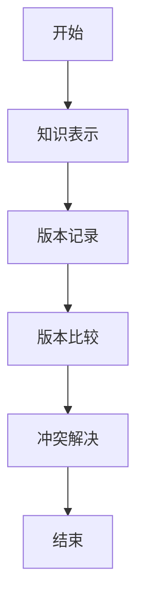
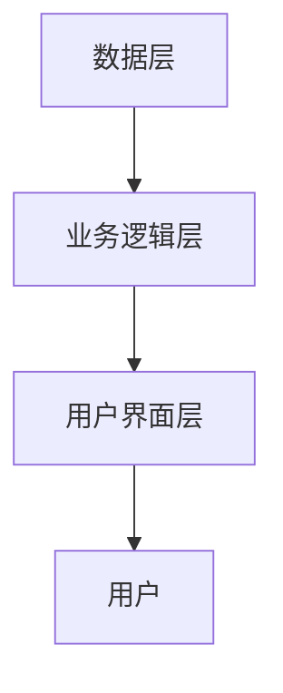

                 


# 构建AI Agent的知识库版本控制系统

## 关键词：AI Agent, 知识库版本控制, 系统设计, 算法原理, 项目实战

## 摘要：  
本文详细探讨了构建AI Agent的知识库版本控制系统的背景、核心概念、算法原理、系统设计、项目实战以及总结与展望。通过分析知识库版本控制的重要性、原理和实现，结合具体的系统架构设计和项目案例，为读者提供了一个全面的技术指南。

---

# 第1章: 知识库版本控制的背景与问题背景

## 1.1 问题背景与问题描述

### 1.1.1 AI Agent与知识库的结合
AI Agent（人工智能代理）是一种能够感知环境并执行任务的智能系统。知识库作为AI Agent的核心知识源，存储了大量结构化或非结构化的信息。然而，随着知识库的不断更新和扩展，版本控制问题日益凸显。

### 1.1.2 知识库版本控制的重要性
知识库的版本控制对于确保数据的准确性和可追溯性至关重要。特别是在多人协作或频繁更新的场景中，版本控制能够帮助我们追踪修改历史、回滚到特定版本，并管理不同版本之间的依赖关系。

### 1.1.3 当前知识库版本控制的挑战
当前的知识库版本控制主要依赖于传统的版本控制系统（如Git），但这些系统难以处理知识库的复杂结构和语义信息。此外，AI Agent对知识库的实时更新和动态扩展也提出了更高的要求。

---

## 1.2 知识库版本控制的核心目标

### 1.2.1 知识库版本控制的基本概念
知识库版本控制是一种通过记录知识库的变化历史，以便在需要时恢复到特定版本的技术。它不仅关注数据的存储，还关注数据的语义和关联性。

### 1.2.2 知识库版本控制的核心目标
- 记录知识库的修改历史。
- 提供版本之间的比较和回滚功能。
- 支持知识库的分布式协作。
- 管理知识库的语义冲突。

### 1.2.3 知识库版本控制的边界与外延
知识库版本控制的边界包括知识库的结构、内容和元数据。其外延则涉及与AI Agent的交互、知识表示方法以及分布式系统的设计。

---

## 1.3 知识库版本控制的核心要素

### 1.3.1 知识库的结构化表示
知识库的结构化表示是版本控制的基础。常见的表示方法包括图结构、树结构和向量表示。

### 1.3.2 版本控制的元数据
元数据包括版本号、修改时间、修改人、修改记录等，用于描述知识库的版本信息。

### 1.3.3 知识库版本控制的参与者
参与者包括知识库的创建者、修改者、审核者和消费者。

---

## 1.4 本章小结
本章介绍了构建AI Agent的知识库版本控制系统的背景，分析了其重要性和挑战，并详细阐述了核心目标和要素。

---

# 第2章: 知识库版本控制的核心概念

## 2.1 知识库版本控制的原理

### 2.1.1 知识库版本控制的基本原理
知识库版本控制通过记录每次修改，生成不同的版本。每个版本都包含了知识库的状态快照。

### 2.1.2 知识库版本控制的实现机制
- 分支与合并：允许多人协作，通过分支和合并管理不同版本。
- 标签与注释：用于标记重要版本并记录修改说明。
- 冲突解决：当不同版本出现冲突时，需要人工或自动化的工具进行处理。

### 2.1.3 知识库版本控制的实现流程
1. 创建新版本：根据当前知识库状态生成快照。
2. 记录元数据：包括版本号、修改时间等。
3. 存储版本信息：将版本信息存储在版本控制系统中。
4. 版本比较与回滚：支持版本之间的比较和回滚操作。

---

## 2.2 知识库版本控制的核心概念对比

### 2.2.1 知识库版本控制与传统版本控制的对比
| 对比维度 | 知识库版本控制 | 传统版本控制 |
|----------|----------------|--------------|
| 数据类型 | 结构化知识库    | 文件或代码   |
| 复杂度   | 高             | 中           |
| 语义支持 | 强            | 弱           |

### 2.2.2 知识库版本控制与数据库版本控制的对比
- 知识库版本控制更关注知识的语义和关联性。
- 数据库版本控制更关注数据的结构和一致性。

### 2.2.3 知识库版本控制与AI Agent的结合
知识库版本控制为AI Agent提供了可靠的知识源，确保其在不同版本之间的行为一致性。

---

## 2.3 知识库版本控制的ER实体关系图

### 2.3.1 实体关系图的定义
知识库版本控制涉及的主要实体包括：版本、知识库、元数据、用户和冲突记录。

### 2.3.2 实体关系图的详细描述
- 版本：每个版本对应一个快照，记录知识库的状态。
- 知识库：由多个版本组成，支持版本间的比较和回滚。
- 元数据：描述版本的属性，如版本号、修改时间等。
- 用户：参与知识库修改的用户，记录修改操作。
- 冲突记录：记录版本之间的冲突信息，用于冲突解决。

### 2.3.3 实体关系图的实现示意图
```mermaid
erd
  user
    + id: string
    + username: string
    + role: string
  version
    + version_id: string
    + knowledge_base_id: string
    + timestamp: datetime
  metadata
    + metadata_id: string
    + version_id: string
    + key: string
    + value: string
  conflict_record
    + conflict_id: string
    + version1: string
    + version2: string
    + conflict_type: string
  user --(makes)--> version
  version --(has)--> metadata
  version --(conflicts_with)--> version
```

---

## 2.4 本章小结
本章详细探讨了知识库版本控制的核心概念，包括其原理、与传统版本控制的对比以及实体关系图的实现。

---

# 第3章: 知识库版本控制的算法原理

## 3.1 知识库版本控制的核心算法

### 3.1.1 知识库版本控制的向量表示
知识库可以通过向量空间模型进行表示，每个版本对应一个向量。向量的维度表示知识的特征，值表示特征的重要性。

### 3.1.2 知识库版本控制的相似度计算
通过计算向量之间的相似度，可以找到最接近的目标版本。常用的相似度计算方法包括余弦相似度和欧氏距离。

### 3.1.3 知识库版本控制的冲突解决
冲突解决算法基于向量相似度和元数据信息，自动或半自动地选择最优版本。

---

## 3.2 知识库版本控制的算法实现

### 3.2.1 算法实现的步骤分解
1. 知识表示：将知识库转换为向量表示。
2. 版本记录：记录每次修改生成的版本向量。
3. 版本比较：计算不同版本之间的相似度。
4. 冲突解决：根据相似度和元数据选择最优版本。

### 3.2.2 算法实现的代码示例
```python
def compute_cosine_similarity(vector1, vector2):
    dot_product = sum(v1 * v2 for v1, v2 in zip(vector1, vector2))
    magnitude1 = sum(v1**2 for v1 in vector1) ** 0.5
    magnitude2 = sum(v2**2 for v2 in vector2) ** 0.5
    if magnitude1 == 0 or magnitude2 == 0:
        return 0.0
    return dot_product / (magnitude1 * magnitude2)
```

### 3.2.3 算法实现的流程图展示


---

## 3.3 知识库版本控制的数学模型

### 3.3.1 向量空间模型的数学表示
知识库的向量表示可以表示为：
$$
\text{vector} = [v_1, v_2, ..., v_n]
$$
其中，$v_i$ 表示第$i$个特征的值。

### 3.3.2 版本控制的数学公式
相似度计算公式为：
$$
\text{similarity} = \frac{\sum_{i=1}^{n} v_{1i} v_{2i}}{\sqrt{\sum_{i=1}^{n} v_{1i}^2} \cdot \sqrt{\sum_{i=1}^{n} v_{2i}^2}}
$$

### 3.3.3 算法实现的数学推导
通过向量相似度计算，可以找到与目标版本最接近的历史版本。具体步骤如下：
1. 计算目标版本与所有历史版本的相似度。
2. 根据相似度排序，选择相似度最高的版本。
3. 返回选择的版本作为最优解。

---

## 3.4 本章小结
本章详细讲解了知识库版本控制的算法原理，包括向量表示、相似度计算和冲突解决的数学模型。

---

# 第4章: 知识库版本控制的系统分析与架构设计

## 4.1 系统功能需求分析

### 4.1.1 知识库版本控制的核心功能
- 版本记录：记录每次知识库的修改。
- 版本比较：支持版本之间的比较和回滚。
- 冲突解决：自动或半自动解决版本冲突。

### 4.1.2 知识库版本控制的扩展功能
- 分支与合并：支持多人协作开发。
- 标签管理：标记重要版本。
- 日志查询：查询版本修改历史。

### 4.1.3 知识库版本控制的用户需求
- 管理员：负责版本的审核和发布。
- 开发者：负责知识库的修改和测试。
- 消费者：使用知识库进行推理和决策。

---

## 4.2 系统功能设计

### 4.2.1 系统功能模块划分
- 版本管理模块：负责版本的记录和管理。
- 版本比较模块：支持版本之间的比较和回滚。
- 冲突解决模块：处理版本冲突问题。
- 用户管理模块：管理不同用户的权限和角色。

### 4.2.2 系统功能模块的详细描述
- 版本管理模块：记录每次修改生成的版本快照，支持版本的存储和检索。
- 版本比较模块：计算不同版本之间的相似度，支持版本的比较和回滚。
- 冲突解决模块：基于相似度和元数据，自动或半自动地解决版本冲突。
- 用户管理模块：管理用户权限，确保知识库的安全性和一致性。

---

## 4.3 系统架构设计

### 4.3.1 系统架构的详细描述
系统采用分层架构，包括数据层、业务逻辑层和用户界面层。

1. 数据层：负责存储知识库的版本信息和元数据。
2. 业务逻辑层：实现版本管理、比较和冲突解决的核心逻辑。
3. 用户界面层：提供友好的用户界面，支持用户的操作和交互。

### 4.3.2 系统架构的实现示意图


---

## 4.4 本章小结
本章详细分析了知识库版本控制系统的功能需求和架构设计，为后续的系统实现奠定了基础。

---

# 第5章: 知识库版本控制的项目实战

## 5.1 项目环境与工具安装

### 5.1.1 环境要求
- 操作系统：Linux/Windows/MacOS
- Python版本：3.6以上
- 依赖库：numpy, scikit-learn, mermaid

### 5.1.2 工具安装
```bash
pip install numpy scikit-learn mermaid
```

---

## 5.2 系统核心实现

### 5.2.1 核心代码实现
```python
import numpy as np
from sklearn.metrics.pairwise import cosine_similarity

def compute_similarity(vectors):
    return cosine_similarity(vectors)

# 示例向量
vector1 = [0.5, 0.3, 0.8]
vector2 = [0.6, 0.4, 0.7]
similarity = compute_similarity([vector1, vector2])
print(similarity)
```

### 5.2.2 代码实现的详细解读
- `compute_similarity`函数使用余弦相似度计算两个向量之间的相似度。
- 示例向量表示两个不同的版本，函数返回它们的相似度矩阵。

---

## 5.3 实际案例分析

### 5.3.1 案例背景
假设我们有一个AI Agent的知识库，包含多个版本的自然语言处理模型。

### 5.3.2 案例实现
```python
# 定义知识库的向量表示
knowledge_base = {
    "version1": [0.8, 0.2, 0.5],
    "version2": [0.7, 0.3, 0.6],
    "version3": [0.9, 0.1, 0.4]
}

# 计算版本之间的相似度
similarity_matrix = compute_similarity(list(knowledge_base.values()))
print(similarity_matrix)
```

### 5.3.3 案例分析
通过相似度矩阵，我们可以看到version1与version3的相似度最高，说明它们之间的语义相似性较强。

---

## 5.4 本章小结
本章通过实际案例分析，展示了知识库版本控制系统的实现过程和应用价值。

---

# 第6章: 总结与展望

## 6.1 本章总结

### 6.1.1 核心知识点回顾
- 知识库版本控制的重要性
- 知识库版本控制的核心概念
- 知识库版本控制的算法原理
- 知识库版本控制的系统设计

### 6.1.2 实践中的注意事项
- 确保版本控制的准确性和高效性
- 处理版本冲突时需要结合语义信息
- 系统设计时需要考虑扩展性和可维护性

---

## 6.2 未来挑战与展望

### 6.2.1 当前知识库版本控制的挑战
- 处理大规模知识库的性能问题
- 提高版本冲突解决的智能化水平
- 支持多模态知识库的版本控制

### 6.2.2 未来知识库版本控制的发展趋势
- 结合AI技术，实现自动化的版本管理
- 支持分布式协作，提高系统的可扩展性
- 提供更丰富的版本控制工具和接口

---

## 6.3 最佳实践 Tips

### 6.3.1 知识库版本控制的Tips
- 定期备份知识库，防止数据丢失
- 合理划分版本分支，避免混乱
- 使用工具辅助，提高效率

### 6.3.2 进一步阅读的资料
- 《版本控制系统Git权威指南》
- 《分布式系统：概念与设计》
- 《人工智能：现代方法》

---

## 作者：AI天才研究院/AI Genius Institute & 禅与计算机程序设计艺术 /Zen And The Art of Computer Programming

---

通过本文的详细讲解，读者可以全面了解构建AI Agent的知识库版本控制系统的背景、核心概念、算法原理、系统设计和项目实战。希望本文能为读者在相关领域的研究和实践提供有价值的参考。

