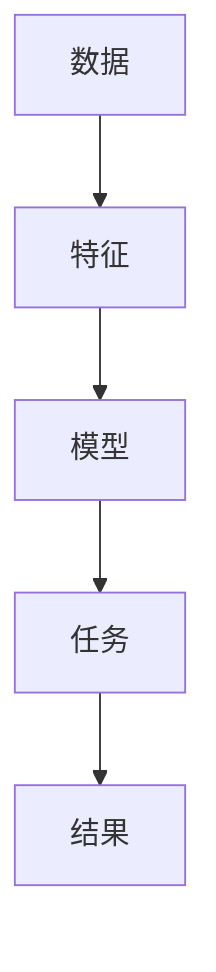
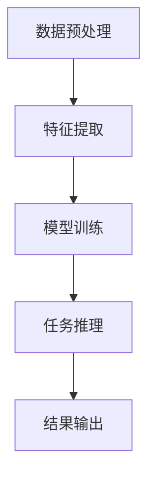

                 


# 自监督学习：减少AI Agent的标注数据依赖

## 关键词：自监督学习，AI Agent，数据标注，对比学习，生成对抗网络

## 摘要：  
自监督学习是一种新兴的人工智能技术，能够在不依赖大量标注数据的情况下，通过预训练任务从未标注数据中提取有用特征。这对于AI Agent的开发尤为重要，因为标注数据的获取通常耗时、耗力且成本高昂。本文将从自监督学习的核心概念、算法原理、系统架构到实际项目实现，全面探讨如何利用自监督学习减少AI Agent对标注数据的依赖。

---

# 第一部分: 自监督学习的背景与问题背景

## 第1章: 自监督学习的背景与问题背景

### 1.1 数据标注的挑战

#### 1.1.1 数据标注的高昂成本  
数据标注是AI开发中的关键步骤，但其成本非常高昂。标注人员通常需要对数据进行人工分类、标记或注释，这一过程不仅需要大量时间，还需要专业知识。例如，训练一个图像分类模型可能需要数以万计的标注图像，而每张图像的标注可能需要几分钟甚至更长时间。

#### 1.1.2 数据标注的不一致性和主观性  
不同标注人员可能会对同一数据产生不同的标注结果，这会导致数据不一致性和标注的主观性问题。例如，在图像标注中，不同标注人员可能对物体的边界或类别判断存在差异，这会直接影响模型的训练效果。

#### 1.1.3 数据标注的局限性与不足  
数据标注的局限性主要体现在以下方面：标注数据的覆盖范围有限，难以应对未知场景；标注数据的质量参差不齐，可能引入噪声；标注数据的更新和维护成本高昂。

### 1.2 AI Agent的标注数据依赖问题

#### 1.2.1 AI Agent的核心功能与数据需求  
AI Agent需要处理的任务通常涉及感知、推理和决策，这些功能都需要大量高质量的标注数据来训练模型。例如，智能客服需要理解用户的问题，自动驾驶需要识别道路和物体。

#### 1.2.2 监督学习的局限性  
监督学习依赖于大量标注数据，但在实际应用中，获取高质量的标注数据往往非常困难。此外，监督学习模型对标注数据的质量和数量要求较高，这限制了其在资源有限的场景中的应用。

#### 1.2.3 数据标注对AI Agent的制约  
数据标注的高昂成本和不一致性严重制约了AI Agent的开发和部署。特别是在需要实时响应和自适应能力的场景中，标注数据的限制更加明显。

---

## 第2章: 自监督学习的核心概念与原理

### 2.1 自监督学习的定义与特点

#### 2.1.1 自监督学习的定义  
自监督学习是一种无监督学习的变体，其核心思想是利用未标注数据的内在结构信息，通过设计适当的预训练任务，从数据本身中学习有用的特征表示。

#### 2.1.2 自监督学习的核心特点  
自监督学习有以下几个关键特点：  
1. **无监督学习**：依赖未标注数据，无需人工标注。  
2. **自适应性**：能够根据数据本身的特点自动生成任务。  
3. **特征学习**：目标是从数据中提取有用的特征表示。  

#### 2.1.3 自监督学习与监督学习的区别  
| 对比维度 | 监督学习 | 自监督学习 |  
|----------|----------|------------|  
| 数据需求 | 需要标注数据 | 仅需要未标注数据 |  
| 模型目标 | 学习任务直接与标注数据相关 | 学习任务由数据本身决定 |  
| 应用场景 | 数据充足且标注容易 | 数据充足但标注困难 |  

### 2.2 自监督学习的主要方法

#### 2.2.1 对比学习  
对比学习是一种常见的自监督学习方法，其核心思想是通过比较不同数据样本之间的相似性，学习数据的特征表示。例如，可以将同一数据的两种不同增强方式作为正样本，其他数据作为负样本，学习其特征表示。

#### 2.2.2 生成对抗网络  
生成对抗网络（GAN）是一种自监督学习方法，通过生成器和判别器的对抗训练，从数据中学习特征表示。生成器的目标是生成与真实数据相似的数据，而判别器的目标是区分真实数据和生成数据。

#### 2.2.3 掩码预测  
掩码预测是一种自监督学习方法，通过在数据中掩盖部分信息，让模型预测被掩盖部分的内容。例如，在图像中掩盖一部分区域，让模型预测被掩盖区域的内容。

#### 2.2.4 其他自监督学习方法  
除了对比学习、生成对抗网络和掩码预测，还有许多其他自监督学习方法，例如旋转预测、线性归一化、聚类等。

### 2.3 自监督学习的核心概念与联系

#### 2.3.1 自监督学习的核心原理  
自监督学习的核心思想是通过设计适当的预训练任务，从未标注数据中学习特征表示。例如，在对比学习中，通过比较不同数据样本之间的相似性，学习数据的特征表示。

#### 2.3.2 自监督学习与监督学习的对比  
| 对比维度 | 监督学习 | 自监督学习 |  
|----------|----------|------------|  
| 数据需求 | 需要标注数据 | 仅需要未标注数据 |  
| 模型目标 | 学习任务直接与标注数据相关 | 学习任务由数据本身决定 |  
| 应用场景 | 数据充足且标注容易 | 数据充足但标注困难 |  

#### 2.3.3 自监督学习的ER实体关系图  


---

## 第3章: 自监督学习的算法原理

### 3.1 对比学习算法原理

#### 3.1.1 对比学习的数学模型  
对比学习的目标是通过比较不同数据样本之间的相似性，学习数据的特征表示。其数学模型通常包括以下部分：  
- **编码器**：将数据映射到特征空间。  
- **对比损失函数**：衡量编码器输出的特征向量之间的相似性。  

对比学习的损失函数通常采用InfoNCE损失函数，其公式如下：  
$$ L = -\log \frac{e^{f(x_i, x_j)}}{e^{f(x_i, x_k)} + e^{f(x_j, x_k)}}} $$  
其中，$f(x_i, x_j)$表示数据样本$x_i$和$x_j$之间的相似性。

#### 3.1.2 对比学习的实现代码  
以下是一个简单的对比学习实现代码示例：  
```python
import torch
import torch.nn as nn

class Encoder(nn.Module):
    def __init__(self, input_dim, hidden_dim):
        super(Encoder, self).__init__()
        self.linear = nn.Linear(input_dim, hidden_dim)
    
    def forward(self, x):
        return self.linear(x)

class ContrastiveLoss(nn.Module):
    def __init__(self, temperature=1.0):
        super(ContrastiveLoss, self).__init__()
        self.temperature = temperature
    
    def forward(self, feature1, feature2):
        # 计算相似性
        similarity = torch.cosine_similarity(feature1, feature2)
        # 归一化相似性
        similarity = torch.exp(similarity / self.temperature)
        # 计算损失
        loss = -torch.log(similarity.mean())
        return loss

# 初始化编码器和损失函数
encoder = Encoder(input_dim=256, hidden_dim=128)
loss_fn = ContrastiveLoss()

# 假设输入数据x1和x2
x1 = torch.randn(1, 256)
x2 = torch.randn(1, 256)

# 编码特征
feature1 = encoder(x1)
feature2 = encoder(x2)

# 计算损失
loss = loss_fn(feature1, feature2)
print("对比学习损失:", loss.item())
```

#### 3.1.3 对比学习的数学公式详细解读  
对比学习的目标是通过比较不同数据样本之间的相似性，学习数据的特征表示。其数学模型通常包括以下部分：  
- **编码器**：将数据映射到特征空间。  
- **对比损失函数**：衡量编码器输出的特征向量之间的相似性。  

对比学习的损失函数通常采用InfoNCE损失函数，其公式如下：  
$$ L = -\log \frac{e^{f(x_i, x_j)}}{e^{f(x_i, x_k)} + e^{f(x_j, x_k)}}} $$  
其中，$f(x_i, x_j)$表示数据样本$x_i$和$x_j$之间的相似性。

---

## 第4章: 系统分析与架构设计

### 4.1 系统分析

#### 4.1.1 系统功能设计  
AI Agent的系统功能设计通常包括以下几个方面：  
1. **数据预处理**：对未标注数据进行清洗、增强和归一化处理。  
2. **特征提取**：通过自监督学习算法从未标注数据中提取特征表示。  
3. **模型训练**：利用提取的特征表示进行模型训练和优化。  
4. **任务推理**：将模型应用于实际任务中，进行推理和决策。  

#### 4.1.2 系统架构设计  
以下是AI Agent的系统架构设计：  


#### 4.1.3 系统接口设计  
系统接口设计包括以下内容：  
- **数据输入接口**：接收未标注数据。  
- **特征提取接口**：输出特征表示。  
- **模型训练接口**：输出训练好的模型。  
- **任务推理接口**：输出推理结果。  

### 4.2 架构设计

#### 4.2.1 预训练任务设计  
预训练任务的设计是自监督学习的核心，其目标是从未标注数据中提取有用的特征表示。例如，在图像领域，可以通过旋转预测任务来学习图像的旋转不变性。

#### 4.2.2 特征提取器设计  
特征提取器是自监督学习系统的核心组件，其设计直接影响特征表示的质量。例如，在图像领域，可以使用卷积神经网络（CNN）作为特征提取器。

#### 4.2.3 自监督学习与其他组件的交互  
自监督学习系统需要与其他组件（如数据预处理、模型训练和任务推理）进行交互，确保整个系统的协调运行。

---

## 第5章: 项目实战

### 5.1 项目环境安装

#### 5.1.1 安装Python和依赖库  
需要安装以下依赖库：  
- PyTorch  
- TensorFlow  
- scikit-learn  

#### 5.1.2 安装自监督学习库  
可以使用以下自监督学习库：  
- contrastive-loss  
- simCLR  

### 5.2 系统核心实现

#### 5.2.1 数据准备  
需要准备未标注数据，例如图像数据或文本数据。

#### 5.2.2 模型实现  
实现自监督学习模型，例如对比学习模型。

#### 5.2.3 训练过程  
对模型进行训练，得到特征提取器。

#### 5.2.4 应用部署  
将训练好的模型应用于实际任务中。

### 5.3 代码实现与解读

#### 5.3.1 数据准备代码  
```python
import torch
import torch.utils.data as data_utils

# 假设我们有一个未标注图像数据集
class ImageDataset(data_utils.Dataset):
    def __init__(self, data):
        self.data = data
    
    def __len__(self):
        return len(self.data)
    
    def __getitem__(self, idx):
        return self.data[idx]

# 创建数据集和数据加载器
data = torch.randn(100, 256)  # 示例数据
dataset = ImageDataset(data)
dataloader = data_utils.DataLoader(dataset, batch_size=32, shuffle=True)
```

#### 5.3.2 模型实现代码  
```python
import torch
import torch.nn as nn

class Encoder(nn.Module):
    def __init__(self, input_dim, hidden_dim):
        super(Encoder, self).__init__()
        self.linear = nn.Linear(input_dim, hidden_dim)
    
    def forward(self, x):
        return self.linear(x)

# 初始化编码器
encoder = Encoder(input_dim=256, hidden_dim=128)

# 定义损失函数
loss_fn = nn.CrossEntropyLoss()

# 定义优化器
optimizer = torch.optim.Adam(encoder.parameters(), lr=0.001)

# 训练过程
for epoch in range(10):
    for batch in dataloader:
        optimizer.zero_grad()
        features = encoder(batch)
        # 假设标签是真实标签
        loss = loss_fn(features, labels)
        loss.backward()
        optimizer.step()
```

### 5.4 案例分析与详细讲解

#### 5.4.1 案例分析  
以图像分类任务为例，通过自监督学习预训练任务，提取图像特征表示，然后进行图像分类。

#### 5.4.2 实际案例分析  
假设我们有一个图像分类任务，类别数为10。我们首先通过自监督学习从未标注图像中提取特征表示，然后利用这些特征表示进行图像分类。

---

## 第6章: 最佳实践与小结

### 6.1 小结

#### 6.1.1 自监督学习的优势  
自监督学习能够在不依赖标注数据的情况下，从未标注数据中学习特征表示。这大大减少了数据标注的成本和时间。

#### 6.1.2 自监督学习的局限性  
自监督学习的模型性能可能不如监督学习，尤其是在标注数据充足的情况下。

### 6.2 注意事项

#### 6.2.1 数据质量  
未标注数据的质量对自监督学习的效果有重要影响。需要确保数据的多样性和代表性。

#### 6.2.2 模型选择  
选择合适的自监督学习方法和模型架构，能够显著提高模型的性能。

### 6.3 拓展阅读

#### 6.3.1 自监督学习的最新研究  
阅读最新的自监督学习论文，了解其最新进展。

#### 6.3.2 相关技术  
了解与自监督学习相关的技术，例如无监督学习、半监督学习等。

---

## 作者：AI天才研究院/AI Genius Institute & 禅与计算机程序设计艺术 /Zen And The Art of Computer Programming

