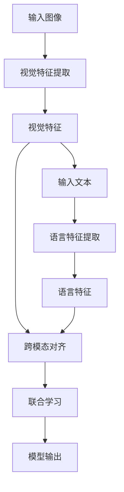
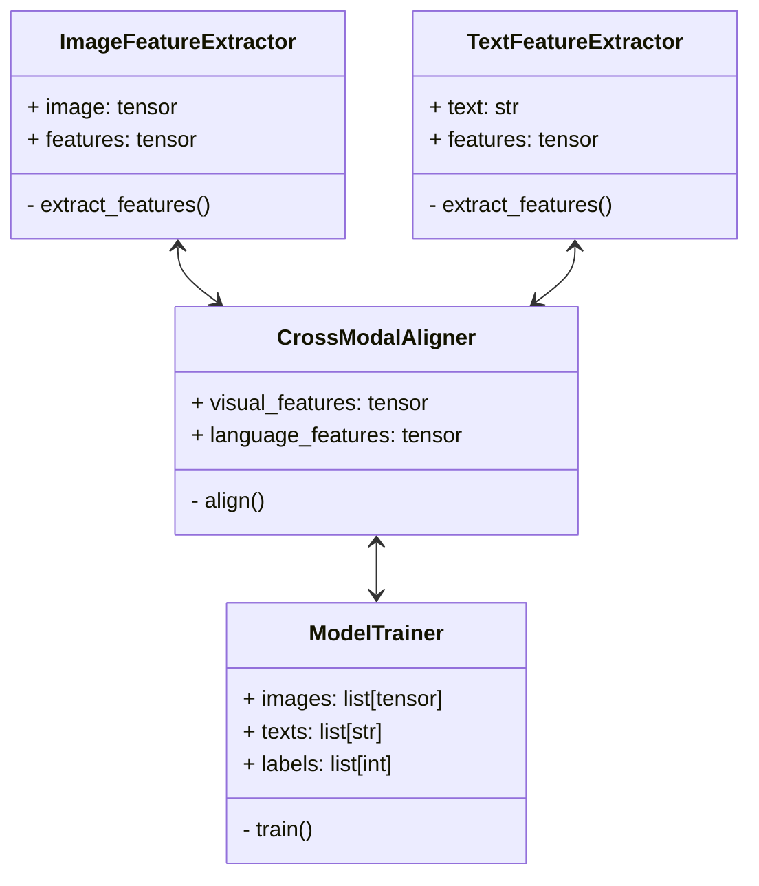
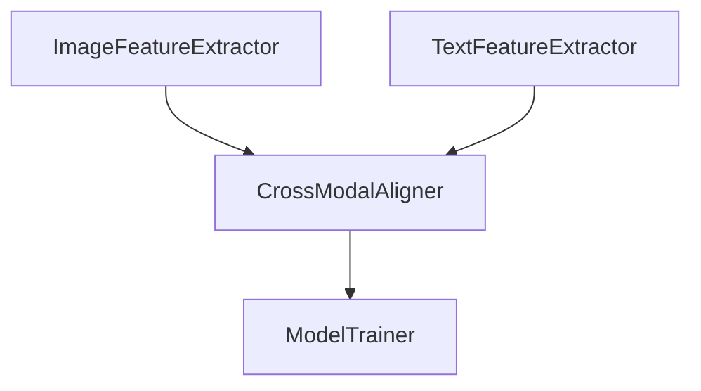
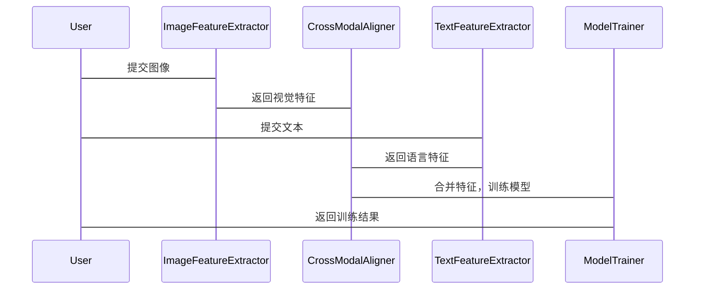

                 


# 视觉-语言协同AI Agent：LLM与计算机视觉的深度融合

> 关键词：视觉-语言协同，LLM，计算机视觉，多模态AI，深度学习

> 摘要：本文深入探讨视觉-语言协同AI Agent的核心概念、算法原理和系统架构。通过分析多模态AI的发展现状，阐述视觉与语言协同的重要性，详细讲解LLM与计算机视觉的深度融合技术，包括模型构建、训练优化、应用场景等内容，最后结合实际案例展示视觉-语言协同AI Agent的实现与应用。

---

# 第一部分: 视觉-语言协同AI Agent概述

## 第1章: 视觉-语言协同的背景与问题背景

### 1.1 视觉-语言协同的背景

#### 1.1.1 多模态AI的发展现状
多模态人工智能（Multi-modal AI）近年来取得了显著进展，尤其是在视觉、语言和听觉等模态的融合方面。视觉和语言的协同已经成为多模态AI的重要研究方向，广泛应用于图像描述生成、视觉问答、图像检索等领域。

#### 1.1.2 视觉与语言协同的重要性
视觉和语言是人类感知世界的主要方式。通过将视觉信息与语言信息相结合，AI系统能够更准确地理解输入数据，并生成更符合人类认知的输出结果。例如，在图像描述生成任务中，系统需要同时理解图像内容和生成相应的文字描述。

#### 1.1.3 当前技术的痛点与挑战
尽管多模态AI取得了显著进展，但视觉与语言的协同仍然面临许多挑战，例如：
- **跨模态对齐**：不同模态的数据具有不同的特征维度，如何有效地对齐这些特征是一个难题。
- **信息丢失**：在跨模态数据处理过程中，可能会丢失部分信息，影响最终的性能。
- **计算资源需求**：视觉和语言任务通常需要大量的计算资源，如何在有限的资源下实现高效的协同是一个挑战。

---

## 第2章: 视觉-语言协同的核心概念与问题描述

### 2.1 视觉-语言协同的定义

#### 2.1.1 视觉与语言的融合方式
视觉-语言协同可以通过以下几种方式实现：
- **特征对齐**：将视觉特征和语言特征对齐，例如通过注意力机制将图像特征与单词或短语对齐。
- **联合学习**：在模型训练过程中同时优化视觉和语言任务，例如通过端到端的多模态模型实现。
- **知识共享**：在视觉和语言任务之间共享知识，例如通过预训练模型实现跨模态的知识迁移。

#### 2.1.2 协同的目标与应用场景
视觉-语言协同的目标是通过结合视觉和语言信息，提高AI系统的理解和生成能力。应用场景包括：
- 图像描述生成
- 视觉问答系统
- 图像检索与推荐
- 多语言视觉任务

### 2.2 问题背景分析

#### 2.2.1 视觉与语言分离的局限性
传统的视觉和语言处理方法通常是分离的，例如使用CNN处理图像，使用LLM处理文本。这种分离式的方法难以充分利用跨模态信息，限制了系统的性能。

#### 2.2.2 多模态任务中的信息整合难题
在多模态任务中，如何有效地整合视觉和语言信息是一个难题。例如，在视觉问答系统中，系统需要同时理解图像内容和问题，才能生成准确的回答。

### 2.3 问题解决思路

#### 2.3.1 多模态模型的设计原则
- **跨模态对齐**：通过模型结构或训练方法实现视觉和语言特征的对齐。
- **联合学习**：在模型训练过程中同时优化视觉和语言任务。
- **知识共享**：通过预训练或微调实现跨模态知识的共享。

#### 2.3.2 视觉-语言协同的实现路径
- **端到端的多模态模型**：设计端到端的模型结构，直接对跨模态数据进行处理。
- **预训练与微调**：利用大规模多模态数据进行预训练，然后在特定任务上进行微调。
- **注意力机制**：通过注意力机制实现跨模态特征的对齐和聚焦。

---

## 第3章: 视觉-语言协同的核心要素与边界

### 3.1 核心要素分析

#### 3.1.1 视觉特征提取
- **CNN**：用于提取图像的视觉特征，例如使用ResNet、VGG等网络结构。
- **Transformer**：在视觉任务中，Transformer逐渐被用于全局特征建模，例如Vision Transformer（ViT）。

#### 3.1.2 语言模型构建
- **LLM**：如GPT、BERT等大语言模型，用于处理文本信息。
- **多任务学习**：通过多任务学习增强模型的跨模态理解能力。

#### 3.1.3 跨模态对齐机制
- **跨模态注意力**：例如图像特征与文本单词的对齐。
- **对齐损失**：通过损失函数约束视觉和语言特征的相似性。

### 3.2 边界与外延

#### 3.2.1 单模态任务的边界
- 单模态任务仅处理单一模态数据，例如仅处理图像或仅处理文本。
- 单模态任务的性能依赖于该模态数据的质量和模型的优化。

#### 3.2.2 跨模态任务的扩展性
- 跨模态任务可以通过扩展模型结构或引入新的模态数据进行扩展，例如从视觉-语言扩展到视觉-语言-听觉三模态。

#### 3.2.3 与其他AI技术的协同关系
- 与其他AI技术（如NLP、CV）的协同可以进一步提升系统的性能，例如结合强化学习进行模型优化。

---

# 第二部分: 视觉-语言协同的核心概念与联系

## 第4章: 视觉-语言协同的核心原理

### 4.1 视觉模型的基本原理

#### 4.1.1 CNN与视觉特征提取
- **CNN**：通过卷积操作提取图像的空间特征。
- **多尺度特征提取**：通过不同尺寸的卷积核提取多层次的图像特征。

#### 4.1.2 Transformer在视觉任务中的应用
- **Vision Transformer (ViT)**：将图像划分为块，编码为序列，然后通过Transformer进行全局特征建模。
- **多模态Transformer**：在视觉-语言任务中，可以同时处理图像和文本序列，通过交叉注意力机制实现跨模态对齐。

### 4.2 语言模型的基本原理

#### 4.2.1 LLM的架构与训练方法
- **Transformer架构**：由编码器和解码器组成，通过自注意力机制处理序列数据。
- **预训练与微调**：通过大规模数据预训练，然后在特定任务上进行微调。

#### 4.2.2 语言模型的多任务学习能力
- **多任务学习**：通过共享的表示层同时优化多个任务，例如视觉问答和图像描述生成。

### 4.3 视觉-语言协同的实现机制

#### 4.3.1 跨模态对齐技术
- **跨模态注意力**：通过注意力机制将图像特征与文本序列对齐。
- **对齐损失**：在训练过程中，通过损失函数约束视觉和语言特征的相似性。

#### 4.3.2 联合学习框架
- **端到端模型**：设计端到端的模型结构，直接对跨模态数据进行处理。
- **预训练与微调**：利用大规模多模态数据进行预训练，然后在特定任务上进行微调。

#### 4.3.3 知识共享机制
- **知识表示共享**：通过共享的表示层实现跨模态知识的共享。
- **跨模态迁移学习**：利用预训练的跨模态知识进行迁移学习。

---

## 第5章: 视觉-语言协同的核心概念对比

### 5.1 视觉与语言的对比分析

#### 5.1.1 特征维度对比
- **视觉特征**：通常为高维向量，例如2048维的图像特征。
- **语言特征**：通常为低维向量，例如512维的文本特征。

#### 5.1.2 任务目标对比
- **视觉任务**：例如图像分类、目标检测，目标是通过视觉特征进行分类或定位。
- **语言任务**：例如文本分类、问答系统，目标是通过语言特征进行生成或分类。

#### 5.1.3 数据类型对比
- **视觉数据**：图像、视频等。
- **语言数据**：文本、语音等。

### 5.2 协同与非协同模式的对比

#### 5.2.1 协同模式的优势
- **信息互补**：通过结合视觉和语言信息，提高系统的理解和生成能力。
- **性能提升**：协同模式通常比单模态任务具有更高的性能。

#### 5.2.2 非协同模式的局限性
- **信息孤岛**：单模态任务难以充分利用跨模态信息。
- **性能受限**：由于缺乏跨模态信息的支持，系统性能可能受限。

### 5.3 实体关系图分析

#### 5.3.1 实体关系图的构建
- **实体识别**：从图像和文本中提取实体，例如“猫”、“狗”等。
- **关系抽取**：从图像和文本中抽取实体之间的关系，例如“猫在桌子上”。

#### 5.3.2 关系图的可视化展示
- 使用图数据库（如Neo4j）构建关系图，展示实体之间的关系。
- 使用可视化工具（如Gephi）对关系图进行可视化展示。

#### 5.3.3 关系图在协同任务中的应用
- **图像描述生成**：通过关系图生成更准确的图像描述。
- **视觉问答系统**：通过关系图帮助系统理解图像内容和问题。

---

# 第三部分: 视觉-语言协同的算法原理

## 第6章: 视觉-语言协同模型的算法原理

### 6.1 模型的整体架构

#### 6.1.1 多模态输入处理
- **图像输入**：将图像输入到视觉模型中，提取视觉特征。
- **文本输入**：将文本输入到语言模型中，提取语言特征。

#### 6.1.2 跨模态特征对齐
- **跨模态注意力**：通过注意力机制将图像特征与文本特征对齐。
- **对齐损失**：在训练过程中，通过损失函数约束视觉和语言特征的相似性。

#### 6.1.3 联合学习机制
- **端到端模型**：设计端到端的模型结构，直接对跨模态数据进行处理。
- **预训练与微调**：利用大规模多模态数据进行预训练，然后在特定任务上进行微调。

### 6.2 算法流程图



### 6.3 算法实现代码

#### 6.3.1 数据处理代码

```python
import torch
from torch.utils.data import Dataset, DataLoader

class ViTLTDataset(Dataset):
    def __init__(self, images, texts, labels):
        self.images = images
        self.texts = texts
        self.labels = labels

    def __len__(self):
        return len(self.images)

    def __getitem__(self, idx):
        image = self.images[idx]
        text = self.texts[idx]
        label = self.labels[idx]
        return image, text, label

def collate_fn(batch):
    images, texts, labels = zip(*batch)
    images = torch.stack(images)
    texts = torch.stack(texts)
    labels = torch.stack(labels)
    return images, texts, labels

dataloader = DataLoader(vit_lt_dataset, batch_size=32, shuffle=True, collate_fn=collate_fn)
```

#### 6.3.2 模型构建代码

```python
import torch
import torch.nn as nn
import torch.nn.functional as F

class ViT_LLM(nn.Module):
    def __init__(self, visual_dim, language_dim, hidden_size):
        super(ViT_LLM, self).__init__()
        self.visual_layer = nn.Linear(visual_dim, hidden_size)
        self.language_layer = nn.Linear(language_dim, hidden_size)
        self.attention = nn.MultiheadAttention(hidden_size, num_heads=8)
        self.dropout = nn.Dropout(0.1)
        self.output_layer = nn.Linear(hidden_size, 1)

    def forward(self, visual_features, language_features):
        visual_hidden = self.visual_layer(visual_features)
        language_hidden = self.language_layer(language_features)
        combined = torch.cat([visual_hidden, language_hidden], dim=1)
        output, _ = self.attention(combined.unsqueeze(0), combined.unsqueeze(0), combined.unsqueeze(0))
        output = output.squeeze(0)
        output = self.dropout(output)
        output = self.output_layer(output)
        return output
```

#### 6.3.3 训练与优化代码

```python
model = ViT_LLM(visual_dim=2048, language_dim=512, hidden_size=1024)
optimizer = torch.optim.Adam(model.parameters(), lr=1e-4)
criterion = nn.BCEWithLogitsLoss()

for epoch in range(num_epochs):
    for images, texts, labels in dataloader:
        optimizer.zero_grad()
        outputs = model(images, texts)
        loss = criterion(outputs, labels.float())
        loss.backward()
        optimizer.step()
```

### 6.4 算法的数学模型和公式

#### 6.4.1 注意力机制
$$
\text{Attention}(Q, K, V) = \text{softmax}\left(\frac{QK^T}{\sqrt{d_k}}\right)V
$$

其中：
- \( Q \)：查询向量
- \( K \)：键向量
- \( V \)：值向量
- \( d_k \)：向量维度

#### 6.4.2 损失函数
$$
\text{Loss} = \frac{1}{N}\sum_{i=1}^{N} \left( y_i \log p_i + (1 - y_i) \log (1 - p_i) \right)
$$

其中：
- \( y_i \)：真实标签
- \( p_i \)：模型预测概率

---

## 第7章: 视觉-语言协同模型的系统分析与架构设计

### 7.1 问题场景介绍

#### 7.1.1 应用场景
- **图像描述生成**：给定一张图像，生成相应的文字描述。
- **视觉问答系统**：根据图像和问题，生成准确的回答。
- **图像检索与推荐**：基于图像和文本进行检索和推荐。

### 7.2 系统功能设计

#### 7.2.1 领域模型类图



#### 7.2.2 系统架构图



#### 7.2.3 接口设计
- **图像输入接口**：接受图像数据，提取视觉特征。
- **文本输入接口**：接受文本数据，提取语言特征。
- **模型训练接口**：结合视觉和语言特征，训练模型。
- **模型推理接口**：根据输入的图像和文本，生成输出结果。

#### 7.2.4 交互序列图



---

## 第8章: 视觉-语言协同模型的项目实战

### 8.1 环境安装

```bash
pip install torch torchvision transformers
```

### 8.2 系统核心实现源代码

#### 8.2.1 数据处理代码

```python
import torch
from torch.utils.data import Dataset, DataLoader
import numpy as np

class ViTLTDataset(Dataset):
    def __init__(self, images, texts, labels):
        self.images = images
        self.texts = texts
        self.labels = labels

    def __len__(self):
        return len(self.images)

    def __getitem__(self, idx):
        image = self.images[idx]
        text = self.texts[idx]
        label = self.labels[idx]
        return image, text, label

def collate_fn(batch):
    images, texts, labels = zip(*batch)
    images = torch.stack(images)
    texts = torch.stack(texts)
    labels = torch.stack(labels)
    return images, texts, labels

dataloader = DataLoader(vit_lt_dataset, batch_size=32, shuffle=True, collate_fn=collate_fn)
```

#### 8.2.2 模型实现代码

```python
import torch
import torch.nn as nn
import torch.nn.functional as F

class ViT_LLM(nn.Module):
    def __init__(self, visual_dim, language_dim, hidden_size):
        super(ViT_LLM, self).__init__()
        self.visual_layer = nn.Linear(visual_dim, hidden_size)
        self.language_layer = nn.Linear(language_dim, hidden_size)
        self.attention = nn.MultiheadAttention(hidden_size, num_heads=8)
        self.dropout = nn.Dropout(0.1)
        self.output_layer = nn.Linear(hidden_size, 1)

    def forward(self, visual_features, language_features):
        visual_hidden = self.visual_layer(visual_features)
        language_hidden = self.language_layer(language_features)
        combined = torch.cat([visual_hidden, language_hidden], dim=1)
        output, _ = self.attention(combined.unsqueeze(0), combined.unsqueeze(0), combined.unsqueeze(0))
        output = output.squeeze(0)
        output = self.dropout(output)
        output = self.output_layer(output)
        return output
```

#### 8.2.3 训练代码

```python
model = ViT_LLM(visual_dim=2048, language_dim=512, hidden_size=1024)
optimizer = torch.optim.Adam(model.parameters(), lr=1e-4)
criterion = nn.BCEWithLogitsLoss()

for epoch in range(num_epochs):
    for images, texts, labels in dataloader:
        optimizer.zero_grad()
        outputs = model(images, texts)
        loss = criterion(outputs, labels.float())
        loss.backward()
        optimizer.step()
```

### 8.3 实际案例分析与详细讲解

#### 8.3.1 数据集选择与处理
- 数据集：使用COCO数据集进行图像描述生成任务。
- 数据预处理：将图像进行归一化处理，将文本进行分词和编码。

#### 8.3.2 模型训练与优化
- 训练参数：批量大小为32，学习率为1e-4，训练轮数为10。
- 模型评估：在验证集上进行评估，计算准确率、召回率和F1分数。

#### 8.3.3 模型推理与结果分析
- 推理过程：输入一张图像和相关问题，生成相应的图像描述或回答。
- 结果分析：通过混淆矩阵和误差分析，找出模型的不足之处，进一步优化模型。

---

## 第9章: 视觉-语言协同模型的最佳实践与拓展阅读

### 9.1 最佳实践 tips
- **数据质量**：确保图像和文本数据的质量，尽可能多样化和平衡。
- **模型选择**：根据任务需求选择合适的模型架构，例如使用Vision Transformer进行图像特征提取。
- **训练策略**：合理设置训练参数，例如批量大小、学习率和训练轮数。
- **模型优化**：通过早停、学习率衰减等方法优化模型性能。

### 9.2 小结
视觉-语言协同AI Agent通过结合视觉和语言信息，显著提升了AI系统的理解和生成能力。本文从核心概念、算法原理到系统设计和项目实战，全面介绍了视觉-语言协同技术。

### 9.3 注意事项
- **计算资源**：视觉-语言协同任务通常需要大量的计算资源，建议使用GPU加速训练。
- **数据隐私**：在处理图像和文本数据时，需要注意数据隐私和安全问题。
- **模型解释性**：视觉-语言协同模型通常较为复杂，模型的解释性可能较差，需要注意模型的可解释性。

### 9.4 拓展阅读
- **多模态AI**：深入学习多模态AI的理论和应用。
- **视觉问答系统**：研究视觉问答系统的最新进展和挑战。
- **跨模态对齐技术**：探索跨模态对齐的最新技术，例如基于对比学习的对齐方法。

---

# 结语

视觉-语言协同AI Agent是多模态AI的重要研究方向，通过深度融合视觉和语言信息，显著提升了AI系统的性能。本文从理论到实践，全面介绍了视觉-语言协同技术，希望对读者在相关领域的研究和实践有所帮助。

---

# 作者

**作者：AI天才研究院/AI Genius Institute & 禅与计算机程序设计艺术 /Zen And The Art of Computer Programming**

---

