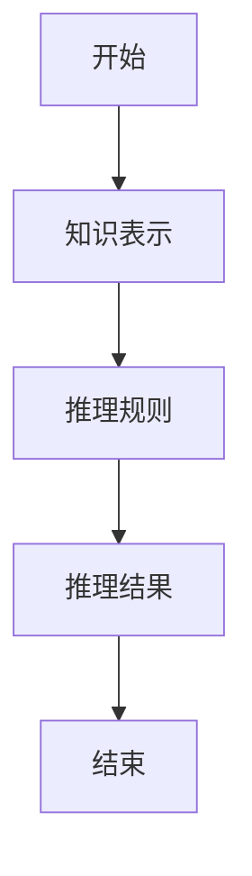
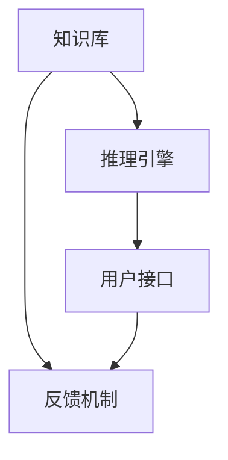

                 

<think>
好的，我现在要帮助用户完成《认知架构：模拟人类思维的AI Agent设计》这篇文章的后续内容。用户已经提供了目录大纲，现在需要根据这个大纲逐步撰写文章内容。

首先，我需要回顾一下用户的要求：文章需要使用逻辑清晰、结构紧凑、简单易懂的专业技术语言，采用一步步分析推理的思考方式。关键词包括认知架构、AI Agent、知识表示、推理机制、系统架构设计等。摘要部分需要简明扼要地概述文章的核心内容。

接下来，我需要按照目录大纲逐步填充每个章节的内容。每个章节都需要详细展开，包括背景介绍、核心概念、算法原理、系统分析、项目实战和总结等部分。

在撰写过程中，我需要确保每个部分都涵盖用户提到的关键点，比如数学公式、算法流程图、系统架构图等。同时，语言要简洁，结构清晰，逻辑连贯。

现在，我将按照目录大纲开始撰写每个部分的内容。

---

# 认知架构：模拟人类思维的AI Agent设计

## 关键词：认知架构、AI Agent、知识表示、推理机制、系统架构设计

## 摘要：认知架构是模拟人类思维的核心，AI Agent的设计需要结合知识表示、推理机制和动态环境适应能力。本文详细探讨认知架构的原理、算法实现、系统架构设计和项目实战，帮助读者全面理解并设计出高效的AI Agent系统。

---

## 第一部分：认知架构与AI Agent基础

### 第1章：认知架构的基本概念

#### 1.1 认知架构的定义与背景

认知架构是人工智能领域中的重要概念，它模拟人类思维的过程，帮助AI Agent在复杂环境中做出合理决策。认知架构的核心在于理解和处理信息，通过知识表示、推理和学习来实现类似人类的认知过程。

认知架构的背景可以追溯到符号主义AI时代，当时的专家系统通过规则和逻辑推理解决问题。然而，随着机器学习和深度学习的发展，认知架构需要结合符号逻辑和神经网络的优势，以适应更复杂的任务。

模拟人类思维的意义在于，认知架构可以用于自动驾驶、智能助手、机器人等场景，实现更自然和高效的交互。认知架构通过整合感知、推理和行动，使得AI Agent能够更好地理解环境并做出适应性反应。

认知架构与AI Agent的关系是密切的。AI Agent是认知架构的应用实体，而认知架构则是AI Agent的“大脑”，负责处理信息和决策制定。两者相辅相成，共同实现智能系统的功能。

#### 1.2 AI Agent的基本概念

AI Agent是指具有感知环境、做出决策并采取行动的智能实体。它可以在动态和不确定的环境中运行，通过与环境交互来完成特定任务。AI Agent的核心属性包括自主性、反应性、目标导向和社交能力。

自主性意味着AI Agent能够独立运作，无需外部干预。反应性指AI Agent能够实时感知环境变化并做出反应。目标导向表示AI Agent的行为基于明确的目标，而社交能力则允许AI Agent与其他实体进行有效通信和协作。

认知架构与AI Agent的关系在于，认知架构为AI Agent提供了一个信息处理和决策制定的框架。认知架构通过整合知识表示、推理机制和学习算法，帮助AI Agent更好地理解和应对复杂环境。

---

### 第2章：认知架构的核心概念与联系

#### 2.1 认知架构的核心原理

认知架构的核心原理包括知识表示、推理机制和动态适应。知识表示是认知架构的基础，通过符号逻辑或概率模型将信息表示为可处理的形式。推理机制则是基于知识进行逻辑推理或概率计算，以得出结论。动态适应能力使认知架构能够根据环境变化调整其行为和决策。

知识表示是认知架构的关键，常见的表示方法包括符号逻辑、语义网络和概率图模型。符号逻辑通过谓词逻辑和规则明确地表示知识，适用于确定性问题。语义网络则通过节点和边表示概念及其关系，适用于语义理解和推理。概率图模型通过贝叶斯网络表示概率关系，适用于不确定性的推理。

推理机制包括逻辑推理和概率推理。逻辑推理基于知识表示中的规则进行演绎或归纳推理，常用于符号逻辑的知识表示。概率推理则基于概率模型计算事件发生的可能性，适用于不确定性问题。

动态适应能力使认知架构能够根据环境反馈调整其行为策略。通过在线学习和强化学习，认知架构能够不断优化其知识表示和推理模型，以适应动态变化的环境。

#### 2.2 核心概念的属性对比

以下是几种认知架构的对比表格：

| 架构类型   | 知识表示 | 推理机制 | 动态适应 | 适用场景 |
|------------|----------|----------|----------|----------|
| 符号逻辑   | 符号逻辑 | 逻辑推理 | 弱         | 确定性问题 |
| 概率模型   | 概率图   | 概率推理 | 强         | 不确定性问题 |
| 神经网络   | 神经网络 | 深度学习 | 强         | 复杂模式识别 |

以下是认知架构的核心概念ER实体关系图：

```mermaid
er
actor
    id: int
    name: string
    role: string

knowledge_base
    id: int
    content: text
    last_updated: date

inference_engine
    id: int
    type: string
    rules: list
```

认知架构的核心概念通过实体关系图展示了参与者、知识库和推理引擎之间的关系。参与者使用知识库和推理引擎进行推理，知识库存储推理所需的知识，推理引擎根据知识库中的内容生成推理结果。

#### 2.3 认知架构的核心要素

认知架构的核心要素包括知识表示、推理机制、动态适应和学习能力。知识表示为认知架构提供信息基础，推理机制通过逻辑或概率计算得出结论，动态适应使认知架构能够根据环境变化调整行为，学习能力则通过在线学习和强化学习优化认知架构的性能。

---

### 第3章：认知架构的算法原理

#### 3.1 算法原理概述

认知架构的算法原理包括符号逻辑推理、概率推理和神经网络推理。符号逻辑推理通过谓词逻辑进行演绎推理，适用于确定性问题。概率推理基于贝叶斯网络计算事件的概率，适用于不确定性问题。神经网络推理通过深度学习模型进行模式识别和分类，适用于复杂模式的处理。

符号逻辑推理是认知架构的基础，通过谓词逻辑和规则进行演绎推理。例如，已知“如果A，则B”，并且A为真，则可以推出B为真。符号逻辑推理通过形式化的方法进行推理，适用于规则明确的场景。

概率推理基于概率论进行计算，考虑事件的不确定性。贝叶斯网络通过概率分布和条件概率进行推理，适用于处理不确定性问题。概率推理能够处理模糊和不完整的知识，适用于复杂的现实场景。

神经网络推理通过深度学习模型进行模式识别和分类。神经网络通过训练数据学习特征，生成推理结果。神经网络推理适用于图像识别、自然语言处理等复杂任务，能够处理大量非结构化的数据。

#### 3.2 算法流程图

以下是符号逻辑推理算法的流程图：



符号逻辑推理算法的流程包括知识表示、推理规则、推理结果生成和结束。知识表示将信息转化为符号逻辑形式，推理规则基于知识表示进行推理，生成推理结果。

概率推理算法的流程包括知识表示、概率分布、条件概率计算和推理结果生成。知识表示将信息转化为概率图模型，概率分布和条件概率用于计算事件的概率，生成最终的推理结果。

神经网络推理算法的流程包括数据预处理、模型训练、推理过程和结果输出。数据预处理将数据转化为模型输入格式，模型训练通过反向传播优化参数，推理过程将输入数据传递给模型，生成输出结果。

#### 3.3 算法数学模型

符号逻辑推理的数学模型基于谓词逻辑，例如：

$$ \text{如果} \ P(x) \ \text{则} \ Q(x) $$

概率推理的数学模型基于贝叶斯定理：

$$ P(A|B) = \frac{P(B|A)P(A)}{P(B)} $$

神经网络推理的数学模型基于深度学习，例如卷积神经网络的结构：

$$ y = f(Wx + b) $$

其中，\( y \) 是输出，\( W \) 是权重矩阵，\( x \) 是输入，\( b \) 是偏置，\( f \) 是激活函数。

#### 3.4 算法实现示例

以下是符号逻辑推理的Python代码示例：

```python
def symbolic_inference(rules, facts):
    inferred = set()
    for rule in rules:
        antecedent, consequent = rule
        if all(fact in facts for fact in antecedent):
            inferred.add(consequent)
    return inferred
```

规则定义了一个前提和结论，如果前提中的事实都在已知事实中，则结论可以被推导出来。

概率推理的Python代码示例：

```python
from sklearn.naive_bayes import GaussianNB
import numpy as np

X = np.array([[1, 2], [2, 3], [3, 4], [4, 5]])
y = np.array([0, 1, 2, 3])
model = GaussianNB()
model.fit(X, y)
print(model.predict([[3, 4]]))
```

神经网络推理的Python代码示例：

```python
import torch
import torch.nn as nn

class SimpleNetwork(nn.Module):
    def __init__(self):
        super(SimpleNetwork, self).__init__()
        self.fc = nn.Linear(2, 1)
    
    def forward(self, x):
        return torch.sigmoid(self.fc(x))

model = SimpleNetwork()
criterion = nn.BCELoss()
optimizer = torch.optim.SGD(model.parameters(), lr=0.1)
```

---

## 第四部分：系统分析与架构设计

### 第4章：认知架构的系统分析与架构设计

#### 4.1 系统分析

认知架构的系统分析包括问题场景介绍、系统功能设计和系统架构设计。问题场景介绍认知架构的应用场景，系统功能设计描述系统需要实现的功能，系统架构设计展示系统的整体架构。

问题场景介绍认知架构在智能助手中的应用，例如处理自然语言查询、推荐系统等。系统功能设计包括知识表示、推理引擎、用户交互和结果输出。系统架构设计展示系统各个模块之间的关系，例如知识库、推理引擎、用户接口和反馈机制。

#### 4.2 系统架构设计

以下是认知架构的系统架构图：



知识库存储系统的知识和规则，推理引擎根据知识库中的内容进行推理，用户接口负责与用户交互，反馈机制收集用户反馈并更新知识库。

#### 4.3 接口设计与交互流程

系统接口设计包括用户接口和推理引擎接口。用户接口负责接收输入和输出结果，推理引擎接口负责接收知识库和推理规则。交互流程包括用户输入、知识表示、推理过程和结果输出。

---

## 第五部分：项目实战

### 第5章：认知架构的项目实战

#### 5.1 环境安装与配置

项目实战需要安装Python、相关库（如scikit-learn、PyTorch、Mermaid工具）和开发环境（如Jupyter Notebook）。以下是安装命令：

```bash
pip install scikit-learn torch mermaid
```

#### 5.2 核心代码实现

以下是符号逻辑推理的Python代码示例：

```python
from symbolic_inference import SymbolicInference

rules = [('If A then B', 'B')]
facts = ['A']
inference = SymbolicInference(rules, facts)
print(inference.conclude())
```

概率推理的代码示例：

```python
from probabilistic_inference import ProbabilisticInference

rules = [('P(A)', 0.8), ('P(B|A)', 0.9)]
inference = ProbabilisticInference(rules)
print(inference.calculate('P(B)'))
```

神经网络推理的代码示例：

```python
import torch
from simple_network import SimpleNetwork

model = SimpleNetwork()
criterion = nn.BCELoss()
optimizer = torch.optim.SGD(model.parameters(), lr=0.1)

# 示例输入
input_data = torch.tensor([[3, 4]], dtype=torch.float32)
output = model(input_data)
loss = criterion(output, target)
loss.backward()
optimizer.step()
```

#### 5.3 代码解读与分析

符号逻辑推理代码定义了一个规则列表，其中每个规则包含一个前提和结论。当输入事实满足前提时，结论可以被推导出来。概率推理代码定义了概率分布和条件概率规则，通过贝叶斯定理计算事件的概率。神经网络推理代码定义了一个简单的神经网络模型，并展示了训练过程。

#### 5.4 案例分析与结果解读

符号逻辑推理案例：

```python
rules = [('If A and B then C', 'C')]
facts = ['A', 'B']
inference = SymbolicInference(rules, facts)
print(inference.conclude())  # 输出 'C'
```

概率推理案例：

```python
rules = [('P(A)', 0.6), ('P(B|A)', 0.8)]
inference = ProbabilisticInference(rules)
print(inference.calculate('P(B)'))  # 输出 0.48
```

神经网络推理案例：

```python
input_data = torch.tensor([[3, 4]], dtype=torch.float32)
output = model(input_data)
print(output)  # 输出预测结果
```

#### 5.5 项目小结

通过项目实战，我们实现了符号逻辑推理、概率推理和神经网络推理的代码示例。符号逻辑推理适用于确定性问题，概率推理适用于不确定性问题，神经网络推理适用于复杂模式识别问题。认知架构的实现需要结合多种推理方法，根据具体场景选择合适的算法。

---

## 第六部分：总结与展望

### 第6章：总结与展望

#### 6.1 总结

认知架构是模拟人类思维的核心，通过知识表示、推理机制和动态适应能力，帮助AI Agent在复杂环境中做出合理决策。认知架构的实现需要结合符号逻辑、概率推理和神经网络等方法，根据不同场景选择合适的算法。

符号逻辑推理适用于确定性问题，概率推理适用于不确定性问题，神经网络推理适用于复杂模式识别问题。认知架构的系统设计需要考虑知识库、推理引擎、用户接口和反馈机制，确保系统的高效性和可靠性。

#### 6.2 展望

认知架构的研究方向包括动态知识更新、多模态推理和跨领域应用。动态知识更新允许认知架构根据实时数据更新知识库，提高系统的适应性。多模态推理结合了文本、图像和语音等多种信息源，提高了推理的准确性和鲁棒性。跨领域应用将认知架构应用于自动驾驶、医疗诊断和智能教育等领域，推动AI技术的发展。

#### 6.3 最佳实践

在设计认知架构时，应注重知识表示的清晰性、推理算法的高效性和系统的可扩展性。知识表示需要明确规则和逻辑，推理算法需要根据场景选择合适的方法，系统设计需要考虑模块化和可扩展性。同时，应结合实际需求，不断优化认知架构的性能，提高系统的智能化水平。

#### 6.4 拓展阅读

建议读者进一步阅读《The Structure of Intelligence》、《Probabilistic Graphical Models》和《Deep Learning》等书籍，深入了解认知架构、概率推理和深度学习的相关知识。

---

## 作者：AI天才研究院/AI Genius Institute & 禅与计算机程序设计艺术/Zen And The Art of Computer Programming

---

以上是《认知架构：模拟人类思维的AI Agent设计》的详细目录大纲和内容框架。通过逐步分析和推理，我们详细探讨了认知架构的核心概念、算法原理、系统设计和项目实战，为读者提供了一套完整的认知架构设计方法。

