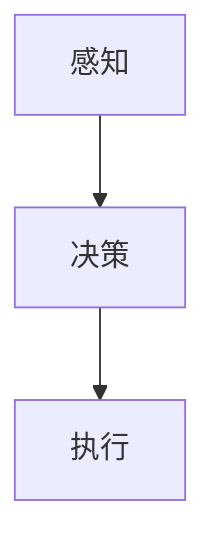
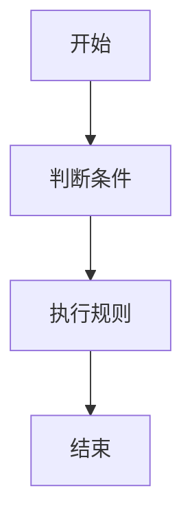
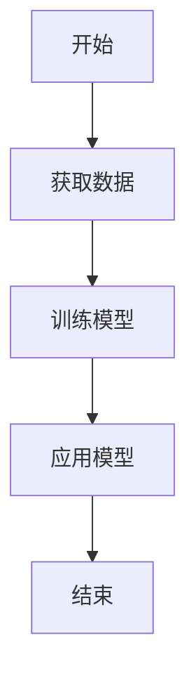
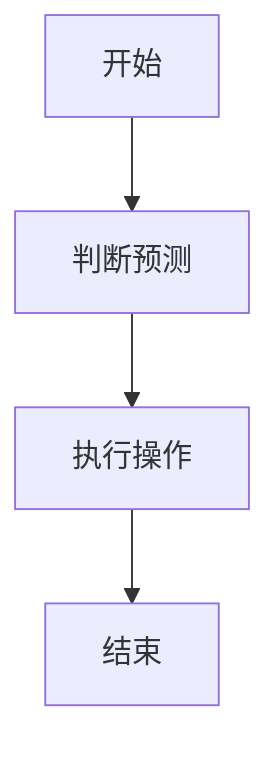
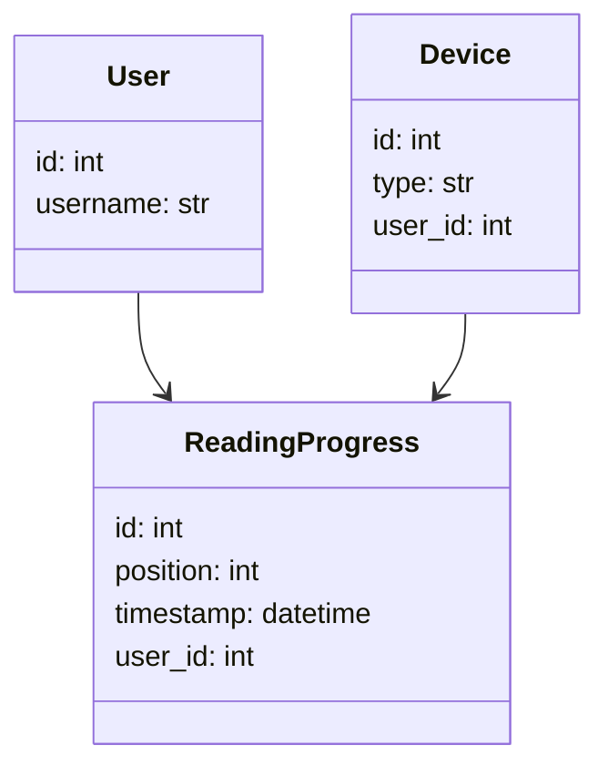
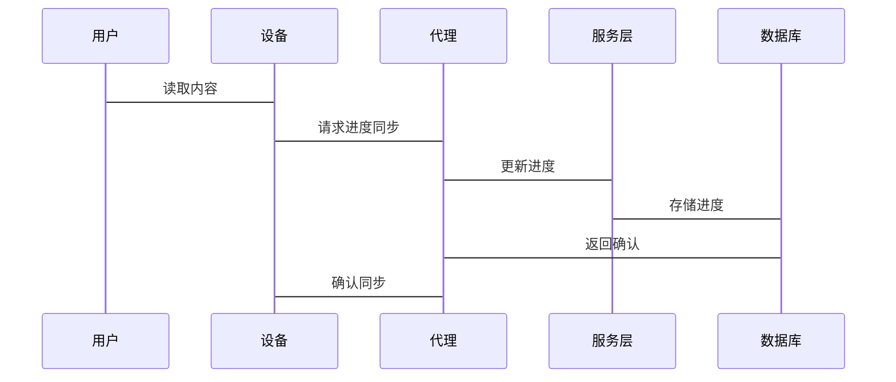

                 


# AI Agent在智能书签中的阅读进度同步

## 关键词：AI Agent，智能书签，阅读进度同步，算法原理，系统架构

## 摘要：本文详细探讨了AI Agent在智能书签中的应用，特别是在阅读进度同步方面的技术实现。通过分析AI Agent的核心概念、算法原理和系统架构，结合实际项目案例，展示了如何利用AI技术提升阅读体验。文章内容包括背景介绍、核心概念、算法原理、系统设计、项目实战等部分，为读者提供了全面的技术视角。

---

## 第1章: AI Agent与智能书签概述

### 1.1 AI Agent的基本概念

#### 1.1.1 AI Agent的定义
AI Agent（人工智能代理）是指能够感知环境、自主决策并执行任务的智能实体。它通过传感器获取信息，利用算法处理数据，并通过执行器与环境互动。

#### 1.1.2 AI Agent的核心特征
- **自主性**：能够自主决策，无需人工干预。
- **反应性**：能够实时感知环境变化并做出反应。
- **学习能力**：通过数据和经验不断优化自身行为。
- **协作性**：能够与其他系统或用户协同工作。

#### 1.1.3 AI Agent与传统软件代理的区别
| 特性         | AI Agent                          | 传统软件代理                     |
|--------------|-----------------------------------|-----------------------------------|
| 智能性       | 高，具备学习和推理能力           | 低，通常基于规则或预设逻辑       |
| 适应性       | 强，能适应复杂环境变化           | 弱，适应性有限                   |
| 决策能力     | 强，能够处理不确定性问题         | 弱，依赖预设规则                 |

### 1.2 智能书签的定义与功能

#### 1.2.1 智能书签的定义
智能书签是一种结合人工智能技术的数字工具，用于记录、管理和同步用户的阅读进度。它能够通过AI Agent分析用户的阅读行为，提供个性化的阅读建议和进度追踪。

#### 1.2.2 智能书签的核心功能
- **阅读记录**：记录用户的阅读位置、笔记和标记。
- **进度同步**：将阅读进度同步到多个设备或平台。
- **智能推荐**：基于用户的阅读习惯推荐相关内容。
- **互动提醒**：提醒用户阅读重要部分或更新内容。

#### 1.2.3 智能书签的应用场景
- **跨设备阅读**：用户可以在手机、平板和电脑上同步阅读进度。
- **团队协作**：多人协作阅读同一文档，同步进度和注释。
- **个性化推荐**：根据用户的阅读偏好推荐相关内容。

### 1.3 阅读进度同步的背景与需求

#### 1.3.1 阅读进度同步的背景
随着数字化阅读的普及，用户使用多种设备阅读同一内容的情况越来越常见。如何在不同设备间同步阅读进度成为亟待解决的问题。

#### 1.3.2 阅读进度同步的核心需求
- **实时性**：进度更新要快速同步到所有设备。
- **准确性**：确保进度数据的准确性和一致性。
- **易用性**：用户操作简便，无需复杂设置。

#### 1.3.3 阅读进度同步的边界与外延
- **边界**：仅同步阅读进度，不涉及内容本身的存储和管理。
- **外延**：扩展到笔记、书评等附加功能。

### 1.4 AI Agent在智能书签中的作用

#### 1.4.1 AI Agent在阅读进度同步中的角色
AI Agent负责协调不同设备和平台之间的数据同步，确保阅读进度的一致性。

#### 1.4.2 AI Agent的核心功能与属性
- **数据采集**：收集用户的阅读行为数据。
- **数据处理**：分析数据并生成同步指令。
- **数据同步**：将处理后的数据同步到其他设备或平台。

#### 1.4.3 AI Agent与智能书签的结合方式
AI Agent嵌入智能书签系统，通过API接口与阅读平台交互，实现进度同步。

### 1.5 本章小结
本章介绍了AI Agent和智能书签的基本概念，分析了阅读进度同步的背景和需求，并阐述了AI Agent在智能书签中的角色和功能。

---

## 第2章: AI Agent在智能书签中的核心概念

### 2.1 AI Agent的核心概念原理

#### 2.1.1 AI Agent的感知机制
AI Agent通过传感器或API获取环境数据，例如用户的阅读位置和时间。

#### 2.1.2 AI Agent的决策机制
基于感知到的数据，AI Agent利用算法进行决策，例如判断是否需要同步进度。

#### 2.1.3 AI Agent的执行机制
根据决策结果，AI Agent执行相应的操作，例如调用API更新阅读进度。

#### 2.1.4 感知、决策、执行的流程图


### 2.2 AI Agent与智能书签的关系

#### 2.2.1 AI Agent与智能书签的交互流程
1. 用户在设备A上阅读，AI Agent记录阅读进度。
2. AI Agent检测到设备B也需要同步进度。
3. AI Agent调用同步接口，将进度更新到设备B。

#### 2.2.2 AI Agent在智能书签中的数据流
- 用户输入：阅读位置、时间。
- 数据处理：解析、加密、传输。
- 系统输出：同步完成确认。

#### 2.2.3 AI Agent与智能书签的实体关系图
```mermaid
erDiagram
    user --|> reading_progress
    reading_progress --|> device
    device --|> agent
```

### 2.3 AI Agent的核心算法

#### 2.3.1 基于规则的AI Agent


#### 2.3.2 基于模型的AI Agent


### 2.4 本章小结
本章详细介绍了AI Agent的核心概念和算法，通过流程图和实体关系图展示了AI Agent在智能书签中的工作原理。

---

## 第3章: AI Agent的算法原理

### 3.1 AI Agent的感知算法

#### 3.1.1 基于规则的感知算法
```python
def感知规则(data):
    if data['时间'] > 10:
        return '夜间模式'
    else:
        return '日间模式'
```

#### 3.1.2 基于模型的感知算法
```python
import numpy as np

def感知模型(data):
    return np.dot(data, weights) + bias
```

#### 3.1.3 感知算法的优缺点对比
| 算法类型 | 优点                   | 缺点                     |
|----------|------------------------|--------------------------|
| 基于规则 | 实现简单，易于解释       | 难以处理复杂情况         |
| 基于模型 | 能处理复杂情况         | 实现复杂，解释性差       |

### 3.2 AI Agent的决策算法

#### 3.2.1 基于规则的决策算法
```python
def决策规则(condition):
    if condition['进度'] > 90:
        return '提醒完成'
    else:
        return '继续阅读'
```

#### 3.2.2 基于模型的决策算法
```python
import numpy as np

def决策模型(feature):
    return np.argmax(feature)
```

#### 3.2.3 决策算法的数学模型
$$ P(y|x) = \frac{P(x|y)P(y)}{P(x)} $$

### 3.3 AI Agent的执行算法

#### 3.3.1 基于规则的执行算法
```python
def执行规则(action):
    if action == '同步':
        同步进度()
    else:
        返回错误()
```

#### 3.3.2 基于模型的执行算法
```python
def执行模型(prediction):
    if prediction == '完成':
        提醒用户()
    else:
        继续同步()
```

#### 3.3.3 执行算法的流程图


### 3.4 本章小结
本章详细讲解了AI Agent的感知、决策和执行算法，通过代码和流程图展示了算法的实现过程。

---

## 第4章: 系统分析与架构设计

### 4.1 问题场景介绍
用户在多个设备上阅读同一电子书，需要同步阅读进度。

### 4.2 系统功能设计

#### 4.2.1 领域模型类图


#### 4.2.2 系统架构设计
```mermaid
archiDiagram
    前端 --> API网关
    API网关 --> 服务层
    服务层 --> 数据库
```

#### 4.2.3 接口设计
- **GET /progress**：获取阅读进度。
- **POST /sync**：同步阅读进度。

#### 4.2.4 交互流程


### 4.3 本章小结
本章通过系统架构设计和交互流程图，展示了AI Agent在智能书签中的实现方式。

---

## 第5章: 项目实战

### 5.1 环境安装

#### 5.1.1 安装Python
```bash
python --version
pip install requests
```

#### 5.1.2 安装依赖
```bash
pip install numpy matplotlib
```

### 5.2 系统核心实现

#### 5.2.1 AI Agent实现
```python
import requests

class Agent:
    def同步进度(self, progress):
        response = requests.post('http://api.example.com/sync', json=progress)
        return response.json()
```

#### 5.2.2 服务器实现
```python
from flask import Flask, request, jsonify

app = Flask(__name__)

@app.route('/sync', methods=['POST'])
def同步进度():
    data = request.json
    # 更新数据库
    return jsonify({'status': 'success', 'message': '进度已同步'})

if __name__ == '__main__':
    app.run(debug=True)
```

### 5.3 代码应用解读

#### 5.3.1 Agent类解读
- **同步进度**：向服务器发送同步请求。
- **处理响应**：解析服务器返回的响应。

#### 5.3.2 服务器实现解读
- **API接口**：处理POST请求，接收进度数据。
- **数据库更新**：将进度数据存储到数据库中。

### 5.4 实际案例分析

#### 5.4.1 案例背景
用户在手机上阅读到第50页，同步到电脑。

#### 5.4.2 操作步骤
1. 手机端触发同步请求。
2. 代理接收请求，调用API。
3. 服务器更新进度数据。
4. 电脑端获取最新进度。

### 5.5 本章小结
本章通过实际项目案例，展示了AI Agent在智能书签中的实现过程。

---

## 第6章: 总结与展望

### 6.1 本章总结
本文详细探讨了AI Agent在智能书签中的应用，特别是在阅读进度同步方面的技术实现。通过分析AI Agent的核心概念、算法原理和系统架构，结合实际项目案例，展示了如何利用AI技术提升阅读体验。

### 6.2 未来展望
- **技术优化**：探索更高效的同步算法。
- **功能扩展**：增加更多智能功能，如个性化推荐。
- **应用拓展**：探索AI Agent在其他领域的应用。

### 6.3 最佳实践Tips
- **数据安全**：注意保护用户数据隐私。
- **系统优化**：定期更新和维护系统。

---

## 作者：AI天才研究院 & 禅与计算机程序设计艺术

---

以上是《AI Agent在智能书签中的阅读进度同步》的技术博客文章，按照目录大纲展开，详细讲解了AI Agent在智能书签中的应用，包括背景、核心概念、算法原理、系统设计和项目实战等部分。

