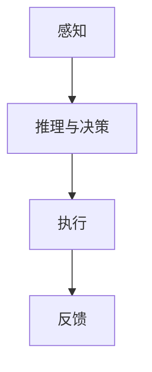
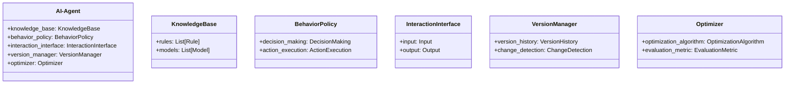
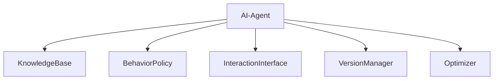
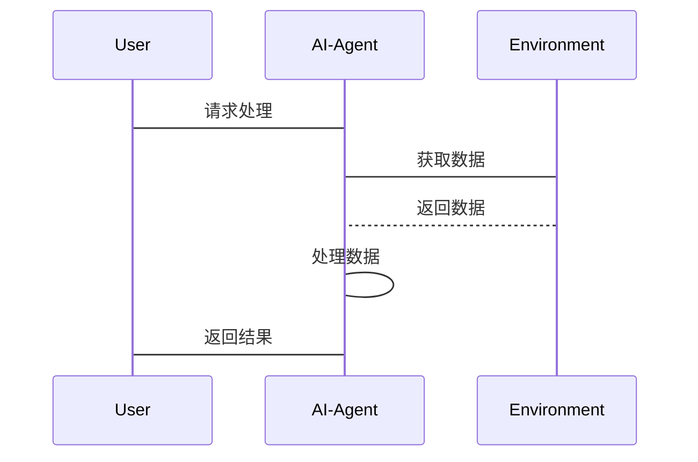

                 


# AI Agent的版本控制与迭代优化策略

> 关键词：AI Agent, 版本控制, 迭代优化, 算法原理, 系统设计, 项目实战

> 摘要：本文详细探讨了AI Agent的版本控制与迭代优化策略，从基本概念、核心算法到系统设计和项目实战，全面分析了如何有效管理AI Agent的版本和优化其性能。文章内容涵盖背景介绍、核心概念、算法原理、系统架构、项目实战、最佳实践等方面，为AI Agent的开发和应用提供了全面的指导。

---

# 第1章: AI Agent的背景与概念

## 1.1 AI Agent的基本概念

### 1.1.1 什么是AI Agent

AI Agent（人工智能代理）是一种能够感知环境、自主决策并执行任务的智能实体。它可以是一个软件程序、机器人或其他智能系统，通过接收输入信息、分析问题、执行操作并返回结果，从而实现特定目标。AI Agent的核心在于其智能性，能够适应环境的变化并动态调整行为。

**图1.1 AI Agent的基本结构**



### 1.1.2 AI Agent的核心特征

AI Agent具有以下几个核心特征：
1. **自主性**：能够自主决策，无需外部干预。
2. **反应性**：能够感知环境并实时调整行为。
3. **目标导向性**：具有明确的目标，所有行为均围绕目标展开。
4. **学习能力**：能够通过经验改进性能。

### 1.1.3 AI Agent的分类与应用场景

AI Agent可以分为以下几类：
1. **基于规则的AI Agent**：通过预定义的规则进行决策。
2. **基于模型的AI Agent**：基于概率模型或机器学习模型进行决策。
3. **基于目标的AI Agent**：根据目标函数优化行为。
4. **混合型AI Agent**：结合多种方法进行决策。

AI Agent的应用场景包括自动驾驶、智能助手、机器人控制、游戏AI、推荐系统等。

---

## 1.2 AI Agent的版本控制问题

### 1.2.1 版本控制的基本概念

版本控制是一种管理软件或系统变化的机制，记录每个版本的更改内容，并允许恢复到特定版本。在AI Agent中，版本控制用于管理知识库、规则、模型和行为策略的变化。

### 1.2.2 AI Agent版本控制的挑战

AI Agent的版本控制面临以下挑战：
1. **复杂性**：AI Agent的结构复杂，涉及多个模块和算法。
2. **动态性**：AI Agent的行为可能随着环境变化而变化，导致版本控制难以稳定。
3. **性能要求**：版本控制需要高效，不能影响AI Agent的实时性能。

### 1.2.3 版本控制的重要性

版本控制在AI Agent中的重要性体现在以下几个方面：
1. **可追溯性**：记录每个版本的变更历史，便于问题排查。
2. **可恢复性**：在出现问题时，可以回滚到稳定版本。
3. **协作开发**：支持多团队协作开发，确保版本一致性。

---

## 1.3 AI Agent的迭代优化需求

### 1.3.1 迭代优化的基本概念

迭代优化是一种通过多次改进来提升系统性能的方法。在AI Agent中，迭代优化用于提升其决策能力、响应速度和准确性。

### 1.3.2 迭代优化的目标与方法

迭代优化的目标是通过不断改进算法、优化参数和调整策略，提升AI Agent的性能。常见的迭代优化方法包括：
1. **梯度下降**：用于优化模型参数。
2. **遗传算法**：用于优化规则和行为策略。
3. **强化学习**：通过与环境交互优化行为策略。

### 1.3.3 迭代优化与版本控制的关系

迭代优化和版本控制密切相关。每次迭代优化后，都需要记录新的版本，以便在优化失败时可以回滚到之前的稳定版本。同时，版本控制可以帮助分析优化的效果，为后续的优化提供数据支持。

---

## 1.4 本章小结

本章介绍了AI Agent的基本概念、版本控制的重要性以及迭代优化的需求。通过了解AI Agent的核心特征和应用场景，我们可以更好地理解版本控制和迭代优化在其中的作用。下一章将深入探讨AI Agent的核心技术和实现方法。

---

# 第2章: AI Agent的核心概念与技术

## 2.1 AI Agent的组成与结构

### 2.1.1 知识库与推理引擎

知识库是AI Agent的核心知识存储，包括规则、模型、数据和经验。推理引擎负责根据知识库中的信息进行推理和决策。

### 2.1.2 行为决策模块

行为决策模块是AI Agent的核心模块，负责根据推理结果生成行为策略。常见的决策方法包括基于规则的决策和基于模型的决策。

### 2.1.3 交互接口与反馈机制

交互接口是AI Agent与外部环境的桥梁，负责接收输入和输出结果。反馈机制用于将环境的反馈传递给AI Agent，以便调整行为策略。

---

## 2.2 基于规则的AI Agent

### 2.2.1 基于规则的决策机制

基于规则的AI Agent通过预定义的规则进行决策。规则通常由条件和动作组成，例如：
- 条件：如果温度低于0度，则动作：开启加热器。

### 2.2.2 规则的版本控制方法

规则的版本控制可以通过以下方法实现：
1. **规则树**：将规则组织成树结构，便于管理和版本控制。
2. **版本标记**：为每个规则分配唯一的版本号。
3. **变更日志**：记录每次规则的修改内容。

### 2.2.3 规则的迭代优化策略

规则的迭代优化可以通过以下方法实现：
1. **规则简化**：通过合并和删除冗余规则，简化规则库。
2. **规则增强**：通过增加新的规则，提升决策能力。
3. **规则验证**：通过测试和反馈，验证规则的有效性。

---

## 2.3 基于模型的AI Agent

### 2.3.1 基于模型的决策机制

基于模型的AI Agent通过概率模型或机器学习模型进行决策。例如，使用神经网络模型进行图像识别和分类。

### 2.3.2 模型的版本控制方法

模型的版本控制可以通过以下方法实现：
1. **模型快照**：定期保存模型的快照，便于回滚。
2. **版本标记**：为每个模型分配唯一的版本号。
3. **模型仓库**：使用版本控制系统管理模型文件。

### 2.3.3 模型的迭代优化策略

模型的迭代优化可以通过以下方法实现：
1. **参数调整**：通过调整模型参数，提升性能。
2. **模型微调**：在特定数据集上进行微调，优化模型。
3. **模型融合**：将多个模型的输出进行融合，提升决策能力。

---

## 2.4 本章小结

本章详细介绍了AI Agent的核心概念与技术，包括知识库与推理引擎、行为决策模块以及交互接口与反馈机制。同时，探讨了基于规则和基于模型的AI Agent的实现方法和优化策略。下一章将从算法原理的角度，深入分析AI Agent的版本控制方法。

---

# 第3章: AI Agent版本控制的算法原理

## 3.1 版本号生成算法

### 3.1.1 常见版本号生成方法

版本号生成方法包括：
1. **基于时间戳**：使用当前时间生成唯一版本号。
2. **基于哈希值**：将代码或文件哈希后生成版本号。
3. **基于自增计数器**：使用递增的计数器生成版本号。

### 3.1.2 基于时间戳的版本号生成

**代码示例：**

```python
import datetime

def generate_version_by_timestamp():
    current_time = datetime.datetime.now()
    version = current_time.isoformat()
    return version
```

### 3.1.3 基于哈希值的版本号生成

**代码示例：**

```python
import hashlib

def generate_version_by_hash(content):
    hash_object = hashlib.sha256(content.encode()).hexdigest()
    return hash_object[:8]
```

---

## 3.2 变更检测算法

### 3.2.1 文件级变更检测

文件级变更检测通过比较文件的哈希值或内容差异，判断文件是否发生变化。

**代码示例：**

```python
import hashlib

def detect_changes(old_file, new_file):
    old_hash = hashlib.sha256(open(old_file, 'rb').read()).hexdigest()
    new_hash = hashlib.sha256(open(new_file, 'rb').read()).hexdigest()
    return old_hash != new_hash
```

### 3.2.2 代码级变更检测

代码级变更检测通过分析代码的语法和语义差异，判断代码是否发生变化。

---

## 3.3 状态管理算法

### 3.3.1 状态管理的基本概念

状态管理用于跟踪AI Agent的运行状态，包括当前版本、运行状态和性能指标。

### 3.3.2 状态管理的实现方法

状态管理可以通过以下方法实现：
1. **状态日志**：记录每次状态变化的日志。
2. **状态快照**：定期保存状态的快照，便于恢复。
3. **状态监控**：实时监控状态变化，及时报警。

---

## 3.4 本章小结

本章从算法原理的角度，详细介绍了AI Agent版本控制的实现方法，包括版本号生成、变更检测和状态管理。这些算法为AI Agent的版本控制提供了理论基础和技术支持。下一章将探讨迭代优化策略的实现方法。

---

# 第4章: AI Agent的迭代优化策略

## 4.1 优化目标与评估指标

### 4.1.1 优化目标

迭代优化的目标包括：
1. 提升AI Agent的决策能力。
2. 提高AI Agent的响应速度。
3. 增强AI Agent的适应能力。

### 4.1.2 评估指标

评估指标包括：
1. **准确率**：AI Agent的决策正确率。
2. **响应时间**：AI Agent的响应时间。
3. **适应性**：AI Agent对环境变化的适应能力。

---

## 4.2 迭代优化方法

### 4.2.1 梯度下降优化

梯度下降是一种常用的优化算法，用于最小化损失函数。公式为：

$$ \theta = \theta - \eta \cdot \nabla J(\theta) $$

其中，$\theta$ 是参数，$\eta$ 是学习率，$\nabla J(\theta)$ 是损失函数的梯度。

### 4.2.2 遗传算法优化

遗传算法是一种基于自然选择的优化算法，包括选择、交叉和变异三个步骤。

### 4.2.3 强化学习优化

强化学习是一种通过与环境交互来优化行为策略的方法。通过奖励机制，AI Agent学会最优行为。

---

## 4.3 优化策略

### 4.3.1 分阶段优化

分阶段优化将优化过程分为多个阶段，逐步优化不同的模块和参数。

### 4.3.2 并行优化

并行优化通过多线程或多进程的方式，同时优化多个模块和参数，提高优化效率。

### 4.3.3 自适应优化

自适应优化根据环境和性能动态调整优化策略，提高适应性。

---

## 4.4 本章小结

本章探讨了AI Agent迭代优化的策略和方法，包括优化目标、评估指标和优化方法。通过合理的优化策略，可以显著提升AI Agent的性能和适应能力。下一章将从系统设计的角度，分析AI Agent版本控制与迭代优化的实现方案。

---

# 第5章: AI Agent的系统设计

## 5.1 问题场景分析

### 5.1.1 问题描述

AI Agent的版本控制与迭代优化需要解决以下问题：
1. 如何管理AI Agent的版本？
2. 如何优化AI Agent的性能？
3. 如何确保AI Agent的稳定性和可靠性？

### 5.1.2 问题背景

在实际应用中，AI Agent可能面临复杂的环境和多变的需求，需要不断更新和优化。

### 5.1.3 问题解决

通过版本控制和迭代优化，可以有效管理AI Agent的版本，提升其性能和适应能力。

---

## 5.2 系统功能设计

### 5.2.1 领域模型设计

领域模型是AI Agent的核心模型，用于描述问题领域中的概念、关系和规则。

**图5.1 领域模型类图**



### 5.2.2 系统架构设计

**图5.2 系统架构图**



### 5.2.3 系统接口设计

系统接口设计包括输入接口、输出接口和内部接口。输入接口负责接收外部输入，输出接口负责输出结果，内部接口负责模块之间的通信。

### 5.2.4 系统交互设计

系统交互设计通过序列图描述AI Agent与外部环境的交互流程。

**图5.3 系统交互序列图**



---

## 5.3 本章小结

本章从系统设计的角度，详细分析了AI Agent的版本控制与迭代优化的实现方案，包括领域模型设计、系统架构设计和系统交互设计。这些设计为AI Agent的开发和应用提供了理论支持和实践指导。

---

# 第6章: AI Agent的项目实战

## 6.1 环境安装与配置

### 6.1.1 系统要求

建议使用Python 3.6及以上版本，安装必要的库，如`numpy`、`pandas`、`scikit-learn`和`tensorflow`。

### 6.1.2 环境配置

安装必要的依赖库：

```bash
pip install numpy pandas scikit-learn tensorflow
```

---

## 6.2 核心功能实现

### 6.2.1 版本控制实现

实现版本控制功能，包括版本号生成、变更检测和版本回滚。

**代码示例：**

```python
class VersionControl:
    def __init__(self):
        self.version_history = []

    def generate_version(self):
        import datetime
        current_time = datetime.datetime.now()
        version = current_time.isoformat()
        self.version_history.append(version)
        return version

    def detect_changes(self, old_content, new_content):
        import hashlib
        old_hash = hashlib.sha256(old_content.encode()).hexdigest()
        new_hash = hashlib.sha256(new_content.encode()).hexdigest()
        return old_hash != new_hash

    def rollback(self, version):
        for i, v in enumerate(self.version_history):
            if v == version:
                return self.version_history[:i+1]
        return self.version_history
```

### 6.2.2 迭代优化实现

实现迭代优化功能，包括参数调整、模型微调和行为策略优化。

**代码示例：**

```python
class Optimizer:
    def __init__(self, model):
        self.model = model

    def gradient_descent(self, X, y, learning_rate=0.1):
        import numpy as np
        parameters = self.model.get_parameters()
        gradients = self.model.compute_gradients(X, y)
        parameters = [p - learning_rate * g for p, g in zip(parameters, gradients)]
        self.model.set_parameters(parameters)

    def optimize(self, X, y, epochs=10):
        for _ in range(epochs):
            self.gradient_descent(X, y)
```

---

## 6.3 项目实现与分析

### 6.3.1 项目实现

实现一个简单的AI Agent，包括版本控制和迭代优化功能。

**代码示例：**

```python
class AI-Agent:
    def __init__(self):
        self.knowledge_base = KnowledgeBase()
        self.behavior_policy = BehaviorPolicy()
        self.version_manager = VersionControl()
        self.optimizer = Optimizer(self.behavior_policy.model)

    def process_request(self, request):
        self.behavior_policy.decision_making(request)
        result = self.behavior_policy.action_execution()
        return result

    def optimize(self, data):
        self.optimizer.optimize(data)
```

### 6.3.2 实际案例分析

通过一个具体案例，分析AI Agent的版本控制与迭代优化过程。

### 6.3.3 经验总结

总结项目实现中的经验和教训，提出改进建议。

---

## 6.4 本章小结

本章通过项目实战，详细展示了AI Agent的版本控制与迭代优化的实现过程。通过具体代码和案例分析，读者可以更好地理解和应用相关技术。

---

# 第7章: 最佳实践与未来展望

## 7.1 最佳实践

### 7.1.1 版本控制最佳实践

1. **定期备份**：定期备份版本历史，防止数据丢失。
2. **代码审查**：在版本发布前进行代码审查，确保代码质量。
3. **自动化测试**：使用自动化测试工具，确保版本的稳定性。

### 7.1.2 迭代优化最佳实践

1. **小步快跑**：采用迭代开发方法，小步快跑，及时验证。
2. **数据驱动**：利用数据驱动优化，确保优化效果。
3. **持续监控**：持续监控AI Agent的性能，及时发现问题。

---

## 7.2 未来展望

随着AI技术的不断发展，AI Agent的版本控制与迭代优化将更加智能化和自动化。未来的研究方向包括：
1. **自适应版本控制**：根据环境和需求自动调整版本控制策略。
2. **自优化AI Agent**：AI Agent能够自主优化自身行为，无需人工干预。
3. **多Agent协作**：多个AI Agent协作优化，提升整体性能。

---

## 7.3 小结

本章总结了AI Agent版本控制与迭代优化的最佳实践，并展望了未来的研究方向。通过不断优化和创新，AI Agent将更好地服务于人类社会。

---

# 附录

## 附录A: AI Agent版本控制工具列表

1. **Git**：分布式版本控制系统。
2. **svn**：集中式版本控制系统。
3. **Docker**：容器化版本管理工具。
4. **Jenkins**：持续集成工具。

---

## 附录B: AI Agent相关术语表

1. **AI Agent**：人工智能代理。
2. **版本控制**：记录和管理代码或系统的变更历史。
3. **迭代优化**：通过多次改进提升系统性能。
4. **梯度下降**：一种优化算法。
5. **遗传算法**：一种基于自然选择的优化算法。

---

## 附录C: 参考文献

1. Russell, S., & Norvig, P. (2010). Artificial Intelligence: A Modern Approach.
2. LeCun, Y., Bengio, Y., & Hinton, G. (2015). Deep Learning.
3. Bishop, C. M. (2006). Pattern Recognition and Machine Learning.

---

# 作者：AI天才研究院/AI Genius Institute & 禅与计算机程序设计艺术 /Zen And The Art of Computer Programming

