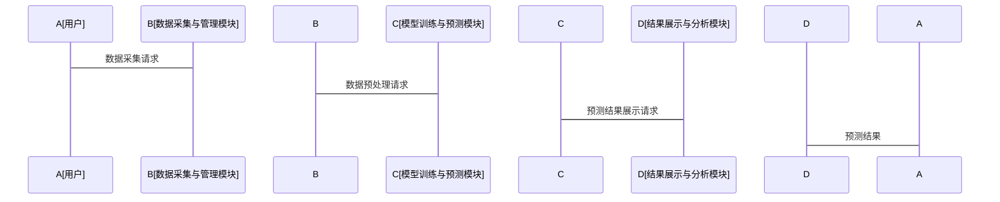

                 

# AI智能体协作：提升对公司未来现金流稳定性的预测

**关键词：** AI智能体协作、现金流预测、多智能体系统、机器学习、金融预测

**摘要：**  
现金流预测是企业财务管理中的核心任务之一，其准确性直接关系到企业的经营决策和风险控制。传统的现金流预测方法往往依赖于单点预测模型，存在预测精度低、难以捕捉复杂市场变化等问题。近年来，随着人工智能技术的快速发展，基于AI智能体协作的预测方法逐渐崭露头角。通过多智能体协作，能够更好地捕捉市场动态，提高预测的准确性和稳定性。本文将从AI智能体协作的核心概念、算法实现、系统架构设计以及实际应用案例等多个方面，深入探讨如何利用AI智能体协作技术提升对公司未来现金流稳定性的预测能力。

---

## 第1章: 现金流预测的挑战与AI智能体协作的引入

### 1.1 现金流预测的重要性
现金流是企业财务健康的重要指标，直接反映了企业的运营能力和偿债能力。准确的现金流预测可以帮助企业做出更合理的资金安排、优化资源配置、降低财务风险。

#### 1.1.1 现金流预测的定义与作用
现金流预测是指通过历史数据和相关模型，预测企业未来一定时期内的现金流情况。其作用包括：
- **优化资金管理：** 通过预测未来现金流，企业可以提前规划资金使用，避免资金链断裂。
- **支持决策制定：** 现金流预测为企业制定投资计划、融资策略等提供重要依据。
- **风险预警：** 通过预测潜在的现金流波动，企业可以提前采取措施应对潜在风险。

#### 1.1.2 传统现金流预测方法的局限性
传统的现金流预测方法通常基于统计模型（如线性回归、ARIMA）或简单的机器学习模型（如随机森林、XGBoost）。这些方法虽然在一定程度上能够捕捉现金流的变化趋势，但存在以下问题：
- **单一模型的局限性：** 单一模型难以捕捉多维度、多时间尺度的现金流变化。
- **缺乏动态协作：** 传统模型通常基于单点预测，无法充分利用多智能体协作的优势。
- **难以应对复杂市场变化：** 在市场波动剧烈的情况下，传统模型的预测精度明显下降。

#### 1.1.3 AI智能体协作的优势
AI智能体协作是一种新兴的技术，通过多个智能体的协作，能够更好地捕捉复杂市场环境中的多维度信息，提高预测的准确性和鲁棒性。其优势包括：
- **多维度信息处理：** 多智能体可以从不同的数据源、不同角度获取信息，形成更全面的预测结果。
- **动态协作能力：** 智能体之间可以实时协作，根据市场变化动态调整预测模型。
- **分布式计算能力：** 多智能体协作可以充分利用分布式计算的优势，提高预测效率。

### 1.2 AI智能体协作的定义与特点
AI智能体（Artificial Intelligence Agent，简称智能体）是指能够感知环境、自主决策并采取行动的实体。AI智能体协作是指多个智能体通过通信与协作，共同完成复杂任务的过程。

#### 1.2.1 智能体的定义与核心特征
智能体是一种能够感知环境、自主决策并采取行动的实体。其核心特征包括：
- **自主性：** 智能体能够自主决策，无需外部干预。
- **反应性：** 智能体能够实时感知环境变化并做出反应。
- **协作性：** 智能体能够与其他智能体协作，共同完成任务。
- **学习能力：** 智能体能够通过学习不断提高自身的预测能力。

#### 1.2.2 多智能体协作的机制
多智能体协作机制是指多个智能体之间通过通信与协作，共同完成复杂任务的过程。其主要机制包括：
- **通信机制：** 智能体之间通过通信模块交换信息。
- **任务分配机制：** 根据任务需求，智能体之间动态分配任务。
- **协作协议：** 智能体之间通过协作协议协调行动。

#### 1.2.3 AI智能体协作在现金流预测中的应用潜力
AI智能体协作在现金流预测中的应用潜力主要体现在以下几个方面：
- **多维度信息整合：** 多智能体可以从财务数据、市场数据、行业数据等多个维度获取信息，形成更全面的预测结果。
- **动态调整预测模型：** 根据市场变化，智能体之间可以动态调整预测模型，提高预测的准确性。
- **分布式计算能力：** 多智能体协作可以充分利用分布式计算的优势，提高预测效率。

### 1.3 本章小结
本章主要介绍了现金流预测的重要性及其面临的挑战，重点阐述了AI智能体协作的优势及其在现金流预测中的应用潜力。通过AI智能体协作，可以更好地捕捉复杂市场环境中的多维度信息，提高预测的准确性和鲁棒性。

---

## 第2章: AI智能体协作的核心概念与原理

### 2.1 多智能体系统（MAS）概述
多智能体系统（Multi-Agent System，MAS）是由多个智能体组成的分布式系统，智能体之间通过通信与协作完成复杂任务。

#### 2.1.1 多智能体系统的定义
多智能体系统是由多个智能体组成的分布式系统，智能体之间通过通信与协作完成复杂任务。多智能体系统的典型特征包括：
- **分布式性：** 智能体之间分布在网络中，每个智能体负责特定的任务。
- **协作性：** 智能体之间通过协作完成复杂任务。
- **自主性：** 智能体能够自主决策并采取行动。

#### 2.1.2 多智能体系统的分类与特点
多智能体系统可以根据不同的分类标准进行分类，常见的分类包括：
- **基于任务的分类：** 根据任务类型不同，可以将多智能体系统分为任务协作型、信息共享型等。
- **基于智能体类型的分类：** 根据智能体的类型不同，可以将多智能体系统分为同质型、异质型等。
- **基于应用场景的分类：** 根据应用场景的不同，可以将多智能体系统分为金融、医疗、交通等领域。

#### 2.1.3 多智能体系统的应用领域
多智能体系统已经在多个领域得到了广泛应用，包括：
- **金融领域：** 多智能体系统可以用于股票交易、风险评估、现金流预测等。
- **医疗领域：** 多智能体系统可以用于疾病诊断、药物研发等。
- **交通领域：** 多智能体系统可以用于交通调度、路径规划等。

### 2.2 AI智能体协作的机制
AI智能体协作的机制是多智能体系统的核心，主要包括通信与协作、任务分配与决策、冲突解决等方面。

#### 2.2.1 协作智能体的通信与协调
协作智能体之间的通信是实现协作的基础。通信机制包括：
- **消息传递：** 智能体之间通过消息传递信息。
- **协议设计：** 为了保证通信的高效性，需要设计合理的通信协议。
- **信息共享：** 智能体之间可以共享信息，以便更好地协作。

#### 2.2.2 协作智能体的任务分配与决策
任务分配是多智能体协作中的重要环节。任务分配机制包括：
- **基于角色的分配：** 根据智能体的角色分配任务。
- **基于能力的分配：** 根据智能体的能力分配任务。
- **动态分配：** 根据任务需求动态分配任务。

#### 2.2.3 协作智能体的冲突解决
在多智能体协作中，冲突是不可避免的。冲突解决机制包括：
- **协商机制：** 智能体之间通过协商解决冲突。
- **仲裁机制：** 通过仲裁者解决冲突。
- **优先级机制：** 根据任务的优先级解决冲突。

### 2.3 智能体协作的数学模型
智能体协作的数学模型是实现协作的核心。常用的数学模型包括：
- **马尔可夫链模型：** 用于描述智能体之间的状态转移。
- **博弈论模型：** 用于描述智能体之间的博弈关系。
- **图论模型：** 用于描述智能体之间的协作关系。

#### 2.3.1 协作智能体的数学表达
协作智能体的数学表达可以通过图论模型来描述。例如，可以将智能体之间的协作关系表示为图中的边，权重表示协作强度。

#### 2.3.2 协作智能体的协作协议
协作协议是智能体之间协作的基础。协作协议可以通过数学公式来描述，例如：
$$
P(i,j) = \frac{1}{1 + e^{-\beta (s_i - s_j)}}
$$
其中，$P(i,j)$ 表示智能体i与智能体j协作的概率，$\beta$ 是一个参数，$s_i$ 和 $s_j$ 是智能体i和智能体j的评分。

#### 2.3.3 协作智能体的评价指标
协作智能体的评价指标可以通过以下公式计算：
$$
E = \frac{\sum_{i=1}^n w_i x_i}{\sum_{i=1}^n w_i}
$$
其中，$E$ 是协作效果的评价指标，$w_i$ 是智能体i的权重，$x_i$ 是智能体i的预测结果。

### 2.4 本章小结
本章主要介绍了多智能体系统的核心概念与协作机制，重点阐述了协作智能体的数学模型及其在现金流预测中的应用。通过数学模型的建立，可以更好地理解智能体协作的内在规律。

---

## 第3章: 现金流预测的AI智能体协作模型设计

### 3.1 现金流预测的业务流程
现金流预测的业务流程包括数据收集、数据预处理、模型训练、模型预测等环节。

#### 3.1.1 现金流预测的基本流程
现金流预测的基本流程包括：
1. **数据收集：** 收集企业的历史财务数据、市场数据等。
2. **数据预处理：** 对数据进行清洗、标准化等处理。
3. **模型训练：** 使用训练数据训练预测模型。
4. **模型预测：** 使用模型进行未来现金流的预测。

#### 3.1.2 现金流预测的关键环节
现金流预测的关键环节包括：
- **数据质量：** 数据的准确性和完整性直接影响预测结果。
- **模型选择：** 模型的选择需要根据数据特点和业务需求进行。
- **模型优化：** 模型的优化可以通过调整参数、改进算法等实现。

#### 3.1.3 现金流预测的业务目标
现金流预测的业务目标包括：
- **提高预测精度：** 通过优化模型提高预测的准确性。
- **降低预测风险：** 通过多模型协作降低预测的不确定性。
- **支持决策制定：** 通过预测结果支持企业的财务决策。

### 3.2 AI智能体协作模型的设计思路
AI智能体协作模型的设计思路包括智能体的角色分配、协作机制设计、模型优化等。

#### 3.2.1 智能体的角色分配
智能体的角色分配需要根据任务需求进行。例如，可以将智能体分为数据处理智能体、模型训练智能体、预测结果智能体等。

#### 3.2.2 智能体之间的协作关系
智能体之间的协作关系可以通过图论模型来描述。例如，可以将智能体之间的协作关系表示为图中的边，权重表示协作强度。

#### 3.2.3 智能体协作的目标函数
智能体协作的目标函数可以通过以下公式表示：
$$
F = \sum_{i=1}^n w_i x_i
$$
其中，$F$ 是目标函数，$w_i$ 是智能体i的权重，$x_i$ 是智能体i的预测结果。

### 3.3 智能体协作模型的实现框架
智能体协作模型的实现框架包括数据输入与预处理、智能体初始化与配置、智能体协作与预测、预测结果的评估与优化等。

#### 3.3.1 数据的获取与预处理
数据的获取与预处理是模型实现的基础。需要对数据进行清洗、标准化等处理，确保数据的质量。

#### 3.3.2 智能体的初始化与配置
智能体的初始化与配置需要根据任务需求进行。例如，可以设置智能体的初始状态、协作参数等。

#### 3.3.3 智能体协作与预测
智能体协作与预测是模型实现的核心。智能体之间需要通过通信模块进行信息交换，协作完成预测任务。

#### 3.3.4 预测结果的评估与优化
预测结果的评估与优化是模型优化的重要环节。需要根据评估指标对模型进行优化，提高预测的准确性。

### 3.4 本章小结
本章主要介绍了现金流预测的业务流程及AI智能体协作模型的设计思路，重点阐述了智能体协作模型的实现框架。通过合理的设计和优化，可以提高现金流预测的准确性和稳定性。

---

## 第4章: 现金流预测的AI智能体协作算法实现

### 4.1 算法原理概述
现金流预测的AI智能体协作算法基于多智能体协作和机器学习技术，通过多个智能体的协作完成预测任务。

#### 4.1.1 算法的基本原理
算法的基本原理是通过多个智能体的协作，利用机器学习技术进行现金流预测。智能体之间通过通信模块交换信息，协作完成预测任务。

#### 4.1.2 算法的核心步骤
算法的核心步骤包括：
1. **智能体初始化：** 设置智能体的初始状态和协作参数。
2. **数据输入与预处理：** 对数据进行清洗、标准化等处理。
3. **智能体协作：** 智能体之间通过通信模块进行信息交换，协作完成预测任务。
4. **预测结果输出：** 输出最终的预测结果，并进行评估与优化。

#### 4.1.3 算法的输入输出
算法的输入包括企业的历史财务数据、市场数据等，输出包括未来一定时期内的现金流预测结果。

### 4.2 算法实现的详细步骤
算法实现的详细步骤包括数据预处理、智能体初始化、智能体协作、预测结果评估与优化等。

#### 4.2.1 数据的获取与预处理
数据的获取与预处理是算法实现的基础。需要对数据进行清洗、标准化等处理，确保数据的质量。

#### 4.2.2 智能体的初始化与配置
智能体的初始化与配置需要根据任务需求进行。例如，可以设置智能体的初始状态、协作参数等。

#### 4.2.3 智能体协作与预测
智能体协作与预测是算法实现的核心。智能体之间需要通过通信模块进行信息交换，协作完成预测任务。

#### 4.2.4 预测结果的评估与优化
预测结果的评估与优化是算法优化的重要环节。需要根据评估指标对模型进行优化，提高预测的准确性。

### 4.3 算法的数学模型与公式
算法的数学模型与公式可以通过以下方式表示：

#### 4.3.1 现金流预测的数学模型
现金流预测的数学模型可以通过以下公式表示：
$$
F(t) = \sum_{i=1}^n w_i x_i(t)
$$
其中，$F(t)$ 是时间 $t$ 的现金流预测值，$w_i$ 是智能体i的权重，$x_i(t)$ 是智能体i在时间 $t$ 的预测结果。

#### 4.3.2 智能体协作的通信协议
智能体协作的通信协议可以通过以下公式表示：
$$
P(i,j) = \frac{1}{1 + e^{-\beta (s_i - s_j)}}
$$
其中，$P(i,j)$ 表示智能体i与智能体j协作的概率，$\beta$ 是一个参数，$s_i$ 和 $s_j$ 是智能体i和智能体j的评分。

### 4.4 本章小结
本章主要介绍了现金流预测的AI智能体协作算法的实现步骤及数学模型，重点阐述了算法的核心步骤和数学公式。通过合理的算法设计和优化，可以提高现金流预测的准确性和稳定性。

---

## 第5章: 现金流预测的系统分析与架构设计

### 5.1 系统应用场景
现金流预测的系统应用场景包括企业财务管理和风险控制、金融投资决策支持等。

#### 5.1.1 企业财务管理
现金流预测在企业财务管理中的应用包括：
- **资金管理：** 通过预测未来现金流，企业可以优化资金使用，降低财务风险。
- **预算管理：** 通过预测未来现金流，企业可以制定更合理的预算计划。

#### 5.1.2 风险管理
现金流预测在风险管理中的应用包括：
- **风险预警：** 通过预测潜在的现金流波动，企业可以提前采取措施应对潜在风险。
- **风险管理策略：** 通过现金流预测，企业可以制定更有效的风险管理策略。

### 5.2 系统功能设计
现金流预测系统的功能设计包括数据采集与管理、模型训练与预测、结果展示与分析等。

#### 5.2.1 数据采集与管理
数据采集与管理模块负责数据的获取与预处理，确保数据的质量。

#### 5.2.2 模型训练与预测
模型训练与预测模块负责智能体协作模型的训练与预测，输出预测结果。

#### 5.2.3 结果展示与分析
结果展示与分析模块负责展示预测结果，并进行分析与评估。

### 5.3 系统架构设计
系统的架构设计可以通过以下方式表示：

#### 5.3.1 数据采集与管理模块
数据采集与管理模块负责数据的获取与预处理，确保数据的质量。

#### 5.3.2 模型训练与预测模块
模型训练与预测模块负责智能体协作模型的训练与预测，输出预测结果。

#### 5.3.3 结果展示与分析模块
结果展示与分析模块负责展示预测结果，并进行分析与评估。

### 5.4 系统接口设计
系统的接口设计需要根据模块的功能需求进行设计，确保模块之间的协作。

### 5.5 系统交互流程
系统的交互流程可以通过以下方式表示：

### 5.6 本章小结
本章主要介绍了现金流预测系统的应用场景、功能设计及架构设计，重点阐述了系统各模块的功能及协作关系。通过合理的系统设计，可以提高现金流预测的效率和准确性。

---

## 第6章: 项目实战——现金流预测的AI智能体协作实现

### 6.1 项目背景与目标
本项目旨在通过AI智能体协作技术，实现对公司未来现金流稳定性的预测。项目目标包括提高预测的准确性和稳定性，降低预测风险。

### 6.2 项目环境与工具
项目环境与工具包括数据源、开发工具、运行环境等。

#### 6.2.1 数据源
数据源包括企业的历史财务数据、市场数据等。

#### 6.2.2 开发工具
开发工具包括Python、TensorFlow、Keras等。

#### 6.2.3 运行环境
运行环境包括云服务器、本地开发环境等。

### 6.3 项目核心实现
项目的

