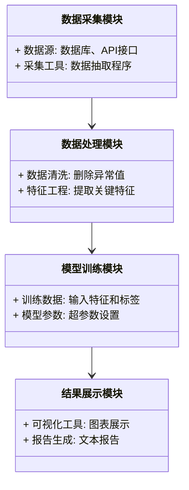
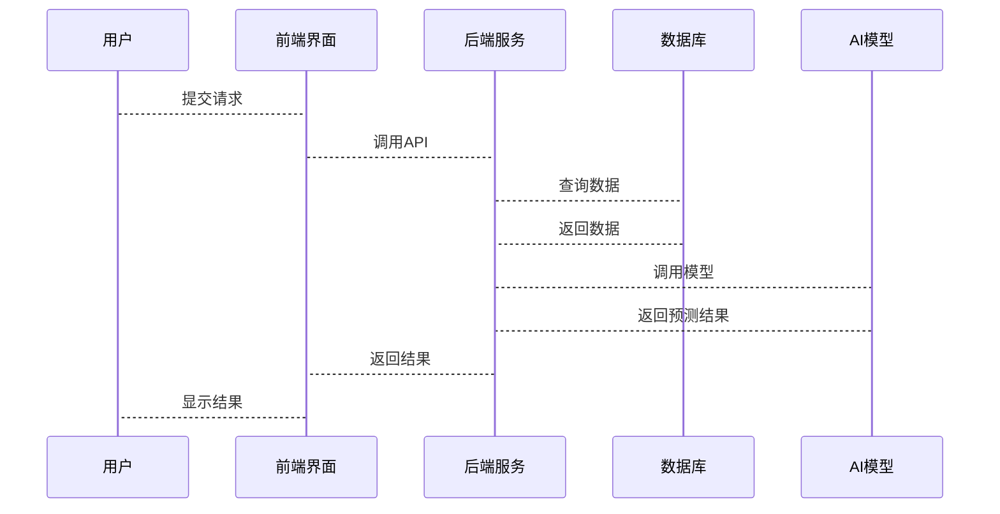

                 


# AI驱动的管理层继任计划分析：评估长期领导力风险

> **关键词**: AI, 管理层继任计划, 领导力风险, 数据驱动, 机器学习

> **摘要**: 本文探讨了如何利用人工智能技术来优化管理层继任计划，通过数据分析和模型构建，评估领导力风险，确保组织的长期稳定发展。文章从背景介绍、核心概念、算法原理、系统架构设计到项目实战，全面解析了AI在继任计划中的应用，为管理层提供了科学的决策支持。

---

## 第一部分: AI驱动的管理层继任计划分析背景与概念

### 第1章: 管理层继任计划的背景与挑战

#### 1.1 管理层继任计划的重要性

##### 1.1.1 组织持续发展的基石
管理层的稳定与企业的发展息息相关。高层领导的突然离职或空缺可能导致业务中断，影响公司声誉和市场地位。通过科学的继任计划，企业可以确保领导层的平稳过渡，保障业务的连续性。

##### 1.1.2 领导层断层的风险
随着企业规模的扩大和业务的复杂化，领导层的多样性和互补性变得尤为重要。然而，领导层断层的风险也在增加，尤其是在关键岗位上，缺乏合适的接班人可能导致企业战略执行受阻。

##### 1.1.3 继任计划的全球趋势
在全球化背景下，企业面临的竞争日益激烈。有效的继任计划不仅能够吸引和留住人才，还能提升员工的忠诚度和归属感，从而增强企业的核心竞争力。

#### 1.2 传统继任计划的局限性

##### 1.2.1 人为判断的偏差
传统的继任计划往往依赖于主观评估，如领导的直觉和经验。这种方式可能存在偏见，且难以量化，导致评估结果不够客观。

##### 1.2.2 数据收集的不完整性
传统方法通常基于有限的数据来源，如绩效评估和面试结果，缺乏对潜在领导力风险的全面分析。

##### 1.2.3 方法的单一性
传统继任计划的方法较为单一，难以应对复杂多变的市场环境。例如，仅关注当前表现而忽视潜在能力的开发。

#### 1.3 AI驱动的解决方案

##### 1.3.1 数据驱动的决策优势
AI技术能够整合多源数据，包括员工的历史表现、技能、行为模式等，提供更全面的评估依据，从而做出更科学的决策。

##### 1.3.2 AI技术的核心作用
AI可以通过机器学习算法分析海量数据，识别潜在的领导力风险，预测继任者的成功率，为管理层提供数据支持。

##### 1.3.3 继任计划的优化路径
通过AI技术，企业可以建立动态评估模型，实时跟踪潜在接班人的发展，优化继任计划的执行效果。

### 第2章: AI驱动的管理层继任计划的核心概念

#### 2.1 核心概念与定义

##### 2.1.1 管理层继任计划的定义
管理层继任计划是指通过系统的方法，识别和培养潜在的领导者，确保在关键岗位出现空缺时，有合适的候选人接任。

##### 2.1.2 AI驱动的定义与特征
AI驱动的继任计划利用人工智能技术，通过数据挖掘和机器学习模型，分析员工数据，预测领导力潜力。

##### 2.1.3 继任计划的评估指标
评估指标包括领导能力、潜力、绩效、文化适应性等，用于衡量潜在接班人的综合素质。

#### 2.2 核心概念之间的关系

##### 2.2.1 数据来源与分析模型的关系
数据来源（如绩效数据、行为数据）是分析模型的输入，模型通过对数据的分析，生成评估结果。

##### 2.2.2 评估指标与AI算法的关联
评估指标是算法的核心，算法通过分析这些指标，预测领导力风险，为继任计划提供支持。

##### 2.2.3 继任风险与组织战略的联系
继任风险直接影响组织的战略执行，有效的继任计划能够确保战略的连续性和稳定性。

#### 2.3 核心概念的ER实体关系图

```mermaid
er
  actor: 管理层继任计划系统
  model: AI分析模型
  data: 数据源
  relation: 数据关联
  attribute: 评估指标
```

---

## 第二部分: AI驱动的管理层继任计划分析算法原理

### 第3章: 数据预处理与特征工程

#### 3.1 数据预处理方法

##### 3.1.1 数据清洗与标准化
对数据进行清洗，处理缺失值和异常值，确保数据的完整性和一致性。

##### 3.1.2 数据缺失值的处理
使用填充、删除或预测方法处理缺失值，保证数据的可用性。

##### 3.1.3 数据归一化与离散化
通过归一化处理，消除特征之间的量纲差异；通过离散化，将连续数据转换为离散类别，便于模型处理。

#### 3.2 特征工程的核心步骤

##### 3.2.1 特征选择与提取
通过相关性分析和主成分分析，选择最具影响力的特征，提高模型的准确性和效率。

##### 3.2.2 特征组合与降维
将多个特征组合，形成新的特征，同时通过降维技术（如PCA）减少特征数量，降低模型复杂度。

##### 3.2.3 特征的可解释性分析
通过SHAP值或LIME方法，解释特征对模型输出的影响，确保评估结果的透明性和可解释性。

#### 3.3 数据预处理的Python实现

##### 3.3.1 数据清洗代码示例

```python
import pandas as pd
import numpy as np

# 示例数据
data = {'name': ['A', 'B', 'C', 'D'],
        'age': [28, np.nan, 32, 35],
        'salary': [50000, 60000, np.nan, 70000]}
df = pd.DataFrame(data)

# 处理缺失值
df['age'].fillna(df['age'].mean(), inplace=True)
df['salary'].fillna(df['salary'].median(), inplace=True)

print(df)
```

##### 3.3.2 特征归一化代码示例

```python
from sklearn.preprocessing import StandardScaler

# 归一化处理
scaler = StandardScaler()
df_normalized = scaler.fit_transform(df[['age', 'salary']])
print(df_normalized)
```

---

### 第4章: AI算法模型的构建与应用

#### 4.1 算法选择与模型构建

##### 4.1.1 机器学习算法的选择
根据数据类型和业务需求，选择合适的算法，如逻辑回归、随机森林或神经网络。

##### 4.1.2 模型构建步骤
包括数据分割、特征工程、模型训练、验证和调优。

##### 4.1.3 模型评估指标
使用准确率、召回率、F1分数等指标评估模型的性能。

#### 4.2 算法实现与优化

##### 4.2.1 算法实现代码示例

```python
from sklearn.ensemble import RandomForestClassifier
from sklearn.metrics import accuracy_score

# 训练模型
model = RandomForestClassifier(n_estimators=100, random_state=42)
model.fit(X_train, y_train)

# 模型预测
y_pred = model.predict(X_test)

# 计算准确率
print("Accuracy:", accuracy_score(y_test, y_pred))
```

##### 4.2.2 模型优化策略
通过网格搜索调整模型参数，选择最优模型结构，提高预测准确率。

##### 4.2.3 模型的可解释性分析
使用特征重要性分析，理解各个特征对预测结果的影响程度。

#### 4.3 算法原理的数学模型

##### 4.3.1 随机森林算法的数学模型
随机森林是一种基于决策树的集成算法，通过构建多个决策树并进行投票或平均，提高模型的准确性和鲁棒性。

##### 4.3.2 神经网络算法的数学模型
神经网络通过多层感知机处理非线性关系，利用反向传播算法调整权重，最小化预测误差。

---

## 第三部分: 系统分析与架构设计

### 第5章: 系统架构设计

#### 5.1 项目介绍

##### 5.1.1 项目目标
构建一个基于AI的管理层继任计划分析系统，帮助组织评估领导力风险，优化继任计划。

##### 5.1.2 项目范围
包括数据收集、模型训练、结果展示等功能模块。

##### 5.1.3 项目约束
数据隐私和安全，模型的可解释性，系统的易用性。

#### 5.2 系统功能设计

##### 5.2.1 系统功能模块
- 数据采集模块：收集员工数据，包括绩效、能力评估等。
- 数据处理模块：清洗和预处理数据，提取特征。
- 模型训练模块：训练AI模型，评估领导力风险。
- 结果展示模块：可视化评估结果，生成报告。

##### 5.2.2 系统功能的领域模型类图



#### 5.3 系统架构设计

##### 5.3.1 系统架构图


##### 5.3.2 系统接口设计
定义RESTful API接口，如`POST /api/train`用于模型训练，`GET /api/results`用于获取评估结果。

##### 5.3.3 系统交互序列图



---

## 第四部分: 项目实战

### 第6章: 环境安装与系统实现

#### 6.1 环境安装

##### 6.1.1 安装Python
```bash
python --version
pip install --upgrade pip
```

##### 6.1.2 安装机器学习库
```bash
pip install numpy pandas scikit-learn
```

#### 6.2 系统核心实现

##### 6.2.1 数据预处理代码

```python
import pandas as pd
from sklearn.model_selection import train_test_split
from sklearn.preprocessing import StandardScaler

# 数据加载
df = pd.read_csv('managers.csv')

# 数据分割
X = df.drop(columns=['id', 'name'])
y = df['potential_score']

X_train, X_test, y_train, y_test = train_test_split(X, y, test_size=0.2, random_state=42)

# 特征归一化
scaler = StandardScaler()
X_train_scaled = scaler.fit_transform(X_train)
X_test_scaled = scaler.transform(X_test)
```

##### 6.2.2 模型训练代码

```python
from sklearn.ensemble import RandomForestClassifier
from sklearn.metrics import classification_report

# 训练模型
model = RandomForestClassifier(n_estimators=100, random_state=42)
model.fit(X_train_scaled, y_train)

# 预测
y_pred = model.predict(X_test_scaled)

# 评估
print(classification_report(y_test, y_pred))
```

---

## 第五部分: 最佳实践与总结

### 第7章: 最佳实践与总结

#### 7.1 项目小结

##### 7.1.1 核心成果
通过AI技术，构建了一个高效的继任计划分析系统，能够准确评估领导力风险，优化管理层的接班安排。

##### 7.1.2 经验总结
数据质量是模型准确性的关键，特征工程和模型调优能够显著提升预测效果，系统的可解释性对于实际应用至关重要。

#### 7.2 最佳实践

##### 7.2.1 数据收集
确保数据的多样性和代表性，优先选择高质量的数据源。

##### 7.2.2 模型选择
根据业务需求选择合适的算法，关注模型的可解释性和实际应用效果。

##### 7.2.3 系统部署
采用微服务架构，确保系统的可扩展性和高可用性。

#### 7.3 未来展望

##### 7.3.1 技术发展
随着AI技术的进步，未来的继任计划分析将更加智能化和自动化。

##### 7.3.2 应用场景
在更多领域（如非营利组织、创业公司）应用AI技术，提升领导力管理的效率。

---

## 作者：AI天才研究院/AI Genius Institute & 禅与计算机程序设计艺术 /Zen And The Art of Computer Programming

---

以上内容涵盖了AI驱动的管理层继任计划分析的各个方面，从理论到实践，为读者提供了全面的指导和深入的分析，帮助企业在数字化转型中更好地管理领导层的继任问题。

