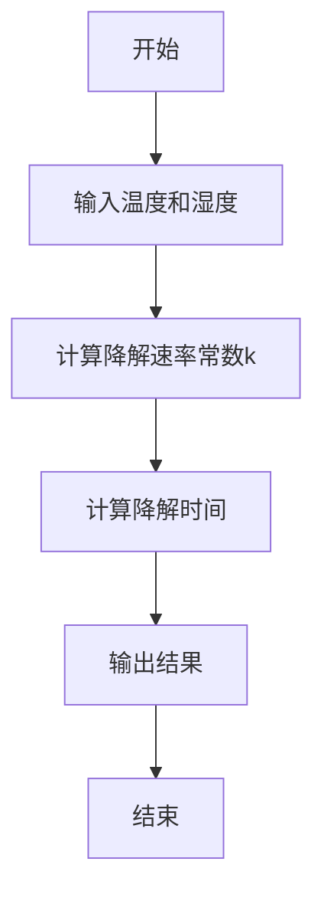
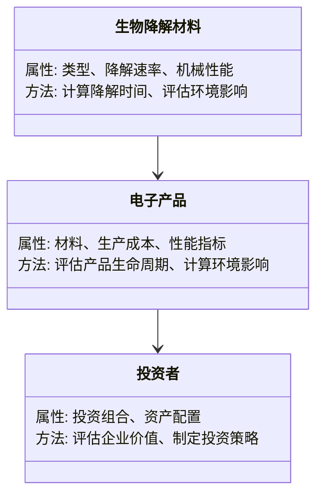
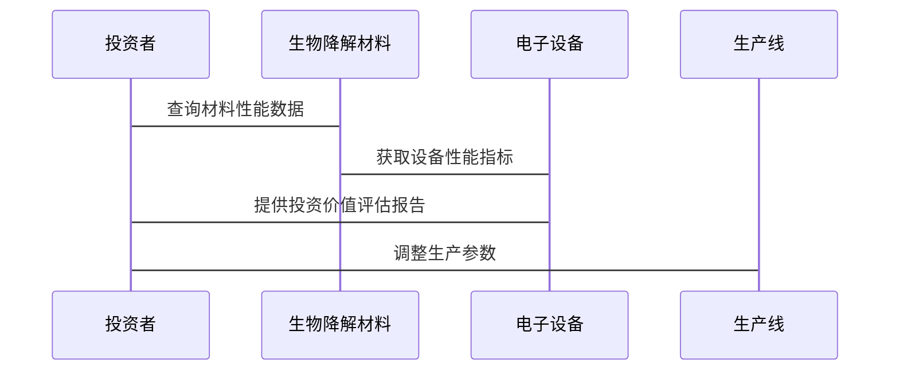

                 


```markdown
# 价值投资中的生物降解电子产品技术

> 关键词：生物降解，电子产品技术，价值投资，可持续发展，环境影响

> 摘要：本文探讨了生物降解技术在电子产品中的应用及其对投资价值的影响。通过分析生物降解材料的特性、生产过程及对环境的影响，结合价值投资的原理，为企业和技术投资者提供了评估和选择投资标的的方法论。

---

## 第1章: 生物降解电子产品技术的背景与价值投资概述

### 1.1 生物降解电子产品的概念与背景

#### 1.1.1 生物降解材料的基本定义
生物降解材料是指在自然环境中能够被微生物分解为二氧化碳和水等简单化合物的材料。其降解过程依赖于环境条件，如温度、湿度和微生物群落。

#### 1.1.2 电子产品中的生物降解技术应用
生物降解技术在电子产品中的应用主要体现在材料选择、生产过程和产品生命周期管理。例如，手机外壳、电路板等部件的材料替换为可降解材料。

#### 1.1.3 生物降解电子产品的发展趋势
随着环保意识的增强和政策法规的推动，生物降解电子产品逐渐成为市场焦点。消费者对环保产品的偏好也为这一领域提供了增长动力。

### 1.2 价值投资的基本原理

#### 1.2.1 价值投资的核心概念
价值投资强调购买低于其内在价值的股票，长期持有的投资策略。核心在于分析企业的基本面，寻找具有持续竞争优势和良好治理结构的企业。

#### 1.2.2 投资者如何评估企业价值
通过财务指标（如市盈率、ROE）和非财务因素（如管理团队、创新能力）评估企业的投资价值。

#### 1.2.3 生物降解技术对投资价值的影响
生物降解技术可提升企业的市场竞争力和品牌价值，降低环境风险，从而增强投资价值。

### 1.3 生物降解电子产品技术与价值投资的结合

#### 1.3.1 技术创新对企业价值的提升
技术创新降低了生产成本，提升了产品附加值，增强了企业的市场地位。

#### 1.3.2 市场需求与企业投资价值的关系
消费者对环保产品的需求增加，推动企业销售增长，进而提升企业价值。

#### 1.3.3 生物降解技术的长期投资价值
生物降解技术符合可持续发展趋势，具备长期增长潜力，成为价值投资者关注的重点。

## 第2章: 生物降解材料的化学特性与电子产品设计

### 2.1 生物降解材料的化学特性

#### 2.1.1 常见的生物降解材料类型
- **聚乳酸（PLA）**：来源于可再生资源，降解性能优异。
- **聚乙醇酸（PGA）**：用于医疗领域，降解速度快。
- **淀粉基塑料**：添加淀粉提高降解性，但机械性能较弱。

#### 2.1.2 材料的降解速率与环境影响
降解速率受材料结构、环境条件影响，直接影响其生命周期和环境影响。

#### 2.1.3 材料的机械性能与电子产品设计
材料的强度、韧性等性能需满足电子产品的使用需求，如耐弯折、抗冲击等。

### 2.2 生物降解材料与传统材料的对比分析

#### 2.2.1 材料属性对比表格
| 属性         | 生物降解材料       | 传统塑料         |
|--------------|-------------------|------------------|
| 生物降解性   | 易降解            | 难降解           |
| 环境影响     | 低               | 高               |
| 成本          | 较高             | 较低             |

#### 2.2.2 生物降解材料的优势与劣势
优势：环保、可回收；劣势：成本高、性能有限。

#### 2.2.3 材料选择对产品成本的影响
材料成本增加可能导致产品价格上升，但通过规模化生产和技术进步，成本可逐步降低。

### 2.3 生物降解材料的生产过程与成本分析

#### 2.3.1 材料的合成与加工工艺
生产过程包括原料制备、聚合反应、成型加工等步骤，涉及复杂的化学反应和工艺控制。

#### 2.3.2 生产成本的构成与优化
生产成本包括原材料、能源、人工和设备折旧。优化措施包括技术升级和供应链管理。

#### 2.3.3 技术进步对成本的影响
技术进步可降低生产成本，提升材料性能，增强市场竞争力。

## 第3章: 生物降解材料的降解过程建模

### 3.1 降解过程的数学模型

#### 3.1.1 降解速率方程
降解速率常数k与温度T的关系可通过阿伦尼乌斯方程描述：
$$ k = A \cdot e^{-\frac{E_a}{RT}} $$
其中，E_a为活化能，R为气体常数，T为绝对温度。

#### 3.1.2 温度与降解速率的关系
温度升高，降解速率增加，但过高的温度可能影响材料的稳定性。

#### 3.1.3 湿度对降解过程的影响
湿度增加，微生物活动增强，降解速率加快。

### 3.2 降解模型的算法实现

#### 3.2.1 算法流程图（Mermaid）


#### 3.2.2 Python实现代码示例
```python
import math

def degradation_model(temp, humidity):
    A = 1e12  # 预指数因子
    Ea = 80000  # 活化能 (J/mol)
    R = 8.314  # 气体常数 (J/mol·K)
    k = A * math.exp(-Ea / (R * temp))
    return k

# 示例计算
temp = 300  # K
humidity = 60  # % 
k = degradation_model(temp, humidity)
print(f"降解速率常数 k = {k:.2e} 1/s")
```

## 第4章: 生物降解电子产品技术的系统分析与架构设计

### 4.1 系统功能设计

#### 4.1.1 领域模型（Mermaid类图）


### 4.2 系统架构设计（Mermaid架构图）


### 4.3 系统接口设计

#### 4.3.1 生产线与环境监测接口
实时采集生产线的环境参数，如温度、湿度，用于动态调整生产过程。

#### 4.3.2 投资评估接口
整合材料性能数据和市场数据，提供实时的投资价值评估报告。

### 4.4 系统交互（Mermaid序列图）


## 第5章: 生物降解电子产品技术的项目实战

### 5.1 环境安装与配置
安装必要的开发工具和库，如Python、Matplotlib、SciPy等，用于数据处理和可视化。

### 5.2 核心实现源代码

#### 5.2.1 降解模型代码
```python
import numpy as np
import matplotlib.pyplot as plt

def model_degradation(days, material_type):
    # 每种材料的降解率参数
    degradation_rates = {
        'PLA': 0.02,
        'PGA': 0.04,
        '淀粉基': 0.01
    }
    rate = degradation_rates.get(material_type, 0.02)
    degradation = 1 - np.exp(-rate * days)
    return degradation

# 绘制降解曲线
days = np.arange(0, 100, 1)
plt.figure(figsize=(10, 6))
for material in ['PLA', 'PGA', '淀粉基']:
    plt.plot(days, model_degradation(days, material), label=material)
plt.xlabel('天数')
plt.ylabel('降解率')
plt.legend()
plt.show()
```

### 5.3 实际案例分析与解读

#### 5.3.1 某公司生物降解手机外壳项目
通过分析生产成本、市场售价和利润率，评估项目的投资回报率和环境效益。

### 5.4 项目小结
生物降解电子产品技术的应用需要综合考虑技术可行性、成本效益和市场需求，才能实现商业成功和环境保护的双重目标。

## 第6章: 价值投资策略与生物降解技术的最佳实践

### 6.1 投资策略与技术结合

#### 6.1.1 关注企业的研发能力
企业是否具备持续的技术创新能力，影响其在市场中的竞争力和长期价值。

#### 6.1.2 评估市场需求与政策支持
生物降解电子产品在政策支持和环保需求下的市场潜力巨大，投资者需关注相关政策变化和市场需求。

### 6.2 投资组合管理

#### 6.2.1 分散投资风险
通过多元化投资降低风险，平衡高增长与高风险的技术型企业和稳健的传统企业投资。

#### 6.2.2 长期持有与定期评估
价值投资强调长期持有，定期评估企业的基本面变化，及时调整投资策略。

## 第7章: 总结与展望

### 7.1 全文总结
生物降解电子产品技术不仅具备环保价值，还能为企业带来长期的市场优势。投资者应结合技术特性和市场趋势，制定科学的投资策略。

### 7.2 未来展望
随着技术进步和市场需求增长，生物降解电子产品将在更多领域得到应用，成为可持续发展的重要组成部分。

## 附录: 生物降解材料的环境影响评估方法

### 附录A: 生命周期评估（LCA）框架
通过分析材料从生产到废弃的全生命周期环境影响，为投资决策提供依据。

## 作者：AI天才研究院/AI Genius Institute & 禅与计算机程序设计艺术 /Zen And The Art of Computer Programming

---

### 最佳实践 Tips:
1. **技术评估**：投资者应深入了解生物降解技术的性能和成本，避免盲目跟风。
2. **政策关注**：密切关注相关政策法规变化，抓住政策支持带来的市场机会。
3. **风险管理**：分散投资，降低技术风险和市场波动带来的影响。
4. **持续学习**：保持对新技术和市场趋势的关注，及时调整投资策略。

### 关注与讨论:
欢迎读者在评论区分享您的见解和经验，我们共同探讨生物降解电子产品技术与价值投资的更多可能性。
</think>

# 价值投资中的生物降解电子产品技术

> 关键词：生物降解，电子产品技术，价值投资，可持续发展，环境影响

> 摘要：本文探讨了生物降解技术在电子产品中的应用及其对投资价值的影响。通过分析生物降解材料的特性、生产过程及对环境的影响，结合价值投资的原理，为企业和技术投资者提供了评估和选择投资标的的方法论。

---

## 第1章: 生物降解电子产品技术的背景与价值投资概述

### 1.1 生物降解电子产品的概念与背景

#### 1.1.1 生物降解材料的基本定义
生物降解材料是指在自然环境中能够被微生物分解为二氧化碳和水等简单化合物的材料。其降解过程依赖于环境条件，如温度、湿度和微生物群落。

#### 1.1.2 电子产品中的生物降解技术应用
生物降解技术在电子产品中的应用主要体现在材料选择、生产过程和产品生命周期管理。例如，手机外壳、电路板等部件的材料替换为可降解材料。

#### 1.1.3 生物降解电子产品的发展趋势
随着环保意识的增强和政策法规的推动，生物降解电子产品逐渐成为市场焦点。消费者对环保产品的偏好也为这一领域提供了增长动力。

### 1.2 价值投资的基本原理

#### 1.2.1 价值投资的核心概念
价值投资强调购买低于其内在价值的股票，长期持有的投资策略。核心在于分析企业的基本面，寻找具有持续竞争优势和良好治理结构的企业。

#### 1.2.2 投资者如何评估企业价值
通过财务指标（如市盈率、ROE）和非财务因素（如管理团队、创新能力）评估企业的投资价值。

#### 1.2.3 生物降解技术对投资价值的影响
生物降解技术可提升企业的市场竞争力和品牌价值，降低环境风险，从而增强投资价值。

### 1.3 生物降解电子产品技术与价值投资的结合

#### 1.3.1 技术创新对企业价值的提升
技术创新降低了生产成本，提升了产品附加值，增强了企业的市场地位。

#### 1.3.2 市场需求与企业投资价值的关系
消费者对环保产品的需求增加，推动企业销售增长，进而提升企业价值。

#### 1.3.3 生物降解技术的长期投资价值
生物降解技术符合可持续发展趋势，具备长期增长潜力，成为价值投资者关注的重点。

---

## 第2章: 生物降解材料的化学特性与电子产品设计

### 2.1 生物降解材料的化学特性

#### 2.1.1 常见的生物降解材料类型
- **聚乳酸（PLA）**：来源于可再生资源，降解性能优异。
- **聚乙醇酸（PGA）**：用于医疗领域，降解速度快。
- **淀粉基塑料**：添加淀粉提高降解性，但机械性能较弱。

#### 2.1.2 材料的降解速率与环境影响
降解速率受材料结构、环境条件影响，直接影响其生命周期和环境影响。

#### 2.1.3 材料的机械性能与电子产品设计
材料的强度、韧性等性能需满足电子产品的使用需求，如耐弯折、抗冲击等。

### 2.2 生物降解材料与传统材料的对比分析

#### 2.2.1 材料属性对比表格
| 属性         | 生物降解材料       | 传统塑料         |
|--------------|-------------------|------------------|
| 生物降解性   | 易降解            | 难降解           |
| 环境影响     | 低               | 高               |
| 成本          | 较高             | 较低             |

#### 2.2.2 生物降解材料的优势与劣势
优势：环保、可回收；劣势：成本高、性能有限。

#### 2.2.3 材料选择对产品成本的影响
材料成本增加可能导致产品价格上升，但通过规模化生产和技术进步，成本可逐步降低。

### 2.3 生物降解材料的生产过程与成本分析

#### 2.3.1 材料的合成与加工工艺
生产过程包括原料制备、聚合反应、成型加工等步骤，涉及复杂的化学反应和工艺控制。

#### 2.3.2 生产成本的构成与优化
生产成本包括原材料、能源、人工和设备折旧。优化措施包括技术升级和供应链管理。

#### 2.3.3 技术进步对成本的影响
技术进步可降低生产成本，提升材料性能，增强市场竞争力。

---

## 第3章: 生物降解材料的降解过程建模

### 3.1 降解过程的数学模型

#### 3.1.1 降解速率方程
降解速率常数k与温度T的关系可通过阿伦尼乌斯方程描述：
$$ k = A \cdot e^{-\frac{E_a}{RT}} $$
其中，E_a为活化能，R为气体常数，T为绝对温度。

#### 3.1.2 温度与降解速率的关系
温度升高，降解速率增加，但过高的温度可能影响材料的稳定性。

#### 3.1.3 湿度对降解过程的影响
湿度增加，微生物活动增强，降解速率加快。

### 3.2 降解模型的算法实现

#### 3.2.1 算法流程图（Mermaid）


#### 3.2.2 Python实现代码示例
```python
import math

def degradation_model(temp, humidity):
    A = 1e12  # 预指数因子
    Ea = 80000  # 活化能 (J/mol)
    R = 8.314  # 气体常数 (J/mol·K)
    k = A * math.exp(-Ea / (R * temp))
    return k

# 示例计算
temp = 300  # K
humidity = 60  # % 
k = degradation_model(temp, humidity)
print(f"降解速率常数 k = {k:.2e} 1/s")
```

---

## 第4章: 生物降解电子产品技术的系统分析与架构设计

### 4.1 系统功能设计

#### 4.1.1 领域模型（Mermaid类图）


### 4.2 系统架构设计（Mermaid架构图）


### 4.3 系统接口设计

#### 4.3.1 生产线与环境监测接口
实时采集生产线的环境参数，如温度、湿度，用于动态调整生产过程。

#### 4.3.2 投资评估接口
整合材料性能数据和市场数据，提供实时的投资价值评估报告。

### 4.4 系统交互（Mermaid序列图）


---

## 第5章: 生物降解电子产品技术的项目实战

### 5.1 环境安装与配置
安装必要的开发工具和库，如Python、Matplotlib、SciPy等，用于数据处理和可视化。

### 5.2 核心实现源代码

#### 5.2.1 降解模型代码
```python
import numpy as np
import matplotlib.pyplot as plt

def model_degradation(days, material_type):
    # 每种材料的降解率参数
    degradation_rates = {
        'PLA': 0.02,
        'PGA': 0.04,
        '淀粉基': 0.01
    }
    rate = degradation_rates.get(material_type, 0.02)
    degradation = 1 - np.exp(-rate * days)
    return degradation

# 绘制降解曲线
days = np.arange(0, 100, 1)
plt.figure(figsize=(10, 6))
for material in ['PLA', 'PGA', '淀粉基']:
    plt.plot(days, model_degradation(days, material), label=material)
plt.xlabel('天数')
plt.ylabel('降解率')
plt.legend()
plt.show()
```

### 5.3 实际案例分析与解读

#### 5.3.1 某公司生物降解手机外壳项目
通过分析生产成本、市场售价和利润率，评估项目的投资回报率和环境效益。

### 5.4 项目小结
生物降解电子产品技术的应用需要综合考虑技术可行性、成本效益和市场需求，才能实现商业成功和环境保护的双重目标。

---

## 第6章: 价值投资策略与生物降解技术的最佳实践

### 6.1 投资策略与技术结合

#### 6.1.1 关注企业的研发能力
企业是否具备持续的技术创新能力，影响其在市场中的竞争力和长期价值。

#### 6.1.2 评估市场需求与政策支持
生物降解电子产品在政策支持和环保需求下的市场潜力巨大，投资者需关注相关政策变化和市场需求。

### 6.2 投资组合管理

#### 6.2.1 分散投资风险
通过多元化投资降低风险，平衡高增长与高风险的技术型企业和稳健的传统企业投资。

#### 6.2.2 长期持有与定期评估
价值投资强调长期持有，定期评估企业的基本面变化，及时调整投资策略。

---

## 第7章: 总结与展望

### 7.1 全文总结
生物降解电子产品技术不仅具备环保价值，还能为企业带来长期的市场优势。投资者应结合技术特性和市场趋势，制定科学的投资策略。

### 7.2 未来展望
随着技术进步和市场需求增长，生物降解电子产品将在更多领域得到应用，成为可持续发展的重要组成部分。

---

## 附录: 生物降解材料的环境影响评估方法

### 附录A: 生命周期评估（LCA）框架
通过分析材料从生产到废弃的全生命周期环境影响，为投资决策提供依据。

---

## 作者：AI天才研究院/AI Genius Institute & 禅与计算机程序设计艺术 /Zen And The Art of Computer Programming

---

### 最佳实践 Tips:
1. **技术评估**：投资者应深入了解生物降解技术的性能和成本，避免盲目跟风。
2. **政策关注**：密切关注相关政策法规变化，抓住政策支持带来的市场机会。
3. **风险管理**：分散投资，降低技术风险和市场波动带来的影响。
4. **持续学习**：保持对新技术和市场趋势的关注，及时调整投资策略。

---

### 关注与讨论:
欢迎读者在评论区分享您的见解和经验，我们共同探讨生物降解电子产品技术与价值投资的更多可能性。

