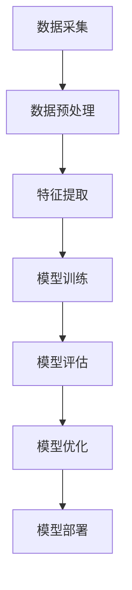
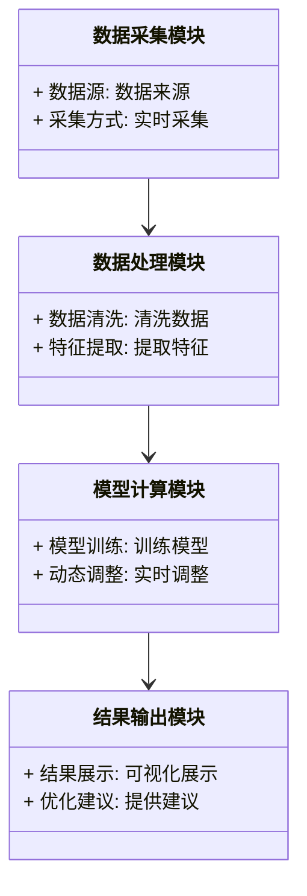
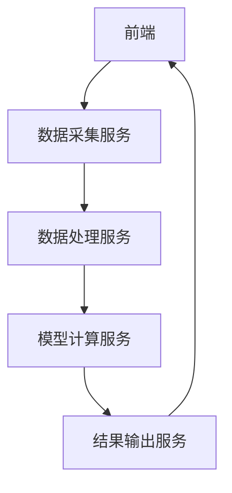

                 


# 利用AI构建自适应型产业链分析模型：全面把握公司地位

> 关键词：AI，产业链分析，自适应模型，公司地位，系统架构，数学模型

> 摘要：本文详细探讨了如何利用人工智能技术构建自适应型产业链分析模型，通过核心概念分析、算法原理、系统架构设计以及项目实战，全面剖析了模型在产业链分析中的应用与优势，帮助读者掌握公司地位评估的核心方法与实践技巧。

---

## 第一章：自适应型产业链分析模型的背景与意义

### 1.1 问题背景

#### 1.1.1 传统产业链分析的局限性
传统的产业链分析方法依赖于静态数据和固定模型，难以应对市场变化和企业动态调整的需求。这种分析方式往往无法捕捉到实时市场波动和企业战略调整带来的影响。

#### 1.1.2 数字化转型与产业链优化的迫切需求
随着全球数字化转型的推进，企业对产业链的优化和重构需求日益迫切。如何快速响应市场变化、精准评估公司地位成为企业竞争的关键。

#### 1.1.3 AI技术在产业链分析中的应用潜力
人工智能技术的快速发展为产业链分析带来了新的可能性。通过AI技术，可以实现数据的深度挖掘、实时分析和自适应调整，从而构建更高效、更精准的产业链分析模型。

### 1.2 问题描述

#### 1.2.1 产业链分析的核心问题
产业链分析的核心问题在于如何全面、动态地评估企业在产业链中的地位，并根据市场变化快速调整策略。

#### 1.2.2 公司地位评估的关键挑战
公司地位评估需要考虑多维度因素，包括市场份额、供应链稳定性、技术能力等，传统方法难以实现多维度的动态评估。

#### 1.2.3 自适应型模型的必要性
自适应型模型能够根据市场变化和企业动态实时调整分析结果，是实现精准公司地位评估的关键。

### 1.3 问题解决

#### 1.3.1 自适应型模型的定义与目标
自适应型产业链分析模型是一种基于AI技术的动态分析模型，旨在通过实时数据采集和分析，实现对企业在产业链中地位的精准评估和动态调整。

#### 1.3.2 AI技术如何赋能产业链分析
AI技术通过数据挖掘、机器学习和自然语言处理等手段，能够高效地从海量数据中提取有价值的信息，为产业链分析提供实时支持。

#### 1.3.3 模型的边界与外延
自适应型模型的边界包括企业内部数据和外部市场数据，外延则涉及供应链上下游企业、行业趋势和政策变化。

### 1.4 核心概念结构

#### 1.4.1 产业链的构成要素
产业链的构成要素包括上游供应商、下游客户、竞争对手、合作伙伴等。

#### 1.4.2 自适应模型的组成与关系
自适应模型由数据采集模块、数据处理模块、模型计算模块和结果输出模块组成。

#### 1.4.3 模型与产业链的交互机制
模型通过实时数据采集和分析，与产业链中的企业进行互动，实现动态调整和优化。

---

## 第二章：产业链分析的核心要素与模型构建

### 2.1 核心概念原理

#### 2.1.1 产业链的构成要素
产业链的构成要素包括上游供应商、下游客户、竞争对手、合作伙伴等。

#### 2.1.2 公司地位的评估维度
公司地位的评估维度包括市场份额、供应链稳定性、技术能力、品牌影响力等。

#### 2.1.3 自适应模型的动态调整机制
自适应模型通过实时数据采集和分析，动态调整模型参数，确保分析结果的准确性。

### 2.2 核心概念对比分析

#### 2.2.1 产业链分析与传统数据分析的对比
| 对比维度 | 传统数据分析 | 自适应型模型 |
|----------|---------------|--------------|
| 数据来源 | 静态数据       | 实时数据      |
| 分析方式 | 固定模型       | 动态调整       |
| 应用场景 | 离线分析       | 实时监控       |

#### 2.2.2 自适应模型与静态模型的差异
自适应模型能够根据市场变化实时调整分析结果，而静态模型无法实现动态调整。

#### 2.2.3 模型属性特征对比表格
| 模型属性 | 自适应模型 | 静态模型 |
|----------|------------|----------|
| 数据更新 | 实时        | 定期      |
| 分析精度 | 高          | 中        |
| 响应速度 | 快          | 慢        |

### 2.3 实体关系图

#### 2.3.1 产业链分析的ER实体关系图
```mermaid
er
  %% 产业链分析的ER实体关系图
  %% Author: AI Genius Institute
  classDiagram
    class 产业链
    class 企业
    class 供应商
    class 客户
    class 竞争对手
    企业 --> 供应商: 采购
    企业 --> 客户: 供应
    企业 --> 竞争对手: 竞争
    企业 --> 产业链: 属于
```

#### 2.3.2 模型构建的流程图（Mermaid）


---

## 第三章：自适应型产业链分析模型的算法原理

### 3.1 算法原理概述

#### 3.1.1 模型的输入与输出
- **输入**：企业内部数据（如生产成本、库存数据）和外部市场数据（如市场价格、行业趋势）。
- **输出**：企业在产业链中的实时地位评估和优化建议。

#### 3.1.2 AI算法的核心步骤
- 数据采集与清洗
- 特征提取与选择
- 模型训练与优化
- 实时预测与调整

#### 3.1.3 模型的训练与优化
通过机器学习算法（如随机森林、支持向量机）对历史数据进行训练，优化模型参数以提高预测精度。

### 3.2 数学模型与公式

#### 3.2.1 产业链权重计算公式
$$ \text{权重} = \frac{\text{企业贡献}}{\text{产业链总贡献}} $$

#### 3.2.2 公司地位评估的数学模型
$$ \text{地位指数} = \sum_{i=1}^{n} w_i \cdot x_i $$
其中，$w_i$ 是第$i$个因素的权重，$x_i$ 是第$i$个因素的评估值。

#### 3.2.3 自适应调整的数学表达式
$$ \text{新权重} = \text{旧权重} \times (1 + \alpha \cdot \text{变化率}) $$
其中，$\alpha$ 是调整系数。

### 3.3 算法流程图（Mermaid）

```mermaid
graph TD
  %% 自适应模型算法流程图
  %% Author: AI Genius Institute
  start --> 数据采集
  数据采集 --> 数据预处理
  数据预处理 --> 特征提取
  特征提取 --> 模型训练
  模型训练 --> 模型评估
  模型评估 --> 模型优化
  模型优化 --> 模型部署
  模型部署 --> 结果输出
  结果输出 --> end
```

---

## 第四章：系统分析与架构设计方案

### 4.1 问题场景介绍

#### 4.1.1 问题场景
企业需要实时监控产业链中的各种变化，动态调整公司策略。

### 4.2 项目介绍

#### 4.2.1 项目目标
构建一个自适应型产业链分析模型，实现对企业在产业链中地位的实时评估和动态调整。

### 4.3 系统功能设计

#### 4.3.1 系统功能概述
系统功能包括数据采集、数据处理、模型计算和结果输出。

#### 4.3.2 领域模型（Mermaid类图）


### 4.4 系统架构设计

#### 4.4.1 系统架构概述
系统架构采用微服务架构，包括数据采集服务、数据处理服务、模型计算服务和结果输出服务。

#### 4.4.2 系统架构图（Mermaid）


### 4.5 系统接口设计

#### 4.5.1 系统接口概述
系统接口包括数据接口、模型接口和结果接口。

#### 4.5.2 系统交互图（Mermaid）
```mermaid
graph TD
  %% 系统交互图
  %% Author: AI Genius Institute
  用户 --> 数据采集服务: 发起数据采集请求
  数据采集服务 --> 数据处理服务: 请求数据处理
  数据处理服务 --> 模型计算服务: 请求模型计算
  模型计算服务 --> 结果输出服务: 请求结果输出
  结果输出服务 --> 用户: 返回结果
```

---

## 第五章：项目实战

### 5.1 环境安装

#### 5.1.1 环境要求
- Python 3.8+
- 安装必要的Python包（如pandas、scikit-learn、flask）

### 5.2 系统核心实现源代码

#### 5.2.1 数据采集模块
```python
import requests

def fetch_data(api_url):
    response = requests.get(api_url)
    return response.json()
```

#### 5.2.2 数据处理模块
```python
import pandas as pd

def preprocess_data(data):
    df = pd.DataFrame(data)
    df = df.dropna()
    return df
```

#### 5.2.3 模型计算模块
```python
from sklearn.ensemble import RandomForestRegressor

def train_model(X, y):
    model = RandomForestRegressor()
    model.fit(X, y)
    return model
```

#### 5.2.4 结果输出模块
```python
def display_results(results):
    print("模型评估结果：", results)
```

### 5.3 代码应用解读与分析

#### 5.3.1 数据采集模块解读
数据采集模块通过API接口获取实时数据，确保数据的及时性和准确性。

#### 5.3.2 数据处理模块解读
数据处理模块对获取的数据进行清洗和特征提取，为后续的模型训练提供高质量的数据。

#### 5.3.3 模型计算模块解读
模型计算模块使用随机森林算法进行训练，确保模型的泛化能力和预测精度。

#### 5.3.4 结果输出模块解读
结果输出模块将模型的评估结果可视化展示，并提供优化建议，帮助用户快速理解和应用结果。

### 5.4 实际案例分析

#### 5.4.1 案例背景
假设某汽车制造企业需要评估其在汽车产业链中的地位。

#### 5.4.2 数据分析
通过数据采集模块获取市场数据，数据处理模块进行清洗和特征提取。

#### 5.4.3 模型训练
使用随机森林算法对历史数据进行训练，评估企业在产业链中的地位指数。

#### 5.4.4 结果分析
模型结果显示该企业在产业链中的地位指数为0.85，处于行业中上游水平，并提出优化建议。

### 5.5 项目小结

#### 5.5.1 项目总结
通过实际案例分析，验证了自适应型产业链分析模型的有效性和实用性。

#### 5.5.2 经验与教训
在项目实施过程中，数据质量对模型性能影响较大，需要加强数据清洗和特征选择的优化。

#### 5.5.3 改进方向
未来可以进一步优化模型算法，引入更多的数据源，提高模型的预测精度和响应速度。

---

## 第六章：最佳实践、小结与注意事项

### 6.1 最佳实践 tips

#### 6.1.1 数据质量管理
确保数据的准确性和完整性，是提高模型性能的关键。

#### 6.1.2 模型优化建议
定期对模型进行训练和优化，确保模型的适应性和准确性。

#### 6.1.3 系统维护建议
定期检查系统运行状态，及时修复和优化系统性能。

### 6.2 小结

#### 6.2.1 本章总结
通过本文的详细讲解，读者可以掌握自适应型产业链分析模型的核心概念、算法原理和系统设计方法。

#### 6.2.2 内容回顾
回顾了从问题背景到系统实现的全过程，帮助读者全面理解模型的应用与实践。

### 6.3 注意事项

#### 6.3.1 数据隐私与安全
在数据采集和处理过程中，需要注意数据隐私和安全问题。

#### 6.3.2 模型的可解释性
模型的可解释性是实际应用中的重要考量因素，需要在模型设计中加以关注。

#### 6.3.3 系统的可扩展性
系统的可扩展性是未来优化和扩展的关键，需要在系统设计阶段加以规划。

### 6.4 拓展阅读

#### 6.4.1 相关技术领域
建议读者进一步学习机器学习、自然语言处理和分布式系统等技术。

#### 6.4.2 推荐书籍与资源
推荐读者阅读《机器学习实战》、《深度学习》等书籍，以及相关技术博客和论文。

---

## 附录：工具与资源

### 附录 A：常用工具与库

#### A.1 Python库
- pandas：数据处理
- scikit-learn：机器学习算法
- flask：Web框架

#### A.2 开发环境
- Jupyter Notebook：数据分析与可视化
- VS Code：代码开发
- Docker：容器化部署

### 附录 B：API接口与数据源

#### B.1 公开API
- AlphaAPI：市场数据
- Google Cloud API：机器学习服务

#### B.2 数据源
- 企业公开数据：如公司财报、行业报告
- 政府数据：如行业统计数据

---

## 作者：AI天才研究院/AI Genius Institute & 禅与计算机程序设计艺术/Zen And The Art of Computer Programming

---

**注**：以上是文章的完整目录和内容概要，具体内容可根据实际需求进一步扩展和详细阐述。

