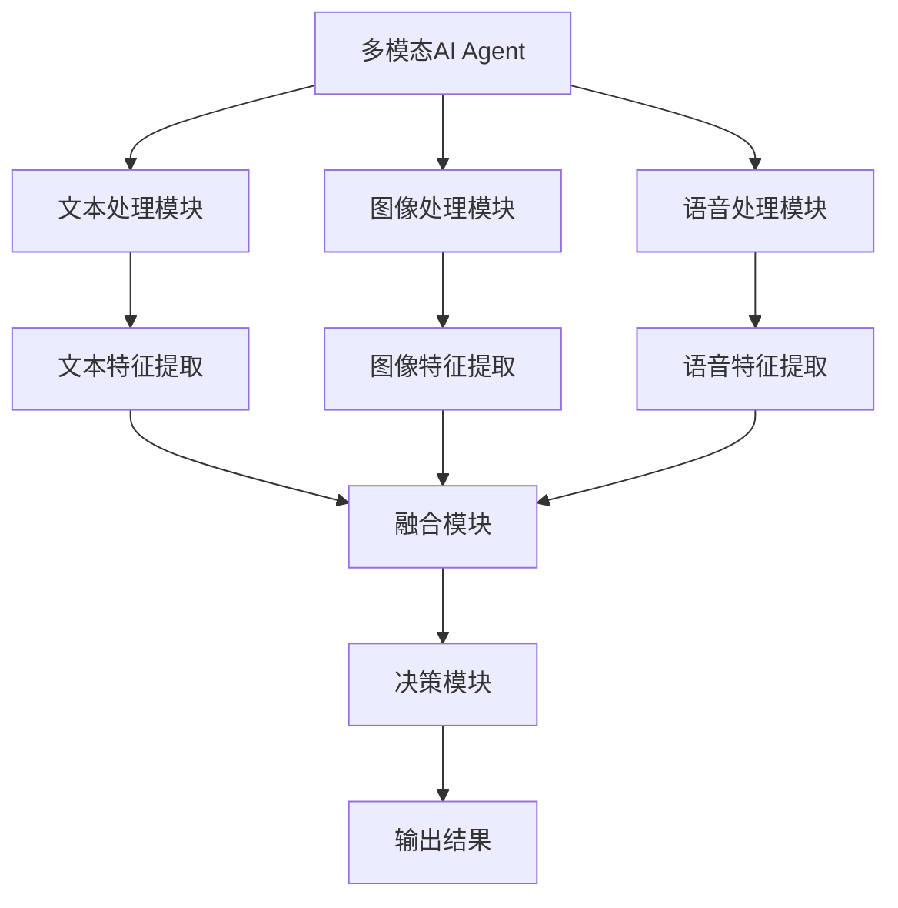

                 


# 多模态AI Agent：整合文本、图像和语音

> 关键词：多模态AI Agent，文本处理，图像处理，语音处理，数据融合，系统架构

> 摘要：本文详细探讨了多模态AI Agent的整合技术，涵盖了文本、图像和语音的处理方法，以及如何将这些模态数据融合在一起，构建高效的AI Agent系统。通过实际案例分析和系统设计，展示了多模态AI Agent在各个领域的应用潜力。

---

## 第一部分：多模态AI Agent的背景与概述

### 第1章：多模态AI Agent概述

#### 1.1 多模态AI Agent的背景与意义

- **1.1.1 多模态数据的定义与特点**
  - 多模态数据是指整合多种数据形式（如文本、图像、语音）的数据集。
  - 特点：互补性、多样性、复杂性。

- **1.1.2 多模态AI Agent的核心概念**
  - AI Agent能够处理和理解多种模态的数据，并做出智能决策。
  - 应用场景：智能客服、自动驾驶、虚拟助手等。

- **1.1.3 多模态技术在AI Agent中的重要性**
  - 提高AI Agent的理解能力和交互能力。
  - 融合多模态数据可以提供更全面的信息，增强系统的鲁棒性和准确性。

#### 1.2 多模态数据的整合与应用

- **1.2.1 文本、图像和语音的整合方式**
  - 并行处理：分别处理每种模态的数据，然后进行融合。
  - 串行处理：逐步处理不同模态的数据，逐层融合。

- **1.2.2 多模态数据在AI Agent中的应用场景**
  - 智能客服：通过文本和语音识别用户意图。
  - 智能助手：结合文本、图像和语音进行多任务处理。
  - 医疗AI：整合文本病历和医学图像进行诊断支持。

- **1.2.3 多模态技术的优势与挑战**
  - 优势：提高准确性，增强用户体验。
  - 挑战：数据异构性、计算复杂性、模型融合难度。

#### 1.3 多模态AI Agent的技术架构

- **1.3.1 多模态数据处理的层次结构**
  - 数据采集层：获取多模态数据。
  - 数据处理层：对每种模态数据进行预处理和特征提取。
  - 数据融合层：将不同模态的特征进行融合，生成统一的表示。
  - 应用层：基于融合后的数据进行智能决策和输出。

- **1.3.2 多模态模型的融合方法**
  - 特征级融合：将各模态的特征向量进行加权求和或拼接。
  - 决策级融合：在高层进行分类结果的整合。

- **1.3.3 多模态AI Agent的系统架构图（Mermaid）**



---

## 第二部分：多模态数据处理算法

### 第2章：文本处理算法

#### 2.1 自然语言处理基础

- **2.1.1 词嵌入（Word Embedding）**
  - 使用Word2Vec生成词向量。
  - 示例代码：

  ```python
  import gensim
  model = gensim.models.Word2Vec(sentences, vector_size=100, window=5)
  ```

  - 词嵌入的可视化可以通过t-SNE进行。

- **2.1.2 句子表示（Sentence Representation）**
  - 使用句嵌入模型（如BERT）生成句子向量。
  - 示例代码：

  ```python
  from transformers import BertTokenizer, BertModel
  tokenizer = BertTokenizer.from_pretrained('bert-base-uncased')
  model = BertModel.from_pretrained('bert-base-uncased')
  input_ids = tokenizer.encode('Hello, how are you?', add_special_tokens=True)
  outputs = model(input_ids=input_ids)
  sentence_embedding = outputs.last_hidden_state[0]
  ```

- **2.1.3 文本分类与生成**
  - 分类任务：使用卷积神经网络（CNN）或循环神经网络（RNN）进行分类。
  - 生成任务：使用生成对抗网络（GAN）或Transformer模型生成文本。

#### 2.2 文本分类与生成

- **2.2.1 文本分类算法**
  - 使用CNN进行文本分类：
    ```python
    model = Sequential()
    model.add(Conv1D(100, 3, activation='relu', input_shape=(max_length, 1)))
    model.add(GlobalMaxPooling1D())
    model.add(Dense(1, activation='sigmoid'))
    ```

- **2.2.2 文本生成模型**
  - 使用Transformer模型进行文本生成：
    ```python
    decoder = TransformerDecoder(...)
    output = decoder(input_tensor)
    ```

---

### 第3章：图像处理算法

#### 3.1 计算机视觉基础

- **3.1.1 图像特征提取**
  - 使用卷积神经网络（CNN）提取图像特征。
  - 示例代码：

  ```python
  import tensorflow as tf
  model = tf.keras.Sequential([
      tf.keras.layers.Conv2D(32, (3,3), activation='relu', input_shape=(64,64,3)),
      tf.keras.layers.MaxPooling2D((2,2)),
      tf.keras.layers.Conv2D(64, (3,3), activation='relu'),
      tf.keras.layers.MaxPooling2D((2,2)),
      tf.keras.layers.Flatten(),
      tf.keras.layers.Dense(128, activation='relu'),
      tf.keras.layers.Dense(10, activation='softmax')
  ])
  ```

- **3.1.2 图像分类与目标检测**
  - 分类任务：使用ResNet、VGG等模型。
  - 目标检测：使用Faster R-CNN、YOLO等模型。

#### 3.2 图像特征提取与融合

- **3.2.1 使用预训练模型提取特征**
  - 使用ResNet50提取图像的深层特征。
    ```python
    from tensorflow.keras.applications import ResNet50
    model_resnet = ResNet50(weights='imagenet', include_top=False)
    feature = model_resnet.predict(image)
    ```

- **3.2.2 图像特征与文本特征的融合**
  - 使用拼接或加权的方式融合文本和图像特征。
  - 示例：

  ```python
  text_feature = text_encoder.encode(text)
  image_feature = image_encoder.encode(image)
  fused_feature = tf.keras.layers.concatenate([text_feature, image_feature])
  ```

---

### 第4章：语音处理算法

#### 4.1 语音信号处理

- **4.1.1 语音特征提取**
  - 使用MFCC（Mel-Frequency Cepstral Coefficients）提取语音特征。
    ```python
    import librosa
    y, sr = librosa.load('audio.mp3', sr=16000)
    mfcc = librosa.feature.mfcc(y, sr=sr)
    ```

- **4.1.2 语音识别与合成**
  - 识别任务：使用CTC损失函数的模型。
  - 合成任务：使用Tacotron或Transformer模型。

#### 4.2 语音特征与多模态融合

- **4.2.1 语音特征的表示**
  - 将MFCC特征转换为向量形式。
  - 示例：

  ```python
  import numpy as np
  mfcc_feature = np.mean(mfcc.T, axis=0)
  ```

- **4.2.2 语音特征与文本、图像特征的融合**
  - 使用加权融合或注意力机制进行融合。
  - 示例：

  ```python
  text_embedding = text_encoder.encode(text)
  image_embedding = image_encoder.encode(image)
  audio_embedding = audio_encoder.encode(audio)
  fused_embedding = text_embedding * 0.4 + image_embedding * 0.3 + audio_embedding * 0.3
  ```

---

## 第三部分：多模态数据融合算法

### 第5章：多模态数据融合方法

#### 5.1 特征级融合

- **5.1.1 各种模态特征的拼接与加权**
  - 示例：

  ```python
  text_feature = model_text.predict(text_input)
  image_feature = model_image.predict(image_input)
  audio_feature = model_audio.predict(audio_input)
  fused_feature = tf.keras.layers.concatenate([text_feature, image_feature, audio_feature])
  ```

- **5.1.2 注意力机制**
  - 使用自注意力机制对各模态特征进行加权。
    ```python
    import tensorflow as tf
    attention = tf.keras.layers.Attention()
    fused_feature = attention([text_feature, image_feature, audio_feature])
    ```

#### 5.2 决策级融合

- **5.2.1 各模态的独立分类与融合**
  - 示例：

  ```python
  text_label = model_text.predict(text_input)
  image_label = model_image.predict(image_input)
  audio_label = model_audio.predict(audio_input)
  final_label = np.mean([text_label, image_label, audio_label], axis=0)
  ```

- **5.2.2 模型融合的投票机制**
  - 使用多数投票法确定最终输出。

---

## 第四部分：多模态AI Agent的系统架构设计

### 第6章：系统架构与交互设计

#### 6.1 系统功能设计

- **6.1.1 领域模型（Mermaid类图）**
  ```mermaid
  classDiagram
      class TextProcessor {
          processText()
      }
      class ImageProcessor {
          processImage()
      }
      class AudioProcessor {
          processAudio()
      }
      class FusionModule {
          fuseFeatures()
      }
      class DecisionModule {
          makeDecision()
      }
      TextProcessor --> FusionModule
      ImageProcessor --> FusionModule
      AudioProcessor --> FusionModule
      FusionModule --> DecisionModule
      DecisionModule --> Output
  ```

- **6.1.2 系统架构设计（Mermaid架构图）**
  ```mermaid
  context Diagram
      participant User
      participant TextProcessor
      participant ImageProcessor
      participant AudioProcessor
      participant FusionModule
      participant DecisionModule
      User -> TextProcessor: 提供文本输入
      User -> ImageProcessor: 提供图像输入
      User -> AudioProcessor: 提供语音输入
      TextProcessor -> FusionModule: 返回文本特征
      ImageProcessor -> FusionModule: 返回图像特征
      AudioProcessor -> FusionModule: 返回语音特征
      FusionModule -> DecisionModule: 返回融合特征
      DecisionModule -> User: 返回决策结果
  ```

---

## 第五部分：项目实战与扩展阅读

### 第7章：项目实战

#### 7.1 项目环境搭建

- **7.1.1 安装Python和相关库**
  - 安装TensorFlow、Keras、PyTorch、OpenCV、librosa等。

#### 7.2 数据准备与预处理

- **7.2.1 文本数据预处理**
  - 分词、去除停用词、转换为小写等。

- **7.2.2 图像数据预处理**
  - 调整尺寸、归一化、数据增强。

- **7.2.3 语音数据预处理**
  - 提取MFCC特征、归一化、数据增强。

#### 7.3 模型训练与融合

- **7.3.1 训练文本分类模型**
  - 使用预处理后的文本数据训练分类模型。
    ```python
    model_text.compile(optimizer='adam', loss='binary_crossentropy', metrics=['accuracy'])
    model_text.fit(text_train, labels_train, epochs=10, batch_size=32)
    ```

- **7.3.2 训练图像分类模型**
  - 使用预处理后的图像数据训练分类模型。
    ```python
    model_image.compile(optimizer='adam', loss='binary_crossentropy', metrics=['accuracy'])
    model_image.fit(image_train, labels_train, epochs=10, batch_size=32)
    ```

- **7.3.3 训练语音分类模型**
  - 使用预处理后的语音数据训练分类模型。
    ```python
    model_audio.compile(optimizer='adam', loss='binary_crossentropy', metrics=['accuracy'])
    model_audio.fit(audio_train, labels_train, epochs=10, batch_size=32)
    ```

- **7.3.4 融合模型**
  - 使用融合模块将各模态的特征进行融合，并训练最终的决策模型。
    ```python
    model_fusion.compile(optimizer='adam', loss='binary_crossentropy', metrics=['accuracy'])
    model_fusion.fit(fused_train, labels_train, epochs=10, batch_size=32)
    ```

#### 7.4 系统实现与测试

- **7.4.1 系统实现**
  - 编写前端界面或API接口，接收用户输入，调用各模态处理模块，进行特征提取和融合，最后输出结果。

- **7.4.2 系统测试**
  - 使用测试数据集验证系统的准确性和鲁棒性。
  - 调整模型参数，优化性能。

---

## 第六部分：扩展与实践

### 第8章：扩展阅读与最佳实践

#### 8.1 前沿技术与工具推荐

- **8.1.1 多模态Transformer**
  - 使用多模态Transformer模型（如ViLM）进行跨模态理解。

- **8.1.2 对比学习**
  - 使用对比学习方法进行跨模态特征对齐。

#### 8.2 性能优化与安全隐私

- **8.2.1 性能优化**
  - 使用模型剪枝、知识蒸馏等技术优化模型性能。
  - 并行计算加速训练过程。

- **8.2.2 安全与隐私保护**
  - 数据匿名化处理。
  - 使用联邦学习保护数据隐私。

#### 8.3 小结与注意事项

- **8.3.1 小结**
  - 多模态AI Agent的整合技术需要综合考虑各模态的特点和应用场景。
  - 通过合理的融合方法和系统架构设计，可以显著提升系统的性能和用户体验。

- **8.3.2 注意事项**
  - 数据异构性可能增加处理难度。
  - 融合方法的选择需要根据具体任务进行调整。
  - 系统的鲁棒性和安全性需要特别关注。

---

## 结语

多模态AI Agent的整合技术是一个充满挑战但也极具潜力的领域。通过整合文本、图像和语音等多种模态数据，AI Agent能够更好地理解和处理复杂的信息，从而在各个领域展现出更强大的智能能力。未来，随着技术的进步和新方法的出现，多模态AI Agent将会有更广泛的应用，为人类带来更多的便利。

---

**作者：AI天才研究院（AI Genius Institute） & 禅与计算机程序设计艺术（Zen And The Art of Computer Programming）**

