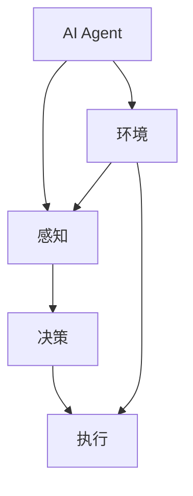
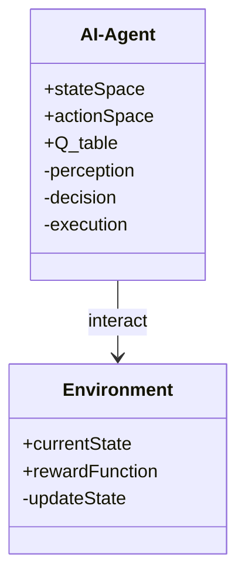
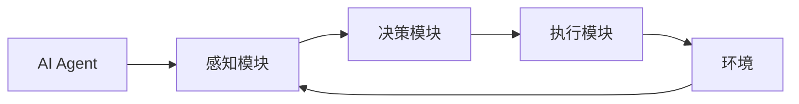
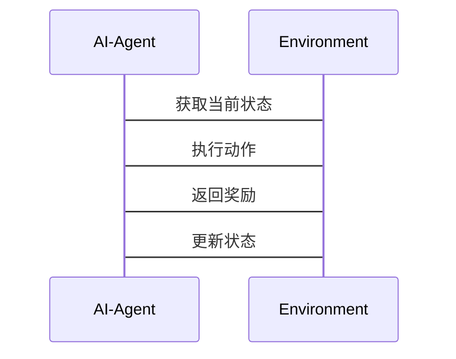

                 


# 构建具有自主决策能力的AI Agent

## 关键词：AI Agent, 自主决策, 人工智能, 强化学习, 系统架构, 算法原理

## 摘要：  
本文深入探讨如何构建具有自主决策能力的AI Agent，从基础概念到算法实现，再到系统架构，全面解析其构建过程。通过理论分析与实践结合，详细介绍强化学习、决策树等核心算法，以及系统设计的关键要素，为读者提供构建自主决策AI Agent的系统化方法和实战经验。

---

## 第一部分：AI Agent基础与背景

### 第1章：AI Agent的基本概念与背景介绍

#### 1.1 问题背景
- **1.1.1 自主决策AI Agent的定义与目标**
  - 自主决策AI Agent是指能够在复杂环境中独立感知、分析、决策并执行任务的智能体，其目标是实现类似于人类的自主行为能力。
  - 例如，在游戏中，AI Agent能够根据对手的策略调整自己的战术。

- **1.1.2 当前AI Agent技术的发展现状**
  - 自主决策AI Agent技术近年来快速发展，尤其是在游戏AI、机器人、自动驾驶等领域取得了显著进展。
  - 当前主要依赖强化学习和深度学习技术，但仍面临动态环境适应性和复杂决策的挑战。

- **1.1.3 自主决策AI Agent的应用领域与潜力**
  - **游戏AI**：提升游戏体验，实现智能对手或队友。
  - **机器人控制**：实现工业机器人或服务机器人的自主操作。
  - **自动驾驶**：提高车辆的自主决策能力，确保安全和效率。
  - **智能助手**：如Siri、Alexa等，通过自主决策提供更智能化的服务。

#### 1.2 问题描述
- **1.2.1 自主决策AI Agent的核心问题**
  - 如何在动态、不确定的环境中做出最优决策？
  - 如何处理复杂环境中的多目标优化问题？
  - 如何实现自主学习和持续优化？

- **1.2.2 与传统AI Agent的主要区别**
  - 传统AI Agent通常依赖于预设规则，而自主决策AI Agent具备学习和适应能力。
  - 传统AI Agent在静态环境中表现良好，而自主决策AI Agent能够处理动态变化的环境。

- **1.2.3 自主性与外部环境的相互作用**
  - 自主性：AI Agent具备独立思考和决策的能力。
  - 环境：AI Agent与环境交互，通过感知和执行影响环境状态。
  - 相互作用：AI Agent通过感知环境做出决策，环境的变化又反过来影响AI Agent的感知和决策过程。

#### 1.3 问题解决
- **1.3.1 自主决策的关键技术与方法**
  - **强化学习**：通过试错和奖励机制优化决策策略。
  - **决策树与逻辑推理**：基于规则和逻辑进行决策。
  - **深度学习**：利用神经网络处理复杂感知和决策任务。

- **1.3.2 多智能体系统中的协作与竞争**
  - 协作：多个AI Agent协同工作，共同完成任务。
  - 竞争：多个AI Agent在竞争环境中进行决策，如游戏中对抗。

- **1.3.3 动态环境下的适应性问题**
  - 动态环境：环境状态不断变化，AI Agent需要实时调整决策。
  - 适应性：通过在线学习和自适应算法实现对环境变化的快速响应。

#### 1.4 边界与外延
- **1.4.1 自主决策的边界条件**
  - 独立性：AI Agent在决策过程中是否完全独立，是否需要外部干预。
  - 知识限制：AI Agent的知识来源和处理能力是否有限。

- **1.4.2 相关技术领域（如强化学习、自然语言处理）的联系**
  - 强化学习是实现自主决策的核心技术之一。
  - 自然语言处理技术为AI Agent提供了理解和生成语言的能力，增强人机交互。

- **1.4.3 与其他AI技术的区分**
  - 自主决策AI Agent强调自主性和适应性，而其他AI技术如机器学习更多关注数据处理和模式识别。

#### 1.5 概念结构与核心要素
- **1.5.1 核心要素组成：感知、决策、执行**
  - 感知：通过传感器或数据源获取环境信息。
  - 决策：基于感知信息，选择最优动作或策略。
  - 执行：通过执行机构或API实现决策结果。

- **1.5.2 各要素之间的关系与相互作用**
  - 感知为决策提供信息，决策指导执行，执行反过来影响环境状态，形成闭环。

- **1.5.3 系统整体架构与功能模块**
  - 整体架构包括感知模块、决策模块和执行模块，各模块协同工作，实现自主决策。

---

## 第二部分：AI Agent的核心概念与联系

### 第2章：AI Agent的核心概念原理

#### 2.1 核心概念原理
- **2.1.1 自主决策的核心机制**
  - 基于强化学习的奖励机制，通过试错优化决策策略。
  - 基于逻辑推理和规则引擎的决策逻辑。

- **2.1.2 知识表示与推理方法**
  - 知识表示：使用知识图谱、规则库等方式表示AI Agent的知识。
  - 推理方法：基于逻辑推理、概率推理等方法进行推理。

- **2.1.3 行为选择与优化策略**
  - 行为选择：基于当前状态和目标，选择最优行为。
  - 优化策略：通过强化学习等方法不断优化行为选择策略。

#### 2.2 核心概念属性特征对比
- 表格对比：自主决策AI Agent与传统AI Agent的核心特征

| 特性                | 自主决策AI Agent          | 传统AI Agent         |
|---------------------|---------------------------|----------------------|
| 决策方式            | 基于学习和优化          | 预设规则和逻辑      |
| 环境适应性          | 高度适应动态环境        | 适应静态环境        |
| 学习能力            | 具备自主学习能力        | 依赖人工编程         |
| 任务复杂性          | 能处理复杂任务          | 适用于简单任务        |

#### 2.3 ER实体关系图


---

## 第三部分：算法原理讲解

### 第3章：强化学习算法

#### 3.1 强化学习的基本原理
- **3.1.1 基本概念：状态、动作、奖励**
  - **状态（State）**：AI Agent所处的环境状态。
  - **动作（Action）**：AI Agent在特定状态下做出的行为选择。
  - **奖励（Reward）**：AI Agent在执行动作后所获得的反馈，用于评估动作的好坏。

- **3.1.2 Q-learning算法流程**
  - 初始化Q值表，所有动作的初始Q值设为0。
  - 在每个时间步，根据当前状态选择动作，执行动作并获得奖励。
  - 更新Q值表，公式为：$Q(s, a) = Q(s, a) + \alpha (r + \gamma \max Q(s', a'))$，其中$\alpha$为学习率，$\gamma$为折扣因子。

- **3.1.3 算法实现的步骤与注意事项**
  - 环境初始化：设置初始状态和环境参数。
  - 智能体初始化：定义动作空间和状态空间。
  - 状态感知：通过传感器或数据接口获取当前状态。
  - 动作选择：基于当前Q值表选择动作，探索与利用的平衡。
  - 执行动作：将选择的动作发送到执行模块，影响环境状态。
  - 获取奖励：根据环境反馈更新奖励值。
  - 更新Q值表：基于奖励值和下一个状态，更新Q值表。
  - 重复步骤，直到满足终止条件。

#### 3.2 算法实现代码
```python
import numpy as np

class AI_Agent:
    def __init__(self, state_space, action_space):
        self.state_space = state_space
        self.action_space = action_space
        self.Q = np.zeros((state_space, action_space))

    def choose_action(self, state, epsilon=0.1):
        if np.random.random() < epsilon:
            return np.random.randint(0, self.action_space)
        else:
            return np.argmax(self.Q[state])

    def update_Q(self, state, action, reward, next_state, gamma=0.9):
        self.Q[state, action] = self.Q[state, action] + 0.1 * (reward + gamma * np.max(self.Q[next_state]) - self.Q[state, action])

# 示例用法
agent = AI_Agent(5, 3)
state = 0
action = agent.choose_action(state)
next_state = ...  # 根据动作执行后的状态
reward = ...       # 根据执行结果获得的奖励
agent.update_Q(state, action, reward, next_state)
```

#### 3.3 算法原理的数学模型和公式
- **Q-learning算法的数学模型**
  $$ Q(s, a) = Q(s, a) + \alpha (r + \gamma \max Q(s', a')) $$
  其中：
  - $s$：当前状态
  - $a$：动作
  - $r$：奖励
  - $s'$：下一个状态
  - $\alpha$：学习率
  - $\gamma$：折扣因子

  该公式表明，Q值的更新依赖于当前奖励和未来状态的最大Q值，从而实现对决策策略的优化。

#### 3.4 通俗易懂的举例说明
- **迷宫导航问题**
  - 状态：迷宫中的每个位置。
  - 动作：上下左右移动。
  - 奖励：到达终点奖励+1，其他状态奖励-0.1。
  - 目标：从起点到终点，路径最短。

  通过Q-learning算法，AI Agent可以在迷宫中不断探索，最终找到最优路径。

---

## 第四部分：数学模型

### 第4章：强化学习算法的数学模型

#### 4.1 Q-learning算法的数学模型
- **公式推导**
  $$ Q(s, a) = Q(s, a) + \alpha (r + \gamma \max Q(s', a')) $$
  - 该公式表示Q值的更新方式，其中$\alpha$是学习率，控制更新步长。
  - $\gamma$是折扣因子，平衡当前奖励和未来奖励的重要性。

- **公式解析**
  - 当前Q值与新Q值的差值由奖励和未来Q值的最大值共同决定。
  - 通过不断更新Q值，AI Agent的学习能力逐步提高，最终收敛到最优策略。

- **案例分析**
  - 在迷宫导航问题中，AI Agent通过Q-learning算法不断更新Q值表，最终找到最优路径。

---

## 第五部分：系统分析与架构设计方案

### 第5章：AI Agent系统架构设计

#### 5.1 问题场景介绍
- **目标**：设计一个具有自主决策能力的AI Agent，能够在复杂环境中完成特定任务。
- **场景**：例如，在一个动态的游戏中，AI Agent需要实时感知环境、做出决策并执行动作，以击败对手。

#### 5.2 项目介绍
- **项目名称**：自主决策AI Agent系统
- **项目目标**：实现一个能够在复杂环境中自主决策的AI Agent。
- **项目范围**：包括感知、决策、执行三个模块的设计与实现。

#### 5.3 系统功能设计
- **领域模型mermaid类图**


- **系统架构设计mermaid架构图**


- **系统接口设计**
  - 感知模块接口：提供获取环境状态的方法。
  - 决策模块接口：提供选择动作的方法。
  - 执行模块接口：提供执行动作的方法。

- **系统交互mermaid序列图**


---

## 第六部分：项目实战

### 第6章：AI Agent系统实现

#### 6.1 环境安装
- **安装Python环境**：确保Python 3.8及以上版本。
- **安装依赖库**：`numpy`, `matplotlib`, `gym`。

#### 6.2 系统核心实现源代码
```python
import numpy as np
import gym

class AI_Agent:
    def __init__(self, env):
        self.env = env
        self.state_space = env.observation_space.shape[0]
        self.action_space = env.action_space.n
        self.Q = np.zeros((self.state_space, self.action_space))

    def choose_action(self, state, epsilon=0.1):
        if np.random.random() < epsilon:
            return self.env.action_space.sample()
        else:
            return np.argmax(self.Q[state])

    def update_Q(self, state, action, reward, next_state, gamma=0.9):
        self.Q[state, action] = self.Q[state, action] + 0.1 * (reward + gamma * np.max(self.Q[next_state]) - self.Q[state, action])

def train_agent(env, agent, episodes=1000):
    for episode in range(episodes):
        state = env.reset()
        total_reward = 0
        done = False
        while not done:
            action = agent.choose_action(state)
            next_state, reward, done, _ = env.step(action)
            agent.update_Q(state, action, reward, next_state)
            total_reward += reward
            state = next_state
        print(f"Episode {episode}, Total Reward: {total_reward}")

# 示例用法
env = gym.make("CartPole-v1")
agent = AI_Agent(env)
train_agent(env, agent, 1000)
```

#### 6.3 代码应用解读与分析
- **代码解读**
  - `AI_Agent`类：实现AI Agent的核心功能，包括感知、决策和学习。
  - `choose_action`方法：基于ε-greedy策略选择动作。
  - `update_Q`方法：更新Q值表，实现强化学习。
  - `train_agent`函数：训练AI Agent，通过反复与环境交互，优化Q值表。

- **代码分析**
  - 使用OpenAI Gym环境进行训练。
  - 通过强化学习算法优化AI Agent的决策能力。

#### 6.4 实际案例分析和详细讲解剖析
- **案例：CartPole-v1环境**
  - 状态空间：4维（车体位置、速度、杆角度、角速度）。
  - 动作空间：2维（向左或向右推力）。
  - 目标：通过控制推力，使杆保持直立状态，尽可能长时间不倒。

  通过上述代码，AI Agent可以在CartPole环境中不断训练，最终掌握平衡杆的技能。

#### 6.5 项目小结
- **小结**
  - 通过强化学习算法，实现了一个能够自主决策的AI Agent。
  - 系统架构清晰，各模块协同工作，完成感知、决策和执行任务。
  - 通过实际案例分析，验证了系统的可行性和有效性。

---

## 第七部分：总结与最佳实践

### 第7章：总结与最佳实践

#### 7.1 小结
- 本文详细介绍了如何构建具有自主决策能力的AI Agent，从理论到实践，全面解析了其构建过程。
- 通过强化学习算法和系统架构设计，实现了一个能够自主决策的AI Agent。

#### 7.2 注意事项
- **算法选择**：根据具体任务选择合适的算法，强化学习适用于动态环境，决策树适用于规则明确的任务。
- **系统设计**：注重系统模块的划分与交互设计，确保各模块协同工作。
- **性能优化**：在实际应用中，需要考虑计算效率和资源消耗，优化算法和系统架构。

#### 7.3 拓展阅读
- **强化学习**：深入学习Q-learning、Deep Q-Network等算法。
- **多智能体系统**：研究多智能体协作与竞争的问题。
- **复杂环境适应**：探索如何在更复杂的环境中实现自主决策。

---

## 作者：AI天才研究院/AI Genius Institute & 禅与计算机程序设计艺术 /Zen And The Art of Computer Programming

---

通过本文的详细讲解，读者可以系统地了解如何构建具有自主决策能力的AI Agent，掌握其核心算法和系统架构设计方法，并通过实际案例分析提升实战能力。希望本文能为AI领域的研究和应用提供有价值的参考。

