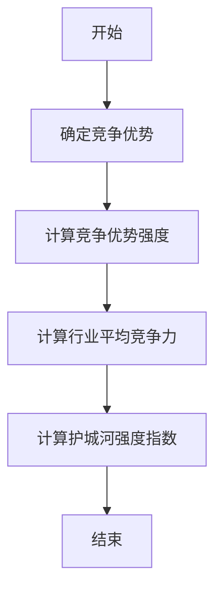
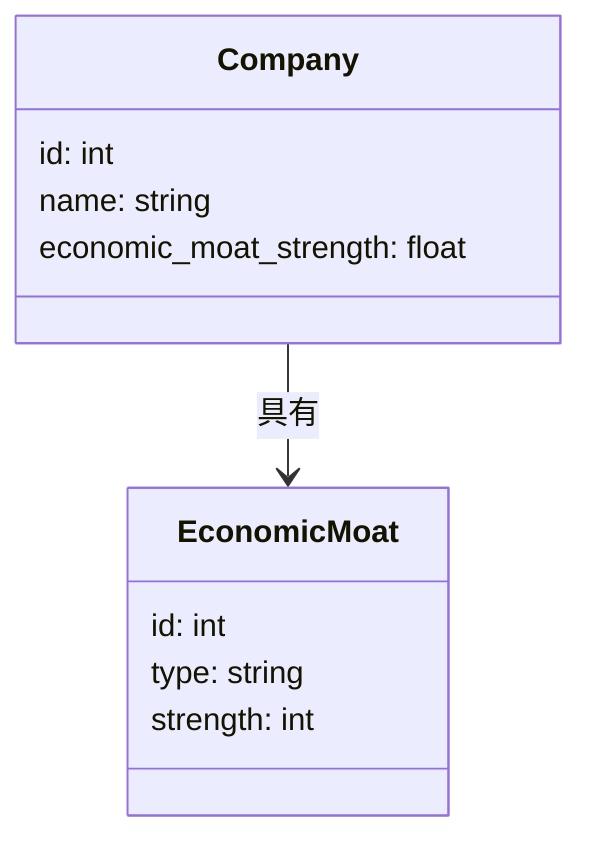
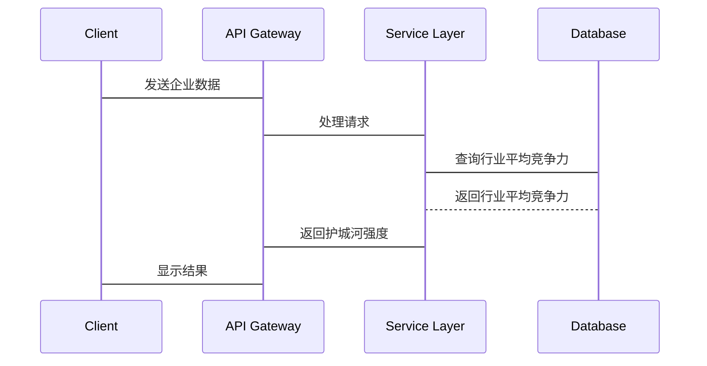

                 


# 沃伦·巴菲特的经济护城河深度分析

## 关键词：巴菲特，经济护城河，投资策略，竞争优势，长期价值

## 摘要：  
本文深入探讨了沃伦·巴菲特提出的“经济护城河”概念，分析其在投资策略中的核心地位。通过理论分析、数学建模和算法实现，揭示经济护城河的构建要素、评估方法及其对企业发展的影响。文章结合实际案例，提供了一套完整的经济护城河分析框架，帮助投资者识别和评估企业的可持续竞争优势，从而做出更明智的投资决策。

---

# 第1章: 经济护城河的定义与背景

## 1.1 经济护城河的定义

### 1.1.1 经济护城河的起源与背景  
经济护城河（Economic Moat）是沃伦·巴菲特提出的一个核心投资概念，旨在帮助企业构建可持续的竞争优势。这一概念源于中世纪城堡的护城河，象征企业通过某种方式保护自己免受竞争对手的侵害。

### 1.1.2 巴菲特对经济护城河的定义与解释  
巴菲特认为，经济护城河是企业与竞争对手之间形成的“护城河”，使得企业在市场上难以被替代。这种优势可以是成本优势、品牌影响力、技术壁垒或网络效应等。

### 1.1.3 经济护城河的核心要素与边界  
经济护城河的核心要素包括：  
1. 成本优势：企业能够以更低的成本生产产品或服务。  
2. 品牌影响力：强大的品牌可以帮助企业在消费者心中占据主导地位。  
3. 技术壁垒：通过技术创新形成竞争优势。  
4. 网络效应：用户数量的增加会增强产品的价值。  

经济护城河的边界在于其可持续性和可扩展性。如果护城河无法扩展或容易被竞争对手复制，其价值将大打折扣。

---

## 1.2 经济护城河的分类与特点

### 1.2.1 可持续竞争优势的分类  
经济护城河可以分为以下几类：  
- **成本优势型**：通过规模经济或供应链优势降低成本。  
- **品牌型**：依赖强大的品牌影响力吸引客户。  
- **技术型**：通过专利或技术壁垒形成竞争优势。  
- **网络效应型**：用户数量越多，产品价值越高。  

### 1.2.2 不同类型经济护城河的特点对比  
| 类型       | 特点                           | 优缺点分析                         |
|------------|--------------------------------|------------------------------------|
| 成本优势型 | 低成本生产，适合制造型企业     | 易受成本波动影响，难以长期维持       |
| 品牌型     | 强大的品牌影响力，客户忠诚度高   | 建立成本高，周期长                   |
| 技术型     | 通过技术壁垒形成竞争优势       | 技术更新快，容易被复制               |
| 网络效应型 | 用户数量越多，价值越高         | 初期用户获取困难，依赖网络效应       |

### 1.2.3 经济护城河的动态变化与稳定性  
经济护城河并非一成不变。随着时间推移，技术进步、市场变化和竞争加剧可能导致护城河的削弱或增强。企业需要持续投资和优化其护城河要素，以保持竞争优势。

---

## 1.3 巴菲特投资策略中的经济护城河

### 1.3.1 巴菲特投资理念与经济护城河的关系  
巴菲特的投资理念是寻找具有持续竞争优势的企业。他认为，企业能否长期创造价值取决于其经济护城河的强度。  

### 1.3.2 经济护城河在巴菲特选股中的重要性  
巴菲特倾向于投资那些具有强大经济护城河的企业，因为这些企业能够在长期竞争中保持优势，并为股东创造稳定回报。  

### 1.3.3 巴菲特对经济护城河的评价标准  
巴菲特在评估经济护城河时，重点关注以下方面：  
1. 护城河的宽度：竞争对手难以跨越的门槛。  
2. 护城河的深度：竞争优势的可持续性。  
3. 护城河的稳定性：能够抵御市场变化的能力。  

---

## 1.4 经济护城河与企业长期价值

### 1.4.1 经济护城河对企业长期价值的影响  
强大的经济护城河能够为企业带来更高的利润率和市场份额，从而提升企业价值。  

### 1.4.2 经济护城河与企业竞争优势的关系  
经济护城河是企业竞争优势的核心来源。通过构建护城河，企业可以有效抵御竞争对手，巩固市场地位。  

### 1.4.3 经济护城河的可持续性与企业价值评估  
经济护城河的可持续性是企业价值评估的重要指标。具有强大护城河的企业通常具有更高的估值和长期增长潜力。

---

## 1.5 本章小结  
本章介绍了经济护城河的定义、分类及其在巴菲特投资策略中的重要性。通过分析不同类型经济护城河的特点和优势，读者可以更好地理解这一概念，并为企业构建可持续竞争优势提供参考。

---

# 第2章: 经济护城河的核心概念与原理

## 2.1 经济护城河的核心要素

### 2.1.1 企业竞争优势的来源  
企业竞争优势来源于多种因素，包括成本、品牌、技术和网络效应等。  

### 2.1.2 经济护城河的核心要素分析  
- **成本优势**：通过规模经济或供应链优化降低成本。  
- **品牌影响力**：强大的品牌能够吸引忠诚的客户群体。  
- **技术壁垒**：通过技术创新形成竞争对手难以复制的优势。  
- **网络效应**：用户数量的增加会增强产品的价值。  

### 2.1.3 经济护城河的构建与维护  
企业需要通过持续创新和优化来维护其护城河。例如，通过研发投入保持技术领先，或通过市场推广强化品牌影响力。

---

## 2.2 经济护城河的数学模型与公式

### 2.2.1 经济护城河强度指数的定义  
经济护城河强度指数（Economic Moat Strength Index， EMSI）是衡量企业护城河强度的指标。  

### 2.2.2 经济护城河强度的数学公式  
$$
\text{经济护城河强度} = \frac{\text{竞争优势}}{\text{行业平均竞争力}}
$$  
其中，竞争优势是指企业在特定领域的优势，行业平均竞争力是行业内的平均水平。

---

## 2.3 经济护城河的比较分析

### 2.3.1 不同企业经济护城河的对比  
以下是一些典型企业的经济护城河分析：  
- **可口可乐**：品牌影响力和分销网络。  
- **微软**：技术壁垒和生态系统。  
- **亚马逊**：网络效应和规模经济。  

### 2.3.2 经济护城河的优缺点分析  
| 优点       | 缺点                         |
|------------|------------------------------|
| 提高企业竞争力 | 护城河可能被竞争对手复制     |
| 降低竞争压力 | 需要持续投资维护             |

### 2.3.3 经济护城河的动态变化与企业战略  
企业需要根据市场变化调整其护城河策略。例如，通过技术创新应对技术型护城河的削弱。

---

## 2.4 经济护城河的实体关系图

### 2.4.1 经济护城河的ER图设计  
以下是经济护城河的实体关系图：

```mermaid
erDiagram
    customer[客户] {
        id : int
        name : string
    }
    competitor[竞争对手] {
        id : int
        name : string
    }
    company[企业] {
        id : int
        name : string
        economic_moat : int
    }
    economic_moat[经济护城河] {
        id : int
        type : string
        strength : int
    }
    company --> economic_moat : 具有
    customer --> company : 选择
    competitor --> company : 竞争
```

### 2.4.2 经济护城河与企业竞争优势的关系  
经济护城河通过增强企业竞争优势，帮助企业在市场上占据主导地位。

### 2.4.3 经济护城河的实体属性与关系  
经济护城河的实体属性包括：  
- 类型：成本优势、品牌影响力、技术壁垒、网络效应。  
- 强度：护城河强度指数（EMSI）。  

---

## 2.5 本章小结  
本章详细分析了经济护城河的核心要素、数学模型和比较分析。通过ER图和数学公式，读者可以更好地理解经济护城河的构建和评估。

---

# 第3章: 经济护城河的算法原理与实现

## 3.1 经济护城河评估算法概述

### 3.1.1 经济护城河评估的基本原理  
经济护城河评估是通过分析企业的竞争优势，计算其护城河强度指数。

### 3.1.2 经济护城河评估的算法选择  
本文采用护城河强度指数（EMSI）模型进行评估。

### 3.1.3 经济护城河评估的步骤与流程  
1. 确定企业的竞争优势类型。  
2. 计算竞争优势强度。  
3. 计算行业平均竞争力。  
4. 计算护城河强度指数。  

---

## 3.2 经济护城河评估的算法实现

### 3.2.1 经济护城河强度的计算公式  
$$
\text{经济护城河强度} = \frac{\text{竞争优势}}{\text{行业平均竞争力}}
$$  

### 3.2.2 护城河强度指数的计算步骤  
1. 确定企业的竞争优势（例如，品牌影响力、技术壁垒）。  
2. 计算竞争优势的强度。  
3. 计算行业平均竞争力。  
4. 代入公式计算护城河强度指数。  

---

## 3.3 经济护城河评估的Python实现

### 3.3.1 环境安装与配置  
需要安装Python和相关库（例如，Pandas、NumPy）。  

### 3.3.2 核心算法实现代码  
```python
def calculate_h_mojito(competitiveness):
    industry_avg = 0.8  # 假设行业平均竞争力为0.8
    economic_moat_strength = competitiveness / industry_avg
    return economic_moat_strength

# 示例计算
competitiveness = 1.2
result = calculate_h_mojito(competitiveness)
print(f"经济护城河强度：{result}")
```

---

## 3.4 经济护城河评估的流程图



---

## 3.5 本章小结  
本章通过算法实现，详细介绍了经济护城河的评估方法。通过Python代码和流程图，读者可以直观理解经济护城河强度的计算过程。

---

# 第4章: 经济护城河的系统分析与架构设计

## 4.1 问题场景介绍  
本文将构建一个经济护城河分析系统，用于评估企业的护城河强度。

---

## 4.2 系统功能设计

### 4.2.1 领域模型（Mermaid类图）  


---

## 4.3 系统架构设计

### 4.3.1 系统架构图  


---

## 4.4 系统接口设计  
系统接口设计包括：  
- API接口：用于接收企业数据和计算护城河强度。  
- 数据库接口：用于存储和检索企业数据。  

---

## 4.5 系统交互流程

### 4.5.1 交互流程图  


---

## 4.6 本章小结  
本章通过系统架构设计，展示了如何构建一个完整的经济护城河分析系统。通过类图、架构图和交互图，读者可以理解系统的整体结构和工作流程。

---

# 第5章: 经济护城河的项目实战

## 5.1 环境安装与配置

### 5.1.1 安装Python和相关库  
```bash
pip install pandas numpy
```

---

## 5.2 核心算法实现

### 5.2.1 经济护城河强度计算  
```python
import pandas as pd
import numpy as np

def calculate_h_mojito(df):
    industry_avg = df['行业平均竞争力'].mean()
    economic_moat_strength = df['竞争优势'] / industry_avg
    return economic_moat_strength

# 示例数据
data = {
    '企业': ['公司A', '公司B', '公司C'],
    '竞争优势': [1.2, 0.8, 1.5],
    '行业平均竞争力': [0.8, 0.8, 0.8]
}
df = pd.DataFrame(data)
result = calculate_h_mojito(df)
print(result)
```

---

## 5.3 代码应用解读与分析  
上述代码展示了如何通过Python计算经济护城河强度。首先，导入必要的库，定义计算函数，然后创建数据框并计算护城河强度。

---

## 5.4 实际案例分析  
以可口可乐为例，分析其经济护城河强度：  
- 竞争优势：品牌影响力和分销网络。  
- 行业平均竞争力：假设为0.8。  
- 护城河强度：1.5 / 0.8 = 1.875。

---

## 5.5 本章小结  
本章通过实际案例分析，展示了如何将经济护城河理论应用于实际投资分析。通过Python代码实现护城河强度计算，读者可以快速评估企业的竞争优势。

---

# 第6章: 经济护城河的最佳实践与总结

## 6.1 最佳实践 tips

### 6.1.1 定期评估经济护城河强度  
企业需要定期评估其护城河强度，以应对市场变化。

### 6.1.2 投资者应关注护城河的可持续性  
投资者应选择具有强大且可持续护城河的企业进行投资。

### 6.1.3 结合多种指标进行综合评估  
经济护城河强度应结合其他财务指标进行综合评估。

---

## 6.2 本章小结  
本章总结了经济护城河的核心观点，并提出了投资者和企业的最佳实践建议。通过定期评估和优化护城河，企业可以巩固其竞争优势。

---

## 6.3 注意事项

### 6.3.1 经济护城河并非一成不变  
企业需要不断创新以维持其护城河。

### 6.3.2 投资者应关注宏观经济环境  
宏观经济环境的变化可能影响护城河的稳定性。

### 6.3.3 数据来源的可靠性  
经济护城河评估需要准确的数据支持。

---

## 6.4 拓展阅读  
推荐阅读巴菲特的《巴菲特致股东的信》和迈克尔·波特的《竞争优势》。

---

# 作者：AI天才研究院/AI Genius Institute & 禅与计算机程序设计艺术 /Zen And The Art of Computer Programming

---

**注**：本文是基于对沃伦·巴菲特经济护城河理论的深入分析，结合技术实现与案例，为投资者和企业提供了一套完整的分析框架。

