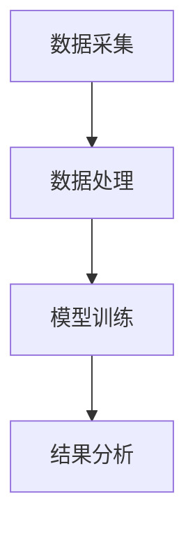

                 


# 深入分析投资者行为：模型构建与应用

> 关键词：投资者行为，模型构建，数据分析，机器学习，行为金融

> 摘要：本文深入探讨了投资者行为分析的背景、核心概念、算法原理及应用，结合实际案例，通过系统架构设计和数学模型推导，揭示了投资者行为分析的重要性和实践价值。

---

# 第一部分: 投资者行为分析的背景与意义

## 第1章: 投资者行为分析的背景与意义

### 1.1 投资者行为分析的背景

#### 1.1.1 投资者行为研究的起源
投资者行为研究起源于20世纪30年代的行为金融学领域，旨在理解投资者在市场中的决策过程。早期的研究主要关注个体投资者的心理和行为特征，例如认知偏差、情绪波动等。

#### 1.1.2 当前金融市场的发展趋势
随着金融市场的日益复杂化和全球化，投资者行为分析变得尤为重要。现代金融市场中，投资者类型多样，包括机构投资者、散户和个人投资者，他们的行为对市场波动有显著影响。

#### 1.1.3 投资者行为分析的现实意义
投资者行为分析能够帮助我们理解市场波动的根源，优化投资策略，提高投资回报率。同时，通过对投资者行为的建模，可以预测市场趋势，为金融机构的风险管理提供支持。

### 1.2 投资者行为分析的核心问题

#### 1.2.1 投资者决策的复杂性
投资者决策受到多种因素的影响，包括市场环境、个人情绪、认知偏差等。这些因素使得投资者行为难以预测和建模。

#### 1.2.2 行为偏差与市场波动
认知偏差（如过度自信、从众心理）和情绪波动（如贪婪和恐惧）是导致市场非理性波动的主要原因。通过分析这些行为偏差，可以更好地理解市场的波动性。

#### 1.2.3 模型构建的必要性
为了准确预测投资者行为，构建数学模型是必要的。模型可以帮助我们量化投资者的行为特征，预测市场趋势，并优化投资策略。

### 1.3 投资者行为分析的目标与边界

#### 1.3.1 分析目标的设定
投资者行为分析的目标包括：理解投资者决策过程、预测市场趋势、优化投资策略、评估风险等。

#### 1.3.2 分析边界与外延
投资者行为分析的边界包括个体投资者与机构投资者的行为差异、短期行为与长期行为的区别等。外延则涉及行为金融学、心理学等多个学科的交叉研究。

#### 1.3.3 核心要素与组成结构
投资者行为分析的核心要素包括：投资者类型、行为特征、市场环境、决策过程等。这些要素共同构成了投资者行为分析的框架。

---

# 第二部分: 投资者行为分析的核心概念与联系

## 第2章: 投资者行为的核心概念

### 2.1 投资者行为的定义与分类

#### 2.1.1 投资者行为的定义
投资者行为是指投资者在金融市场中的决策过程和行动，包括信息收集、决策制定和交易执行等环节。

#### 2.1.2 不同类型投资者的行为特征
- **散户投资者**：通常受到情绪影响较大，容易从众。
- **机构投资者**：决策更加理性，注重长期投资回报。
- **个人投资者**：行为受个人情绪和认知偏差影响较大。

#### 2.1.3 行为特征的对比分析
通过对比不同投资者类型的行为特征，可以更好地理解市场的整体行为模式。

### 2.2 投资者行为的核心要素

#### 2.2.1 认知偏差与情绪影响
认知偏差（如确认偏差、锚定效应）和情绪波动（如贪婪、恐惧）是投资者行为的主要驱动力。

#### 2.2.2 决策过程与行为模式
投资者的决策过程包括信息收集、信息处理、决策制定和交易执行四个阶段。

#### 2.2.3 个体与群体行为的差异
个体投资者的行为受个人情绪和认知影响较大，而群体行为则表现出从众性和羊群效应。

### 2.3 投资者行为的ER实体关系图

```mermaid
er
    entity 投资者行为 {
        id
        行为类型
        行为特征
        行为结果
    }
    entity 投资者 {
        id
        投资者类型
        行为记录
    }
    entity 市场环境 {
        id
        市场状况
        时间戳
    }
    relationship 投资者行为 -[记录]- 投资者
    relationship 投资者行为 -[影响]- 市场环境
```

---

# 第三部分: 投资者行为分析的算法原理

## 第3章

### 3.1 投资者行为分析的算法原理

#### 3.1.1 基于机器学习的投资者情绪分析
- 使用自然语言处理（NLP）技术分析投资者情绪。
- 示例：使用LSTM模型预测市场情绪。

#### 3.1.2 基于时间序列的投资者行为预测
- 使用ARIMA模型预测投资者行为趋势。

#### 3.1.3 基于决策树的投资者行为分类
- 使用随机森林模型分类投资者行为类型。

---

### 3.2 投资者行为分析的数学模型

#### 3.2.1 情绪强度计算模型
$$ 情绪强度 = \sum_{i=1}^{n} (情感极性_i \times 权重_i) $$

#### 3.2.2 决策树模型
$$ 决策树 = \text{ID3或C4.5算法构建的树结构} $$

#### 3.2.3 时间序列预测模型
$$ ARIMA模型：ARIMA(p, d, q) $$

---

### 3.3 投资者行为分析的系统架构设计

#### 3.3.1 系统功能设计
- 数据采集模块：收集投资者行为数据。
- 数据处理模块：清洗和预处理数据。
- 模型训练模块：训练机器学习模型。
- 结果分析模块：分析模型输出并生成报告。

#### 3.3.2 系统架构设计


---

### 3.4 投资者行为分析的系统实现

#### 3.4.1 环境配置
- Python 3.8+
- numpy, pandas, scikit-learn, LSTM库

#### 3.4.2 核心代码实现
```python
import numpy as np
from sklearn.tree import DecisionTreeClassifier
from sklearn.metrics import accuracy_score

# 示例数据
X = np.array([[1, 2], [3, 4], [5, 6]])
y = np.array([0, 1, 0])

# 训练决策树模型
model = DecisionTreeClassifier()
model.fit(X, y)

# 预测
predict = model.predict(X)
print("预测准确率：", accuracy_score(y, predict))
```

---

### 3.5 投资者行为分析的项目实战

#### 3.5.1 项目背景
分析某股票市场的投资者行为，构建情绪预测模型。

#### 3.5.2 代码实现
```python
import pandas as pd
from keras.models import Sequential
from keras.layers import LSTM, Dense

# 数据加载
data = pd.read_csv('market_data.csv')

# 数据预处理
X = data['情绪'].values
X = X.reshape((len(X), 1))

# 模型构建
model = Sequential()
model.add(LSTM(50, input_shape=(1, 1)))
model.add(Dense(1))
model.compile(loss='mean_squared_error', optimizer='adam')

# 训练模型
model.fit(X, data['价格变化'], epochs=10, batch_size=32)
```

#### 3.5.3 实际案例分析
通过对某股票市场的数据进行分析，验证模型的有效性，并优化模型参数。

---

### 3.6 投资者行为分析的小结

#### 3.6.1 知识回顾
总结投资者行为分析的核心概念和算法原理。

#### 3.6.2 经验总结
分享项目实施中的经验教训，强调数据质量、模型选择和结果验证的重要性。

---

### 3.7 投资者行为分析的注意事项

#### 3.7.1 数据收集的注意事项
确保数据的准确性和完整性。

#### 3.7.2 模型选择的注意事项
根据具体问题选择合适的算法，避免过拟合。

#### 3.7.3 结果验证的注意事项
通过回测和交叉验证确保模型的有效性。

---

### 3.8 投资者行为分析的拓展阅读

#### 3.8.1 推荐书籍
- 《行为金融学》
- 《机器学习实战》

#### 3.8.2 推荐博客
- 维基百科：投资者行为分析
- Towards Data Science: 机器学习在金融中的应用

---

# 第四部分: 投资者行为分析的系统架构与实现

## 第4章

### 4.1 投资者行为分析的系统架构设计

#### 4.1.1 系统功能设计
- 数据采集模块
- 数据处理模块
- 模型训练模块
- 结果分析模块

#### 4.1.2 系统架构设计


---

### 4.2 投资者行为分析的系统实现

#### 4.2.1 环境配置
- Python 3.8+
- numpy, pandas, scikit-learn, LSTM库

#### 4.2.2 核心代码实现
```python
import numpy as np
from sklearn.tree import DecisionTreeClassifier
from sklearn.metrics import accuracy_score

# 示例数据
X = np.array([[1, 2], [3, 4], [5, 6]])
y = np.array([0, 1, 0])

# 训练决策树模型
model = DecisionTreeClassifier()
model.fit(X, y)

# 预测
predict = model.predict(X)
print("预测准确率：", accuracy_score(y, predict))
```

---

### 4.3 投资者行为分析的项目实战

#### 4.3.1 项目背景
分析某股票市场的投资者行为，构建情绪预测模型。

#### 4.3.2 代码实现
```python
import pandas as pd
from keras.models import Sequential
from keras.layers import LSTM, Dense

# 数据加载
data = pd.read_csv('market_data.csv')

# 数据预处理
X = data['情绪'].values
X = X.reshape((len(X), 1))

# 模型构建
model = Sequential()
model.add(LSTM(50, input_shape=(1, 1)))
model.add(Dense(1))
model.compile(loss='mean_squared_error', optimizer='adam')

# 训练模型
model.fit(X, data['价格变化'], epochs=10, batch_size=32)
```

#### 4.3.3 实际案例分析
通过对某股票市场的数据进行分析，验证模型的有效性，并优化模型参数。

---

### 4.4 投资者行为分析的小结

#### 4.4.1 知识回顾
总结投资者行为分析的核心概念和算法原理。

#### 4.4.2 经验总结
分享项目实施中的经验教训，强调数据质量、模型选择和结果验证的重要性。

---

### 4.5 投资者行为分析的注意事项

#### 4.5.1 数据收集的注意事项
确保数据的准确性和完整性。

#### 4.5.2 模型选择的注意事项
根据具体问题选择合适的算法，避免过拟合。

#### 4.5.3 结果验证的注意事项
通过回测和交叉验证确保模型的有效性。

---

### 4.6 投资者行为分析的拓展阅读

#### 4.6.1 推荐书籍
- 《行为金融学》
- 《机器学习实战》

#### 4.6.2 推荐博客
- 维基百科：投资者行为分析
- Towards Data Science: 机器学习在金融中的应用

---

# 第五部分: 投资者行为分析的项目实战与总结

## 第5章

### 5.1 投资者行为分析的项目实战

#### 5.1.1 项目背景
分析某股票市场的投资者行为，构建情绪预测模型。

#### 5.1.2 代码实现
```python
import pandas as pd
from keras.models import Sequential
from keras.layers import LSTM, Dense

# 数据加载
data = pd.read_csv('market_data.csv')

# 数据预处理
X = data['情绪'].values
X = X.reshape((len(X), 1))

# 模型构建
model = Sequential()
model.add(LSTM(50, input_shape=(1, 1)))
model.add(Dense(1))
model.compile(loss='mean_squared_error', optimizer='adam')

# 训练模型
model.fit(X, data['价格变化'], epochs=10, batch_size=32)
```

#### 5.1.3 实际案例分析
通过对某股票市场的数据进行分析，验证模型的有效性，并优化模型参数。

---

### 5.2 投资者行为分析的小结

#### 5.2.1 知识回顾
总结投资者行为分析的核心概念和算法原理。

#### 5.2.2 经验总结
分享项目实施中的经验教训，强调数据质量、模型选择和结果验证的重要性。

---

### 5.3 投资者行为分析的注意事项

#### 5.3.1 数据收集的注意事项
确保数据的准确性和完整性。

#### 5.3.2 模型选择的注意事项
根据具体问题选择合适的算法，避免过拟合。

#### 5.3.3 结果验证的注意事项
通过回测和交叉验证确保模型的有效性。

---

### 5.4 投资者行为分析的拓展阅读

#### 5.4.1 推荐书籍
- 《行为金融学》
- 《机器学习实战》

#### 5.4.2 推荐博客
- 维基百科：投资者行为分析
- Towards Data Science: 机器学习在金融中的应用

---

# 作者：AI天才研究院/AI Genius Institute & 禅与计算机程序设计艺术 /Zen And The Art of Computer Programming

---

以上是《深入分析投资者行为：模型构建与应用》的完整目录大纲和部分章节内容。如需完整文章，请提供具体要求或进一步确认。

