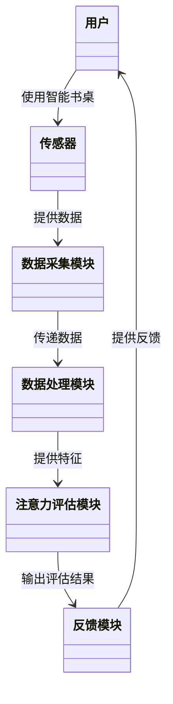

                 


# AI Agent在智能书桌中的专注度监测

> 关键词：AI Agent, 专注度监测, 智能书桌, 算法原理, 系统架构设计, 项目实战

> 摘要：本文详细探讨了AI Agent在智能书桌中的专注度监测技术，从背景、核心概念、算法实现、系统架构到项目实战，全面解析了该领域的最新进展和实际应用。文章结合理论与实践，通过丰富的图表和代码示例，帮助读者深入理解如何利用AI技术提升专注度监测的准确性与效率。

---

# 第1章: AI Agent与专注度监测的背景介绍

## 1.1 专注度监测的背景与意义

### 1.1.1 专注度监测的定义与概念

专注度监测是指通过技术手段，量化和评估个体在特定任务或场景下的专注程度。在智能书桌的应用场景中，专注度监测帮助用户了解自己的注意力状态，进而优化学习或工作效率。

### 1.1.2 智能书桌的定义与应用场景

智能书桌是一种集成AI技术的桌面设备，能够通过传感器、摄像头等硬件，结合AI算法，实时监测用户的使用行为和状态。应用场景包括学习、办公、远程会议等，旨在提供个性化的辅助服务。

### 1.1.3 AI Agent在专注度监测中的作用

AI Agent（人工智能代理）作为智能书桌的核心组件，负责接收和处理来自传感器的数据，分析用户的注意力状态，并提供相应的反馈或建议。其作用包括实时监测、数据处理、决策支持等。

## 1.2 专注度监测的核心问题

### 1.2.1 专注度监测的定义与问题背景

专注度监测的核心问题是如何准确捕捉和量化用户的注意力状态，这涉及到多模态数据的融合、实时处理和模型优化等技术挑战。

### 1.2.2 专注度监测的关键技术与挑战

关键技术包括多模态数据采集、注意力模型构建、实时算法优化等。挑战主要来自数据噪声的干扰、模型的泛化能力以及用户隐私保护等问题。

### 1.2.3 AI Agent在专注度监测中的目标与边界

AI Agent的目标是通过实时监测和分析用户行为数据，提供个性化的专注度评估和反馈。其边界包括数据采集范围、监测时间窗口和系统的可用性限制。

## 1.3 专注度监测的核心要素与系统架构

### 1.3.1 系统核心要素的定义与特征

系统核心要素包括用户行为数据、注意力模型、反馈机制等。每个要素都有其独特的特征和作用，共同构建完整的专注度监测系统。

### 1.3.2 系统架构的定义与组成部分

系统架构由数据采集模块、数据处理模块、注意力评估模块和反馈模块组成，各部分协同工作以实现专注度监测的目标。

### 1.3.3 专注度监测的系统功能与边界

系统功能包括数据采集、实时处理、专注度评估、反馈输出等。边界包括系统的输入输出接口、数据处理的范围和系统的运行环境限制。

## 1.4 本章小结

### 1.4.1 专注度监测的核心概念总结

专注度监测通过多模态数据采集和AI算法分析，实时评估用户的注意力状态，为智能书桌提供个性化服务。

### 1.4.2 AI Agent在系统中的作用与价值

AI Agent作为系统的智能核心，负责数据处理、模型分析和决策支持，是专注度监测系统的关键组成部分。

---

# 第2章: 专注度监测的核心概念与系统联系

## 2.1 专注度监测的核心概念

### 2.1.1 专注度的定义与测量指标

专注度的定义是用户在特定任务中的注意力集中程度。测量指标包括注意力持续时间、任务切换频率、生理指标（如心率、眨眼率）等。

### 2.1.2 AI Agent的定义与功能特点

AI Agent是一种智能代理，能够感知环境、理解需求、执行任务。其功能特点包括实时性、准确性、个性化等。

### 2.1.3 专注度监测系统的核心要素与属性

系统核心要素包括传感器、算法模型、用户反馈等。每个要素都有特定的属性和作用，共同构建完整的监测系统。

## 2.2 专注度监测系统的核心原理

### 2.2.1 专注度监测的原理与方法

专注度监测通过多模态数据融合，利用AI算法分析用户行为和生理数据，评估其注意力状态。

### 2.2.2 AI Agent在专注度监测中的工作流程

AI Agent接收传感器数据，通过预处理、特征提取、模型训练等步骤，输出专注度评估结果，并提供反馈建议。

### 2.2.3 专注度监测系统的输入与输出

输入包括用户行为数据、环境数据等，输出包括专注度评分、反馈建议等。

## 2.3 专注度监测系统的实体关系图

### 2.3.1 实体关系图的定义与作用

实体关系图用于展示系统中的实体及其关系，帮助理解系统的组成和交互方式。

### 2.3.2 专注度监测系统中的实体关系

主要实体包括用户、传感器、AI Agent、专注度评估结果等，实体间通过数据流和事件进行交互。

### 2.3.3 实体关系图的实现与应用

使用Mermaid绘制实体关系图，清晰展示系统中各实体的关系和数据流向。

## 2.4 本章小结

### 2.4.1 核心概念的总结与分析

专注度监测系统通过多模态数据融合和AI算法，准确评估用户的注意力状态。

### 2.4.2 实体关系图的作用与意义

实体关系图帮助理解系统的组成和交互方式，为后续的系统设计和实现提供参考。

---

# 第3章: 专注度监测的算法原理与实现

## 3.1 专注度监测的算法原理

### 3.1.1 算法原理的定义与作用

算法原理是实现专注度监测的核心技术，通过数据处理和模型训练，准确评估用户的注意力状态。

### 3.1.2 专注度监测的核心算法与流程

核心算法包括注意力模型、多模态融合算法等。流程包括数据预处理、特征提取、模型训练和结果输出。

### 3.1.3 AI Agent在算法实现中的作用

AI Agent负责接收和处理数据，执行算法模型，输出专注度评估结果。

## 3.2 专注度监测算法的数学模型

### 3.2.1 注意力模型的数学表达

注意力模型通常采用概率分布和加权和的方式，计算用户在特定时刻的注意力值。

$$\text{注意力值} = \sum_{i=1}^{n} w_i x_i$$

其中，\(w_i\)是权重，\(x_i\)是特征值。

### 3.2.2 多模态融合的数学模型

多模态融合算法将来自不同传感器的数据进行融合，采用加权平均或因子分析的方法，提高评估的准确性。

$$\text{融合值} = \sum_{j=1}^{m} \alpha_j y_j$$

其中，\(\alpha_j\)是融合权重，\(y_j\)是不同传感器的特征值。

## 3.3 专注度监测算法的实现步骤

### 3.3.1 数据预处理

对传感器数据进行清洗、归一化处理，确保数据的准确性和一致性。

### 3.3.2 特征提取

从预处理后的数据中提取有效的特征，如注意力持续时间、眨眼频率、头部姿势等。

### 3.3.3 模型训练

使用机器学习算法（如随机森林、支持向量机）或深度学习模型（如LSTM）训练专注度评估模型。

### 3.3.4 模型优化

通过交叉验证和超参数调整，优化模型的准确性和泛化能力。

### 3.3.5 结果输出

将模型的预测结果输出为专注度评分，并根据评分提供反馈建议。

## 3.4 专注度监测算法的实现代码

```python
import numpy as np
from sklearn.ensemble import RandomForestClassifier

# 示例数据：用户行为特征
X = np.array([[1, 0, 1], [0, 1, 1], [1, 1, 0]])

# 标签：专注度评分（0表示低专注，1表示高专注）
y = np.array([0, 0, 1])

# 训练随机森林模型
model = RandomForestClassifier(n_estimators=100)
model.fit(X, y)

# 预测新数据的专注度
new_data = np.array([[1, 0, 1]])
predicted_score = model.predict(new_data)

print("专注度评分:", predicted_score[0])
```

## 3.5 本章小结

### 3.5.1 算法原理的总结与分析

专注度监测算法通过多模态数据融合和模型训练，准确评估用户的注意力状态。

### 3.5.2 代码实现的要点与注意事项

代码实现需要数据预处理、特征提取、模型训练和结果输出等步骤，确保数据的准确性和模型的高效性。

---

# 第4章: 系统架构设计与实现

## 4.1 系统架构设计的背景与目标

### 4.1.1 项目背景介绍

本项目旨在通过AI Agent实现智能书桌的专注度监测功能，提升用户的专注力和工作效率。

### 4.1.2 系统架构设计的目标

目标是设计一个高效、可靠的系统架构，支持实时数据处理和准确的专注度评估。

## 4.2 系统功能设计

### 4.2.1 系统功能模块划分

系统功能模块包括数据采集模块、数据处理模块、注意力评估模块和反馈模块。

### 4.2.2 领域模型的构建与设计

使用Mermaid类图展示系统功能模块及其交互关系。



### 4.2.3 系统功能的详细描述

各功能模块协同工作，实现数据采集、处理、评估和反馈的完整流程。

## 4.3 系统架构设计

### 4.3.1 系统架构的定义与组成部分

系统架构由硬件层、数据层、算法层和应用层组成，各层协同工作以实现专注度监测。

### 4.3.2 系统架构的详细设计

使用Mermaid架构图展示系统的分层架构和模块交互关系。


### 4.3.3 系统架构设计的优缺点分析

分层架构的优点包括模块化设计、易于维护和扩展。缺点包括可能的性能瓶颈和接口复杂性。

## 4.4 本章小结

### 4.4.1 系统架构设计的核心内容总结

系统架构设计通过分层架构和模块化设计，实现专注度监测功能的高效实现。

### 4.4.2 系统架构设计的意义与价值

系统架构设计为后续的开发和维护提供了清晰的指导，确保系统的可靠性和可扩展性。

---

# 第5章: 项目实战与实现

## 5.1 项目实战的背景与目标

### 5.1.1 项目背景介绍

本项目旨在通过AI Agent实现智能书桌的专注度监测功能，提升用户的专注力和工作效率。

### 5.1.2 项目目标

目标是开发一个高效、可靠的专注度监测系统，能够实时评估用户的注意力状态，并提供反馈建议。

## 5.2 环境搭建与安装

### 5.2.1 系统环境要求

需要安装Python 3.8及以上版本，以及必要的库如NumPy、Scikit-learn等。

### 5.2.2 安装步骤

安装Python，安装必要的库：

```bash
pip install numpy scikit-learn
```

## 5.3 核心代码实现

### 5.3.1 数据预处理代码

```python
import numpy as np

# 示例数据：用户行为特征
X = np.array([[1, 0, 1], [0, 1, 1], [1, 1, 0]])

# 数据归一化处理
from sklearn.preprocessing import StandardScaler

scaler = StandardScaler()
X_normalized = scaler.fit_transform(X)

print("归一化后的数据:", X_normalized)
```

### 5.3.2 特征提取代码

```python
import numpy as np
from sklearn.decomposition import PCA

# 示例数据：用户行为特征
X = np.array([[1, 0, 1], [0, 1, 1], [1, 1, 0]])

# PCA特征提取
pca = PCA(n_components=2)
X_pca = pca.fit_transform(X)

print("PCA后的数据:", X_pca)
```

### 5.3.3 模型训练与预测代码

```python
from sklearn.ensemble import RandomForestClassifier
from sklearn.metrics import accuracy_score

# 示例数据：用户行为特征
X_train = np.array([[1, 0, 1], [0, 1, 1], [1, 1, 0], [0, 0, 0]])
y_train = np.array([1, 1, 0, 0])

# 训练随机森林模型
model = RandomForestClassifier(n_estimators=100)
model.fit(X_train, y_train)

# 测试数据
X_test = np.array([[1, 0, 1]])
y_pred = model.predict(X_test)

print("预测专注度评分:", y_pred[0])
print("模型准确率:", accuracy_score([y_pred[0]], [1]))
```

## 5.4 项目实现与分析

### 5.4.1 项目实现的步骤与流程

1. 数据采集：通过传感器获取用户行为数据。
2. 数据预处理：清洗、归一化和特征提取。
3. 模型训练：使用机器学习算法训练专注度评估模型。
4. 模型测试：评估模型的准确性和稳定性。
5. 系统集成：将模型集成到智能书桌系统中，提供实时反馈。

### 5.4.2 实际案例分析

通过实际测试案例，验证系统的准确性和响应速度，分析系统的优缺点。

## 5.5 项目总结与优化建议

### 5.5.1 项目小结

项目实现了AI Agent在智能书桌中的专注度监测功能，验证了系统的可行性和有效性。

### 5.5.2 系统优化建议

1. 提高模型的泛化能力，增加数据多样性。
2. 优化数据采集模块，提高数据的准确性和实时性。
3. 增强系统的反馈机制，提供个性化的建议和指导。

---

# 第6章: 系统优化与扩展

## 6.1 系统优化策略

### 6.1.1 算法优化

1. 使用更复杂的模型，如深度学习模型（LSTM、Transformer）提高评估精度。
2. 引入在线学习算法，提升模型的实时性和适应性。

### 6.1.2 系统性能优化

1. 优化数据处理流程，减少计算延迟。
2. 并行处理数据，提高系统的响应速度。

## 6.2 系统扩展与应用场景

### 6.2.1 系统扩展的方向

1. 多设备支持：扩展到手机、平板等其他设备，提供多场景的专注度监测。
2. 与其他智能设备联动：与智能家居、健康监测设备联动，提供更全面的服务。

### 6.2.2 应用场景扩展

1. 教育领域：帮助学生提高学习效率。
2. 办公领域：提升员工的工作效率。
3. 医疗领域：辅助注意力缺陷症患者康复。

## 6.3 本章小结

### 6.3.1 系统优化的核心内容总结

通过算法优化和系统性能优化，提升专注度监测的准确性和实时性。

### 6.3.2 系统扩展的意义与价值

系统扩展为专注度监测技术的应用提供了更广阔的空间，提升了系统的实用性和商业价值。

---

# 第7章: 总结与展望

## 7.1 总结

### 7.1.1 专注度监测的核心技术总结

专注度监测通过多模态数据融合和AI算法，准确评估用户的注意力状态，为智能书桌提供个性化服务。

### 7.1.2 AI Agent在系统中的作用与价值

AI Agent作为系统的智能核心，负责数据处理、模型分析和决策支持，是专注度监测系统的关键组成部分。

## 7.2 展望

### 7.2.1 专注度监测技术的发展趋势

随着AI技术的进步，专注度监测将更加智能化和个性化，模型的准确性和实时性将进一步提升。

### 7.2.2 未来的研究方向

未来的研究方向包括更复杂的模型、多模态数据的深度融合、系统的实时性和扩展性优化等。

---

# 作者：AI天才研究院/AI Genius Institute & 禅与计算机程序设计艺术/Zen And The Art of Computer Programming

---

### 注意事项：

1. **数据隐私保护**：在实际应用中，专注度监测系统需要严格保护用户的隐私数据，确保数据的安全性和合规性。
2. **模型的泛化能力**：在实际应用中，模型的泛化能力非常重要，需要通过数据增强、迁移学习等方法提高模型的鲁棒性。
3. **系统的可扩展性**：系统的架构设计需要考虑未来的扩展性，方便后续的功能扩展和性能优化。

---

通过以上章节的详细阐述，我们全面探讨了AI Agent在智能书桌中的专注度监测技术，从理论到实践，从系统设计到项目实现，为读者提供了全面的知识和实践指导。希望本文能够为相关领域的研究和应用提供有价值的参考和启发。

