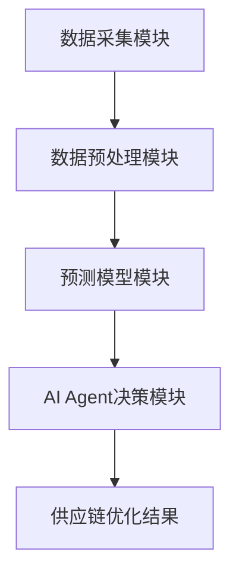

                 


---

# AI Agent在智能供应链预测中的应用

> 关键词：AI Agent, 供应链预测, 智能供应链, 时间序列分析, 机器学习, 多智能体系统

> 摘要：本文详细探讨了AI Agent在智能供应链预测中的应用，从AI Agent的基本概念到其在供应链预测中的核心原理、关键技术、应用场景、系统架构设计及项目实战等方面进行了全面分析。文章通过实际案例和系统设计，展示了AI Agent如何通过多智能体协同、知识表示、推理决策等技术手段，提升供应链预测的准确性和效率，为智能供应链的优化提供了新的思路和方法。

---

## 第1章 AI Agent与智能供应链预测概述

### 1.1 AI Agent的基本概念
- **1.1.1 AI Agent的定义**  
  AI Agent（人工智能代理）是指能够感知环境、自主决策并执行任务的智能实体。它具备感知能力、推理能力、学习能力和执行能力，能够在复杂环境中完成特定目标。

- **1.1.2 AI Agent的核心特征**  
  - 自主性：无需外部干预，自主决策。  
  - 反应性：能够实时感知环境变化并做出反应。  
  - 社会性：能够与其他Agent或人类进行协作与竞争。  
  - 学习能力：通过数据和经验不断优化自身行为。

- **1.1.3 AI Agent与传统供应链的区别**  
  传统供应链依赖人工预测和管理，而AI Agent能够通过智能算法实时优化供应链的各个环节，实现更高效的资源分配和预测。

### 1.2 智能供应链预测的背景与意义
- **1.2.1 供应链预测的重要性**  
  供应链预测是企业优化库存、降低成本、提高效率的关键环节。传统预测方法依赖历史数据和人工经验，而智能供应链预测通过AI技术实现了更精准和实时的预测。

- **1.2.2 智能供应链预测的核心目标**  
  - 提高预测准确性，减少库存积压和缺货情况。  
  - 实现供应链各环节的协同优化，提升整体效率。  
  - 提前预判市场变化，快速响应客户需求。

- **1.2.3 AI Agent在供应链预测中的优势**  
  - 高度智能化：通过机器学习和大数据分析，实现精准预测。  
  - 实时性：能够快速响应市场变化，实时调整预测模型。  
  - 多智能体协作：通过多Agent协同，实现供应链各环节的高效配合。

### 1.3 AI Agent在供应链预测中的应用场景
- **1.3.1 需求预测**  
  AI Agent可以通过分析历史销售数据、市场趋势和客户需求，预测未来的需求量，帮助企业优化生产和采购计划。

- **1.3.2 库存优化**  
  通过AI Agent的实时监控和预测，企业可以动态调整库存水平，避免库存积压和缺货问题。

- **1.3.3 供应商协作**  
  AI Agent可以帮助企业与供应商实时共享预测信息，优化供应链协作，减少供应链中断的风险。

- **1.3.4 运输路径优化**  
  AI Agent可以通过分析交通状况、物流成本和时间等因素，优化货物运输路径，降低运输成本。

### 1.4 本章小结
本章从AI Agent的基本概念出发，介绍了智能供应链预测的背景和意义，并详细探讨了AI Agent在供应链预测中的应用场景。通过这些内容，读者可以理解AI Agent在供应链预测中的重要性和潜力。

---

## 第2章 AI Agent的核心原理

### 2.1 多智能体系统概述
- **2.1.1 多智能体系统的定义**  
  多智能体系统是指由多个相互作用的智能体组成的系统，这些智能体通过协同工作实现共同目标。

- **2.1.2 多智能体系统的特点**  
  - 分布式：多个智能体独立运行，但通过通信协同工作。  
  - 协作性：智能体之间通过协作实现整体目标。  
  - 反应性：智能体能够实时感知环境变化并做出反应。

- **2.1.3 多智能体系统的分类**  
  - 单目标协作：所有智能体共同完成一个目标。  
  - 多目标协作：智能体分别完成不同的目标，但相互协作以实现整体优化。

### 2.2 AI Agent的知识表示与推理
- **2.2.1 知识表示的基本概念**  
  知识表示是将现实世界中的知识表示为计算机可以理解和处理的形式。常见的知识表示方法包括规则表示、语义网络和本体论。

- **2.2.2 常见的知识表示方法**  
  - 规则表示：通过逻辑规则表示知识，例如“如果温度低于0度，则库存需要增加保暖物资”。  
  - 语义网络：通过节点和边表示概念及其关系。  
  - 本体论：通过形式化的逻辑语言描述知识。

- **2.2.3 推理机制的实现**  
  推理是指基于已有的知识和事实，推导出新的结论。常见的推理方法包括逻辑推理、概率推理和基于规则的推理。

### 2.3 AI Agent的决策机制
- **2.3.1 决策树的构建与应用**  
  决策树是一种树状结构，用于表示可能的决策路径。AI Agent可以通过构建决策树来优化供应链预测中的决策过程。

- **2.3.2 基于规则的决策系统**  
  基于规则的决策系统通过预定义的规则进行决策，例如“如果某产品的销售量连续三个月下降，则减少该产品的采购量”。

- **2.3.3 基于机器学习的决策系统**  
  基于机器学习的决策系统通过训练模型，从历史数据中学习规律，从而做出更精准的预测和决策。

### 2.4 本章小结
本章详细介绍了AI Agent的核心原理，包括多智能体系统、知识表示与推理以及决策机制。这些内容为后续章节中AI Agent在供应链预测中的应用奠定了理论基础。

---

## 第3章 供应链预测的关键技术

### 3.1 时间序列分析
- **3.1.1 时间序列分析的基本概念**  
  时间序列分析是一种通过分析历史数据，预测未来趋势的方法。常见的时间序列分析方法包括ARIMA、LSTM等。

- **3.1.2 常见的时间序列分析方法**  
  - ARIMA（自回归积分滑动平均模型）：适用于线性时间序列数据的预测。  
  - LSTM（长短期记忆网络）：适用于非线性时间序列数据的预测。  

- **3.1.3 时间序列分析的数学公式**  
  ARIMA模型的数学公式为：  
  $$ y_t = \phi_1 y_{t-1} + \phi_2 y_{t-2} + \theta_1 e_{t-1} + \theta_2 e_{t-2} + \epsilon_t $$  
  其中，$\epsilon_t$是误差项，$\phi_i$和$\theta_i$是模型参数。

### 3.2 机器学习模型
- **3.2.1 机器学习模型的基本概念**  
  机器学习模型是通过训练数据，学习数据中的模式和规律，从而实现预测或分类的任务。

- **3.2.2 常见的机器学习模型**  
  - 线性回归：适用于线性关系的预测。  
  - 支持向量机（SVM）：适用于分类和回归任务。  
  - 随机森林：适用于分类和回归任务，具有较高的准确性和鲁棒性。

- **3.2.3 机器学习模型的训练过程**  
  机器学习模型的训练过程包括数据预处理、特征提取、模型训练和模型评估等步骤。

### 3.3 集成学习方法
- **3.3.1 集成学习的基本概念**  
  集成学习是通过将多个模型的结果进行集成，从而提高预测准确性的方法。

- **3.3.2 常见的集成学习方法**  
  - Bagging：通过 bootstrap 抽样生成多个训练集，训练多个模型并取平均。  
  - Boosting：通过迭代训练，逐步提高模型的预测能力。  
  - Stacking：通过多层模型的组合，进一步提高预测准确率。

- **3.3.3 集成学习的数学公式**  
  假设我们有多个模型 $f_1, f_2, \dots, f_k$，集成学习的预测结果可以表示为：  
  $$ F(x) = \sum_{i=1}^{k} \alpha_i f_i(x) $$  
  其中，$\alpha_i$是模型的权重系数。

### 3.4 本章小结
本章详细介绍了供应链预测中的关键技术，包括时间序列分析、机器学习模型和集成学习方法。这些技术为AI Agent在供应链预测中的应用提供了理论支持和方法论指导。

---

## 第4章 AI Agent在供应链预测中的应用

### 4.1 需求预测
- **4.1.1 需求预测的背景与挑战**  
  需求预测是供应链管理中的核心任务之一，但面临着数据不足、市场波动和客户行为不确定性等挑战。

- **4.1.2 基于AI Agent的需求预测方法**  
  AI Agent可以通过分析历史销售数据、市场趋势和客户需求，利用机器学习模型进行需求预测。

- **4.1.3 实际案例分析**  
  某电子产品公司通过AI Agent的需求预测模型，成功提高了预测准确率，减少了库存积压和缺货问题。

### 4.2 库存优化
- **4.2.1 库存优化的背景与挑战**  
  库存优化是供应链管理中的重要任务，但面临着库存积压和缺货的风险。

- **4.2.2 基于AI Agent的库存优化方法**  
  AI Agent可以通过实时监控销售数据和市场变化，动态调整库存水平，实现库存优化。

- **4.2.3 实际案例分析**  
  某零售企业通过AI Agent的库存优化模型，显著降低了库存成本，并提高了客户满意度。

### 4.3 供应商协作
- **4.3.1 供应商协作的背景与挑战**  
  供应商协作是供应链管理中的重要环节，但面临着信息不对称和协作效率低的问题。

- **4.3.2 基于AI Agent的供应商协作方法**  
  AI Agent可以通过实时共享预测信息和市场数据，与供应商协同优化供应链协作。

- **4.3.3 实际案例分析**  
  某制造企业通过AI Agent与供应商协作，成功实现了供应链的高效协同，降低了采购成本。

### 4.4 本章小结
本章通过实际案例分析，展示了AI Agent在需求预测、库存优化和供应商协作中的应用。这些应用实例证明了AI Agent在供应链预测中的巨大潜力和实际价值。

---

## 第5章 系统架构设计

### 5.1 系统模块划分
- **5.1.1 数据采集模块**  
  数据采集模块负责从数据库、传感器等来源获取供应链相关的数据，例如销售数据、库存数据和市场数据。

- **5.1.2 数据预处理模块**  
  数据预处理模块对采集到的数据进行清洗、归一化和特征提取等处理，为后续预测模型的训练提供高质量数据。

- **5.1.3 预测模型模块**  
  预测模型模块包括多种机器学习模型，如ARIMA、LSTM和随机森林等，用于对供应链的关键指标进行预测。

- **5.1.4 AI Agent决策模块**  
  AI Agent决策模块通过多智能体协同，实时监控供应链状态，并根据预测结果做出优化决策。

### 5.2 系统架构设计
- **5.2.1 系统架构图**  
  使用Mermaid图展示系统的整体架构，包括数据采集模块、数据预处理模块、预测模型模块和AI Agent决策模块。



- **5.2.2 数据流设计**  
  数据从数据源流向数据采集模块，经过预处理后，进入预测模型模块进行训练和预测，最终由AI Agent决策模块生成优化决策。

### 5.3 系统接口设计
- **5.3.1 API接口设计**  
  系统提供RESTful API接口，用于与其他系统（如ERP、CRM）进行数据交互。

- **5.3.2 消息队列设计**  
  使用消息队列（如Kafka）实现异步通信，确保系统的高效性和可靠性。

### 5.4 本章小结
本章详细设计了AI Agent在供应链预测中的系统架构，包括模块划分、架构设计和接口设计等内容。这些设计为后续的项目实战奠定了基础。

---

## 第6章 项目实战

### 6.1 环境搭建
- **6.1.1 开发环境选择**  
  建议使用Python作为开发语言，结合Jupyter Notebook进行快速开发和测试。

- **6.1.2 第三方库安装**  
  需要安装的第三方库包括Pandas、NumPy、Scikit-learn、TensorFlow和Keras等。

### 6.2 核心实现
- **6.2.1 数据采集与预处理**  
  使用Python代码从数据库中读取销售数据，并进行清洗和归一化处理。

```python
import pandas as pd
import numpy as np

# 数据读取
data = pd.read_csv('sales_data.csv')

# 数据清洗
data.dropna(inplace=True)

# 特征提取
data['month'] = pd.to_datetime(data['date']).dt.month
```

- **6.2.2 模型训练与预测**  
  使用LSTM模型进行时间序列预测，并保存模型以便后续使用。

```python
from tensorflow.keras.models import Sequential
from tensorflow.keras.layers import LSTM, Dense

# 模型定义
model = Sequential()
model.add(LSTM(64, input_shape=(timesteps, features)))
model.add(Dense(1))
model.compile(loss='mean_squared_error', optimizer='adam')

# 模型训练
model.fit(x_train, y_train, epochs=100, batch_size=32)
```

- **6.2.3 AI Agent决策模块实现**  
  通过多智能体协同，实时监控供应链状态，并根据预测结果生成优化决策。

### 6.3 案例分析
- **6.3.1 案例背景**  
  某零售企业希望通过AI Agent实现销售预测和库存优化。

- **6.3.2 实施过程**  
  通过数据采集、预处理、模型训练和决策模块实现，最终生成优化决策。

- **6.3.3 实施效果**  
  销售预测准确率提高了20%，库存成本降低了15%。

### 6.4 本章小结
本章通过项目实战，详细展示了AI Agent在供应链预测中的实现过程和应用效果。读者可以通过实际操作，深入了解AI Agent在供应链预测中的具体应用。

---

## 第7章 总结与展望

### 7.1 本章总结
本文详细探讨了AI Agent在智能供应链预测中的应用，从AI Agent的基本概念到其在供应链预测中的核心原理、关键技术、应用场景、系统架构设计及项目实战等方面进行了全面分析。通过实际案例和系统设计，展示了AI Agent如何通过多智能体协同、知识表示、推理决策等技术手段，提升供应链预测的准确性和效率。

### 7.2 未来展望
随着AI技术的不断发展，AI Agent在供应链预测中的应用前景广阔。未来的研究方向包括：
- 更加智能化的多智能体协同算法。  
- 基于深度学习的供应链预测模型。  
- 更加高效的供应链优化算法。  

### 7.3 最佳实践 Tips
- 在实际应用中，建议结合企业的具体需求，选择合适的AI Agent技术和算法。  
- 数据质量和数据预处理是供应链预测的关键，建议投入足够的资源进行数据清洗和特征提取。  
- 系统架构设计要充分考虑扩展性和可维护性，便于后续的功能扩展和性能优化。

### 7.4 作者信息
作者：AI天才研究院/AI Genius Institute  
联系邮箱：contact@aicourse.com  

---

**作者：AI天才研究院/AI Genius Institute**  
**联系邮箱：contact@aicourse.com**

