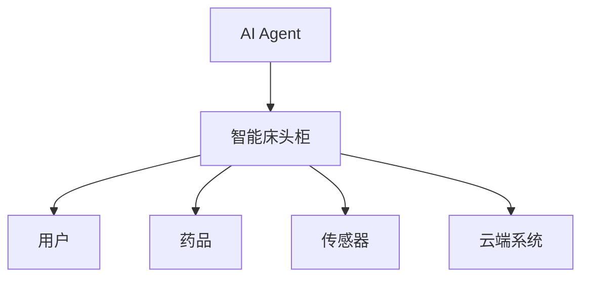
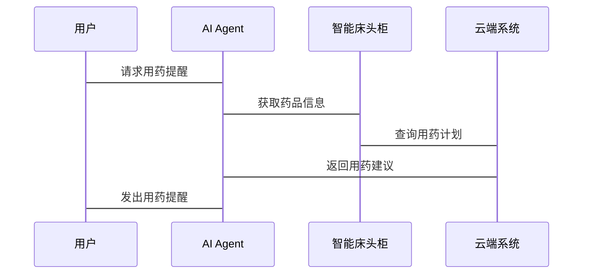

                 


# AI Agent在智能床头柜中的药物管理

> 关键词：AI Agent，智能床头柜，药物管理，算法原理，系统架构，项目实战

> 摘要：本文探讨了AI Agent在智能床头柜中的药物管理应用，从背景介绍、核心概念、算法原理、系统架构到项目实战，全面分析了如何利用AI技术实现智能床头柜的药物管理功能。文章结合实际案例，详细讲解了AI Agent的感知、决策和执行模块，以及在实际应用中的系统设计与实现。通过本文，读者可以深入了解AI Agent在智能床头柜药物管理中的作用和价值。

---

# 第一部分: AI Agent在智能床头柜中的药物管理背景介绍

## 第1章: AI Agent与智能床头柜概述

### 1.1 AI Agent的基本概念

#### 1.1.1 AI Agent的定义与特点
AI Agent（人工智能代理）是一种能够感知环境、自主决策并执行任务的智能实体。它通过传感器获取信息，利用算法进行分析和推理，并通过执行器与环境交互。AI Agent的特点包括：
- **自主性**：无需外部干预，自主完成任务。
- **反应性**：能够实时感知环境变化并做出响应。
- **学习性**：通过数据学习和优化决策能力。
- **适应性**：能够适应不同环境和用户需求。

#### 1.1.2 AI Agent的核心功能模块
AI Agent的核心功能模块包括：
1. **感知模块**：通过传感器或数据接口获取环境信息。
2. **决策模块**：基于感知信息进行分析和推理，生成决策。
3. **执行模块**：根据决策执行动作，与环境交互。

#### 1.1.3 AI Agent的应用场景
AI Agent广泛应用于自动驾驶、智能助手、机器人、医疗健康等领域。在智能床头柜中，AI Agent主要用于药物管理、用户行为分析和环境监测。

---

### 1.2 智能床头柜的背景与现状

#### 1.2.1 智能床头柜的发展历程
智能床头柜作为一种智能家居设备，最初主要用于存储和管理物品。随着人工智能和物联网技术的发展，智能床头柜逐渐具备了智能化功能，如语音控制、环境监测和智能提醒。

#### 1.2.2 智能床头柜的功能特点
智能床头柜的功能特点包括：
- **智能存储**：能够识别和分类存储物品。
- **环境监测**：通过传感器监测环境参数，如温度、湿度。
- **智能提醒**：根据用户需求，主动提醒用户完成特定任务。

#### 1.2.3 智能床头柜的市场应用
智能床头柜在家庭、医疗、办公等场景中有广泛的应用。特别是在医疗领域，智能床头柜可以帮助患者管理药物，提醒用药时间，监测药品存量。

---

### 1.3 药物管理的重要性

#### 1.3.1 药物管理的基本概念
药物管理是指对药品的存储、分发和使用的全过程进行科学管理和控制。有效的药物管理可以确保患者用药安全、合理和及时。

#### 1.3.2 药物管理的核心问题
药物管理的核心问题包括：
1. **药品存储的安全性**：防止药品过期、受潮或被误用。
2. **用药提醒的及时性**：确保患者按时按量用药。
3. **用药行为的规范性**：避免用药错误或过量。

#### 1.3.3 药物管理的智能化需求
随着人口老龄化加剧，慢性病患者增多，对智能化药物管理的需求日益迫切。AI Agent可以通过智能化感知和决策，提高药物管理的效率和安全性。

---

## 第2章: AI Agent在智能床头柜药物管理中的问题背景

### 2.1 老龄化社会中的用药安全问题

#### 2.1.1 老龄化社会的现状
全球范围内，老龄化问题日益严重。老年人群体中，慢性病患者比例高，用药需求大，但记忆力减退，容易出现用药错误。

#### 2.1.2 老年人用药安全的挑战
老年人用药安全的主要挑战包括：
1. **记忆力下降**：容易忘记服药时间或剂量。
2. **多药共用**：容易发生药物相互作用或重复用药。
3. **认知障碍**：部分老年人难以正确理解用药说明。

#### 2.1.3 AI Agent在用药安全中的作用
AI Agent可以通过智能提醒、药物分类存储和用药行为分析，帮助老年人安全用药。

---

### 2.2 智能床头柜药物管理的核心问题

#### 2.2.1 药物存储与提醒问题
智能床头柜需要能够识别药品种类，存储药品信息，并根据用户需求主动提醒用药。

#### 2.2.2 药物使用习惯分析问题
通过分析用户的用药习惯，AI Agent可以优化提醒策略，提高用户体验。

#### 2.2.3 药物管理系统的实时性要求
药物管理系统需要实时感知环境变化和用户行为，及时响应用户的用药需求。

---

### 2.3 AI Agent在药物管理中的解决方案

#### 2.3.1 AI Agent的核心功能设计
AI Agent在药物管理中的核心功能包括：
1. **药品识别与分类**：通过传感器和图像识别技术，自动识别药品并分类存储。
2. **用药提醒**：根据用户用药计划，主动提醒用户服药。
3. **用药行为分析**：通过分析用户用药行为，优化提醒策略。

#### 2.3.2 AI Agent的算法选择
在药物管理中，AI Agent通常采用强化学习算法，通过与环境的交互，不断优化决策策略。

#### 2.3.3 AI Agent的系统架构设计
AI Agent的系统架构设计包括感知层、计算层和应用层。感知层通过传感器获取环境信息，计算层进行数据处理和决策，应用层通过执行器与用户交互。

---

## 第3章: AI Agent在智能床头柜药物管理中的核心概念与联系

### 3.1 AI Agent的核心原理

#### 3.1.1 AI Agent的感知模块
感知模块通过传感器获取环境信息，例如温度、湿度、光照等。感知模块还可以通过图像识别技术识别药品种类和存储状态。

#### 3.1.2 AI Agent的决策模块
决策模块基于感知信息和用户需求，通过算法生成决策。例如，基于强化学习的AI Agent可以通过与环境的交互，不断优化用药提醒策略。

#### 3.1.3 AI Agent的执行模块
执行模块根据决策模块的指令，通过执行器与环境交互。例如，AI Agent可以通过机械臂取药、通过语音模块提醒用户服药。

---

### 3.2 AI Agent的核心概念对比

| **概念**       | **基于规则的AI Agent**             | **基于学习的AI Agent**               |
|----------------|------------------------------------|---------------------------------------|
| **决策方式**   | 预先设定规则和条件                 | 通过学习数据生成决策策略             |
| **灵活性**     | 适应性差，无法应对未知情况         | 具有较强适应性，能够应对新情况       |
| **应用场景**   | 适用于规则明确的任务               | 适用于复杂多变的任务                 |

---

### 3.3 AI Agent的实体关系图



---

### 3.4 AI Agent的算法选择与数学模型

#### 3.4.1 强化学习算法
在药物管理中，强化学习（Reinforcement Learning, RL）是一种常用算法。AI Agent通过与环境的交互，不断优化决策策略。

#### 3.4.2 Q-Learning算法
Q-Learning是一种经典的强化学习算法，适用于离散动作空间的问题。其核心思想是通过Q值表记录状态-动作对的期望奖励，并通过更新公式优化Q值。

数学公式如下：
$$ Q(s, a) = Q(s, a) + \alpha \left( r + \gamma \max Q(s', a') - Q(s, a) \right) $$

其中：
- \( Q(s, a) \)：状态 \( s \) 下执行动作 \( a \) 的Q值。
- \( \alpha \)：学习率。
- \( r \)：奖励值。
- \( \gamma \)：折扣因子。
- \( Q(s', a') \)：后续状态 \( s' \) 下的最大Q值。

---

### 3.5 AI Agent的系统架构设计

#### 3.5.1 感知层
感知层通过传感器和图像识别技术，获取环境信息和用户行为数据。

#### 3.5.2 计算层
计算层通过算法处理感知数据，生成决策指令。例如，AI Agent可以通过强化学习算法优化用药提醒策略。

#### 3.5.3 应用层
应用层通过执行器与用户交互。例如，AI Agent可以通过机械臂取药、通过语音模块提醒用户服药。

---

### 3.6 AI Agent的系统交互流程



---

## 第4章: AI Agent在智能床头柜药物管理中的系统实现

### 4.1 系统环境与工具

#### 4.1.1 开发环境
- **操作系统**：Windows/MacOS/Linux
- **开发工具**：PyCharm/VS Code
- **编程语言**：Python
- **深度学习框架**：TensorFlow/PyTorch
- **可视化工具**：Matplotlib/Mermaid

#### 4.1.2 传感器与执行器
- **传感器**：温度传感器、湿度传感器、图像识别传感器。
- **执行器**：机械臂、语音模块、LED显示模块。

---

### 4.2 AI Agent的核心代码实现

#### 4.2.1 Q-Learning算法实现

```python
import numpy as np

class QLearning:
    def __init__(self, state_space, action_space, alpha=0.1, gamma=0.9):
        self.state_space = state_space
        self.action_space = action_space
        self.alpha = alpha
        self.gamma = gamma
        self.q_table = np.zeros((state_space, action_space))

    def get_action(self, state):
        return np.argmax(self.q_table[state])

    def update_q_table(self, state, action, reward, next_state):
        self.q_table[state, action] = self.q_table[state, action] + self.alpha * (reward + self.gamma * np.max(self.q_table[next_state]) - self.q_table[state, action])
```

#### 4.2.2 药物管理系统的实现

```python
class DrugManagementSystem:
    def __init__(self):
        self.drug_info = {}  # 药品信息
        self.usage_plan = []  # 用药计划
        self.agent = QLearning(state_space=3, action_space=2)

    def add_drug(self, drug_name, dosage, time):
        self.drug_info[drug_name] = {'dosage': dosage, 'time': time}

    def update_plan(self, plan):
        self.usage_plan = plan

    def get_reminder(self, current_time):
        for plan in self.usage_plan:
            if plan['time'] == current_time:
                return plan
        return None
```

---

### 4.3 系统接口与交互流程

#### 4.3.1 系统接口设计
- **药品信息接口**：用于添加和查询药品信息。
- **用药计划接口**：用于制定和更新用药计划。
- **用药提醒接口**：用于触发用药提醒。

#### 4.3.2 交互流程
1. 用户通过智能床头柜输入用药需求。
2. AI Agent根据需求生成用药计划。
3. AI Agent通过传感器获取环境信息。
4. AI Agent通过强化学习优化用药提醒策略。
5. AI Agent触发用药提醒，帮助用户完成用药。

---

## 第5章: AI Agent在智能床头柜药物管理中的实际应用

### 5.1 实际案例分析

#### 5.1.1 病例背景
一位患有糖尿病的老人需要每天服用降糖药物。老人记忆力减退，容易忘记服药时间。

#### 5.1.2 AI Agent的应用
AI Agent通过智能床头柜的传感器和用药计划，每天定时提醒老人服药。同时，AI Agent还可以监测药品存量，及时提醒补充药品。

---

### 5.2 系统优化与改进

#### 5.2.1 系统性能优化
- **算法优化**：通过改进强化学习算法，提高AI Agent的决策效率。
- **系统架构优化**：通过分布式架构，提高系统的可扩展性和容错性。

#### 5.2.2 用户体验优化
- **界面优化**：设计直观易用的用户界面。
- **提醒优化**：根据用户习惯，动态调整提醒策略。

---

## 第6章: 总结与展望

### 6.1 总结
本文详细探讨了AI Agent在智能床头柜药物管理中的应用。通过感知、决策和执行模块的协同工作，AI Agent能够实现智能化的药物管理。本文还通过实际案例，展示了AI Agent在药物管理中的实际应用价值。

### 6.2 展望
随着人工智能和物联网技术的不断发展，AI Agent在智能床头柜中的应用将更加广泛。未来，AI Agent可以通过与其他智能设备的联动，实现更加智能化和个性化的药物管理。同时，AI Agent还可以通过自我学习，不断优化药物管理策略，为用户提供更好的服务。

---

## 作者：AI天才研究院/AI Genius Institute & 禅与计算机程序设计艺术 /Zen And The Art of Computer Programming

