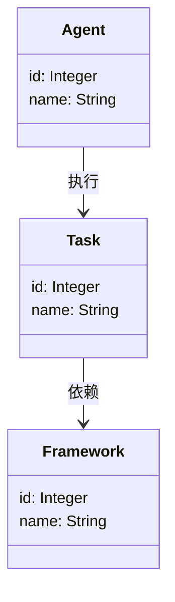
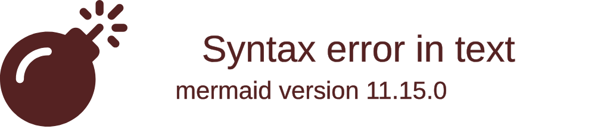

                 


# 企业AI Agent的多任务学习框架：提升模型通用性与效率

---

## 关键词：企业AI Agent、多任务学习、AI模型通用性、模型效率优化、任务协同优化、多任务学习框架

---

## 摘要：  
随着人工智能技术的快速发展，企业AI Agent（智能代理）在各个领域的应用越来越广泛。然而，单一任务的AI模型难以满足企业复杂的业务需求。多任务学习框架作为一种先进的AI技术，能够有效提升AI Agent的通用性和效率，解决企业中的多个任务协同优化问题。本文将详细探讨企业AI Agent的多任务学习框架，分析其核心概念、算法原理、系统架构，并通过实际案例展示其在企业中的应用价值。

---

# 第一部分: 企业AI Agent与多任务学习框架的背景

## 第1章: 企业AI Agent与多任务学习框架的背景

### 1.1 问题背景与挑战

#### 1.1.1 企业AI Agent的核心需求  
企业AI Agent是一种能够感知环境、自主决策并执行任务的智能系统。在企业场景中，AI Agent需要处理的任务种类繁多，例如自然语言处理、图像识别、数据分析、决策优化等。然而，传统的单任务学习模型难以满足企业对多任务协同优化的需求，主要存在以下问题：  
1. **任务孤立**：单任务模型无法有效协同多个任务，导致资源浪费和效率低下。  
2. **模型冗余**：企业需要维护多个独立的单任务模型，增加了开发和维护成本。  
3. **适应性不足**：单任务模型难以应对动态变化的业务需求，缺乏灵活性。  

#### 1.1.2 问题描述  
企业AI Agent需要同时处理多个相关任务，这些任务之间可能存在数据共享、知识复用的潜力。然而，传统的单任务学习方法无法充分利用这些潜力，导致模型效率低下，通用性不足。例如，在企业智能客服场景中，AI Agent需要同时处理客户咨询、情绪识别、意图理解等多个任务，这些任务之间存在高度的相关性，但传统的单任务模型难以实现协同优化。

#### 1.1.3 解决方案  
多任务学习框架通过共享多个任务的特征和知识，能够有效提升AI Agent的通用性和效率。多任务学习框架将多个任务联合优化，能够在模型层面实现任务间的协同，减少冗余模型的维护成本，同时提升模型的泛化能力。

#### 1.1.4 边界与外延  
多任务学习框架的应用场景不仅限于企业AI Agent，还可以扩展到自动驾驶、智能医疗、智能家居等领域。本文主要关注企业AI Agent中的多任务学习框架，探讨其设计原理和实际应用。

#### 1.1.5 核心概念与组成  
- **任务**：AI Agent需要完成的具体任务，例如自然语言处理、图像识别等。  
- **任务关系**：任务之间的依赖关系和协同关系，例如任务A的结果可以作为任务B的输入。  
- **多任务学习框架**：将多个任务联合优化的算法和架构，能够实现任务间的知识共享和协同优化。

---

### 1.2 多任务学习框架的定义与特点

#### 1.2.1 多任务学习的基本概念  
多任务学习（Multi-Task Learning, MTL）是一种机器学习方法，旨在同时优化多个任务，通过共享任务间的特征和参数，提升模型的通用性和效率。与单任务学习不同，MTL能够充分利用任务间的关联性，减少模型冗余。

#### 1.2.2 企业AI Agent中的多任务学习框架  
在企业AI Agent中，多任务学习框架被用于同时优化多个相关任务。例如，在智能客服场景中，AI Agent需要同时处理客户咨询、情绪识别、意图理解等多个任务。多任务学习框架能够将这些任务联合优化，提升模型的整体性能。

#### 1.2.3 多任务学习与传统单任务学习的对比  
以下是多任务学习与单任务学习的对比：

| 特性                | 单任务学习                 | 多任务学习                 |
|---------------------|--------------------------|--------------------------|
| **任务处理**         | 单个任务                 | 多个任务                 |
| **模型共享**         | 每个任务独立建模           | 任务间共享模型参数       |
| **效率**             | 高单任务效率             | 任务间协同优化，整体效率高 |
| **通用性**           | 仅适用于单一任务         | 适用于多个任务，通用性高   |

---

### 1.3 本章小结  
本章介绍了企业AI Agent的核心需求和挑战，探讨了多任务学习框架的必要性，并对比了多任务学习与单任务学习的特点。通过这些分析，我们可以看到多任务学习框架在企业AI Agent中的重要性。

---

# 第二部分: 多任务学习框架的核心概念与原理

## 第2章: 多任务学习框架的核心概念与联系

### 2.1 多任务学习框架的原理

#### 2.1.1 多任务学习的基本原理  
多任务学习的核心思想是通过共享多个任务的特征和参数，实现任务间的协同优化。以下是多任务学习的基本原理：

1. **任务关联性分析**：分析多个任务之间的关联性，确定任务间的依赖关系和协同关系。  
2. **模型共享**：通过共享模型参数，实现任务间的知识复用。  
3. **联合优化**：在训练过程中同时优化多个任务，提升模型的整体性能。  

#### 2.1.2 企业AI Agent中的多任务学习框架  
在企业AI Agent中，多任务学习框架被用于同时优化多个相关任务。例如，在智能客服场景中，AI Agent需要同时处理客户咨询、情绪识别、意图理解等多个任务。多任务学习框架能够将这些任务联合优化，提升模型的整体性能。

#### 2.1.3 多任务学习框架的数学模型  
多任务学习的数学模型可以通过以下公式表示：  
$$ L = \sum_{i=1}^{n} \lambda_i L_i $$  
其中，$L$ 表示总损失函数，$L_i$ 表示第 $i$ 个任务的损失函数，$\lambda_i$ 表示第 $i$ 个任务的权重系数。通过调整权重系数，可以实现任务间的联合优化。

---

### 2.2 核心概念对比与ER实体关系图

#### 2.2.1 核心概念属性对比表  
以下是核心概念属性的对比表：

| 概念       | 属性                     | 描述                                   |
|------------|--------------------------|--------------------------------------|
| 任务       | 名称                     | 任务的具体名称，例如“客户咨询”       |
|            | 输入                     | 任务的输入数据，例如文本、图像等     |
|            | 输出                     | 任务的输出结果，例如分类标签、预测值 |
| 任务关系   | 类型                     | 任务之间的依赖关系，例如“任务A的结果作为任务B的输入” |
|            | 权重                     | 任务在联合优化中的权重系数           |
| 多任务学习框架 | 架构                   | 模型的架构设计，例如共享层、独立层等 |
|            | 参数                   | 模型的共享参数和独立参数             |

#### 2.2.2 多任务学习框架的ER实体关系图  
以下是多任务学习框架的ER实体关系图：

```mermaid
er
    entity(Agent) {
        id: Integer
        name: String
    }
    entity(Task) {
        id: Integer
        name: String
    }
    entity(Framework) {
        id: Integer
        name: String
    }
    relationship(Agent-Task-Framework) {
        Agent -> Task: "执行"
        Task -> Framework: "依赖"
    }
```

---

### 2.3 本章小结  
本章详细介绍了多任务学习框架的核心概念和原理，通过对比表和ER实体关系图，展示了任务与任务关系、多任务学习框架之间的关联性。

---

# 第三部分: 多任务学习框架的算法原理

## 第3章: 多任务学习框架的算法原理

### 3.1 多任务学习框架的算法概述

#### 3.1.1 基础多任务学习算法  
以下是基础多任务学习算法的概述：

- **MTL（Multi-Task Learning）**：通过共享模型参数，同时优化多个任务。  
- **MCD（Multi-Constraint Domain）**：在多个约束条件下优化模型。  
- **MTL-GAN**：基于生成对抗网络的多任务学习框架。  

#### 3.1.2 企业AI Agent中的多任务学习算法  
在企业AI Agent中，多任务学习算法被用于同时优化多个相关任务。例如，在智能客服场景中，AI Agent需要同时处理客户咨询、情绪识别、意图理解等多个任务。多任务学习算法能够将这些任务联合优化，提升模型的整体性能。

#### 3.1.3 多任务学习算法的优缺点  
以下是多任务学习算法的优缺点对比：

| 优点                   | 缺点                     |
|------------------------|-------------------------|
| **模型共享**           | **任务间干扰**         |
| **任务协同优化**        | **模型复杂度增加**     |
| **通用性提升**          | **计算资源消耗大**     |

---

### 3.2 多任务学习算法的数学模型

#### 3.2.1 基础多任务学习模型  
以下是基础多任务学习模型的数学表达式：  
$$ L = \sum_{i=1}^{n} \lambda_i L_i $$  
其中，$L$ 表示总损失函数，$L_i$ 表示第 $i$ 个任务的损失函数，$\lambda_i$ 表示第 $i$ 个任务的权重系数。通过调整权重系数，可以实现任务间的联合优化。

#### 3.2.2 企业AI Agent中的多任务学习模型  
以下是企业AI Agent中的多任务学习模型的数学表达式：  
$$ L = \sum_{i=1}^{n} \lambda_i L_i + \beta \cdot R $$  
其中，$R$ 表示任务间的关联性约束，$\beta$ 表示关联性约束的权重系数。通过引入关联性约束，可以进一步提升模型的通用性和效率。

---

### 3.3 多任务学习算法的实现流程

#### 3.3.1 多任务学习算法的实现步骤  
以下是多任务学习算法的实现步骤：

1. **任务定义**：定义需要优化的任务，例如客户咨询、情绪识别、意图理解。  
2. **任务关系分析**：分析任务之间的依赖关系和协同关系。  
3. **模型设计**：设计模型架构，例如共享层、独立层。  
4. **损失函数设计**：设计联合优化的损失函数，包括任务损失和关联性约束。  
5. **模型训练**：使用多任务学习算法进行模型训练，优化模型参数。  
6. **模型评估**：评估模型的性能，例如准确率、召回率、F1值。  

---

### 3.4 多任务学习算法的代码实现

#### 3.4.1 环境安装  
以下是环境安装步骤：

1. **安装Python**：确保安装了Python 3.6及以上版本。  
2. **安装TensorFlow**：使用以下命令安装TensorFlow：  
   ```bash
   pip install tensorflow
   ```
3. **安装其他依赖**：安装其他所需的库，例如numpy、pandas等。

#### 3.4.2 核心代码实现  
以下是多任务学习算法的核心代码实现：

```python
import tensorflow as tf
import numpy as np

# 定义任务数
num_tasks = 3

# 定义任务权重系数
task_weights = [0.4, 0.3, 0.3]

# 定义模型参数
learning_rate = 0.001

# 定义输入占位符
x = tf.placeholder(tf.float32, [None, 100])
y = tf.placeholder(tf.float32, [None, 1])

# 定义共享层
shared_layer = tf.layers.dense(x, 64, activation='relu')

# 定义独立层
task_outputs = []
for i in range(num_tasks):
    with tf.variable_scope('task_' + str(i)):
        task_output = tf.layers.dense(shared_layer, 1)
        task_outputs.append(task_output)

# 定义损失函数
losses = []
for i in range(num_tasks):
    cross_entropy = tf.nn.sigmoid_cross_entropy_with_logits(
        labels=y,
        logits=task_outputs[i]
    )
    losses.append(tf.reduce_mean(cross_entropy))

# 定义总损失函数
total_loss = 0
for i in range(num_tasks):
    total_loss += task_weights[i] * losses[i]

# 定义优化器
optimizer = tf.train.AdamOptimizer(learning_rate)
train_op = optimizer.minimize(total_loss)

# 初始化变量
init = tf.global_variables_initializer()

# 开始训练
with tf.Session() as sess:
    sess.run(init)
    for step in range(1000):
        x_batch, y_batch = next_batch()  # 获取训练数据
        _, loss_val = sess.run([train_op, total_loss], feed_dict={x: x_batch, y: y_batch})
        print("Step {}, Loss: {}".format(step, loss_val))
```

---

### 3.5 本章小结  
本章详细介绍了多任务学习框架的算法原理，通过数学模型和代码实现，展示了多任务学习算法的核心思想和实现步骤。

---

# 第四部分: 多任务学习框架的系统分析与架构设计

## 第4章: 多任务学习框架的系统分析与架构设计

### 4.1 项目背景

#### 4.1.1 项目背景介绍  
本项目旨在设计和实现一个企业AI Agent的多任务学习框架，用于同时优化多个相关任务。通过多任务学习框架，能够提升AI Agent的通用性和效率，减少模型冗余和开发成本。

#### 4.1.2 项目目标  
本项目的目标是：  
1. **实现多任务学习框架**：设计一个能够同时优化多个任务的多任务学习框架。  
2. **提升模型通用性**：通过任务间的知识共享，提升模型的通用性。  
3. **优化模型效率**：通过任务协同优化，减少模型冗余，提升模型效率。  

---

### 4.2 系统功能设计

#### 4.2.1 系统功能模块  
以下是系统功能模块的描述：

1. **任务定义模块**：定义需要优化的任务，例如客户咨询、情绪识别、意图理解。  
2. **任务关系分析模块**：分析任务之间的依赖关系和协同关系。  
3. **模型设计模块**：设计模型架构，例如共享层、独立层。  
4. **损失函数设计模块**：设计联合优化的损失函数，包括任务损失和关联性约束。  
5. **模型训练模块**：使用多任务学习算法进行模型训练，优化模型参数。  
6. **模型评估模块**：评估模型的性能，例如准确率、召回率、F1值。  

#### 4.2.2 系统功能设计的领域模型  
以下是系统功能设计的领域模型：



---

### 4.3 系统架构设计

#### 4.3.1 系统架构图  
以下是系统架构图：



---

### 4.4 系统接口设计

#### 4.4.1 系统接口描述  
以下是系统接口的描述：

1. **输入接口**：接收多个任务的输入数据，例如文本、图像等。  
2. **输出接口**：输出多个任务的预测结果，例如分类标签、预测值。  
3. **训练接口**：接收训练数据和标签，进行模型训练。  
4. **评估接口**：接收测试数据和标签，评估模型性能。  

#### 4.4.2 系统交互流程  
以下是系统交互流程的描述：

1. **数据输入**：用户输入多个任务的输入数据。  
2. **任务执行**：AI Agent执行多个任务，输出预测结果。  
3. **模型训练**：通过多任务学习算法进行模型训练，优化模型参数。  
4. **模型评估**：评估模型的性能，调整模型参数。  

---

### 4.5 本章小结  
本章详细介绍了多任务学习框架的系统分析与架构设计，通过领域模型和系统架构图，展示了系统的整体结构和功能模块。

---

# 第五部分: 多任务学习框架的项目实战

## 第5章: 多任务学习框架的项目实战

### 5.1 环境安装

#### 5.1.1 安装Python  
确保安装了Python 3.6及以上版本。  

#### 5.1.2 安装TensorFlow  
使用以下命令安装TensorFlow：  
```bash
pip install tensorflow
```

#### 5.1.3 安装其他依赖  
安装其他所需的库，例如numpy、pandas等。  
```bash
pip install numpy pandas
```

---

### 5.2 核心代码实现

#### 5.2.1 多任务学习框架的核心代码  
以下是多任务学习框架的核心代码实现：

```python
import tensorflow as tf
import numpy as np

# 定义任务数
num_tasks = 3

# 定义任务权重系数
task_weights = [0.4, 0.3, 0.3]

# 定义模型参数
learning_rate = 0.001

# 定义输入占位符
x = tf.placeholder(tf.float32, [None, 100])
y = tf.placeholder(tf.float32, [None, 1])

# 定义共享层
shared_layer = tf.layers.dense(x, 64, activation='relu')

# 定义独立层
task_outputs = []
for i in range(num_tasks):
    with tf.variable_scope('task_' + str(i)):
        task_output = tf.layers.dense(shared_layer, 1)
        task_outputs.append(task_output)

# 定义损失函数
losses = []
for i in range(num_tasks):
    cross_entropy = tf.nn.sigmoid_cross_entropy_with_logits(
        labels=y,
        logits=task_outputs[i]
    )
    losses.append(tf.reduce_mean(cross_entropy))

# 定义总损失函数
total_loss = 0
for i in range(num_tasks):
    total_loss += task_weights[i] * losses[i]

# 定义优化器
optimizer = tf.train.AdamOptimizer(learning_rate)
train_op = optimizer.minimize(total_loss)

# 初始化变量
init = tf.global_variables_initializer()

# 开始训练
with tf.Session() as sess:
    sess.run(init)
    for step in range(1000):
        x_batch, y_batch = next_batch()  # 获取训练数据
        _, loss_val = sess.run([train_op, total_loss], feed_dict={x: x_batch, y: y_batch})
        print("Step {}, Loss: {}".format(step, loss_val))
```

---

### 5.3 代码应用解读与分析

#### 5.3.1 代码解读  
1. **输入占位符**：定义输入数据的占位符，包括特征和标签。  
2. **共享层**：定义一个共享层，用于提取特征的共享部分。  
3. **独立层**：定义独立层，用于每个任务的独立处理。  
4. **损失函数**：定义每个任务的损失函数，并计算总损失函数。  
5. **优化器**：定义优化器，用于优化模型参数。  
6. **训练过程**：执行训练过程，优化模型参数。  

#### 5.3.2 代码分析  
1. **输入数据**：输入数据包括特征和标签，特征用于模型处理，标签用于损失计算。  
2. **共享层**：共享层用于提取特征的共享部分，提升任务间的知识复用。  
3. **独立层**：独立层用于每个任务的独立处理，确保任务的个性化需求。  
4. **损失函数**：总损失函数包括所有任务的损失，并根据任务权重进行加权。  
5. **优化器**：优化器用于优化模型参数，实现任务间的联合优化。  

---

### 5.4 实际案例分析

#### 5.4.1 案例背景  
以下是案例背景的描述：  
某企业希望开发一个智能客服系统，AI Agent需要同时处理客户咨询、情绪识别、意图理解等多个任务。通过多任务学习框架，能够提升AI Agent的通用性和效率。

#### 5.4.2 案例实现  
以下是案例实现的步骤：

1. **任务定义**：定义需要优化的任务，例如客户咨询、情绪识别、意图理解。  
2. **任务关系分析**：分析任务之间的依赖关系和协同关系。  
3. **模型设计**：设计模型架构，包括共享层和独立层。  
4. **损失函数设计**：设计联合优化的损失函数，包括任务损失和关联性约束。  
5. **模型训练**：使用多任务学习算法进行模型训练，优化模型参数。  
6. **模型评估**：评估模型的性能，例如准确率、召回率、F1值。  

---

### 5.5 本章小结  
本章通过实际案例展示了多任务学习框架的应用价值，通过代码实现和案例分析，帮助读者理解多任务学习框架的核心思想和实现步骤。

---

# 第六部分: 多任务学习框架的最佳实践

## 第6章: 多任务学习框架的最佳实践

### 6.1 最佳实践

#### 6.1.1 任务选择与设计  
1. **任务相关性分析**：选择相关性较高的任务，提升任务间的协同优化效果。  
2. **任务权重调整**：根据任务的重要性和影响程度，调整任务权重系数。  
3. **任务顺序优化**：合理安排任务的执行顺序，提升模型训练效率。  

#### 6.1.2 模型优化策略  
1. **共享层设计**：合理设计共享层，确保任务间的知识复用。  
2. **独立层设计**：根据任务的个性化需求，合理设计独立层。  
3. **损失函数优化**：根据任务特点，优化损失函数的设计，提升模型性能。  

#### 6.1.3 训练策略优化  
1. **学习率调整**：根据模型训练情况，动态调整学习率。  
2. **批量大小优化**：选择合适的批量大小，提升训练效率。  
3. **模型评估**：定期评估模型性能，根据评估结果调整模型参数。  

---

### 6.2 小结

#### 6.2.1 本章小结  
本章总结了多任务学习框架的最佳实践，包括任务选择与设计、模型优化策略和训练策略优化等方面。

---

### 6.3 注意事项

#### 6.3.1 模型过拟合问题  
在多任务学习中，需要注意模型过拟合问题，可以通过正则化、数据增强等方法进行缓解。  

#### 6.3.2 任务间干扰问题  
任务间干扰是多任务学习中的一个重要问题，需要合理设计任务权重和任务关系，减少任务间干扰。  

#### 6.3.3 模型复杂度问题  
多任务学习模型的复杂度较高，需要注意模型的可解释性和计算效率，避免模型过于复杂。  

---

### 6.4 拓展阅读

#### 6.4.1 多任务学习的最新研究  
1. **MTL-GAN**：基于生成对抗网络的多任务学习框架。  
2. **Heterogeneous MTL**：异构多任务学习框架。  
3. **Dynamic MTL**：动态多任务学习框架。  

#### 6.4.2 相关技术领域  
1. **知识图谱**：通过知识图谱实现任务间的知识共享。  
2. **联邦学习**：通过联邦学习实现多任务学习的跨机构协作。  
3. **强化学习**：通过强化学习实现多任务学习的动态优化。  

---

### 6.5 本章小结  
本章总结了多任务学习框架的最佳实践，包括任务选择与设计、模型优化策略和训练策略优化等方面，并提出了注意事项和拓展阅读内容。

---

# 结语

企业AI Agent的多任务学习框架是一种先进的技术，能够有效提升AI Agent的通用性和效率。通过多任务学习框架，企业可以同时优化多个相关任务，减少模型冗余和开发成本。本文详细探讨了多任务学习框架的核心概念、算法原理、系统架构，并通过实际案例展示了其在企业中的应用价值。未来，随着人工智能技术的不断发展，多任务学习框架将在企业AI Agent中发挥越来越重要的作用。

---

## 作者：AI天才研究院/AI Genius Institute & 禅与计算机程序设计艺术 /Zen And The Art of Computer Programming

