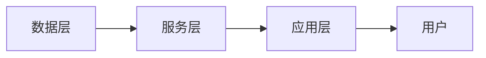
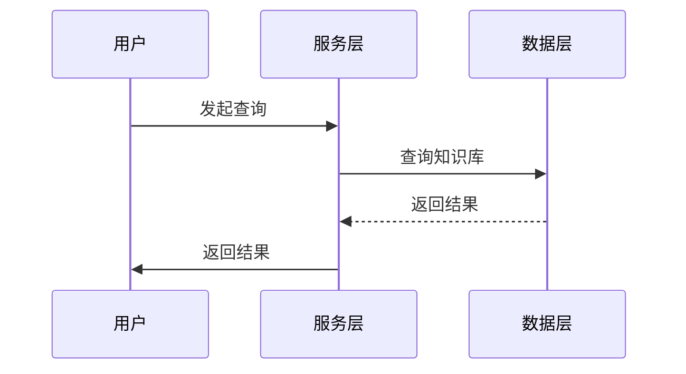
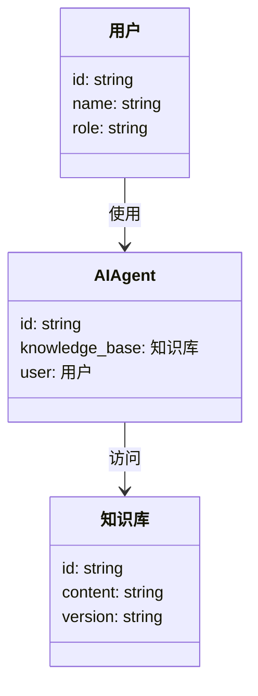

                 


# 企业AI Agent的知识库管理系统

> 关键词：企业AI Agent，知识库管理，向量数据库，知识图谱，自然语言处理，机器学习

> 摘要：本文详细探讨了企业AI Agent的知识库管理系统，从背景、核心概念、算法原理、系统架构到项目实战，全面分析了知识库管理的重要性及其在企业中的应用。通过向量数据库、知识图谱构建和推理算法的深入讲解，结合实际案例，帮助读者理解如何设计和实现高效的AI Agent知识库管理系统。

---

# 第1章 企业AI Agent的知识库管理背景与问题

## 1.1 问题背景与挑战

### 1.1.1 企业AI Agent的发展现状

随着人工智能技术的迅速发展，企业AI Agent（智能体）的应用越来越广泛。AI Agent能够通过与用户的交互，自动化处理各种任务，例如信息检索、决策支持和流程自动化。然而，AI Agent的智能性和实用性高度依赖于知识库的管理和更新。

### 1.1.2 知识库管理的核心问题

知识库是AI Agent的核心资源，它包含了企业的各种信息和数据。知识库管理的主要挑战包括：

- **数据冗余**：如何避免重复数据，保持知识库的简洁性和一致性。
- **数据更新**：如何高效地更新知识库，确保信息的准确性和及时性。
- **数据检索**：如何快速检索相关知识，满足用户的需求。
- **数据安全**：如何保护知识库的安全性，防止数据泄露。

### 1.1.3 企业的知识库管理痛点

企业在知识库管理方面面临的主要痛点包括：

- 知识库分散：企业的信息分布在不同的系统中，难以统一管理和检索。
- 知识表示不一致：不同部门或系统中知识表示方式不同，导致信息孤岛。
- 知识更新不及时：信息变化快，知识库难以跟上业务发展的步伐。
- 知识检索效率低：传统的检索方式效率低下，无法满足实时需求。

## 1.2 问题描述与目标

### 1.2.1 企业AI Agent的知识库管理需求

企业AI Agent的知识库管理需求主要体现在以下几个方面：

- **高效检索**：快速响应用户查询，提高工作效率。
- **动态更新**：实时更新知识库，确保信息的准确性。
- **智能推理**：通过推理算法，提供更深层次的知识支持。
- **安全可靠**：保障知识库的安全性，防止数据泄露。

### 1.2.2 知识库管理的目标与边界

知识库管理的目标是构建一个高效、智能、安全的知识库系统，为AI Agent提供强有力的支持。其边界包括：

- **数据范围**：仅限于企业内部数据，不涉及外部公开数据。
- **用户权限**：不同用户对知识库的访问权限不同。
- **更新频率**：根据业务需求，设定知识库的更新频率。

### 1.2.3 知识库管理的外延与应用场景

知识库管理的外延包括：

- **数据预处理**：对数据进行清洗、转换和标注。
- **数据存储**：选择合适的数据存储方式，如关系型数据库或分布式数据库。
- **数据检索**：设计高效的检索算法，提高查询效率。

知识库管理的主要应用场景包括：

- **智能问答**：基于知识库提供准确的答案。
- **决策支持**：通过知识库分析提供决策依据。
- **流程自动化**：利用知识库实现业务流程的自动化。

## 1.3 问题解决思路

### 1.3.1 知识库管理的解决方案

为了解决知识库管理的痛点，我们可以采用以下解决方案：

- **分布式存储**：使用分布式数据库，提高数据存储的扩展性和可靠性。
- **向量数据库**：采用向量索引技术，提高数据检索的效率。
- **知识图谱构建**：通过知识图谱技术，实现知识的结构化和关联化。

### 1.3.2 AI Agent在知识库管理中的作用

AI Agent在知识库管理中的作用包括：

- **数据预处理**：对数据进行清洗、转换和标注，确保知识库的准确性。
- **动态更新**：根据业务需求，实时更新知识库内容。
- **智能检索**：通过自然语言处理技术，实现智能检索和问答。

### 1.3.3 知识库管理的系统架构思路

知识库管理的系统架构思路包括：

- **分层设计**：将系统分为数据层、服务层和应用层，各层之间相对独立。
- **模块化设计**：将系统功能模块化，便于维护和扩展。
- **高可用性**：通过负载均衡和容灾备份，确保系统的高可用性。

## 1.4 知识库管理的概念结构与核心要素

### 1.4.1 知识库管理的核心概念

知识库管理的核心概念包括：

- **知识表示**：如何将知识表示为数据结构，例如实体、关系和属性。
- **知识存储**：如何存储和组织知识，例如使用数据库或知识图谱。
- **知识检索**：如何快速检索知识库中的相关信息。

### 1.4.2 知识库管理的属性与特征

知识库管理的属性包括：

- **一致性**：确保知识库中的信息一致。
- **完整性**：确保知识库包含所有必要的信息。
- **动态性**：能够实时更新和维护。

### 1.4.3 知识库管理的实体关系图

```mermaid
er
    actor: 用户
    knowledge_base: 知识库
    agent: AI Agent
    action: 行为
    relation: 关系
    attribute: 属性
    actor --> action: 发起行为
    action --> knowledge_base: 作用于知识库
    knowledge_base --> agent: 提供知识支持
    agent --> action: 执行结果反馈
```

---

# 第2章 企业AI Agent的知识库管理核心概念与联系

## 2.1 核心概念原理

### 2.1.1 知识库管理的核心原理

知识库管理的核心原理包括：

- **数据建模**：将现实世界中的实体和关系转化为数据模型。
- **数据存储**：选择合适的数据存储方式，如关系型数据库或分布式数据库。
- **数据检索**：设计高效的检索算法，提高查询效率。

### 2.1.2 AI Agent的知识表示方法

AI Agent的知识表示方法包括：

- **符号表示法**：使用符号和规则来表示知识。
- **语义网络表示法**：通过节点和边表示实体和关系。
- **向量表示法**：使用向量空间模型表示知识。

### 2.1.3 知识库管理的算法基础

知识库管理的算法基础包括：

- **向量索引**：如ANN（Approximate Nearest Neighbor）算法。
- **知识图谱构建**：如RDF（Resource Description Framework）和N-Triples。
- **推理算法**：如基于规则的推理和基于概率的推理。

## 2.2 核心概念属性对比

### 2.2.1 知识库与数据库的对比

| 特性          | 知识库                  | 数据库                  |
|---------------|-------------------------|-------------------------|
| 数据模型       | 结构化、语义化           | 结构化、非语义化         |
| 数据表示       | 实体、关系、属性         | 行、列、键               |
| 查询方式       | 基于语义的查询           | 基于结构的查询           |
| 应用场景       | 智能问答、知识推理       | 数据统计、事务处理       |

### 2.2.2 知识图谱与传统数据库的对比

| 特性          | 知识图谱                | 传统数据库              |
|---------------|-------------------------|-------------------------|
| 数据结构       | 图结构                  | 表结构                  |
| 查询效率       | 较低                   | 较高                   |
| 可扩展性       | 高                    | 中                    |
| 应用场景       | 智能检索、知识推理       | 数据存储、查询           |

### 2.2.3 AI Agent与传统知识管理系统的对比

| 特性          | AI Agent                | 传统知识管理系统          |
|---------------|-------------------------|-------------------------|
| 智能性         | 高                    | 中                    |
| 自动化能力     | 高                    | 低                    |
| 适应性         | 高                    | 低                    |
| 应用场景       | 智能问答、流程自动化     | 文件管理、知识共享       |

## 2.3 ER实体关系图

```mermaid
er
    actor: 用户
    knowledge_base: 知识库
    agent: AI Agent
    action: 行为
    relation: 关系
    attribute: 属性
    actor --> action: 发起行为
    action --> knowledge_base: 作用于知识库
    knowledge_base --> agent: 提供知识支持
    agent --> action: 执行结果反馈
```

---

# 第3章 企业AI Agent的知识库管理算法原理

## 3.1 向量数据库算法

### 3.1.1 向量数据库的定义与特点

向量数据库是一种基于向量空间模型的数据存储和检索技术。其特点包括：

- **高效检索**：通过向量索引技术，实现快速的相似性检索。
- **语义理解**：能够理解数据的语义，提供更准确的检索结果。
- **可扩展性**：适用于大规模数据存储和检索。

### 3.1.2 向量数据库的构建过程

向量数据库的构建过程包括：

1. **数据预处理**：对数据进行清洗、转换和标注。
2. **向量化**：将数据转换为向量表示。
3. **索引构建**：构建向量索引，便于快速检索。
4. **存储**：将向量和索引存储到数据库中。

### 3.1.3 向量数据库的查询算法

向量数据库的查询算法包括：

- **余弦相似度**：计算两个向量之间的余弦相似度，用于衡量它们的相关性。
- **欧氏距离**：计算两个向量之间的欧氏距离，用于衡量它们的相似性。

### 3.1.4 代码实现

```python
import numpy as np
from sklearn.metrics.pairwise import cosine_similarity

# 示例数据：两组向量
vector1 = np.array([1, 2, 3])
vector2 = np.array([4, 5, 6])

# 计算余弦相似度
similarity = cosine_similarity([vector1], [vector2])[0, 0]
print(f"余弦相似度: {similarity}")

# 计算欧氏距离
distance = np.linalg.norm(vector1 - vector2)
print(f"欧氏距离: {distance}")
```

### 3.1.5 数学模型与公式

余弦相似度的计算公式：

$$ \cos \theta = \frac{\vec{a} \cdot \vec{b}}{||\vec{a}|| \cdot ||\vec{b}||} $$

欧氏距离的计算公式：

$$ d = \sqrt{(a_1 - b_1)^2 + (a_2 - b_2)^2 + \dots + (a_n - b_n)^2} $$

---

## 3.2 知识图谱构建与推理算法

### 3.2.1 知识图谱的定义与特点

知识图谱是一种结构化的知识表示方式，其特点包括：

- **结构化**：通过实体和关系构建知识网络。
- **语义化**：能够理解数据的语义。
- **可扩展性**：适用于大规模数据存储和检索。

### 3.2.2 知识图谱的构建过程

知识图谱的构建过程包括：

1. **数据收集**：从多种数据源收集数据。
2. **数据清洗**：对数据进行去重、去噪和标准化。
3. **实体识别**：识别数据中的实体和关系。
4. **知识抽取**：从数据中抽取结构化的知识。
5. **知识融合**：将抽取的知识进行融合，消除冲突。
6. **知识存储**：将知识存储到知识图谱中。

### 3.2.3 知识图谱的推理算法

知识图谱的推理算法包括：

- **基于规则的推理**：根据预定义的规则进行推理。
- **基于概率的推理**：基于概率论进行推理，如贝叶斯推理。
- **基于逻辑的推理**：基于逻辑推理进行推理，如一阶逻辑推理。

### 3.2.4 代码实现

```python
from owlready2 import *

# 示例知识图谱
onto = Ontology("http://example.org/my_ontology#")

class Person(Thing):
    pass

class HasFriend(Person):
    pass

# 创建实例
john = Person('john')
anna = Person('anna')

# 添加关系
john.hasFriend(anna)

# 查询
for friend in john.hasFriend:
    print(friend)
```

### 3.2.5 数学模型与公式

基于概率的推理公式：

$$ P(H|E) = \frac{P(E|H) \cdot P(H)}{P(E)} $$

基于逻辑的推理公式：

$$ \forall x, y \in Persons, \text{if } x \text{ knows } y \text{ and } y \text{ knows } z, \text{ then } x \text{ knows } z $$

---

## 3.3 推理算法

### 3.3.1 推理算法的定义与特点

推理算法是一种从已知事实中推导出新事实的算法。其特点包括：

- **智能性**：能够根据已有知识进行推理。
- **可解释性**：推理过程可以被解释和理解。
- **可扩展性**：适用于大规模数据推理。

### 3.3.2 推理算法的分类

推理算法主要分为以下几类：

1. **基于规则的推理**：根据预定义的规则进行推理。
2. **基于概率的推理**：基于概率论进行推理。
3. **基于逻辑的推理**：基于逻辑推理进行推理。

### 3.3.3 推理算法的代码实现

```python
# 示例代码：基于规则的推理
from rules import *

# 定义规则
def rule1(x, y, z):
    return x.knows(y) and y.knows(z)

# 推理过程
for x in persons:
    for y in x.knows:
        for z in y.knows:
            if rule1(x, y, z):
                print(f"{x} knows {z}")
```

### 3.3.4 数学模型与公式

基于规则的推理公式：

$$ \text{如果 } A \text{ 并且 } B, \text{ 那么 } C $$

基于概率的推理公式：

$$ P(C|A,B) = \frac{P(A,B|C) \cdot P(C)}{P(A,B)} $$

---

# 第4章 企业AI Agent的知识库管理系统分析与架构设计

## 4.1 系统分析

### 4.1.1 问题场景介绍

在企业AI Agent的知识库管理系统中，我们需要解决以下问题：

- 如何高效地存储和检索知识库中的信息。
- 如何确保知识库的安全性和一致性。
- 如何实现知识库的动态更新和维护。

### 4.1.2 系统功能需求

系统功能需求包括：

- **知识库管理**：包括知识的存储、更新和删除。
- **知识检索**：支持基于关键词和语义的检索。
- **知识推理**：通过推理算法，提供智能支持。
- **用户权限管理**：确保知识库的安全性。

## 4.2 系统架构设计

### 4.2.1 系统架构思路

系统架构设计思路包括：

- **分层设计**：将系统分为数据层、服务层和应用层。
- **模块化设计**：将系统功能模块化，便于维护和扩展。
- **高可用性**：通过负载均衡和容灾备份，确保系统的高可用性。

### 4.2.2 系统架构图



### 4.2.3 接口设计

系统接口设计包括：

- **数据接口**：提供知识库的存储和检索接口。
- **推理接口**：提供基于推理算法的知识支持接口。
- **用户接口**：提供用户交互界面，如网页或API。

### 4.2.4 交互序列图



## 4.3 系统功能设计

### 4.3.1 领域模型

领域模型包括：

- **用户**：系统的最终用户。
- **知识库**：存储知识的核心组件。
- **AI Agent**：负责知识的检索和推理。

### 4.3.2 领域模型图



---

# 第5章 企业AI Agent的知识库管理系统实战

## 5.1 项目实战

### 5.1.1 环境安装

项目实战需要以下环境：

- **Python 3.8+**
- **Jupyter Notebook**
- **scikit-learn**
- **numpy**
- **owlready2**

### 5.1.2 核心代码实现

```python
# 示例代码：向量数据库的实现
from sklearn.feature_extraction.text import TfidfVectorizer

# 示例数据
texts = ["This is a sample text.", "Another sample text."]

# 创建向量化器
vectorizer = TfidfVectorizer()
vectors = vectorizer.fit_transform(texts)

# 计算余弦相似度
similarity_matrix = cosine_similarity(vectors)
```

### 5.1.3 代码解读与分析

- **向量化器**：使用TF-IDF向量化器对文本进行向量化。
- **相似度计算**：使用余弦相似度计算向量之间的相似性。
- **结果展示**：输出相似度矩阵，展示文本之间的相似性。

### 5.1.4 实际案例分析

通过实际案例分析，我们可以看到向量数据库在企业AI Agent中的应用。例如，企业可以使用向量数据库快速检索相似的客户问题，提高客服的响应速度和准确性。

---

# 第6章 总结与展望

## 6.1 最佳实践

- **数据预处理**：确保数据的准确性和一致性。
- **模型优化**：通过模型优化提高检索效率和准确性。
- **安全措施**：确保知识库的安全性，防止数据泄露。

## 6.2 小结

本文详细探讨了企业AI Agent的知识库管理系统，从背景、核心概念、算法原理到系统架构和项目实战，全面分析了知识库管理的重要性及其在企业中的应用。通过向量数据库、知识图谱构建和推理算法的深入讲解，结合实际案例，帮助读者理解如何设计和实现高效的AI Agent知识库管理系统。

## 6.3 注意事项

- **数据隐私**：在处理敏感数据时，需遵守相关法律法规。
- **系统性能**：确保系统的高性能和高可用性。
- **用户权限**：严格控制用户的访问权限，防止数据泄露。

## 6.4 拓展阅读

- **向量数据库**：了解更多的向量索引算法，如ANN。
- **知识图谱**：深入学习知识图谱的构建和应用。
- **推理算法**：研究更多的推理算法，如基于图的推理。

---

# 作者

作者：AI天才研究院/AI Genius Institute & 禅与计算机程序设计艺术 /Zen And The Art of Computer Programming

