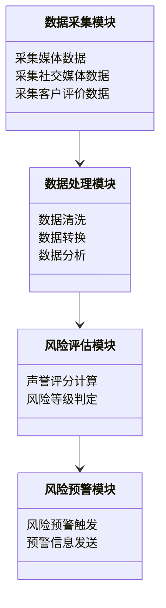
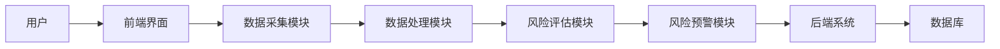
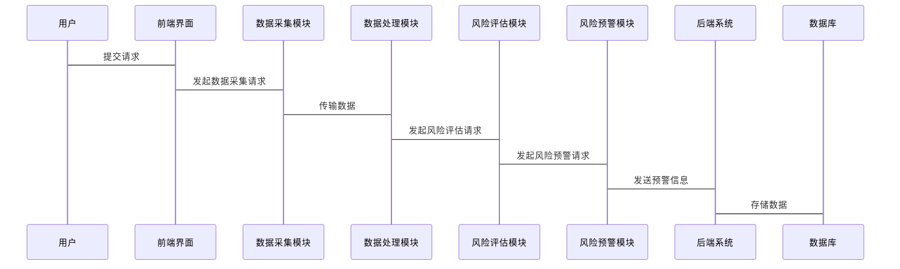

                 


# 《利用多智能体系统进行全面的公司声誉风险分析》

---

## 关键词：
公司声誉风险、多智能体系统、分布式计算、声誉评估模型、风险分析、智能体协作

---

## 摘要：
随着全球化和信息化的快速发展，公司声誉风险管理变得日益复杂和重要。本文通过引入多智能体系统（Multi-Agent System，MAS）的概念，提出了一种全新的公司声誉风险分析方法。多智能体系统具有分布式计算、协作性强和适应性高的特点，能够有效地处理声誉风险分析中的复杂问题。本文详细探讨了多智能体系统在声誉风险分析中的核心算法、数学模型、系统架构以及实际应用场景，并通过案例分析验证了该方法的有效性和优势。通过本文的研究，读者可以深入了解如何利用多智能体系统进行全面的公司声誉风险分析，从而为企业的风险管理提供新的思路和解决方案。

---

# 第1章 公司声誉风险分析的背景与概述

## 1.1 声誉风险的定义与重要性

### 1.1.1 声誉风险的定义
声誉风险是指由于企业内外部因素的变化，导致企业在公众中的形象和信誉受到损害，进而对企业经营、市场地位和财务表现产生负面影响的风险。声誉风险不仅包括企业自身的决策失误，还包括外部环境的变化、竞争对手的行动以及媒体传播等因素的影响。

### 1.1.2 声誉风险的重要性
在当今竞争激烈的市场环境中，企业的声誉是其核心竞争力的重要组成部分。良好的声誉能够为企业带来更多的客户、合作伙伴和投资者，而声誉受损则可能导致客户流失、市场份额下降以及高昂的修复成本。因此，及时识别和管理声誉风险对企业生存和长远发展至关重要。

### 1.1.3 声誉风险的分类
声誉风险可以分为以下几类：
- **产品与服务质量风险**：由于产品质量问题或服务不佳导致的声誉损失。
- **财务风险**：财务造假、亏损或债务危机引发的声誉问题。
- **法律与合规风险**：法律诉讼、违规行为等导致的声誉损害。
- **公共关系风险**：与媒体、客户或员工的关系处理不当引发的声誉风险。
- **领导层风险**：高管的不当行为或决策失误对企业声誉的影响。

---

## 1.2 多智能体系统的定义与特点

### 1.2.1 多智能体系统的定义
多智能体系统（Multi-Agent System，MAS）是由多个智能体（Agent）组成的分布式系统，这些智能体能够通过通信和协作完成复杂的任务。智能体是具有感知环境、自主决策和行动能力的实体，可以是软件程序、机器人或其他智能设备。

### 1.2.2 多智能体系统的特性
多智能体系统具有以下特点：
- **分布式性**：智能体分布在网络中，各自负责不同的任务。
- **自主性**：每个智能体能够独立决策和行动。
- **协作性**：智能体之间通过通信和协作完成共同目标。
- **反应性**：智能体能够根据环境变化动态调整行为。
- **适应性**：系统能够适应外部环境的变化，自我优化和改进。

### 1.2.3 多智能体系统的优势
多智能体系统的优势体现在以下几个方面：
- **高效性**：通过分布式计算和并行处理提高系统的计算效率。
- **灵活性**：智能体可以根据任务需求动态调整行为，适应复杂环境。
- **容错性**：多个智能体协同工作，单个智能体的故障不会导致整个系统崩溃。

---

## 1.3 多智能体系统与公司声誉风险分析的结合

### 1.3.1 多智能体系统在声誉风险分析中的作用
多智能体系统可以通过以下方式帮助进行声誉风险分析：
- **数据采集与处理**：智能体可以实时采集媒体、社交媒体、客户评价等数据，进行分析和处理。
- **风险评估**：通过分布式计算和协作，智能体可以快速评估潜在的声誉风险。
- **风险预警**：系统可以根据历史数据和实时信息，预测未来可能的风险，并发出预警。

### 1.3.2 多智能体系统的优势
- **高效性**：多智能体系统可以同时处理大量的数据，提高分析效率。
- **准确性**：通过智能体的协作和分布式计算，可以更准确地评估声誉风险。
- **实时性**：系统能够实时监控和分析，及时发现和应对声誉风险。

### 1.3.3 多智能体系统在声誉风险分析中的应用前景
随着人工智能和大数据技术的快速发展，多智能体系统在声誉风险分析中的应用前景广阔。未来，多智能体系统将更加智能化和自动化，能够帮助企业更好地应对复杂多变的声誉风险。

---

## 1.4 本章小结
本章介绍了公司声誉风险的基本概念、多智能体系统的定义与特点，以及多智能体系统在声誉风险分析中的作用和优势。通过本章的介绍，读者可以初步了解多智能体系统在声誉风险分析中的重要性和应用价值。

---

# 第2章 多智能体系统的核心概念与原理

## 2.1 多智能体系统的组成与结构

### 2.1.1 智能体的定义与特征
智能体（Agent）是指具有感知、决策、行动和协作能力的实体。智能体可以是软件程序、机器人或其他智能设备，具有以下特征：
- **自主性**：能够独立决策和行动。
- **反应性**：能够根据环境变化调整行为。
- **协作性**：能够与其他智能体协作完成任务。

### 2.1.2 多智能体系统的层次结构
多智能体系统的层次结构通常包括以下层次：
- **物理层**：智能体与物理环境的交互。
- **数据层**：数据的采集、存储和处理。
- **计算层**：智能体的计算和推理过程。
- **应用层**：系统的实际应用和输出结果。

### 2.1.3 多智能体系统的通信机制
智能体之间的通信是通过消息传递完成的。通信机制包括：
- **同步通信**：智能体之间同步交换信息。
- **异步通信**：智能体之间异步交换信息。
- **发布-订阅模型**：智能体通过发布信息和订阅信息进行通信。

---

## 2.2 多智能体系统的协调与协作

### 2.2.1 协调机制的定义
协调机制是指智能体之间为了实现共同目标而进行的协调和合作。协调机制包括：
- **任务分配**：智能体之间的任务分配。
- **信息共享**：智能体之间的信息共享和同步。
- **冲突解决**：智能体之间冲突的解决。

### 2.2.2 协作算法的原理
协作算法是多智能体系统中智能体协作完成任务的核心算法。协作算法包括：
- **分布式协作算法**：智能体通过分布式计算完成任务。
- **集中式协作算法**：智能体通过集中式计算完成任务。
- **混合式协作算法**：结合分布式和集中式协作算法。

### 2.2.3 协调与协作的实现方式
协调与协作的实现方式包括：
- **基于规则的协作**：智能体根据预定义的规则进行协作。
- **基于博弈论的协作**：智能体通过博弈论模型进行协作。
- **基于学习的协作**：智能体通过学习和适应进行协作。

---

## 2.3 多智能体系统的分布式计算与决策

### 2.3.1 分布式计算的基本概念
分布式计算是指在多个计算节点上进行计算的过程。分布式计算的特点包括：
- **资源共享**：多个计算节点共享资源。
- **任务分配**：任务可以分配到不同的计算节点上。
- **并行计算**：多个计算节点同时进行计算。

### 2.3.2 分布式决策的实现原理
分布式决策是指多个智能体通过分布式计算完成决策的过程。分布式决策的实现原理包括：
- **信息分散**：每个智能体只掌握部分信息。
- **局部决策**：每个智能体根据局部信息进行决策。
- **全局优化**：通过智能体的协作，实现全局优化。

### 2.3.3 分布式计算在多智能体系统中的应用
分布式计算在多智能体系统中的应用包括：
- **任务分配**：智能体通过分布式计算完成任务分配。
- **信息处理**：智能体通过分布式计算处理信息。
- **协同决策**：智能体通过分布式计算完成协同决策。

---

## 2.4 本章小结
本章详细介绍了多智能体系统的组成与结构、协调与协作机制以及分布式计算与决策的原理和应用。通过本章的介绍，读者可以深入了解多智能体系统的内部结构和工作原理。

---

# 第3章 多智能体系统在声誉风险分析中的应用

## 3.1 声誉风险分析的核心算法与模型

### 3.1.1 基于多智能体的声誉评估算法
声誉评估算法是多智能体系统中用于评估企业声誉的核心算法。声誉评估算法包括：
- **基于 sentiment analysis 的声誉评估**：通过分析文本的情感极性进行声誉评估。
- **基于网络分析的声誉评估**：通过分析网络结构进行声誉评估。
- **基于多智能体协作的声誉评估**：通过多智能体协作进行声誉评估。

### 3.1.2 基于分布式计算的风险评估模型
风险评估模型是多智能体系统中用于评估声誉风险的核心模型。风险评估模型包括：
- **基于概率的声誉风险评估模型**：通过概率论进行声誉风险评估。
- **基于模糊逻辑的声誉风险评估模型**：通过模糊逻辑进行声誉风险评估。
- **基于多智能体协作的声誉风险评估模型**：通过多智能体协作进行声誉风险评估。

### 3.1.3 基于协作的声誉修复算法
声誉修复算法是多智能体系统中用于修复企业声誉的核心算法。声誉修复算法包括：
- **基于反馈的声誉修复算法**：通过反馈机制修复声誉。
- **基于网络影响的声誉修复算法**：通过影响网络修复声誉。
- **基于多智能体协作的声誉修复算法**：通过多智能体协作修复声誉。

---

## 3.2 声誉风险分析的数学模型与公式

### 3.2.1 声誉评分模型的数学表达
声誉评分模型的数学表达如下：

$$
R = \sum_{i=1}^{n} w_i \cdot f_i
$$

其中，$R$ 表示声誉评分，$w_i$ 表示第 $i$ 个因素的权重，$f_i$ 表示第 $i$ 个因素的评分。

---

### 3.2.2 基于多智能体的声誉传播模型
声誉传播模型的数学表达如下：

$$
P = \sum_{j=1}^{m} p_{j} \cdot S_j
$$

其中，$P$ 表示传播概率，$p_j$ 表示第 $j$ 个智能体的传播权重，$S_j$ 表示第 $j$ 个智能体的传播信号。

---

## 3.3 声誉风险分析的算法流程图


---

## 3.4 本章小结
本章详细介绍了多智能体系统在声誉风险分析中的应用，包括核心算法与模型、数学公式以及算法流程图。通过本章的介绍，读者可以深入了解多智能体系统在声誉风险分析中的具体实现和应用。

---

# 第4章 系统分析与架构设计

## 4.1 问题场景介绍
声誉风险分析系统需要解决的主要问题包括：
- **数据采集**：如何高效地采集媒体、社交媒体和客户评价等数据。
- **数据处理**：如何对采集的数据进行清洗、转换和分析。
- **风险评估**：如何利用多智能体系统评估声誉风险。
- **风险预警**：如何及时发出声誉风险预警。

---

## 4.2 系统功能设计

### 4.2.1 领域模型
领域模型是声誉风险分析系统的核心模型，包括以下几个模块：
- **数据采集模块**：负责采集数据。
- **数据处理模块**：负责处理数据。
- **风险评估模块**：负责评估声誉风险。
- **风险预警模块**：负责发出风险预警。



### 4.2.2 系统架构设计



---

## 4.3 系统接口设计

### 4.3.1 系统接口描述
系统接口包括：
- **数据接口**：与数据源（如媒体、社交媒体）对接。
- **用户接口**：与用户进行交互。
- **预警接口**：与预警系统对接。

### 4.3.2 接口交互流程



---

## 4.4 本章小结
本章详细介绍了声誉风险分析系统的系统分析与架构设计，包括问题场景、系统功能设计、系统架构设计以及系统接口设计。通过本章的介绍，读者可以深入了解声誉风险分析系统的整体架构和实现方式。

---

# 第5章 项目实战：基于多智能体的声誉风险分析系统实现

## 5.1 环境安装与配置

### 5.1.1 系统运行环境
- **操作系统**：Windows 10 或更高版本，Linux 或 macOS。
- **编程语言**：Python 3.8 或更高版本。
- **框架与库**：Flask、Django、TensorFlow、Scikit-learn、Numpy、Pandas、Matplotlib。

### 5.1.2 安装依赖包
```bash
pip install flask
pip install requests
pip install beautifulsoup4
pip install lxml
pip install numpy
pip install pandas
pip install scikit-learn
pip install matplotlib
```

---

## 5.2 系统核心代码实现

### 5.2.1 数据采集模块
```python
import requests
from bs4 import BeautifulSoup

def fetch_data(url):
    response = requests.get(url)
    soup = BeautifulSoup(response.text, 'lxml')
    return soup
```

### 5.2.2 数据处理模块
```python
import pandas as pd
import numpy as np

def preprocess_data(df):
    df = df.dropna()
    df = df.drop_duplicates()
    return df
```

### 5.2.3 风险评估模块
```python
from sklearn.feature_extraction.text import TfidfVectorizer
from sklearn.svm import SVC

def evaluate_risk(df):
    vectorizer = TfidfVectorizer()
    X = vectorizer.fit_transform(df['text'])
    y = df['label']
    model = SVC()
    model.fit(X, y)
    return model.predict(X)
```

### 5.2.4 风险预警模块
```python
import warnings
from datetime import datetime

def issue_warning(risk_level):
    if risk_level >= 0.8:
        print(f"Risk warning issued at {datetime.now()}: High risk detected!")
```

---

## 5.3 代码实现说明
- **数据采集模块**：通过 `requests` 和 `BeautifulSoup` 从指定 URL 采集数据。
- **数据处理模块**：使用 `pandas` 和 `numpy` 对数据进行清洗和预处理。
- **风险评估模块**：利用 `scikit-learn` 和 `TfidfVectorizer` 构建风险评估模型。
- **风险预警模块**：根据风险评估结果发出预警信息。

---

## 5.4 实际案例分析
假设我们有一个公司A，想要分析其声誉风险。以下是具体步骤：
1. **数据采集**：从媒体和社交媒体采集公司A的相关信息。
2. **数据处理**：清洗和预处理数据，去除重复和缺失值。
3. **风险评估**：利用 `SVC` 模型评估公司A的声誉风险。
4. **风险预警**：根据评估结果发出风险预警。

---

## 5.5 本章小结
本章通过实际案例详细介绍了声誉风险分析系统的实现过程，包括环境安装、核心代码实现以及实际案例分析。通过本章的学习，读者可以掌握如何利用多智能体系统进行声誉风险分析的实战技能。

---

# 第6章 最佳实践与总结

## 6.1 最佳实践 tips
- **数据质量**：确保数据的准确性和完整性。
- **模型优化**：不断优化风险评估模型，提高评估准确性。
- **系统维护**：定期维护和更新系统，确保系统的稳定性和高效性。

---

## 6.2 小结
通过本文的研究与实践，我们深入探讨了多智能体系统在公司声誉风险分析中的应用，提出了基于多智能体系统的声誉风险分析方法，并通过实际案例验证了该方法的有效性和优势。多智能体系统凭借其分布式计算、协作性强和适应性高的特点，为公司声誉风险管理提供了新的思路和解决方案。

---

## 6.3 注意事项
- **数据隐私**：在数据采集和处理过程中，需要注意数据隐私和合规性。
- **系统安全**：确保系统的安全性，防止数据泄露和系统攻击。
- **模型解释性**：风险评估模型需要具有较高的解释性，以便更好地理解和优化模型。

---

## 6.4 拓展阅读
- **多智能体系统**：深入学习多智能体系统的理论与应用。
- **声誉风险管理**：研究声誉风险管理的最新技术和实践。
- **自然语言处理**：学习自然语言处理技术在声誉风险分析中的应用。

---

# 作者：AI天才研究院 & 禅与计算机程序设计艺术

---

通过本文的详细阐述，我们希望读者能够深入了解如何利用多智能体系统进行公司声誉风险分析，并能够在实际应用中灵活运用这些方法，为企业声誉风险管理提供有力支持。

