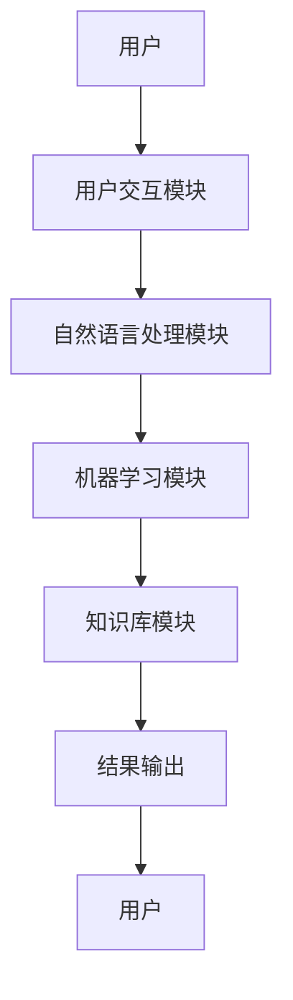
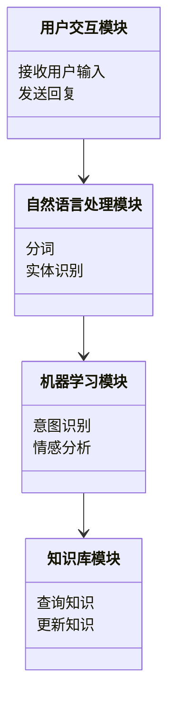
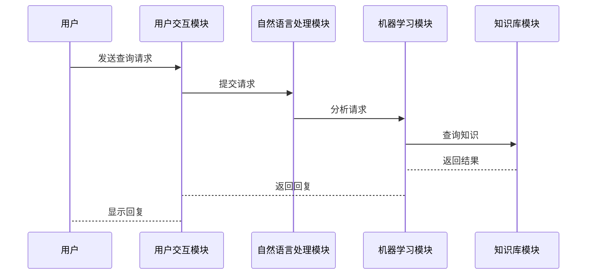

                 


# 利用智能助手提升客户忠诚度的策略

> 关键词：智能助手, 客户忠诚度, 自然语言处理, 机器学习, 客户关系管理

> 摘要：智能助手通过自然语言处理和机器学习技术，能够实时响应客户需求，提供个性化服务，从而有效提升客户忠诚度。本文从技术原理、系统架构、项目实战等多个角度，深入探讨如何利用智能助手提升客户忠诚度。

---

# 第一部分: 利用智能助手提升客户忠诚度的背景与基础

## 第1章: 智能助手与客户忠诚度概述

### 1.1 智能助手的基本概念

#### 1.1.1 智能助手的定义与分类
智能助手是一种基于人工智能技术的工具，能够通过自然语言处理（NLP）技术与用户进行交互，提供信息查询、任务执行、问题解答等服务。常见的智能助手包括Siri、Alexa、Google Assistant等。

- **定义**: 智能助手是一种能够理解用户意图并通过执行任务或提供信息来满足用户需求的智能系统。
- **分类**: 根据应用场景的不同，智能助手可以分为通用智能助手（如Siri）和垂直领域智能助手（如医疗领域的智能助手）。

#### 1.1.2 智能助手的核心功能与特点
智能助手的核心功能包括：
- **自然语言理解**: 理解用户的输入，识别意图。
- **任务执行**: 根据用户的指令执行任务（如设置提醒、查询信息）。
- **学习能力**: 通过机器学习不断优化交互体验。

智能助手的特点包括：
- **实时性**: 能够快速响应用户需求。
- **个性化**: 根据用户行为和偏好提供个性化服务。
- **可扩展性**: 可以通过模块化设计扩展功能。

#### 1.1.3 智能助手在客户关系管理中的作用
智能助手在客户关系管理中扮演着重要角色，能够通过以下方式提升客户满意度和忠诚度：
- **24/7 支持**: 提供全天候客户服务，解决用户问题。
- **个性化服务**: 根据用户行为和偏好提供定制化服务。
- **高效响应**: 快速解决问题，提升用户体验。

### 1.2 客户忠诚度的定义与重要性

#### 1.2.1 客户忠诚度的定义
客户忠诚度是指客户对某一品牌或产品长期支持和重复购买的程度。客户忠诚度高的客户通常会优先选择某一品牌，并愿意为该品牌支付溢价。

#### 1.2.2 客户忠诚度对企业的影响
- **提高收入**: 忠诚客户通常会购买更多的产品或服务。
- **降低营销成本**: 忠诚客户更有可能通过口碑推荐吸引新客户。
- **增强品牌竞争力**: 忠诚客户是品牌忠诚的基石，能够帮助企业抵御竞争压力。

#### 1.2.3 提升客户忠诚度的策略与方法
- **提供高质量的产品和服务**: 产品质量是客户忠诚度的基础。
- **建立客户关系**: 通过个性化服务和客户互动建立情感联系。
- **持续改进**: 根据客户反馈不断优化产品和服务。

### 1.3 智能助手与客户忠诚度的结合

#### 1.3.1 智能助手在客户关系管理中的应用
智能助手可以通过以下方式在客户关系管理中发挥作用：
- **实时客服**: 提供24/7的客户支持，解决用户问题。
- **个性化推荐**: 根据用户行为和偏好推荐产品或服务。
- **客户反馈**: 收集客户反馈，优化产品和服务。

#### 1.3.2 提升客户忠诚度的核心要素
- **用户体验**: 提供流畅、个性化的交互体验。
- **问题解决能力**: 快速准确地解决问题。
- **情感连接**: 通过情感化交互增强客户与品牌的情感联系。

#### 1.3.3 智能助手如何助力客户忠诚度提升
智能助手通过以下方式助力客户忠诚度提升：
- **高效解决问题**: 快速响应客户需求，提升客户满意度。
- **个性化服务**: 提供定制化服务，增强客户粘性。
- **持续优化**: 通过数据分析不断优化服务流程。

---

## 第2章: 智能助手的核心技术与实现原理

### 2.1 自然语言处理（NLP）技术

#### 2.1.1 NLP的基本概念与应用
自然语言处理（NLP）是人工智能的核心技术之一，旨在使计算机能够理解、处理和生成人类语言。NLP在智能助手中的应用包括：
- **意图识别**: 理解用户的意图。
- **实体识别**: 从文本中提取关键信息（如时间、地点、人物）。
- **对话生成**: 生成自然流畅的对话回复。

#### 2.1.2 常见的NLP算法与模型
- **词袋模型（Bag-of-Words）**: 将文本表示为词袋，忽略词语顺序。
- **TF-IDF（词频-逆文档频率）**: 用于衡量词语在文本中的重要性。
- **循环神经网络（RNN）**: 用于序列数据的处理。
- **Transformer模型**: 基于自注意力机制的模型，目前广泛应用于NLP任务。

#### 2.1.3 NLP在智能助手中的具体实现
- **分词**: 将输入文本分割成词语或短语。
- **意图识别**: 通过分类算法识别用户的意图。
- **对话生成**: 使用生成模型（如GPT）生成回复。

### 2.2 机器学习与深度学习

#### 2.2.1 机器学习的基本原理
机器学习是一种人工智能技术，通过数据训练模型，使其能够从数据中学习规律并进行预测或分类。机器学习的核心步骤包括：
1. 数据收集与预处理。
2. 模型训练。
3. 模型评估与优化。

#### 2.2.2 深度学习的核心算法
深度学习是机器学习的一种，通过多层神经网络模型进行特征提取和学习。常用的深度学习算法包括：
- **卷积神经网络（CNN）**: 用于图像识别任务。
- **循环神经网络（RNN）**: 用于序列数据的处理。
- **生成对抗网络（GAN）**: 用于生成式任务。

#### 2.2.3 机器学习在智能助手中的应用
- **用户行为分析**: 通过机器学习模型分析用户行为，预测用户需求。
- **情感分析**: 通过情感分析模型判断用户情感倾向。
- **推荐系统**: 使用推荐算法为用户推荐相关内容。

### 2.3 智能助手的算法实现

#### 2.3.1 算法选择与优化
在智能助手中的算法选择需要考虑以下因素：
- **任务类型**: 不同任务需要不同的算法（如分类、生成）。
- **数据规模**: 数据量大的任务需要选择高效的算法。
- **计算资源**: 考虑计算资源限制选择合适的算法。

#### 2.3.2 智能助手的训练与调优
- **数据预处理**: 清洗数据、特征提取。
- **模型训练**: 使用训练数据训练模型。
- **模型调优**: 通过交叉验证优化模型参数。

#### 2.3.3 算法的数学模型与公式
以下是一个简单的机器学习模型（线性回归）的数学公式：

$$ y = \beta_0 + \beta_1 x + \epsilon $$

其中：
- \( y \) 是目标变量。
- \( \beta_0 \) 是截距。
- \( \beta_1 \) 是回归系数。
- \( x \) 是自变量。
- \( \epsilon \) 是误差项。

---

## 第3章: 智能助手的系统架构与设计

### 3.1 系统架构设计

#### 3.1.1 系统模块划分
智能助手系统的模块划分通常包括以下部分：
- **自然语言处理模块**: 负责理解和生成语言。
- **机器学习模块**: 负责数据分析和预测。
- **用户交互模块**: 负责与用户的交互。
- **知识库模块**: 负责存储和管理知识。

#### 3.1.2 系统架构图（Mermaid）


#### 3.1.3 系统功能设计（领域模型）


### 3.2 系统接口与交互设计

#### 3.2.1 系统接口设计
智能助手系统通常需要以下接口：
- **用户输入接口**: 接收用户的输入（如文本或语音）。
- **输出接口**: 发送回复给用户。
- **知识库接口**: 与知识库进行交互。

#### 3.2.2 系统交互流程图（Mermaid）


### 3.3 系统优化与扩展

#### 3.3.1 系统性能优化
- **缓存机制**: 通过缓存减少重复查询。
- **并行计算**: 使用多线程或分布式计算提高效率。
- **模型优化**: 使用更高效的算法或优化现有算法。

#### 3.3.2 系统扩展性设计
- **模块化设计**: 各模块相对独立，便于扩展。
- **接口标准化**: 通过标准化接口方便与其他系统的集成。
- **弹性扩展**: 根据负载自动调整资源分配。

#### 3.3.3 系统安全性考虑
- **数据加密**: 对敏感数据进行加密处理。
- **访问控制**: 通过权限管理控制系统的访问。
- **异常处理**: 设计完善的异常处理机制。

---

## 第4章: 智能助手的项目实战

### 4.1 环境搭建与开发工具

#### 4.1.1 开发环境搭建
- **操作系统**: Linux、Windows或macOS。
- **编程语言**: Python、Java等。
- **开发工具**: PyCharm、IntelliJ IDEA等。

#### 4.1.2 第三方库安装
- **自然语言处理库**: NLTK、spaCy。
- **机器学习库**: Scikit-learn、TensorFlow。
- **可视化工具**: Matplotlib、Seaborn。

#### 4.1.3 开发环境配置
- **安装Python**: 下载并安装Python解释器。
- **安装依赖库**: 使用pip安装所需的第三方库。
- **配置开发环境**: 设置路径和环境变量。

### 4.2 系统核心实现

#### 4.2.1 自然语言处理模块实现
```python
import nltk
from nltk.tokenize import word_tokenize

def tokenize(text):
    tokens = word_tokenize(text)
    return tokens
```

#### 4.2.2 机器学习模块实现
```python
from sklearn.feature_extraction.text import TfidfVectorizer
from sklearn.naive_bayes import MultinomialNB

vectorizer = TfidfVectorizer()
model = MultinomialNB()
```

#### 4.2.3 知识库模块实现
```python
import sqlite3

conn = sqlite3.connect('knowledge.db')
cursor = conn.cursor()
cursor.execute('''
    CREATE TABLE knowledge_base (
        id INTEGER PRIMARY KEY AUTOINCREMENT,
        question TEXT,
        answer TEXT
    )
''')
conn.commit()
```

### 4.3 实际案例分析

#### 4.3.1 案例背景介绍
假设我们正在开发一个智能客服系统，用于为用户提供在线支持。

#### 4.3.2 系统功能实现
- **用户输入**: 用户输入问题。
- **分词**: 对输入文本进行分词处理。
- **意图识别**: 识别用户的意图。
- **知识查询**: 根据意图查询知识库。
- **生成回复**: 根据查询结果生成回复。

#### 4.3.3 代码实现与分析
```python
import nltk
from sklearn.feature_extraction.text import TfidfVectorizer
from sklearn.naive_bayes import MultinomialNB

# 分词
def tokenize(text):
    tokens = word_tokenize(text)
    return tokens

# 特征提取
vectorizer = TfidfVectorizer()
X = vectorizer.fit_transform(corpus)

# 模型训练
model = MultinomialNB()
model.fit(X, labels)

# 预测
new_text = "如何重置密码"
new_X = vectorizer.transform([new_text])
predicted_label = model.predict(new_X)
```

### 4.4 项目小结

#### 4.4.1 项目总结
通过本项目，我们了解了智能助手的核心技术与实现方法，掌握了自然语言处理和机器学习的基本原理。

#### 4.4.2 项目经验
- **技术选型**: 选择合适的算法和技术栈。
- **数据处理**: 数据预处理是关键。
- **系统优化**: 通过优化算法和架构提升性能。

#### 4.4.3 项目注意事项
- **数据质量**: 数据质量直接影响模型性能。
- **模型调优**: 需要不断调优模型参数。
- **用户体验**: 用户体验是系统成功的关键。

---

## 第5章: 提升客户忠诚度的最佳实践与未来展望

### 5.1 提升客户忠诚度的最佳实践

#### 5.1.1 客户为中心的设计
- **个性化服务**: 根据客户需求提供定制化服务。
- **情感化交互**: 通过情感化设计增强客户情感连接。
- **持续优化**: 根据客户反馈不断优化服务。

#### 5.1.2 智能助手的持续优化
- **数据驱动优化**: 通过数据分析优化服务流程。
- **技术驱动创新**: 持续引入新技术提升系统能力。
- **客户驱动改进**: 根据客户反馈改进系统功能。

### 5.2 未来展望

#### 5.2.1 技术发展趋势
- **多模态交互**: 结合视觉、听觉等多种模态进行交互。
- **增强学习**: 引入增强学习技术提升智能助手的自主决策能力。
- **边缘计算**: 将智能助手部署在边缘设备上，提升响应速度。

#### 5.2.2 业务应用前景
- **垂直领域深耕**: 在医疗、金融等垂直领域深度应用。
- **全球化服务**: 提供多语言、多文化的支持。
- **智能化升级**: 通过智能助手实现业务流程的智能化升级。

### 5.3 总结与展望

#### 5.3.1 总结
智能助手通过提供高效、个性化的服务，能够有效提升客户忠诚度。本文从技术、系统、实践等多个角度探讨了智能助手的应用策略。

#### 5.3.2 展望
未来，随着人工智能技术的不断发展，智能助手将在更多领域发挥重要作用，成为客户忠诚度提升的重要工具。

---

# 结语

通过本文的探讨，我们了解了智能助手在提升客户忠诚度中的重要作用和技术实现方法。智能助手不仅能够提高客户满意度，还能够为企业创造更大的价值。未来，随着技术的不断进步，智能助手将在更多领域发挥更大的作用，成为客户忠诚度管理的核心工具。

---

**作者：AI天才研究院/AI Genius Institute & 禅与计算机程序设计艺术 /Zen And The Art of Computer Programming**

