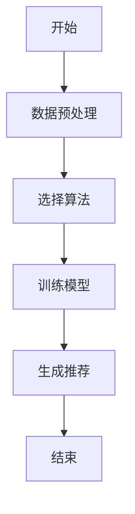
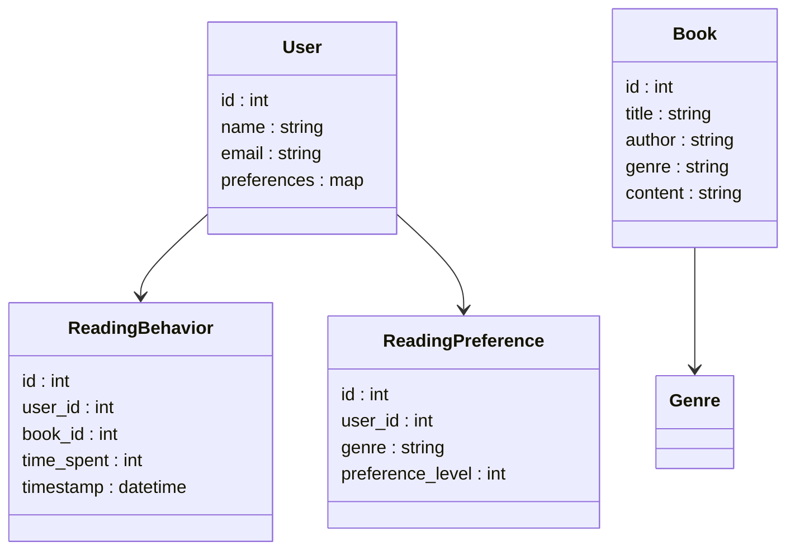
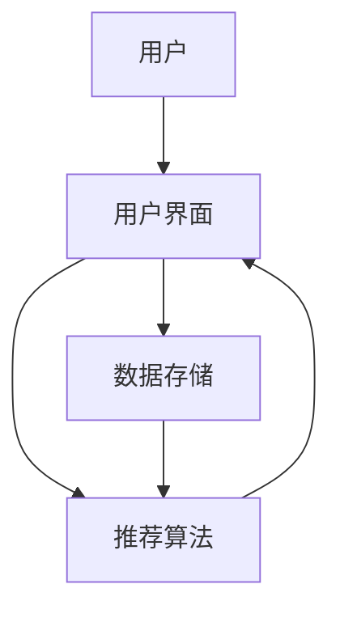
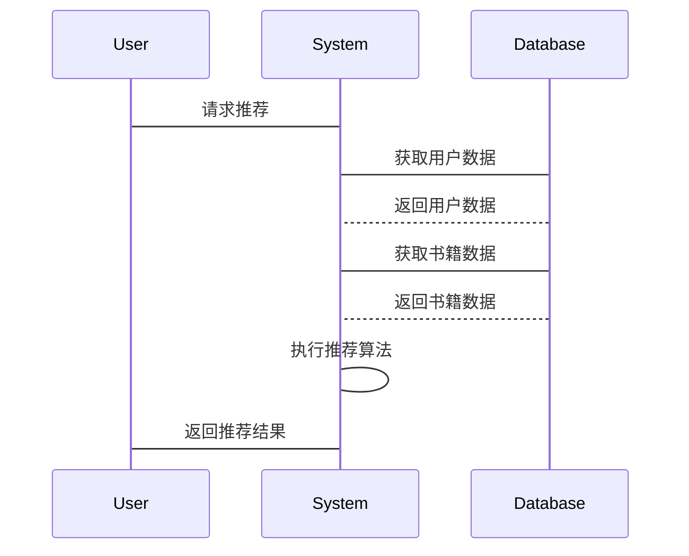

                 


# 智能书架：AI Agent的阅读兴趣分析

## 关键词：AI Agent，阅读兴趣分析，智能书架，推荐系统，自然语言处理

## 摘要：本文深入探讨AI Agent在阅读兴趣分析中的应用，通过介绍智能书架的概念、核心算法、系统架构和实际案例，展示如何利用AI技术提升阅读体验。

---

## 第一部分: 智能书架与AI Agent背景介绍

## 第1章: AI Agent与阅读兴趣分析概述

### 1.1 AI Agent的基本概念

#### 1.1.1 什么是AI Agent

人工智能代理（AI Agent）是指能够感知环境并采取行动以实现目标的智能实体。AI Agent可以是软件程序、机器人或其他智能系统，通过传感器获取信息，并通过执行器与环境互动。AI Agent的核心能力包括自然语言处理、机器学习、推理和决策制定。

#### 1.1.2 AI Agent的核心特征

- **自主性**：AI Agent能够在没有外部干预的情况下自主运行。
- **反应性**：能够实时感知环境变化并做出反应。
- **目标导向**：基于预设目标采取行动。
- **学习能力**：通过数据和经验不断优化自身的性能。

#### 1.1.3 AI Agent的应用场景

- **个性化推荐**：根据用户的偏好推荐相关内容。
- **自动化决策**：在金融、医疗等领域做出快速决策。
- **智能助手**：如Siri、Alexa等，帮助用户完成日常任务。

### 1.2 阅读兴趣分析的定义与意义

#### 1.2.1 阅读兴趣分析的定义

阅读兴趣分析是指通过分析用户的阅读行为、偏好和反馈，推断用户的兴趣领域和内容偏好的过程。这包括用户读了哪些书、花了多少时间阅读、对哪些内容感兴趣等。

#### 1.2.2 阅读兴趣分析的重要性

- **提升用户体验**：通过个性化推荐，用户可以更快地找到感兴趣的内容。
- **优化内容分发**：出版商和平台可以根据用户兴趣精准分发内容。
- **数据驱动的决策**：通过分析阅读数据，可以洞察市场趋势和用户需求。

#### 1.2.3 阅读兴趣分析的应用领域

- **在线书店**：推荐书籍给用户。
- **新闻平台**：个性化新闻推送。
- **教育平台**：根据学习者兴趣推荐学习资料。

### 1.3 智能书架的概念与目标

#### 1.3.1 智能书架的定义

智能书架是一种结合AI技术的书架系统，能够根据用户的阅读行为和偏好，智能推荐书籍、文章或其他相关内容。

#### 1.3.2 智能书架的核心目标

- **个性化推荐**：基于用户阅读历史和偏好，推荐相关书籍。
- **动态更新**：根据用户的最新阅读行为调整推荐内容。
- **多设备支持**：在手机、平板、电脑等多种设备上提供一致的阅读体验。

#### 1.3.3 智能书架与传统书架的区别

- **智能化**：智能书架利用AI技术进行内容推荐，而传统书架缺乏这种智能性。
- **互动性**：智能书架能够与用户互动，了解用户的偏好，而传统书架只是被动存储书籍。
- **数据驱动**：智能书架通过分析用户数据优化推荐，传统书架不具备这种能力。

## 第2章: 阅读兴趣分析的背景与挑战

### 2.1 阅读兴趣分析的背景

#### 2.1.1 数字阅读的兴起

随着电子书的普及，越来越多的人开始通过数字设备阅读，这为阅读兴趣分析提供了丰富的数据。

#### 2.1.2 用户行为数据的丰富性

现代数字阅读平台能够收集大量用户行为数据，如阅读时间、阅读速度、停留时间、点击行为等，这些数据为阅读兴趣分析提供了基础。

#### 2.1.3 AI技术在阅读分析中的应用

AI技术的进步使得处理和分析大量阅读数据成为可能，自然语言处理和机器学习算法的应用使得阅读兴趣分析更加精准。

### 2.2 阅读兴趣分析的主要挑战

#### 2.2.1 数据隐私问题

用户阅读数据的隐私保护是一个重要挑战，如何在保护用户隐私的前提下进行分析是一个难题。

#### 2.2.2 阅读兴趣的动态变化

用户的阅读兴趣可能会随着时间推移而变化，如何捕捉这种变化并及时更新推荐内容是一个挑战。

#### 2.2.3 多样化的阅读内容类型

阅读内容的类型多样，包括小说、技术文章、新闻等，如何针对不同内容类型进行推荐也是一个挑战。

## 第3章: AI Agent在阅读兴趣分析中的作用

### 3.1 AI Agent的核心能力

#### 3.1.1 自然语言处理能力

AI Agent能够理解和生成自然语言，这对于分析文本内容和用户反馈至关重要。

#### 3.1.2 用户行为分析能力

AI Agent能够分析用户的阅读行为，如点击、停留时间等，从而推断用户的兴趣。

#### 3.1.3 知识图谱构建能力

通过构建知识图谱，AI Agent可以更好地理解内容之间的关系，从而做出更精准的推荐。

### 3.2 AI Agent在阅读兴趣分析中的具体应用

#### 3.2.1 个性化推荐

基于用户的阅读历史和偏好，AI Agent可以推荐相关书籍或文章。

#### 3.2.2 阅读习惯分析

通过分析用户的阅读习惯，AI Agent可以帮助用户发现自己的阅读偏好，比如喜欢阅读小说还是技术文章。

#### 3.2.3 内容质量评估

AI Agent可以对书籍或文章进行质量评估，帮助用户筛选出有价值的内容。

### 3.3 AI Agent与智能书架的结合

#### 3.3.1 智能书架的系统架构

智能书架通常由用户界面、数据存储、推荐算法和AI Agent组成，AI Agent负责分析用户数据并生成推荐内容。

#### 3.3.2 AI Agent在系统中的角色

AI Agent在智能书架中扮演着关键角色，负责数据处理、推荐生成和用户互动。

#### 3.3.3 系统的核心功能模块

- **数据收集模块**：收集用户的阅读行为和偏好。
- **数据分析模块**：分析用户数据，生成阅读兴趣模型。
- **推荐生成模块**：基于分析结果生成推荐内容。
- **用户互动模块**：与用户互动，获取反馈并优化推荐。

## 第二部分: 阅读兴趣分析的核心概念与联系

## 第4章: 阅读兴趣分析的核心概念

### 4.1 阅读兴趣分析的核心概念

阅读兴趣分析的核心概念包括用户行为、阅读偏好和内容特征。用户行为数据包括阅读时间、停留时间等，阅读偏好包括用户喜欢的书籍类型和主题，内容特征包括书籍的主题、关键词等。

### 4.2 阅读兴趣分析的属性特征对比表格

| 属性 | 描述 |
|------|------|
| 用户行为数据 | 包括阅读时间、阅读速度、停留时间等 |
| 阅读偏好 | 用户喜欢的书籍类型和主题 |
| 内容特征 | 包括书籍的主题、关键词等 |

### 4.3 阅读兴趣分析的ER实体关系图

```mermaid
erDiagram
    user {
        id : int
        name : string
        email : string
    }
    book {
        id : int
        title : string
        author : string
        genre : string
    }
    reading_behavior {
        id : int
        user_id : int
        book_id : int
        time_spent : int
        timestamp : datetime
    }
    reading_preference {
        id : int
        user_id : int
        genre : string
        preference_level : int
    }
    user -|> reading_behavior
    user -|> reading_preference
    book -|> genre
```

## 第5章: 阅读兴趣分析的算法原理

### 5.1 协同过滤算法

协同过滤是一种基于用户相似性推荐算法。协同过滤分为基于用户的协同过滤和基于物品的协同过滤。

#### 5.1.1 基于用户的协同过滤

基于用户的协同过滤算法通过寻找与目标用户相似的其他用户，然后基于这些用户的偏好推荐书籍。

#### 5.1.2 基于物品的协同过滤

基于物品的协同过滤算法通过分析书籍之间的相似性，然后推荐与目标用户已读书籍相似的其他书籍。

### 5.2 基于内容的推荐算法

基于内容的推荐算法通过分析书籍的内容特征，推荐与目标用户已读书籍内容相似的其他书籍。

### 5.3 深度学习算法

深度学习算法通过构建神经网络模型，学习用户阅读行为和书籍内容的高维特征，然后进行推荐。

### 5.4 阅读兴趣分析的算法流程图



### 5.5 阅读兴趣分析的数学模型和公式

#### 协同过滤的相似度计算公式

$$ \text{相似度}(u, v) = \frac{\sum_{i} (r_{u,i} - \bar{r}_u)(r_{v,i} - \bar{r}_v)}{\sqrt{\sum_{i} (r_{u,i} - \bar{r}_u)^2} \sqrt{\sum_{i} (r_{v,i} - \bar{r}_v)^2}}} $$

其中，$r_{u,i}$表示用户u对物品i的评分，$\bar{r}_u$表示用户u的平均评分。

#### 基于内容的推荐的相似度计算公式

$$ \text{相似度}(i, j) = \frac{\sum_{k} w_k \cdot (t_{i,k} \cap t_{j,k})}{\sqrt{\sum_{k} w_k^2 \cdot t_{i,k}} \sqrt{\sum_{k} w_k^2 \cdot t_{j,k}}} $$

其中，$t_{i,k}$表示物品i在主题k上的权重，$w_k$表示主题k的权重。

### 5.6 阅读兴趣分析的Python代码实现

#### 协同过滤算法的Python实现

```python
import pandas as pd
from sklearn.metrics.pairwise import cosine_similarity

# 数据预处理
df = pd.read_csv('data.csv')
X = df.drop('user_id', axis=1)
similarity = cosine_similarity(X)

# 推荐书籍
def recommend(user_id, similarity_matrix, top_n=5):
    idx = df[df['user_id'] == user_id].index[0]
    similar_users = [i for i in range(len(similarity_matrix[idx])) if i != idx]
    similar_users.sort(key=lambda x: similarity_matrix[idx][x], reverse=True)
    recommended_books = []
    for user in similar_users[:top_n]:
        recommended_books.append(df[df['user_id'] == user].iloc[0]['book_id'])
    return recommended_books

print(recommend(1, similarity))
```

#### 基于内容的推荐算法的Python实现

```python
from sklearn.feature_extraction.text import TfidfVectorizer
from sklearn.metrics.pairwise import cosine_similarity

# 数据预处理
texts = ['书籍1内容', '书籍2内容', '书籍3内容']
vectorizer = TfidfVectorizer()
X = vectorizer.fit_transform(texts)

# 计算相似度
similarity_matrix = cosine_similarity(X)

# 推荐书籍
def recommend_content(user_content, similarity_matrix, texts, top_n=5):
    idx = texts.index(user_content)
    similar_indices = [i for i in range(len(similarity_matrix[idx])) if i != idx]
    similar_indices.sort(key=lambda x: similarity_matrix[idx][x], reverse=True)
    recommended_texts = [texts[i] for i in similar_indices[:top_n]]
    return recommended_texts

print(recommend_content('书籍1内容', similarity_matrix, texts))
```

## 第6章: 阅读兴趣分析的系统分析与架构设计

### 6.1 系统功能设计

智能书架的系统功能包括：

- **用户注册与登录**：用户可以通过邮箱或社交媒体账号注册和登录。
- **阅读记录管理**：用户可以查看自己的阅读记录和偏好设置。
- **个性化推荐**：系统根据用户的阅读历史和偏好推荐书籍。
- **反馈机制**：用户可以对推荐的书籍进行评分或反馈，帮助系统优化推荐算法。

### 6.2 系统架构设计

#### 6.2.1 领域模型类图



#### 6.2.2 系统架构图



#### 6.2.3 系统接口设计

智能书架的主要接口包括：

- **用户接口**：用户可以通过网页或移动应用访问系统。
- **数据接口**：系统需要与第三方数据源（如出版社或书店）接口，获取书籍信息。
- **推荐接口**：系统需要与推荐算法接口，获取推荐结果。

#### 6.2.4 系统交互流程图



## 第7章: 阅读兴趣分析的项目实战

### 7.1 环境安装

要运行智能书架系统，需要安装以下环境：

- **Python**：3.6及以上版本
- **Jupyter Notebook**：用于数据分析和算法实现
- **Pandas**：数据处理库
- **Scikit-learn**：机器学习库
- **Mermaid**：用于绘制图表

### 7.2 核心实现源代码

#### 数据预处理代码

```python
import pandas as pd

# 读取数据
df = pd.read_csv('data.csv')

# 删除缺失值
df.dropna(inplace=True)

# 数据标准化
from sklearn.preprocessing import StandardScaler
scaler = StandardScaler()
df[['age', 'rating']] = scaler.fit_transform(df[['age', 'rating']])

print(df.head())
```

#### 推荐算法实现代码

```python
from sklearn.neighbors import NearestNeighbors

# 训练模型
model = NearestNeighbors(n_neighbors=5, algorithm='brute')
model.fit(X)

# 查找最近的邻居
distances, indices = model.kneighbors([X[0]], n_neighbors=5)

# 输出推荐结果
for i in indices[0]:
    print(df.iloc[i]['book_title'])
```

### 7.3 实际案例分析

#### 案例1: 用户阅读历史分析

假设用户A最近阅读了《1984》和《动物庄园》，系统通过分析用户的阅读历史和偏好，推荐用户阅读《美丽新世界》和《奥威尔精选集》。

#### 案例2: 阅读偏好优化

用户B喜欢阅读科幻小说，系统通过分析用户的阅读行为和偏好，调整推荐算法，更加精准地推荐科幻小说。

### 7.4 项目小结

通过实际案例分析，我们可以看到智能书架在阅读兴趣分析中的巨大潜力。通过不断优化推荐算法和提升系统架构，智能书架可以为用户提供更加精准和个性化的阅读体验。

## 第三部分: 阅读兴趣分析的最佳实践

## 第8章: 阅读兴趣分析的最佳实践

### 8.1 小结

智能书架通过结合AI Agent和阅读兴趣分析技术，能够为用户提供个性化的阅读体验。本文详细探讨了智能书架的核心概念、算法原理、系统架构和实际案例。

### 8.2 注意事项

- **数据隐私保护**：在收集和分析用户数据时，必须严格遵守数据隐私保护法规。
- **模型优化**：定期优化推荐算法，提升推荐的准确性和用户体验。
- **用户反馈机制**：建立有效的用户反馈机制，及时收集用户反馈并优化推荐算法。

### 8.3 拓展阅读

- **《推荐系统实战》**：深入探讨推荐系统的实现和优化。
- **《自然语言处理入门》**：学习自然语言处理的基础知识和技术。
- **《机器学习实战》**：通过实际案例学习机器学习的核心算法和应用。

## 作者信息

作者：AI天才研究院/AI Genius Institute & 禅与计算机程序设计艺术 /Zen And The Art of Computer Programming

---

以上是《智能书架：AI Agent的阅读兴趣分析》的完整目录大纲和部分章节内容，涵盖了从背景介绍到实际应用的各个方面。通过系统的分析和详细的讲解，读者可以深入了解智能书架的核心技术和实际应用。

