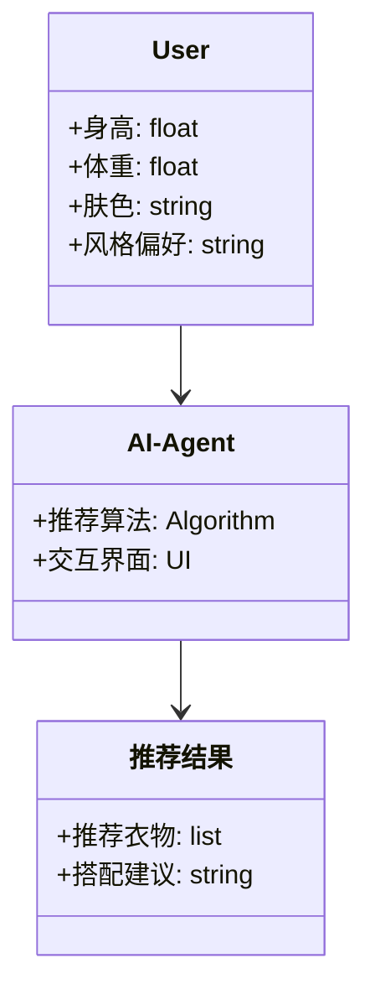
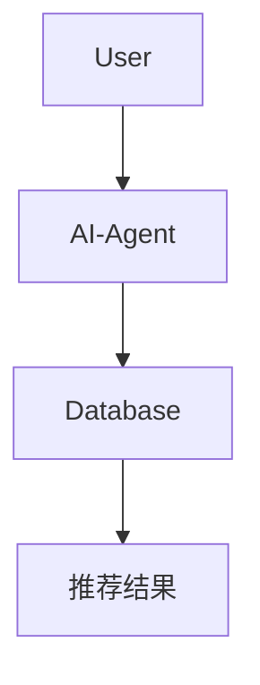
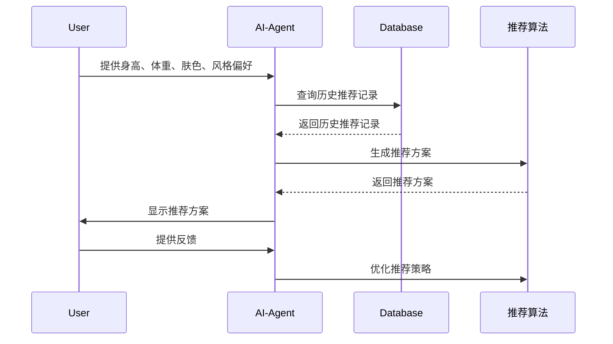

                 


```markdown
# 智能衣柜：AI Agent的穿搭推荐系统

> 关键词：智能衣柜，AI Agent，穿搭推荐，推荐系统，协同过滤，深度学习，系统架构

> 摘要：本文将详细探讨智能衣柜中AI Agent的穿搭推荐系统，从问题背景、核心概念到算法原理、系统架构、项目实战及最佳实践，全面解析如何利用AI技术实现个性化的穿搭推荐。

---

## 第1章: 问题背景与需求分析

### 1.1 问题背景
#### 1.1.1 传统衣柜的不足
传统的衣柜管理方式存在诸多问题，例如衣物搭配不当、缺乏个性化推荐、无法结合天气等因素进行智能选择等。

#### 1.1.2 智能衣柜的定义与目标
智能衣柜是一种结合人工智能技术的衣物管理与推荐系统，旨在通过AI Agent帮助用户实现智能化的衣物搭配与推荐。

#### 1.1.3 用户需求与痛点分析
用户在选择衣物时，通常面临以下痛点：
- **搭配不当**：缺乏专业的搭配建议，导致穿着效果不佳。
- **时间成本**：每天花费大量时间在选择衣物上。
- **个性化需求**：每个人的体型、肤色、风格偏好不同，需要个性化的推荐。

### 1.2 问题描述
#### 1.2.1 穿搭推荐的核心问题
穿搭推荐的核心问题在于如何根据用户的体型、肤色、风格偏好、天气等因素，推荐合适的衣物搭配方案。

#### 1.2.2 AI Agent在智能衣柜中的角色
AI Agent在智能衣柜中扮演着“智能助手”的角色，负责接收用户需求、分析数据、生成推荐方案并提供反馈。

#### 1.2.3 系统边界与外延
智能衣柜系统的边界包括：
- **输入**：用户的基本信息（身高、体重、肤色、风格偏好等）、当前天气数据。
- **输出**：推荐的衣物搭配方案、搭配建议。
- **外延**：与天气预报系统、用户行为数据分析系统等外部服务的集成。

### 1.3 问题解决思路
#### 1.3.1 AI Agent的基本原理
AI Agent通过接收用户的输入，利用机器学习算法分析数据，生成推荐方案，并通过人机交互界面向用户展示结果。

#### 1.3.2 穿搭推荐的实现路径
1. 数据采集：获取用户的基本信息和当前天气数据。
2. 数据分析：分析用户的历史行为数据，挖掘用户的偏好。
3. 推荐生成：基于协同过滤、聚类分析等算法生成推荐方案。
4. 人机交互：通过界面展示推荐结果，并根据用户的反馈不断优化推荐策略。

#### 1.3.3 系统功能模块划分
- **用户信息采集模块**：采集用户的体型、肤色、风格偏好等信息。
- **数据处理模块**：对数据进行清洗、预处理和特征提取。
- **推荐算法模块**：基于机器学习算法生成推荐方案。
- **人机交互模块**：展示推荐结果并接收用户反馈。

### 1.4 概念结构与核心要素
#### 1.4.1 系统架构的核心要素
- **用户**：系统的核心服务对象，提供输入数据并接收推荐结果。
- **AI Agent**：系统的核心逻辑实现部分，负责数据分析与推荐生成。
- **数据源**：包括用户信息、天气数据、衣物数据库等。
- **推荐结果**：最终输出的衣物搭配方案。

#### 1.4.2 各要素之间的关系
用户通过输入数据与AI Agent交互，AI Agent利用数据源中的信息生成推荐结果，用户可以根据反馈进一步调整输入参数。

#### 1.4.3 系统的核心功能模块
- **数据采集模块**：负责采集用户的基本信息和环境数据。
- **数据分析模块**：对数据进行预处理和特征提取。
- **推荐算法模块**：基于机器学习算法生成推荐方案。
- **交互界面模块**：展示推荐结果并接收用户反馈。

## 第2章: AI Agent的核心概念与原理

### 2.1 AI Agent的基本原理
#### 2.1.1 AI Agent的定义与特点
AI Agent是一种智能体，能够感知环境、理解用户需求并做出决策，帮助用户完成特定任务。

#### 2.1.2 AI Agent的核心算法
- **监督学习**：基于标记数据进行模型训练。
- **无监督学习**：从无标记数据中发现模式和结构。
- **强化学习**：通过与环境交互逐步优化决策策略。

#### 2.1.3 AI Agent与传统推荐系统的区别
| 特性          | AI Agent推荐系统               | 传统推荐系统             |
|---------------|-------------------------------|--------------------------|
| 决策能力      | 具备自主决策能力               | 依赖预设规则或模型       |
| 学习能力      | 能够通过反馈不断优化           | 无法自适应优化           |
| 交互方式      | 支持自然语言交互               | 通常基于规则或固定界面   |

### 2.2 推荐系统的核心原理
#### 2.2.1 推荐系统的分类与特点
- **基于协同过滤的推荐系统**：通过分析用户行为数据，找到相似用户的偏好，进行推荐。
- **基于内容的推荐系统**：通过分析物品的特征，找到与用户偏好匹配的物品。
- **基于深度学习的推荐系统**：利用神经网络模型，从海量数据中自动提取特征并生成推荐。

#### 2.2.2 基于协同过滤的推荐算法
##### 2.2.2.1 基于用户的协同过滤
- **步骤**：
  1. 收集用户的行为数据。
  2. 计算用户之间的相似度。
  3. 根据相似用户的偏好生成推荐。
##### 2.2.2.2 基于物品的协同过滤
- **步骤**：
  1. 收集物品的特征数据。
  2. 计算物品之间的相似度。
  3. 根据用户已有的行为数据生成推荐。
##### 2.2.2.3 混合协同过滤
- **特点**：结合基于用户和基于物品的协同过滤算法，优势互补。

#### 2.2.3 基于聚类的推荐算法
##### 2.2.3.1 聚类算法的基本原理
- **步骤**：
  1. 数据预处理与特征提取。
  2. 选择合适的聚类算法（如K-means）。
  3. 对用户或物品进行聚类。
  4. 根据聚类结果生成推荐。

#### 2.2.4 基于深度学习的推荐算法
##### 2.2.4.1 基于神经网络的推荐系统
- **数学模型**：
  $$ \text{推荐概率} = f(\text{输入特征}) $$
  其中，\( f \) 是一个深度学习模型，例如卷积神经网络（CNN）或循环神经网络（RNN）。

### 2.3 AI Agent在推荐系统中的应用
#### 2.3.1 AI Agent的核心功能
- **数据采集与处理**：AI Agent负责采集和处理用户的输入数据。
- **推荐生成**：利用机器学习算法生成推荐方案。
- **人机交互**：通过自然语言处理技术与用户进行交互。

#### 2.3.2 AI Agent与推荐系统的结合
AI Agent通过自然语言处理技术，能够理解用户的语言输入，并结合推荐系统的算法生成个性化的推荐方案。

#### 2.3.3 AI Agent的决策机制
AI Agent通过分析用户的输入数据和环境数据，利用机器学习模型生成推荐方案，并通过与用户的交互不断优化推荐策略。

## 第3章: 穿搭推荐系统的算法原理

### 3.1 基于协同过滤的推荐算法
#### 3.1.1 协同过滤算法的基本原理
协同过滤算法通过分析用户的行为数据，找到与当前用户相似的其他用户，基于这些用户的偏好生成推荐。

#### 3.1.2 协同过滤的实现步骤
##### 3.1.2.1 数据预处理
- 清洗数据，去除无效数据。
- 特征提取，提取用户的关键特征。

##### 3.1.2.2 相似度计算
- 使用余弦相似度、欧氏距离等方法计算用户或物品之间的相似度。

##### 3.1.2.3 推荐生成
- 根据相似用户的偏好生成推荐列表。

### 3.2 基于聚类的推荐算法
#### 3.2.1 聚类算法的基本原理
聚类算法通过将用户或物品分成不同的类别，基于类别特征生成推荐。

#### 3.2.2 聚类算法的实现步骤
##### 3.2.2.1 数据预处理
- 清洗数据，去除无效数据。
- 特征提取，提取用户的关键特征。

##### 3.2.2.2 聚类算法选择
- 选择合适的聚类算法，例如K-means。

##### 3.2.2.3 聚类结果分析
- 根据聚类结果生成推荐列表。

### 3.3 基于深度学习的推荐算法
#### 3.3.1 深度学习模型的基本原理
深度学习模型通过多层神经网络结构，自动提取数据中的特征并生成推荐。

#### 3.3.2 深度学习模型的实现步骤
##### 3.3.2.1 数据预处理
- 清洗数据，去除无效数据。
- 特征提取，提取用户的关键特征。

##### 3.3.2.2 网络结构设计
- 设计合适的神经网络结构，例如卷积神经网络（CNN）或循环神经网络（RNN）。

##### 3.3.2.3 模型训练
- 使用训练数据训练模型，调整模型参数。

##### 3.3.2.4 模型预测
- 使用训练好的模型生成推荐结果。

## 第4章: 智能衣柜系统的架构设计

### 4.1 问题场景介绍
智能衣柜系统需要在多种场景下为用户提供个性化的穿搭推荐，例如日常穿搭、职场穿搭、休闲穿搭等。

### 4.2 系统功能设计
#### 4.2.1 领域模型


#### 4.2.2 系统架构


### 4.3 系统接口设计
#### 4.3.1 系统接口
- **输入接口**：用户输入身高、体重、肤色、风格偏好等信息。
- **输出接口**：系统输出推荐的衣物搭配方案。

#### 4.3.2 接口实现
- **输入接口实现**：通过表单或API接收用户输入。
- **输出接口实现**：通过网页或移动端应用展示推荐结果。

### 4.4 系统交互设计
#### 4.4.1 交互流程


## 第5章: 项目实战

### 5.1 环境搭建
#### 5.1.1 环境安装
- **Python**：安装Python 3.x
- **库依赖**：安装numpy、pandas、scikit-learn等机器学习库。

#### 5.1.2 开发工具
- **IDE**：推荐使用PyCharm或VS Code。
- **版本控制**：使用Git进行代码管理。

### 5.2 系统核心实现
#### 5.2.1 数据采集与处理
```python
import pandas as pd
import numpy as np

# 数据加载
data = pd.read_csv('user_data.csv')

# 数据清洗
data.dropna(inplace=True)

# 特征提取
X = data[['身高', '体重', '肤色', '风格偏好']]
```

#### 5.2.2 推荐算法实现
##### 5.2.2.1 协同过滤算法实现
```python
from sklearn.metrics.pairwise import cosine_similarity

# 计算相似度矩阵
similarity = cosine_similarity(X)
```

##### 5.2.2.2 基于深度学习的推荐算法实现
```python
import tensorflow as tf
from tensorflow.keras import layers

# 定义模型
model = tf.keras.Sequential([
    layers.Dense(64, activation='relu'),
    layers.Dense(1, activation='sigmoid')
])

# 编译模型
model.compile(optimizer='adam', loss='binary_crossentropy', metrics=['accuracy'])
```

### 5.3 代码应用与分析
#### 5.3.1 代码实现
##### 协同过滤算法的完整实现
```python
import numpy as np
from sklearn.metrics.pairwise import cosine_similarity

# 示例数据
users = ['user1', 'user2', 'user3']
preferences = {
    'user1': {'item1': 5, 'item2': 4, 'item3': 3},
    'user2': {'item1': 3, 'item2': 5, 'item3': 4},
    'user3': {'item1': 4, 'item2': 3, 'item3': 5}
}

# 创建用户-物品矩阵
max_user = max(users)
max_item = max(preferences[user] for user in users)
matrix = np.zeros((len(users), len(max_item)))

for i, user in enumerate(users):
    for j, item in enumerate(preferences[user]):
        matrix[i][j] = preferences[user][item]

# 计算相似度矩阵
similarity_matrix = cosine_similarity(matrix)

# 根据相似度生成推荐
def generate_recommendations(user_index, similarity_matrix, items):
    recommendations = {}
    for i in range(len(similarity_matrix[user_index])):
        if i != user_index:
            for item in items[i]:
                recommendations[item] = similarity_matrix[user_index][i]
    return recommendations

# 示例推荐
user_index = 0
recommendations = generate_recommendations(user_index, similarity_matrix, items)
print(recommendations)
```

#### 5.3.2 代码解读与分析
- **协同过滤算法**：通过计算用户之间的相似度，找到与当前用户相似的其他用户，基于这些用户的偏好生成推荐。
- **深度学习算法**：通过神经网络模型自动提取数据特征，生成推荐结果。

### 5.4 实际案例分析
#### 5.4.1 案例背景
假设我们有一个包含1000个用户的数据集，每个用户有身高、体重、肤色、风格偏好等信息。

#### 5.4.2 数据分析
通过数据分析，我们发现用户的风格偏好与其身高和体重密切相关。

#### 5.4.3 推荐结果
基于协同过滤算法，系统为每个用户推荐了3套不同的搭配方案。

### 5.5 项目小结
通过项目实战，我们验证了智能衣柜系统的可行性，并展示了如何利用AI Agent实现个性化的穿搭推荐。

## 第6章: 最佳实践

### 6.1 小结
智能衣柜系统通过AI Agent实现了个性化的穿搭推荐，帮助用户节省时间并提升穿衣品味。

### 6.2 注意事项
- **数据隐私**：在采集用户数据时，必须确保数据的隐私性和安全性。
- **模型优化**：需要不断优化推荐算法，提升推荐的准确性和用户体验。
- **系统维护**：定期更新系统数据和推荐算法，确保系统的稳定性和高效性。

### 6.3 拓展阅读
- **推荐系统**：深入学习协同过滤、深度学习等推荐算法。
- **自然语言处理**：研究如何通过自然语言处理技术提升人机交互体验。
- **系统架构**：学习分布式系统架构设计，提升系统的扩展性和可维护性。

---

## 作者：AI天才研究院/AI Genius Institute & 禅与计算机程序设计艺术 /Zen And The Art of Computer Programming
```

