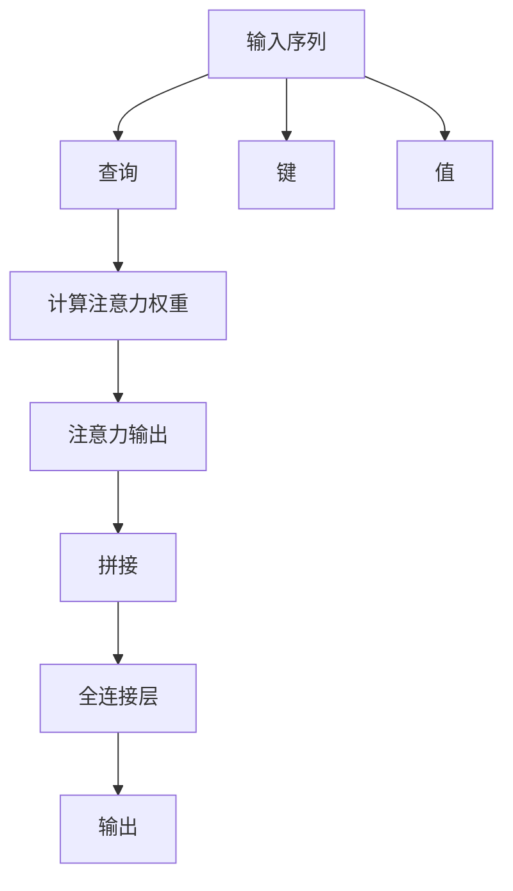
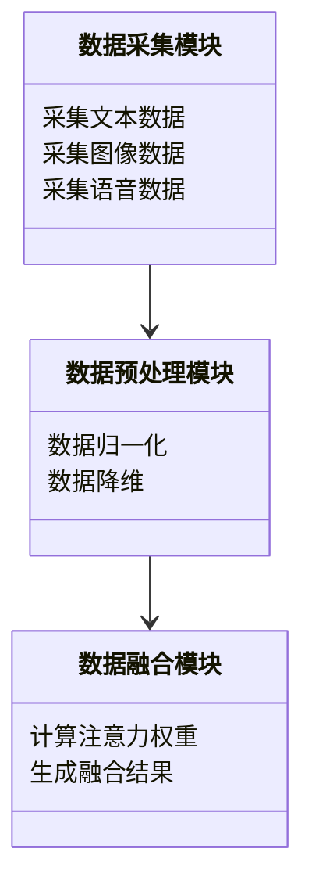
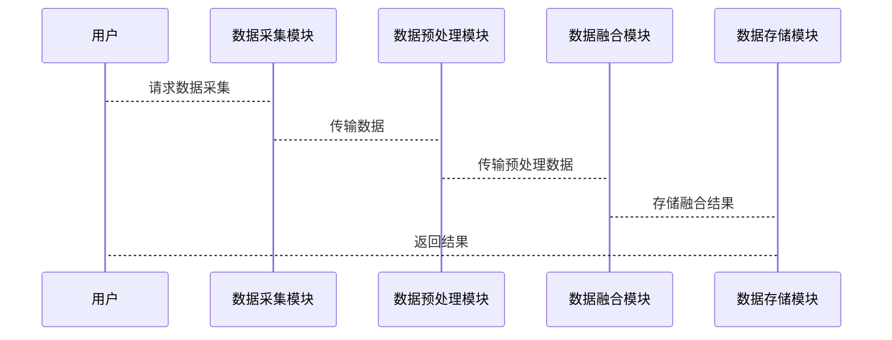

                 


# 注意力机制在AI Agent多模态融合中的应用

> 关键词：注意力机制，AI Agent，多模态数据融合，自注意力机制，多模态注意力机制

> 摘要：  
本文深入探讨了注意力机制在AI Agent多模态数据融合中的应用。从注意力机制的基本概念到其在多模态数据融合中的具体实现，本文系统地分析了其核心原理、算法模型、系统架构以及实际应用。通过理论分析与实践案例相结合的方式，本文详细阐述了注意力机制如何提升AI Agent在处理多模态数据时的性能与效果，为AI Agent的优化设计提供了新的思路和方法。

---

# 第一部分: 注意力机制在AI Agent多模态融合中的应用背景

## 第1章: 注意力机制与AI Agent概述

### 1.1 注意力机制的基本概念

#### 1.1.1 注意力机制的定义  
注意力机制（Attention Mechanism）是一种模拟人类注意力的选择性关注机制，通过赋予输入数据中不同部分不同的权重，来突出重要信息并弱化次要信息。其核心思想是“关注重要的部分，忽略不重要的部分”。  

#### 1.1.2 注意力机制的核心思想  
注意力机制的核心思想是通过计算输入数据中各个部分的相关性，动态分配权重，从而实现对重要信息的聚焦。这种机制能够有效地捕捉数据中的长距离依赖关系，提升模型的表达能力。  

#### 1.1.3 注意力机制的发展历程  
注意力机制起源于自然语言处理领域，最早在Transformer模型中得到广泛应用。随着研究的深入，注意力机制逐渐扩展到计算机视觉、语音识别、推荐系统等众多领域，并在多模态数据融合中展现出强大的潜力。

---

### 1.2 AI Agent的基本概念

#### 1.2.1 AI Agent的定义  
AI Agent（人工智能代理）是一种能够感知环境、自主决策并执行任务的智能实体。它能够通过传感器获取环境信息，利用计算模型进行分析，并通过执行器与环境交互。  

#### 1.2.2 AI Agent的核心特征  
AI Agent的核心特征包括：  
1. **自主性**：能够在没有外部干预的情况下自主运行。  
2. **反应性**：能够实时感知环境并做出反应。  
3. **目标导向**：具有明确的目标，并能够为实现目标而行动。  
4. **学习能力**：能够通过经验改进自身的性能。  

#### 1.2.3 AI Agent的应用场景  
AI Agent广泛应用于智能助手、自动驾驶、机器人控制、智能推荐等领域。在这些场景中，AI Agent需要处理多种类型的数据，包括文本、图像、语音等，这些数据统称为多模态数据。

---

### 1.3 多模态数据融合的背景

#### 1.3.1 多模态数据的定义  
多模态数据是指来自不同感官渠道的数据，例如文本、图像、语音、视频等。这些数据共同描述了一个场景或问题的不同方面，具有互补性。  

#### 1.3.2 多模态数据融合的意义  
多模态数据融合的意义在于通过综合不同模态的数据，提升模型的感知能力、理解和决策能力。例如，在自动驾驶系统中，多模态数据融合能够帮助车辆更准确地识别环境信息。  

#### 1.3.3 多模态数据融合的挑战  
多模态数据融合的主要挑战包括：  
1. **异构性**：不同模态的数据具有不同的格式和特征。  
2. **冗余性**：不同模态的数据可能存在冗余或冲突。  
3. **计算复杂度**：多模态数据的融合需要处理大量的数据，计算复杂度较高。  

---

## 1.4 本章小结  
本章从注意力机制的基本概念、AI Agent的核心特征以及多模态数据融合的背景出发，为后续内容奠定了基础。注意力机制作为一种有效的信息选择机制，为多模态数据融合提供了新的思路。

---

# 第二部分: 注意力机制的核心概念与原理

## 第2章: 注意力机制的数学模型与算法原理

### 2.1 自注意力机制的数学模型

#### 2.1.1 查询、键、值的计算公式  
在自注意力机制中，输入序列中的每个元素都会被映射为查询（Query）、键（Key）和值（Value）：  
$$ Q = W_q X $$  
$$ K = W_k X $$  
$$ V = W_v X $$  

其中，$X$ 是输入序列，$W_q$、$W_k$、$W_v$ 是变换矩阵。  

#### 2.1.2 注意力权重的计算公式  
注意力权重 $A$ 的计算公式为：  
$$ A = \text{softmax}(\frac{Q K^T}{\sqrt{d}}) $$  
其中，$d$ 是词向量的维度，用于缩放以避免梯度消失问题。  

#### 2.1.3 自注意力机制的流程图  



---

### 2.2 多模态注意力机制的扩展

#### 2.2.1 多模态注意力机制的定义  
多模态注意力机制是一种同时处理多种模态数据的注意力机制，能够捕捉不同模态数据之间的关联性。  

#### 2.2.2 多模态注意力机制的实现方式  
多模态注意力机制的实现方式包括：  
1. **交叉注意力**：不同模态之间的注意力交互。  
2. **自注意力**：同一模态内部的注意力交互。  

#### 2.2.3 多模态注意力机制的优缺点对比  

| 特性               | 交叉注意力             | 自注意力             |
|--------------------|-----------------------|----------------------|
| 应用场景           | 跨模态数据融合         | 单模态数据处理       |
| 优点               | 能够捕捉模态间的关系   | 计算简单，效率高       |
| 缺点               | 计算复杂度较高         | 无法捕捉模态间的关系   |

---

### 2.3 注意力机制的核心属性特征

#### 2.3.1 属于性  
注意力机制能够通过权重分配，明确数据中各个部分的“属于性”，即哪些部分与当前任务相关。  

#### 2.3.2 重要性  
注意力机制能够通过权重的大小，反映数据中各个部分的重要性，从而实现对重要信息的聚焦。  

#### 2.3.3 相关性  
注意力机制能够捕捉数据中各个部分之间的相关性，从而实现对数据的深度理解。  

---

### 2.4 注意力机制的ER实体关系图  

```mermaid
erd
    客户
    订单
    产品
    客户 <-- 关联 --> 订单
    订单 <-- 包含 --> 产品
```

---

### 2.5 本章小结  
本章详细介绍了注意力机制的数学模型、多模态注意力机制的实现方式以及注意力机制的核心属性特征，为后续的系统设计奠定了理论基础。

---

# 第三部分: 多模态数据融合的系统架构与设计

## 第3章: 多模态数据融合的系统分析

### 3.1 系统功能需求分析

#### 3.1.1 数据采集与预处理  
系统需要采集多模态数据（如文本、图像、语音等），并进行预处理（如归一化、降维等）。  

#### 3.1.2 数据融合与处理  
系统需要将不同模态的数据进行融合，计算注意力权重，并生成最终的输出结果。  

#### 3.1.3 结果输出与反馈  
系统需要将处理结果输出，并根据反馈不断优化模型性能。  

---

### 3.2 系统功能设计

#### 3.2.1 领域模型（类图）  



---

### 3.3 系统架构设计

#### 3.3.1 系统架构图  


---

## 第4章: 系统接口设计与交互流程

### 4.1 系统接口设计

#### 4.1.1 数据采集接口  
接口名称：`getData`  
接口描述：用于采集多模态数据。  
接口参数：`mode`（文本、图像、语音）  
返回值：数据流  

#### 4.1.2 数据预处理接口  
接口名称：`preprocess`  
接口描述：对采集的数据进行预处理。  
接口参数：数据流  
返回值：预处理后的数据  

#### 4.1.3 数据融合接口  
接口名称：`fuseData`  
接口描述：对预处理后的数据进行融合。  
接口参数：数据流  
返回值：融合结果  

---

### 4.2 系统交互流程

#### 4.2.1 交互流程图  



---

## 第4.3 本章小结  
本章详细分析了多模态数据融合系统的功能需求、架构设计以及接口设计，为后续的项目实现提供了明确的指导。

---

# 第四部分: 项目实战

## 第5章: 项目环境与核心代码实现

### 5.1 环境安装

```bash
pip install numpy
pip install matplotlib
pip install pytorch
pip install transformers
```

---

### 5.2 核心代码实现

#### 5.2.1 注意力机制实现代码  

```python
import torch

class AttentionMechanism(torch.nn.Module):
    def __init__(self, input_dim, hidden_dim):
        super(AttentionMechanism, self).__init__()
        self.W_q = torch.nn.Linear(input_dim, hidden_dim)
        self.W_k = torch.nn.Linear(input_dim, hidden_dim)
        self.W_v = torch.nn.Linear(input_dim, hidden_dim)
        self.W_out = torch.nn.Linear(hidden_dim, 1)

    def forward(self, X):
        Q = torch.tanh(self.W_q(X))
        K = torch.tanh(self.W_k(X))
        V = torch.tanh(self.W_v(X))
        attention_weights = torch.softmax(torch.matmul(Q, K.T), dim=-1)
        output = torch.matmul(attention_weights, V)
        output = torch.sum(output, dim=-1, keepdim=True)
        output = torch.sigmoid(self.W_out(output))
        return output
```

---

## 第5.3 代码解读与分析

### 5.3.1 注意力机制代码解读  
上述代码实现了一个基本的自注意力机制，包括查询、键、值的计算，以及注意力权重的计算和输出。  

---

### 5.3.2 多模态数据融合代码解读  
```python
import torch
from torch.utils.data import Dataset, DataLoader

class MultiModalDataset(Dataset):
    def __init__(self, texts, images, labels):
        self.texts = texts
        self.images = images
        self.labels = labels

    def __len__(self):
        return len(self.texts)

    def __getitem__(self, idx):
        text = self.texts[idx]
        image = self.images[idx]
        label = self.labels[idx]
        return text, image, label

def collate_fn(batch):
    texts, images, labels = zip(*batch)
    texts = torch.stack(texts, dim=0)
    images = torch.stack(images, dim=0)
    labels = torch.stack(labels, dim=0)
    return texts, images, labels

# 创建数据集和数据加载器
dataset = MultiModalDataset(texts, images, labels)
dataloader = DataLoader(dataset, batch_size=32, shuffle=True, collate_fn=collate_fn)
```

---

## 第5.4 实际案例分析与详细讲解  

假设我们有一个多模态数据融合的案例，涉及文本和图像数据。我们可以通过注意力机制对文本和图像数据进行融合，生成最终的输出结果。  

具体步骤如下：  
1. **数据采集**：采集文本和图像数据。  
2. **数据预处理**：对文本和图像数据进行归一化和降维处理。  
3. **数据融合**：通过注意力机制对文本和图像数据进行融合，计算注意力权重并生成融合结果。  
4. **结果输出**：将融合结果输出并进行反馈优化。  

---

## 第5.5 项目小结  
本章通过具体的代码实现和案例分析，详细展示了注意力机制在多模态数据融合中的应用过程。通过实际操作，读者可以更好地理解注意力机制的核心原理及其在实际项目中的应用。

---

# 第五部分: 最佳实践与小结

## 第6章: 最佳实践与注意事项

### 6.1 最佳实践

#### 6.1.1 环境配置  
确保安装了必要的库和工具，如PyTorch、TensorFlow等。  

#### 6.1.2 数据处理  
对多模态数据进行合理的预处理，确保数据的格式和维度一致。  

#### 6.1.3 模型优化  
通过调整超参数（如学习率、批量大小）和优化算法（如Adam、SGD）来提升模型性能。  

---

### 6.2 注意事项

#### 6.2.1 数据异构性  
多模态数据具有不同的格式和特征，需要注意数据的兼容性问题。  

#### 6.2.2 计算复杂度  
多模态数据的融合需要处理大量的数据，计算复杂度较高，需要注意性能优化。  

#### 6.2.3 模型可解释性  
注意力机制的可解释性较差，需要注意模型的可解释性问题。  

---

## 第6.3 本章小结  
本章总结了注意力机制在多模态数据融合中的最佳实践和注意事项，为读者提供了宝贵的参考。

---

# 结语

注意力机制作为一种强大的信息选择机制，在AI Agent的多模态数据融合中展现出巨大的潜力。通过本文的详细分析与实践，我们能够更好地理解注意力机制的核心原理及其在实际项目中的应用。未来，随着技术的不断发展，注意力机制将在更多领域发挥重要作用。

---

# 作者

作者：AI天才研究院/AI Genius Institute & 禅与计算机程序设计艺术/Zen And The Art of Computer Programming

